```{r setup, include=FALSE}
options(htmltools.dir.version = FALSE)

library(tidyverse)
library(kableExtra)
library(plotly)
library(htmlwidgets)
library(ggpubr)
library(xaringanthemer)
library(xaringanExtra)

style_duo_accent(
  primary_color = "#621C37",
  secondary_color = "#EE0071",
  link_color = "#7da5f5",
  background_image = "blank.png"
)

xaringanExtra::use_xaringan_extra(c("tile_view"))

use_scribble(
  pen_color = "#EE0071",
  pen_size = 4
  )

knitr::opts_chunk$set(
  fig.retina = TRUE,
  warning = FALSE,
  message = FALSE
)
```

name: Title slide
class: middle, left, hide_logo
<br><br><br><br><br><br><br>
# Einführung in die Forschungsmethoden der Psychologie und Psychotherapie

### Einheit 1: Psychologie als Wissenschaft
##### 14.10.2025 | Prof. Dr. Caroline Zygar-Hoffmann

---
class: hide_logo
<div class="footer"><span>Belinda Fewings, ttps://unsplash.com/de/fotos/6wAGwpsXHE0?utm_content=creditCopyText&utm_medium=referral&utm_source=unsplash</div>

```{r xaringan-logo, echo=FALSE}
xaringanExtra::use_logo(
image_url = "bilder/referenz.png",
exclude_class = c("title-slide", "hide_logo"),
height = "80px",
position = xaringanExtra::css_position(top = "5em", right = "1em"))
```

### Schön, dass Sie hier sind!

```{r, echo=FALSE,out.width="80%",fig.show='hold',fig.align='center'}

``` 

---
class: top, left, hide_logo
name: Contact Slide

### Kontakt

.pull-left[
Prof. Dr. Caroline Zygar-Hoffmann

Psychologische Methodenlehre

Infanteriestraße 11a · 80797 München ·

[caroline.zygar-hoffmann@charlotte-fresenius-uni.de](mailto:caroline.zygar-hoffmann@charlotte-fresenius-uni.de)

**Bitte schreiben Sie mir eine E-Mail, um mich zu kontaktieren (bitte nutzen Sie also *nicht* die Nachrichtenfunktion von studynet)**

<br>

[Publikationen](https://scholar.google.de/citations?user=qH8FVR0AAAAJ&hl=de)

[Commitment to Research Transparency](http://www.researchtransparency.org)
]

.pull-right[
.center[
<br><br><br>
.bottom[]
]
]

---
class: top, left, hide_logo
<div class="footer"><span>https://ichbinhanna.wordpress.com/  https://mittelbau.net/tag/ichbinreyhan/</div>

### Representation matters!

#### Was Sie über mich wissen können (wenn Sie beobachten und recherchieren):

* promovierte Wissenschaftlerin
* Professorin an der CFH in der Psychologischen Methodenlehre
* forscht zu Partnerschaften und Motiven
* ist mit der Ludwig-Maximilians-Universität (LMU) München affiliert
* verheiratet (Doppelname!)
* relativ jung?

#### Was Sie über mich nicht wissen können (bis ich es Ihnen erzähle):

* Mutter eines fast dreijährigen Sohns
* "First-Generation-Academic"
* Migrationshintergrund der Eltern
* in Teilzeit (50%) beschäftigt

$\rightarrow$ **Wissenschaft ist für alle da. Methodenlehre ist für alle da.** Vereinbarkeit mit Familie ist *prinzipiell* möglich.<br>
$\rightarrow$ **Es ist trotzdem alles andere als einfach. Glück spielt eine große Rolle. Das Wissenschaftssystem gehört reformiert.** Vereinbarkeit könnte noch viel besser sein. #IchBinHanna #IchBinReyhan

---
class: top, left, hide_logo
<div class="footer"><span>https://xkcd.com/1827/  https://www.reddit.com/r/technicallythetruth/comments/oshzoi/yep_i_gotta_agree_with_this_one/?rdt=44446</div>

### Survivorship bias

.pull-left[
```{r, echo=FALSE,out.width="60%",fig.show='hold',fig.align='center'}
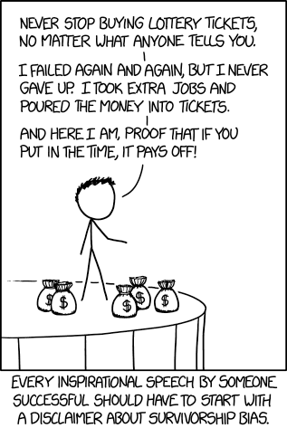
``` 
]

.pull-right[
```{r, echo=FALSE,out.width="80%",fig.show='hold',fig.align='center'}
knitr::include_graphics("bilder/survivorshipbias1.png")
``` 
]

---
class: top, left, hide_logo
<div class="footer"><span>Bild von <a href="https://pixabay.com/de/users/geralt-9301/?utm_source=link-attribution&utm_medium=referral&utm_campaign=image&utm_content=7010438">Gerd Altmann</a> auf <a href="https://pixabay.com/de//?utm_source=link-attribution&utm_medium=referral&utm_campaign=image&utm_content=7010438">Pixabay</a></div>

### Nun zu Ihnen ...

.center[
**Wer von Ihnen hat schon mal studiert?**
]

```{r, echo=FALSE,out.width="60%",fig.show='hold',fig.align='center'}
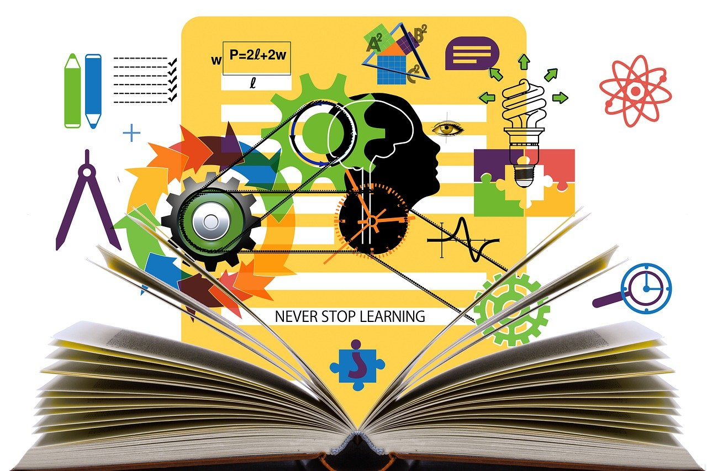
``` 


---
class: top, left, hide_logo

### Nun zu Ihnen ...

.center[
**Psychologie kann noch viel mehr!**
]

```{r, echo=FALSE,fig.show='hold',fig.align='center', out.width = "50%"}
knitr::include_graphics("bilder/Karriereperspektiven.png")
``` 

.center[
[https://cd.wiso.uni-koeln.de/de/team/juniorprofessur-fuer-organizational-behavior/j-prof-dr-annabelle-hofer/onlineveranstaltung-karriereperspektiven](https://cd.wiso.uni-koeln.de/de/team/juniorprofessur-fuer-organizational-behavior/j-prof-dr-annabelle-hofer/onlineveranstaltung-karriereperspektiven)
]

---
class: top, left, hide_logo
### Übersicht Lehrveranstaltung 

**13 Termine:** Dienstag 10:50 - 12:05 (Raum: P5 005)

**Begleitende Vorlesung:**
* "Einführung in die Psychologie und ihre Geschichte" freitags im Audimax
* Dozentin: Patricia Garatva ([patricia.garatva@charlotte-fresenius-uni.de](mailto:patricia.garatva@charlotte-fresenius-uni.de))

**Materialien:**
* Folien werden auf [studynet](https://studynet.hs-fresenius.de/goto_STUDYNETHSF_fold_47935.html) bereitgestellt in zwei Varianten: html (Links zwischen Folien funktionieren) und PDF
* Vielen Dank an Prof. Dr. Stephan Goerigk für Bereitstellung der Grundlage für die Materialien

**Prüfungsleistung:**
* Zeitraum für die Prüfungsanmeldung: 05.01.26 - 02.02.26
* Schriftliche Prüfung, voraussichtlich 120 Minuten (beide Vorlesungen gemeinsam) (ggf. nur 90 Minuten)

**Vorlesungsaufbau**: Theorie + vereinzelte interaktive Elemente + eine Literatursuch-Aufgabe pro Einheit

---
class: top, left, hide_logo
### Termine

```{r echo = F}
df = readxl::read_xlsx("EFPP_Termine.xlsx", sheet = "Tabelle1")[1:17, 1:3]
df$Datum = format(as.Date(df$Datum), "%d.%m.%Y")
df %>%
  kbl() %>%
  kable_styling(font_size = 16) %>%
  kable_classic(full_width = T) %>% 
  row_spec(c(8,11:13), background = "lightgray")
```

---
class: top, left, hide_logo
<div class="footer"><span>https://concept.paloaltou.edu/resources/business-of-practice-blog/developmental-psychology</div>

### Nun zu Ihnen ...

.center[
**Wer von Ihnen hat schon mal an einer psychologischen Studie teilgenommen?**
]

```{r, echo=FALSE,out.width="80%",fig.show='hold',fig.align='center'}
knitr::include_graphics("bilder/study.png")
``` 

---
class: top, left, hide_logo
### Ziele der Veranstaltung

#### Vermittelte Inhalte
* Meilensteine empirisch-wissenschaftlichen Arbeitens
* Herausforderungen und Möglichkeiten der Datenerhebung in der Psychologie, Gütekriterien
* Datenauswertung, Präsentation und Publikation wissenschaftlicher Forschungsergebnisse 
* Besonderheiten der Forschung im klinisch-psychologischen Kontext
*	Gute wissenschaftliche Praxis, ethische Prinzipien

#### Vermittelte Kompetenzen
* Beschreibung der basalen Kompetenzen wissenschaftlichen Arbeitens 
* Fundiertes Belegen von Aussagen, d. h. mit wissenschaftlichen Quellen

$\rightarrow$ **Sie sollen hier** ***nicht*** **detailliertes inhaltliches Wissen über konkrete psychologische Subdisziplinen erhalten** (dafür gibt es für jede Subdisziplin eine eigene Vorlesung). Stattdessen sollen Sie in der Lage sein zu erklären, ...
  * wie die Psychologie als Wissenschaft funktioniert
  * mit welchen Erhebungs- und Forschungsmethoden die psychologische Wissenschaft arbeitet
  * wie Sie selbst wissenschaftliche Forschung betreiben und beurteilen können

$\rightarrow$ **Sie hören bei mir eine Methodenvorlesung, die ich inhaltlich veranschaulichen möchte. **

---
class: top, left
<div class="footer"><span>Beispiel Icon erstellt von kerismaker - Flaticon: <a href="https://www.flaticon.com/de/kostenlose-icons/beispiel">https://www.flaticon.com/de/kostenlose-icons/beispiel</a></div>

### Prüfungsstoff

**Prinzipiell sind alle Folien prüfungsrelevant.**

Bestimmte Details sind nicht prüfungsrelevant:
* Details zu veranschaulichenden Beispielen (z. B. einzelne Biases aus der Übersicht über alle Biases, die wir gleich kennenlernen werden, oder Inhalte von Studien-Screenshots) $\rightarrow$ Sie sollten Beispiele nennen können, müssen die Beispiele aber nicht im Detail kennen; gekennzeichnet mit dem Glühbirnen-Symbol, das Sie auf dieser Folie sehen (sind auf einer Folie prüfungsrelevante Sachen UND Beispiele, entfällt das Glühbirnen-Symbol)
* Jahreszahlen zu Lebenszeiten
* wörtliche Zitate
* Quellenangaben, Literatur-, Video- oder Podcasthinweise: Sie müssen sich kein zusätzliches Wissen aneignen, wenn Sie verstehen, was ich während der Vorlesung zu den Folien erzähle $\rightarrow$ es ist aber sinnvoll, Aspekte nachzulesen, wenn Sie sie nicht verstanden haben

---
class: top, left
<div class="footer"><span>Alexander, V., & Hicks, R. E. (2016). Does class attendance predict academic performance in first year psychology tutorials?. <i>International Journal of Psychological Studies, 8</i>(1), 28-32. https://doi.org/10.5539/ijps.v8n1p28 <br> Donoghue, G. M., & Hattie, J. A. (2021). A meta-analysis of ten learning techniques. <i>Frontiers in Education, 6</i>. https://doi.org/10.3389/feduc.2021.581216 <br> Dunlosky, J., Rawson, K. A., Marsh, E. J., Nathan, M. J., & Willingham, D. T. (2013). Improving students’ learning with effective learning techniques: Promising directions from cognitive and educational psychology. <i>Psychological Science in the Public interest, 14</i>(1), 4-58. https://doi.org/10.1177/1529100612453266 <br> Friedman, M. C. (2014). Notes on note-taking: Review of research and insights for students and instructors. <i>Harvard Initiative for Learning and Teaching</i>, 1-34. <br> Marsh, E. J., & Sink, H. E. (2010). Access to handouts of presentation slides during lecture: Consequences for learning. <i>Applied Cognitive Psychology, 24</i>(5), 691-706. https://doi.org/10.1002/acp.1579 <br> Rayner, K., Schotter, E. R., Masson, M. E., Potter, M. C., & Treiman, R. (2016). So much to read, so little time: How do we read, and can speed reading help? <i>Psychological Science in the Public Interest, 17</i>(1), 4-34. https://doi.org/10.1177/1529100615623267</span></div>

### Was muss ich tun, damit ich hier was mitnehme?

Sie lernen in dieser Vorlesung viel Faktenwissen, aber sollen auch viel Verstehen.

**Dabei hilft (auch für eine gute Note):**

.pull-left[
* **Mitdenken**
* **Nachfragen**
* **Nachlesen** (Übung macht hier viel aus, um auch effizient relevante Informationen rauszulesen, vgl. [Rayner et al., 2016](https://doi.org/10.1177/1529100615623267))
* **Notizen machen** (am besten auf den Folien, vgl. [Marsh & Sink, 2010](https://doi.org/10.1002/acp.1579); siehe [Friedman, 2014](https://www.issup.net/knowledge-share/resources/2020-09/notes-note-taking) für Tipps, WIE man effizient Notizen macht)
* **Am Ball bleiben** ([Alexander & Hicks, 2016](https://research.bond.edu.au/en/publications/does-class-attendance-predict-academic-performance-in-first-year-))
* **auf sich selbst achten** (auch zu Hause bleiben, wenn man krank ist!)
]

.pull-right[
* **Zeit für die Vorlesungsnacharbeitung planen:** Quizzes machen und Gelerntes in eigenen Worten zusammenfassen (vgl. [Donoghue & Hattie, 2021](https://doi.org/10.3389/feduc.2021.581216) und [Dunlosky et al., 2013](https://journals.sagepub.com/doi/abs/10.1177/1529100612453266?journalCode=psia) für Bewertung der Effizienz von Lernstrategien)
* **Literatursuch-Aufgaben machen**
* **Geduld mit sich selbst haben**
* sich vor Augen führen (und im Zweifelsfall nachfragen), **warum die Inhalte für Sie als angehende Psycholog:innen relevant** sind
* **Feedback geben**
]

---
class: top, left, hide_logo
### Aus der Lehrevaluation letztes Semester...

```{r, echo=FALSE,fig.show='hold',fig.align='center'}
knitr::include_graphics("bilder/eval_1.png")
``` 

```{r, echo=FALSE,fig.show='hold',fig.align='center'}
knitr::include_graphics("bilder/eval_2.png")
``` 


---
class: top, left, hide_logo
name: content
### Heutige Themen

#### Wissenschaftliches Herangehen an Fragestellungen
* [Abgrenzung der Alltagspsychologie von wissenschaftlicher Psychologie](#abgrenzung)
* [Merkmale wissenschaftlichem Erkentnissgewinns](#methoden)
* [Begriffe einer empirischen Wissenschaft](#begriffe)

#### Was ist Psychologie? 
* [Definition wissenschaftlicher Psychologie](#definition)
* [Ziele wissenschaftlicher Psychologie](#ziele)

#### Take-aways, Literatur-Aufgabe und Schlüssel-/Fachbegriffe
* [Take-aways](#take-away)
* [Literatur-Aufgabe](#literatur)
* [Schlüssel-/Fachbegriffe](#words)

---
name: abgrenzung
class: top, left
<div class="footer"><span>Kapitel 2.1.1 in Myers, D.G. (2015). <i>Psychologie</i>. Springer. <br> ChatGPT(2023, 15. September). Antwort auf "Welche Sprichwörter widersprechen sich?". https://chat.openai.com/</span></div>

### Wissenschaftliches Herangehen an Fragestellungen

#### Alltagspsychologie: alles bekannt?

.center[
*"Manche Menschen sagen, Psychologie sei letztlich nichts anderes als in einen Fachjargon gepresstes Allgemeinwissen. »[...] Ihr werdet dafür bezahlt, dass ihr mit ausgefallenen Methoden das beweist, was meine Großmutter schon immer wusste.«"*

David G. Myers (2015)
]

**Sprichwörter:**
.pull-left[

1a. Gegensätze ziehen sich an.<br>
1b. Gleich und Gleich gesellt sich gern.

2a. Beurteile ein Buch nie nach seinem Einband.<br>
2b. Kleider machen Leute.
]

.pull-right[
3a. Was Hänschen nicht lernt, lernt Hans nimmermehr.<br>
3b. Man ist nie zu alt zum Lernen.

4a. Aus den Augen, aus dem Sinn.<br>
4b. Liebe wächst mit der Entfernung.
] 

ChatGPT dazu: *"Diese Beispiele zeigen, wie Sprichwörter unterschiedliche Perspektiven und Weisheiten vermitteln können, die sich in bestimmten Situationen widersprechen können."*

---
class: top, left, hide_logo

### Wissenschaftliches Herangehen an Fragestellungen

#### Alltagspsychologie: "Gegensätze ziehen sich an." vs. "Gleich und Gleich gesellt sich gern."

* Sie haben sicher *Meinungen* und *(Einzel-)Erfahrungen* dazu

* Mit wissenschaftlichen Untersuchungen werden diese Meinungen und Erfahrungen in Form von Hypothesen systematisch geprüft, indem Daten von vielen Personen gesammelt werden

* Auch individuelle und situative Bedingungen können dabei berücksichtigt werden

* Erst wenn sich in den Daten ein systematisches Muster zeigt (siehe Vorlesung Quantitative Methoden), können wir Schlüsse über das untersuchte Phänomen / die untersuchte Hypothese ziehen

---
class: top, left
<div class="footer"><span>Weidmann, R., Purol, M. F., Alabdullah, A., Ryan, S. M., Wright, E. G., Oh, J., & Chopik, W. J. (2023). Trait and facet personality similarity and relationship and life satisfaction in romantic couples. <i>Journal of Research in Personality, 104</i>, 104378. https://doi.org/10.1016/j.jrp.2023.104378</div>

### Wissenschaftliches Herangehen an Fragestellungen

#### Alltagspsychologie: "Gegensätze ziehen sich an." vs. "Gleich und Gleich gesellt sich gern."

.center[
```{r, echo=FALSE,out.width="43%",fig.show='hold',fig.align='center'}
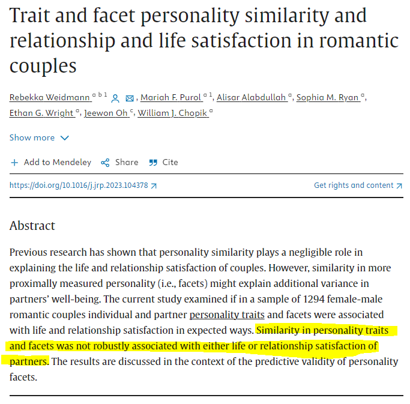
``` 
]


---
class: top, left
<div class="footer"><span>Humberg, S., Gerlach, T. M., Franke-Prasse, T., Geukes, K., & Back, M. D. (2023). Is (actual or perceptual) personality similarity associated with attraction in initial romantic encounters? A dyadic response surface analysis. <i>Personality Science, 4</i>, 1-25. https://doi.org/10.5964/ps.7551</div>

### Wissenschaftliches Herangehen an Fragestellungen

#### Alltagspsychologie: "Gegensätze ziehen sich an." vs. "Gleich und Gleich gesellt sich gern."

.center[
```{r, echo=FALSE,out.width="43%",fig.show='hold',fig.align='center'}
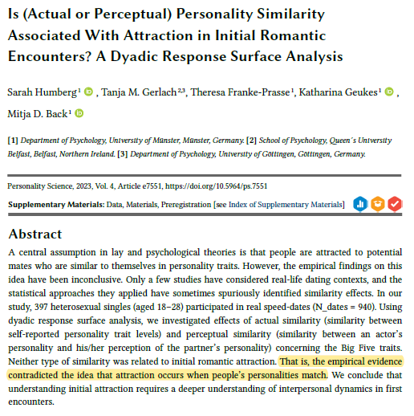
``` 
]

---
class: top, left
<div class="footer"><span>https://commons.wikimedia.org/wiki/File:Cognitive_Bias_Codex_-_180%2B_biases,_designed_by_John_Manoogian_III_(jm3).jpg</span></div>

### Wissenschaftliches Herangehen an Fragestellungen

#### Alltagspsychologie: kognitive Verzerrungen (Biases)

.center[
```{r, echo=FALSE,out.width="55%",fig.cap=" ",fig.show='hold',fig.align='center'}
knitr::include_graphics(c("bilder/biases.jpg"))
``` 
]

---
class: top, left
<div class="footer"><span>Oeberst, A., & Imhoff, R. (2023). Toward Parsimony in Bias Research: A Proposed Common Framework of Belief-Consistent Information Processing for a Set of Biases. <i>Perspectives on Psychological Science. 18</i>(6). 1464-1487. https://doi.org/10.1177/17456916221148147</span></div>

### Wissenschaftliches Herangehen an Fragestellungen

#### Alltagspsychologie: kognitive Verzerrungen (Biases)

<br>
.pull-left[
```{r, echo=FALSE,fig.cap=" ",fig.show='hold',fig.align='center'}
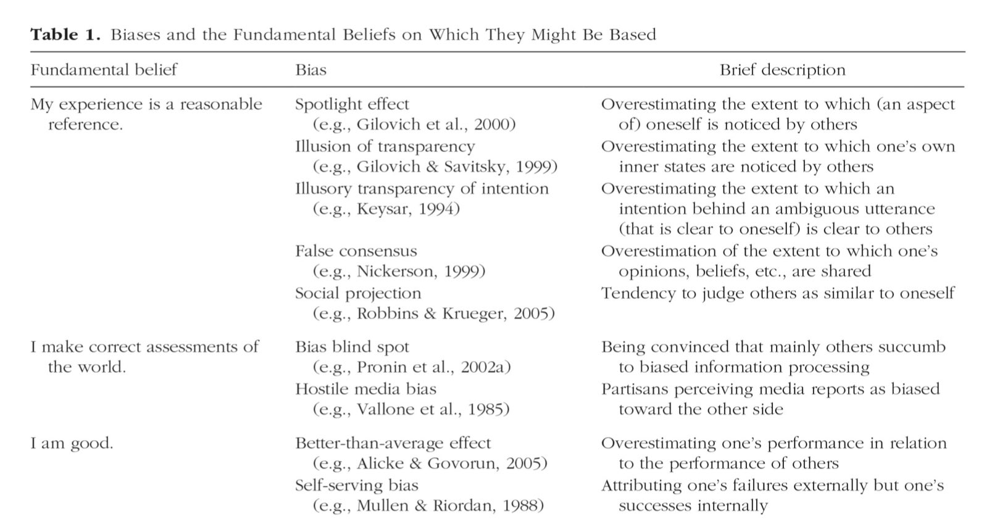
``` 
]

.pull-right[
```{r, echo=FALSE,fig.cap=" ",fig.show='hold',fig.align='center'}
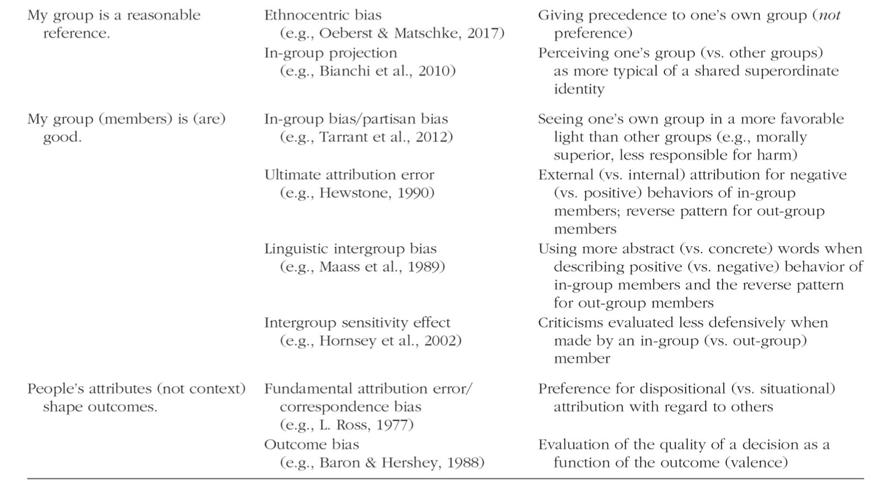
``` 
]

---
class: top, left
<div class="footer"><span>Kapitel 2.1.1 in Myers, D.G. (2015). <i>Psychologie.</i> Springer.</div>

### Wissenschaftliches Herangehen an Fragestellungen

#### Alltagspsychologie: Beispiel Hindsight Bias (Rückschaufehler)

.center[
*"Wir leben das Leben vorwärts, aber wir verstehen es rückwärts."*

Søren Kierkegaard
]

.pull-left[

<br>
<br>
<br>

Der *Hindsight Bias* beschreibt die Tendenz, nach dem Eintreten eines Ereignisses zu glauben, man hätte es vorhersehen können.
]

.pull-right[
```{r, echo=FALSE,out.width="75%",fig.cap=" ",fig.show='hold',fig.align='center'}
knitr::include_graphics(c("bilder/hindsightbias.png"))
``` 
]

---
class: top, left, hide_logo
name: methoden

### Wissenschaftliches Herangehen an Fragestellungen

#### Wissenschaftliche Methoden

* **generell**: Menge geordneter  Schritte  zur  Analyse  und  Beantwortung von  Fragestellungen
* **speziell empirische Methoden**: Nutzung möglichst  objektiv und systematisch erhobener bzw. gemessener  Informationen  (z. B. Beobachtungen, Erfahrungen, Befragungen) als  Faktenbasis  für  wissenschaftlich  korrekte Schlussfolgerungen
* **Empirische Wissenschaft** = "Erfahrungswissenschaft", **empirisches Wissen** = "Erfahrungswissen"

#### Psychologische Methodenlehre

* Instrumentarium, um psychologische Theorien systematisch zu entwickeln und zu überprüfen 

* manchmal mehrere Zugänge zur Erkenntnis (**Methodenpluralismus**)

* Wissenschaftliche Methodik unterscheidet Psychologie von Alltagspsychologie

* Wissenschaftliche Systematik ermöglicht es, individuelle psychologische Eigenschaften **vergleichbar** zu erfassen

> **Welche Erhebungsmethoden der Psychologie fallen Ihnen bereits jetzt ein?**

---
class: top, left, hide_logo
<div class="footer"><span>Kapitel 1.1 in Döring, N. & Bortz, J. (2016). <i>Forschungsmethoden und Evaluation in den Sozial- und Humanwissenschaften.</i> Pearson.</span></div>

### Wissenschaftliches Herangehen an Fragestellungen

#### Abgrenzung wissenschaftlichen Erkenntnisgewinns von anderen Zugängen

Argumentation mit Berufung auf ...
.pull-left[
* **Autoritätspersonen**
* **Religion**
* **Tradition**
]

.pull-right[
* **gesunden Menschenverstand**
* **Intuition**
* **anekdotische Evidenz**
* **Logik**
]

... kann im Einzelfall zutreffend sein und/oder sich als nützlich erweisen

... ist aber oft nicht nachvollziehbar, vorurteilsbehaftet und/oder widersprüchlich<br>
... ist vorallem häufig nicht auf Basis (aktueller) empirischer Daten systematisch überprüft oder überhaupt überprüfbar<br>
... nutzt fast immer Wissen, welches **nicht den zentralen Merkmalen von wissenschaftlicher Wissensproduktion** genügt<br>

> **Überlegen Sie sich eine Fragestellung, für die eine Argumentation auf Basis von Logik problematisch sein kann ("Es wäre unlogisch, ...").**
<!-- Immer, wenn Menschen oder Gruppen nicht rational handeln: Es wäre logisch, mit dem Rauchen aufzuhören, wenn man lange leben möchte (trotzdem rauchen Menschen, die lange leben möchten). Es wäre nicht logisch, sich geeignete Bewerberinnen durch die Lappen gehen zu lassen (trotzdem scheint das zu passieren). -->

---
class: top, left, hide_logo
<div class="footer"><span>Kapitel 1.1 in Döring, N. & Bortz, J. (2016). <i>Forschungsmethoden und Evaluation in den Sozial- und Humanwissenschaften.</i> Pearson. </span></div>

### Wissenschaftliches Herangehen an Fragestellungen

#### Merkmale von wissenschaftlicher Wissensproduktion in human-/sozialwissenschaftlicher Forschung

.pull-left[
**1.** Formulieren empirisch untersuchbarer und gut begründeter **Forschungsfragen und -hypothesen** (wichtig für **Falsifizierbarkeit** der Forschung)

**2.** Berücksichtigen des **Forschungsstandes** und ausdrücklicher **Theoriebezug**

**3.** $\rightarrow$ **Systematisches Erheben, Aufbereiten und Analysieren von empirischen Daten** zum Forschungsproblem mithilfe wissenschaftlicher Methoden unter Einhaltung wissenschaftlicher Gütekriterien

**4.** $\rightarrow$ Vorgehen gemäß **etablierter wissenschaftlicher Methodologie** unter Einhaltung wissenschaftlicher Gütekriterien
]

.pull-right[
**5.** $\rightarrow$ Vorgehen gemäß Prinzipien der **Forschungs-/Wissenschaftsethik** 

**6.** $\rightarrow$ Ausführliche schriftliche **Dokumentation** des Forschungsprozesses und **Archivierung** des Datenmaterials zwecks Nachvollziehbarkeit und Nachprüfbarkeit (wichtig für **Transparenz und Replizierbarkeit** der Forschung)

**7.** **Ausgewogene Ergebnisinterpretation** mit Hinweisen auf widersprüchliche Befunde und auf Grenzen der Aussagekraft einer Studie 

**8.** **Wissenschaftliche Veröffentlichung** einer Studie – möglich nach fachkundiger Begutachtung (**Peer Review**)
]

.center[
*Punkte mit $\rightarrow$ sind Fokus dieser Vorlesung.*
]

---
class: top, left, hide_logo
<div class="footer"><span>Kapitel 2.1.4 und 2.1.5 in Myers, D.G. (2015). <i>Psychologie.</i> Springer. </span></div>

### Wissenschaftliches Herangehen an Fragestellungen

#### Kritisches Denken auf wissenschaftlicher Basis

.center[
**Die wissenschaftliche Haltung: neugierig, skeptisch und bescheiden**
Denn: "Wer nichts weiß, muss alles glauben" (Marie Freifrau Ebner von Eschenbach)
]

.pull-left[
##### Neugier:
* Fragen stellen!
* Definitionen klären
* Effekte in Relation stellen (verglichen wozu ist ein Effekt groß/klein?)

##### Bescheidenheit:
* eigene Anfälligkeit für Biases beachten
* komplexe Fragen: einfache Antworten selten
* Wissenschaft ist ein iterativer Prozess: Viele Schlussfolgerungen sind unsicher und vorläufig
* Wahrscheinlichkeit ≠ Determinismus
]

.pull-right[
##### Skepsis:
* Vorannahmen hinterfragen
* Falsifizierbarkeit (Widerlegbarkeit) prüfen
* empirische Evidenz prüfen
* Methodenauswahl prüfen
* Alternativerklärungen prüfen
* Schlussfolgerungen prüfen (z. B. Korrelation ≠ Kausalität; Die Sonne geht nicht auf, weil der Hahn kräht)

> Was sind weitere plausible Beispiele für Korrelation ≠ Kausalität?
] 


---
class: top, left, hide_logo
<div class="footer"><span>Kapitel 2.1.4 und 2.1.5 in Myers, D.G. (2015). <i>Psychologie.</i> Springer. </span></div>

### Wissenschaftliches Herangehen an Fragestellungen

#### Kritisches Denken auf wissenschaftlicher Basis

Keine Wissenschaftsgläubigkeit: Nur weil es (wissenschaftliche) Literatur zu einem Thema gibt, heißt das nicht, dass diese unbedingt gut ist. **Skepsis gilt auch innerhalb der Wissenschaft!**

.pull-left[
```{r, echo=FALSE,fig.show='hold',fig.align='center'}
knitr::include_graphics("bilder/McKay2023-1.PNG")
``` 
]

.pull-right[
```{r, echo=FALSE,fig.show='hold',fig.align='center'}
knitr::include_graphics("bilder/McKay2023-2.PNG")
``` 
]
---
class: top, left, hide_logo
name: begriffe
<div class="footer"><span>Kapitel 2.2.1 in Myers, D.G. (2015). <i>Psychologie.</i> Springer.<br> Glossar in Eid, M., Gollwitzer, M., & Schmitt, M. (2017). <i>Statistik und Forschungsmethoden.</i> Beltz. </div>

### Wissenschaftliches Herangehen an Fragestellungen

#### Begriffe einer empirischen Wissenschaft

**Hypothese** (griech.) = Unterstellung, Vermutung:  

* eine in Form einer logischen Aussage formulierte Annahme, deren Gültigkeit man zwar für möglich hält, die aber noch zu prüfen ist
* Hypothesen sollen prüfbare Vorhersagen machen (**empirisch testbar** und **falsifizierbar**).
* Hypothesen werden meist aus Theorien abgeleitet

**Theorie**:

* Integration von Wissen in ein kohärentes (logisch widerspruchsfreies) theoretisches Gedankengebäude 
* Eine Theorie enthält in der Regel **beschreibende (deskriptive)** und **erklärende (kausale)** Aussagen über einen Teil der Realität
* Theorien sind nur Annähherungen an die Wirklichkeit: unvollständig, kontextabhängig und nicht endgültig
* Auf Grundlage von Theorien werden Hypothesen abgeleitet und Vorhersagen getroffen 

$\rightarrow$ Eine Theorie ist "mehr" als eine Hypothese, da sie ein Phänomen umfassend beschreibt und erklärt (höheres Erklärungsvermögen). Aus einer Theorie kann man mehrere Hypothesen ableiten.

---
class: top, left
<div class="footer"><span>Byrne, D. (1997). An overview (and underview) of research and theory within the attraction paradigm. <i>Journal of Social and Personal Relationships, 14</i>(3), 417-431.</div>

### Wissenschaftliches Herangehen an Fragestellungen

#### Begriffe einer empirischen Wissenschaft

**Beispiel für eine Theorie**

.center[
```{r, echo=FALSE,out.width="65%",fig.show='hold',fig.align='center'}
knitr::include_graphics("bilder/byrne1997.PNG")
``` 
]

---
class: top, left
<div class="footer"><span>Wittchen, H.-U. & Hoyer, J. (2011). <i>Klinische Psychologie & Psychotherapie.</i> Springer.</div>

### Wissenschaftliches Herangehen an Fragestellungen

#### Begriffe einer empirischen Wissenschaft

**Beispiel für eine Theorie**

.center[
```{r, echo=FALSE,out.width="60%",fig.show='hold',fig.align='center'}
knitr::include_graphics("bilder/theorie.PNG")
``` 
]

---
class: top, left, hide_logo

### Wissenschaftliches Herangehen an Fragestellungen

#### Begriffe einer empirischen Wissenschaft

**Gesetz(mäßigkeit)**: Feststellungen über Zusammenhänge, die durch empirische Evidenz als relativ gut gesichert angenommen werden können. "Wenn x, dann y ..."

**Besonderheiten psychologischer "Gesetzes"-aussagen:**

* keine Formulierung von Naturgesetzen, sondern Aussagen, die für viele Fälle zutreffen, aber nicht für alle, d. h. Vorhersagen für einen ganz konkreten Fall sind nicht (mit Sicherheit) möglich

.center[
```{r eval = TRUE, echo = F, out.width = "70%"}
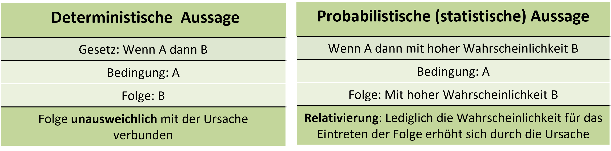
```
]

$\rightarrow$ Wissenschaftliche Hypothesen/Gesetzesaussagen in der Psychologie sind **Wahrscheinlichkeitsaussagen**!

---
class: top, left, hide_logo
<div class="footer"><span>Dörner, D. & Selg, H. (1985). <i>	Psychologie – Eine Einführung in ihre Grundlagen und Anwendungsfelder.</i> Kohlhammer.</div>

### Wissenschaftliches Herangehen an Fragestellungen

#### Begriffe einer empirischen Wissenschaft

<br><br>

.center[
.content-box-gray[**Satzsysteme**: Theorien, Modelle, Gesetze]

$\downarrow$ $\uparrow$

.content-box-gray[**Einzelsätze**: Hypothesen = prüfbare Behauptungen über empirisch beobachtbare Sachverhalte]

$\downarrow$ $\uparrow$

.content-box-gray[**Realität**: Bereich der empirisch beobachtbaren Phänomene]
]

<br><br>
Grundkonzeption empirischer Wissenschaften: empirische Prüfbarkeit ihrer Sätze (Dörner & Selg, 1985)

---
class: top, left, hide_logo
### Wissenschaftliches Herangehen an Fragestellungen

#### Begriffe einer empirischen Wissenschaft

##### Verifikation

.pull-left[
* Wissenschaftliche Hypothesen in der Psychologie können meist nicht vollständig geprüft (**verifiziert**) werden

* Es ist in der Regel (!) nicht möglich, alle Fälle einer Zielgruppe (**Population**) zu untersuchen, schon gar nicht für alle Zeiten

**Workaround**:

* Untersuchungen erfolgen anhand **repräsentativer Stichprobe**, von der auf Population geschlossen wird
]

.pull-right[
```{r eval = TRUE, echo = F, out.width = "400px"}
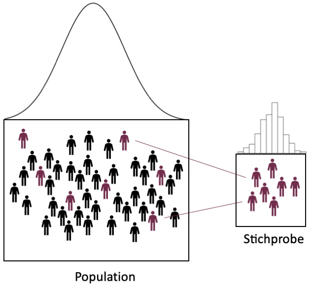
```
]
---
class: top, left, hide_logo
### Wissenschaftliches Herangehen an Fragestellungen

#### Begriffe einer empirischen Wissenschaft

##### Falsifikation

.pull-left[
* Hypothesen als Wahrscheinlichkeitsaussagen können durch **Einzelfälle/Gegenbeispiele** (!), die der Hypothese widersprechen, nicht widerlegt (**falsifiziert**) werden. Das bedeutet: Konträre Einzelfälle sind explizit zugelassen
]

.pull-right[
```{r eval = TRUE, echo = F, out.width = "150px"}

```
]

* Der auf dem Falsifikationsprinzip basierende Erkenntnisfortschritt besteht dann in der Eliminierung **falscher** bzw. **schlecht bewährter Hypothesen** (oder ganzer Theorien) durch statistische Analysen von Stichprobendaten

* Anders ausgedrückt: Um Wahrscheinlichkeitsaussagen falsifizierbar machen zu können, bedienen wir uns eines methodischen Kriteriums ( $\rightarrow$ Signifikanztest, siehe Vorlesung Quantitative Methoden) 

* Nicht falsifizierte Hypothesen (oder Theorien) sind nicht wahr, sondern gelten nur als vorläufig angenommen

---
class: top, left
<div class="footer"><span>https://www.clearerthinking.org/post/does-astrology-work</span></div>

### Wissenschaftliches Herangehen an Fragestellungen

.center[
<iframe width="560" height="315" src="https://www.youtube.com/embed/0wHs5Odzlto?si=XR8oqQVfjwmTgoVZ" title="YouTube video player" frameborder="0" allow="accelerometer; autoplay; clipboard-write; encrypted-media; gyroscope; picture-in-picture; web-share" referrerpolicy="strict-origin-when-cross-origin" allowfullscreen></iframe>
]

---
class: top, left, hide_logo
### Heutige Themen

#### Wissenschaftliches Herangehen an Fragestellungen
* [Abgrenzung der Alltagspsychologie von wissenschaftlicher Psychologie](#abgrenzung)
* [Merkmale wissenschaftlichem Erkentnissgewinns](#methoden)
* [Begriffe einer empirischen Wissenschaft](#begriffe)

#### Was ist Psychologie? 
* [Definition wissenschaftlicher Psychologie](#definition)
* [Ziele wissenschaftlicher Psychologie](#ziele)

#### Take-Aways, Literaturaufgabe und Schlüssel-/Fachbegriffe
* [Take-Aways](#take-away)
* [Literaturaufgabe](#literatur)
* [Schlüssel-/Fachbegriffe](#words)		  

---
name: definition
class: top, left, hide_logo
<div class="footer"><span>https://www.dgps.de/psychologie-studieren/infos-zum-studium/psychologie-was-ist-das/</span></div>

### Was ist Psychologie?

#### Was macht die Psychologie einzigartig?

.center[
**Frage**:

„Womit befasst sich die Psychologie?“

Wissenschaftlich ausgedrückt: 

„Was ist der Gegenstand der Psychologie?“
]

<br>

**Definition der Deutschen Gesellschaft für Psychologie (2023)**:

"*Psychologie ist die Wissenschaft, die sich mit den Gedanken, Gefühlen und dem Verhalten des Menschen beschäftigt. Dabei geht es einerseits um Gesetzmäßigkeiten, die alle Menschen betreffen, andererseits aber auch um individuelle Unterschiede und darum, was unser Erleben und Handeln beeinflusst.*"

---
class: top, left, hide_logo

### Was ist Psychologie?

#### Was macht Psychologie einzigartig?

Gegenstand der Psychologie:

* **menschliches Erleben**
  - Gedanken
  - Gefühle
* **menschliches Verhalten**

... dabei relevant:

* **Gesetzmäßigkeiten**, die alle Menschen betreffen (im Durchschnitt – d. h. probabilistisch)
* **individuelle Unterschiede** zwischen Menschen

... sowie:

* **Bedingungen und Ursachen**
  - innere (im Individuum angesiedelte)
  - äußere (in der Umwelt lokalisierte)

---
class: top, left, hide_logo
### Was ist Psychologie?

#### Was macht Psychologie einzigartig? 

**Gegenstand psychologischer Untersuchungen**: Individuum (Neugeborenes, Athlet, Student, Patient ...) oder Gruppen (Paare, Familien, Teams ...)

**Verhalten**: Mittel, durch welches sich ein Individuum an die Umwelt anpasst

.pull-left[
* wesentlicher Teil der Psychologie: **beobachtbares Verhalten**
  - Lachen
  - Weinen
  - Sprechen
  - Berühren
  - ...
]
.pull-right[

* Aber: Viele menschliche Aktivitäten laufen als private, **innere Bewusstseinsprozesse** ab
  - Denken
  - Schlussfolgern
  - Fantasieren
  - Träumen
  - ...
]  

**Annahme der meisten Psychologen**: Menschliches Verhalten ist ohne mentale/kognitive Prozesse (Erleben, Bewusstsein) nicht verständlich.

---
class: top, left, hide_logo
name: ziele

### Was ist Psychologie?

#### Ziele der Psychologie

**1. Beschreibung**

**2. Erklärung**

**3. Vorhersage**

**4. Beeinflussung**

... menschlichen Verhaltens und Erlebens (Gegenstand der Psychologie)

---
class: top, left, hide_logo
### Was ist Psychologie?

#### Ziele der Psychologie

##### Beschreibung

Merkmale des menschlichen Verhaltens und Erlebens ...
* benennen
* definieren
* quantifizieren
* deskriptiv als zusammenhängend beschreiben: welche Variablen treten häufig gemeinsam auf? was geht häufig mit einem bestimmten Verhalten und Erleben einher? (hier ist die Trennung zum Ziel der Vorhersage insbesondere darin, dass paarweise nur zwei Variablen betrachtet werden)

**Beschreibungsebenen**: behavioral, kognitiv, emotional, physiologisch

**Wahl von angemessenen Detailgrad nötig**: grob vs. spezifisch

Unabhängig von Detailgrad: **so objektiv wie möglich**

---
class: top, left
### Was ist Psychologie?

#### Ziele der Psychologie

##### Beschreibung

.pull-left[

**Wahl von angemessenen Detailgrad nötig**: grob vs. spezifisch

> **Sie wollen sich mit einem Freund vor diesem Gemälde verabreden. Wie würden Sie es beschreiben?**

<br>
> **Sie wollen, dass Ihr Freund das Gemälde exakt kopiert. Wie würden Sie es beschreiben?**
]

.pull-right[
.center[
```{r eval = TRUE, echo = F, out.width = "250px"}

```
]
]

---
class: top, left
### Was ist Psychologie?

#### Ziele der Psychologie

##### Beschreibung

**Wahl von angemessenen Detailgrad nötig**: grob vs. spezifisch

**Beispielverhalten**: jemanden überzeugen

.pull-left[
**Beispiel Sprache**:

* Gespräch
* Aussage
* Satz
* Wort
* Phonem (Sprachlaut)
* Buchstabe
]

.pull-right[
**Beispiel Physiologie**:

* Gehirn
* Frontallappen
* Gyrus praecentralis (Teil des Frontallappens)
* Neuron
* Synapse
* Protein
]

---
class: top, left
<div class="footer"><span>Caron, J., & Liu, A. (2010). A descriptive study of the prevalence of psychological distress and mental disorders in the Canadian population: comparison between low-income and non-low-income populations. <i>Health Promotion and Chronic Disease Prevention in Canada, 30</i>(3), 84-94. https://doi.org/10.24095/hpcdp.30.3.03</span></div>

### Was ist Psychologie?

#### Ziele der Psychologie

##### Beschreibung

**Beispiel**: Prävalenz von psychischen Problemen in Kanada bei Personen mit hohem und niedrigem Einkommen

.pull-left[
```{r, echo=FALSE,fig.show='hold',fig.align='center'}
knitr::include_graphics("bilder/Caron2010-1.PNG")
``` 
]

.pull-right[
```{r, echo=FALSE, out.width = "80%", fig.show='hold',fig.align='center'}
knitr::include_graphics("bilder/Caron2010-2.PNG")
``` 
]


---
class: top, left
<div class="footer"><span>Foster, K., Roche, M., Giandinoto, J. A., & Furness, T. (2020). Workplace stressors, psychological well‐being, resilience, and caring behaviours of mental health nurses: A descriptive correlational study. <i>International Journal of Mental Health Nursing</i>, 29(1), 56-68. https://doi.org/10.1111/inm.12610</span></div>

### Was ist Psychologie?

#### Ziele der Psychologie

##### Beschreibung

**Beispiel**: Beschreibung von Stressoren am Arbeitsplatz von Pflegenden im mentalen Gesundheitsbereich und Beschreibung der Zusammenhänge von Resilienz und Wohlbefinden in dieser Zielgruppe

.pull-left[
```{r, echo=FALSE,fig.show='hold',fig.align='center'}
knitr::include_graphics("bilder/Foster2020-1.PNG")
``` 
]

.pull-right[
```{r, echo=FALSE, out.width = "95%",fig.show='hold',fig.align='center'}
knitr::include_graphics("bilder/Foster2020-2.PNG")
``` 
]

---
class: top, left
<div class="footer"><span>Willführ, K. P., Klüsener, S. (2024). The current ‘dramatically’ high paternal ages at childbirth are not unprecedented, <i>Human Reproduction</i>, deae067. https://doi.org/10.1093/humrep/deae067</span></div>

### Was ist Psychologie?

#### Ziele der Psychologie

##### Beschreibung

<iframe src="https://lpac-database.shinyapps.io/Data/" style="width: 100%; height: 500px; border-style:none"></iframe>

---
class: top, left, hide_logo

### Was ist Psychologie?

#### Ziele der Psychologie

#####  Erklärung

.pull-left[
* **Regelhafte Muster** in Verhalten und mentalen Prozessen finden, die auf Ursache-Wirkungs-Beziehung zurückzuführen sind

* Erklärungen gehen über die Beschreibung hinaus

* Ideal:
  - Identifizieren von **Kausalitäten**, d. h. Verstehen, "wie etwas funktioniert" und "warum es so passiert"
  - **Alternativerklärungen** ausschließen
  
> **Was sind mögliche internale und externale Ursachen dafür, dass Menschen rauchen?**
]

.pull-right[
* Für Verhalten und Erleben gibt es i. d. R. eine **Kombination** von Ursachen
  - internale/innere/organismische/dispositionelle Variablen
  - externale/äußere/situationale/Umwelt- Variablen
  
* **Determinanten** = bedingende Faktoren
  - Bei Kausalität wird eher von "Determinante" gesprochen
  - Bei rein korrelativer Vorhersagekraft wird eher von "Prädiktor" gesprochen (siehe Ziel "Vorhersage")
]

---
class: top, left
<div class="footer"><span>Emmer, C., Dorn, J., & Mata, J. (2024). The immediate effect of discrimination on mental health: A meta-analytic review of the causal evidence. <i>Psychological Bulletin, 150</i>(3), 215–252. https://doi.org/10.1037/bul0000419</span></div>

### Was ist Psychologie?

#### Ziele der Psychologie

##### Erklärung

**Beispiel**: Diskriminierung als Determinante von mentaler Gesundheit

.pull-left[
```{r, echo=FALSE,fig.show='hold',fig.align='center'}
knitr::include_graphics("bilder/Emmer2024-1.PNG")
``` 
]

.pull-right[
```{r, echo=FALSE,out.width = "90%", fig.show='hold',fig.align='center'}
knitr::include_graphics("bilder/Emmer2024-2.PNG")
``` 
]

---
class: top, left
<div class="footer"><span>Loewenstein, G., Krishnamurti, T., Kopsic, J., & Mcdonald, D. (2015). Does increased sexual frequency enhance happiness?. <i>Journal of Economic Behavior & Organization, 116</i>, 206-218. https://doi.org/10.1016/j.jebo.2015.04.021</span></div>

### Was ist Psychologie?

#### Ziele der Psychologie

##### Erklärung

**Beispiel**: Ist Häufigkeit von Sex eine kausale Ursache von genereller Glücklichkeit?

.center[
```{r, echo=FALSE,out.width="50%",fig.show='hold',fig.align='center'}
knitr::include_graphics("bilder/Loewenstein2015.PNG")
``` 
]

---
class: top, left
<div class="footer"><span>Yarkoni, T., & Westfall, J. (2017). Choosing prediction over explanation in psychology: Lessons from machine learning. <i>Perspectives on Psychological Science, 12</i>(6), 1100-1122.</div>

### Was ist Psychologie?

#### Ziele der Psychologie

.center[
```{r, echo=FALSE,out.width="63%",fig.show='hold',fig.align='center'}
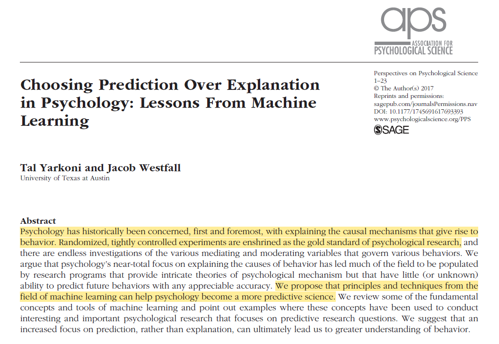
``` 
]

---
class: top, left, hide_logo

### Was ist Psychologie?

#### Ziele der Psychologie

##### Vorhersage

* Bestimmen von **Wahrscheinlichkeit** des Auftretens eines bestimmten Ereignisses mit hinreichender Genauigkeit

* Vorhersagen müssen **exakt** formuliert werden, um prüfbar zu sein: Wann und unter welchen **Bedingungen** tritt ein Ereignis (mit gewisser/erhöhter Wahrscheinlichkeit) ein?

* Basis für Vorhersagen sind meist nicht Daten von nur einer bestimmten Person, sondern Daten mehrerer Personen ( $\rightarrow$ Stichprobe) 

$\rightarrow$ Es geht um Wahrscheinlichkeiten und um mittlere Effekte. Simplifizierung, die mitgedacht werden muss. 

$\rightarrow$ Kein angenommener Determinismus!

---
class: top, left, hide_logo
<div class="footer"><span>Sutton, S. (1994). The past predicts the future: Interpreting behaviour-behaviour relationships in social psychological models of health behaviour. In D. R. Rutter & L. Quine (Eds.), <i>Social psychology and health: European perspectives</i> (pp. 71-88). Avebury Press.</div>

### Was ist Psychologie?

#### Ziele der Psychologie

##### Vorhersage

* Vorhersage setzt häufig gute Erklärung voraus 

* Wenn mehrere Erklärungen denkbar sind, "gewinnt" die wahrscheinlichste (beste Vorhersage)

* Erklärungen sind aber auch nicht immer nötig: Siehe Einheit zu Machine Learning ("Black Box"-Vorhersagen)

<br>

.center[
*"Vergangenes Verhalten ist der beste Prädiktor für zukünftiges Verhalten."*

Sutton (1994)
]


$\rightarrow$ Vergangenes Verhalten ist meist nicht die kausale Ursache für jetziges Verhalten, aber leistet in der Regel trotzdem eine gute Vorhersagekraft


---
class: top, left
<div class="footer"><span>Joel, S., Eastwick, P. W., Allison, C. J., Arriaga, X. B., Baker, Z. G., Bar-Kalifa, E., ... & Wolf, S. (2020). Machine learning uncovers the most robust self-report predictors of relationship quality across 43 longitudinal couples studies. <i>Proceedings of the National Academy of Sciences, 117</i>(32), 19061-19071. https://doi.org/10.1073/pnas.1917036117</span></div>

### Was ist Psychologie?

#### Ziele der Psychologie

##### Vorhersage

**Beispiel**: Vorhersage von Partnerschaftsqualität

.pull-left[
```{r, echo=FALSE,fig.show='hold',fig.align='center'}
knitr::include_graphics("bilder/Joel2020-1.PNG")
``` 
]

.pull-right[
```{r, echo=FALSE,fig.show='hold',fig.align='center'}
knitr::include_graphics("bilder/Joel2020-2.PNG")
``` 
]

---
class: top, left
<div class="footer"><span>Koutsouleris, N., Dwyer, D. B., Degenhardt, F., Maj, C., Urquijo-Castro, M. F., Sanfelici, R., ... & PRONIA Consortium. (2021). Multimodal machine learning workflows for prediction of psychosis in patients with clinical high-risk syndromes and recent-onset depression. JAMA psychiatry, 78(2), 195-209. https://doi.org/10.1001/jamapsychiatry.2020.3604</span></div>

### Was ist Psychologie?

#### Ziele der Psychologie

##### Vorhersage

**Beispiel:** [PRONIA](https://nachrichten.idw-online.de/2021/01/28/pronia-projekt-entwickelt-prognosemodelle-fuer-die-psychiatrie) – Studie zur Vorhersage von Psychose-Onset im Prodrom (Krise oder Erkrankungsbeginn)

.pull-left[
```{r, echo=FALSE,fig.show='hold',fig.align='center'}
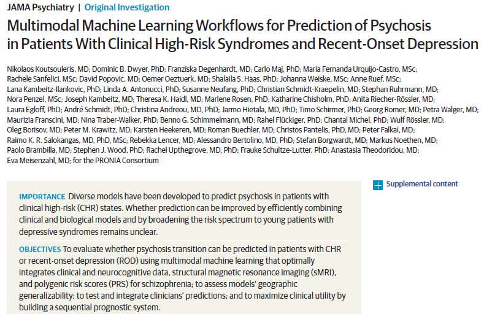
``` 
]

.pull-right[
```{r, echo=FALSE,out.width = "85%", fig.show='hold',fig.align='center'}
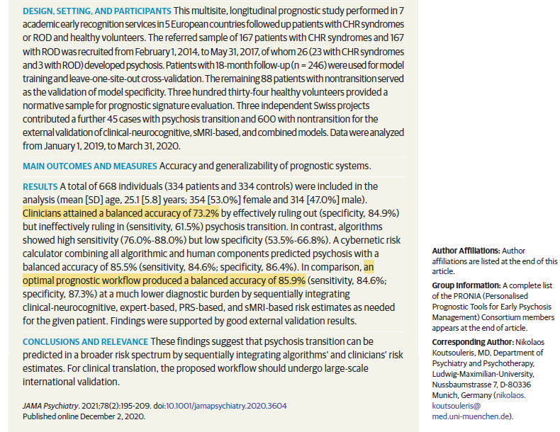
``` 
]
---
class: top, left, hide_logo
### Was ist Psychologie?

#### Ziele der Psychologie

#####  Beeinflussung

* **Form, Stärke und Auftretenswahrscheinlichkeit** von Verhalten oder mentalen Prozessen beeinflussen

* Verhalten und Erleben ...
  - auftreten lassen
  - aufrechterhalten
  - beenden
  
* Setzt häufig genaue Beschreibung/Erklärung/Vorhersage voraus

* **Wirksame, evidenzbasierte Interventionen** für viele Psycholog:innen das zentralste Ziel (z. B. Psychotherapie)

* Prüfung der Wirksamkeit von Interventionen in sogenannter **Evaluationsforschung**

<!--<br>
**[Note-Pad](https://docs.google.com/document/d/1QePMxyyP7yH1sTaqcPsYyM3Y7tXr-N8wS0v_p9oi4jQ/edit?usp=sharing):** Was fallen Ihnen für psychologische Möglichkeiten der **Einflussnahme** ein?-->

---
class: top, left
<div class="footer"><span>Breedvelt, J. J., Karyotaki, E., Warren, F. C., Brouwer, M. E., Jermann, F., Hollandare, F., ... & Bockting, C. L. (2024). An individual participant data meta-analysis of psychological interventions for preventing depression relapse. <i>Nature Mental Health</i>, 1-10. https://doi.org/10.1038/s44220-023-00178-x</span></div>

### Was ist Psychologie?

#### Ziele der Psychologie

##### Vorhersage

**Beispiel:** Beeinflussung der Wahrscheinlichkeit von Depressionsrückfall durch Psychotherapie

.pull-left[
```{r, echo=FALSE,fig.show='hold'}
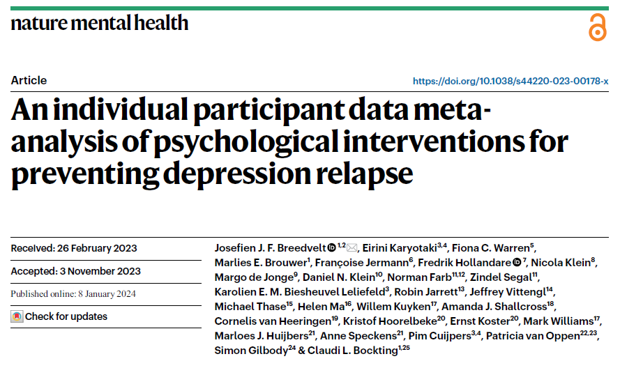
``` 
]

.pull-right[
```{r, echo=FALSE,fig.show='hold'}
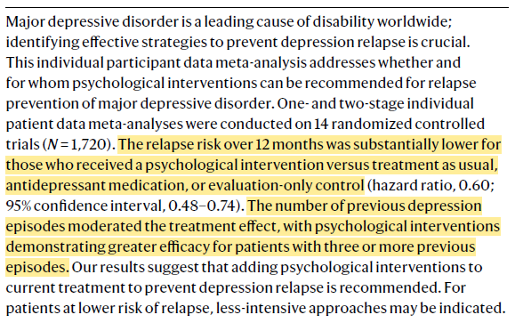
``` 
]

---
class: top, left, hide_logo

### Was ist Psychologie?

#### Psychologie als Wissenschaft?

* **Ausgangslage**: Verhalten des Menschen ist beobachtbar ( $\rightarrow$ **manifeste Merkmale**), aber Erleben ist nur subjektiv erfahrbar und damit nicht beobachtbar ( $\rightarrow$ **latente Merkmale**)

* Rückgriff auf **Introspektion** (bewusstes Selbstbeobachten des psychischen Erlebens) als Forschungsmethode nicht unproblematisch (Objektivität?)

$\rightarrow$ Siehe Entwicklung der modernen Psychologie bei Frau Garatva für Kritik und Ansätze zur Lösung des Introspektionsproblems

$\rightarrow$ Wir werden im weiteren Verlauf der Vorlesung kennenlernen, welche Methoden heutzutage sowohl für manifeste als auch latente psychologische Merkmale benutzt werden (auch auf Basis von Introspektion)

---
name: take-away
class: top, left, hide_logo

### Take-aways
.content-box-gray[
* Psychologie grenzt sich von Alltagspsychologie durch **wissenschaftliche Methoden zur Erkenntnisgewinnung** ab

* **Empirische** Methoden nutzen **möglichst objektiv erhobene Informationen** als Faktenbasis für wissenschaftlich korrekte Schlussfolgerungen

* Hypothesen zeichnen sich durch **empirische Überprüfbarkeit** und **Falsifizierbarkeit** aus

* Eine Theorie enthält in der Regel **beschreibende (deskriptive)** und **erklärende (kausale) Aussagen** über einen Teil der Realität

* Psychologische Gesetzesaussagen sind **probabilistische Aussagen (Wahrscheinlichkeitsaussagen)**

* Psychologie befasst sich mit **Verhalten und Erleben**

* Ziele psychologischer Forschungsarbeit sind **Beschreibung, Erklärung, Vorhersage** und **Beeinflussung**
]

---
class: top, left, hide_logo
name: literatur

### Literaturaufgabe

* Suchen Sie sich ein Sprichwort raus, das Sie häufig als zutreffend erlebt haben (falls Ihnen keins einfällt: Fragen Sie Ihren Partner, Freunde, Eltern, jemanden auf einer Party, ChatGPT ...)

* Nutzen Sie Google Scholar (https://scholar.google.de/), um mit **englischen Schlagwörtern** nach einer wissenschaftlichen Studie zu dem Thema des Sprichworts suchen
  - Suchen Sie sich im Idealfall eine psychologische Studie raus (z. B. indem Sie in das Suchfeld das Wort "psychology" mit einfügen)
  - Lesen Sie das "Abstract" (= Zusammenfassung) einer Studie, um zu bestimmen, ob sie passend ist oder nicht

* Beantworten Sie die folgenden Fragen:
  - Würden Sie sagen, dass es sich um eine psychologische Studie handelt? Warum oder warum nicht?
  - Können Sie einordnen, ob es in der Studie um Beschreibung, Erklärung oder Vorhersage geht?
  - Stimmen die Ergebnisse der Studie ganz oder zum Teil oder gar nicht mit dem Sprichwort überein?

* Geben Sie Ihre Ergebnisse im [studynet im Ordner "Einheit 1"](https://studynet.hs-fresenius.de/goto_STUDYNETHSF_exc_49036.html) unter "Literatur-Aufgabe" ab.

---
class: top, left, hide_logo

### Literaturaufgabe

**Woran erkenne ich einen wissenschaftlichen Artikel?**

* In einer Fachzeitschrift ("Journal") publiziert (ob die Zeitschrift peer-reviewed ist, muss eigentlich separat geprüft werden), im Zweifelsfall googlen

* Fast immer am Anfang: Summary / Zusammenfassung / Abstract

* In der Psychologie: Struktur folgt Einleitung, Methode, Ergebnisse, Diskussion

* Oft: doi (digital object identifier)

* Literaturverzeichnis

---
class: top, left, hide_logo
name: words

### Schlüssel-/Fachbegriffe der heutigen Vorlesung
.content-box-gray[

.pull-left[
.pull-left[

**Empirie**

**Methodenpluralismus**

**Falsifizierbarkeit**

**Replizierbarkeit**

**Transparenz**

**Hypothese**

**Theorie**

**Peer Review**


]

.pull-right[

**Wahrscheinlichkeit**

**Determinismus**

**Korrelation**

**Kausalität**

**deskriptiv** 

**probabilistische Aussage**

**Einzelsätze**

**Satzsysteme**

]
]

.pull-right[
.pull-left[

**Verifikation**

**Population**

**repräsentativ**

**Stichprobe**

**internale Variable**

**dispositionelle Variable**

**externale Variable**
]

.pull-right[
**Determinante**

**Prädiktor** 

**Evaluationsforschung**

**manifestes Merkmal**

**latentes Merkmal**

**Introspektion**
]
]
]

**[zurück zur heutigen Übersicht der Vorlesung $\rightarrow$](#content)** 
<br>
**[zum Quiz zur Wissensprüfung $\rightarrow$](https://forms.gle/6YroyW18oJNXdahY6)**

---
class: top, left, hide_logo
### Literatur für die heutige Sitzung

.center[
```{r, echo=FALSE,out.width="30%",fig.cap="Kapitel 1 in Dörfler, T., Roos, J., & Gerrig, R. J. (2018). Psychologie (21. Auflage). Pearson.",fig.show='hold',fig.align='center'}

``` 
]

---
class: top, left, hide_logo

### Einladung zur Onlineveranstaltung Karriereperspektiven

Zielgruppe: Die Onlineveranstaltung richtet sich an Studierende im Bachelor sowie Master. Aufgrund der Tätigkeitsbereiche der Speaker*innen sind die Einblicke insbesondere für Studierende aus den Studiengängen Psychologie; BWL;  sowie Management, Economics and Social Sciences interessant.

Programm mit mehr Informationen: https://cd.wiso.uni-koeln.de/de/team/juniorprofessur-fuer-organizational-behavior/j-prof-dr-annabelle-hofer/onlineveranstaltung-karriereperspektiven

Zeit: Jeweils von 14:15-15:45 Uhr
20.10.2025; 22.10.2025; 27.10.2025; 29.10.2025; 03.11.2025; 05.11.2025; 06.11.2025

Zoom: https://fernuni-hagen.zoom-x.de/j/61887857920?pwd=mOeMHzdTaojKJ4xbZMImLtQETiiiqI.1

Meeting-ID: 678 0047 8651
Kenncode: 23020259

Moderation: Dr. Verena Eichel (FernUniversität in Hagen)

Sprache: Deutsch

Die SpeakerInnen verfügen alle über ein abgeschlossenes Studium in Psychologie. Sie sind in Bereichen wie beispielsweise Consulting, Data Analytics, Gesundheitsmanagement, und Personalmanagement tätig.

Ansprechpartner: Merlin Trümpener (Universität zu Köln), E-Mail: fosteryourcareer@wiso.uni-koeln.de


---
class: top, left, hide_logo

### Einladung zum rechtspsychologischen Kolloquium

Sehr geehrte Kolleg:innen,

die Medical School Berlin (MSB) lädt alle Interessierten zum rechtspsychologischen Kolloquium ein. In diesem Wintersemester wird es zwei Beiträge geben:

20.10.2025 | 18.00 – 19.30 Uhr (hybrid)
Lockerungsprognosen im Straf- und Maßregelvollzug: Eine besondere Form
der Risikoeinschätzung im Spannungsfeld zwischen Resozialisierung und Sicherung
Merten Neumann (Kriminologisches Forschungsinstitut Niedersachsen e. V.)

01.12.2025 | 18.00 – 19.30 Uhr (hybrid)
Pädophile Störung in der Allgemeinversorgung: Möglichkeiten und Grenzen
Prof. Dr. Sara Jahnke (University of Bergen, Norwegen)

Die beiden Termine erfolgen als Hybrid-Veranstaltungen (Medical School Berlin, Raum 1.03, Rüdesheimer Str. 50, 14197 Berlin und online über MS Teams).
Bitte melden Sie sich für die jeweiligen Veranstaltungen unter https://www.medicalschool-berlin.de/veranstaltungen-msb/msb-kolloquium/ an. Unter dieser Adresse finden Sie auch weitere Informationen


---
class: top, left, hide_logo

### Einladung zur PES-Studie

* Ziel: Psychisches Befinden von Studierenden verschiedener Studiengänge über den Studienverlauf hinweg untersuchen; Vergleich Psychologiestudierende vs. Studierende anderer Studiengänge.

* Erhebungsmethode: längsschnittliche Erhebung (Online-Fragebogen-Studie), 1x/pro Semester

* Bei Teilnahme erhalten Sie 1 VP (Versuchspersonenstunde) !

* Teilnahmevoraussetzungen:
  - eingeschriebene/r StudentIn im ersten Bachelor-Semester
  - mind. 18 Jahre alt
  - deutsche Sprache in Wort und Schrift
  
* Link zur Teilnahme: https://hochschulen-fresenius-unipark.de/uc/CFH_PES_01/74c4/

<!-- library(renderthis)  -->
<!-- to_pdf("EinfForsch_01_PsychologieAlsWissenschaft.Rmd", complex_slides = TRUE) -->
<!-- wenn pdf nicht funktioniert, ist entweder das html noch offen, oder man muss die R session neu starten -->
<!-- oder chromote::local_chrome_version(binary = "chrome-headless-shell") -->