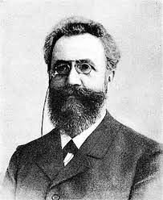
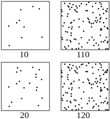
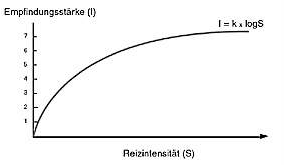

```{r setup, include=FALSE}
options(htmltools.dir.version = FALSE)

library(tidyverse)
library(kableExtra)
library(ggplot2)
library(plotly)
library(htmlwidgets)
library(MASS)
library(ggpubr)
library(xaringanthemer)
library(xaringanExtra)

style_duo_accent(
  primary_color = "#621C37",
  secondary_color = "#EE0071",
  background_image = "blank.png"
)

xaringanExtra::use_xaringan_extra(c("tile_view"))

use_scribble(
  pen_color = "#EE0071",
  pen_size = 4
  )

knitr::opts_chunk$set(
  fig.retina = TRUE,
  warning = FALSE,
  message = FALSE
)

# library(RefManageR)
# BibOptions(
# check.entries = FALSE, 
# bib.style = "authoryear", 
# cite.style = "authoryear", 
# style = "markdown",
# hyperlink = FALSE, 
# dashed = FALSE)
# myBib = ReadBib("/Users/stephangoerigk/Desktop/Universität/CFH/Lehre/Bachelor/Einführung in die Forschungsmethoden der Psychologie und Psychotherapie/EFPP_Folien/myBib.bib")
```

name: Title slide
class: middle, left
<br><br><br><br><br><br><br>
# Einführung in die Forschungsmethoden der Psychologie und Psychotherapie

### Einheit 1: Wie ist Psychologie als Wissenschaft möglich? 
##### 13.10.2023 | Dr. Caroline Zygar-Hoffmann

---
<div class="footer"><span>Belinda Fewings, ttps://unsplash.com/de/fotos/6wAGwpsXHE0?utm_content=creditCopyText&utm_medium=referral&utm_source=unsplash</div>

### Schön, dass Sie hier sind!

```{r, echo=FALSE,out.width="80%",fig.show='hold',fig.align='center'}
knitr::include_graphics("bilder/welcome.jpg")
``` 

---
class: top, left
name: Contact Slide

### Kontakt

.pull-left[
Dr. Caroline Zygar-Hoffmann

Psychologische Methodenlehre

Infanteriestraße 11a · 80797 München ·

[caroline.zygar@charlotte-fresenius-uni.de](mailto:caroline.zygar@charlotte-fresenius-uni.de)

<br>

Zoom Sprechstunde (bitte per Email anmelden): 

Meeting-ID: 466 759 0713

Kenncode: 254897

<br>

[Publikationen](https://scholar.google.de/citations?user=qH8FVR0AAAAJ&hl=de)

[Commitment to Research Transparency](http://www.researchtransparency.org)
]

.pull-right[
.center[
<br><br><br>
.bottom[]
]
]

---
class: top, left
<div class="footer"><span>https://ichbinhanna.wordpress.com/  https://mittelbau.net/tag/ichbinreyhan/</div>

### Representation matters!

#### Was Sie über mich wissen können (wenn Sie beobachten und recherchieren):

* Promovierte Wissenschaflerin
* Arbeitet in der Psychologischen Methodenlehre
* Forscht zu Partnerschaften und Motiven
* Arbeitet gleichzeitig an LMU und CFH *(d.h. auch: ich bin genauso neu hier, wie Sie! Ich bedanke mich für Geduld und Feedback)*
* Verheiratet (Doppelname!)
* Relativ jung?

#### Was Sie über mich nicht wissen können (bis ich es Ihnen erzähle):

* Mutter eines 1-jährigen Sohns
* "First-Generation-Academic"
* Migrationshintergrund der Eltern

$\rightarrow$ **Wissenschaft ist für alle da. Methodenlehre ist für alle da.** Vereinbarkeit mit Familie ist *prinzipiell* möglich.<br>
$\rightarrow$ **Es ist trotzdem alles andere als einfach. Glück spielt eine große Rolle. Das Wissenschaftssystem gehört reformiert.** Vereinbarkeit könnte noch viel besser sein. #IchBinHanna #IchBinReyhan

---
class: top, left
<div class="footer"><span>Oliver Kepka, https://pixabay.com//?utm_source=link-attribution&utm_medium=referral&utm_campaign=image&utm_content=531071</div>

### Nun zu Ihnen...

.center[
**Wer von Ihnen möchte Psychotherapeut:in werden?**
]

```{r, echo=FALSE,out.width="50%",fig.show='hold',fig.align='center'}
knitr::include_graphics("bilder/psychotherapie.jpg")
``` 


---
class: top, left
<div class="footer"><span>Fauxels, https://www.pexels.com/photo/photo-of-pen-on-top-of-notebook-3183170/</div>

### Nun zu Ihnen...

.center[
**Wer von Ihnen könnte sich vorstellen beruflich zu forschen?**
]

```{r, echo=FALSE,out.width="60%",fig.show='hold',fig.align='center'}
knitr::include_graphics("bilder/science.jpg")
``` 

---
class: top, left
### Übersicht Lehrveranstaltung 

**Termine:**
* 14 Termine
* Freitag 10:50 - 12:20 (Raum: Audimax)

**Begleitende Vorlesung:**
* "Einführung in die Psychologie und ihre Geschichte" Dienstag 11:35 - 13:05 im Audimax
* Dozentin: Prof. Dr. Nina Sarubin ([nina.sarubin@charlotte-fresenius-uni.de](mailto:nina.sarubin@charlotte-fresenius-uni.de))

**Materialien:**
* werden auf [Studynet](https://studynet.hs-fresenius.de/goto_STUDYNETHSF_fold_21921.html) bereitgestellt in 2 Varianten: html (Links zwischen Folien funktionieren) und PDF (Platz für Notizen)
* Vielen Dank an Prof. Dr. Stephan Goerigk für Bereitstellung der Grundlage für die Materialien

**Interaktion während der Lehrveranstaltung:** [Note-Pad](https://docs.google.com/document/d/1QePMxyyP7yH1sTaqcPsYyM3Y7tXr-N8wS0v_p9oi4jQ/edit?usp=sharing) 

**Prüfungsleistung:**
* Schriftliche Prüfung, 120 Minuten (beide Vorlesungen gemeinsam)

---
class: top, left
### Termine

```{r echo = F}
df = readxl::read_xlsx("Einführung in die Forschungsmethoden der Psychologie und Psychotherapie_Termine.xlsx", sheet = "Tabelle1")[1:14, 1:3]
df$Datum = format(as.Date(df$Datum), "%d.%m.%Y")
df %>%
  kbl() %>%
  kable_styling(font_size = 18) %>%
  kable_classic(full_width = T)
```

---
class: top, left
### Ziele der Veranstaltung

#### Vermittelte Inhalte
* Meilensteine empirisch-wissenschaftlichen Arbeitens
* Herausforderungen und Möglichkeiten der Datenerhebung in der Psychologie, Gütekriterien
* Datenauswertung, Präsentation und Publikation wissenschaftlicher Forschungsergebnisse 
* Besonderheiten der Forschung im klinisch-psychologischen Kontext
*	Gute wissenschaftliche Praxis, ethische Prinzipien

#### Vermittelte Kompetenzen
*	Beschreibung und Reflexion der Bedeutung wissenschaftstheoretischer und erkenntnistheoretischer Konzepte und Grundlagen
* Beschreibung der basalen Kompetenzen wissenschaftlichen Arbeitens 
* Fundiertes Belegen von Aussagen, d.h. mit wissenschaftlichen Quellen


---
class: top, left
<div class="footer"><span>Alexander, V., & Hicks, R. E. (2016). Does class attendance predict academic performance in first year psychology tutorials?. International Journal of Psychological Studies, 8(1), 28-32.</span></div>
### Was muss ich tun, damit ich hier was mitnehme?

Sie lernen in dieser Vorlesung viel Faktenwissen, aber sollen auch viel Verstehen.

**Dabei hilft:**
* Mitdenken
* Nachfragen
* Nachlesen
* Notizen machen
* Am Ball bleiben (Alexander & Hicks, 2016)
* Geduld mit sich selbst haben
* Zeit für die Vorlesungsnacharbeitung planen, Quizzes machen und Gelerntes in eigenen Worten zusammenfassen
* Sich vor Augen führen (und im Zweifelsfall nachfragen), warum die Inhalte für Sie als angehende Psycholog:innen relevant sind
* Auf sich selbst achten (auch zu Hause bleiben, wenn man krank ist!)
* Feedback geben

... das ist auch die Antwort auf die Frage, wie Sie aus dieser Vorlesung mit einer guten Note rausgehen können.

---
class: top, left
name: content
### Heutige Themen

#### Was ist Psychologie? 
* [Abgrenzung der Alltagspsychologie von wissenschaftlicher Psychologie](#abgrenzung-start)
* [Definitionen und Ziele wissenschaftlicher Psychologie](#definition-start)

#### Entwicklung der modernen Psychologie
* [Historische Grundlagen](#geschichte-start)
* [Psychologie als Wissenschaft?](#wissenschaft-start)
* [Psychisches Erleben und Selbstbeobachtung](#erleben-start)
* [Lösungsansätze für das Introspektionsproblem](#paradigmen-start)

#### [Take-Aways](#take-away)

---
class: top, left
### Literatur für die heutige Sitzung

.pull-left[
```{r, echo=FALSE,out.width="62%",fig.cap="Kapitel 1 in Dörfler, T., Roos, J., & Gerrig, R. J. (2018). Psychologie (21. Auflage). Pearson.",fig.show='hold',fig.align='center'}

``` 
]

.pull-right[
```{r, echo=FALSE,out.width="66%",fig.cap="Kapitel 8 in Schönpflug, W. (2013). Geschichte und Systematik der Psychologie (3. Auflage). Beltz.",fig.show='hold',fig.align='center'}

``` 
]

---
name: abgrenzung-start
class: top, left
<div class="footer"><span>Kapitel 2.1.1 in Myers, D.G. (2015). Psychologie. Springer. <br> ChatGPT(2023, 15. September). Antwort auf "Welche Sprichwörter widersprechen sich?". https://chat.openai.com/</span></div>

### Was ist Psychologie?

#### Alltagspsychologie: Alles bekannt?

.center[
*"Manche Menschen sagen, Psychologie sei letztlich nichts anderes als in einen Fachjargon gepresstes Allgemeinwissen. »[...] Ihr werdet dafür bezahlt, dass ihr mit ausgefallenen Methoden das beweist, was meine Großmutter schon immer wusste.«"*

David G. Myers (2015)
]

**Sprichwörter:**
.pull-left[

1a. Gegensätze ziehen sich an.<br>
1b. Gleich und gleich gesellt sich gern.

2a. Beurteile ein Buch nie nach seinem Einband.<br>
2b. Kleider machen Leute.
]

.pull-right[
3a. Was Hänschen nicht lernt, lernt Hans nimmermehr.<br>
3b. Man ist nie zu alt zum Lernen.

4a. Aus den Augen, aus dem Sinn.<br>
4b. Liebe wächst mit der Entfernung.
] 

ChatGPT dazu: *"Diese Beispiele zeigen, wie Sprichwörter unterschiedliche Perspektiven und Weisheiten vermitteln können, die sich in bestimmten Situationen widersprechen können."*

---
class: top, left
<div class="footer"><span>https://commons.wikimedia.org/wiki/File:Cognitive_Bias_Codex_-_180%2B_biases,_designed_by_John_Manoogian_III_(jm3).jpg</span></div>

### Was ist Psychologie?

#### Alltagspsychologie: Kognitive Verzerrungen (Biases)

.center[
```{r, echo=FALSE,out.width="55%",fig.cap=" ",fig.show='hold',fig.align='center'}
knitr::include_graphics(c("bilder/biases.jpg"))
``` 
]

---
class: top, left
<div class="footer"><span>Oeberst, A., & Imhoff, R. (2023). Toward Parsimony in Bias Research: A Proposed Common Framework of Belief-Consistent Information Processing for a Set of Biases. Perspectives on Psychological Science. https://doi.org/10.1177/17456916221148147</span></div>

### Was ist Psychologie?

#### Alltagspsychologie: Kognitive Verzerrungen (Biases)

.pull-left[
```{r, echo=FALSE,fig.cap=" ",fig.show='hold',fig.align='center'}

``` 
]

.pull-right[
```{r, echo=FALSE,fig.cap=" ",fig.show='hold',fig.align='center'}

``` 
]

---
class: top, left
<div class="footer"><span>Kapitel 2.1.1 in Myers, D.G. (2015). Psychologie. Springer.</div>

### Was ist Psychologie?

#### Alltagspsychologie: Beispiel Hingsight Bias (Rückschaufehler)

.center[
*"Wir leben das Leben vorwärts, aber wir verstehen es rückwärts."*

Søren Kierkegaard
]

.pull-left[

<br>
<br>
<br>

Der *Hindsight Bias* beschreibt die Tendenz, nach dem Eintreten eines Ereignisses zu glauben, man hätte es vorhersehen können.
]

.pull-right[
```{r, echo=FALSE,out.width="75%",fig.cap=" ",fig.show='hold',fig.align='center'}
knitr::include_graphics(c("bilder/hindsightbias.png"))
``` 
]

---
class: top, left
<div class="footer"><span>https://psychosophcomic.de/2022/01/30/was-ist-psychologie/</span></div>

### Was ist Psychologie?

```{r, echo=FALSE,out.width="35%",fig.cap=" ",fig.show='hold',fig.align='center'}
knitr::include_graphics(c("bilder/psychosophie1.png","bilder/psychosophie2.png"))
``` 

---
class: top, left
### Was ist Psychologie?

#### Wissenschaftliche Methoden

* **Generell**: Menge geordneter  Schritte  zur  Analyse  und  Beantwortungvon  Fragestellungen
* **Speziell empirische Methoden**: Nutzung möglichst  objektiv  erhobener  Informationen  als  Faktenbasis  für  wissenschaftlich  korrekte Schlussfolgerungen

#### Psychologische Methodenlehre

* Instrumentarium zur systematischen Entwicklung und Überprüfung (**!**) psychologischer Theorien

* Manchmal mehrere Zugänge zur Erkenntnis (**Methodenpluralismus**)

* Wissenschaftliche Methodik unterscheidet Psychologie von Alltagspsychologie

* Wissenschaftliche Systematik ermöglicht **vergleichbare** Erfassung individueller psychologischer Eigenschaften

<br>

.center[
*"Nichts beflügelt die Wissenschaft so wie der Schwatz mit Kollegen auf dem Flur."*

Arno Penzias 
]

---
class: top, left
### Was ist Psychologie?

#### Wissenschaftliche Methoden

* **Generell**: Menge geordneter  Schritte  zur  Analyse  und  Beantwortungvon  Fragestellungen
* **Speziell empirische Methoden**: Nutzung möglichst  objektiv  erhobener  Informationen  als  Faktenbasis  für  wissenschaftlich  korrekte Schlussfolgerungen

#### Psychologische Methodenlehre

* Instrumentarium zur systematischen Entwicklung und Überprüfung (**!**) psychologischer Theorien

* Manchmal mehrere Zugänge zur Erkenntnis (**Methodenpluralismus**)

* Wissenschaftliche Methodik unterscheidet Psychologie von Alltagspsychologie

* Wissenschaftliche Systematik ermöglicht **vergleichbare** Erfassung individueller psychologischer Eigenschaften

<br>

**[Note-Pad](https://docs.google.com/document/d/1QePMxyyP7yH1sTaqcPsYyM3Y7tXr-N8wS0v_p9oi4jQ/edit?usp=sharing):** Welche „Methoden der Psychologie“ fallen Ihnen bereits jetzt ein? 

---
class: top, left
<div class="footer"><span>Kapitel 1.1 in Döring, N. & Bortz, J. (2016). Forschungsmethoden und Evaluation in den Sozial- und Humanwissenschaften. Pearson.</span></div>

### Was ist Psychologie?

#### Abgrenzung von wissenschaftlichem Erkenntnisgewinn zu anderen Zugängen

Argumentation mit Berufung auf ...
.pull-left[
* **Autoritätspersonen**
* **Religion**
* **Tradition**
]

.pull-right[
* **Gesunden Menschenverstand**
* **Intuition**
* **Anekdotische Evidenz**
* **Logik**
]

... kann im Einzelfall zutreffend sein und/oder sich als nützlich erweisen

... ist aber oft nicht nachvollziehbar, vorurteilsbehaftet und/oder widersprüchlich<br>
... ist vorallem häufig nicht auf Basis (aktueller) empirischer Daten systematisch überprüft oder überhaupt überprüfbar<br>
... nutzt fast immer Wissen, welches **nicht den zentralen Merkmalen von wissenschaftlicher Wissensproduktion** genügt<br>

**[Note-Pad](https://docs.google.com/document/d/1QePMxyyP7yH1sTaqcPsYyM3Y7tXr-N8wS0v_p9oi4jQ/edit?usp=sharing)**: Überlegen Sie sich eine Fragestellung, für die eine Argumentation auf Basis von Logik problematisch sein kann ("Es wäre unlogisch, ...").
<!-- Immer, wenn Menschen oder Gruppen nicht rational handeln: Es wäre logisch, mit dem Rauchen aufzuhören, wenn man lange leben möchte (trotzdem rauchen Menschen, die lange leben möchten). Es wäre nicht logisch, sich geeignete Bewerberinnen durch die Lappen gehen zu lassen (trotzdem scheint das zu passieren). -->

---
class: top, left
<div class="footer"><span>Kapitel 1.1 in Döring, N. & Bortz, J. (2016). Forschungsmethoden und Evaluation in den Sozial- und Humanwissenschaften. Pearson. </span></div>

### Was ist Psychologie?

#### Merkmale von wissenschaftlicher Wissensproduktion in human-/sozialwissenschaftlicher Forschung

.pull-left[
**1.** Formulierung empirisch untersuchbarer und gut begründeter **Forschungsfragen und -hypothesen**

**2.** Berücksichtigung des **Forschungsstandes** und ausdrücklicher **Theoriebezug**

**3.** $\rightarrow$ **Systematische Erhebung, Aufbereitung und Analyse von empirischen Daten** zum Forschungsproblem mithilfe wissenschaftlicher Methoden unter Einhaltung wissenschaftlicher Gütekriterien

**4.** $\rightarrow$ Vorgehen gemäß **etablierter wissenschaftlicher Methodologie** unter Einhaltung wissenschaftlicher Gütekriterien
]

.pull-right[
**5.** $\rightarrow$ Vorgehen gemäß Prinzipien der **Forschungs-/Wissenschaftsethik** 

**6.** Ausführliche schriftliche **Dokumentation** des Forschungsprozesses und **Archivierung** des Datenmaterials zwecks Nachvollziehbarkeit und Nachprüfbarkeit

**7.** **Ausgewogene Ergebnisinterpretation** mit Hinweisen und widersprüchliche Befunde und auf Grenzen der Aussagekraft einer Studie

**8.** **Wissenschaftliche Veröffentlichung** einer Studie - möglich nach fachkundiger Begutachtung (**peer-review**)
]

*Punkte mit $\rightarrow$ sind Fokus dieser Vorlesung.*

---
class: top, left
<div class="footer"><span>Kapitel 2.2.1 in Myers, D.G. (2015). Psychologie. Springer.<br> Glossar in Eid, M., Gollwitzer, M., & Schmitt, M. (2017). Statistik und Forschungsmethoden. Beltz. </div>

### Was ist Psychologie?

#### Schlüsselbegriffe

**Hypothese**: 

* Eine in Form einer logischen Aussage formulierte Annahme, deren Gültigkeit man zwar für möglich hält, die aber bisher nicht bewiesen bzw. verifiziert ist. 
* Hypothesen sollen prüfbare Vorhersagen machen (**empirisch testbar** und **falsifizierbar**).
* Hypothesen werden meist aus Theorien abgeleitet.

**Theorie**:

* Integration von Wissen in ein kohärentes (logisch widerspruchsfreies) theoretisches Gedankengebäude. 
* Eine Theorie enthält in der Regel beschreibende (deskriptive) und erklärende (kausale) Aussagen über einen Teil der Realität.
* Auf Grundlage von Theorie werden Vorhersagen getroffen. 

**Gesetz(mäßigkeit)**: Feststellungen über Zusammenhänge, die durch empirische Evidenz als gesichert angenommen werden können. "Immer wenn x, dann y..."

---
class: top, left
<div class="footer"><span>Kapitel 2.1.4 und 2.1.5 in Myers, D.G. (2015). Psychologie. Springer. </span></div>

### Was ist Psychologie?

#### Kritisches Denken auf wissenschaftlicher Basis

.center[
**Die wissenschaftliche Haltung: Neugierig, skeptisch und bescheiden**
]

.pull-left[
##### Neugier:
* Fragen stellen!
* Definitionen klären
* Effekte in Relation stellen (verglichen wozu ist ein Effekt groß/klein?)

<br>
<br>
##### Bescheidenheit:
* Eigene Anfälligkeit für Biases beachten
* Einfache Antworten auf komplexe Fragen sind selten
]

.pull-right[
##### Skepsis:
* Vorannahmen hinterfragen
* Falsifizierbarkeit prüfen
* Empirische Evidenz prüfen
* Methodenauswahl prüfen
* Alternativerklärungen prüfen
* Schlussfolgerungen prüfen (z.B. Korrelation ≠ Kausalität)

<br>
* Wissenschaft ist ein iterativer Prozess: Viele Schlussfolgerungen sind unsicher und vorläufig
* Wahrscheinlichkeit =/= Determinismus
] 

---
name: definition-start
class: top, left
<div class="footer"><span>https://www.dgps.de/psychologie-studieren/infos-zum-studium/psychologie-was-ist-das/</span></div>

### Was ist Psychologie?

#### Was macht Psychologie einzigartig?

.center[
**Frage:**

„Womit befasst sich die Psychologie?“

Wissenschaftlich ausgedrückt: 

„Was ist der Gegenstand der Psychologie?“
]

<br>

**Definition der Deutschen Gesellschaft für Psychologie (2023):**

"*Psychologie ist die Wissenschaft, die sich mit den Gedanken, Gefühlen und dem Verhalten des Menschen beschäftigt. Dabei geht es einerseits um Gesetzmäßigkeiten, die alle Menschen betreffen, andererseits aber auch um individuelle Unterschiede und darum, was unser Erleben und Handeln beeinflusst.*"

---
class: top, left

### Was ist Psychologie?

#### Was macht Psychologie einzigartig?

Gegenstand der Psychologie:

* **Menschliches Erleben**
  - Gedanken
  - Gefühle
* **Menschliches Verhalten**

...dabei relevant:

* **Gesetzmäßigkeiten**, die alle Menschen betreffen
* **Individuelle Unterschiede** zwischen Menschen

...sowie:

* **Bedingungen und Ursachen**
  - innere (im Individuum angesiedelte)
  - äußere (in der Umwelt lokalisierte)

---
class: top, left
### Was ist Psychologie?

#### Was macht Psychologie einzigartig? 

**Gegenstand psychologischer Untersuchungen**: Individuum (Neugeborenes, Athlet, Student, Patient,...) oder Gruppen (Paare, Familien, Teams,...)

**Verhalten:** Mittel durch welches sich ein Individuum an die Umwelt anpasst

.pull-left[
* Wesentlicher Teil der Psychologie: **Beobachtbares Verhalten**
  - Lachen
  - Weinen
  - Sprechen
  - Berühren
  - ...
]
.pull-right[

* Aber: Viele menschliche Aktivitäten laufen als private, **innere Bewusstseinsprozesse** ab
  - Denken
  - Schlussfolgern
  - Fantasieren
  - Träumen
  - ...
]  

**Annahme der meisten Psychologen:** Menschliches Verhalten ist ohne mentale/kognitive Prozesse (Erleben, Bewusstsein) nicht verständlich.

---
class: top, left
### Was ist Psychologie?

#### Ziele der Psychologie

**1. Beschreibung**

**2. Erklärung**

**3. Vorhersage**

**4. Beeinflussung**

... menschlichen Verhaltens und Erlebens (Gegenstand der Psychologie).

---
class: top, left
### Was ist Psychologie?

#### Ziele der Psychologie

.pull-left[

##### Beschreibung

Merkmale des menschlichen Verhaltens und Erlebens benennen, definieren und Zusammenhänge zwischen ihnen erfassen.

**Wahl angemessener Analyseebene (grob $\rightarrow$ spezifisch)**

**Aufgabe 1:** 

Sie wollen sich mit einem Freund vor diesem Gemälde verabreden. Wie würden Sie es beschreiben?
]

.pull-right[
.center[
```{r eval = TRUE, echo = F, out.width = "250px"}
knitr::include_graphics("bilder/eifel.jpg")
```
]
]

---
class: top, left
### Was ist Psychologie?

#### Ziele der Psychologie

.pull-left[
##### Beschreibung

**Wahl angemessener Analyseebene (grob $\rightarrow$ spezifisch)**

**Aufgabe 2:** 

Sie wollen, dass Ihr Freund das Gemälde exakt kopiert. Wie würden Sie es beschreiben?
]

.pull-right[
.center[
```{r eval = TRUE, echo = F, out.width = "250px"}
knitr::include_graphics("bilder/eifel.jpg")
```
]
]

---
class: top, left
### Was ist Psychologie?

#### Ziele der Psychologie

##### Beschreibung

**Wahl angemessener Analyseebene (grob $\rightarrow$ spezifisch)**

**Beispielverhalten:** Jemanden überzeugen.

.pull-left[
**Beispiel Sprache:**

* Gespräch
* Aussage
* Satz
* Wort
* Phonem (Sprachlaut)
* Buchstabe
]

.pull-right[
**Beispiel Physiologie:**

* Gehirn
* Frontallappen
* Gyrus praecentralis (Teil des Frontallappens)
* Neuron
* Synapse
* Protein
]

**Unabhängig von Analyseebene: So objektiv wie möglich.**

---
class: top, left
### Was ist Psychologie?

#### Verhalten und Erleben

**Beschreibungsebenen:** behavioral (b), kognitiv (k), emotional (e), physiologisch (p)

.pull-left[
<br>
```{r eval = TRUE, echo = F, out.width = "500px"}

```

<!--**Übung**: Füllen Sie für sich ein SORK-Schema aus.-->
]
.pull-right[

**SORK-Schema** der kognitiven Verhaltentherapie

**S**timulus: Person drängelt an Supermarktkasse vor.

**O**rganismus: Biographie, Einstellungen, Kompetenzen...

**R**eaktion (b): Ich sage nichts, lasse es geschehen.<br>
**R**eaktion (k): "Das war ja klar.", "Ich bin es nicht wert."<br>
**R**eaktion (e): Niedergeschlagenheit<br>
**R**eaktion (p): Erröten, Knoten im Hals

**K**onsequenz (-): Ich werde übergangen. <br>
**K**onsequenz (+): Kein Konflikt

$\rightarrow$ **Grundlage für Diagnostik und Intervention**
]

---
### Was ist Psychologie?

#### Ziele der Psychologie

#####  Erklärung

* **Regelhafte Muster** in Verhalten und mentalen Prozessen finden

* Erklärungen gehen über das Beobachtbare hinaus

* Ideal:
  - Identifizieren von **Kausalitäten**, d.h. Verstehen, "wie etwas funktioniert" und "warum es so passiert"
  - **Alternativerklärungen** ausschließen

* Für Verhalten und Erleben gibt es i.d.R. eine **Kombination** von Ursachen
  - internale/innere/organismische/dispositionelle Variablen
  - externale/situationale/Umweltvariablen
  
* **Determinanten / Prädiktoren** = bedingende Faktoren
  
**[Note-Pad](https://docs.google.com/document/d/1QePMxyyP7yH1sTaqcPsYyM3Y7tXr-N8wS0v_p9oi4jQ/edit?usp=sharing):** Sammeln Sie mögliche internale und externale Ursachen dafür, dass Menschen Rauchen.

---
class: top, left
### Was ist Psychologie?

#### Ziele der Psychologie

#####  Vorhersage

* Bestimmen von **Wahrscheinlichkeit** des Auftretens eines bestimmten Ereignisses mit hinreichender Genauigkeit

* Vorhersage setzt häufig gute Erklärung voraus

* Wenn mehrere Erklärungen denkbar $\rightarrow$ die Wahrscheinlichste (beste Vorhersage) "gewinnt"

* Vorhersagen müssen **exakt** formuliert werden, um prüfbar zu sein: Wann und unter welchen **Bedingungen** tritt ein Ereignis ein?

<br>
**Beispiel:** [PRONIA](https://nachrichten.idw-online.de/2021/01/28/pronia-projekt-entwickelt-prognosemodelle-fuer-die-psychiatrie) -  Studie zur Vorhersage von Psychose-Onset im Prodrom (Krise oder Erkrankungsbeginn)

---
class: top, left
### Was ist Psychologie?

#### Ziele der Psychologie

#####  Beeinflussung

* **Form, Stärke und Auftretenswahrscheinlichkeit** von Verhalten oder mentalen Prozessen beeinflussen

* Verhalten und Erleben...
  - ...auftreten lassen
  - ...aufrechterhalten
  - ...beenden
  
* Setzt häufig genaue Beschreibung/Erklärung/Vorhersage voraus

* Wirksame, evidenzbasierte **Interventionen** für viele Psycholog:innen das zentralste Ziel (z.B. Psychotherapie)

* Prüfung der Wirksamkeit in **Evaluationsforschung**

<!--<br>
**[Note-Pad](https://docs.google.com/document/d/1QePMxyyP7yH1sTaqcPsYyM3Y7tXr-N8wS0v_p9oi4jQ/edit?usp=sharing):** Was fallen Ihnen für psychologische Möglichkeiten der **Einflussnahme** ein?-->

---
name: geschichte-start
class: top, left
<div class="footer"><span>Kapitel 1 in Slunecko, T., & Benetka, G. (2023). Geschichte und Paradigmen der Psychologie und Psychotherapie. utb. /</span></div>

### Entwicklung der modernen Psychologie

#### Historische Grundlagen

.center[
*"Die Psychologie hat eine lange Vergangenheit, aber nur eine kurze Geschichte."*

Gedächtnisforscher Hermann Ebbinghaus (1908)
]

.pull-left[
Was ist damit gemeint?

Seit Jahrtausenden denken Menschen nach über
* die Natur des Menschen
* die Geheimnisse seiner Seele
* die Beweggründe seines Handelns
* seine Gefühle
* seine Erkenntnisfähigkeit
]

.pull-right[
.center[
```{r eval = TRUE, echo = F, out.width = "200px"}

```
]
]

**ABER:** Psychologie als empirische, methodisch überprüfbare Forschung wird erst seit dem **19. Jahrhundert** betrieben.

---
class: top, left

### Entwicklung der modernen Psychologie

#### Historische Grundlagen

.pull-left[
**Deutungshoheit** über Natur des Menschen vor dem 19. Jahrhundert:

* Dichter und Denker
* Philosophie
* Religionen und ihre Vertreter (Spiritismus)

**Erkenntnisgewinn** durch: 

* gründliches Nachdenken
* Spekulation
* Debatte
]

.pull-right[
.center[
```{r eval = TRUE, echo = F, out.width = "200px"}
knitr::include_graphics("bilder/denker.jpg")
```
]
]

**Ab 19. Jahrhundert:**
* **Naturwissenschaften** emanzipieren sich gegenüber Geisteswissenschaften und Religion 
* beanspruchen Deutungshoheit über Mensch und Welt

---
class: top, left
<div class="footer"><span>Kapitel 1 in Slunecko, T., & Benetka, G. (2023). Geschichte und Paradigmen der Psychologie und Psychotherapie. utb. /</span></div>

### Entwicklung der modernen Psychologie

#### Historische Grundlagen

##### Beginnendes 19. Jahrhundert

* Philosophie = uneingeschränkte **Königsdisziplin der Wissenschaft**

* mehr noch: Philosophie = Wissenschaft

* systematische **begriffliche Durchdringung** der Natur- und Geschichtsforschung $\rightarrow$ unablässige Suche nach Wahrheit

* Fakten und Tatsachen, die die Natur-, Sprach- und Geschichtsforscher zusammentrugen, bedurften der philosophischen **Interpretation** (Eingliederung also in philosophisches Weltbild)

* Wenn Fakten der philosophischen Theorie widersprachen 

  $\rightarrow$ spricht gegen die Fakten und nicht gegen die Theorie.

---
class: top, left
<div class="footer"><span>Kapitel 1 in Slunecko, T., & Benetka, G. (2023). Geschichte und Paradigmen der Psychologie und Psychotherapie. utb. /</span></div>

### Entwicklung der modernen Psychologie

#### Historische Grundlagen

##### 30/40er Jahre des 19. Jahrhundert

.center[
*„Entzauberung der Welt“ durch die Wissenschaften*

Max Weber
]

* **Reduktion von „Wirklichkeit“ auf Faktisches** $\rightarrow$ das ohne immanenten Sinn und Wert für sich besteht

* Kritik am **Vitalismus** (Johannes Müller), die der belebten Natur eine besondere Kraft zuschreibt (Aristoteles: Seele): Im Organismus sind keine anderen Kräfte wirksam, als die  physikalisch-chemischen

* **Identitätskrise der Philosophie:** Was bleibt neben der Tatsachenforschung?

* **Philosophische Neuordnung:** Rekonstruktion philosphischer Denksysteme (Philosophie reduziert sich auf Geschichte der Philosophie, Ethik, Logik und normative Erkenntnislehre)

$\rightarrow$ bis dann 1879: **Wilhelm Wundt** (eigentlich ein Physiologe) gründet in Leipzig erstes experimentalpsychologisches Laboratorium der Welt

---
name: wissenschaft-start
<div class="footer"><span>Kapitel 2 in Slunecko, T., & Benetka, G. (2023). Geschichte und Paradigmen der Psychologie und Psychotherapie. utb. /</span></div>

### Entwicklung der modernen Psychologie

#### Psychologie als Wissenschaft?

.center[
**Die Welt im Kopf:**

Sie haben sich sicher schon einmal gefragt...

"Erlebt mein Gegenüber die Welt genauso wie ich sie erlebe?"
]
**Fragen:**

* Siehst Du, wie ich es tue? 
* Hörst Du, wie ich es tue? 
* Denkst Du,  wie ich es tue? 
* Fühlst Du,  wie ich es tue? 
* Wie kann ich wissen, was in einem Menschen gerade vorgeht?  

**Problem:** 

* Das Einzige, was ich sicher weiß, ist, was **ich** sehe, fühle, denke oder kurz: was ich erlebe.
* Wie und was andere erleben, erleben eben die anderen, und nicht ich selbst.

<!-- * Kann auch zu konkreten Problemen führen (z.B. interpersoneller **Negativity Bias**) -->

---
### Entwicklung der modernen Psychologie

#### Psychologie als Wissenschaft?

.center[
**Analogieschluss: **

Ich habe ein Bewusstsein meiner selbst und der Welt um mich herum 

$\downarrow$

Andere müssen auch ein solches Bewusstsein haben.
]

**ABER:** Was berechtigt mich zu diesem Schluss? 

Ich bediene mich einer **Heuristik**:
* Ich bin nicht alleine auf der Welt
* Ich beobachte (meistens), dass Menschen sich so verhalten wie ich es erwarte.
* Also: Andere Menschen funktionieren in ähnlichen Situationen so wie ich
* Schlussfolgerung: Vermutlich denken und fühlen sie dann auch wie ich.

---
<div class="footer"><span>Kapitel 2 in Slunecko, T., & Benetka, G. (2023). Geschichte und Paradigmen der Psychologie und Psychotherapie. utb. /</span></div>

### Entwicklung der modernen Psychologie

#### Psychologie als Wissenschaft?

.pull-left[

**Untersuchungsgegestand der Psychologie:**

* Verhalten des Menschen $\rightarrow$ **beobachtbar**
* Erleben des Menschen $\rightarrow$ **?**
* Bewusstsein des Menschen $\rightarrow$ **?**
]

.pull-right[
.center[
```{r eval = TRUE, echo = F, out.width = "250px"}
knitr::include_graphics("bilder/Head.jpg")
```
]
]

**Das Dilemma des Analogieschlusses**:

Wie kann über etwas, das ganz allein meine innerste private Erfahrung ist, wissenschaftlich etwas ausgesagt werden?

---
<div class="footer"><span>Kapitel 2 in Slunecko, T., & Benetka, G. (2023). Geschichte und Paradigmen der Psychologie und Psychotherapie. utb. /</span></div>

### Entwicklung der modernen Psychologie

#### Psychologie als Wissenschaft? 

**Anspruch einer Wissenschaft:**

Wissenschaft ist...
* ein soziales, kollektives Unterfangen
* ein Kommunikationssystem
* funktioniert nach bestimmten (oft implizit) festgelegten Regeln 

**Oberster Grundsatz der Wissenschaft**:

Das, was erforscht wird und das Wie des Forschens (Entstehung, Begrüngung, Methode) muss ...

* kommunizierbar sein

...und von jedem Teilnehmer des Kommunikationssystems, der sich entsprechend kundig gemacht hat...

* intersubjektiv nachvollziehbar und

* überprüfbar sein.

---
<div class="footer"><span>Kapitel 2 in Slunecko, T., & Benetka, G. (2023). Geschichte und Paradigmen der Psychologie und Psychotherapie. utb. /</span></div>

### Entwicklung der modernen Psychologie

#### Psychologie als Wissenschaft?

Wie also soll in diesem Sinne öffentliches Wissen über privates Erleben möglich sein? 

.center[
**Zentralproblem der Psychologie**

*Das forschende Subjekt muss sich selbst als Forschungsobjekt nehmen. *

**Forschungspraktisch formuliert: **

*Das beobachtende Subjekt fällt mit dem zu beobachtenden Objekt zusammen.*
]

**Weitere Zuspitzung:** Wie der Gegenstand, so ist auch die **Auffassung** dieses Gegenstandes ein privater Vollzug

$\rightarrow$ Der Beobachter muss sein eigenes Beobachten beobachten (niemand anderes kann es kontrollieren)

$\rightarrow$ Wie kann unter diesen Umständen die Psychologie eine Wissenschaft sein?

---
name:erleben-start
<div class="footer"><span>Kapitel 2 in Slunecko, T., & Benetka, G. (2023). Geschichte und Paradigmen der Psychologie und Psychotherapie. utb. /</span></div>

### Entwicklung der modernen Psychologie

#### Psychisches Erleben und Selbstbeobachtung

##### Begriffsklärungen und Voraussetzungen

.pull-left[

**Psychisches Erleben** (z.B. denken, fühlen...)
* Vorgang ist uns irgendwie „gegeben“ 
* existiert unabhängig davon, ob wir es bewusst registrieren (d. h. bewusst beobachten) oder nicht

**Introspektion**:
* Das **bewusste Selbstbeobachten** des psychischen Erlebens
* Beobachten = Aufmerksamkeit gezielt auf die in Frage stehenden Erscheinungen richten
]

.pull-right[.center[
```{r eval = TRUE, echo = F, out.width = "300px"}
knitr::include_graphics("bilder/Introspektion.png")
```
]
]

---
### Entwicklung der modernen Psychologie

#### Psychisches Erleben und Selbstbeobachtung

##### Übung in Introspektion

.center[
*“Es ist nicht immer einfach, zwischen Nachdenken und dem Blick aus dem Fenster zu unterscheiden.”*

Wallace Stevens

**Übung:** 2 Minuten Selbstbeobachtung

```{r eval = TRUE, echo = F, out.width = "700px"}

```
]
---
### Entwicklung der modernen Psychologie

#### Psychisches Erleben und Selbstbeobachtung

.center[
Zentraler Gegenstand der **Erkenntnistheorie** (aka Epistemologie)

$\downarrow$

Was kann der Mensch über sich selbst erkennen? (vgl. 2. Vorlesung)

```{r eval = TRUE, echo = F, out.width = "700px"}
knitr::include_graphics("bilder/platocave.jpg")
```

*Das Höhlengleichnis*, Platons Republik
]

---
<div class="footer"><span>Kapitel 2 in Slunecko, T., & Benetka, G. (2023). Geschichte und Paradigmen der Psychologie und Psychotherapie. utb. /</span></div>

### Entwicklung der modernen Psychologie

#### Psychisches Erleben und Selbstbeobachtung

**Einwände gegen die Introspektion als wissenschaftliche Methode:**

.center[
„*Der Vorgang der Beobachtung verändert bereits das, was zur Beobachtung ansteht.*“

Immanuel Kant (1786)

„*Denn wer den Zorn, der in ihm glüht, beobachten wollte, bei dem wäre er offenbar bereits gekühlt, und der Gegenstand der Beobachtung verschwunden.*“

Franz v. Brentano (1838-1917)
]

**Umgang mit dem Introspektionsproblem**

.center[
Unterschiedliche Ansätze zur Lösung des Introspektionsproblems 

$\downarrow$

Grundrichtungen der Psychologie (**Paradigmen**, vgl. 3. Vorlesung)
]

---
name: paradigmen-start
### Entwicklung der modernen Psychologie

#### Lösungsansätze für das Introspektionsproblem

**Hermann Ludwig von Helmholtz (Sinnesphysiologie)**

* sinnliche Wahrnehmung aus der Perspektive der **Physiologie**

* Aufnahme von **Reizen** durch Sinnesorgane mit Bildung **neuronaler Signale** (Verarbeitung im Nervensystem)

  * Sehen – visuelle Wahrnehmung
  * Hören – auditive Wahrnehmung
  * Riechen – olfaktorische Wahrnehmung
  * Schmecken – gustatorische Wahrnehmung
  * Gefühl für Lageänderung im Raum – vestibuläre Wahrnehmung
  * Gefühl für Stellung und Spannung einer Ruhehaltung, Kraft und Geschwindigkeit einer Bewegung (Tiefensensibilität)
  * Fühlen von Berührung, Druck, Vibration, Wärme, Kälte und Schmerz der Körperoberfläche (Oberflächensensibilität)

---
### Entwicklung der modernen Psychologie

#### Lösungsansätze für das Introspektionsproblem

**Gustav Theodor Fechner (Psychophysik)**

.pull-left[
* **Psychophysik** 1860 von Fechner begründet

* Teilgebiet der **experimentellen Psychologie** 

* Fokus: v. A. Wahrnehmung (**low Level**)

* Unterscheidung: äußere (1) vs. innere (2) Psychophysik

* Zusammenhang zwischen Reizungen der Sinnesorgane und Erleben

* befasst sich z. T. auch mit **ästhetischen** Fragen des Geschmacks
]

.pull-right[
.center[
.pull-left[
```{r eval = TRUE, echo = F, out.width = "200px"}
knitr::include_graphics("bilder/fechner.jpg")
```
]
.pull-right[
```{r eval = TRUE, echo = F, out.width = "300px"}

```
]
]
]

$\rightarrow$ gesetzmäßige Wechselbeziehungen zwischen subjektivem, mentalen Erleben vs. quantitativ messbaren, also objektiven physikalischen Reizen

---
### Entwicklung der modernen Psychologie

#### Lösungsansätze für das Introspektionsproblem

**Gustav Theodor Fechner (Psychophysik)**

##### Beispiele für Studien aus Psychophysik:
* Fechner untersuchte z.B. ästhetische Präferenz für **Goldenen Schnitt** (aka göttliche Proportion)

* Größenverhältnis (**Proportion**) zweier Längen

* Teilung nach dem Goldenen Schnitt:

  *Der größere Teil verhält sich zum kleineren, wie beide zusammen zum größeren Teil.*
 
.center[
```{r eval = TRUE, echo = F, out.width = "300px"}
knitr::include_graphics("bilder/schnitt.png")
```
]

---
### Entwicklung der modernen Psychologie

#### Lösungsansätze für das Introspektionsproblem

**Gustav Theodor Fechner (Psychophysik)**

##### Beispiele für Studien aus Psychophysik:
.pull-left[
**Wahrnehmungsschwelle (Absolutschwelle):**<br>
  Wie stark die Reizung eines gegebenen Sinnesorgans sein muss, damit eine Reaktion erfolgt.

**Diskriminationsschwelle (Reizunterscheidung):**<br>
  Wie verschieden müssen zwei Reize sein, damit sie in einem gegebenen Kontext als unterschiedlich empfunden werden
 
**Reizerkennung:**<br>
  Wann etwa ein blaues Dreieck als ein blaues Dreieck erkannt wird.
]

.pull-right[
**Fechners Gesetz (auch Fechner-Skala)**<br>
Zusammenhang zwischen Reiz- und Erlebnisintensität:
$$E=k\cdot \log R+f$$
.center[

.pull-left[
```{r eval = TRUE, echo = F, out.width = "150px"}

```
]
.pull-right[
```{r eval = TRUE, echo = F, out.width = "300px"}

```
]
]

]


---
<div class="footer"><span>Kapitel 2 in Slunecko, T., & Benetka, G. (2023). Geschichte und Paradigmen der Psychologie und Psychotherapie. utb. /</span></div>

### Entwicklung der modernen Psychologie

#### Lösungsansätze für das Introspektionsproblem

**Willhelm Wundt (Experimentelle Psychologie)**

.pull-left[
* Wundt gilt als **Begründer der Psychologie** als eigenständige Wissenschaft

* gründet 1879 weltweit erstes **experimentalpsychologisches Laboratorium** (Leipzig)

* Methode: **experimentell kontrollierte** Selbstbeobachtung

* Experiment $\neq$ ungeschulte („naive“) Introspektion der persönlichen Alltagserfahrung

* **Lösung Introspektionsproblem:** innere psychische Vorgänge im Experiment zu externalisieren (veröffentlichen)
]
.pull-right[
.center[
```{r eval = TRUE, echo = F, out.width = "300px"}
knitr::include_graphics("bilder/Wundt.jpg")
```
]
]

---
<div class="footer"><span>Wontorra, H. M., & Wontorra, M. (2013). Early apparatus-based experimental psychology, primarily at Wilhelm Wundt’s Leipzig Institute. New perspectives on the history of cognitive science, 59-80. <br> https://vlp.mpiwg-berlin.mpg.de/references?id=lit19650&page=p0072</div>

### Entwicklung der modernen Psychologie

#### Lösungsansätze für das Introspektionsproblem

**Willhelm Wundt (Experimentelle Psychologie)**

##### Von Wundt genutzte Methoden:

.pull-left[
Chronometrie (Reaktionszeitmessung):

* Bestimmung des Zeitaufwands elementarer geistiger Prozesse

* Beispiele
  - z.B. Suche nach Zielreiz in Menge von Distraktoren
  - z.B. Wahl einer reizadäquaten Reaktion

* Methoden: Chronoskop, Noematachograph (wörtl. Gedankengeschwindigkeitsschreiber)
]
.pull-right[
.center[
```{r eval = TRUE, echo = F, out.width = "300px"}
knitr::include_graphics("bilder/chronoskop.png")
```

```{r eval = TRUE, echo = F, out.width = "150px"}

```
]
]

---
<div class="footer"><span>Wontorra, H. M., & Wontorra, M. (2013). Early apparatus-based experimental psychology, primarily at Wilhelm Wundt’s Leipzig Institute. New perspectives on the history of cognitive science, 59-80.</div>

### Entwicklung der modernen Psychologie

#### Lösungsansätze für das Introspektionsproblem

**Willhelm Wundt (Experimentelle Psychologie)**

##### Von Wundt genutzte Methoden:

.pull-left[
Quantifizierung von Bewusstseinsphänomenen:

* **Apperzeption:** Eintreten eines Bewusstseinsinhaltes in das "innere Blickfeld"

* würde man heute ggf. mit Aufmerksamkeit übersetzen

* z.B. Anzahl an Vorstellungen, die im perzeptiven Fokus gehalten werden können (Methode: Tachistoskop)
]

.pull-right[
```{r eval = TRUE, echo = F, out.width = "400px"}
knitr::include_graphics("bilder/tachi.png")
```
]

---
### Entwicklung der modernen Psychologie

#### Lösungsansätze für das Introspektionsproblem

**Willhelm Wundt (Experimentelle Psychologie)**

##### Von Wundt genutzte Methoden:
.pull-left[
Quantifizierung von Bewusstseinsphänomenen:

* **Emotion:** Provokation bestimmter Affekte

* Registrierung Puls und Atmung 

* Methode: Kymograph

  * rotierende Walze mit aufgespanntem Papier
  
  * Schreiber zeichnet Kurven auf (Bewegung, Blutdruck, etc.)
]

.pull-right[
.center[
```{r eval = TRUE, echo = F, out.width = "320px"}

```
]
]

---
### Entwicklung der modernen Psychologie

#### Lösungsansätze für das Introspektionsproblem

**Willhelm Wundt (Experimentelle Psychologie)**

##### Wundts Definition: Das psychologische Experiment

1.  willkürliche Wahl des Zeitpunktes

2.  optimale Einstellung der Aufmerksamkeit des Beobachters und Erfassung der Reaktion

3.  Wiederholung zur Sicherung der Ergebnisse

4.  systematische Variation der Randbedingungen; Ein- und Ausschalten der für die Erscheinung wichtigen Determinanten

Neuere Lehrbücher geben Definitionen, die an Wundt anschließen, jedoch weitere Definitionsmerkmale und Unterscheidungen enthalten (vgl. Psychologisches Experiment).

---
### Entwicklung der modernen Psychologie

#### Lösungsansätze für das Introspektionsproblem

**Willhelm Wundt (Experimentelle Psychologie)**

##### Implikationen des Experimentellen Ansatzes

* Psychologen-Generation nach Wundt begann, Psychisches in seiner Beziehung zu physischen Vorgängen zu betrachten. 

* privates, subjektives Erleben nicht objektiv, d.h. intersubjektiv verbindlich beobachtbar 

* **ABER:** körperliche Vorgänge (begleiten viele psychische Vorgänge) sind messbar

* **Diskussion:** Wie sehr ist dieser Ansatz haltbar?

**Grenzen der Methode nach Wundt:**

* geeignet für einfache psychische Vorgänge (z.B. Wahrnehmung)
* ungeeignet für höhere psychische Vorgänge (z.B. Denken, Problemlösen)

---
### Entwicklung der modernen Psychologie

#### Lösungsansätze für das Introspektionsproblem

**Willhelm Wundt (Experimentelle Psychologie)**

##### Berühmte Wundt-Schüler

Wundts Assistenten gehören zu der Gründergeneration der Psychologie als wissenschaftliche Disziplin 
.pull-left[
* **Stanley Hall** (1844–1924)   
 * gründete erstes psychologisches Laboratorium der USA
 * gründete 1892 American Psychological Association (APA), die bis heute existierende wissenschaftliche Fachgesellschaft  der USA
* **Emil Kraepelin** (1856–1926)
  * der Pionier der modernen Psychiatrie
* **James McKeen Cattell** (1869-1944)
  * Einer der Begründer der Differentiellen und Persönlichkeitspsychologie
]
.pull-right[
* **Lightner Witmer** (1867-1956)
  * einer der Pioniere der Schulpsychologie
  * gründete 1.„psychologische Klinik“ der USA
  * prägte den Begriff „klinische Psychologie“
* **Oswald Külpe** (1862-1914)
  * Gründer der Denkpsychologie / Würzburger Schule
* **Charles Spearman** (1863-1945)
  * Begründer der Zweifaktorentheorie von Intelligenz
  * Wesentlicher Entwickler der klassischen Testtheorie
]
  
<!--
* **Edward Bradford Titchener** (1867–1927)
  * Begründer des Strukturalismus (die Struktur menschlicher Psyche identifizieren, durch Benennung wesentlicher Elemente mentaler Prozesse)
-->


---
<div class="footer"><span>Kapitel 2 in Slunecko, T., & Benetka, G. (2023). Geschichte und Paradigmen der Psychologie und Psychotherapie. utb. /</span></div>

### Entwicklung der modernen Psychologie

.pull-left[
#### Lösungsansätze für das Introspektionsproblem

**Würzburger Schule**

* "Denkpsychologie"

* Forscherkreis zu Beginn des 20. Jahrhunderts

* begründet durch Oswald Külpe (1862-1915)

* Wichtige Mitglieder:
  * Narziss Ach
  * Ernst Dürr
  * Karl Marbe
  * August Messer
  * Otto Selz
  * Karl Bühler (berühmtester Vertreter)
  ]

.pull-right[
.pull-left[
```{r eval = TRUE, echo = F, out.width = "200px"}
knitr::include_graphics("bilder/Kuelpe.jpg")
```
]
.pull-right[
```{r eval = TRUE, echo = F, out.width = "200px"}
knitr::include_graphics("bilder/Buehler.jpg")
```
]
]
* Methodische Lösung des Introspektionsproblems: **Retrospektion** statt Introspektion

---
<div class="footer"><span>Kapitel 2 in Slunecko, T., & Benetka, G. (2023). Geschichte und Paradigmen der Psychologie und Psychotherapie. utb. /</span></div>

### Entwicklung der modernen Psychologie

#### Lösungsansätze für das Introspektionsproblem

**Würzburger Schule**

Wissenschaftliche Methodik:

* **Retrospektion** = rückschauende Selbstbeobachtung

* **Ziel:** experimentelle Erforschung von Denk- und Willensvorgängen

* Assistenten und Professoren waren Versuchsleiter und Versuchperson

* „unkundige“ Versuchspersonen im  Forschungslabor nicht erwünscht

**Ablauf:**

1. komplexe Denkaufgaben vorgegeben
2. Aufgabe möglichst rasch zu lösen
3. Nach Lösung: während Problemlösung abgelaufene Denkvorgänge genau beschreiben (Erlebnisprotokoll)
4. Analyse der Erlebnisprotokolle
5. allgemeine Aussagen über die dokumentierten Denkprozesse ableiten

---
<div class="footer"><span>Kapitel 2 in Slunecko, T., & Benetka, G. (2023). Geschichte und Paradigmen der Psychologie und Psychotherapie. utb. /</span></div>

### Entwicklung der modernen Psychologie

#### Lösungsansätze für das Introspektionsproblem

**Würzburger Schule**

Beispiele für damals verwendete **Denkaufgaben**:

* Wissensfragen

* Gedankenpaarungen eingeprägen und reproduzieren (z.B. *Hannibal, Elefant*)

* Philosophische Aphorismen verstehen (z.B. *Wer ein Warum hat, dem ist kein Wie zu schwer.*)

* Teile von Sprichwörtern ergänzen (z.B. *Eigensinn – ist die Energie der Dummen.*)

aus "Tatsachen und Probleme einer Psychologie der Denkvorgänge", Karl Bühler (1907/1908)

**Hauptergebnisse laut Bühler:**

1. Träger jedes geordneten Denkverlaufs = **Gedanken**
2. Gedanken = "unanschauliche“, von Sinnesempfindungen und Wahrnehmungen losgelöste Erlebniseinheiten
3. **Gedankenfolge** im Denkverlauf gehorcht nicht primär Gesetzen der Assoziation, sondern Forderungen der gedachten Gegenstände

---
### Entwicklung der modernen Psychologie

#### Lösungsansätze für das Introspektionsproblem

**Würzburger Schule**

**Beispiel:** Selbstbeobachtungsprotokoll aus den Bühlerschen Experimenten (Versuchsperson Ernst Dürr)

Bühler liest Dürr einen Satz vor. Er muss entscheiden, ob dieser Satz richtig ist:

„Ist es richtig? Das Zukünftige ist ebenso eine Bedingung des Gegenwärtigen wie des Vergangenen“

Antwort (nach 10 sec.): „Nein“

**Protokoll:**

„*Zuerst dachte ich: das klingt wie etwas Richtiges. Dann machte ich den Versuch, es mir zu vergegenwärtigen. Es kam mir der Gedanke: durch Gedanken ans Zukünftige werden die Menschen bestimmt. Dann aber gleich der Gedanke: dass der Gedanke an das Zukünftige nicht mit der Zukunft selbst verwechselt werden darf, dass ... solche Verwechslungen aber einen häufigen Trick im philosophischen Denken bilden. Von Worten oder Vorstellungen war bei alledem keine Spur. Daraus die Antwort: nein.*“

---
<div class="footer"><span>Kapitel 2 in Slunecko, T., & Benetka, G. (2023). Geschichte und Paradigmen der Psychologie und Psychotherapie. utb. /</span></div>

### Entwicklung der modernen Psychologie

#### Lösungsansätze für das Introspektionsproblem

**Würzburger Schule**

* **Retrospektion** = unmittelbarer Ausdruck inneren Erlebens?

* **nachträgliche Beschreibung** in der versucht wird, über innere Abläufe so zu reden, wie ein Naturforscher über Vorgänge der äußeren Natur redet

* **Voraussetzung:** Beschreibung muss vom Versuchsleiter verstanden und für seine wissenschaftlichen Zwecke verwertet werden können

* Beschreibung erfolgt in einer weitgehend formelhaften, **normierten Sprache** 

* Je mehr aber die sprachliche Kommunikation normiert wird, desto mehr ist sie zwangsläufig von der **phänomenalen Wirklichkeit** des Erlebens entfernt

* In der Würzburger Schule wird das Problem der Selbstbeobachtung zum Problem der **sprachlichen Kommunizierbarkeit** inneren Erlebens

---
### Entwicklung der modernen Psychologie

#### Frauen als Pionierinnen der Forschung

.pull-left[
**Mary Calkins**: wichtige Gedächtnisforscherin, Doktortitel verwehrt, erste weibliche Präsidentin der APA (1905)

**Margaret Washburn**: erste Frau mit Doktortitel in der Psychologie (1894), einflussreiches Lehrbuch *The Animal Mind*, zweite Präsidentin der APA (1921)

**Anna Freud**: wichtige Forscherin zur Psychoanalyse

**Charlotte Bühler**: Mitbegründerin der humanistischen Psychologie (vgl. Vorlesung 3)
]

.pull-right[
.center[

```{r eval = TRUE, echo = F, out.width="50%",fig.cap=" ",fig.show='hold',fig.align='center'}
knitr::include_graphics(c("bilder/calkins.PNG","bilder/washburn.PNG"))
```
]
]

<!-- <div class="footer"><span>https://de.wikipedia.org/w/index.php?curid=1884957> -->
<!--
### Entwicklung der modernen Psychologie

#### Ausblick: Versuche zur experimentellen Untersuchung höherer Kognitionen

.pull-left[

##### Beispiel: Einstellungen

**Impliziter Assoziationstest (IAT)**

* Messverfahren in der Sozialpsychologie

* Ziel: Stärke der Assoziationen zwischen einzelnen Elementen des Gedächtnisses messen

* implizite Messung von Einstellungen (z.B. **Stereotype**)

* **Logik:** Personen fällt es leichter (schneller) auf assoziierte Konzepte mit derselben Antworttaste zu reagieren
]
.pull-right[
.center[
r eval = TRUE, echo = F, out.width = "320px"
knitr::include_graphics("bilder/iat.gif")

]
]
 
-->

---
name: take-away
class: top, left

### Take-Aways
.content-box-gray[
* Psychologie grenzt sich von Alltagspsychologie durch **wissenschaftliche Methoden zur Erkenntnisgewinnung** ab

* Hypothesen zeichnen sich durch **empirische Überprüfbarkeit** und **Falsifizierbarkeit** aus

* Psychologie befasst sich mit **Verhalten und Erleben**

* Ziele psychologischer Forschungsarbeit sind **Beschreibung, Erklärung, Vorhersage und Beeinflussung**

* **Wilhem Wundt** als zentrale Person in der Gründung der wissenschaftlichen Psychologie im **19. Jahrhundert**

* **Introspektion:** Selbstbeobachtung mentaler Prozesse, **Introspektionsproblem:** Beobachteter = Beobachtender, **Experimenteller Ansatz:** Schließen auf Inneres durch Erfassung des Beobachtbaren

* Unterschiedliche Lösungsansätze für Introspektionsproblem führten zu **Paradigmen** der Psychologie
]

**[zurück zur heutigen Übersicht der Vorlesung $\rightarrow$](#content)** 
<br>
**[zum Quiz zur Wissensprüfung $\rightarrow$](https://forms.gle/JkvyyQiZmafbihaD9)**

<!-- library(renderthis)  -->
<!-- to_pdf("EinfForsch_01_PsychologieAlsWissenschaft.Rmd", complex_slides = TRUE) -->
<!-- wenn pdf nicht funktioniert, ist entweder das html noch offen, oder man muss die R session neu starten -->