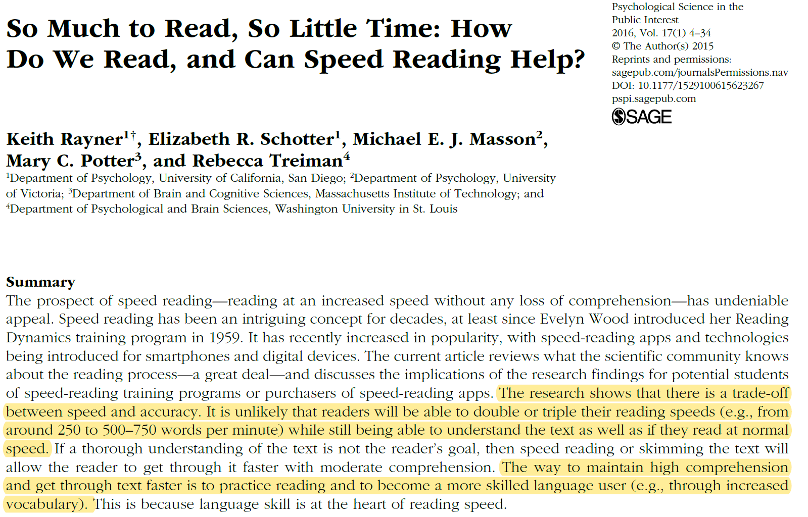
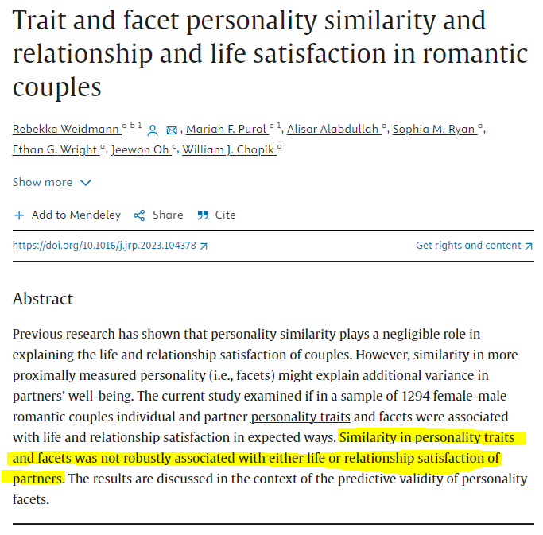
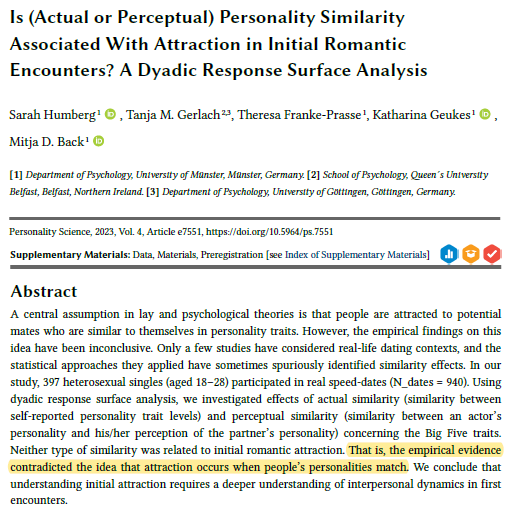

```{r setup, include=FALSE}
options(htmltools.dir.version = FALSE)

library(tidyverse)
library(kableExtra)
library(ggplot2)
library(plotly)
library(htmlwidgets)
library(MASS)
library(ggpubr)
library(xaringanthemer)
library(xaringanExtra)

style_duo_accent(
  primary_color = "#621C37",
  secondary_color = "#EE0071",
  background_image = "blank.png"
)

xaringanExtra::use_xaringan_extra(c("tile_view"))

use_scribble(
  pen_color = "#EE0071",
  pen_size = 4
  )

knitr::opts_chunk$set(
  fig.retina = TRUE,
  warning = FALSE,
  message = FALSE
)

# library(RefManageR)
# BibOptions(
# check.entries = FALSE, 
# bib.style = "authoryear", 
# cite.style = "authoryear", 
# style = "markdown",
# hyperlink = FALSE, 
# dashed = FALSE)
# myBib = ReadBib("/Users/stephangoerigk/Desktop/Universität/CFH/Lehre/Bachelor/Einführung in die Forschungsmethoden der Psychologie und Psychotherapie/EFPP_Folien/myBib.bib")
```

name: Title slide
class: middle, left
<br><br><br><br><br><br><br>
# Einführung in die Forschungsmethoden der Psychologie und Psychotherapie

### ReCap zu Einheit 1: Wie ist Psychologie als Wissenschaft möglich? 
##### 20.10.2023 | Dr. Caroline Zygar-Hoffmann


---
class: top, left
### Termine

```{r echo = F}
df = readxl::read_xlsx("Einführung in die Forschungsmethoden der Psychologie und Psychotherapie_Termine.xlsx", sheet = "Tabelle1")[1:14, 1:3]
df$Datum = format(as.Date(df$Datum), "%d.%m.%Y")
df %>%
  kbl() %>%
  kable_styling(font_size = 18) %>%
  kable_classic(full_width = T) %>% 
  row_spec(6:7, background = "yellow")
```

---
class: top, left
<div class="footer"><span>Marsh, E. J., & Sink, H. E. (2010). Access to handouts of presentation slides during lecture: Consequences for learning. Applied Cognitive Psychology, 24(5), 691-706.</div>

### "Wie lerne ich effizient?"

#### Vorlesungsunterlagen

$\rightarrow$ für Notizen nutzen (siehe https://www.issup.net/knowledge-share/resources/2020-09/notes-note-taking für Tipps WIE man effizient Notizen macht)

.center[
```{r, echo=FALSE,out.width="60%",fig.show='hold',fig.align='center'}

``` 
]


---
class: top, left
<div class="footer"><span>Donoghue, G. M., & Hattie, J. A. (2021). A meta-analysis of ten learning techniques. Frontiers in Education, 6. https://doi.org/10.3389/feduc.2021.581216</div>

### "Wie lerne ich effizient?"

#### Lernstrategien

.center[
```{r, echo=FALSE,fig.show='hold',fig.align='center'}

``` 
]

---
class: top, left
<div class="footer"><span>Dunlosky, J., Rawson, K. A., Marsh, E. J., Nathan, M. J., & Willingham, D. T. (2013). Improving students’ learning with effective learning techniques: Promising directions from cognitive and educational psychology. <br> Psychological Science in the Public interest, 14(1), 4-58.</div>

### "Wie lerne ich effizient?"

#### Lernstrategien

.center[
```{r, echo=FALSE,out.width="80%",fig.show='hold',fig.align='center'}

``` 
]

$\rightarrow$ siehe https://journals.sagepub.com/doi/full/10.1177/1529100612453266 für eine detaillierte Beschreibung jeder Technik

---
class: top, left
<div class="footer"><span>Rayner, K., Schotter, E. R., Masson, M. E., Potter, M. C., & Treiman, R. (2016). So much to read, so little time: How do we read, and can speed reading help? Psychological Science in the Public Interest, 17(1), 4-34.</div>

### "Wie lerne ich effizient?"

#### Lesetechniken

.center[
```{r, echo=FALSE,out.width="65%",fig.show='hold',fig.align='center'}

``` 
]

---
name: take-away
class: top, left

### Take-Aways (vom letzten Termin)
.content-box-gray[
* Psychologie grenzt sich von Alltagspsychologie durch **wissenschaftliche Methoden zur Erkenntnisgewinnung** ab

* Hypothesen zeichnen sich durch **empirische Überprüfbarkeit** und **Falsifizierbarkeit** aus

* Psychologie befasst sich mit **Verhalten und Erleben**

* Ziele psychologischer Forschungsarbeit sind **Beschreibung, Erklärung, Vorhersage und Beeinflussung**
]

---
class: top, left

### Wissenschaftliches Herangehen an Fragestellungen

#### "Gegensätze ziehen sich an." vs. "Gleich und gleich gesellt sich gern."

* Letzte Sitzung: Sie haben viele *Meinungen* und *(Einzel-)Erfahrungen* geteilt

* Mit wissenschaftlichen Untersuchungen werden diese Meinungen und Erfahrungen in Form von Hypothesen systematisch geprüft, indem Daten von vielen Personen gesammelt werden

* Auch individuelle und situative Bedingungen können dabei berücksichtigt werden

* Erst wenn sich in den Daten ein systematisches Muster zeigt (siehe Quantitative Methoden), können für Schlüsse über das untersuchte Phänomen/die untersuchte Hypothese ziehen

---
class: top, left
<div class="footer"><span>Weidmann, R., Purol, M. F., Alabdullah, A., Ryan, S. M., Wright, E. G., Oh, J., & Chopik, W. J. (2023). Trait and facet personality similarity and relationship and life satisfaction in romantic couples. Journal of Research in Personality, 104, 104378.</div>

### Wissenschaftliches Herangehen an Fragestellungen

#### "Gegensätze ziehen sich an." vs. "Gleich und gleich gesellt sich gern."

.center[
```{r, echo=FALSE,out.width="43%",fig.show='hold',fig.align='center'}

``` 
]


---
class: top, left
<div class="footer"><span>Humberg, S., Gerlach, T. M., Franke-Prasse, T., Geukes, K., & Back, M. D. (2023). Is (actual or perceptual) personality similarity associated with attraction in initial romantic encounters? A dyadic response surface analysis. Personality Science, 4, 1-25.</div>

### Wissenschaftliches Herangehen an Fragestellungen

#### "Gegensätze ziehen sich an." vs. "Gleich und gleich gesellt sich gern."

.center[
```{r, echo=FALSE,out.width="43%",fig.show='hold',fig.align='center'}

``` 
]

---
class: top, left
### Theorie vs. Hypothese

**Hypothese**: 

* Eine in Form einer logischen Aussage formulierte Annahme, deren Gültigkeit man zwar für möglich hält, die aber bisher nicht bewiesen bzw. verifiziert ist. 
* Hypothesen sollen prüfbare Vorhersagen machen (**empirisch testbar** und **falsifizierbar**).
* Hypothesen werden meist aus Theorien abgeleitet.

**Theorie**:

* Integration von Wissen in ein kohärentes (logisch widerspruchsfreies) theoretisches Gedankengebäude. 
* Eine Theorie enthält in der Regel beschreibende (deskriptive) und erklärende (kausale) Aussagen über einen Teil der Realität.
* Auf Grundlage von Theorie werden Vorhersagen getroffen. 

$\rightarrow$ **Eine Theorie ist "mehr" als eine Hypothese, da sie ein Phänomen umfassend beschreibt und erklärt (höheres Erklärungsvermögen).**

$\rightarrow$ **Aus einer Theorie kann man mehrere Hypothesen ableiten.**

$\rightarrow$ **Theorien sind nur Annähherungen an die Wirklichkeit: unvollständig, kontextabhängig und nicht endgültig**

---
class: top, left
<div class="footer"><span>Byrne, D. (1997). An overview (and underview) of research and theory within the attraction paradigm. Journal of Social and Personal Relationships, 14(3), 417-431.</div>

### Theorie vs. Hypothese

.center[
```{r, echo=FALSE,out.width="80%",fig.show='hold',fig.align='center'}
knitr::include_graphics("bilder/byrne1997.PNG")
``` 
]

---
class: top, left
### Was ist Psychologie?

#### Verhalten und Erleben

**Beschreibungsebenen:** behavioral (b), kognitiv (k), emotional (e), physiologisch (p)

.pull-left[
<br>
```{r eval = TRUE, echo = F, out.width = "500px"}
knitr::include_graphics("bilder/KVT.png")
```

<!--**Übung**: Füllen Sie für sich ein SORK-Schema aus.-->
]
.pull-right[

**SORK-Schema** der kognitiven Verhaltentherapie

**S**timulus: Person drängelt an Supermarktkasse vor.

**O**rganismus: Biographie, Einstellungen, Kompetenzen...

**R**eaktion (b): Ich sage nichts, lasse es geschehen.<br>
**R**eaktion (k): "Das war ja klar.", "Ich bin es nicht wert."<br>
**R**eaktion (e): Niedergeschlagenheit<br>
**R**eaktion (p): Erröten, Knoten im Hals

**K**onsequenz (negativ): Ich werde übergangen. <br>
**K**onsequenz (positiv): Kein Konflikt

$\rightarrow$ **Grundlage für Diagnostik und Intervention**
]

---
class: top, left

### "Was halten Sie davon, auf Basis von vergangenem Verhalten Vorhersagen zu machen?"

#### Ziele der Psychologie

#####  Vorhersage

* Bestimmen von **Wahrscheinlichkeit** des Auftretens eines bestimmten Ereignisses mit hinreichender Genauigkeit

* Vorhersage setzt häufig gute Erklärung voraus

* Wenn mehrere Erklärungen denkbar $\rightarrow$ die Wahrscheinlichste (beste Vorhersage) "gewinnt"

* Vorhersagen müssen **exakt** formuliert werden, um prüfbar zu sein: Wann und unter welchen **Bedingungen** tritt ein Ereignis ein?

$\rightarrow$ **Es geht um Wahrscheinlichkeiten und um mittlere Effekte.**

$\rightarrow$ **Simplifizierung, die mitgedacht werden muss, aber kein Determinismus!**

$\rightarrow$ **Nicht zwingend "vergangenes Verhalten"** ***einer*** **bestimmten Person, sondern Erkenntnisse, die auf Basis von Daten mehrerer (im besten Fall vieler, repräsentativer) Personen gewonnen wurden.**


---
class: top, left

### "Was halten Sie davon, auf Basis von vergangenem Verhalten Vorhersagen zu machen?"

#### Besonderheiten psychologischer "Gesetzes"-aussagen

* Keine Formulierung von Naturgesetzen

* Psychologische Gesetzesaussagen sind Aussagen, die für viele Fälle zutreffen, aber nicht für alle, d.h. Vorhersagen für einen ganz konkreten Fall sind nicht (mit Sicherheit) möglich

.center[
```{r eval = TRUE, echo = F, out.width = "70%"}
knitr::include_graphics("bilder/determinismus_vs_prabilismus.png")
```
]

* Um Wahrscheinlichkeitsaussagen falsifizierbar machen zu können, bedienen wir uns eines methodischen Kriteriums ( $\rightarrow$ Signifikanztest, siehe Quantitative Methoden) 

---
class: top, left
<div class="footer"><span>Kapitel 1 in Slunecko, T., & Benetka, G. (2023). Geschichte und Paradigmen der Psychologie und Psychotherapie. utb. </span></div>

### Entwicklung der modernen Psychologie

#### Historische Grundlagen

* **Philosophie als Ausgangspunkt** für Wissenschaftsdisziplinen im weiteren Sinne

* Aufschwung der Naturwissenschaften im 19.Jahrhundert: **Identitätskrise und Neuordnung der Philosophie**

* **Neuer Gegenstand der Philosophie**: Geschichte der Philosophie, Ethik, Logik und normative Erkenntnislehre

* **Korrektur:** 
  - **Vitalismus** (Johannes Müller) = Belebte und unbelebte Natur unterscheiden sich durch besondere "Kraft" (bei Aristoteles: Seele)
  - **Kritik am Vitalismus**: Im Organismus keine anderen Kräfte wirksam, als die physikalisch-chemischen

* **1879: Wilhelm Wundt** (eigentlich ein Physiologe) gründet in Leipzig weltweit erstes experimentalpsychologisches Laboratorium

* **Philosophische Fragen** – vor allem Fragen der Erkenntnistheorie – wurden in der neuen Wissenschaft Psychologie **mit in der Physiologie erprobten Denk- und Forschungsweisen** zu bearbeiten versucht

<!-- library(renderthis)  -->
<!-- to_pdf("EinfForsch_01_PsychologieAlsWissenschaft_ReCap.Rmd", complex_slides = TRUE) -->