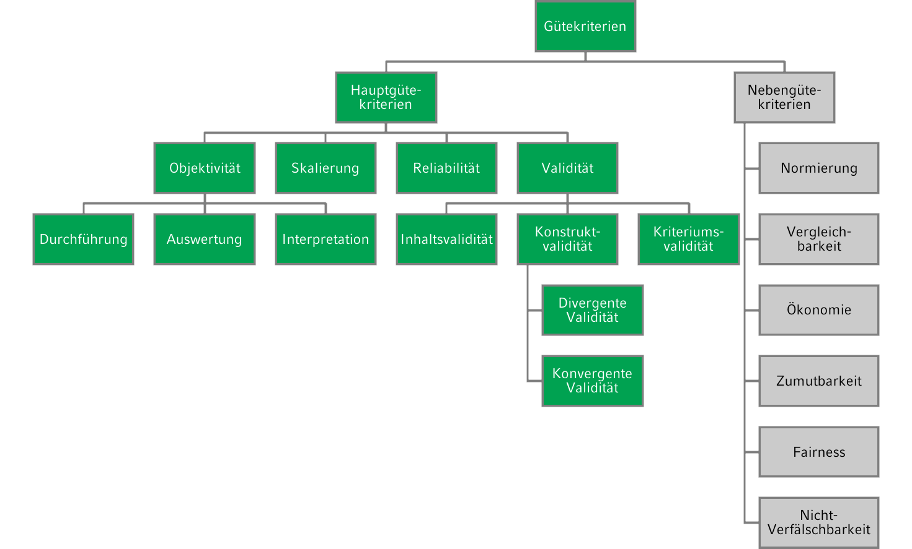
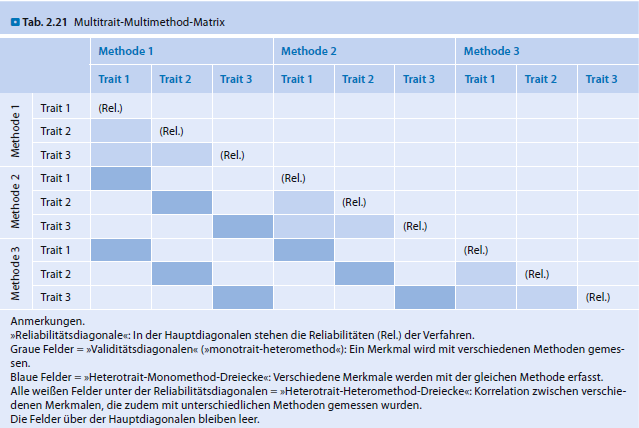
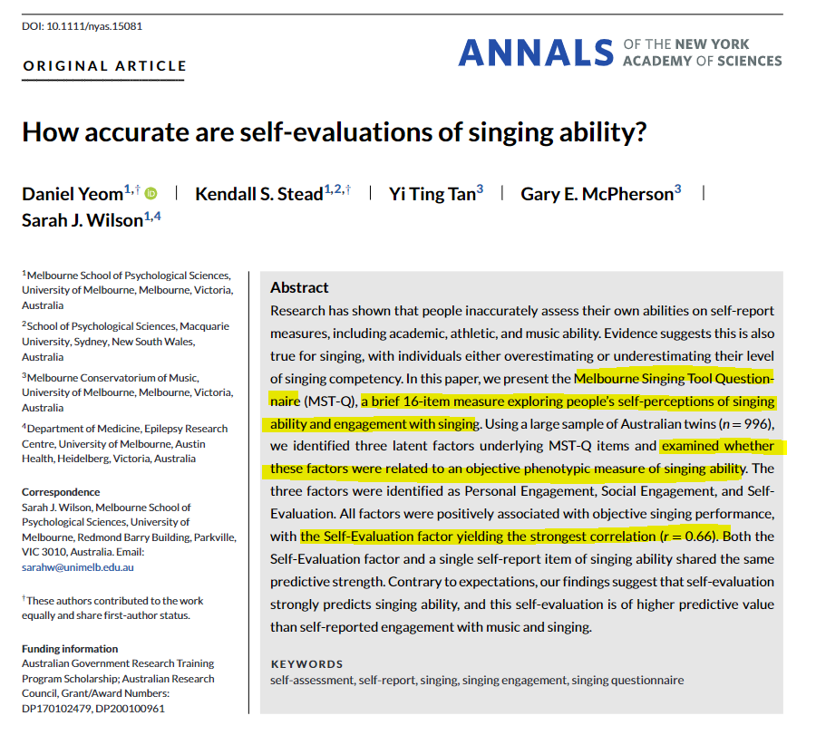
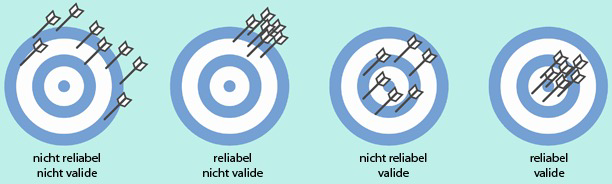
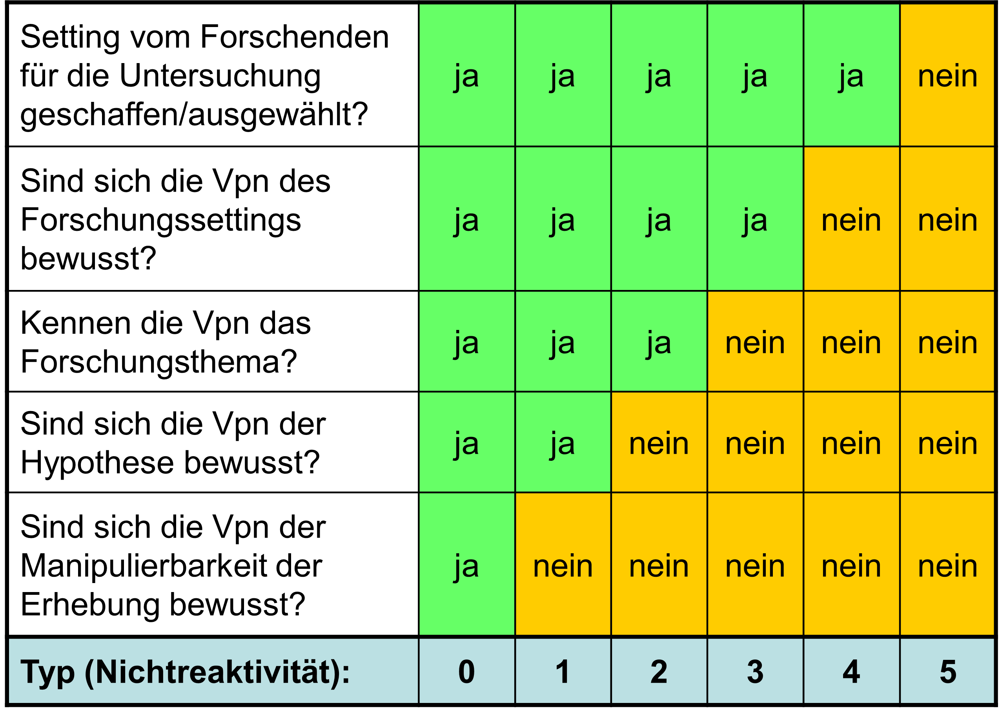

```{r setup, include=FALSE}
options(htmltools.dir.version = FALSE)

library(tidyverse)
library(kableExtra)
library(ggplot2)
library(plotly)
library(htmlwidgets)
library(MASS)
library(ggpubr)
library(xaringanthemer)
library(xaringanExtra)

style_duo_accent(
  primary_color = "#621C37",
  secondary_color = "#EE0071",
  link_color = "#7da5f5",
  background_image = "blank.png"
)

xaringanExtra::use_xaringan_extra(c("tile_view"))

use_scribble(
  pen_color = "#EE0071",
  pen_size = 4
  )

knitr::opts_chunk$set(
  fig.retina = TRUE,
  warning = FALSE,
  message = FALSE
)

```

name: Title slide
class: middle, left
<br><br><br><br><br><br><br>
# Einführung in die Forschungsmethoden der Psychologie und Psychotherapie

### Einheit 2: Messen in der Psychologie
##### 16.04.2024 | Dr. Caroline Zygar-Hoffmann

---
class: top, left
name: content
### Heutige Themen

#### [Unterteilung, Auswahl und Einsatz von psychologischen Erhebungsmethoden](#intro)

#### [Gütekriterien](#kriterien)

#### [Reaktivität](#reaktivitaet)

#### Take-Aways und Schlüssel-/Fachbegriffe
* [Take-Aways](#take-away)
* [Schlüssel-/Fachbegriffe](#words)

---
class: top, left
name: intro

### Unterteilung, Auswahl und Einsatz von psychologischen Erhebungsmethoden

Frage nach der sogenannten **Operationalisierung** von psychologischen Variablen: Wie kann und möchte ich die psychologische Variable abbilden, die mich interessiert?

**Variablen in der Psychologie unterscheiden sich in ihrer empirischen Zugänglichkeit:**

.pull-left[
**Manifeste Variablen**: 
* der Sinneserfahrung direkt zugänglich, direkt beobachtbar
* Beispiele: sichtbares Verhalten, Gesichtsausdruck, Blutdruck, Reaktionszeiten, Inhalt von Aussagen/Antworten, Anzahl gelöster Aufgaben

$\rightarrow$ leicht feststellbar, theoretische Bedeutung meist direkt ersichtlich
]

.pull-right[
**Latente Variablen = Konstrukte**: 
* nur indirekt mit Beobachtungssachverhalten in Verbindung zu bringen, nicht direkt beobachtbar
* Beispiele: Persönlichkeit, Intelligenz, Emotion, Depression

$\rightarrow$ man schließt von manifesten Indikatoren auf das latente Merkmal auf Basis von theoretischen Überlegungen (Annahme: latente Variable beeinflusst den manifesten Indikator)
]

> Was für weitere manifeste oder latente Variablen fallen Ihnen ein?

<!-- manifest: grün, Alter, schlechtes Wetter, Haarfarbe, Deutschnote 2, Porschefahrerin
latent: Messfehler, geringes Selbstwertgefühl, schlechtes Gewissen, Belastbarkeit -->

---
class: top, left

### Unterteilung, Auswahl und Einsatz von psychologischen Erhebungsmethoden

#### Unterteilung von Erhebungsmethoden

**1. Unterscheidung nach Vorgehen bei der Methode:**

* Verhaltensbeobachtungsverfahren $\rightarrow$ siehe Einheit 3

* Verfahren des Selbst- bzw. Fremdberichts (Fragebögen, Interviews) $\rightarrow$ siehe Einheit 4

* Psychologische Tests (z.B. Leistungstests) $\rightarrow$ siehe Einheit 4

* Biopsychologische bzw. neurowissenschaftliche Messungen $\rightarrow$ siehe Einheit 6

* Computerbasierte Verfahren $\rightarrow$ siehe Einheit 4

* Implizite Verfahren $\rightarrow$ siehe Einheit 4

* Dokumentenanalyse $\rightarrow$ siehe Einheit 5

$\rightarrow$ Verfahren sind nicht völlig distinkt, sondern weisen Überschneidungen auf (z.B. gibt es psychologische Tests als computerbasierte Verfahren)

---
class: top, left

### Unterteilung, Auswahl und Einsatz von psychologischen Erhebungsmethoden

#### Unterteilung von Erhebungsmethoden

**2. Unterscheidung nach Art der Daten, die generiert werden:**

.pull-left[
**Quantitative** Erhebungsmethoden: 
* Erfahrungsrealität wird in Zahlen erfasst bzw. übersetzt
* Ergebnis: primär numerische Daten 
* Beispiele: Antworten auf eine Frage mit einer Antwortskala von 1-5, Anzahl gelöster Aufgaben, Ampulitudenhöhe bei einer EEG-Messung
* Häufig stark standardisiert
* Dominante Erhebungsmethode in der Psychologie
]

.pull-right[
**Qualitative** Erhebungsmethoden: 
* Erfahrungsrealität wird in Wörtern oder anderen nicht-numerischen Repräsentationen (z.B. Abbildungen) erfasst bzw. übersetzt
* Ergebnis: primär verbale Daten
* Häufig weniger stark bis gar nicht standardisiert
* Beispiele: gesprochene Inhalte, geschriebene Texte, Beobachtungsprotokolle
]

$\rightarrow$ Viele der auf der vorherigen Folie genannten Methoden gibt es in quantitativen und qualitativen Varianten

---
class: top, left
### Unterteilung, Auswahl und Einsatz von psychologischen Erhebungsmethoden

#### Auswahl und Einsatz von Erhebungsmethoden

##### Übergeordnete Perspektive

* **Ziel:** wissenschaftliche Fragestellungen in der Psychologie in Breite und Tiefe beantworten

* **Lösung:** Prinzipiell anstreben, Fragestellungen mit mehreren Datenerhebungsverfahren bzw. basierend auf unterschiedlichen Datenquellen zu untersuchen ("**multimodale** Erfassung" oder "**multimethodale** Erfassung")

##### Perspektive der Einzelstudie

* häufig nicht möglich oder sinnvoll (ökonomischen oder versuchsplanerische Gründe), innerhalb einer einzigen Studie verschiedene Methoden einzusetzen

* konkrete einzelne Untersuchung $\rightarrow$ gezielte Auswahl weniger Methoden

---
class: top, left
name: kriterien

### Erhebungsmethoden der psychologischen Forschung

#### Gütekriterien von Erhebungsmethoden

.pull-left[
* Zur Auswahl und Bewertung psychologischer Erhebungsmethoden müssen Qualitätskriterien berücksichtigt werden. 

* Für quantitative Methoden kann man rechtstehende Güterkriterien betrachten.

* Skalierbarkeit manchmal auch als Teilaspekt der Validität ("Strukturelle Validität") oder als Nebengütekriterium

* Für Gütekriterien von qualitativen Methoden $\rightarrow$ siehe Einheit 5
]


.pull-right[
```{r, echo=FALSE,fig.show='hold',fig.align='center'}

``` 
]

---
class: top, left
### Erhebungsmethoden der psychologischen Forschung

#### Gütekriterien von Erhebungsmethoden

##### Objektivität

**Definition:**
Eine Erhebungsmethode ist objektiv, wenn sie das Merkmal unabhängig von Testleiter:in, Testauswerter:in und von Ergebnisinterpretation misst.

3 Bereiche lassen sich unterscheiden:

1. Durchführungsobjektivität (Testleiterunabhängigkeit) 

2. Auswertungsobjektivität (Verrechnungssicherheit)

3. Interpretationsobjektivität (Interpretationseindeutigkeit)

---
class: top, left
### Erhebungsmethoden der psychologischen Forschung

#### Gütekriterien von Erhebungsmethoden

##### Objektivität

**Durchführungsobjektivität**

**Definition**: Testergebnis soll nicht davon abhängen, welche Testleiter:in Test durchführt $\rightarrow$ Erhebung sollte unter möglichst standardisierten Bedingungen stattfinden, Testperson als einzige Variationsquelle

Kann bei Verhaltensbeobachtung z.B. durch statistische Kennzahlen zur *Beobachtungs*übereinstimmung erfasst werden

Standardisierung wird optimiert durch:

* Instruktionen der Testleiter und Ablauf schriftlich festhalten (z.B. auch durch Interviewleitfäden bei Interviews, oder Beobachtungsplan bei Verhaltensbeobachtung)
* soziale (nicht-testbezogene) Interaktion zwischen Versuchsleiter und Testperson gering halten 
* für möglichst ähnliche Untersuchungssituation sorgen (z.B. Einzel vs. Gruppentestung, Zeitbegrenzungen)
* eindeutige Anweisungen für Umgang mit Nachfragen, Störungen im Testablauf
* Bei Verhaltensbeobachtung: Training von Beobachtern

---
class: top, left
### Erhebungsmethoden der psychologischen Forschung

#### Gütekriterien von Erhebungsmethoden

##### Objektivität

**Auswertungsobjektivität**

**Definition**: Beim Vorliegen der Antworten/Beobachtungen einer Person soll jede Auswerter:in zum selben Ergebnis kommen

Kann z.B. durch statistische Kennzahlen zur *Beurteilungs*übereinstimmung erfasst werden

Auswertungsobjektivität wird optimiert durch:

* Vermeiden freier Antwortformate
* klare Auswertungsregeln
* Hilfsmittel, wie z.B. Auswertungsschablonen oder computergestützte Auswertung
* Festgelegte Ausschlusskriterien
* Informationen zum Umgang mit fehlenden Werten
* Festlegung von Antwortmöglichkeiten z.B. bei Interviews
* Verhaltensverankerte Ratingskalen, z.B. bei Verhaltensbeobachtungen
* Training von Beurteilern

---
class: top, left
### Erhebungsmethoden der psychologischen Forschung

#### Gütekriterien von Erhebungsmethoden

##### Objektivität

**Interpretationsobjektivität**

**Definition**: Unterschiedliche Erheber:innen sollen beim Vorliegen der Ergebnisse zum selben Schluss kommen.

Interpretationsobjektivität kann erhöht werden durch:

* klare Regeln für die Interpretation, z.B. durch Vorgaben zur Benennung und Beschreibung des erhobenen Merkmals, sowie der Bedeutung seiner Ausprägungen
* Vorhandensein von Normen/Normwerten inkl. Informationen zu den darin verwendenten Stichproben
* Hinweise auf Interpretation auf Basis von Konfidenzintervallen (Vertrauensbereiche, siehe VL Quantitative Methoden) und Klassifikation in Kategorien (z.B. „durchschnittlich“)
* Fallbeispiele

---
class: top, left
### Erhebungsmethoden der psychologischen Forschung

#### Gütekriterien von Erhebungsmethoden

##### Reliabilität

**Definition:** Eine Erhebungsmethode ist (vollständig) reliabel (zuverlässig), wenn sie das Merkmal ohne Messfehler misst $\rightarrow$ Reliabilität gibt den Grad der Genauigkeit an, mit der eine Erhebungsmethode misst

* Formal: Anteil der Varianz der wahren Werte an der Gesamtvarianz (siehe Vorlesung Testtheorie)

* Wichtige Einflussgröße auf Breite der Konfidenzintervalle in der Einzelfalldiagnostik (wie sicher kann ich mir bei einer einzelnen Messung sein)

---
class: top, left
### Erhebungsmethoden der psychologischen Forschung

#### Gütekriterien von Erhebungsmethoden

##### Reliabilität

Es lassen sich verschiedene Arten zur Schätzung der Reliabilität unterscheiden: 

* **Retest-Reliabilität** $\rightarrow$ Erhebungsmethode kommt bei Wiederholung zum selben Ergebnis

* **Paralleltest-Reliabilität** $\rightarrow$ Erhebungsmethode kommt unter vergleichbaren Bedingungen bzw. vergleichbaren Erhebungsmethoden (z.B. bei Durchführung mit einer Parallelform) zum selben Ergebnis

* **Innere Konsistenz** $\rightarrow$ Einzelteile der Erhebungsmethode (z.B. Items eines Fragebogens) kommen alle zu ähnlichen Ergebnissen

* **Testhalbierungs- (Split Half-)Reliabilität** $\rightarrow$ analog zur inneren Konsistenz: Trennung der Erhebungsmethode in genau zwei Hälften, und Vergleich der Ergebnisse

---
class: top, left
<div class="footer"><span>Borsboom, D., Mellenbergh, G. J., & Van Heerden, J. (2004). The concept of validity. <i>Psychological Review, 111</i>(4), 1061–1071. https://doi.org/10.1037/0033-295X.111.4.1061.</div>

### Erhebungsmethoden der psychologischen Forschung

#### Gütekriterien von Erhebungsmethoden

##### Validität

**Definition:** Eine Erhebungsmethode ist valide, wenn sie das Merkmal, das sie messen soll, auch wirklich misst (und nichts anderes).

Zwei wichtige Aspekte:

.pull-left[
**Kausale Validität**
* Verursache Variation im Merkmal eine Variation im Testwert?
* Bei kausaler Validität geht es nicht um Korrelation (ungerichtete Zusammenhänge), sondern um Kausalität (gerichtete Zusammenhänge)
* Kausale Validität ist das eigentliche Herzstück, wenn man von "Validität" spricht
]

.pull-right[
**Inhaltsvalidität**
* Erhebungsmethode erfasst repräsentativ alle relevanten Bestandteile des erhobenen Konstrukts
* Beispiel: Depressionsfragebogen sollte alle relevanten Depressionssymptome und keine nicht für Depression relevanten Symptome enthalten
]
---
class: top, left
### Erhebungsmethoden der psychologischen Forschung

#### Gütekriterien von Erhebungsmethoden

##### Validität

Häufig angewandte **Validierungsmöglichkeiten** auf Basis von Korrelationen:

1) Untersuchung der **Konstruktvalidität**
  
  * Erhebungsmethode erzeugt Daten, die mit Daten anderer Erhebungsmethoden zusammenhängen, die dasselbe oder etwas sehr ähnliches messen sollen (**konvergente Validität**)
  
  * Erhebungsmethode erzeugt Daten, die mit Daten anderer Erhebungsmethoden, die *nicht* dasselbe messen sollen, weniger stark zusammenhängen (**divergente/diskriminante Validität**)
  
  * (Teilweise wird hier auch **Faktorielle Validität** verordnet: Erwartungsgemäße statistische Faktorenstruktur des Tests $\rightarrow$ siehe Vorlesung Testtheorie)

---
class: top, left
<div class="footer"><span>Schmidt-Atzert, L., & Amelang, M. (2012). Psychologische Diagnostik. Springer Science & Business Media.</div>

### Erhebungsmethoden der psychologischen Forschung

#### Gütekriterien von Erhebungsmethoden

##### Validität

* Basis für Erwartungen im Rahmen der Konstruktvalidität sind theoretische Überlegungen, die a priori (vor Kenntnis der empirischen Zusammenhänge) aufgestellt werden sollten

* Mit der sogenannten "**Multitrait-Multimethod-Methode**" können diese a priori Erwartungen systematisiert und entsprechende empirische Belege verordnet werden


.pull-left[
* Problem sind Zirkelschlüsse:
  * Test A: „Test A korreliert (erwartungsgemäß) mit Test B, also ist A valide!“
  * Test B: „Test B korreliert (erwartungsgemäß) mit Test A, also ist B valide!“
  * Was wäre denn, wenn Test A und Test B beide etwas völlig anderes messen würden? (Intelligenz vs. Arbeitsgedächtnis)
]

.pull-right[
```{r, echo=FALSE,out.width = "75%", fig.show='hold',fig.caption="Schmidt-Atzert & Amelang, 2012, S.153", fig.align='center'}

``` 
]

---
class: top, left

### Erhebungsmethoden der psychologischen Forschung

#### Gütekriterien von Erhebungsmethoden

##### Validität

Häufig angewandte **Validierungsmöglichkeiten** auf Basis von Korrelationen:

2) Untersuchung der **Kriteriumsvalidität**

* Erhebungsmethode erzeugt Daten, die mit relevanten, konkreten, externen Kriterien (außerhalb der unmittelbaren Testsituation) in Zusammenhang stehen (z.B. Intelligenztest mit Kriterien für Berfugserfolg, z.B. Gehalt, Karrierestufe, Abschluss)

* Auch Untersuchung über **(Extrem) -gruppenvergleiche**, die erwartungsmäße Muster zeigen, d.h. Studien zu Mittelwertsunterschieden zwischen Gruppen bei denen ein Unterschied erwartet wird (z.B. Test der Einstellung gegenüber der Kirche misst sollte bei Kirchengängern höher ausfallen als bei Nicht-Kirchengängern)
  
* **Inkrementelle (Kriteriums-)validität**: Beitrag einer Erhebungsmethode zur Verbesserung der Vorhersage eines Kriteriums über andere Erhebungsmethoden hinaus


---
class: top, left
<div class="footer"><span>Schmidt-Atzert, L., & Amelang, M. (2012). Psychologische Diagnostik. Springer Science & Business Media.</div>

### Erhebungsmethoden der psychologischen Forschung

#### Gütekriterien von Erhebungsmethoden

##### Validität

```{r, echo=FALSE, out.width = "50%", fig.show='hold',fig.caption="Schmidt-Atzert & Amelang, 2012, S.146", fig.align='center'}

``` 

---
class: top, left
<div class="footer"><span>Yeom, D., Stead, K. S., Tan, Y. T., McPherson, G. E., & Wilson, S. J. (2023). How accurate are self‐evaluations of singing ability?. <i>Annals of the New York Academy of Sciences, 1530</i>(1), 87-95.</div>

### Erhebungsmethoden der psychologischen Forschung

#### Gütekriterien von Erhebungsmethoden

##### Validität

.center[
```{r, echo=FALSE,out.width="43%",fig.show='hold',fig.align='center'}

``` 
]


---
class: top, left
### Erhebungsmethoden der psychologischen Forschung

#### Gütekriterien von Erhebungsmethoden

Veranschaulichung unterschiedlicher Reliabilität und Validität

.center[
```{r, echo=FALSE,fig.show='hold',fig.align='center'}

``` 
]

---
class: top, left

### Erhebungsmethoden der psychologischen Forschung

#### Gütekriterien von Erhebungsmethoden

##### Skalierbarkeit

Bei der Skalierbarkeit geht es um die **statistische Modellierung von Antwortprozessen**: Ein psychologischer Test gilt als skalierbar, wenn die Zuordnung der Messwerte zu den Personen auf der Basis eines empirisch nachgewiesenen testtheoretischen Modells geschieht.

**Zwei Aspekte:**
* Empirischer "Nachweis" , dass ein bestimmtes testtheoretisches Modell gilt, also das "Richtige" ist 
* Auf der Basis des "nachgewiesenen" testtheoretischen Modells Personen Werte auf den latenten Variablen zuweisen (und nicht irgendwie anders)

---
class: top, left

### Erhebungsmethoden der psychologischen Forschung

#### Gütekriterien von Erhebungsmethoden

##### Skalierbarkeit

**Klassische Testtheorie:**

* Die meisten Fragebögenskalen und Tests basieren auf der klassischen Testtheorie (daher werden Sie dazu bereits im Bachelor eine eigene Vorlesung hören)

* Zentrale Annahme der Klassischen Testtheorie: Jeder Testwert einer Person auf einem konkreten Item (z.B. einer Frage) ist aus zwei Komponenten zusammengesetzt

.pull-left[
  **1. Wahrer Wert:**

  * mittlerer Testwert, den eine Person in einer unendlichen Serie von Testwiederholungen erzielen würde (Erwartungswert)
  * keine praktisch erzielbare, sondern eine theoretische Größe
  * kann durch die konkrete empirische Antwort einer Person geschätzt werden
]

.pull-right[
  **2. Fehleranteil (Messfehler):**

  * Abweichung dieses empirischen Schätzwerts vom wahren Wert 
]

* Es existieren verschiedene testtheoretische Modelle je nach Annahme wie sich die Items in Hinblick auf die Messung der latenten Variable unterscheiden

---
class: top, left

### Erhebungsmethoden der psychologischen Forschung

#### Gütekriterien von Erhebungsmethoden

##### Skalierbarkeit

**Klassische Testtheorie:**

* Anwendung auf Ratingskalen möglich (aber eigentlich für stetige Variablen entwickelt, z.B. Reaktionszeiten)

* Ziel: möglichst direkte und präzise Schätzung des wahren Werts auf einem Item, um darauf basierend einen Rückschluss auf eine latente Variable machen zu können

* Durch den Einsatz mehrerer Testitems soll der Fehleranteil insgesamt minimiert werden

* Anders ausgedrückt: Mehrere Items ermöglichen eine bessere Annäherung an die latente Variable einer Person

* klassische Testtheorie setzt somit voraus, dass wahre Werte und Fehlerwerte (und ihre jeweiligen Varianzen in Stichproben) getrennt bestimmt werden können $\rightarrow$ wertvoll zur Bestimmung der Reliabilität

---
class: top, left
<div class="footer"><span>Kapitel 10.4.4. in Döring, N. & Bortz, J. (2016). <i>Forschungsmethoden und Evaluation in den Sozial- und Humanwissenschaften.</i> Pearson.</span></div>


### Erhebungsmethoden der psychologischen Forschung

#### Gütekriterien von Erhebungsmethoden

##### Skalierbarkeit

**Axiome (definitorische Festlegungen/Annahmen) der klassischen Testtheorie und die Folgerungen daraus**

1. **Verknüpfungsaxiom:** Ein Testwert setzt sich zusammen aus der Summe von wahrem Wert (Erwartungswert über unendlich viele Messungen) und Messfehler (z.B. Störeinflüsse der Umwelt). 

2. **Existenzaxiom:** Der mittlere Messfehler ist gleich null. Bei wiederholten Testanwendungen gleichen sich die verschiedenen Messfehler sozusagen aus.

3. **Unabhängigkeitsaxiom:** Wahre Werte und Messfehler eines Items/Tests sind nicht miteinander korreliert (voneinander unabhängig) $\rightarrow$ Es werden nicht in bestimmten Ausprägungsbereichen des Items/Merkmals mehr oder weniger Messfehler gemacht.

4. **Lokale stochastische Unabhängigkeit**: Die Messfehler von verschiedenen Items/Tests sind nicht miteinander korreliert (voneinander unabhängig).

5. **Zusatzannahme**: Messfehler eines Items/Tests sind nicht mit den wahren Werten eines anderen Items/Tests korreliert  $\rightarrow$ Die Messfehler hängen nicht von bestimmten Eigenschaften ab.

$\rightarrow$ **Mit Messfehler werden in der der KTT nur unsystematische Messfehler gemeint/berücksichtigt. Es kann jedoch auch systematische Messfehler geben**... 

<!-- Eine Erhöhung der Variabilität systematischer Fehler (Verzerrungen) führt zu einer Erhöhung der Reliabilität, da sie nicht zur Fehlervarianz, sondern zur Varianz der wahren Werte hinzugerechnet werden. -->

---
class: top, left

### Erhebungsmethoden der psychologischen Forschung

#### Gütekriterien von Erhebungsmethoden

##### Skalierbarkeit

.pull-left[
**Unsystematische Messfehler**

* zufällige Fehler

* Beispiel: vorübergehende, nicht systematisch auftretende Unaufmerksamkeit, die bei einem Mal zu einer höheren und beim anderen Mal zu einer niedrigeren Itemantwort führt
]

.pull-left[
**Systematische Messfehler**

* spezifische Situations- oder Persönlichkeitseffekte, die die Antworten systematisch in eine bestimmte Richtung verzerren

* Beispiele: extremer Antwortstil, sozial erwünschte Antworten, mangelnde Motivation bei der Bearbeitung des Tests, Methodeneffekte...
]

---
class: top, left

### Erhebungsmethoden der psychologischen Forschung

#### Gütekriterien von Erhebungsmethoden

##### Skalierbarkeit

**Zusammenfassung: Klassische Testtheorie**: 
  * Schätzung des wahren Werts unter Berücksichtigung des (unsystematischen) Messfehlers
  * Es existieren verschiedene testtheoretische Modelle je nach Annahme wie sich die Items in Hinblick auf die Messung der latenten Variable unterscheiden

**Ausblick: Probabilistische Testtheorie aka. Item-Response-Theorie** (IRT, Embretson & Reise, 2000; Rasch, 1980)
  * Schätzung der Wahrscheinlichkeit, mit der eine Person mit einer bestimmten Merkmalsausprägung ein Item auf eine bestimmte Art beantwortet (bzw. ein Item löst)
  * Es existieren verschiedene testtheoretische Modelle je nach Skalenniveau der Antworten (d.h. auch für dichotome Antworten einsetzbar, z.B. ja/nein, richtig/falsch)
  * Detailliertere Abbildung des Antwortprozesses möglich als bei der KTT (z.B. Berücksichtigung von Ratewahrscheinlichkeiten)
  * Ausführliche Behandlung im Masterstudium

---
class: top, left
### Erhebungsmethoden der psychologischen Forschung

#### Gütekriterien von Erhebungsmethoden

**Nebengütekriterien**

.pull-left[
* **Normierung:** Bezugssystem vorhanden, auf Basis aktueller, repräsentativer und großer Stichprobe, um die individuellen Testwerte vergleichend einordnen zu können
* **Vergleichbarkeit:** Parallelform bzw. andere Verfahren mit gleichem Gültigkeitsbereich vorhanden
* **Ökonomie:** Verfahren ist kurz, einfach in der Handhabung, für Gruppenuntersuchung geeignet, wenig materialintensiv und schnell auswertbar (Verhältnis von Kosten und Nutzen im Vergleich zu anderen Verfahren relevant)
]

.pull-right[
* **Zumutbarkeit:** Schonung der untersuchten Personen in zeitlicher, psychischer und körperlicher Hinsicht
* **Fairness:** Einzelne Gruppen werden durch die erhaltenen Ergebnisse eines Verfahrens nicht diskriminiert, d.h. nicht aufgrund einer testirrelevanten
Eigenschaft systematisch benachteiligt
* **Nicht-Verfälschbarkeit:** keine willentliche Beeinflussung der Testleitung zum Erlangen eines ungerechtfertigten Vorteils
* **Nutzen** (wird nicht immer aufgeführt): Erfüllung eines praktischen Bedürfnisses durch den Test (der nicht schon besser durch andere Verfahren abgedeckt ist)
]

---
class: top, left
name: reaktivitaet
<div class="footer"><span>Adair, J. G. (1984). The Hawthorne effect: A reconsideration of the methodological artifact. <i>Journal of Applied Psychology, 69</i>(2), 334–345. https://doi.org/10.1037/0021-9010.69.2.334 <br> Jones, S. R. (1992). Was there a Hawthorne effect?. <i>American Journal of Sociology, 98</i>(3), 451-468. <br> Roethlisberger, F., & Dickson, W. J (1939). <i>Management and the Worker</i>. Harvard University Press.</span></div>

### Erhebungsmethoden der psychologischen Forschung

#### Problem der Reaktivität

**Definition**: Veränderung/Verzerrung der erhobenen Daten aufgrund der Kenntnis der untersuchten Person darüber, dass sie Gegenstand einer Untersuchung ist

**Mögliche Ursachen**: Veränderte Aufmerksamkeitslenkung, Relevanz sozialer Erwünschtheit (Selbstdarstellerisches, sozial konformes (Antwort-)Verhalten)

$\rightarrow$ Datenerhebungen in Psychologie verändern oft bereits den Gegenstand

**Beispiel: Hawthorne-Effekt**

* klassische Studie in den Hawthorne-Werken der Western Electric Company (Roethlisberger und Dickson, 1939)
* Aussage: bloße wissenschaftliche Untersuchung der Arbeiter:innen führte zu Steigerung der Produktivität, Produktivitätssteigerung war **unabhängig** von den durch die Forscher implementierten Veränderungen der Arbeitsbedingungen
* Es folgte methodische Kritik an dieser Studie (z.B. Adair, 1984; Jones, 1992)
* Trotzdem: Mögliche **Bewertungserwartung** der untersuchten Personen aka **Aufforderungscharakteristika** der Untersuchung bekam dadurch Aufmerksamkeit

---
class: top, left
<div class="footer"><span>Milgram, S., Mann, L., & Harter, S. (1965). The lost-letter technique: A tool of social research. <i>Public Opinion Quarterly, 29</i>(3), 437-442. <br> Campbell, D. T., Kruskal, W. H., & Wallace, W. P. (1966). Seating aggregation as an index of attitude. <i>Sociometry</i>, 1-15. <br> Clack, B., Dixon, J., & Tredoux, C. (2005). Eating together apart: Patterns of segregation in a multi‐ethnic cafeteria. <i>Journal of Community & Applied Social Psychology, 15</i>(1), 1-16.</span></div>

### Erhebungsmethoden der psychologischen Forschung

#### Problem der Reaktivität

Einschätzung des Ausmaßes der Reaktivität bzw. Nichtreaktivität abhängig von Informationslage der Versuchspersonen (Vpn)

.pull-left[
```{r eval = TRUE, echo = F}

```
]

.pull-right[

Beispiel für Typ 4: "Lost-Letter-Technique", bei der Briefe frankiert an öffentlichen Orten fallen gelassen werden, und geprüft (und dadurch zeitversetzt "beobachtet" wird), ob sie abgesendet werden (Milgram, Mann & Harter, 1965)

Beispiel für Typ 5: Spontane Nähe-vs. Distanzregulation im Hörsaal (Campbell, Kruskal & Wallace, 1966) oder in einer Cafeteria (Clack, Dixon & Tredoux, 2005)

]

---
class: top, left
### Erhebungsmethoden der psychologischen Forschung

####  Maßnahmen zur Reduktion von Reaktivität

```{r echo = F}

df = data.frame(Maßnahme = c("Versuchspersonen in Unkenntnis darüber lassen, dass sie untersucht werden",
                             "Versuchspersonen Anonymität zusichern",
                             "Coverstory über den Untersuchungszweck entwickeln",
                             "Maße einsetzen, die von Versuchspersonen nicht kontrolliert oder beeinflusst werden können (nicht-reaktive Messverfahren)",
                             "Indirekte/implizite Messverfahren einsetzen"),
                Bewertung = c("Nur in Feld-, Archiv- oder Internetstudien praktikabel, nicht in Laborstudien; kann ethisch problematisch sein",
                             "Besonders wichtig bei der Erhebung von persönlichen/sensiblen Daten; reduziert sozial-erwünschtes Antworten",
                             "Wichtig in hypothesenprüfenden Studien, in denen die Versuchspersonen erforschtes Verhalten kontrollieren können; Täuschung ethisch zu reflektieren",
                             "Angenommen für biopsychologische Maße, die kaum kontrollierbare physiologische Vorgänge erfassen (z.B. Messung von Hormonspiegeln oder  Verfahren zur Messung der Gehirnaktivität",
                             "Versuchspersonen können aus gemessenen Verhaltensweisen (oft Reaktionszeiten) nur schwer auf das untersuchte Konstrukt schließen"))

df %>%
  kbl() %>%
  kable_styling(font_size = 18) %>%
  kable_classic(full_width = T)
```


---
class: top, left
<div class="footer"><span>Eid, M. & Gollwitzer, M. & Schmitt, M. (2017). Statistik und Forschungsmethoden. Beltz.</div>

### Warum ist das für mich wichtig?

"*Methoden, mit denen die Psychologie ihre Daten gewinnt und auswertet, gehören zu den* ***»Regeln der Kunst«,*** *auf die uns die* ***ethischen Richtlinien unserer Profession*** *verpflichten (Deutsche Gesellschaft für Psychologie und Berufsverband Deutscher Psychologinnen und Psychologen, 2005).* 

*Es ist ein verbreitetes Missverständnis, dass gute Methodenkenntnisse nur in der psychologischen Forschung benötigt werden.* ***Auch in der psychologischen Anwendungspraxis ist gutes Methodenwissen unverzichtbar.*** *Nur wer über dieses Wissen verfügt, ist beispielsweise in der Lage, die wissenschaftliche Literatur kritisch zu beurteilen, zu entscheiden, welches diagnostische Verfahren welche Gütekriterien wie gut erfüllt und wie die psychologische Praxis zur Generierung von Wissen und somit für den wissenschaftlichen Fortschritt genutzt werden kann.*

*Da mit Psychologie auch Geld verdient wird, gibt es ein Spannungsverhältnis zwischen dem wirtschaftlichem Gewinn und der wissenschaftlichen Qualität einer psychologischen Dienstleistung.* ***Nur wer über methodisches Wissen verfügt, kann psychologische Dienstleistungsangebote in diesem Spannungsverhältnis verorten und unseriöse Angebote von seriösen unterscheiden.***"

(Eid, Gollwitzer & Schmitt, S.37)

---
class: top, left
name: take-away

### Take-Aways
.content-box-gray[

* **Hauptgütekriterien** für psychologische Erhebungen sind Objektivität, Reliabilität und Validität (je nach Autor auch Skalierbarkeit)

* **Objektivität:** Erhebung, Ergebnis und Interpretation unabhängig von Testleiter:in und Testauswerter:in

* **Reliabilität:** Messfehlerfreie und zuverlässige Erhebung des Merkmals

* **Validität:** Methode erhebt wirklich das interessierende Merkmal und nicht etwas anderes

* **Klassische Testtheorie:** Schätzung des wahren Werts unter Berücksichtigung des Messfehlers

* **Probabilistischen Testtheorie:** Schätzung der Wahrscheinlichkeit für eine bestimmte Itemantwort

* **Reaktivität:** Veränderung/Verzerrung der erhobenen Daten aufgrund der Kenntnis der untersuchten Person darüber, dass sie Gegenstand einer Untersuchung ist
]

---
class: top, left
name: words

### Schlüssel-/Fachbegriffe der heutigen Vorlesung
.content-box-gray[

.pull-left[
.pull-left[

**Operationalisierung**

**manifest**

**latent**

**Konstrukt**

**quantitative**

**qualitativ**

**multimodal / multimethodal**

]

.pull-right[


**Gütekriterien**

**Objektivität**

**Reliabilität**

**Validität** 

**Skalierung**

**unsystematische / systematische Messfehler**
]
]

.pull-right[
.pull-left[

**Durchführungsobjektivität**

**Auswertungsobjektivität**

**Interpretationsobjektivität**

**Retest-Reliabilität**

**Paralleltest-Reliabilität**

**Innere Konsistenz**

**Testhalbierungs-Reliabilität / Split-Half-Reliabilität**
]

.pull-right[
**Kausale Validität**

**Inhaltsvalidität** 

**konvergente / divergente Konstruktvalidität**

**Kriteriumsvalidität**

**Faktorielle Validität**

**Multitrait-Multimethod-Methode**

**Reaktivität**
]
]
]

**[zurück zur heutigen Übersicht der Vorlesung $\rightarrow$](#content)** 
<br>
**[zum Quiz zur Wissensprüfung $\rightarrow$](https://forms.gle/duaqdCKJHMEj3tMRA)**

---
class: top, left
### Literatur für die heutige Sitzung

```{r, echo=FALSE,out.width="25%",fig.cap="Kapitel 8 in Bühner, M. (2021). Einführung in die Test- und Fragebogenkonstruktion. Pearson.",fig.show='hold',fig.align='center'}

``` 

**Materialien:** Vielen Dank an Prof. Dr. Stephan Goerigk, Prof. Dr. Mario Gollwitzer und den Lehrstuhl für Psychologische Methodenlehre und Diagnostik an der LMU für Bereitstellung der Grundlage für die Materialien

<!-- library(renderthis)  -->
<!-- to_pdf("EinfForsch_02_Messen.Rmd", complex_slides = TRUE) -->
