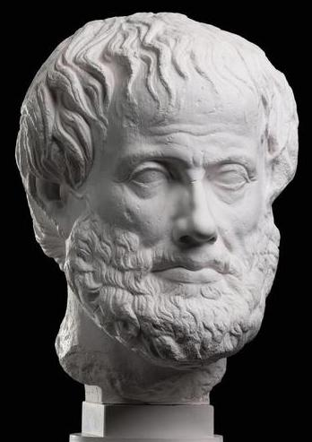
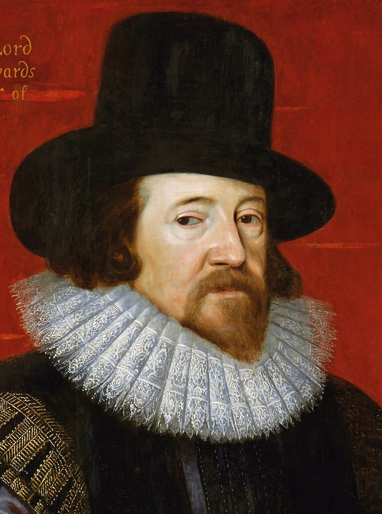

```{r setup, include=FALSE}
options(htmltools.dir.version = FALSE)

library(tidyverse)
library(kableExtra)
library(ggplot2)
library(plotly)
library(htmlwidgets)
library(MASS)
library(ggpubr)
library(xaringanthemer)
library(xaringanExtra)

style_duo_accent(
  primary_color = "#621C37",
  secondary_color = "#EE0071",
  background_image = "blank.png"
)

xaringanExtra::use_xaringan_extra(c("tile_view"))

use_scribble(
  pen_color = "#EE0071",
  pen_size = 4
  )

knitr::opts_chunk$set(
  fig.retina = TRUE,
  warning = FALSE,
  message = FALSE
)

# library(RefManageR)
# BibOptions(
# check.entries = FALSE, 
# bib.style = "authoryear", 
# cite.style = "authoryear", 
# style = "markdown",
# hyperlink = FALSE, 
# dashed = FALSE)
# myBib = ReadBib("/Users/stephangoerigk/Desktop/Universität/CFH/Lehre/Bachelor/Einführung in die Forschungsmethoden der Psychologie und Psychotherapie/EFPP_Folien/myBib.bib")
```

name: Title slide
class: middle, left
<br><br><br><br><br><br><br>
# Einführung in die Forschungsmethoden der Psychologie und Psychotherapie

### Einheit 2: Wissenschafts- und Erkenntnistheorie
##### 20.10.2023 | Dr. Caroline Zygar-Hoffmann

---
class: top, left
name: content
### Heutige Themen

#### [Erkenntnisgewinn in der Psychologie](#einfuehrung)

#### [Erkenntnistheoretische Grundpositionen der Psychologie](#erkenntnistheorie)

#### Wissenschafts- und erkenntnistheoretische Perioden
* [Vorgaben der Antike](#antike-start)
* [Erstarken des Empirismus](#empirismus-start)
* [Erneuerung des Rationalismus](#rationalismus-start)
* [Kritischer Rationalismus (Sir Karl Popper) als Erkenntnisposition moderner Psychologie](#kritischerRationalismus-start)

#### [Alternative Betrachtung - Wissenschaftsgeschichtlicher Ansatz](#wissenschaftsgeschichte)

#### [Take-Aways](#take-away)

---
class: top, left
### Literatur für die heutige Sitzung

.pull-left[
```{r, echo=FALSE,out.width="45%",fig.cap="Kapitel 3 und 4 in Slunecko, T., & Benetka, G. (2023). Geschichte und Paradigmen der Psychologie und Psychotherapie. utb.",fig.show='hold',fig.align='center'}
knitr::include_graphics("bilder/slunecko2023.png")
``` 
]

.pull-right[
```{r, echo=FALSE,out.width="45%",fig.cap="Kapitel 2.2 in Döring, N. & Bortz, J. (2016). Forschungsmethoden und Evaluation in den Sozial- und Humanwissenschaften. Pearson.",fig.show='hold',fig.align='center'}
knitr::include_graphics("bilder/doering.png")
``` 
]


**Materialien:** Vielen Dank an Prof. Dr. Stephan Goerigk, Dr. Angelika Stefan, Prof. Dr. Mario Gollwitzer, Prof. Dr. Felix Schönbrodt, M.Sc. Nina-Alisa Maria Kollakowski et al. und das LMU Open Science Center  für Bereitstellung der Grundlage für die Materialien

---
class: top, left
name: einfuehrung

### Erkenntnisgewinn in der Psychologie

.pull-left[
.center[
```{r eval = TRUE, echo = F, out.width = "300px"}
knitr::include_graphics("bilder/mach.png")
```

*Die Analyse der Empfindungen*, Ernst Mach (1900)
]
]

.pull-right[
**Modell von der Welt:**

* Die Welt wie ich sie sehe

* Welche Teile gehören zu „mir“, welche zur „Außenwelt"?

* Mit welcher Interpretation der Wahrnehmungen leiste ich die Zuordnung?

*"Die Erkenntnistheorie fragt nach den Bedingungen der Möglichkeit unseres Wissens über die Welt"* <br>
(Slunecko & Benetka, 2023)
]

---
class: top, left
### Erkenntnisgewinn in der Psychologie

#### Was ist der beste Weg zur Erkenntnis?

.center[
"A paradigm is what you think before you think."
]

*  Aktuell dominantes methodisches Vorgehen der Psychologie: **empirisch-wissenschaftliches Arbeiten**

  * Experiment als Königsweg zum Kausalschluss
  * Wissen ist "erfahrungsbasiert"
  * Objektivierung durch "beobachtbares" Verhalten
  * Hypothesenprüfung als Erkenntnisgewinn

* **Paradigma** = Welt- und Wissenschaftssicht

* **Studium als Sozialisation** in die gängigen Paradigmen des Fachs

* **Erkenntnis- und Wissenschaftstheorie:** historische Entwicklung von Positionen zum Erkenntnisgewinn

**Frage:** Wie können wir in der Psychologie zu validen, wissenschaftlichen Erkenntnissen kommen? 

---
class: top, left
name: erkenntnistheorie
<div class="footer"><span>Westermann, R. (1987). Wissenschaftstheoretische Grundlagen der experimentellen Psychologie. In G. Lüer (Ed.), Allgemeine Experimentelle Psychologie (pp. 5-42). Gustav Fischer.</div>

### Erkenntnistheoretische Grundpositionen der Psychologie

#### Realismus vs. Idealismus

.pull-left[
**Realismus** 

* Wirklichkeit existiert **unabhängig** von uns
  
* Wirklichkeit ist durch Wahrnehmung bzw. Denken erfahrbar
  
* Psychologische Theorie als Versuch der Wirklichkeitsabbildung
]
.pull-right[
**Idealismus** 

* Wirklichkeit existriert nur in unserer Vorstellung, d.h. nur **geistige Wirklichkeit** ist gegeben
  
* Erkennbarkeit einer “äußeren” Wirklichkeit wird geleugnet 
  
* Psychologische Theorie beschreibt nichts tatsächlich Existierendes 
  
* Wert einer Theorie ergibt sich nur aus ihrem (instrumentellem) Nutzen
]

---
class: top, left
<div class="footer"><span>Westermann, R. (1987). Wissenschaftstheoretische Grundlagen der experimentellen Psychologie. In G. Lüer (Ed.), Allgemeine Experimentelle Psychologie (pp. 5-42). Gustav Fischer.</div>

### Erkenntnistheoretische Grundpositionen der Psychologie

#### Empirismus vs. Rationalismus

.pull-left[

**Empirismus** 

* **Sinneserfahrung** ist die alleinige oder zumindest wichtigste Erkenntnisquelle
  
* Psychologische Theorie = Zusammenfassung der in psychologischen Beobachtungen und Experimenten gesammelten, möglichst **zuverlässigen Erfahrungen**

* Logischer Empirismus: Sammeln von immer mehr bestätigenden Belegen (Verifikationsprinzip)
]
.pull-right[
**Rationalismus**

* Form und Inhalt allen Wissens liegt primär in **Verstand und Vernunft** begründet
  
* Psychologische Theorie ist keine Sammlung voraussetzungsfreier Erfahrungen
  
* Primat der **Theorie** über die Erfahrung
]  

---
class: top, left
<div class="footer"><span>Westermann, R. (1987). Wissenschaftstheoretische Grundlagen der experimentellen Psychologie. In G. Lüer (Ed.), Allgemeine Experimentelle Psychologie (pp. 5-42). Gustav Fischer.</div>

### Erkenntnistheoretische Grundpositionen der Psychologie

#### Skeptizismus

.pull-left[

* generelle oder teilweise **Leugnung** von Erkenntnismöglichkeiten

* Wir können **nichts wissen** $\rightarrow$ Ende der wissenschaftlicher Aktivitäten als Erkenntnismittel?

* Philosophische Debatte über simulierte Realität

* Beispiel: Skeptizismus Argument **Gehirn-im-Tank**

  1. Wenn ich weiß, dass ich Eis esse, dann weiß ich auch, dass ich kein Gehirn im Tank bin.

 2.  Ich kann nicht wissen, ob ich ein Gehirn im Tank bin.

 3.  Daher weiß ich nicht, dass ich Eis esse.
]
.pull-right[
.center[
```{r eval = TRUE, echo = F, out.width = "300px"}

```
]
]

---
class: top, left

### Erkenntnistheoretische Grundpositionen der Psychologie

#### Konstruktivismus (z.B. Jean Piaget und Paul Watzlawick)

* Gegenstand vom Betrachter selbst durch den Vorgang des Erkennens konstruiert 

* zentral nicht Wesen der Dinge, sondern der Prozess und die Entstehung ihrer Erkenntnis

* Orientierung am Beobachter (erkennende Instanz), nicht an der beobachterunabhängigen Realität

* Abschied von der Vorstellung einer absoluten Wahrheit bzw. einer empirischen Objektivität

* Interesse an der Pluralität von Auffassungspositionen

* Erschaffung eigener (verzerrter) Realitäten

$\rightarrow$ relevante Position für Selbstbericht als Quelle von Erkenntnis

---
class: top, left
### Wissenschafts- und erkenntnistheoretische Perioden

.pull-left[

[1. Vorgaben der Antike](#antike-start)

[2. Erstarken des Empirismus](#empirismus-start)

[3. Erneuerung des Rationalismus](#rationalismus-start)

[4. Kritischer Rationalismus (Sir Karl Popper) als Erkenntnisposition moderner Psychologie](#kritischerRationalismus-start)

]

.pull-right[
.center[
```{r eval = TRUE, echo = F, out.width = "450px"}

```

L’Atmosphère: Météorologie Populaire 
(die kopernikanische Wende)
]
]

---
class: top, left
name: antike-start

### Wissenschafts- und erkenntnistheoretische Perioden

#### Vorgaben der Antike

##### Vorlogische Voraussetzungen europäischer Wissenschaft: 

.pull-left[
* Abstraktion statt Situation

* Distanz statt Einbettung 
]

.pull-right[
* Beobachten statt Teilhaben und Teilnehmen

* immer statt jetzt
]

.center[
```{r eval = TRUE, echo = F, out.width = "450px"}
knitr::include_graphics("bilder/antike.jpg")
```
]

---
class: top, left
### Wissenschafts- und erkenntnistheoretische Perioden

#### Vorgaben der Antike

##### Platon (Idealismus)

.pull-left[
* Viertes Jahrhundert vor Christus

* Hinrichtung seines Lehrers Sokrates (wegen religiösen Frevels und schlechten Einflusses auf die Jugend)

* Unzufriedenheit mit der kulturellen und politischen Situation seiner Heimatstadt Athen
]

.pull-right[
.center[
```{r eval = TRUE, echo = F, out.width = "150px"}
knitr::include_graphics("bilder/Platon.jpg")
```
]
]

* 387 v. Chr. Gründung einer Schule (Gott namens Akademos geweiht) $\rightarrow$ **Akademie**

* Gegenentwurf zu Wissen und Reden auf der Agora, den Markt- und Versammlungsplätzen der Stadt

* Polemik der Volksredner $\rightarrow$ Verführung, Verhetztung und Verblödung der Menschen vs. **Vernunft, das Schöne und Gute**

* **Ideal von Wissenschaft:** Vernunft über Verführung

---
class: top, left
### Wissenschafts- und erkenntnistheoretische Perioden

#### Vorgaben der Antike

##### Platon - Vernunft vs. Verführung

* Menschen lassen sich von unmittelbaren Eindrücken und Situationen beeinflussen

* Abstand gewinnen vom **bloßen Meinen**

* Akademisches Wissen $\neq$ Alltagswissen

* Erstmalig in der Geistesgeschichte: **Entwertung des Situationswissens**

  * Individuelle Auslegung aktueller Situation ("kenne dich in der Situation aus in der du bist") ungenügend
  
  * es braucht abstraktes Wissen, dekontextualisiertes, situationsübergreifendes Wissen, Theorie

**Ausdifferenzierung des Erkenntnisproblems: **

$\rightarrow$ Zeitlich überdauerndes Erkennen, welches auch morgen noch wahr ist  
$\rightarrow$ Erkennen das für alle wahr ist, nicht nur für den Einzelnen

---
class: top, left
### Wissenschafts- und erkenntnistheoretische Perioden

#### Vorgaben der Antike

##### Platon - Rolle der Geometrie

.center[
Ἀγεωμέτρητος μηδεὶς εἰσίτω. - *Hier trete nur ein, wer Geometer ist.*

Inschrift über dem Torbogen zur platonischen Akademie
]

.pull-left[
**Geometrie**

* exakte Wissenschaft, hohe Fähigkeit zur Abstraktion
* geometrisches Prinzip = **Verstehen**
* es hilft nicht 100 Dreiecke zu beobachten, um zu verstehen, dass die Winkelsumme eines Dreiecks immer 180 Grad beträgt
* Zugang zum **Reich der Ideen**
* Idealen Prinzipien $\rightarrow$ gelten **immer und überall**
]

.pull-left[
**Erkenntnis im Sinne idealer Prinzipien**
* Grundformen des Seienden = **Ideen** (z.B. "Idee des Menschen")
* unwandelbar und unvergänglich
* **Wirklichkeit** hinter der Sinnenwelt, "Welt der Theorie"
* Weg zur Erkenntnis: plötzliche **innere Einsicht** (zu Wissen, das schonmal da war, aber vergessen wurde) und "Wiedererinnerung" = Anamnesis
* Zugang durch Weisheitsdialoge und Einsichtsübungen
]

---
class: top, left

### Wissenschafts- und erkenntnistheoretische Perioden

#### Vorgaben der Antike

##### Achsenzeit von 800 bis 200 v. Chr. (Begriff nach Jaspers, 1949)

* Hintergrund für Platons Überlegungen

* Zeit technologischer und philosophischer Entwicklung in vier voneinander unabhängigen Kulturräumen

  * Hinduismus und Buddhismus in Indien
  * Daoismus und Konfuzianismus in China
  * Judentum und Zoroastrismus im alten Orient
  * Philosophie im antiken Griechenland
  
* Abstraktionsschub durch neue Medien
  * Schrift
  * Geld

$\rightarrow$ **Materielles wird abstrakt**

$\rightarrow$ **Gesprochenes wird dauerhaft**

---
class: top, left
### Wissenschafts- und erkenntnistheoretische Perioden

#### Vorgaben der Antike

##### Achsenzeit von 800 bis 200 v. Chr. (Begriff nach Jaspers, 1949)

**Schrift und Abstraktion:**

* Inhaltliche Kontrolle von Argumenten im Detail

* Kommunikation in zeitlicher und räumlicher Ferne (Überzeitlichkeit und Übersituativität)

* Trennung des visuellen Sinnes vom Intellekt (Nah- vs. Fern-Sinn): 
  - Man kann mit objektivem Abstand auf Phänomene schauen (wenn man sie liest)
  - Agieren (Denken) ohne zu Reagieren (Fühlen)

* Erkenntnis durch Abstandnahme

---
class: top, left
### Wissenschafts- und erkenntnistheoretische Perioden

#### Vorgaben der Antike

##### Warum ist Platon relevant?

**Platon prägte wesentlich die heutige Ausrichtung der Wissenschaft:**

* Naturwissenschaft: Streben nach nomothetischem Wissen (nomos = Gesetz)

* Platonsches "Wissen hinter der Sinnenwelt" = **Theorie**

* Akademisches Wissen unterscheidet sich von Alltagswissen

**Von Platon nicht übernommen:**

* **kontemplative**, d.h. nach innen gerichtete Erkenntnishaltung (*armchair philosophy*)

* spekulative Philosophie durch Nachdenken 

**Gegensatz dazu:** Aristoteles Peripatetische Schule (peripatein = herumgehen, damit gemeint ist: aktiv werden, nicht auf Eingebung warten) 

---
class: top, left
### Wissenschafts- und erkenntnistheoretische Perioden

#### Vorgaben der Antike

##### Aristoteles (Realismus)

**Aristoteles Peripatetische Schule:**

.pull-left[
* realistische (der realen Welt entspringende), an der Erfahrung orientierte Grundposition $\rightarrow$ grundlegende Erkennbarkeit der Wirklichkeit durch Beobachtung

* Hauptwerk *Organon* (dt.: Werkzeug): **Beobachtungen und Beschreibungen** zur Natur, Biologie und Physiologie des Menschen, **systematische Entwicklung des Denkens und Argumentierens**
]

.pull-right[
.center[
```{r eval = TRUE, echo = F, out.width = "100px"}

```
]

* **Syllogismen** (Schlussfolgerungen) = Ausbildung eines Systems der formalen Logik, **Suche nach gültigen, konsistenten, widerspruchsfreien Sätzen**

]

---
class: top, left
### Wissenschafts- und erkenntnistheoretische Perioden

#### Vorgaben der Antike

##### Aristoteles (Realismus)

**Form der Syllogistik:**

Prinzip der **Deduktion**: spezifische Schlussfolgerungen aus allgemeinen Prämissen ziehen
.pull-left[

* **Prämisse 1:** Alle Menschen sind sterblich.
* **Prämisse 2:** Sokrates ist ein Mensch. 
* **Schluss:** Sokrates ist sterblich.

$\rightarrow$ Ist die bestehende Information falsch, kann die Deduktion immer noch logisch richtig sein, aber die erreichte Schlussfolgerung ist ebenfalls falsch.

$\rightarrow$ Die Schlussfolgerung erweitert bzw. hinterfragt die vorhandene Information nicht, sondern ergibt sich aus bestehender Information.
]

.pull-right[
.center[
```{r eval = TRUE, echo = F, out.width = "250px"}
knitr::include_graphics("bilder/syllogism.png")
```
]
]

---
class: top, left
### Wissenschafts- und erkenntnistheoretische Perioden

#### Vorgaben der Antike

##### Aristoteles (Realismus)

**Form der Syllogistik:**

Prinzip der **Induktion**: allgemeine Schlussfolgerungen aus spezifischen Beobachtungen ziehen
.pull-left[  

* **Beobachtung 1:** Sokrates ist sterblich.
* **Beobachtung 2:** Sokrates ist ein Mensch.
* **Schluss:** Alle Menschen sind sterblich.

$\rightarrow$ Die Schlussfolgerung erweitert die vorhandene Information im Vergleich zu den Prämissen.
]

.pull-right[
.center[
```{r eval = TRUE, echo = F, out.width = "250px"}
knitr::include_graphics("bilder/syllogism.png")
```
]
]

---
class: top, left
### Wissenschafts- und erkenntnistheoretische Perioden

#### Vorgaben der Antike

**Vergleich Platon vs. Aristoteles:**
* Platon: spontane Einsicht in geistige Wirklichkeit

* Aristoteles: systematische Entwicklung des Denkens und Argumentierens zur Erfahrung der "objektiven" Wirklichkeit

* Wissenschaft seit Antike erst lange von Idealisten dominiert, heute von Realisten

* Platons Ideen zu **Theorien und Gesetzmäßigkeiten** wichtig für heutiges wissenschaftliches Denken.

* Aristoteles' Verbindung einer **empirischen Grundhaltung** (mit seiner Einstellung zum Beobachten) mit einer **rationalistischen Grundhaltung** (mit seine Überlegungen zur Logik) wichtig für heutiges wissenschaftliches Denken.

---
class: top, left
name: empirismus-start

### Wissenschafts- und erkenntnistheoretische Perioden

#### Erstarken des Empirismus: Beobachtung und Experiment (Francis Bacon)

* Im 15. Jhd. **Renaissance** und **beginnende Neuzeit** (Renaissance = Wiedererstarken von Idealen der Antike)

* Moderne Wissenschaft: Neubewertung der Wichtigkeit von **Beobachtung**

* Ziel: verlässlichen Kontakt der Wissenschaft mit der Wirklichkeit (Blüte 17. Jhd in England)

.pull-left[

* Francis Bacon (1561-1626): Wegbereiter des **Empirismus**

  * Hauptwerk *Novum Organum* (Referenz an Aristoteles)
  
  * Verstand ist täuschbar, **systematische Beobachtung** der Natur
  
  * **neue methodische Überlegungen** zur Beobachtung
]

.pull-right[
.center[
```{r eval = TRUE, echo = F, out.width = "200px"}

```
]
]
---
class: top, left

### Wissenschafts- und erkenntnistheoretische Perioden

#### Erstarken des Empirismus: Beobachtung und Experiment (Francis Bacon)

**Bacons Idolenlehre** (4 Arten von menschlichen Erkenntnisirrtümern)

1. **Idole des Stammes (idola tribus)**

  * gattungsspezifische Mängel des menschlichen Erkenntnisapparates (was wir heute "Biases" nennen würden, siehe 1. Vorlesung)

2. **Idole der Höhle (idola specus)**

  * individuell erworbene, Verhaltens- und Erlebensweisen eines einzelnen Menschen (z.B. Erziehung, Verdrängung, etc.)
  
3. **Idole des Marktes (idola fori)**

  * Irrtümer infolge des engen Beieinanderseins der Menschen (z.B. Irrtümer/Missverständnisse im Gebrauch der Sprache)

4. **Idole des Theaters (idola theatri)**

  * dogmatische Behauptungen philosophischer Lehrmeinungen und verkehrte Gesetze der Beweisführung
  
---
class: top, left

### Wissenschafts- und erkenntnistheoretische Perioden

#### Erstarken des Empirismus: Beobachtung und Experiment (Francis Bacon)

* Angesichts Fehlerquellen der Idolenlehre braucht irrtumsanfälliger Verstand *instrumenta und experimenta*

* absichtliche, **bewusst gesteuerte Beobachtung** (kontrolliert und geplant) vs. naive Kenntnisnahme

* **ABER:** Beobachten nicht ausreichend $\rightarrow$ handelnd-manipulativens Eingreifen (**Experiment**)

* zum Zweck absichtlicher und wiederholter Beobachtungen in die Abläufe der Natur eingreifen

* Determination der kontrollierten Bedingungen unter denen sich ein Verhalten zeigt

* neutraler Beobachterstandpunkt (d.h. Introspektionsproblem spielt hier keine Rolle, da Beobachtung aus Außenperspektive)

$\rightarrow$ **maßgeblich für die modernen Experimentalwissenschaften**

---
class: top, left
name: rationalismus-start

### Wissenschafts- und erkenntnistheoretische Perioden

#### Erneuerung des Rationalismus: Descartes und Kant

.pull-left[
* Parallel zum Empirismus erstarkt mit Beginn der Neuzeit der Rationalismus
* Erkenntnis nicht aus Erfahrungen, sondern vom Verstand (lat. ratio)
* Rationalistische Abkehr vom religiösen Dogma des Mittelalters
]

.pull-right[
.pull-left[
```{r eval = TRUE, echo = F, out.width = "100px"}

```
]
.pull-right[
```{r eval = TRUE, echo = F, out.width = "90px"}

```
]
]
.pull-left[
**Rene Descartes:**

* *Ich denke, also bin ich.* $\rightarrow$Tatsache, dass ich denke ist Gewissheit, dass ich existiere
* Diese **absolute Gewissheit** als Ausgangspunkt jedes weiteren Wissens
]
.pull-right[
**Immanuel Kant:**
* psychologische Zustände lassen sich zwar zeitlich, aber nicht räumlich verorten
* Introspektion = Veränderung des Gegenstands
]

$\rightarrow$ Impuls, dass Mathematik das Fundament aller (Natur-)wissenschaft sein muss: <br>
**Rational ist (nur) das, was** ***mathematisch berechenbar*** **ist**

---
class: top, left
### Wissenschafts- und erkenntnistheoretische Perioden

#### Induktionsproblem – der erkenntnislogische Übergang zum Kritischen Rationalismus

* **Empirismus**: vom Verstand darf nicht ausgegangen werden (sondern nur von Erfahrungen)

* **Frage:** Wie kommt man von Einzelbeobachtungen zur wissenschaftlichen Erkenntnis (oder gar Naturgesetz)?

.pull-left[
**Induktion** (John Locke):

* bereits in der aristotelischen Logik vorhanden, Komplementärverfahren zur Deduktion

* abstrahierender Schluss aus einzelnen Beobachtungen auf eine allgemeinere Erkenntnis

* Induktionsschluss überzeugend, wenn 1) auf Basis großer Anzahl an Beobachtungen, 2) unter großen Vielfalt von Bedingungen wiederholt und 3) keine Beobachtung im Widerspruch zur Verallgemeinerung
]

.pull-right[
**Induktionsproblem** (David Hume: "Humesches Problem"):

* aus beobachteten Einzelereignissen kann nicht mit Sicherheit auf allgemeines Prinzip geschlossen werden
* Beispiel Psychologie: 
  *  Depressiver 1 erfuhr Kindheitstrauma
  *  Depressiver 2 erfuhr Kindheitstrauma
  *  Depressiver 3 erfuhr Kindheitstrauma
  
 Induktionsschluss: $\rightarrow$ Alle Depressiven erfahren Kindheistraumata
]

---
class: top, left
name: kritischerRationalismus-start

### Wissenschafts- und erkenntnistheoretische Perioden

#### Kritischer Rationalismus (Sir Karl Popper) als Erkenntnisposition moderner Psychologie

**Ansatz zur Lösung des Induktionsproblems:**

.pull-left[
* Position des **Realismus**: Primat der **Erfahrung beibehalten**

* Aber: Durch Induktion gewonnenen Aussagen haben **vorläufigen** Charakter
]

.pull-right[
.center[
```{r eval = TRUE, echo = F, out.width = "120px"}
knitr::include_graphics("bilder/popper.jpg")
```
]
]


.pull-left[
* Umkehrung der induktiven Vorgehensweise
  - nicht von den Erfahrungen auf wissenschaftliche Theorien schließen
  - umgekehrt: Theorien **empirischen Bewährungsproben** aussetzen
]

.pull-right[
* Verhältnis Theorie-Empirie: 
  - Wissenschaft beginnt mit Theorien (**Rationalismus**)
  - Erfahrung nicht Baustein, sondern **Prüfstein** der Theorie
]

* Am Anfang soll Entwurf stehen (**Prognose**), den der Verstand (ratio) liefert
* kreativer Einfall = Voraussetzung zur **Hypothesenbildung**

---
class: top, left
### Wissenschafts- und erkenntnistheoretische Perioden

#### Kritischer Rationalismus (Sir Karl Popper) als Erkenntnisposition moderner Psychologie

**Erkenntnisfortschritt nach Popper:**

* zentrales Prinzip des kritischen Rationalismus: Suche nach **Falsifikationen** einer Theorie, d.h. **Wiederlegung durch Beobachtung**

* Methode von **Versuch und Irrtum**: Wenn-Dann Beziehung (**Deduktion**) gepaart mit **modus tollens** (Verwerfen einer Hypothese): 
  - Per Deduktion werden aus theoretischen (allgemeinen) Sätzen singuläre Sätze (Basissätze) abgeleitet, die empirisch geprüft werden
  - Wenn die Theorie stimmt, dann muss die aus ihr abgeleitete Prognose eintreffen; wenn nicht verwerfe ich die Theorie
  - All unser Wissen besteht aus (noch) nicht widerlegten Theorien oder Hypothesen

* Beispiele für nicht-falsifizierbare Aussagen: 
  - Tautologien (zirkuläre oder immer wahre Aussagen, "es wird dir besser gehen oder nicht")
  - "kann"-Aussagen ("es kann dir danach besser gehen")
  - Aussagen über unbeobachtbare Phänomene

---
class: top, left
### Wissenschafts- und erkenntnistheoretische Perioden

#### Kritischer Rationalismus (Sir Karl Popper) als Erkenntnisposition moderner Psychologie

**Beurteilung bestehender Theorien:**

* Wenn Hypothese eine empirische Prüfung überlebt, rückt sie ein Stück in Richtung Wahrheit (**Wahrheitsnähe**)

* Eine Theorie gilt als bewährt, wenn sie viele Falsifikationsversuche überstanden hat (dafür muss sie prinizpiell falsifizierbar sein)

.center[
"*Der Ehrgeiz, recht zu behalten, verrät ein Missverständnis: Nicht der Besitz von Wissen, von unumstößlichen Wahrheiten macht den Wissenschaftler, sondern das rücksichtslos kritische, das unablässige Suchen nach Wahrheit.*" (Popper, 1934/1989)
]

**Warum "kritischer Rationalismus"**

* Vom Rationalismus kommt die Idee davon, dass wir mit einer Theorie anfangen
* Der kritische Aspekt, ist dass die Theorie verworfen wird, wenn sie nicht im Einklang mit der aus ihr abgeleiteten Prognose ist (falsifiziert wurde)


---
class: top, left
### Wissenschafts- und erkenntnistheoretische Perioden

#### Kritischer Rationalismus (Sir Karl Popper) als Erkenntnisposition moderner Psychologie

**Erkenntnisfortschritt nach Popper:**

.center[*„Auch durch ihre verifizierten Folgerungen können Theorien niemals als "wahr" oder auch nur als "wahrscheinlich" betrachtet werden“*]

* selbst wenn die Erfahrungswelt die Prognose stützt, ist Theorie nicht zwingend wahr

* Beispiel des **schwarzen Schwans**:

  * Selbst wenn meine Prognose, dass Schwäne weiß sind, 1000x eingetroffen ist, kann letztendlich doch ein schwarzer Schwan beobachtet werden (Entdeckung des „Trauerschwans“ in Australien)

**Poppers Leitgedanken:**

1.  **Fallibilismus**: Alles Wissen ist Vermutungswissen (aber besser Mutmaßung als Anmaßung).
2.  Wir wissen nicht, wir raten.
3.  Kritik statt Dogma.
4.  Wir lernen nicht durch (bestätigende) Beobachtung, sondern durch Versuch und Irrtum.

---
class: top, left
### Wissenschafts- und erkenntnistheoretische Perioden

#### Kritischer Rationalismus (Sir Karl Popper) als Erkenntnisposition moderner Psychologie

**Kreislauf von Induktion und Deduktion:** Im wissenschaftlichen Prozess der Theoriebildung sind Induktion und Deduktion zwei Methoden, die sich gegenseitig ergänzen:

.center[
```{r eval = TRUE, echo = F, out.width = "50%"}

```
]

* Der linke Teil und die Falsifikation im rechten Teil sind der Fokus vom kritischen Rationalismus.

* Da Hypothesen nur widerlegt aber niemals bewiesen werden können, sind Formulierungen wie "Wissenschaftler haben bewiesen, dass ..." aus der Perspektive einer empirischen Wissenschaft (im Sinne des kritischen Rationalismus) nicht haltbar.

---
class: top, left
### Wissenschafts- und erkenntnistheoretische Perioden

#### Kritischer Rationalismus (Sir Karl Popper) als Erkenntnisposition moderner Psychologie

**Informationsgehalt von theoretischen Aussagen:**

* Bisher haben wir Falsifizierbarkeit als „entweder-oder“-Eigenschaft einer Aussage bzw. Theorie betrachtet

* Theorien können sich jedoch auch im Grad ihrer Falsifizierbarkeit bzw. ihrem Informationsgehalt unterscheiden.

* Eine Theorie hat einen hohen Informationsgehalt, wenn sie
  - Einen weiten Gültigkeitsbereich beansprucht und
  - Sehr präzise Vorhersagen macht
  
* Eine Theorie mit hohem Informationsgehalt bietet mehr Möglichkeiten zur Falsifikation als eine Theorie mit niedrigem Informationsgehalt


---
class: top, left
### Wissenschafts- und erkenntnistheoretische Perioden

#### Kritischer Rationalismus (Sir Karl Popper) als Erkenntnisposition moderner Psychologie

**Informationsgehalt von theoretischen Aussagen:**

* Beispiel: "*Wenn* Jugendliche viele gewalthaltige Computerspiele spielen, *dann* zeigen sie verstärkt aggressive Gedanken."

* Wird der Wenn-Teil durch „Und“-Komponenten erweitert, sinkt der Informationsgehalt der theoretischen Aussage: "Wenn Jugendliche viele gewalthaltige Computerspiele spielen UND eine Vernachlässigung durch die Eltern vorliegt UND positive soziale Kontakte fehlen…"

* Im Extremfall trifft die theoretischen Aussage nur noch auf einen Einzelfall zu und kann nur von diesem Einzelfall falsifiziert werden $\rightarrow$ geringer Informationsgehalt


---
class: top, left
### Wissenschafts- und erkenntnistheoretische Perioden

#### Kritischer Rationalismus (Sir Karl Popper) als Erkenntnisposition moderner Psychologie

**Informationsgehalt von theoretischen Aussagen:**

* Beispiel: "*Wenn* Jugendliche viele gewalthaltige Computerspiele spielen, *dann* zeigen sie verstärkt aggressive Gedanken."

* Wird der Wenn-Teil um eine "Oder"-Komponente erweitert, steigt der Informationsgehalt der theoretischen Aussage: "Wenn Jugendliche viele gewalthaltige Computerspiele spielen ODER gewalthaltige Fernsehserien ansehen,..."

* Die theoretischen Aussage kann nun nicht mehr nur durch die Beobachtung von Konsumenten von Computerspielen, sondern auch durch die Beobachtung von Konsumenten von gewalthaltigen Fernsehserien falsifiziert werden. $\rightarrow$ hoher Informationsgehalt

---
class: top, left
### Wissenschafts- und erkenntnistheoretische Perioden

#### Kritischer Rationalismus (Sir Karl Popper) als Erkenntnisposition moderner Psychologie

**Allgemeine Kriterien für gute psychologische Theorien:**

.pull-left[
* Logische Widerspruchsfreiheit, interne Konsistenz

* Begriffliche Klarheit (Präzision)

* Empirischer Informationsgehalt (Überprüfbarkeit, Falsifizierbarkeit)

* Empirische Bewährung (Gültigkeit)

* Reduktion der Komplexität der Wirklichkeit, Beschreibung in abstrakten Begriffen

* Erklärung der Phänomene (Ursachen, Gründe)
]

.pull-right[
* Vollständigkeit, wenig Fragen offen lassen (Spezifikation)

* Möglichst extensiv und allgemeingültig (weiter Gegenstandsbereich, Universalität)

* Sparsamkeit (Parsimonität, Ockhams Rasiermesser)

* (prima facie) Verträglichkeit mit anderen, bewährten Theorien

* praktischer Nutzen und Anregung weiterer Forschungsbemühungen
]

<!-- class: top, left -->
<!-- ### Wissenschafts- und erkenntnistheoretische Perioden -->

<!-- #### Kritischer Rationalismus (Sir Karl Popper) als Erkenntnisposition moderner Psychologie -->

<!-- **Deduktiv-nomologisches Modell / "Hempel-Oppenheim-Schema" als logisches Erklärungsmodell** -->

<!-- * Während der kritische Rationalismus beschreibt, wie wissenschaftliche Theorien und Erkenntnis entsteht, beschreibt das "Hempel-Oppenheim-Schema" nach welchem Prinzip wissenschaftliche Erklärungen aufgebaut sind -->

<!-- * Erklären ist die Anwendung bzw. Ableitung (Deduktion) einer allgemeinen (nomologischen) Gesetzmäßigkeit auf ein konkretes Phänomen. -->
<!--   - Voraussetzung: Diese Gesetzmäßigkeit muss sich als gültig erweisen. -->
<!--   - Gültigkeit ist eine Annahme, die empirisch überprüft werden muss. -->

<!-- * Ein Phänomen ist nur dann wissenschaftlich adäquat erklärt, wenn die Erklärung deduktiv und nomologisch ist (das allg. Gesetz benennt, das angewendet wird) -->

<!-- * Zwei Teile -->
<!--   * Explanandum: Das zu erklärende Phänomen -->
<!--   * Explanans: Die Erklärung selbst (setzt sich wiederum aus allgemeinen Gesetzesaussagen und empirischen Randbedingungen zusammen) -->

---
class: top, left
### Wissenschafts- und erkenntnistheoretische Perioden

####  Kritik an Popper (innerhalb Empirismus)

**Beobachtungen sind "theoriegeladen":**

* zu prüfende Theorie entspringt der Ratio (Daten und Theorie sollten eigentlich **getrennte Instanzen** sein)

* **ABER:** Theorie und Beobachtung nicht sauber voneinander zu trennen

* „Data are theory-laden“ (Duhem & Quine)

* Theorie bestimmt mit, welche Phänomene sichtbar werden können

$\rightarrow$ Eigene Vorstellung/Überzeugung veranlasst uns erst zur Beobachtung

* Forscher, der alles  beobachtet $\rightarrow$ idealisierte Vorstellung (Forscher = **Ko-Konstrukteur**)

* **Folge:** Wesentlicher Einfluss der aktuell dominanten Forschungsmeinung

---
class: top, left
### Wissenschafts- und erkenntnistheoretische Perioden

####  Kritik an Popper (innerhalb Empirismus)

**Theorien sind gegenüber Falsifikation abgepuffert:**

* Prognose trifft nicht zu $\rightarrow$ Problem ist nicht zwangsläufig Theorie, sondern ggf. **fehlerhafte Ableitung** aus der Theorie (Operationalisierung/experimentelle Umsetzung)

* Verständnis aller Bedingungen, welche für Eintreten der Hypothese gegeben sein müssen (Problem: Psychologie = hochgradig multifaktoriell)

* es bedarf genauer Formulierung/Ausdifferenzierung der Bestandteile einer Theorie (sehr komplexes "wenn" in "wenn ... dann")

* Popper wird für mangelnde Berücksichtigung von Operationalisierung kritisiert

$\rightarrow$ Entwicklung der "**raffinierten Falsifikation**" (Imre Lakatos): ein Widerspruch zwischen Daten und Theorie führt nicht sofort zu Falsifikation, sondern kann durch eine Problemverschiebung aufgelöst werden (Erweiterung/Ersetzen von Theoriebestandteilen).

---
class: top, left
name: wissenschaftsgeschichte

### Alternative Betrachtung - Wissenschaftsgeschichtlicher Ansatz

#### Normative Wissenschaftstheorie vs. deskriptive Wissenschaftssoziologie

* Popper: **wissenschaftsimmanenter Ansatz** (Vorgabe einer Forschungslogik für die Wissenschaft)

* Wissenschaftstheorie ist **normativ**, das heißt, sie gibt anhand von philosophischen Argumenten vor, wie Wissenschaft ablaufen sollte

* Davon abzugrenzen: Wissenschaftssoziologie und Wissenschaftsgeschichte beschreiben **deskriptiv**, wie Wissenschaft durchgeführt wird/wurde

---
class: top, left
name: wissenschaftsgeschichte

### Alternative Betrachtung - Wissenschaftsgeschichtlicher Ansatz

#### Denkstile und Denkkollektive (Ludwig Fleck & Robert Merton)

**Wandlung von Forschungsinteressen in Relation zu gesamtgesellschaftlichen Entwicklungen**

* **Denkstil:** gemeinsame Fragestellungen, Urteile und Methoden

* **Denkkollektiv:** Menschen, die im Gedankenaustausch oder in gedanklicher Wechselwirkung stehen (Spekulationsgemeinschaft)

**Folgen:** 

* Themen und die Ausrichtung der Forschung wird nicht nur von wissenschaftsinternen Rationalitätskriterien – wie z.B. dem der Falsifizierbarkeit – gelenkt, sondern vor allem von wissenschaftsexternen Bedingungen

* es setzt sich für bestimmte Zeiträume eine dominierende Forschungshaltung durch

---
class: top, left

### Alternative Betrachtung - Wissenschaftsgeschichtlicher Ansatz

#### Der Begriff des Paradigmas - Struktur wissenschaftlicher Revolutionen (Thomas Kuhn)

* Kuhn: Forschungslogik für Entwicklung von Wissenschaften **nicht entscheidend** bzw. nebensächlich

* Schicksal wissenschaftlicher Theorien entscheidet sich **nicht** daran, ob sie falsifiziert werden oder nicht

* **Paradigma:** Überzeugungen, Wertvorstellungen und Techniken, die von Mehrheit der Wissenschaftler akzeptiert sind

* Theorie = Inhalt der Wissenschaft, Paradigma = Inhalt + Praktiken der Wissenschaft (Methoden, Institutionen, Wissensweitergabe)

* **Machtwirkung:** Welche Formate des Erkenntnisgewinns haben Gewicht (Spielregeln der Wissenschaft)

* Forschungsparadigma (und seine Methoden) entsteht in Abhängigkeit vom Menschenbild (siehe 3. Einheit)
  * Behaviorismus
  * Humanistische Psychologie
  * Tiefenpsychologie
  * Kognitionspsychologie
  * Psychobiologie

---
class: top, left

### Alternative Betrachtung - Wissenschaftsgeschichtlicher Ansatz

#### Der Begriff des Paradigmas - Struktur wissenschaftlicher Revolutionen (Thomas Kuhn)

**Phasen des Paradigmenwechsels:**

1. **Prä-paradigmatische Periode**
 * Theorienpluralismus, Wettkampf divergenter Ansichten (alle mit verfügbaren Beobachtungen vereinbar)
2. **Dominierendes Paradigma**
  * plausibler Rahmen für meiste verfügbaren Beobachtungen, bietet Leitfaden für weitere Forschung
3. **Periode der normalen Wissenschaft**
  * keine Grundsatzprobleme / Einigkeit über Theorien/Methoden, Wissenschaft in theoretischen und methodologischen Grenzen des Paradigmas (theoretische Ausdehnung, Erweiterung des Gültigkeitsbereichs), Implikationen werden erforscht
4. **Anomalie**
  * Stolperstein, Problem mit aktuellem Annahmen- und Methodenkomplex nicht lösbar, Krise
5. **Stadium der außerordentlichen Wissenschaft**
  * vermehrte Angriffe, Verunsicherung der Disziplin, Versagen alter Regeln, Suche nach neuen Lösungen
6. **Wissenschaftliche Revolution**
  * Kapitulation vor neuem Denkstil, standespolitische Übernahme, "Lehrbücher werden neu geschrieben"
  
Beispiel in der Psychologie: Behaviorismus (alles nur Verhalten) & kognitive Wende (auch inneres Erleben relevant)

---
class: top, left

### Alternative Betrachtung - Wissenschaftsgeschichtlicher Ansatz

#### Wissenschaftsgeschichtlicher Ansatz als Kritik am kritischen Rationalismus

* Paradigmatische Machtpolitik dominiert Wissensschaft (nicht nur Forschungslogik oder Argumente)

* Wissenschaftliche Theorien werden nicht widerlegt, sondern **verlassen** $\neq$ Falsifikationsprinzip

* **Praxeologische** Sicht auf Wissenschaft (entscheident ist nicht Wahrheitsgehalt von Sätzen, sondern wissenschaftliche/soziale Aktivität)

* Wissenschaftlicher Fortschritt $\neq$ **kontinuierlich bzw. kumulativ** (Entfaltungskonzept vs. Paradigmenwechsel)

.center[
*"Wissenschaftliche Entwicklung ist also weder linear noch kontinuierlich, sie gleicht weniger einer Rolltreppe, die immer nur nach oben führt, sondern eher einer sich seit- oder aufwärts windenden Spirale oder einer Hochschaubahn mit Aufs und Abs. Auch Aufklärung kommt in Wellen. Wissenschaft kann sich von vielversprechenden Ansätzen wieder wegbewegen, wenn wissenschaftliche Pressure Groups in Führung gehen, denen diese nicht passen oder die nicht von ihnen profitieren können."* <br>

(Slunecko & Benetka, 2023)
]
  
---
class: top, left
<div class="footer"><span>Jordan, D. G., Winer, E. S., & Salem, T. (2020). The current status of temporal network analysis for clinical science: Considerations as the paradigm shifts? Journal of clinical psychology, 76(9), 1591-1612.</div>

### Alternative Betrachtung - Wissenschaftsgeschichtlicher Ansatz

#### Aktuelles Beispiel

```{r, echo=FALSE, out.width = "60%", fig.show='hold', fig.align='center'}
knitr::include_graphics("bilder/Jordan2020.png")
``` 

---
class: top, left

### Warum sollte ich das alles wissen?

Eine Kernkompetenz, die Sie im Studium entwickeln sollen, ist Wissenschaft von Pseudowissenschaft bzw. autoritären Behauptungen zu unterscheiden. In dieser Vorlesung haben Sie gelernt:

* Wie wissenschaftliche Argumentation entstanden ist und heutzutage aussieht

* Warum wissenschaftliche Theorien nie schlussendlich beweisbar sind (und Sie niemandem glauben sollten, der absolute Wahrheiten verkauft)

* Warum es trotzdem wissenschaftlichen Fortschritt gibt

* Wie Sie eine gute und schlechte Theorien voneinander unterscheiden können

* Warum kritisches Hinterfragen von wissenschaftlichen Theorien so wichtig ist

---
class: top, left
name: take-away

### Take-Aways

.content-box-gray[
* Moderne Psychologie entwickelt sich im Kontext **erkenntnistheoretischer** Überlegungen

* **Erkenntnistheoretische Grundpositionen:** Idealismus, Realismus, Empirismus, Rationalismus, Skeptizismus

* Platon (**Idealismus**) $\rightarrow$ Identifikation idealer (unwandelbarer und unvergänglicher) Grundprinzipien

* Aristoteles (**Realismus**) $\rightarrow$ Beobachtung der Natur und syllogistische Logik (Induktion + Deduktion)

* Bacon (**Empirismus**) $\rightarrow$ Verstand  täuschbar; Systematische Beobachtung und Eingreifen in Natur

* Descartes und Kant (**Rationalismus**) $\rightarrow$ Logische Gewissheit und mathematische Beweisführung

* Popper (**kritischer Rationalismus**) $\rightarrow$ Wissen = Vermutungswissen, Erkenntnisgewinn durch Versuch + Irrtum

* Kuhn (**Paradigmenwechsel**) $\rightarrow$ wissenschaftshistorischer Ablauf wissenschaftlicher Revolutionen
]

**[zurück zur heutigen Übersicht der Vorlesung $\rightarrow$](#content)** 
<br>
**[zum Quiz zur Wissensprüfung $\rightarrow$](https://forms.gle/2NAQ6kLCes41SDdz7)**


---
class: top, left
### Podcast-Empfehlung

```{r, echo=FALSE,out.width="30%",fig.cap="Prof. Dr. Frieder Vogelmann zu 'Wissenschaft als Mittel gegen eine postfaktische Welt?'",fig.show='hold',fig.align='center'}

``` 

<!-- library(renderthis)  -->
<!-- to_pdf("EinfForsch_02_WissenschaftsErkenntnistheorie.Rmd", complex_slides = TRUE) -->
