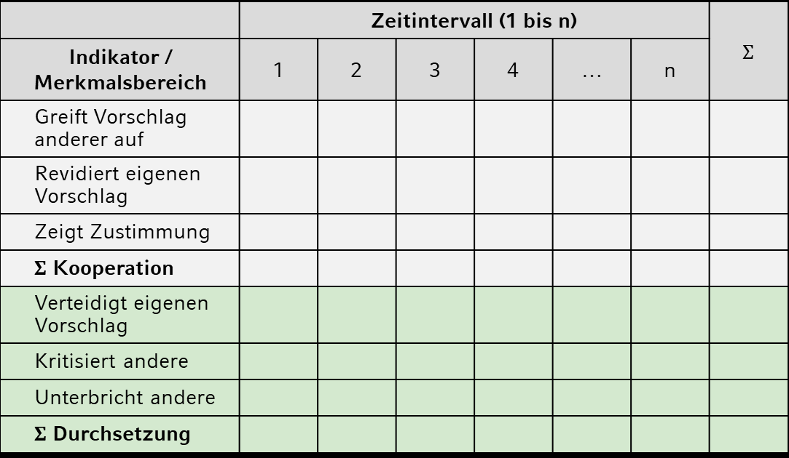

```{r setup, include=FALSE}
options(htmltools.dir.version = FALSE)

library(tidyverse)
library(kableExtra)
library(ggplot2)
library(plotly)
library(htmlwidgets)
library(MASS)
library(ggpubr)
library(xaringanthemer)
library(xaringanExtra)

style_duo_accent(
  primary_color = "#621C37",
  secondary_color = "#EE0071",
  link_color = "#7da5f5",
  background_image = "blank.png"
)

xaringanExtra::use_xaringan_extra(c("tile_view"))

use_scribble(
  pen_color = "#EE0071",
  pen_size = 4
  )

knitr::opts_chunk$set(
  fig.retina = TRUE,
  warning = FALSE,
  message = FALSE
)

```

name: Title slide
class: middle, left
<br><br><br><br><br><br><br>
# Einführung in die Forschungsmethoden der Psychologie und Psychotherapie

### Einheit 3: Manifeste Merkmale: Verhaltensbeobachtung
##### 25.04.2024 | Dr. Caroline Zygar-Hoffmann

---
class: top, left

### Verhaltensbeobachtung

<iframe width="560" height="315" src="https://www.youtube.com/embed/bOR7jId8wYk?si=inF_-mGJHkDbTG-l" title="YouTube video player" frameborder="0" allow="accelerometer; autoplay; clipboard-write; encrypted-media; gyroscope; picture-in-picture; web-share" referrerpolicy="strict-origin-when-cross-origin" allowfullscreen></iframe>

> Was beobachten Sie?

---
class: top, left
name: content
### Heutige Themen

#### Verhaltensbeobachtung
* [Alltagsbeobachtung vs. wissenschaftliche Beobachtung](#abgrenzung)
* [Beobachtungsplan](#beobachtungsplan)
* [Beobachtungsfehler und -verzerrungen](#fehler)
* [Beobachterübereinstimmung](#Beobachterübereinstimmung)

#### Take-Aways und Schlüssel-/Fachbegriffe
* [Take-Aways](#take-away)
* [Schlüssel-/Fachbegriffe](#words)

---
class: top, left
name: abgrenzung

### Verhaltensbeobachtung

#### Alltagsbeobachtung vs. wissenschaftliche Beobachtung

Der Alltag aber auch jede Datenerhebung beinhaltet den Vorgang der visuellen Wahrnehmung, also Beobachtung (aber visuelle  Wahrnehmung $\neq$ wissenschaftliche Beobachtung)

Herausforderungen für Beobachtungen:
* **Perspektivität**
  * Ziel, Perspektive und Standpunkt beeinflussen die Beobachtung
* **Selektivität**
  * Informationen müssen aus komplexem, sich ständig veränderndem Strom von ständig eintreffenden visuellen Daten ausgewählt werden 
* **Konstruktivität**
  * Selektierte Informationen müssen zu bedeutungsvollen, stabilen Einheiten zusammengefügt werden
  * Konstruktion abhängig von  Einstellungen, Erwartungen und Vorerfahrungen der Beobachter:in

**Lösung:** Wissenschaftliche Beobachtung nach a priori festgelegtem Beobachtungsplan, um intersubjektiv nachvollziehbare Erkenntnisse zu gewinnen

---
class: top, left
### Verhaltensbeobachtung

#### Alltagsbeobachtung vs. wissenschaftliche Beobachtung

* Verhalten ist erstmal direkt beobachtbar, und kann dadurch direkt als manifeste Variable ausgewertet werden.
* Verhaltensbeobachtung kann aber auch zur Messung von latenten Variablen dienen (meist durch eine darauffolgende Verhaltens*beurteilung*). 

**Annahmen der Verhaltensbeobachtung zur Messung latenter Variablen**:

1. **Typisches Verhalten** einer Person wird durch **Eigenschaften der Person** bewirkt. 

2. Eine höhere Ausprägung einer bestimmten Eigenschaft macht das Auftreten des von ihr bewirkten Verhaltens wahrscheinlicher.

3. Es gibt interindividuelle Unterschiede im Verhalten.

4. Beobachtungsraum = „Bildausschnitt“ (Verhaltensstichprobe)

5. Interindividuelle Unterschiede sind über die Zeit hinweg stabil.

6. Interindividuelle Unterschiede sind über verschiedene Situationen hinweg konsistent.

$\rightarrow$ Gewohnheiten sind auf die Wirkung von einer oder mehreren Eigenschaften zurückzuführen

---
class: top, left
<div class="footer"><span>Döring, N. & Bortz, J. (2016). Forschungsmethoden und Evaluation in den Sozial- und Humanwissenschaften. Pearson.<br>Schmidt-Atzert, L., & Amelang, M. (2012). <i>Psychologische Diagnostik.</i> Springer Science & Business Media.</div>

### Verhaltensbeobachtung

#### Alltagsbeobachtung vs. wissenschaftliche Beobachtung

**Definition wissenschaftliche Beobachtung/Beurteilung:** Zielgerichtete, systematische und regelgeleitete Erfassung, Dokumentation und Interpretation des Auftretens bzw. der Ausprägung von ausgewählten, psychologisch relevanten Merkmalen, Verhalten oder Ereignissen

.center[
"*Verhaltensbeobachtung liefert im Idealfall Fakten, die frei von Bewertungen sind.*" 

(Schmidt-Atzert & Amelang, 2012, S.309)
]

* Diese Zielsetzung impliziert eine wichtige Unterscheidung zwischen Beobachtung (Wahrnehmung und Registrierung) vs. Beurteilung

* Wahrnehmung, Registrierung (bzw. Protokollierung) und Beurteilung sollten im Prozess der Verhaltensbeobachtung getrennt vorgenommen werden

* Eine gute Wahrnehmung und Registrierung setzt voraus, dass genau definiert wird, was und wie etwas beobachtet (und später beurteilt) werden soll

---
class: top, left
name: beobachtungsplan

### Verhaltensbeobachtung

#### Beobachtungsplan

**Wissenschaftliche Beobachtung nach a priori festgelegtem Beobachtungsplan**:

0. Wie wird beobachtet? (Grad der Strukturierung)

1. Was wird beobachtet?  (Festlegung von Beobachtungseinheiten = Indikatoren)

2. Wer beobachtet?  (teilnehmend vs. nicht-teilnehmend)

3. Wo wird beobachtet?  (Feld vs. Labor)

4. Wann wird beobachtet und wie wird Beobachtung wahrgenommen?  (Zeitpunkte, technische Vermittlung)

5. Wie wird Beobachtung registriert/protokolliert?

6. Wie wird Beobachtung beurteilt?


---
class: top, left
<div class="footer"><span>Haney, C., Banks, W.C. & Zimbardo, P.G. (1973). A study of prisoners and guards in a simulated prison. <i>Naval Research Review</i>, 30, 4–17. <br> Zimbardo, P. & Haney, C. (2008). Stanford prison experiment. In B.L. Cutler (Ed.), <i>Encyclopedia of psychology and law</i> (pp.756–757). Thousand Oaks, CA: Sage. <br> Le Texier, T. (2019). Debunking the stanford prison experiment. <i>American Psychologist</i>, 74(7), 823.</div>

### Verhaltensbeobachtung

#### Beobachtungsplan

##### Formen und Rahmenbedingungen für Beobachtungen

**Wie wird beobachtet? - Strukturierte vs. unstrukturierte Beobachtung:**

Strukturierte Beobachtung wird anhand eines vorher festgelegten Beobachtungsplans durchgeführt
+ höhere Objektivität und Reliabilität
+ Quantifizierung des beobachteten Verhaltens möglich

Unstrukturierte Beobachtung findet ohne genauen Beobachtungsplan statt
+ exploratives Vorgehen wenn zu wenig Informationen zur Erstellung eines Beobachtungsplans vorliegen
+ meist im Rahmen von qualitativer Forschung 
+ Beispiel: Stanford Prison Experiment (Haney et al., 1973; Zimbardo & Haney, 2008; welches aber aus heutiger Perspektive wegen methodischer Mängel stark kritisiert wird, vgl. Le Texier, 2019)

---
class: top, left

### Verhaltensbeobachtung

#### Beobachtungsplan

##### Beobachtungseinheiten

**Was wird beobachtet? - Definition von Beobachtungseinheiten = Indikatoren:**

* Abgrenzung des Beobachtungsobjekts: z.B. einzelne Personen vs. Famile vs. Paare...

* Abgrenzung der Variablen / Verhaltensmerkmale: umfassendes Bild vs. einzelnes Merkmal

* Abgrenzung der Dauer der Beobachtung: kurz/einmalig vs. lang/wiederholt

* Definition von Anfang, Ende und Inhalt einer Beobachtungseinheit:

  * Wann beginnt / endet ein Verhalten?
  
  * Welches Verhalten gibt Hinweis auf latentes Merkmal?

---
class: top, left
### Verhaltensbeobachtung

#### Beobachtungsplan

##### Beobachtungseinheiten

**Was wird beobachtet? -  Kriterien für gute Beobachtungseinheiten = Indikatoren:**

.pull-left[
* Alle Beobachtende **verstehen** unter den Beobachtungseinheiten **dasselbe** $\rightarrow$ verhaltensnah, konkret bzw. genau definiert (Objektivität)

* Beobachtungseinheiten können klar voneinander **abgegrenzt** werden („unterbricht andere“ vs. „redet dazwischen“) (Objektivität)

* Das beschriebene Verhalten **kommt** in der Beobachtungssituation **vor** (Beachtung der Situationsabhängigkeit für Validität der Messung)
]

.pull-right[
* Jeder Beobachtende kann Beobachtungseinheit **zuverlässig identifizieren** (Reliabilität).

* Liste der Beobachtungseinheiten kann von Beobachtenden während der Beobachtung **überblickt** werden (Reliabilität). **Grenzwerte** für Beobachtende: max. 3 Eigenschaften, max. 10  Einzelverhaltensweisen, max. 20 Minuten pro Beobachtung (abhängig von Erfahrung der Beobachtenden)

* Zu beobachtendes Merkmal wird von Beobachtungseinheiten in **allen Facetten** erfasst (Inhaltsvalidität).
]

**Tipp:** Beobachtungsplan in einem „Probedurchgang“ testen


---
class: top, left
### Verhaltensbeobachtung

#### Beobachtungsplan

##### Beobachtungseinheiten

.pull-left[
**Kategoriesystem:** Gliederung des beobachtbaren Verhaltens in Kategorien als Indikatoren

.center[
"*Mithilfe von Kategoriensystemen will man ein Verhalten vollständig anstatt über ausgewählte Verhaltensweisen erfassen. Das Verhalten wird dazu in mehrere klar definierte und voneinander abgrenzbare Kategorien unterteilt. Die Kriterien Vollständigkeit, Eindeutigkeit und Überschneidungsfreiheit sind jedoch schwer zu erfüllen; Kategoriensysteme spielen daher in der diagnostischen Praxis praktisch keine Rolle.*"

(Schmidt-Atzert & Amelang, 2012, S.309)
]
]

.pull-right[
**Beispiel: Aggressives Verhalten von Kindergartenkindern**

1. schlägt, tritt
2. schlägt zurück
3. wirft mit Gegenstand
4. wirft mit Gegenstand zurück
5. droht, beschimpft
6. droht, schimpft zurück
7. zerstört beim Partner
8. zerstört Eigenes
9. zerstört beim Partner als Reaktion
10. zerstört Eigenes als Reaktion
]

---
class: top, left
### Verhaltensbeobachtung

#### Beobachtungsplan

##### Formen und Rahmenbedingungen für Beobachtungen

**Wer beobachtet? -  Teilnehmende vs. nicht-teilnehmende Beobachtung:**

Aktiv-teilnehmende Beobachtung vs. passiv-teilnehmende Beobachtung
+ keine Geräte für Beobachtung notwendig
+ bei passiv-teilnehmender Beobachtung: stummer Beobachter
+ bei aktiv-teilnehmender Beobachtung: Beobachter Teil der Situation $\rightarrow$ "natürliche" Situation möglich

Nicht-teilnehmende Beobachtung: 
+ Beobachtende sind in der Situation nicht anwesend bzw. werden von Beobachtetem nicht gesehen, z.B. per Kamera, einseitig durchsichtige Scheibe
+ Situation wird nicht so stark verändert

ggf. Anschlussfragen: verdeckte vs. offene Beobachtung (siehe Einheit zu qualitativen Methoden); Selbstbeobachtung vs. Fremdbeobachtung

---
class: top, left
<div class="footer"><span>Ainsworth, M.D.S. & Wittig, B.A. (1969). Attachment and the exploratory behavior of one-year-olds in a strange situation. Hillsdale, NJ: Erlbaum. <br> Mischel, W., Shoda, Y., & Rodriguez, M. L. (1989). Delay of gratification in children. Science, 244(4907), 933-938.</div>

### Verhaltensbeobachtung

#### Beobachtungsplan

##### Formen und Rahmenbedingungen für Beobachtungen

**Wo wird beobachtet? - Feld- vs. Laborbeobachtung:**

.pull-left[
Bei Beobachtung im Feld wird in der „natürlichen” Situation beobachtet
+ Situation ist „echt”
+ höhere **ökologische Validität** (Übertragbarkeit auf echtes Verhalten)

Bei Beobachtung im Labor wird in einer „künstlich erzeugten” Situation beobachtet. Rahmen- bedingungen und Aufgaben sind genau geplant
+ Kontrolle von Störfaktoren
+ höhere Vergleichbarkeit
]

.pull-right[
Beispiele für Laborbeobachtungen: 
  * Fremde-Situations-Test zum Bindungsverhalten von Kindern, mit klarem Ablauf wann Bezugsperson den Raum verlässt, fremde Person hinzukommt etc. (Ainsworth & Wittig, 1969)
  * Bandura's Bobo Doll ([Link](https://www.youtube.com/watch?v=dmBqwWlJg8U&t=11s)), eine der wichtigsten Studien zum Beobachtungslernen aka Modell-Lernen
  * Das Marshmallow Experiment (Mischel, 1989) ([Link](https://www.youtube.com/watch?v=QX_oy9614HQ)): Experiment zum Belohnungsaufschub und zur Impulskontrolle
]

---
class: top, left
### Verhaltensbeobachtung

#### Beobachtungsplan

##### Formen und Rahmenbedingungen für Beobachtungen

**Wann wird beobachtet? - Direkte (gleichzeitige) vs. indirekte (zeitversetzte) Beobachtung** und damit z.T. verbunden: 
**Wie wird Beobachtung wahrgenommen? - Vermittelte vs. unvermittelte Beobachtung**

Direkte Beobachtung: Verhalten wird direkt zum Zeitpunkt des Auftretens beobachtet
+ entweder vermittelt durch eine Kamera oder unvermittelt
+ zielgerichtete Wahrnehmung auf bestimmte Aspekte der Situation durch Repositionierung des Beobachters oder Repositionierung einer Kamera möglich
+ Vorteil einer unvermittelten, direkten Beobachtung: keine Geräte notwendig, in allen Situationen möglich

Indirekte Beobachtung: zeitversetzte „Beobachtung”
+ setzt eine per Kamera vermittelte Beobachtung voraus, d.h. nachträgliche Verhaltensbeobachtung von auf Video aufgezeichnetem Verhalten
+ längere Verhaltensausschnitte möglich, Fehlerminimierung durch wiederholtes Abspielen
+ hierunter kann auch eine Dokumentenanalyse fallen, zur Beobachtung von Verhaltensspuren in jeglicher Art von untersuchbarem Material (von Akten über Briefen bis zu Fotos) $\rightarrow$ siehe Einheit zu Qualitativen Methoden


---
class: top, left
### Verhaltensbeobachtung

#### Beobachtungsplan

##### Formen und Rahmenbedingungen für Beobachtungen

**Wie wird Beobachtung registriert? - Time vs. Event Sampling**

.pull-left[
**Event Sampling** (Ereignisstichprobe):

Registrierung von Häufigkeit und/oder Dauer des Verhaltens- oder Situationsmerkmals **über den gesamten Beobachtungszeitraum hinweg**
  * es werden eher auch seltene Ereignisse erfasst, weil es keine Unterbrechungen gibt
  * erlaubt bessere Überprüfung von Hypothesen zum Zusammenhang aufeinanderfolgender Ereignisse (Kontingenz) als Time Sampling
]

.pull-right[
**Time Sampling** (Zeitstichprobe):

  * Unterteilung des Beobachtungszeitraums in gleich lange Zeitintervalle
  * Registrierung ob/wie lange Verhaltensmerkmal im Zeitintervall gezeigt wird
  * Möglichkeit, Pausen einzubauen (z.B. nur in jedem 2. Zeitintervall beobachten)
  * Beobachterrotation möglich (z.B. Beobachtender 1 im 1. Zeitintervall,  Beobachtender 2 im 2. Zeitintervall)
  * oft akustischer oder vibrierender Signalgeber notwendig
]

---
class: top, left
### Verhaltensbeobachtung

#### Beobachtungsplan

##### Formen und Rahmenbedingungen für Beobachtungen

**Wie wird Beobachtung registriert? - Beispiel für Time Sampling**

```{r eval = TRUE, echo = F, out.width="50%"}

```

---
class: top, left
### Verhaltensbeobachtung

#### Beobachtungsplan

##### Formen und Rahmenbedingungen für Beobachtungen

**Wie wird Beobachtung beurteilt? - Konstruktion von Ratingskalen**

* unipolare vs. bipolare Skala
* Anzahl der Abstufungen: abhängig von Differenzierungsfähigkeit der Beobachter:in und Variation des Merkmals
* Markierung und verbale Verankerung der Skalen: um Abstufungen der Skalen deutlich zu machen, sollten diese numerisch/grafisch markiert und verbal verankert werden
* Viele Überschneidungen zur Konstruktion von Ratingskalen bei Befragungen (siehe nächste Einheit)

.pull-left[

**unipolar:** 

|-------------| feindselig

**bipolar:**  

freundlich |-------------| feindselig

]

.pull-right[
**numerisch verankert:** 

 0 - 1 - 2 - 3

**verbal verankert:**  
 
 sehr niedrig - eher niedrig - eher hoch - sehr hoch
]

---
class: top, left
### Verhaltensbeobachtung

#### Beobachtungsplan

##### Formen und Rahmenbedingungen für Beobachtungen

**Wie wird Beobachtung beurteilt? - Konstruktion von Ratingskalen**

* Ratingskalen für eine Verhaltensbeobachtung sollten zusätzlich grundsätzlich um Verhaltensanker ergänzt werden $\rightarrow$ **verhaltensverankerte Ratingsskala**

```{r eval = TRUE, echo = F, out.width = "50%"}
knitr::include_graphics("bilder/Verhaltensverankerung.png")
```

* Alternativ braucht es klare Regeln zur Zuordnung zwischen den beobachteten Indikatoren und der Zuordnung auf der Ratingskala


---
class: top, left
name: fehler

### Verhaltensbeobachtung

#### Beobachtungsfehler und -verzerrungen (Beispiele)

```{r echo = F}

df = data.frame(Beobachtungsfehler = c("Beobachterdrift",
                                       "Erinnerungseffekte",
                                       "Haloeffekt",
                                       "Logischer Fehler",
                                       "Primacy Effekt",
                                       "Recency Effekt",
                                       "Mildeeffekt",
                                       "Strengeeffekt",
                                       "Zentrale Tendenz",
                                       "Tendenz zu Extremurteilen",
                                       "Kontrasteffekt"),
                Beschreibung = c("Im Verlauf zunehmend weniger/mehr Auftreten registrieren, obwohl sich am Verhalten nichts verändert hat (oft wegen Ermüdung, mangelnder Übung)",
                                 "Verzerrungen, wenn nicht unmittelbar protokolliert wird",
                                 "Eine Eigenschaft einer Person wird durch eine andere Eigenschaft „überstrahlt“",
                                 "Von einem Hinweisreiz wird auf eine Eigenschaft geschlossen (obwohl kein Zusammenhang besteht)",
                                 "Überbetonung der esten Information",
                                 "Überbetonung der letzten Information",
                                 "Verzerrung zum Positiven",
                                 "Verzerrung zum Negativen",
                                 "Bevorzugung der Skalenmitte (häufig wegen Unsicherheit beim Beurteilen)",
                                 "Bevorzugung der Skalenpole",
                                 "Einschätzung einer Person hängt von jener der zuvor eingeschätzten Person ab"))

df %>%
  kbl() %>%
  kable_styling(font_size = 15) %>%
  kable_classic(full_width = T)
```

---
class: top, left
### Verhaltensbeobachtung

#### Verringern von Beobachtungsfehlern und -verzerrungen 

```{r echo = F}

df = data.frame(Maßnahmen = c("Grenzwerte",
                                       "Verhaltensnahe Beobachtung",
                                       "konkreter/eindeutiger Beobachtungsplan",
                                       "Beobachterschulung",
                                       "Beobachterrotation"
                               ),
                Beschreibung = c("Limit an zu beobachtenden Verhaltensmerkmalen und Beobachtungsdauer für BeobachterInnen",
                                 "Beobachtbare Einheiten, Vermeidung von Interpretation",
                                 "Missverständnisse vermeiden, klare Kategorien",
                                 "Vertrautmachen mit Protokollbogen, Definieren der Verhaltensmerkmale, Probedurchgänge",
                                 "verschiedene Beobachter:innen einsetzen; Versuchsperson in verschiedenen Situationen durch unterschiedliche Beobachter:innen beobachten"
                                ))

df %>%
  kbl() %>%
  kable_styling(font_size = 18) %>%
  kable_classic(full_width = T)
```

* Auch bei Berücksichtigung von Maßnahmen sind systematische und unsystematische Beobachtungsfehler nicht auszuschließen
* Daher bei jeder Verhaltensbeobachtung Beobachter- bzw. Beurteilerübereinstimmung empirisch prüfen! 
* Trotzdem: auch Beobachterübereinstimmung garantiert noch nicht, dass keine systematischen Beobachtungsfehler aufgetreten sind
* Mittelung über die Beobachtungen mehrerer Beobachter:innen verbessert die Reliabilität der Messung (da zumindest unsystematische Messfehler rausgemittelt werden)

---
class: top, left
name: beobachterübereinstimmung

### Verhaltensbeobachtung

#### Maße für die Beobachter- und Beurteilerübereinstimmung

* Um Beobachterübereinstimmung und Reliabilität einer Verhaltensbeobachtung zu bestimmen gibt es eine Vielzahl von Maßen

* Wahl des angemessenen Übereinstimmungs- bzw. Zuverlässigkeitsmaßes abhängig vom Skalenniveau der Daten

* Die wichtigsten Maße (lernen Sie in der Vorlesung zu psychologischer Diagnostik im 3.Semester genauer kennen):
  * prozentuale Übereinstimmung
  * Cohen's Kappa oder Fleiss' Kappa (mindestens nominale Daten)
  * Kendalls Konkordanzkoeffizient (mindestens ordinale Daten)
  * Intra-Class-Korrelation (ICC) (metrische Daten)

---
class: top, left
### Verhaltensbeobachtung

#### Maße für die Beobachterübereinstimmung

Beispiel: nominales Urteil (ja/nein)

```{r echo = F}
df = data.frame(Vehalten = c("1. schlägt, tritt",
"2. schlägt zurück",
"3. wirft mit Gegenstand",
"4. wirft mit Gegenstand zurück",
"5. droht, beschimpft",
"6. droht, schimpft zurück",
"7. zerstört beim Partner",
"8. zerstört Eigenes",
"9. zerstört beim Partner als Reaktion",
"10. zerstört Eigenes als Reaktion"))

df$Rater1 = c("Ja", "Ja", "Nein", "Ja", "Ja", "Ja", "Nein", "Ja", "Nein", "Nein")
df$Rater2 = c("Nein", "Ja", "Nein", "Ja", "Ja", "Ja", "Ja", "Ja", "Nein", "Nein")

df %>%
  kbl() %>%
  kable_styling(font_size = 16) %>%
  kable_classic(full_width = T)
```

---
class: top, left
### Verhaltensbeobachtung

#### Maße für die Beobachterübereinstimmung

Beispiel: metrisches Urteil (Skala 1-6)

```{r echo = F}
df = data.frame(Vehalten = c("1. schlägt, tritt",
"2. schlägt zurück",
"3. wirft mit Gegenstand",
"4. wirft mit Gegenstand zurück",
"5. droht, beschimpft",
"6. droht, schimpft zurück",
"7. zerstört beim Partner",
"8. zerstört Eigenes",
"9. zerstört beim Partner als Reaktion",
"10. zerstört Eigenes als Reaktion"))

df$Rater1 = c(3, 3, 5, 1, 4, 1, 6, 5, 2, 1)
df$Rater2 = c(4, 2, 5, 2, 5, 1, 6, 3, 2, 1)

df %>%
  kbl() %>%
  kable_styling(font_size = 16) %>%
  kable_classic(full_width = T)
```

---
class: top, left
### Verhaltensbeobachtung

**Übungsaufgabe**:

Überlegen Sie sich geeigenete Beobachtungseinheiten bei einer Event Sampling Beobachtung (wie oft wird Verhalten gezeigt) für **Werbungsverhalten von Säuglingen um die Aufmerksamkeit ihrer Eltern** (in der Beobachtungssituation sitzt das Baby in einer Wippe neben den Eltern)

[Link zur Beobachtungssituation](https://www.youtube.com/watch?v=bOR7jId8wYk&t)

Fragen zum realisierten Beobachtungsplan:

* teilnehmend vs. nicht-teilnehmend?

* Feld vs. Labor?

* Direkt vs. indirekt?

* Vermittelt vs. unvermittelt?

Überlegen Sie sich, inwiefern Sie die Hauptgütekritierien für Ihre Verhaltensbeobachtung erfüllt sehen. Wie würden Sie das jeweils überprüfen?

---
class: top, left
name: take-away

### Take-Aways
.content-box-gray[

* Wissenschaftliche Beobachtung erfolgt nach a priori festgelegtem **Beobachtungsplan**

* **Indikatoren** sollten verhaltensnah, genau definiert, abgegrenzt, situationsbezogen, zuverlässig identifizierbar und überblickbar sein

* Für **Inhaltsvalidität** muss die Gesamtheit der Indikatoren betrachtet werden und ob sie ein Merkmal hinreichend abdecken

* Eine **Registrierung per Event Sampling oder Time Sampling** hat verschiedene Vor- und Nachteile

* **Verhaltensverankerte Ratingskalen** sind unerlässig für eine gute Beurteilung

* **Beobachtungsfehler und -verzerrungen** sollten möglichst bewusst vermieden werden

* Zur Bestimmung der Objektivität und Reliabilität von Beobachtungen können **Maße der Beobachterübereinstimmung** berechnet werden
]


---
class: top, left
name: words

### Schlüssel-/Fachbegriffe der heutigen Vorlesung
.content-box-gray[

.pull-left[
.pull-left[

**Perspektivität**

**Selektivität**

**Konstruktivität**

**strukturierte Beobachtung**

**unstrukturierte Beobachtung**

**Indikator**

**ökologische Validität**
]

.pull-right[
**aktiv-teilnehmende Beobachtung**

**passiv-teilnehmende Beobachtung**

**nicht-teilnehmende Beobachtung**

**direkte Beobachtung**

**indirekte Beobachtung**

**vermittelte Beobachtung** 
]
]

.pull-right[
.pull-left[
**unvermittelte Beobachtung**

**Time Sampling**

**Event Sampling**

**unipolare Skala**

**bipolare Skala** 

**verhaltensverankerte Ratingskala**

**Beobachterdrift**

]

.pull-right[

**Haloeffekt**

**Logischer Fehler**

**Primacy Effekt**

**Recency Effekt**

**Kontrasteffekt**

**Cohen's / Fleiss' Kappa**

**Kendalls Konkordanzkoeffizient**

**Intra-Class-Korrelation**
]
]
]

**[zurück zur heutigen Übersicht der Vorlesung $\rightarrow$](#content)** 
<br>
**[zum Quiz zur Wissensprüfung $\rightarrow$](https://forms.gle/6T14cPKioxvnDVL17)**

---
class: top, left
### Literatur für die heutige Sitzung

.pull-left[
```{r, echo=FALSE,out.width="50%",fig.cap="Kapitel 10.1. in Döring, N. & Bortz, J. (2016). Forschungsmethoden und Evaluation in den Sozial- und Humanwissenschaften. Pearson.",fig.show='hold',fig.align='center'}
knitr::include_graphics("bilder/doering.png")
``` 
]

.pull-right[
```{r, echo=FALSE,out.width="50%",fig.cap="Kapitel 3.6. in Schmidt-Atzert, L., Krumm, S. & Amelang, M. (2021). Psychologische Diagnostik. Springer.",fig.show='hold',fig.align='center'}
knitr::include_graphics("bilder/schmidt-atzert.png")
```  
]


**Materialien:** Vielen Dank an Prof. Dr. Stephan Goerigk und den Lehrstuhl für Psychologische Methodenlehre und Diagnostik an der LMU für Bereitstellung der Grundlage für die Materialien

<!-- library(renderthis)  -->
<!-- to_pdf("EinfForsch_03_Messen_Manifest.Rmd", complex_slides = TRUE) -->
