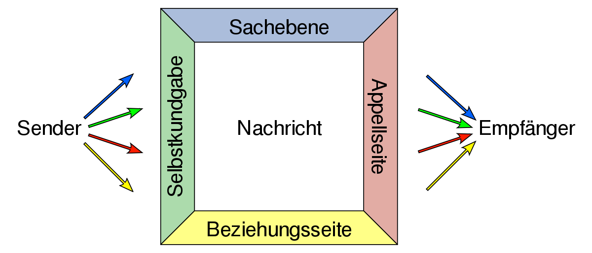

```{r setup, include=FALSE}
options(htmltools.dir.version = FALSE)

library(tidyverse)
library(kableExtra)
library(ggplot2)
library(plotly)
library(htmlwidgets)
library(MASS)
library(ggpubr)
library(xaringanthemer)
library(xaringanExtra)

style_duo_accent(
  primary_color = "#621C37",
  secondary_color = "#EE0071",
  link_color = "#7da5f5",
  background_image = "blank.png"
)

xaringanExtra::use_xaringan_extra(c("tile_view"))

use_scribble(
  pen_color = "#EE0071",
  pen_size = 4
  )

knitr::opts_chunk$set(
  fig.retina = TRUE,
  warning = FALSE,
  message = FALSE
)
```

name: Title slide
class: middle, left
<br><br><br><br><br><br><br>
# Einführung in die Forschungsmethoden der Psychologie und Psychotherapie

### Einheit 4: Latente Merkmale: Befragungen, Tests
##### 02.05.2024 | Dr. Caroline Zygar-Hoffmann


---
class: top, left
name: content
### Heutige Themen

#### Selbstberichtsverfahren: Befragung und Rating
* [Rahmenbedingungen](#intro)
* [Befragung](#befragung)
* [Ratings](#ratings)

#### Testverfahren
* [Merkmale](#merkmale)
* [Leistungstests](#leistungstests)
* [Persönlichkeitstests](#perstests)

#### Take-Aways und Schlüssel-/Fachbegriffe
* [Take-Aways](#take-away)
* [Schlüssel-/Fachbegriffe](#words)

---
class: top, left
name: intro
<div class="footer"><span>Echterhoff, G. (2013). Quantitative Erhebungsmethoden. In W. Hussy, M. Schreier & G. Echterhoff (Hrsg.). Forschungsmethoden in Psychologie und Sozialwissenschaften für Bachelor (S.71-90). Springer. </div>

### Selbstberichtsverfahren: Befragung und Rating

#### Rahmenbedingungen

Idee: Die Befragung ermöglicht einen Zugang zu psychischen Prozessen, Strukturen und Merkmalen, auch solchen die nicht direkt beobachtbar sind, also nicht sichtbar (d.h. nicht manifest, sondern latent)

**Drei Voraussetzungen:**

1. Untersuchte Personen müssen **Zugang** zu den interessierenden psychischen Prozessen haben

2. Untersuchte Personen müssen interessierende psychische Prozesse **kommunizieren** können

3. Selbstauskünfte von Untersuchungsteilnehmer:innen müssen hinreichend **reliabel und valide** sein

Selbstauskünfte in Befragungen beinhalten **drei elementare kognitive bzw. mentale Prozesse**:

1. Interpretation der Frage
2. Bildung eines Urteils
3. Übersetzung in eine kommunizierte Auskunft

---
class: top, left
<div class="footer"><span>Echterhoff, G. (2013). Quantitative Erhebungsmethoden. In W. Hussy, M. Schreier & G. Echterhoff (Hrsg.). Forschungsmethoden in Psychologie und Sozialwissenschaften für Bachelor (S.71-90). Springer. </div>

### Selbstberichtsverfahren: Befragung und Rating

#### Rahmenbedingungen

**Wie werden Selbstberichte kommuniziert?**

.pull-left[
* Selbstbericht = Akt der Kommunikation
* Person teilt sich bewusst mit (wendet sich an einen oder mehrere Adressaten)
* Menschliche Kommunikation = Informationen + Absicht des Senders

$\rightarrow$ Einfluss auf die Validität: Was messe ich eigentlich? (z.B. ist ein Rückschluss auf das Merkmal basierend auf der gegebenen Information ggf. verzerrt, wenn sozial erwünschter geantwortet wird)

$\rightarrow$ Beispiel 4-Seiten-Modell (F. Schulz von Thun): Oft ist man als Forscher daran interessiert, die Absicht des Senders auf die "Selbstkundgabe" und/oder "Sachebene" zu richten
]

.pull-right[
.center[
```{r eval = TRUE, echo = F, out.width = "450px"}

```
```{r eval = TRUE, echo = F, out.width = "450px"}

```
]
]

---
class: top, left
name: befragung

### Selbstberichtsverfahren: Befragung und Rating

#### Befragung - Varianten und Prinzipien der Konstruktion

* **Schriftliche** (Fragebogen) vs. **mündliche** Befragung (Interview)

* **Standardisierte** vs. **nichtstandardisierte** Befragung $\rightarrow$ relevant für Auswertungs- und Interpretationsobjektivität
  * Standardisiert: Antwortmöglichkeiten vorgegeben (geschlossene Fragen)
  * Nichtstandardisiert: Befragte Person kann Antwort in ihren eigenen Worten formulieren (offene Fragen)

* **Strukturierte** vs. **unstrukturierte** Befragung $\rightarrow$ relevant für Durchführungsobjektivität
  * (Voll-)Strukturiert: Wortlaut und Reihenfolge der Fragen bzw. Items genau vorgegeben 
  * Halbstrukturiert: Leitfaden mit vorformulierten Fragen zur Orientierung
  * Unstrukturiert: Keine Vorgaben hinsichtlich Frageformulierung und Reihenfolge der Items

* **Anzahl** der befragten Personen
  * Einzelbefragung (1 Person)
  * Gruppenbefragung (kleine Gruppe)
  * Survey (Umfrage mit großer Zahl an Befragten, wobei i.d.R. jede Person einzeln befragt wird)

---
class: top, left
### Selbstberichtsverfahren: Befragung und Rating

#### Befragung - Varianten und Prinzipien der Konstruktion

**Unterschiede zwischen schriftlicher und mündlicher Befragung**

* Bei schriftlichen Befragungen ist das Reaktivitätsproblem geringer (der face-to-face-Kontakt bei Interviews kann Beeinflussungseffekte haben und Mitteilungsabsichten können stärker ausgeprägt sein)

* Befragte äußern sich bisweilen eher und ausführlicher in mündlichen Befragungen, Mitteilungsabsichten können erörtert werden

* Interviews i.d.R. aufwändiger und kostenintensiver, dafür ggf. weniger Vorwissen nötig (zumindest wenn Interviews weniger standardisiert sind)

$\rightarrow$ Entscheidung nach Forschungsziel und Ressourcenverfügbarkeit


---
class: top, left
### Selbstberichtsverfahren: Befragung und Rating

#### Befragung - Varianten und Prinzipien der Konstruktion

##### Beispielthema: Warum sind Liebesbeziehungen oft nicht von Dauer?

**Beispiel: Vollstrukturierte und standardisierte Befragung**

1. Was kennzeichnet für Sie eine dauerhafte, funktionierende Beziehung?

   <input type="checkbox" unchecked> Offenheit</input> 
   <input type="checkbox" unchecked> Freiräume</input> 
   <input type="checkbox" unchecked> Verlässlichkeit</input> 
   <input type="checkbox" unchecked> gemeinsame Interessen</input> 
    <input type="checkbox" unchecked> Kompromissbereitschaft</input> 

2. Woran scheitern Ihrer Meinung nach viele Beziehungen?

  <input type="checkbox" unchecked> Untreue</input> 
   <input type="checkbox" unchecked> zu wenig Kommunikation</input> 
   <input type="checkbox" unchecked> Monotonie</input> 
   <input type="checkbox" unchecked> Erwartungsverletzungen</input> 
    <input type="checkbox" unchecked> Verwandtschaft</input> 

3. ...


---
class: top, left
### Selbstberichtsverfahren: Befragung und Rating

#### Befragung - Varianten und Prinzipien der Konstruktion

##### Beispielthema: Warum sind Liebesbeziehungen oft nicht von Dauer?

**Beispiel: Unstrukturiertes ("offenes") und unstandardisiertes Interview**

**Einstiegsfrage:** 

Denken Sie an ein Ihnen bekanntes Paar, das sich getrennt hat. Erzählen Sie mir, was Ihnen in der Zeit vor der Trennung aufgefallen ist (bzw. wie Sie sich in der Gegenwart des Paares gefühlt haben).

**Potentielle Nachfragen (auch Verständnisfragen erlaubt):**

* Beschreiben Sie eine Streitstituation des Ihnen bekannten Paares. 
* Was hat Ihrer Meinung nach zur Trennung des Paares geführt?
* Was hätten die Betroffenen Ihrer Meinung nach tun können, um die Trennung zu verhindern?

$\rightarrow$ in der qualitativen Forschung üblich, siehe Einheit 5 für mehr Details zu Interview

---
class: top, left
### Selbstberichtsverfahren: Befragung und Rating

#### Befragung - Varianten und Prinzipien der Konstruktion

.center[
```{r eval = TRUE, echo = F, out.width = "70%"}

```
]


---
class: top, left
<div class="footer"><span>Pelham, B. W., & Blanton, H. (2007). Conducting research in psychology. Measuring the Weight of Smoke. SAGE.</div>

### Selbstberichtsverfahren: Befragung und Rating

#### Befragung - Varianten und Prinzipien der Konstruktion

* Meist Formulierung des Items als Frage oder Aussage (manchmal auch einfach nur ein zu beurteilendes Adjektiv)
* zeitlicher Bezug kann variieren (z.B. "im Moment" vs. "im letzten Monat", vs. "im Allgemeinen")

**Ein guter Fragebogen ist gekennzeichnet durch (Pelham und Blanton, 2007)**:

* einfache Formulierung und gute Verständlichkeit
* keine zu hohen Anforderungen an die mentale oder kognitive Leistungsfähigkeit der Befragten
* adressatenorientierte Formulierung
* keine (doppelten) Verneinungen in den Fragen
* keine überfrachteten Fragen
* keine »Forced Choice« Antworten bei unabhängig beantwortbaren Aspekten (z.B. "Sind Sie eher gewissenhaft oder offen?" $\rightarrow$ schließt sich nicht aus!)
* keine Fragen, die sehr ähnlich klingen
* Einsatz mehrerer Items zur Messung eines Konstrukts
* Beachtung der Ausgewogenheit in der Reihenfolge der Fragen
* eine klare und informative Instruktion

---
class: top, left
name: ratings

### Selbstberichtsverfahren: Befragung und Rating

#### Ratings: Beurteilungen auf Skalen

Ratingskalen sind ein sehr häufiges Format in schriftlichen Befragungen:

* Beurteilung von Aspekten eines bestimmten Merkmals auf einer Skala

* Geben gleich große, georgnete, markierte Abschnitte des Merkmalskontinuums vor

* Personen sollen diejenige Stufe der Ratingskala ankreuzen, die persönlicher Auffassung am ehesten entspricht

**Gründe für Beliebtheit in Psychologie:**
1. liefern vergleichsweise direkt quantitative (in Zahlen übersetzte und damit statistisch auswertbare) Daten

2. unterteilen die Merkmalsausprägungen in gleich große Abschnitte $\rightarrow$ legen datenanalytisch günstiges Skalenniveau (Intervallskalenniveau) nahe

**Vorsicht:** Intervallskalenniveau ist nicht genuin aus dem Format der Skala, sondern nur inhaltlich (psychologisch/empirisch) zu begründen (wird aber i.d.R. bei Ratingskalen akzeptiert)

---
class: top, left
### Selbstberichtsverfahren: Befragung und Rating

#### Ratings: Beurteilungen auf Skalen

##### Aspekte bei der Konstruktion von Ratingskalen

**Verwendung unipolarer oder bipolarer Endpunkte**


* **Unipolare Skalen**: beginnen mit einem Nullpunkt (z.B. „nie“, "stimme überhaupt nicht zu") und nehmen dann in der Ausprägung in eine Richtung zu (z.B. bis „immer“, "stimme voll und ganz zu").

* **Bipolare Skalen**: bezeichnen in ihren Enden den negativen und positiven Pol eines Kontinuums (z.B. „lehne ab“ vs. „stimme zu“) oder gegensätzliche Eigenschaften eines Merkmals (z.B. "weich" vs. "hart")

* **Maßnahme:** Darbietung einer Nummerierung, die zu den verbalen Bezeichnungen passt, wirkt sich positiv auf die Reliabilität der Messungen aus (Rammstedt & Krebs, 2007).

---
class: top, left
### Selbstberichtsverfahren: Befragung und Rating

#### Ratings: Beurteilungen auf Skalen

##### Aspekte bei der Konstruktion von Ratingskalen

**Verwendung unipolarer oder bipolarer Endpunkte**

.pull-left[
```{r, echo=FALSE,out.width = "60%", fig.show='hold',fig.align='center'}
knitr::include_graphics("bilder/unipolar.png")
``` 
]

.pull-right[
```{r, echo=FALSE,out.width = "80%", fig.show='hold', fig.align='center'}
knitr::include_graphics("bilder/bipolar.png")
``` 
]

.center[
Döring & Bortz (2016), S.256
]


---
class: top, left
### Selbstberichtsverfahren: Befragung und Rating

#### Ratings: Beurteilungen auf Skalen

##### Aspekte bei der Konstruktion von Ratingskalen

**Verwendung unipolarer oder bipolarer Endpunkte**

.pull-left[
  **Bipolare Skalen:** 
  * Vorteil: Begriffe an den Endpunkten der Skala definieren einander wechselseitig
  * Vorsicht: Nicht angemessen, um zwei distinkte Merkmale mit einem Item zu erfassen
]

.pull-right[
  **Unipolare Skalen: **
  * Vorteil: Gegensatz eines Begriffs muss nicht klar sein (z.B. bei "schüchtern"); das ist häufig der Fall, daher sind unipolare Skalen auch häufiger
  * Eignen sich gut zur Beurteilung von Merkmalen mit einem natürlichen Nullpunkt (z.B. bei Abfragen von Häufigkeiten)
  ]

---
class: top, left
<div class="footer"><span>Lewis, J. & Sauro, J. (2021). https://measuringu.com/do-too-many-options-confuse/ <br> Preston, C. C., & Colman, A. M. (2000). Optimal number of response categories in rating scales: reliability, validity, discriminating power, and respondent preferences. <i>Acta psychologica, 104</i>(1), 1-15.<br>Revilla, M. A., Saris, W. E., & Krosnick, J. A. (2014). Choosing the number of categories in agree–disagree scales. <i>Sociological Methods & Research, 43</i>(1), 73-97.</div>

### Selbstberichtsverfahren: Befragung und Rating

#### Ratings: Beurteilungen auf Skalen

##### Aspekte bei der Konstruktion von Ratingskalen

**Abstufung der Skala**

**1. Geringe vs. hohe Anzahl der Stufen**

  * **Problem geringe Anzahl**: relevante Unterschiede zwischen verschiedenen Beurteilungen nicht abbildbar
  
  * **Problem hohe Anzahl**: Differenziertheit des Urteils nicht mehr möglich? (Gegenposition: Review von Lewis & Sauro, 2021)
  
  * In der Praxis i.d.R. 4- bis 9-stufige Ratingskalen, wobei es empirische Befunde gibt, dass die Reliabilität bei 5 (Revilla et al., 2014) bis 7 Stufen (Preston & Coleman, 2000) besonders gut ist

---
class: top, left

### Selbstberichtsverfahren: Befragung und Rating

#### Ratings: Beurteilungen auf Skalen

##### Aspekte bei der Konstruktion von Ratingskalen

**Abstufung der Skala**

**2. Gerade vs. ungerade Anzahl von Stufen**

  * **Gerade Anzahl**: Urteil in Richtung des einen oder anderen Pols der Skala wird erzwungen
  
  * **Ungerade Anzahl**: Mittelkategorie vorhanden, d.h. neutrale Urteilsmöglichkeit verfügbar
  
  * **Problem neutrales Urteil**: nicht eindeutig interpretierbar (**Ambivalenz-Indifferenz-Problem**) $\rightarrow$ ggf. sinnvoll eine weitere Antwortoption neben der Mittelkategorie zur Angabe von Meinungslosigkeit zu ermöglichen (z.B. "ich weiß es nicht", "keine Meinung", "keine Angabe")

---
class: top, left

### Selbstberichtsverfahren: Befragung und Rating

#### Ratings: Beurteilungen auf Skalen

##### Aspekte bei der Konstruktion von Ratingskalen

**Bezeichnung der Abstufungen einer Skala**

**Zahlen (numerische Marker)**
* Vorteil: Stufen sind eindeutig
* Vorteil: Abstände zwischen den Stufen der Ratingskala sind gleich 

**Wörter (verbale Marker) oder sprachfreie Zeichen (grafische Marker, z.B. Smileys oder Frownies)**
* Vorteil: leichter verständlich (forschungssnaive Personen, Kinder)
* Nachteil: Verständnis variiert, gleicher Abstand zwischen den Stufen unklar

> Frage 1) Wie oft (verbal beschrieben) haben Sie in der letzten Woche Fragen gestellt oder zu einer Diskussion auf andere Art beigetragen? Auswahl: Nie, manchmal, oft, sehr oft
>
> Frage 2) Wie oft (absolute Häufigkeiten) haben Sie in der letzten Woche Fragen gestellt oder zu einer Diskussion auf andere Art beigetragen? 

---
class: top, left
<div class="footer"><span>Rocconi, L. M., Dumford, A. D., & Butler, B. (2020). Examining the Meaning of Vague Quantifiers in Higher Education: How Often is “Often”?. Research in Higher Education, 61, 229-247.</div>

### Selbstberichtsverfahren: Befragung und Rating

#### Ratings: Beurteilungen auf Skalen

##### Aspekte bei der Konstruktion von Ratingskalen

**Bezeichnung der Abstufungen einer Skala**

.center[
```{r eval = TRUE, echo = F, out.width="90%"}
knitr::include_graphics("bilder/Rocconi2018.png")
```
]

---
class: top, left
<div class="footer"><span>Kent, S. (1964). Words of estimative probability. <i>Studies in intelligence, 8</i>(4), 49-65. & https://github.com/zonination/perceptions<br>Willems, S., Albers, C., & Smeets, I. (2020). Variability in the interpretation of probability phrases used in Dutch news articles—a risk for miscommunication. <i>Journal of Science Communication, 19</i>(2).</div>

### Selbstberichtsverfahren: Befragung und Rating

#### Ratings: Beurteilungen auf Skalen

##### Aspekte bei der Konstruktion von Ratingskalen

**Bezeichnung der Abstufungen einer Skala**

.pull-left[
.center[
```{r eval = TRUE, echo = F, out.width = "50%"}
knitr::include_graphics("bilder/verbale_anker.png")
```
]
]

.pull-right[
.center[
```{r eval = TRUE, echo = F}

```
]
]

---
class: top, left
<div class="footer"><span>Weijters, B., Cabooter, E., & Schillewaert, N. (2010). The effect of rating scale format on response styles: The number of response categories and response category labels. International Journal of Research in Marketing, 27(3), 236-247. <br> Saris, W. E., & Gallhofer, I. (2007). Estimation of the effects of measurement characteristics on the quality of survey questions. In Survey research methods (Vol. 1, No. 1, pp. 29-43).</div>

### Selbstberichtsverfahren: Befragung und Rating

#### Ratings: Beurteilungen auf Skalen

##### Probleme bei der Beantwortung von Ratingskalen

* **Antworttendenzen von Teilnehmer:innen**
  
  * **Tendenz zur Mitte**: Extremurteile werden vermieden (insbesondere wenn Skalen an den Endpunkten nicht verankert sind, d.h. die Extreme unklar bleiben)
  
  * **Extreme Antworttendenz**: Extremurteile werden bevorzugt
  
  * **"Ja-Sage-Tendenz“ (Akquieszenz)** oder **„Nein-Sage-Tendenz“**
  
  * Antworttendenzen sind besonders ausgeprägt, wenn Urteilsobjekte wenig bekannt sind $\rightarrow$ **Gegenmaßnahme:** Personen hinreichend über zu beurteilende Objekte informieren, alle Antwortkategorien verbal beschriften (Weijters et al., 2010; führt zu auch zu höherer Reliabilität: Saris & Gallhofer, 2007)


---
class: top, left
### Selbstberichtsverfahren: Befragung und Rating

#### Ratings: Beurteilungen auf Skalen

##### Probleme bei der Beantwortung von Ratingskalen

.center[
```{r eval = TRUE, echo = F, out.width="75%", fig.cap="Döring & Bortz (2016), S.254"}
knitr::include_graphics("bilder/tendenz_zur_mitte.png")
```
]
---
class: top, left
<div class="footer"><span>Swain, S. D., Weathers, D., & Niedrich, R. W. (2008). Assessing three sources of misresponse to reversed Likert items. Journal of marketing research, 45(1), 116-131. <br> Weijters, B., & Baumgartner, H. (2012). Misresponse to reversed and negated items in surveys: A review. <i>Journal of Marketing Research, 49</i>(5), 737-747.</div>

### Selbstberichtsverfahren: Befragung und Rating

#### Ratings: Beurteilungen auf Skalen

##### Probleme bei der Beantwortung von Ratingskalen

* **Gedankenlose Reproduktion**

  * bei ähnlich erscheinenden Items nach erster Antwort bei folgenden Fragen den selben Wert angeben
  
  * Stellt Validität der Antworten in Frage
  
  * Gegenmaßnahme: Mischung von Fragen
  
  * Umpolung der Fragerichtung als alternative Gegenmaßnahme ist umstritten (Swain et al., 2008; Weijters & Baumgartner, 2012)

---
class: top, left
### Selbstberichtsverfahren: Befragung und Rating

#### Ratings: Beurteilungen auf Skalen

##### Probleme bei der Beantwortung von Ratingskalen

.pull-left[
* **Motivierte Verzerrungen**
  * Selbstdarstellungstendenz
  
  * Selbsttäuschung
  
  * Soziale Erwünschtheit
  
  * "faking good" (aber auch "faking bad")
  
  * provokativer Antwortstil
]

.pull-right[
* **Unmotivierte Verzerrungen**
  * soziale Vergleichsprozesse
  
  * Verankerungseffekte
  
  * Verfügbarkeitsheuristik
  
  * falsche bzw. mangelhafte Repräsentation des zu messenden Merkmals
  
  * Missverständnis des Fragebogens als Leistungstest
]

---
class: top, left
<div class="footer"><span>Kjell, O. N., Kjell, K., Garcia, D., & Sikström, S. (2019). Semantic measures: Using natural language processing to measure, differentiate, and describe psychological constructs. <i>Psychological Methods, 24</i>(1), 92-115. http://dx.doi.org/10.1037/met0000191</div>

### Selbstberichtsverfahren: Befragung und Rating

#### Ratings: Beurteilungen auf Skalen

##### Wie könnte es in Zukunft laufen?

.pull-left[
```{r eval = TRUE, echo = F}

```
]

.pull-right[
```{r eval = TRUE, echo = F}

```
]

---
class: top, left
name: merkmale

### Testverfahren

#### Merkmale Psychologischer Test

* **Definition Test**: wissenschaftliches Routineverfahren zur Untersuchung eines oder mehrerer empirisch unterscheidbarer Merkmale

* v.a. zum Einsatz in psychologischer Diagnostik, um eine möglichst genaue Aussage über den relativen Grad der individuellen Merkmalsausprägung zu bekommen

*  **Annahme**: Aufgaben/Fragen des Tests werden von Menschen mit unterschiedlichen Fähigkeiten oder Eigenschaften unterschiedlich gelöst/beantwortet

* **Testwert** = Aggregation über die Einzelitems/-aufgaben des Tests

---
class: top, left

### Testverfahren

#### Merkmale Psychologischer Test

**Für einen psychologischen Test gilt:**

**a)** Es handelt sich um eine Messmethode, bei der Personen auf **standardisierte Reizvorlagen** (Aufgaben, Fragen etc.) reagieren.

**b)** Reaktionen werden durch die **spezifischen, im Test realisierten Bedingungen** hervorgerufen.

**c)** Die Reaktionen erlauben einen **wissenschaftlich begründbaren Rückschluss auf die individuelle Ausprägung** eines psychologischen Merkmals (oder auch mehrere Merkmale).

**d)** Das Vorgehen ist **standardisiert**.

**e)** Ziel ist eine **quantitative (Ausprägung des Merkmals) und/oder eine qualitative Aussage (Vorhandensein oder Art des Merkmals)** über das psychologische Merkmal.

$\rightarrow$ kann also auch ein Fragebogen sein ("Persönlichkeitstests"; ein Fragebogen wird meist erst dann als Test bezeichnet, wenn er in der Einzelfalldiagnostik eingesetzt werden kann und nicht nur in der Forschung, z.B. weil die Gütekriterien entsprechend gut sind und Normen vorliegen)

---
class: top, left
name: leistungstests

### Testverfahren

#### Leistungstests

* Leistungstests erfassen Merkmale im Hinblick auf einen objektiven Maßstab zur Beurteilung der Güte der Antworten

* Antworten können also »richtig« oder »falsch« sein

* Für Beantwortung sind kognitive Prozesse im weitesten Sinne und Leistungsmotivation entscheidend

* Um zwischen guten/schlechten Leistungen differenzieren zu können, müssen verschiedene Schwierigkeitsgrade realisiert sein

Beispiele:

* Intelligenztests

* Eignungstests

---
class: top, left
<div class="footer"><span>https://www.testzentrale.de/shop/test-d2-aufmerksamkeits-belastungs-test.html</div>

### Testverfahren

#### Leistungstests

**Speed-Tests**

* Bei Speed-Tests ist die Bearbeitungszeit zu knapp angesetzt

* Somit können in der Regel nicht alle Aufgaben bearbeitet werden

.pull-left[
Beispiel: d2-Aufmerksamkeits-Konzentrationstest von Brickenkamp (2002)

* Testpersonen bearbeiten eine große Zahl von Zeichen, nämlich die Buchstaben d und p, die jeweils mit bis zu vier kleinen Strichen umgeben sind

* Anzustreichen sind nur jene d, die zwei Striche oberhalb aufweisen
]

.pull-right[
```{r eval = TRUE, echo = F, out.width = "600px"}
knitr::include_graphics("bilder/d2.png")
```
]

---
class: top, left
<div class="footer"><span>https://www.testzentrale.de/shop/wechsler-adult-intelligence-scale-fourth-edition.html</div>

### Testverfahren

#### Leistungstests

**Power-Tests**

* Bei Power-Tests wird das Niveau der Aufgaben sukzessive gesteigert

* Spezialfall: **Adaptives Testverfahren**, welches eine Teilmenge von Aufgaben vorgibt bis maximales Leistungsniveau gefunden ist

Beispiel: Wechsler-Intelligenz-Tests (HAWIE; seit 2013 WAIS-IV)

* HAWIE umfasst insgesamt 11 Untertests (Subskalen)

* Untertests sind Bereich der verbalen Intelligenz oder der Handlungsintelligenz zugeordnet

---
class: top, left
### Testverfahren

#### Leistungstests

**Power-Tests**

Beispiel: Wechsler-Intelligenz-Tests (HAWIE)

Verbalteil:

1. Allgemeines Wissen, z.B. »Was ist der Koran?«, »Wer erfand das Flugzeug?«

2. Zahlennachsprechen: Folgen von 3–9 Ziffern sind vorwärts und rückwärts nachzusprechen, z. B. »5-8-2« oder »4-2-7-3-1-8-2«

3. Wortschatz: »Was ist die Bedeutung von ...?« z. B. »anonym, Prestige, konkordant«

4. Rechnerisches Denken, z. B. »Ein Zug fährt 275 km in 5h. Wie groß ist seine Durchschnittsgeschwindigkeit in km/h?«

5. Allgemeines Verständnis, z. B. »Was bedeutet das Sprichwort 'Stille Wasser sind tief'?«

---
class: top, left
### Testverfahren

#### Leistungstests

**Power-Tests**

Beispiel: Wechsler-Intelligenz-Tests (HAWIE)

Bilder ordnen: »Ordnen Sie die Bilder bitte so, dass sich die sinnvollste Geschichte ergibt!«, z. B.

<br><br>
.center[
```{r eval = TRUE, echo = F, out.width = "600px"}

```
]

---
class: top, left
### Testverfahren

#### Leistungstests

**Power-Tests**

Beispiel: Wechsler-Intelligenz-Tests (HAWIE)

Mosaik-Test: »Legen Sie die Würfel so zusammen, dass sie ein Muster zeigen, wie das auf der Karte«, z. B.

.center[
```{r eval = TRUE, echo = F, out.width = "400px"}
knitr::include_graphics("bilder/hawie4.png")
```
]

---
class: top, left
### Testverfahren

#### Leistungstests

**Power-Tests**

Beispiel: Wechsler-Intelligenz-Tests (HAWIE)

Figurenlegen: »Setzen Sie die Teile so zusammen, dass sie etwas darstellen!«, z. B.

.center[
```{r eval = TRUE, echo = F, out.width = "500px"}

```
]

---
class: top, left
name: perstests

### Testverfahren

#### Persönlichkeitstests

* Persönlichkeitstests liefern Daten im Hinblick auf emotional, motivational und sozial relevante Persönlichkeitseigenschaften

* Es wird zwischen **subjektiven** und **objektiven **Persönlichkeitstests unterschieden, je nachdem ob sie auf Selbst- oder Fremdauskunft auf Fragebogenitems basieren (-> subjektiv) oder nicht (-> objektiv)
  * Bei subjektiven Persönlichkeitstests ist der Zweck des Tests für die getesteten Personen leicht durchschaubar
  * Bei objektiven Persönlichkeitstests wird versucht, den Zweck zu verschleiern, um so die Reaktivität der Datenerhebung zu minimieren und die Validität der Ergebnisse zu erhöhen

---
class: top, left

### Testverfahren

#### Persönlichkeitstests

.pull-left[
**Beispiele für subjektive Persönlichkeitstests:**
* NEO Persönlichkeitsinventar (NEO-PI-R; Costa & Macrae, 1985) oder Kurzform NEO Five Factor Inventory (NEO-FFI; Costa & Macrae, 1992) - *mit Variante als Fremdbericht über andere Personen*

* Freiburger Persönlichkeitsinventar (FPI-R, Fahrenberg, Hampel & Selg, 1994)
]

.pull-right[
```{r eval = TRUE, echo = F, fig.cap="Auszug aus der deutschen Übersetzung des NEO-PI-R von Ostendorf & Angleitner (2004)", }

```
]


---
class: top, left

### Testverfahren

#### Persönlichkeitstests

**Beispiele für objektive Persönlichkeitstests:**

.pull-left[
* Implizite Assoziationtests (IAT) basieren auf Reaktionszeiten, Kritik an Validität

.center[
```{r eval = TRUE, echo = F}


knitr::include_graphics("bilder/iat.gif")

```
]
]

.pull-right[

* Objektiver Leistungsmotivationstest (OLMT, Schmidt-Atzert, 2007) bedient sich der Idee: Wer leistungsmotivierter ist, strengt sich bei den dargestellten Aufgaben mehr an, und legt eine weitere Strecke zurück (= drückt öfters die notwendige Taste)

.center[
```{r eval = TRUE, echo = F, fig.cap="Schmidt-Atzert et al. (2016), S.371", out.width = "75%"}
knitr::include_graphics("bilder/olmt.png")
```
]
]
---
class: top, left

### Testverfahren

#### Persönlichkeitstests

**Projektive Verfahren als Sonderform von objektiven Persönlichkeitstests**

.pull-left[
* Wie bisher: Standardisierte Testsituation

* Neu: Projektion auf diffuses Testmaterial

* Es ist nicht erforderlich, dass Personen eine explizite Repräsentation von dem zu messenden Konstrukt haben $\rightarrow$ geringere Verfälschbarkeit

* "Objektiver Persönlichkeitstest" weil nicht auf Selbst- oder Fremdbericht basierend, nicht weil Gütekriterium der Objektivität zwingend erfüllt (bei Interpretationsobjektivität eher im Gegenteil)

* Große Variation in der Gültigkeit der Gütekriterien!! z.B. mangelhaft beim Rorschach-Test


]

.pull-right[
```{r eval = TRUE, echo = F, out.width="80%", fig.cap="Schmidt-Atzert et al. (2016), S.386", }
knitr::include_graphics("bilder/rorschach.png")
```
]

---
class: top, left

### Testverfahren

#### Persönlichkeitstests

**Projektive Verfahren als Sonderform von objektiven Persönlichkeitstests**

.center[
```{r eval = TRUE, echo = F, out.width="50%"}

```
]

---
class: top, left

### Testverfahren

#### Persönlichkeitstests

**Projektive Verfahren als Sonderform von objektiven Persönlichkeitstests**

Beispiel: Picture Story Exercise (PSE) zur Messung von impliziten (nicht bewusst zugänglichen) Motiven *in der Forschung* (für diagnostische Praxis nicht reliabel genug)

```{r eval = TRUE, echo = F, out.width="60%", fig.cap="Schmidt-Atzert et al. (2016), S.395", }
knitr::include_graphics("bilder/pse.png")
```

---
class: top, left
<div class="footer"><span>Anvari, F., Alsalti, T., Oehler, L., Hussey, I., Elson, M., & Arslan, R. C. (2024, March 22). A fragmented field: Construct and measure proliferation in psychology. https://doi.org/10.31234/osf.io/b4muj</div>

### Fragebögen und Tests in der Psychologie

.pull-left[
.center[
```{r eval = TRUE, echo = F}

```
```{r eval = TRUE, echo = F, out.width = "95%"}
knitr::include_graphics("bilder/anvari2024-1.png")
```
]
]

.pull-right[
.center[
```{r eval = TRUE, echo = F, out.width = "95%"}

```
]
]

$\rightarrow$ Sinnhaftigkeit so vieler Fragebögen und Tests?

---
class: top, left
name: take-away

### Take-Aways
.content-box-gray[

* Befragungen unterscheiden sich in ihrer **Darbietung** (schriftlich oder mündlich), **Standardisierung** (hinsichtlich der Antwortmöglichkeiten), **Strukturierung** (hinsichtlich der Vorgaben zur Fragenstellung), und der **Anzahl der befragten Personen**

* Befragungen in Form von **schriftlichen, standardisierten, und strukturierten Selbstratings** sind in der Psychologie beliebte, kostengünstige Messverfahren, haben aber Probleme hinsichtlich der Verfälschbarkeit

* Die **Itemformulierung** und die **Antwortskala** von Fragebögen beeinflusst die Gütekriterien des Fragebogens (insbesondere Reliabilität und Validität)

* Ein **psychologischer Test** ist ein wissenschaftliches Routineverfahren zur Untersuchung eines oder mehrerer empirisch unterscheidbarer Merkmale

* **Leistungstests** erfassen Merkmale im Hinblick auf einen **objektiven Maßstab**

* Man unterscheidet **subjektive** und **objektive Persönlichkeitstests**
]

---
class: top, left
name: words

### Schlüssel-/Fachbegriffe der heutigen Vorlesung
.content-box-gray[

.pull-left[
.pull-left[

**standardisierte Befragung**

**unstandardisierte Befragung**

**(Voll-)strukturierte Befragung**

**Teil-/Halbstrukturierte Befragung**

**Forced Choice Antworten**

**Ratingskalen**
]

.pull-right[
**unipolare Skalen**

**bipolare Skalen**

**Ambivalenz-Indifferenz-Problem**

**numerische Marker**

**verbale Marker**

**grafischer Marker** 

**Tendenz zur Mitte**

**Extreme Antworttendenz**
]
]

.pull-right[
.pull-left[
**Ja-Sage-Tendenz = Akquieszenz**

**Nein-Sage-Tendenz**

**Gedankenlose Reproduktion** 

**Motivierte Verzerrungen**

**Unmotivierte Verzerrungen**

**Soziale Erwünschtheit**

**faking good / faking bad**
]

.pull-right[

**Verfügbarkeitsheuristik**

**Leistungstests**

**Speed-Tests**

**Power-Tests**

**subjektive Persönlichkeitstests**

**objektive Persönlichkeitstests**

**projektive Verfahren**
]
]
]

**[zurück zur heutigen Übersicht der Vorlesung $\rightarrow$](#content)** 
<br>
**[zum Quiz zur Wissensprüfung $\rightarrow$](https://forms.gle/RJ1axk9EdjPM1n9a7)**
---
class: top, left
### Literatur für die heutige Sitzung

.pull-left[
```{r, echo=FALSE,out.width="50%",fig.cap="Kapitel 8.4.4. in Döring, N. & Bortz, J. (2016). Forschungsmethoden und Evaluation in den Sozial- und Humanwissenschaften. Pearson.",fig.show='hold',fig.align='center'}
knitr::include_graphics("bilder/doering.png")
``` 
]

.pull-right[
```{r, echo=FALSE,out.width="50%",fig.cap="Kapitel 3.2. - 3.5. in Schmidt-Atzert, L., Krumm, S. & Amelang, M. (2021). Psychologische Diagnostik. Springer.",fig.show='hold',fig.align='center'}
knitr::include_graphics("bilder/schmidt-atzert.png")
``` 
]

**Materialien:** Vielen Dank an Prof. Dr. Stephan Goerigk für Bereitstellung der Grundlage für die Materialien


<!-- library(renderthis)  -->
<!-- to_pdf("EinfForsch_04_Messen_Latent.Rmd", complex_slides = TRUE) -->
