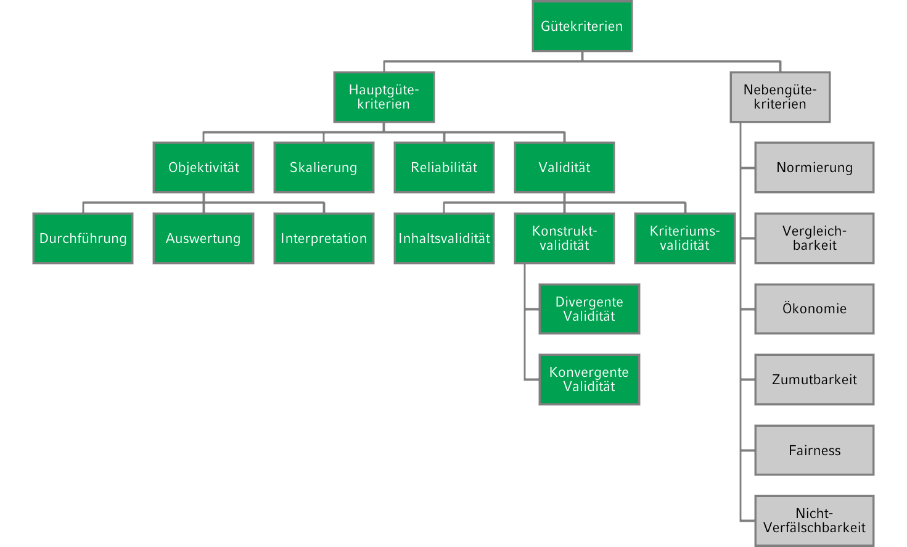
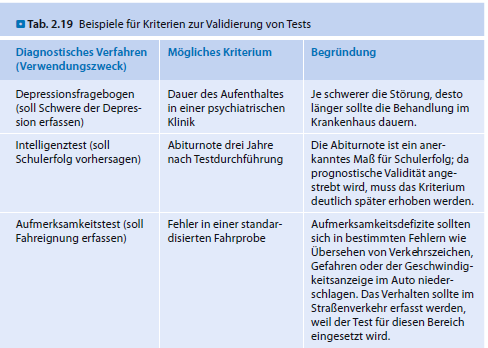
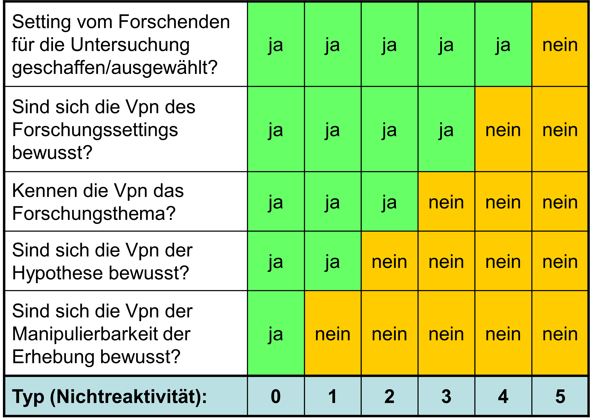

```{r setup, include=FALSE}
options(htmltools.dir.version = FALSE)

library(tidyverse)
library(kableExtra)
library(ggplot2)
library(plotly)
library(htmlwidgets)
library(MASS)
library(ggpubr)
library(xaringanthemer)
library(xaringanExtra)

style_duo_accent(
  primary_color = "#621C37",
  secondary_color = "#EE0071",
  background_image = "blank.png"
)

xaringanExtra::use_xaringan_extra(c("tile_view"))

use_scribble(
  pen_color = "#EE0071",
  pen_size = 4
  )

knitr::opts_chunk$set(
  fig.retina = TRUE,
  warning = FALSE,
  message = FALSE
)

# library(RefManageR)
# BibOptions(
# check.entries = FALSE, 
# bib.style = "authoryear", 
# cite.style = "authoryear", 
# style = "markdown",
# hyperlink = FALSE, 
# dashed = FALSE)
# myBib = ReadBib("/Users/stephangoerigk/Desktop/Universität/CFH/Lehre/Bachelor/Einführung in die Forschungsmethoden der Psychologie und Psychotherapie/EFPP_Folien/myBib.bib")
```

name: Title slide
class: middle, left
<br><br><br><br><br><br><br>
# Einführung in die Forschungsmethoden der Psychologie und Psychotherapie

### Einheit 4: Messen in der Psychologie - manifest
##### 10.11.2023 | Dr. Caroline Zygar-Hoffmann

---
class: top, left
### Nachtrag 1

#### Paradigmen der behavioristischen Lernpsychologie

**operante Konditionierung**

.pull-left[
```{r echo = F}
df = data.frame(v1 = c("", "Angenehme Konsequenz", "Unangenehme Konsequenz"),
                v2 = c("Konsequenz dargeboten", "positive Verstärkung", "positive Bestrafung"),
                v3 = c("Konsequenz fällt weg", "negative Bestrafung", "negative Verstärkung"))
names(df) = c("Valenz", "Darbietung", "Keine Darbietung")
df %>%
  kbl() %>%
  kable_styling(font_size = 18) %>%
  kable_classic(full_width = T)
```
]
.pull-right[
* Operantes Verhalten = Verhalten, das die Umwelt beeinflusst und Konsequenzen auslöst

* Leitfrage: Wie wird solches operantes Verhalten durch die Konsequenzen verändert?

[**Link zum Erklärungsvideo**](https://www.youtube.com/watch?v=ne6o-uPJarA)
]

<br>

**Übung:** Wenn ich durch operantes Konditionieren erreichen möchte, dass Sie weiterhin die Vorlesung besuchen. Wie könnte ich die vier Arten von positiver/negativer Verstärkung/Bestrafung nutzen?

---
class: top, left
### Nachtrag 1

#### Paradigmen der behavioristischen Lernpsychologie

**operante Konditionierung**

.pull-left[
```{r echo = F}
df = data.frame(v1 = c("", "Angenehme Konsequenz", "Unangenehme Konsequenz"),
                v2 = c("Konsequenz dargeboten", "positive Verstärkung", "positive Bestrafung"),
                v3 = c("Konsequenz fällt weg", "negative Bestrafung", "negative Verstärkung"))
names(df) = c("", "", "")
df %>%
  kbl() %>%
  kable_styling(font_size = 18) %>%
  kable_classic(full_width = T)
```
]

.pull-right[
```{r echo = F}
df = data.frame(v1 = c("", "Angenehme Konsequenz", "Unangenehme Konsequenz"),
                v2 = c("Konsequenz dargeboten", "zusätzliche Punkte in der Klausur durch Erscheinen", "weniger Punkte in der Klausur durch Erscheinen"),
                v3 = c("Konsequenz fällt weg", "Vorlesung findet frühmorgens statt, Ausschlafen entfällt durch Erscheinen", "Nachlesen und Recherchieren von Inhalten entfällt durch Erscheinen"))
names(df) = c("", "", "")
df %>%
  kbl() %>%
  kable_styling(font_size = 18) %>%
  kable_classic(full_width = T)
```
]

* **Verstärkung:** Verhalten wird verstärkt, durch Hinzufügen einer positiven Konsequenz (im Beispiel: zusätzliche Punkte) oder Entfernen einer negativen Konsequenz (im Beispiel: aufwändige Zusatzrecherche)

* **Bestrafung:** Verhalten wird bestraft und reduziert, durch Hinzufügen einer negativen Konsequenz (im Beispiel: weniger Punkte) oder Entfernen einer positiven Konsequenz (im Beispiel: Ausschlafen)

* In der rechten Spalte muss eine bestehende Konsequenz vorhanden sein und verändert werden (und das ist entweder positiv/angenehm oder negativ/unangenehm)


---
class: top, left
### Nachtrag 2

#### Hermeneutik

* Als Forschungsmethode sowohl bei **psychodynamischer** Perspektive als auch **humanistischer** Perspektive kennengelernt

* **Qualitative Methode der Textanalyse/Schriftinterpretation**: Texte auf verstehende Weise auslegen

* **Anwendungsfälle**: Trauminterpretation, Lebensgeschichte, Gespräche

* **Idiographisches Vorgehen** (auf Einzelfälle bezogen) in Abgrenzung zum nomothetischen (gesetzmäßigen) Wissenschaftsverständnis

* "**Empathie-Hermeneutik**" (Jung, 2001, S. 63): methodisch nicht kontrollierbares Sich-Einfühlen einer Seele in eine andere Seele; "Höchste Vollkommenheit in der Auslegung ist nach Schleiermacher dann erreicht, wenn durch die Interpretation der Autor bzw. die Autorin besser verstanden wird, als er/sie von sich selbst Rechenschaft geben könne (Jung 2001, S. 64)." (Sichler, 2018)

* Historiker und Philosoph **Wilhelm Dilthey** (1833–1911): 
  * Verstehen als Kunstwissenschaft
  * Trias: Erleben – Ausdruck – Verstehen

---
class: top, left
<div class="footer"><span>Greiner, K. (2021). Das hermeneutische Grundprinzip der Psychotherapie - Ein psychotherapiewissenschaftstheoretischer Comicstrip. à jour! Psychotherapie-Berufsentwicklung 7 (14), 35–37. https://doi.org/10.30820/2504-5199-2021-2-35</div>

### Nachtrag 2

#### Hermeneutik

.pull-left[
**1. Erleben:** Klient erlebt Subjektives (Ängste, Konflikte, Irritationen etc.) im Rahmen der persönlichen Erlebens- und Erfahrungswelt (pEE)

**2. Ausdruck:** Klient artikuliert das subjektive Erleben in der therapeutischen Situation, indem er verbalen und nonverbalen Leidenstext produziert

**3. Verstehen:** Therapeut macht sich den Leidenstext des Klienten professionell verständlich, indem er ihn in den Denk- und Handlungskontext der eigenen spezifischen Therapiekultur (sTK) integriert

**4. Therapeut-Klient-Kooperation:** Gemäss dieser besonderen Trias (1–2–3) gestalten sich konkrete professionelle Formen psychotherapeutischen Kommunizierens, Interagierens und Intervenierens
]

.pull-right[
```{r eval = TRUE, echo = F, out.width = "80%"}
knitr::include_graphics("bilder/hermeneutik.jpg")
```

Ausführliches Fallbeispiel für hermeneutisch-empathischen Reflexionsprozess, der für Diagnostik in der personenzentrierten Psychotherapie herangezogen wird (ab Seite 331): Keil, S. (2022). *Diagnostik in der Personzentrierten Psychotherapie*. In C. Höfner & M. Hochgerner (Hrsg.). Psychotherapeutische Diagnostik, S.323-336. Springer.
]


---
class: top, left
name: content
### Heutige Themen

#### Erhebungsmethoden der psychologischen Forschung
* [Unterteilung, Auswahl und Einsatz](#intro)
* [Qualitätskriterien](#kriterien)
* [Reaktivität](#reaktivitaet)

#### (Verhaltens-)Beobachtung
* [Alltagsbeobachtung vs. wissenschaftliche Beobachtung](#abgrenzung)
* [Beobachtungsplan](#beobachtungsplan)
* [Beobachtungsfehler und -verzerrungen](#fehler)
* [Beobachterübereinstimmung](#Beobachterübereinstimmung)

#### [Take-Aways](#take-away)

---
class: top, left
### Literatur für die heutige Sitzung

.pull-left[
```{r, echo=FALSE,out.width="50%",fig.cap="Kapitel 10.1. in Döring, N. & Bortz, J. (2016). Forschungsmethoden und Evaluation in den Sozial- und Humanwissenschaften. Pearson.",fig.show='hold',fig.align='center'}
knitr::include_graphics("bilder/doering.png")
``` 
]

.pull-right[
```{r, echo=FALSE,out.width="50%",fig.cap="Kapitel 8 in Bühner, M. (2021). Einführung in die Test- und Fragebogenkonstruktion. Pearson.",fig.show='hold',fig.align='center'}

``` 
]

**Materialien:** Vielen Dank an Prof. Dr. Stephan Goerigk und den Lehrstuhl für Psychologische Methodenlehre und Diagnostik an der LMU für Bereitstellung der Grundlage für die Materialien


---
class: top, left
name: intro

### Erhebungsmethoden der psychologischen Forschung

####  Unterteilung von Erhebungsmethoden

* Verhaltensbeobachtungsverfahren

* Verfahren des Selbstberichts (Fragebögen, Interviews)

* Psychologische Tests (z.B. Leistungstests)

* Biopsychologische bzw. neurowissenschaftliche Messungen 

* Computerbasierte Verfahren

* Implizite Verfahren

$\rightarrow$ Verfahren sind nicht völlig distinkt, sondern weisen Überschneidungen auf

$\rightarrow$ Frage nach der **Operationalisierung** von Konstrukten: Wie kann und möchte ich die psychologische Variable abbilden, die mich interessiert?


---
class: top, left
### Erhebungsmethoden der psychologischen Forschung

####  Auswahl und Einsatz von Erhebungsmethoden

##### Übergeordnete Perspektive

* **Ziel:** wissenschaftliche Fragestellungen in der Psychologie in Breite und Tiefe beantworten

* **Lösung:** Prinzipiell anstreben, Fragestellungen mit mehreren Datenerhebungsverfahren bzw. basierend auf unterschiedlichen Datenquellen zu untersuchen ("multimodale Erfassung" oder "multimethodale Erfassung")

##### Perspektive der Einzelstudie

* häufig nicht möglich oder sinnvoll (ökonomischen oder versuchsplanerische Gründe), innerhalb einer einzigen Studie verschiedene Methoden einzusetzen

* konkrete einzelne Untersuchung $\rightarrow$ gezielte Auswahl weniger Methoden

---
class: top, left
name: kriterien

### Erhebungsmethoden der psychologischen Forschung

####  Qualitätskriterien von Erhebungsmethoden

Zur Auswahl und Bewertung psychologischer Erhebungsmethoden müssen Kriterien berücksichtigt werden:

.center[
```{r, echo=FALSE,fig.show='hold',out.width = "60%", fig.align='center'}

``` 
]

Skalierbarkeit manchmal auch als Teilaspekt der Validität ("Strukturelle Validität") oder als Nebengütekriterium

---
class: top, left
### Erhebungsmethoden der psychologischen Forschung

####  Qualitätskriterien von Erhebungsmethoden

##### Objektivität

**Definition:**
Eine Erhebungsmethode ist objektiv, wenn sie das Merkmal unabhängig von Testleiter:in, Testauswerter:in und von Ergebnisinterpretation misst.

3 Bereiche lassen sich unterscheiden:

1. Durchführungsobjektivität (Testleiterunabhängigkeit) 

2. Auswertungsobjektivität (Verrechnungssicherheit)

3. Interpretationsobjektivität (Interpretationseindeutigkeit)

---
class: top, left
### Erhebungsmethoden der psychologischen Forschung

####  Qualitätskriterien von Erhebungsmethoden

##### Objektivität

**Durchführungsobjektivität**

**Definition**: Testergebnis soll nicht davon abhängen, welche Testleiter:in Test durchführt 

$\rightarrow$ Erhebung sollte unter möglichst standardisierten Bedingungen stattfinden, Testperson als einzige Variationsquelle

Standardisierung wird optimiert durch:

* Instruktionen der Testleiter und Ablauf schriftlich festhalten (z.B. auch durch Interviewleitfäden bei Interviews, oder Beobachtungsplan bei Verhaltensbeobachtung)
* soziale (nicht-testbezogene) Interaktion zwischen Versuchsleiter und Testperson gering halten 
* für möglichst ähnliche Untersuchungssituation sorgen (z.B. Einzel vs. Gruppentestung, Zeitbegrenzungen)
* eindeutige Anweisungen für Umgang mit Nachfragen, Störungen im Testablauf

---
class: top, left
### Erhebungsmethoden der psychologischen Forschung

####  Qualitätskriterien von Erhebungsmethoden

##### Objektivität

**Auswertungsobjektivität**

**Definition**: Beim Vorliegen der Antworten/Beobachtungen einer Person soll jede Auswerter:in zum selben Ergebnis kommen

Kann durch z.B. statistische Kennzahlen zur Beurteilerübereinstimmung erfasst werden

Auswertungsobjektivität wird optimiert durch:

* Vermeiden freier Antwortformate
* klare Auswertungsregeln
* Hilfsmittel, wie z.B. Auswertungsschablonen oder computergestützte Auswertung
* Festgelegte Ausschlusskriterien
* Informationen zum Umgang mit fehlenden Werten
* Festlegung von Antwortmöglichkeiten z.B. bei Interviews
* Verhaltensverankerte Ratingskalen, z.B. bei Verhaltensbeobachtungen
* Training von Beobachtern und Beurteilern

---
class: top, left
### Erhebungsmethoden der psychologischen Forschung

####  Qualitätskriterien von Erhebungsmethoden

##### Objektivität

**Interpretationsobjektivität**

**Definition**: Unterschiedliche Erheber:innen sollen beim Vorliegen der Ergebnisse zum selben Schluss kommen.

Interpretationsobjektivität kann erhöht werden durch:

* klare Regeln für die Interpretation, z.B. durch Vorgaben zur Benennung und Beschreibung des erhobenen Merkmals, sowie der Bedeutung seiner Ausprägungen
* Vorhandensein von Normen/Normwerten inkl. Informationen zu den darin verwendenten Stichproben*
* Hinweise auf Interpretation auf Basis von Konfidenzintervallen und Klassifikation in Kategorien (z.B. „durchschnittlich“)
* Fallbeispiele

---
class: top, left
### Erhebungsmethoden der psychologischen Forschung

####  Qualitätskriterien von Erhebungsmethoden

##### Reliabilität

**Definition:** Eine Erhebungsmethode ist (vollständig) reliabel (zuverlässig), wenn sie das Merkmal ohne Messfehler misst. Reliabilität gibt den Grad der Genauigkeit an, mit der eine Erhebungsmethode misst.

* Formal: Anteil der Varianz der wahren Werte an der Gesamtvarianz (siehe Vorlesung Testtheorie)
* Wichtige Einflussgröße auf Breite der Konfidenzintervalle in der Einzelfalldiagnostik (wie sicher kann ich mir bei einer einzelnen Messung sein)

Es lassen sich verschiedene Arten zur Schätzung der Reliabilität unterscheiden: 

* **Retest-Reliabilität** $\rightarrow$ Erhebungsmethode kommt bei Wiederholung zum selben Ergebnis

* **Paralleltest-Reliabilität** $\rightarrow$ Erhebungsmethode kommt unter vergleichbaren Bedingungen (z.B. bei Durchführung mit einer Parallelform) zum selben Ergebnis

* **Innere Konsistenz** $\rightarrow$ Einzelteile der Erhebungsmethode (z.B. Items eines Fragebogens) kommen alle zu ähnlichen Ergebnissen

* **Testhalbierungs- (Split Half-)Reliabilität** $\rightarrow$ analog zur inneren Konsistenz: Trennung der Erhebungsmethode in genau zwei Hälften, und Vergleich der Ergebnisse

---
class: top, left
<div class="footer"><span>Borsboom, D., Mellenbergh, G. J., & Van Heerden, J. (2004). The concept of validity. Psychological review, 111(4), 1061.</div>

### Erhebungsmethoden der psychologischen Forschung

####  Qualitätskriterien von Erhebungsmethoden

##### Validität

**Definition:** Eine Erhebungsmethode ist valide, wenn sie das Merkmal, das sie messen soll, auch wirklich misst (und nichts anderes).

Zwei wichtige Aspekte:
* **Kausale Validität**
  * Verursache Variation im Merkmal eine Variation im Testwert?
  * Bei kausaler Validität geht es nicht um Korrelation (ungerichtete Zusammenhänge), sondern um Kausalität (gerichtete Zusammenhänge)
* **Inhaltsvalidität**
  * Erhebungsmethode erfasst repräsentativ alle relevanten Bestandteile des erhobenen Konstrukts (z.B. Depressionsfragebogen sollte alle relevanten Depressionssymptome und keine nicht für Depression relevanten Symptome enthalten)

---
class: top, left
### Erhebungsmethoden der psychologischen Forschung

####  Qualitätskriterien von Erhebungsmethoden

##### Validität

Häufig angewandte **Validierungsmöglichkeiten** auf Basis von Korrelationen:

1) Untersuchung der **Konstruktvalidität**
  
  * Erhebungsmethode erzeugt Daten, die mit Daten anderer Erhebungsmethoden zusammenhängen, die dasselbe oder etwas sehr ähnliches messen sollen (**konvergente Validität**)
  
  * Erhebungsmethode erzeugt Daten, die mit Daten anderer Erhebungsmethoden, die *nicht* dasselbe messen sollen, weniger stark zusammenhängen (**divergente/diskriminante Validität**)
  
  * (Teilweise wird hier auch **Faktorielle Validität** verordnet: Erwartungsgemäße statistische Faktorenstruktur des Tests (siehe Vorlesung Testtheorie))

---
class: top, left
<div class="footer"><span>Schmidt-Atzert, L., & Amelang, M. (2012). Psychologische Diagnostik. Springer Science & Business Media.</div>

### Erhebungsmethoden der psychologischen Forschung

####  Qualitätskriterien von Erhebungsmethoden

##### Validität

* Basis für Erwartungen im Rahmen der Konstruktvalidität sind theoretische Überlegungen, die a priori (vor Kenntnis der Zusammenhänge) aufgestellt werden sollten

* Mit der sogenannten "**Multitrait-Multimethod-Methode**" können diese a priori Erwartungen systematisiert und entsprechende empirische Belege verordnet werden


.pull-left[
* Problem sind Zirkelschlüsse:
  * Test A: „Test A korreliert (erwartungsgemäß) mit Test B, also ist A valide!“
  * Test B: „Test B korreliert (erwartungsgemäß) mit Test A, also ist B valide!“
  * Was wäre denn, wenn Test A und Test B beide etwas völlig anderes messen würden? (Intelligenz vs. Arbeitsgedächtnis)
]

.pull-right[
```{r, echo=FALSE,out.width = "75%", fig.show='hold',fig.caption="Schmidt-Atzert & Amelang, 2012, S.153", fig.align='center'}
knitr::include_graphics("bilder/multitrait-multimethod.png")
``` 
]

---
class: top, left

### Erhebungsmethoden der psychologischen Forschung

####  Qualitätskriterien von Erhebungsmethoden

##### Validität

Häufig angewandte **Validierungsmöglichkeiten** auf Basis von Korrelationen:

2) Untersuchung der **Kriteriumsvalidität**

* Erhebungsmethode erzeugt Daten, die mit relevanten, konkreten, externen Kriterien (außerhalb der unmittelbaren Testsituation) in Zusammenhang stehen (z.B. Intelligenztest mit Schulnoten)

* Auch Untersuchung über **(Extrem) -gruppenvergleiche**, die erwartungsmäße Muster zeigen, d.h. Studien zu Mittelwertsunterschieden zwischen Gruppen bei denen ein Unterschied erwartet wird (z.B. Test der Einstellung gegenüber der Kirche misst sollte bei Kirchengängern höher ausfallen als bei Nicht-Kirchengängern)
  
* **Inkrementelle (Kriteriums-)validität**: Beitrag einer Erhebungsmethode zur Verbesserung der Vorhersage eines Kriteriums über andere Erhebungsmethoden hinaus


---
class: top, left
<div class="footer"><span>Schmidt-Atzert, L., & Amelang, M. (2012). Psychologische Diagnostik. Springer Science & Business Media.</div>

### Erhebungsmethoden der psychologischen Forschung

####  Qualitätskriterien von Erhebungsmethoden

##### Validität

```{r, echo=FALSE, out.width = "50%", fig.show='hold',fig.caption="Schmidt-Atzert & Amelang, 2012, S.146", fig.align='center'}

``` 

---
class: top, left
### Erhebungsmethoden der psychologischen Forschung

####  Qualitätskriterien von Erhebungsmethoden

Veranschaulichung unterschiedlicher Reliabilität und Validität

.center[
```{r, echo=FALSE,fig.show='hold',fig.align='center'}
knitr::include_graphics("bilder/Guetekriterien.png")
``` 
]

---
class: top, left
### Erhebungsmethoden der psychologischen Forschung

####  Qualitätskriterien von Erhebungsmethoden

**Nebengütekriterien**

.pull-left[
* **Skalierbarkeit:** Zuordnung der Messwerte zu den Personen auf Basis eines empirisch nachgewiesenen Testmodells (vgl. Vorlesung Testtheorie)
* **Normierung:** Bezugssystem vorhanden, auf Basis aktueller, repräsentativer und großer Stichprobe, um die individuellen Testwerte vergleichend einordnen zu können
* **Vergleichbarkeit:** Parallelform bzw. andere Verfahren mit gleichem Gültigkeitsbereich vorhanden
* **Ökonomie:** Verfahren ist kurz, einfach in der Handhabung, für Gruppenuntersuchung geeignet, wenig materialintensiv und schnell auswertbar (Verhältnis von Kosten und Nutzen im Vergleich zu anderen Verfahren relevant)
]

.pull-right[
* **Zumutbarkeit:** Schonung der untersuchten Personen in zeitlicher, psychischer und körperlicher Hinsicht
* **Fairness:** Einzelne Gruppen werden durch die erhaltenen Ergebnisse eines Verfahrens nicht diskriminiert, d.h. nicht aufgrund einer testirrelevanten
Eigenschaft systematisch benachteiligt
* **Nicht-Verfälschbarkeit:** keine willentliche Beeinflussung der Testleitung zum Erlangen eines ungerechtfertigten Vorteils
* **Nutzen** (wird nicht immer aufgeführt): Erfüllung eines praktischen Bedürfnisses durch den Test (der nicht schon besser durch andere Verfahren abgedeckt ist)
]

---
class: top, left
name: reaktivitaet

### Erhebungsmethoden der psychologischen Forschung

#### Problem der Reaktivität

**Definition**: Veränderung/Verzerrung der erhobenen Daten aufgrund der Kenntnis der untersuchten Person darüber, dass sie Gegenstand einer Untersuchung ist

$\rightarrow$ Datenerhebungen in Psychologie verändern oft bereits den Gegenstand

**Beispiel: Hawthorne-Effekt**

* klassische Studie in den Hawthorne-Werken der Western Electric Company (Roethlisberger und Dickson, 1939)

* bloße wissenschaftliche Untersuchung der Arbeiter:innen führte zu Steigerung der Produktivität 

* Produktivitätssteigerung war **unabhängig** von den durch die Forscher implementierten Veränderungen der Arbeitsbedingungen

* **Bewertungserwartung** der untersuchten Personen aka. **Aufforderungscharakteristika** der Untersuchung

---
class: top, left
<div class="footer"><span>Milgram, S., Mann, L., & Harter, S. (1965). The lost-letter technique: A tool of social research. Public Opinion Quarterly, 29(3), 437-438.</span></div>

### Erhebungsmethoden der psychologischen Forschung

#### Problem der Reaktivität

Einschätzung des Ausmaßes der Reaktivität bzw. Nichtreaktivität abhängig von Informationslage der Versuchspersonen (Vpn)

.pull-left[
```{r eval = TRUE, echo = F}

```
]

.pull-right[
Beispiel für Typ 4: "Lost-Letter-Technique", bei der Briefe frankiert an öffentlichen Orten fallen gelassen werden, und geprüft (und dadurch zeitversetzt "beobachtet" wird), ob sie abgesendet werden (Milgram, Mann & Harter, 1965)
]

---
class: top, left
### Erhebungsmethoden der psychologischen Forschung

####  Maßnahmen zur Reduktion von Reaktivität

```{r echo = F}

df = data.frame(Maßnahme = c("Versuchspersonen in Unkenntnis darüber lassen, dass sie untersucht werden",
                             "Versuchspersonen Anonymität zusichern",
                             "Coverstory über den Untersuchungszweck entwickeln",
                             "Maße einsetzen, die von Versuchspersonen nicht kontrolliert oder beeinflusst werden können (nicht-reaktive Messverfahren)",
                             "Indirekte/implizite Messverfahren einsetzen"),
                Bewertung = c("Nur in Feld-, Archiv- oder Internetstudien praktikabel, nicht in Laborstudien; kann ethisch problematisch sein",
                             "Besonders wichtig bei der Erhebung von persönlichen/sensiblen Daten; reduziert sozial-erwünschtes Antworten",
                             "Wichtig in hypothesenprüfenden Studien, in denen die Versuchspersonen erforschtes Verhalten kontrollieren können; Täuschung ethisch zu reflektieren",
                             "Angenommen für biopsychologische Maße, die kaum kontrollierbare physiologische Vorgänge erfassen (z.B. Messung von Hormonspiegeln oder  Verfahren zur Messung der Gehirnaktivität",
                             "Versuchspersonen können aus gemessenen Verhaltensweisen (oft Reaktionszeiten) nur schwer auf das untersuchte Konstrukt schließen"))

df %>%
  kbl() %>%
  kable_styling(font_size = 18) %>%
  kable_classic(full_width = T)
```


---
class: top, left
<div class="footer"><span>Eid, M. & Gollwitzer, M. & Schmitt, M. (2017). Statistik und Forschungsmethoden. Beltz.</div>

### Warum ist das für mich wichtig?

"*Methoden, mit denen die Psychologie ihre Daten gewinnt und auswertet, gehören zu den* ***»Regeln der Kunst«,*** *auf die uns die* ***ethischen Richtlinien unserer Profession*** *verpflichten (Deutsche Gesellschaft für Psychologie und Berufsverband Deutscher Psychologinnen und Psychologen, 2005).* 

*Es ist ein verbreitetes Missverständnis, dass gute Methodenkenntnisse nur in der psychologischen Forschung benötigt werden.* ***Auch in der psychologischen Anwendungspraxis ist gutes Methodenwissen unverzichtbar.*** *Nur wer über dieses Wissen verfügt, ist beispielsweise in der Lage, die wissenschaftliche Literatur kritisch zu beurteilen, zu entscheiden, welches diagnostische Verfahren welche Gütekriterien wie gut erfüllt und wie die psychologische Praxis zur Generierung von Wissen und somit für den wissenschaftlichen Fortschritt genutzt werden kann.*

*Da mit Psychologie auch Geld verdient wird, gibt es ein Spannungsverhältnis zwischen dem wirtschaftlichem Gewinn und der wissenschaftlichen Qualität einer psychologischen Dienstleistung.* ***Nur wer über methodisches Wissen verfügt, kann psychologische Dienstleistungsangebote in diesem Spannungsverhältnis verorten und unseriöse Angebote von seriösen unterscheiden.***"

(Eid, Gollwitzer & Schmitt, S.37)

---
class: top, left
name: abgrenzung

### (Verhaltens-)beobachtung

#### Alltagsbeobachtung vs. wissenschaftliche Beobachtung

Der Alltag aber auch jede Datenerhebung beinhaltet den Vorgang der visuellen Wahrnehmung, also Beobachtung (aber visuelle  Wahrnehmung $\neq$ wissenschaftliche Beobachtung)

Herausforderungen für Beobachtungen:
* **Perspektivität**
  * Ziel, Perspektive und Standpunkt beeinflussen die Beobachtung
* **Selektivität**
  * Informationen müssen aus komplexem, sich ständig veränderndem Strom von ständig eintreffenden visuellen Daten ausgewählt werden 
* **Konstruktivität**
  * Selektierte Informationen müssen zu bedeutungsvollen, stabilen Einheiten zusammengefügt werden
  * Konstruktion abhängig von  Einstellungen, Erwartungen und Vorerfahrungen der Beobachter:in

**Lösung:** Wissenschaftliche Beobachtung nach a priori festgelegtem Beobachtungsplan, um intersubjektiv nachvollziehbare Erkenntnisse zu gewinnen

---
class: top, left
### (Verhaltens-)beobachtung

#### Alltagsbeobachtung vs. wissenschaftliche Beobachtung

**Annahmen der (Verhaltens-)beobachtung**:

1. **Typisches Verhalten** einer Person wird durch **Eigenschaften der Person** bewirkt. 

2. Eine höhere Ausprägung einer bestimmten Eigenschaft macht das Auftreten des von ihr bewirkten Verhaltens wahrscheinlicher.

3. Es gibt interindividuelle Unterschiede im Verhalten.

4. Beobachtungsraum = „Bildausschnitt“ (Verhaltensstichprobe)

5. Interindividuelle Unterschiede sind über die Zeit hinweg stabil.

6. Interindividuelle Unterschiede sind über verschiedene Situationen hinweg konsistent.

$\rightarrow$ Gewohnheiten sind auf die Wirkung von einer oder mehreren Eigenschaften zurückzuführen

---
class: top, left
<div class="footer"><span>Schmidt-Atzert, L., & Amelang, M. (2012). Psychologische Diagnostik. Springer Science & Business Media.</div>

### (Verhaltens-)beobachtung

#### Alltagsbeobachtung vs. wissenschaftliche Beobachtung

**Definition wissenschaftliche Beobachtung:** Zielgerichtete, systematische und regelgeleitete Erfassung, Dokumentation und Interpretation des Auftretens bzw. der Ausprägung von ausgewählten, psychologisch relevanten Merkmalen, Verhalten oder Ereignissen

.center[
"*Verhaltensbeobachtung liefert im Idealfall Fakten, die frei von Bewertungen sind.*" 
(Schmidt-Atzert & Amelang, 2012, S.309)
]

* Diese Zielsetzung impliziert eine wichtige Unterscheidung zwischen Beobachtung vs.
Beurteilung

* Wahrnehmung (bzw. Beobachtung), Registrierung (bzw. Protokollierung) und Beurteilung sollten im Prozess der Verhaltensbeobachtung getrennt vorgenommen werden

* Eine gute Wahrnehmung und Registrierung setzt voraus, dass genau definiert wird, was und wie etwas beobachtet (und später beurteilt) werden soll

---
class: top, left
name: beobachtungsplan

### (Verhaltens-)beobachtung

#### Beobachtungsplan

**Wissenschaftliche Beobachtung nach a priori festgelegtem Beobachtungsplan**:

1. Was soll beobachtet werden?  (Kategorien für das/die interessierende/n Ereignis/se oder Merkmal/e)

2. Wer beobachtet?  (teilnehmend vs. nicht-teilnehmend)

3. Wo wird beobachtet?  (Feld vs. Labor)

4. Wie wird beobachtet? (Grad der Strukturierung)

5. Wann wird beobachtet?  (Zeitpunkte, Zeiträume, Situationen, gleichzeitige vs. zeitversetzte Registrierung)

6. Auf welche Weise wird das Beobachtete registriert, protokolliert, interpretiert?


---
class: top, left

### (Verhaltens-)beobachtung

#### Beobachtungsplan

##### Beobachtungseinheiten

**Was wird beobachtet? - Definition von Beobachtungseinheiten:**

* Abgrenzung des Beobachtungsobjekts: z.B. einzelne Personen vs. Famile vs. Paare...

* Abgrenzung der Variablen / Verhaltensmerkmale: umfassendes Bild vs. einzelnes Merkmal

* Abgrenzung der Dauer der Beobachtung: kurz/einmalig vs. lang/wiederholt

* Definition von Anfang, Ende und Inhalt einer Beobachtungseinheit (**Indikator**):

  * Wann beginnt / endet ein Verhalten, das einen Hinweis auf das Verhaltensmerkmal gibt?
  
  * Welches Verhalten gibt Hinweis auf Verhaltensmerkmal?

---
class: top, left
### (Verhaltens-)beobachtung

#### Beobachtungsplan

##### Beobachtungseinheiten

**Was wird beobachtet? -  Kriterien für gute Beobachtungseinheiten:**

.pull-left[
* Alle Beobachter verstehen unter den Beobachtungseinheiten dasselbe $\rightarrow$ verhaltensnah, konkret bzw. genau definiert (Objektivität)

* Beobachtungseinheiten können klar voneinander **abgegrenzt** werden („unterbricht andere“ vs. „redet dazwischen“) (Objektivität)

* Das beschriebene Verhalten **kommt** in der Beobachtungssituation **vor** (Beachtung der Situationsabhängigkeit für Validität der Messung)
]

.pull-right[
* Jede Beobachter:in kann Beobachtungseinheit **zuverlässig identifizieren** (Reliabilität).

* Liste der Verhaltensweisen kann von Beobachtenden während der Beobachtung **überblickt** werden (Reliabilität). **Grenzwerte** für Beobachtende: max. 3 Eigenschaften, max. 10  Einzelverhaltensweisen, max. 20 Minuten pro Beobachtung (abhängig von Erfahrung der Beobachter:in)

* Zu beobachtendes Merkmal wird von Beobachtungseinheiten in **allen Facetten** erfasst (Inhaltsvalidität).
]

**Tipp:** Beobachtungsplan in einem „Probedurchgang“ testen


---
class: top, left
### (Verhaltens-)beobachtung

#### Beobachtungsplan

##### Beobachtungseinheiten

**Kategoriesystem:** Gliederung des beobachtbaren Verhaltens in Kategorien

**Beispiel: Aggressives Verhalten von Kindergartenkindern**

1. schlägt, tritt
2. schlägt zurück
3. wirft mit Gegenstand
4. wirft mit Gegenstand zurück
5. droht, beschimpft
6. droht, schimpft zurück
7. zerstört beim Partner
8. zerstört Eigenes
9. zerstört beim Partner als Reaktion
10. zerstört Eigenes als Reaktion

---
class: top, left
### (Verhaltens-)beobachtung

#### Beobachtungsplan

##### Formen und Rahmenbedingungen für Beobachtungen

**Wer beobachtet? -  Teilnehmende vs. nicht-teilnehmende Beobachtung:**

Aktiv-teilnehmende Beobachtung vs. passiv-teilnehmende Beobachtung
+ keine Geräte für Beobachtung notwendig
+ bei passiv-teilnehmender Beobachtung: stummer Beobachter
+ bei aktiv-teilnehmender Beobachtung: Beobachter Teil der Situation $\rightarrow$ "natürliche" Situation möglich

Nicht-teilnehmende Beobachtung: 
+ Beobachtende sind in der Situation nicht anwesend bzw. werden von Beobachtetem nicht gesehen, z.B. per Kamera
+ Situation wird nicht so stark verändert

---
class: top, left
<div class="footer"><span>Ainsworth, M.D.S. & Wittig, B.A. (1969). Attachment and the exploratory behavior of one-year-olds in a strange situation. Hillsdale, NJ: Erlbaum. <br> Mischel, W., Shoda, Y., & Rodriguez, M. L. (1989). Delay of gratification in children. Science, 244(4907), 933-938.</div>

### (Verhaltens-)beobachtung

#### Beobachtungsplan

##### Formen und Rahmenbedingungen für Beobachtungen

**Wo wird beobachtet? - Feld- vs. Laborbeobachtung:**

.pull-left[
Bei Beobachtung im Feld wird in der „natürlichen” Situation beobachtet
+ Situation ist „echt”
+ höhere **ökologische Validität** (Übertragbarkeit auf echtes Verhalten)

Bei Beobachtung im Labor wird in einer „künstlich erzeugten” Situation beobachtet. Rahmen- bedingungen und Aufgaben sind genau geplant
+ Kontrolle von Störfaktoren
+ höhere Vergleichbarkeit
]

.pull-right[
Beispiele für Laborbeobachtungen: 
  * Fremde-Situations-Test zum Bindungsverhalten von Kindern, mit klarem Ablauf wann Bezugsperson den Raum verlässt, fremde Person hinzukommt etc. (Ainsworth & Wittig, 1969)
  * Bandura's Bobo Doll ([**Link**](https://www.youtube.com/watch?v=dmBqwWlJg8U&t=11s)), eine der wichtigsten Studien zum Beobachtungslernen aka Modell-Lernen (vgl. letzte Einheit)
  * Das Marshmallow Experiment (Mischel, 1989) ([**Link**](https://www.youtube.com/watch?v=QX_oy9614HQ)): Experiment zum Belohnungsaufschub und zur Impulskontrolle
]

---
class: top, left
### (Verhaltens-)beobachtung

#### Beobachtungsplan

##### Formen und Rahmenbedingungen für Beobachtungen

**Wann wird beobachtet? - Direkte (gleichzeitige) vs. indirekte (zeitversetzte) Beobachtung:**

Direkte Beobachtung: Verhalten wird direkt zum Zeitpunkt des Auftretens beobachtet (setzt verhaltensnahe Beobachtung voraus)
+ zielgerichtete Wahrnehmung auf bestimmte Aspekte der Situation durch Repositionierung des Beobachters oder Repositionierung einer Kamera möglich

Indirekte Beobachtung: zeitversetzte „Beobachtung”
+ z.B. nachträgliche Verhaltensbeobachtung von auf Video aufgezeichnetem Verhalten
+ längere Verhaltensausschnitte möglich
+ hierunter kann auch eine Dokumentenanalyse fallen, zur Beobachtung von Verhaltensspuren in jeglicher Art von untersuchbarem Material (von Akten über Briefen bis zu Fotos)

---
class: top, left
<div class="footer"><span>Haney, C., Banks, W.C. & Zimbardo, P.G. (1973). A study of prisoners and guards in a simulated prison. Naval Re-search Review, 30, 4–17. <br> Zimbardo, P. & Haney, C. (2008). Stanford prison experi-ment. In B.L. Cutler (Ed.), Encyclopedia of psychology and law (pp.756–757). Thousand Oaks, CA: Sage. <br> Le Texier, T. (2019). Debunking the stanford prison experiment. American Psychologist, 74(7), 823.</div>

### (Verhaltens-)beobachtung

#### Beobachtungsplan

##### Formen und Rahmenbedingungen für Beobachtungen

**Wie wird beobachtet? - Strukturierte vs. unstrukturierte Beobachtung:**

Strukturierte Beobachtung wird anhand eines vorher festgelegten Beobachtungsplans durchgeführt
+ höhere Objektivität und Reliabilität
+ Quantifizierung des beobachteten Verhaltens möglich

Unstrukturierte Beobachtung findet ohne genauen Beobachtungsplan statt
+ exploratives Vorgehen wenn zu wenig Informationen zur Erstellung eines Beobachtungsplans vorliegen
+ Beispiel: Stanford Prison Experiment (Haney et al., 1973; Zimbardo & Haney, 2008; welches aber aus heutiger Perspektive wegen methodischer Mängel stark kritisiert wird, vgl. Le Texier, 2019)

---
class: top, left
### (Verhaltens-)beobachtung

#### Beobachtungsplan

##### Formen und Rahmenbedingungen für Beobachtungen

**Wie wird Beobachtung registriert? - Vermittelte vs. unvermittelte Beobachtung:**

Vermittelte Beobachtung: Verhalten wird aufgezeichnet und beobachtet direkt oder indirekt
+ Fehlerminimierung durch wiederholtes Abspielen

Unvermittelte Beobachtung: eine Person beobachtet direkt
+ unaufwändiger weil keine Geräte notwendig 
+ in allen Situationen möglich

---
class: top, left
### (Verhaltens-)beobachtung

#### Beobachtungsplan

##### Formen und Rahmenbedingungen für Beobachtungen

**Wie wird Beobachtung registriert? - Time vs. Event Sampling**

.pull-left[
**Event Sampling:**

Registrierung von Häufigkeit und/oder Dauer des Verhaltens- oder Situationsmerkmals über den gesamten Beobachtungszeitraum hinweg
  * es werden eher auch seltene Ereignisse erfasst, weil es keine Unterbrechungen gibt
  * erlaubt Überprüfung von Hypothesen zum Zusammenhang aufeinanderfolgender Ereignisse (Kontingenz)
]

.pull-right[
**Time Sampling** (Spezialfall des event sampling):

  * Unterteilung des Beobachtungszeitraums in gleich lange Zeitintervalle
  * Registrierung ob Verhaltensmerkmal im Zeitintervall gezeigt wird
  * Möglichkeit, Pausen einzubauen (z.B. nur in jedem 2. Zeitintervall beobachten)
  * Beobachterrotation möglich (z.B. Beobachter:in 1 im 1. Zeitintervall,  Beobachter:in 2 im 2. Zeitintervall)
  * oft akustischer oder vibrierender Signalgeber notwendig
]

---
class: top, left
### (Verhaltens-)beobachtung

#### Beobachtungsplan

##### Formen und Rahmenbedingungen für Beobachtungen

**Wie wird Beobachtung registriert? - Beispiel für Time Sampling**

```{r eval = TRUE, echo = F, out.width="50%"}
knitr::include_graphics("bilder/timesampling.png")
```

---
class: top, left
### (Verhaltens-)beobachtung

#### Beobachtungsplan

##### Formen und Rahmenbedingungen für Beobachtungen

**Wie wird Beobachtung beurteilt? - Konstruktion von Ratingskalen**

* unipolare vs. bipolare Skala
* Anzahl der Abstufungen: abhängig von Differenzierungsfähigkeit der Beobachter:in und Variation des Merkmals
* Je mehr Merkmale zu beurteilen sind, desto geringer sollte die Anzahl an Stufen sein
* Markierung und verbale Verankerung der Skalen: um Abstufungen der Skalen deutlich zu machen, werden diese numerisch/grafisch markiert oder verbal verankert.

.pull-left[

**unipolar:** 

|-------------| feindselig

**bipolar:**  

freundlich |-------------| feindselig

]

.pull-right[
**numerisch verankert:** 

 0 - 1 - 2 - 3

**verbal verankert:**  
 
 sehr niedrig - eher niedrig - eher hoch - sehr hoch
]

---
class: top, left
### (Verhaltens-)beobachtung

#### Beobachtungsplan

##### Formen und Rahmenbedingungen für Beobachtungen

**Wie wird Beobachtung beurteilt? - Konstruktion von Ratingskalen**

* Ratingskalen für eine Verhaltensbeobachtung sollten zusätzlich grundsätzlich mit Verhaltensankern ergänzt werden $\rightarrow$ **verhaltensverankerte Ratingsskala**

```{r eval = TRUE, echo = F, out.width = "50%"}
knitr::include_graphics("bilder/Verhaltensverankerung.png")
```

* Alternativ braucht es klare Regeln zur Zuordnung zwischen den beobachteten Indikatoren und der Zuordnung auf der Ratingskala


---
class: top, left
name: fehler

### (Verhaltens-)beobachtung

#### Beobachtungsfehler und -verzerrungen (Beispiele)

```{r echo = F}

df = data.frame(Beobachtungsfehler = c("Beobachterdrift",
                                       "Erinnerungseffekte",
                                       "Haloeffekt",
                                       "Logischer Fehler",
                                       "Primacy Effekt",
                                       "Recency Effekt",
                                       "Mildeeffekt",
                                       "Strengeeffekt",
                                       "Zentrale Tendenz",
                                       "Tendenz zu Extremurteilen",
                                       "Kontrasteffekt"),
                Beschreibung = c("Im Verlauf zunehmend weniger/mehr Auftreten registrieren, obwohl sich am Verhalten nichts verändert hat (oft wegen Ermüdung, mangelnder Übung)",
                                 "Verzerrungen, wenn nicht unmittelbar protokolliert wird",
                                 "Eine Eigenschaft einer Person wird durch eine andere Eigenschaft „überstrahlt“",
                                 "Von einem Hinweisreiz wird auf eine Eigenschaft geschlossen (obwohl kein Zusammenhang besteht)",
                                 "Überbetonung der esten Information",
                                 "Überbetonung der letzten Information",
                                 "Verzerrung zum Positiven",
                                 "Verzerrung zum Negativen",
                                 "Bevorzugung der Skalenmitte (häufig wegen Unsicherheit beim Beurteilen)",
                                 "Bevorzugung der Skalenpole",
                                 "Einschätzung einer Person hängt von jener der zuvor eingeschätzten Person ab"))

df %>%
  kbl() %>%
  kable_styling(font_size = 15) %>%
  kable_classic(full_width = T)
```

---
class: top, left
### (Verhaltens-)beobachtung

#### Verringern von Beobachtungsfehlern und -verzerrungen 

```{r echo = F}

df = data.frame(Maßnahmen = c("Grenzwerte",
                                       "Verhaltensnahe Beobachtung",
                                       "konkreter/eindeutiger Beobachtungsplan",
                                       "Beobachterschulung",
                                       "Beobachterrotation"
                               ),
                Beschreibung = c("Limit an zu beobachtenden Verhaltensmerkmalen und Beobachtungsdauer für BeobachterInnen",
                                 "Beobachtbare Einheiten, Vermeidung von Interpretation",
                                 "Missverständnisse vermeiden, klare Kategorien",
                                 "Vertrautmachen mit Protokollbogen, Definieren der Verhaltensmerkmale, Probedurchgänge",
                                 "verschiedene Beobachter:innen einsetzen; Versuchsperson in verschiedenen Situationen durch unterschiedliche Beobachter:innen beobachten"
                                ))

df %>%
  kbl() %>%
  kable_styling(font_size = 18) %>%
  kable_classic(full_width = T)
```

* auch bei Berücksichtigung von Maßnahmen sind systematische und unsystematische Beobachtungsfehler nicht auszuschließen

* bei jeder Verhaltensbeobachtung Beobachterübereinstimmung empirisch prüfen! 
* trotzdem: auch Beobachterübereinstimmung garantiert noch nicht, dass keine Beobachtungsfehler aufgetreten sind

* Mittelung über die Beobachtungen mehrerer Beobachter:innen verbessert die Reliabilität der Messung (da zumindest unsystematische Messfehler rausgemittelt werden)

---
class: top, left
name: beobachterübereinstimmung

### (Verhaltens-)beobachtung

#### Maße für die Beobachterübereinstimmung

* Um Beobachterübereinstimmung und Reliabilität einer Verhaltensbeobachtung zu bestimmen gibt es eine Vielzahl von Maßen

* Wahl des angemessenen Übereinstimmungs- bzw. Zuverlässigkeitsmaßes abhängig vom Skalenniveau der Daten

* Die wichtigsten Maße (lernen Sie in Diagnostik genauer kennen):
  * prozentuale Übereinstimmung
  * Cohen's Kappa oder Fleiss' Kappa (mindestens nominal)
  * Kendalls Konkordanzkoeffizient (mindestens ordinal)
  * Intra-Class-Korrelation (ICC) (metrisch)

---
class: top, left
### (Verhaltens-)beobachtung

#### Maße für die Beobachterübereinstimmung

Beispiel: nominales Urteil (ja/nein)

```{r echo = F}
df = data.frame(Vehalten = c("1. schlägt, tritt",
"2. schlägt zurück",
"3. wirft mit Gegenstand",
"4. wirft mit Gegenstand zurück",
"5. droht, beschimpft",
"6. droht, schimpft zurück",
"7. zerstört beim Partner",
"8. zerstört Eigenes",
"9. zerstört beim Partner als Reaktion",
"10. zerstört Eigenes als Reaktion"))

df$Rater1 = c("Ja", "Ja", "Nein", "Ja", "Ja", "Ja", "Nein", "Ja", "Nein", "Nein")
df$Rater2 = c("Nein", "Ja", "Nein", "Ja", "Ja", "Ja", "Ja", "Ja", "Nein", "Nein")

df %>%
  kbl() %>%
  kable_styling(font_size = 16) %>%
  kable_classic(full_width = T)
```

---
class: top, left
### (Verhaltens-)beobachtung

#### Maße für die Beobachterübereinstimmung

Beispiel: metrisches Urteil (Skala 1-6)

```{r echo = F}
df = data.frame(Vehalten = c("1. schlägt, tritt",
"2. schlägt zurück",
"3. wirft mit Gegenstand",
"4. wirft mit Gegenstand zurück",
"5. droht, beschimpft",
"6. droht, schimpft zurück",
"7. zerstört beim Partner",
"8. zerstört Eigenes",
"9. zerstört beim Partner als Reaktion",
"10. zerstört Eigenes als Reaktion"))

df$Rater1 = c(3, 3, 5, 1, 4, 1, 6, 5, 2, 1)
df$Rater2 = c(4, 2, 5, 2, 5, 1, 6, 3, 2, 1)

df %>%
  kbl() %>%
  kable_styling(font_size = 16) %>%
  kable_classic(full_width = T)
```

---
class: top, left
### (Verhaltens-)beobachtung

**Übungsaufgabe**:

* Überlegen Sie sich geeigenete Beobachtungseinheiten bei einer Event Sampling Beobachtung (wie oft wird Verhalten gezeigt) für **Werbungsverhalten von Säuglingen um die Aufmerksamkeit ihrer Eltern** (in der Beobachtungssituation sitzen die Säuglinge in einem Hochstuhl neben den Eltern)

[**Link zur Beobachtungssituation**](https://www.youtube.com/watch?v=YTTSXc6sARg)

Fragen zum realisierten Beobachtungsplan:

* teilnehmend vs. nicht-teilnehmend?

* Feld vs. Labor?

* Direkt vs. indirekt?

* Vermittelt vs. unvermittelt?

Überlegen Sie sich, inwiefern Sie die Hauptgütekritierien für Ihre Verhaltensbeobachtung erfüllt sehen.

---
class: top, left
name: take-away

### Take-Aways
.content-box-gray[

* **Hauptgütekriterien** für psychologische Erhebungen sind Objektivität, Reliabilität und Validität (je nach Autor auch Skalierbarkeit)

* **Objektivität:** Erhebung, Ergebnis und Interpretation unabhängig von Testleiter:in und Testauswerter:in

* **Reliabilität:** Messfehlerfreie und zuverlässige Erhebung des Merkmals

* **Validität:** Methode erhebt wirklich das interessierende Merkmal und nicht etwas anderes

* Wissenschaftliche Beobachtung erfolgt nach a priori festgelegtem **Beobachtungsplan**

* **Beobachtungsfehler und -verzerrungen** sollten möglichst bewusst vermieden werden

* Zur Bestimmung der Objektivität und Reliabilität von Beobachtungen können **Maße der Beobachterübereinstimmung** berechnet werden
]

**[zurück zur heutigen Übersicht der Vorlesung $\rightarrow$](#content)** 
<br>
**[zum Quiz zur Wissensprüfung $\rightarrow$](https://forms.gle/tBq8YwGDpHXuzjT56)**

<!-- library(renderthis)  -->
<!-- to_pdf("EinfForsch_04_Messen_Manifest.Rmd", complex_slides = TRUE) -->
