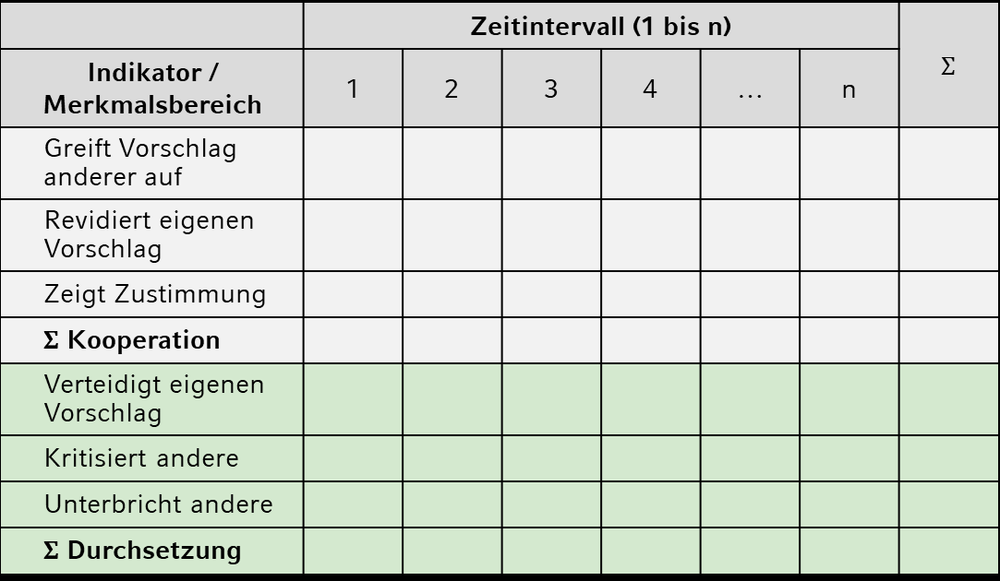

```{r setup, include=FALSE}
options(htmltools.dir.version = FALSE)

library(tidyverse)
library(kableExtra)
library(ggplot2)
library(plotly)
library(htmlwidgets)
library(MASS)
library(ggpubr)
library(xaringanthemer)
library(xaringanExtra)

style_duo_accent(
  primary_color = "#621C37",
  secondary_color = "#EE0071",
  background_image = "blank.png"
)

xaringanExtra::use_xaringan_extra(c("tile_view"))

use_scribble(
  pen_color = "#EE0071",
  pen_size = 4
  )

knitr::opts_chunk$set(
  fig.retina = TRUE,
  warning = FALSE,
  message = FALSE
)

# library(RefManageR)
# BibOptions(
# check.entries = FALSE, 
# bib.style = "authoryear", 
# cite.style = "authoryear", 
# style = "markdown",
# hyperlink = FALSE, 
# dashed = FALSE)
# myBib = ReadBib("/Users/stephangoerigk/Desktop/Universität/CFH/Lehre/Bachelor/Einführung in die Forschungsmethoden der Psychologie und Psychotherapie/EFPP_Folien/myBib.bib")
```

name: Title slide
class: middle, left
<br><br><br><br><br><br><br>
# Einführung in die Forschungsmethoden der Psychologie und Psychotherapie

### Einheit 4: Messen in der Psychologie - manifest
##### 17.11.2023 | Dr. Caroline Zygar-Hoffmann

---
class: top, left
### Hinweise zur Vorlesung und Prüfung

**Zum Tempo**

  * Mir ist es wichtig, den besprochenen Themen und Fragen ausreichend Raum zu geben, weshalb ich Inhalte auch gerne in die nächste Sitzung verschiebe, falls nötig.
  
  * Gleichzeitig haben wir ein gewisses inhaltliches Pensum vor uns, das mit dieser Vorlesung abgedeckt werden muss (und ich weiß, dass das mehr ist als Sie vmtl. aus der Schule gewohnt sind). Aus diesem Grund bevorzuge ich es bei wenigen restlichen Folien einer Sitzung, diese "verkürzt" zu besprechen - mit dem damit verbundenen Angebot offene Fragen in der darauffolgenden Sitzung zu klären.
  
  * Hier müssen Sie aktiv werden: Sagen Sie Bescheid, wenn der Bedarf für mehr Wiederholung und/oder Zusammenfassung aufkommt, z.B. zu diesen "schnelleren" Phasen gegen Ende einer Vorlesung (auch am Anfang der nächsten Sitzung!), aber auch mittendrin während der Vorlesung.
  
  * Ich versuche genügend Raum und Ruhe für Wiederholungen/Zusammenfassungen/Fragemöglichkeiten zu schaffen, aber scheuen Sie sich nicht sich auch zwischendrin zu melden.
  
**Nochmal der Aufruf: Bleiben Sie am Ball und schieben Sie das Lernen nicht bis zum Schluss kurz vor der Prüfung auf. Machen Sie die Quizzes, fassen Sie wichtige Erkentnisse und Inhalte einer Vorlesung in eigenen Worten zusammen. Dann merken Sie auch, wo es noch Fragebedarf gibt.**

---
class: top, left
### Hinweise zur Vorlesung und Prüfung

**Zum Inhalt**

* Es ist natürlich ärgerlich, wenn während der Vorlesung Verwirrung zu einem bestimmten Inhalt entsteht.

* Zur operanten Konditionierung habe ich daher nochmal Übungsaufgaben auf studynet hochgeladen.

* Sie sollten nach Bearbeitung der Übungsaufgaben die richtigen Antworten einsehen können und mit Ihren eigenen Antworten vergleichen können.

* Generell ist es mir wichtig Unklarheiten solcher Art durch nachträgliche Ergänzungen aus dem Weg zu räumen - falls ich also nicht merke, dass eine Unklarheit im Raum steht müssen Sie auch hier aktiv werden.

---
class: top, left
### Hinweise zur Vorlesung und Prüfung

**Zum Prüfungsstoff**

.pull-left[
Prinzipiell sind alle Folien erstmal prüfungsrelevant.
* Ja, da steht viel drauf, aber das dient Ihnen auch als Lern- und Verständnishilfe. Stellen Sie sich den Kontrast vor, wenn auf den Folien nur Bilder wären (und Sie sich alles aus Mündlichem/Zusatzliteratur zusammensammeln müssten)
* Ich merke mir, welche Themen ich mehr oder weniger ausführlich behandelt habe. Das entbindet die weniger ausführlich behandelten Themen nicht von der Prüfungsrelevanz, aber es gibt Ihnen Hinweise darauf, für welche Themen ein tieferes Verständnis wichtig ist
* Vom Gesamtumfang orientiere ich mich stark an dem was Stephan Goerigk in den letzten Semestern gemacht hat (und habe sogar eine inhaltliche Vorlesungseinheit komplett weggelassen), und dies wiederrum orientiert sich am Modulhandbuch
]

.pull-right[
Bestimmte Details sind nicht prüfungsrelevant:
* Details zu veranschaulichenden Beispielen (z.B. einzelne Biases aus der Übersicht über alle Biases aus der ersten Vorlesungssitzung; wie genau Fechners Gesetz funktioniert; einzelne Stadieninhalte von Piaget's Entwicklungsstadien)
* Jahreszahlen zu Lebenszeiten, wörtliche Zitate, Quellenangaben
* Lateinische Originalbegriffe, wenn eine deutsche Übersetzung dasteht (z.B. bei Bacons Idolenlehre)
* Literatur-, Video- oder Podcasthinweise: Sie müssen sich kein zusätzliches Wissen aneignen, wenn Sie verstehen, was ich während der Vorlesung zu den Folien erzähle
]

---
class: top, left
### Hinweise zur Vorlesung und Prüfung

**Zum Prüfungsstoff**

Rufen Sie sich das Thema der Vorlesung vor Augen:
* Sie sollen hier nicht detailliertes inhaltliches Wissen über konkrete psychologische Subdiszipilinen erhalten (dafür werden Sie in jeder Subdisziplin eine eigene Vorlesung besuchen).

* Stattdessen sollen Sie in der Lage sein zu erklären, ...
  * wie die Psychologie als Wissenschaft entstanden ist
  * welche Positionen zu wissenschaftlicher Erkenntnis es gibt
  * welche Perspektiven es auf die Psychologie gibt
  * mit welchen Erhebungs- und Forschungsmethoden die psychologische Wissenschaft arbeitet
  * wie Sie wissenschaftliche Forschung betreiben und beurteilen können

$\rightarrow$ Sie hören bei mir eine Methodenvorlesung, die ich inhaltlich veranschaulichen möchte. 

---
class: top, left
<div class="footer"><span>Schmidt-Atzert, L., & Amelang, M. (2012). Psychologische Diagnostik. Springer Science & Business Media.</div>

### (Verhaltens-)beobachtung

#### Alltagsbeobachtung vs. wissenschaftliche Beobachtung

**Definition wissenschaftliche Beobachtung:** Zielgerichtete, systematische und regelgeleitete Erfassung, Dokumentation und Interpretation des Auftretens bzw. der Ausprägung von ausgewählten, psychologisch relevanten Merkmalen, Verhalten oder Ereignissen

.center[
"*Verhaltensbeobachtung liefert im Idealfall Fakten, die frei von Bewertungen sind.*" 
(Schmidt-Atzert & Amelang, 2012, S.309)
]

* Diese Zielsetzung impliziert eine wichtige Unterscheidung zwischen Beobachtung vs.
Beurteilung

* Wahrnehmung (bzw. Beobachtung), Registrierung (bzw. Protokollierung) und Beurteilung sollten im Prozess der Verhaltensbeobachtung getrennt vorgenommen werden

* Eine gute Wahrnehmung und Registrierung setzt voraus, dass genau definiert wird, was und wie etwas beobachtet (und später beurteilt) werden soll

---
class: top, left
name: beobachtungsplan

### (Verhaltens-)beobachtung

#### Beobachtungsplan

**Wissenschaftliche Beobachtung nach a priori festgelegtem Beobachtungsplan**:

1. Was soll beobachtet werden?  (Kategorien für das/die interessierende/n Ereignis/se oder Merkmal/e)

2. Wer beobachtet?  (teilnehmend vs. nicht-teilnehmend)

3. Wo wird beobachtet?  (Feld vs. Labor)

4. Wie wird beobachtet? (Grad der Strukturierung)

5. Wann wird beobachtet?  (Zeitpunkte, Zeiträume, Situationen, gleichzeitige vs. zeitversetzte Registrierung)

6. Auf welche Weise wird das Beobachtete registriert, protokolliert, interpretiert?


---
class: top, left

### (Verhaltens-)beobachtung

#### Beobachtungsplan

##### Beobachtungseinheiten

**Was wird beobachtet? - Definition von Beobachtungseinheiten:**

* Abgrenzung des Beobachtungsobjekts: z.B. einzelne Personen vs. Famile vs. Paare...

* Abgrenzung der Variablen / Verhaltensmerkmale: umfassendes Bild vs. einzelnes Merkmal

* Abgrenzung der Dauer der Beobachtung: kurz/einmalig vs. lang/wiederholt

* Definition von Anfang, Ende und Inhalt einer Beobachtungseinheit (**Indikator**):

  * Wann beginnt / endet ein Verhalten, das einen Hinweis auf das Verhaltensmerkmal gibt?
  
  * Welches Verhalten gibt Hinweis auf Verhaltensmerkmal?

---
class: top, left
### (Verhaltens-)beobachtung

#### Beobachtungsplan

##### Beobachtungseinheiten

**Was wird beobachtet? -  Kriterien für gute Beobachtungseinheiten:**

.pull-left[
* Alle Beobachter verstehen unter den Beobachtungseinheiten dasselbe $\rightarrow$ verhaltensnah, konkret bzw. genau definiert (Objektivität)

* Beobachtungseinheiten können klar voneinander **abgegrenzt** werden („unterbricht andere“ vs. „redet dazwischen“) (Objektivität)

* Das beschriebene Verhalten **kommt** in der Beobachtungssituation **vor** (Beachtung der Situationsabhängigkeit für Validität der Messung)
]

.pull-right[
* Jede Beobachter:in kann Beobachtungseinheit **zuverlässig identifizieren** (Reliabilität).

* Liste der Verhaltensweisen kann von Beobachtenden während der Beobachtung **überblickt** werden (Reliabilität). **Grenzwerte** für Beobachtende: max. 3 Eigenschaften, max. 10  Einzelverhaltensweisen, max. 20 Minuten pro Beobachtung (abhängig von Erfahrung der Beobachter:in)

* Zu beobachtendes Merkmal wird von Beobachtungseinheiten in **allen Facetten** erfasst (Inhaltsvalidität).
]

**Tipp:** Beobachtungsplan in einem „Probedurchgang“ testen


---
class: top, left
### (Verhaltens-)beobachtung

#### Beobachtungsplan

##### Beobachtungseinheiten

**Kategoriesystem:** Gliederung des beobachtbaren Verhaltens in Kategorien

**Beispiel: Aggressives Verhalten von Kindergartenkindern**

1. schlägt, tritt
2. schlägt zurück
3. wirft mit Gegenstand
4. wirft mit Gegenstand zurück
5. droht, beschimpft
6. droht, schimpft zurück
7. zerstört beim Partner
8. zerstört Eigenes
9. zerstört beim Partner als Reaktion
10. zerstört Eigenes als Reaktion

---
class: top, left
### (Verhaltens-)beobachtung

#### Beobachtungsplan

##### Formen und Rahmenbedingungen für Beobachtungen

**Wer beobachtet? -  Teilnehmende vs. nicht-teilnehmende Beobachtung:**

Aktiv-teilnehmende Beobachtung vs. passiv-teilnehmende Beobachtung
+ keine Geräte für Beobachtung notwendig
+ bei passiv-teilnehmender Beobachtung: stummer Beobachter
+ bei aktiv-teilnehmender Beobachtung: Beobachter Teil der Situation $\rightarrow$ "natürliche" Situation möglich

Nicht-teilnehmende Beobachtung: 
+ Beobachtende sind in der Situation nicht anwesend bzw. werden von Beobachtetem nicht gesehen, z.B. per Kamera
+ Situation wird nicht so stark verändert

---
class: top, left
<div class="footer"><span>Ainsworth, M.D.S. & Wittig, B.A. (1969). Attachment and the exploratory behavior of one-year-olds in a strange situation. Hillsdale, NJ: Erlbaum. <br> Mischel, W., Shoda, Y., & Rodriguez, M. L. (1989). Delay of gratification in children. Science, 244(4907), 933-938.</div>

### (Verhaltens-)beobachtung

#### Beobachtungsplan

##### Formen und Rahmenbedingungen für Beobachtungen

**Wo wird beobachtet? - Feld- vs. Laborbeobachtung:**

.pull-left[
Bei Beobachtung im Feld wird in der „natürlichen” Situation beobachtet
+ Situation ist „echt”
+ höhere **ökologische Validität** (Übertragbarkeit auf echtes Verhalten)

Bei Beobachtung im Labor wird in einer „künstlich erzeugten” Situation beobachtet. Rahmen- bedingungen und Aufgaben sind genau geplant
+ Kontrolle von Störfaktoren
+ höhere Vergleichbarkeit
]

.pull-right[
Beispiele für Laborbeobachtungen: 
  * Fremde-Situations-Test zum Bindungsverhalten von Kindern, mit klarem Ablauf wann Bezugsperson den Raum verlässt, fremde Person hinzukommt etc. (Ainsworth & Wittig, 1969)
  * Bandura's Bobo Doll ([**Link**](https://www.youtube.com/watch?v=dmBqwWlJg8U&t=11s)), eine der wichtigsten Studien zum Beobachtungslernen aka Modell-Lernen (vgl. letzte Einheit)
  * Das Marshmallow Experiment (Mischel, 1989) ([**Link**](https://www.youtube.com/watch?v=QX_oy9614HQ)): Experiment zum Belohnungsaufschub und zur Impulskontrolle
]

---
class: top, left
### (Verhaltens-)beobachtung

#### Beobachtungsplan

##### Formen und Rahmenbedingungen für Beobachtungen

**Wann wird beobachtet? - Direkte (gleichzeitige) vs. indirekte (zeitversetzte) Beobachtung:**

Direkte Beobachtung: Verhalten wird direkt zum Zeitpunkt des Auftretens beobachtet (setzt verhaltensnahe Beobachtung voraus)
+ zielgerichtete Wahrnehmung auf bestimmte Aspekte der Situation durch Repositionierung des Beobachters oder Repositionierung einer Kamera möglich

Indirekte Beobachtung: zeitversetzte „Beobachtung”
+ z.B. nachträgliche Verhaltensbeobachtung von auf Video aufgezeichnetem Verhalten
+ längere Verhaltensausschnitte möglich
+ hierunter kann auch eine Dokumentenanalyse fallen, zur Beobachtung von Verhaltensspuren in jeglicher Art von untersuchbarem Material (von Akten über Briefen bis zu Fotos)

---
class: top, left
<div class="footer"><span>Haney, C., Banks, W.C. & Zimbardo, P.G. (1973). A study of prisoners and guards in a simulated prison. Naval Re-search Review, 30, 4–17. <br> Zimbardo, P. & Haney, C. (2008). Stanford prison experi-ment. In B.L. Cutler (Ed.), Encyclopedia of psychology and law (pp.756–757). Thousand Oaks, CA: Sage. <br> Le Texier, T. (2019). Debunking the stanford prison experiment. American Psychologist, 74(7), 823.</div>

### (Verhaltens-)beobachtung

#### Beobachtungsplan

##### Formen und Rahmenbedingungen für Beobachtungen

**Wie wird beobachtet? - Strukturierte vs. unstrukturierte Beobachtung:**

Strukturierte Beobachtung wird anhand eines vorher festgelegten Beobachtungsplans durchgeführt
+ höhere Objektivität und Reliabilität
+ Quantifizierung des beobachteten Verhaltens möglich

Unstrukturierte Beobachtung findet ohne genauen Beobachtungsplan statt
+ exploratives Vorgehen wenn zu wenig Informationen zur Erstellung eines Beobachtungsplans vorliegen
+ Beispiel: Stanford Prison Experiment (Haney et al., 1973; Zimbardo & Haney, 2008; welches aber aus heutiger Perspektive wegen methodischer Mängel stark kritisiert wird, vgl. Le Texier, 2019)

---
class: top, left
### (Verhaltens-)beobachtung

#### Beobachtungsplan

##### Formen und Rahmenbedingungen für Beobachtungen

**Wie wird Beobachtung registriert? - Vermittelte vs. unvermittelte Beobachtung:**

Vermittelte Beobachtung: Verhalten wird aufgezeichnet und beobachtet direkt oder indirekt
+ Fehlerminimierung durch wiederholtes Abspielen

Unvermittelte Beobachtung: eine Person beobachtet direkt
+ unaufwändiger weil keine Geräte notwendig 
+ in allen Situationen möglich

---
class: top, left
### (Verhaltens-)beobachtung

#### Beobachtungsplan

##### Formen und Rahmenbedingungen für Beobachtungen

**Wie wird Beobachtung registriert? - Time vs. Event Sampling**

.pull-left[
**Event Sampling:**

Registrierung von Häufigkeit und/oder Dauer des Verhaltens- oder Situationsmerkmals über den gesamten Beobachtungszeitraum hinweg
  * es werden eher auch seltene Ereignisse erfasst, weil es keine Unterbrechungen gibt
  * erlaubt Überprüfung von Hypothesen zum Zusammenhang aufeinanderfolgender Ereignisse (Kontingenz)
]

.pull-right[
**Time Sampling** (Spezialfall des event sampling):

  * Unterteilung des Beobachtungszeitraums in gleich lange Zeitintervalle
  * Registrierung ob Verhaltensmerkmal im Zeitintervall gezeigt wird
  * Möglichkeit, Pausen einzubauen (z.B. nur in jedem 2. Zeitintervall beobachten)
  * Beobachterrotation möglich (z.B. Beobachter:in 1 im 1. Zeitintervall,  Beobachter:in 2 im 2. Zeitintervall)
  * oft akustischer oder vibrierender Signalgeber notwendig
]

---
class: top, left
### (Verhaltens-)beobachtung

#### Beobachtungsplan

##### Formen und Rahmenbedingungen für Beobachtungen

**Wie wird Beobachtung registriert? - Beispiel für Time Sampling**

```{r eval = TRUE, echo = F, out.width="50%"}

```

---
class: top, left
### (Verhaltens-)beobachtung

#### Beobachtungsplan

##### Formen und Rahmenbedingungen für Beobachtungen

**Wie wird Beobachtung beurteilt? - Konstruktion von Ratingskalen**

* unipolare vs. bipolare Skala
* Anzahl der Abstufungen: abhängig von Differenzierungsfähigkeit der Beobachter:in und Variation des Merkmals
* Je mehr Merkmale zu beurteilen sind, desto geringer sollte die Anzahl an Stufen sein
* Markierung und verbale Verankerung der Skalen: um Abstufungen der Skalen deutlich zu machen, werden diese numerisch/grafisch markiert oder verbal verankert.

.pull-left[

**unipolar:** 

|-------------| feindselig

**bipolar:**  

freundlich |-------------| feindselig

]

.pull-right[
**numerisch verankert:** 

 0 - 1 - 2 - 3

**verbal verankert:**  
 
 sehr niedrig - eher niedrig - eher hoch - sehr hoch
]

---
class: top, left
### (Verhaltens-)beobachtung

#### Beobachtungsplan

##### Formen und Rahmenbedingungen für Beobachtungen

**Wie wird Beobachtung beurteilt? - Konstruktion von Ratingskalen**

* Ratingskalen für eine Verhaltensbeobachtung sollten zusätzlich grundsätzlich mit Verhaltensankern ergänzt werden $\rightarrow$ **verhaltensverankerte Ratingsskala**

```{r eval = TRUE, echo = F, out.width = "50%"}
knitr::include_graphics("bilder/Verhaltensverankerung.png")
```

* Alternativ braucht es klare Regeln zur Zuordnung zwischen den beobachteten Indikatoren und der Zuordnung auf der Ratingskala


---
class: top, left
name: fehler

### (Verhaltens-)beobachtung

#### Beobachtungsfehler und -verzerrungen (Beispiele)

```{r echo = F}

df = data.frame(Beobachtungsfehler = c("Beobachterdrift",
                                       "Erinnerungseffekte",
                                       "Haloeffekt",
                                       "Logischer Fehler",
                                       "Primacy Effekt",
                                       "Recency Effekt",
                                       "Mildeeffekt",
                                       "Strengeeffekt",
                                       "Zentrale Tendenz",
                                       "Tendenz zu Extremurteilen",
                                       "Kontrasteffekt"),
                Beschreibung = c("Im Verlauf zunehmend weniger/mehr Auftreten registrieren, obwohl sich am Verhalten nichts verändert hat (oft wegen Ermüdung, mangelnder Übung)",
                                 "Verzerrungen, wenn nicht unmittelbar protokolliert wird",
                                 "Eine Eigenschaft einer Person wird durch eine andere Eigenschaft „überstrahlt“",
                                 "Von einem Hinweisreiz wird auf eine Eigenschaft geschlossen (obwohl kein Zusammenhang besteht)",
                                 "Überbetonung der esten Information",
                                 "Überbetonung der letzten Information",
                                 "Verzerrung zum Positiven",
                                 "Verzerrung zum Negativen",
                                 "Bevorzugung der Skalenmitte (häufig wegen Unsicherheit beim Beurteilen)",
                                 "Bevorzugung der Skalenpole",
                                 "Einschätzung einer Person hängt von jener der zuvor eingeschätzten Person ab"))

df %>%
  kbl() %>%
  kable_styling(font_size = 15) %>%
  kable_classic(full_width = T)
```

---
class: top, left
### (Verhaltens-)beobachtung

#### Verringern von Beobachtungsfehlern und -verzerrungen 

```{r echo = F}

df = data.frame(Maßnahmen = c("Grenzwerte",
                                       "Verhaltensnahe Beobachtung",
                                       "konkreter/eindeutiger Beobachtungsplan",
                                       "Beobachterschulung",
                                       "Beobachterrotation"
                               ),
                Beschreibung = c("Limit an zu beobachtenden Verhaltensmerkmalen und Beobachtungsdauer für BeobachterInnen",
                                 "Beobachtbare Einheiten, Vermeidung von Interpretation",
                                 "Missverständnisse vermeiden, klare Kategorien",
                                 "Vertrautmachen mit Protokollbogen, Definieren der Verhaltensmerkmale, Probedurchgänge",
                                 "verschiedene Beobachter:innen einsetzen; Versuchsperson in verschiedenen Situationen durch unterschiedliche Beobachter:innen beobachten"
                                ))

df %>%
  kbl() %>%
  kable_styling(font_size = 18) %>%
  kable_classic(full_width = T)
```

* auch bei Berücksichtigung von Maßnahmen sind systematische und unsystematische Beobachtungsfehler nicht auszuschließen

* bei jeder Verhaltensbeobachtung Beobachterübereinstimmung empirisch prüfen! 
* trotzdem: auch Beobachterübereinstimmung garantiert noch nicht, dass keine Beobachtungsfehler aufgetreten sind

* Mittelung über die Beobachtungen mehrerer Beobachter:innen verbessert die Reliabilität der Messung (da zumindest unsystematische Messfehler rausgemittelt werden)

---
class: top, left
name: beobachterübereinstimmung

### (Verhaltens-)beobachtung

#### Maße für die Beobachterübereinstimmung

* Um Beobachterübereinstimmung und Reliabilität einer Verhaltensbeobachtung zu bestimmen gibt es eine Vielzahl von Maßen

* Wahl des angemessenen Übereinstimmungs- bzw. Zuverlässigkeitsmaßes abhängig vom Skalenniveau der Daten

* Die wichtigsten Maße (lernen Sie in Diagnostik genauer kennen):
  * prozentuale Übereinstimmung
  * Cohen's Kappa oder Fleiss' Kappa (mindestens nominal)
  * Kendalls Konkordanzkoeffizient (mindestens ordinal)
  * Intra-Class-Korrelation (ICC) (metrisch)

---
class: top, left
### (Verhaltens-)beobachtung

#### Maße für die Beobachterübereinstimmung

Beispiel: nominales Urteil (ja/nein)

```{r echo = F}
df = data.frame(Vehalten = c("1. schlägt, tritt",
"2. schlägt zurück",
"3. wirft mit Gegenstand",
"4. wirft mit Gegenstand zurück",
"5. droht, beschimpft",
"6. droht, schimpft zurück",
"7. zerstört beim Partner",
"8. zerstört Eigenes",
"9. zerstört beim Partner als Reaktion",
"10. zerstört Eigenes als Reaktion"))

df$Rater1 = c("Ja", "Ja", "Nein", "Ja", "Ja", "Ja", "Nein", "Ja", "Nein", "Nein")
df$Rater2 = c("Nein", "Ja", "Nein", "Ja", "Ja", "Ja", "Ja", "Ja", "Nein", "Nein")

df %>%
  kbl() %>%
  kable_styling(font_size = 16) %>%
  kable_classic(full_width = T)
```

---
class: top, left
### (Verhaltens-)beobachtung

#### Maße für die Beobachterübereinstimmung

Beispiel: metrisches Urteil (Skala 1-6)

```{r echo = F}
df = data.frame(Vehalten = c("1. schlägt, tritt",
"2. schlägt zurück",
"3. wirft mit Gegenstand",
"4. wirft mit Gegenstand zurück",
"5. droht, beschimpft",
"6. droht, schimpft zurück",
"7. zerstört beim Partner",
"8. zerstört Eigenes",
"9. zerstört beim Partner als Reaktion",
"10. zerstört Eigenes als Reaktion"))

df$Rater1 = c(3, 3, 5, 1, 4, 1, 6, 5, 2, 1)
df$Rater2 = c(4, 2, 5, 2, 5, 1, 6, 3, 2, 1)

df %>%
  kbl() %>%
  kable_styling(font_size = 16) %>%
  kable_classic(full_width = T)
```

---
class: top, left
### (Verhaltens-)beobachtung

**Übungsaufgabe**:

* Überlegen Sie sich geeigenete Beobachtungseinheiten bei einer Event Sampling Beobachtung (wie oft wird Verhalten gezeigt) für **Werbungsverhalten von Säuglingen um die Aufmerksamkeit ihrer Eltern** (in der Beobachtungssituation sitzen die Säuglinge in einem Hochstuhl neben den Eltern)

[**Link zur Beobachtungssituation**](https://www.youtube.com/watch?v=YTTSXc6sARg)

Fragen zum realisierten Beobachtungsplan:

* teilnehmend vs. nicht-teilnehmend?

* Feld vs. Labor?

* Direkt vs. indirekt?

* Vermittelt vs. unvermittelt?

Überlegen Sie sich, inwiefern Sie die Hauptgütekritierien für Ihre Verhaltensbeobachtung erfüllt sehen.

---
class: top, left
name: take-away

### Take-Aways
.content-box-gray[

* **Hauptgütekriterien** für psychologische Erhebungen sind Objektivität, Reliabilität und Validität (je nach Autor auch Skalierbarkeit)

* **Objektivität:** Erhebung, Ergebnis und Interpretation unabhängig von Testleiter:in und Testauswerter:in

* **Reliabilität:** Messfehlerfreie und zuverlässige Erhebung des Merkmals

* **Validität:** Methode erhebt wirklich das interessierende Merkmal und nicht etwas anderes

* Wissenschaftliche Beobachtung erfolgt nach a priori festgelegtem **Beobachtungsplan**

* **Beobachtungsfehler und -verzerrungen** sollten möglichst bewusst vermieden werden

* Zur Bestimmung der Objektivität und Reliabilität von Beobachtungen können **Maße der Beobachterübereinstimmung** berechnet werden
]

**[zurück zur heutigen Übersicht der Vorlesung $\rightarrow$](#content)** 
<br>
**[zum Quiz zur Wissensprüfung $\rightarrow$](https://forms.gle/tBq8YwGDpHXuzjT56)**

<!-- library(renderthis)  -->
<!-- to_pdf("EinfForsch_04_Messen_Manifest_ReCap.Rmd", complex_slides = TRUE) -->
