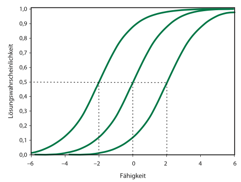

```{r setup, include=FALSE}
options(htmltools.dir.version = FALSE)

library(tidyverse)
library(kableExtra)
library(ggplot2)
library(plotly)
library(htmlwidgets)
library(MASS)
library(ggpubr)
library(xaringanthemer)
library(xaringanExtra)

style_duo_accent(
  primary_color = "#621C37",
  secondary_color = "#EE0071",
  background_image = "blank.png"
)

xaringanExtra::use_xaringan_extra(c("tile_view"))

use_scribble(
  pen_color = "#EE0071",
  pen_size = 4
  )

knitr::opts_chunk$set(
  fig.retina = TRUE,
  warning = FALSE,
  message = FALSE
)

# library(RefManageR)
# BibOptions(
# check.entries = FALSE, 
# bib.style = "authoryear", 
# cite.style = "authoryear", 
# style = "markdown",
# hyperlink = FALSE, 
# dashed = FALSE)
# myBib = ReadBib("/Users/stephangoerigk/Desktop/Universität/CFH/Lehre/Bachelor/Einführung in die Forschungsmethoden der Psychologie und Psychotherapie/EFPP_Folien/myBib.bib")
```

name: Title slide
class: middle, left
<br><br><br><br><br><br><br>
# Einführung in die Forschungsmethoden der Psychologie und Psychotherapie

### Einheit 5: Messen in der Psychologie - latent
##### 17.11.2023 | Dr. Caroline Zygar-Hoffmann


---
class: top, left
name: content
### Heutige Themen

#### Selbstberichtsverfahren: Befragung und Rating
* [Rahmenbedingungen](#intro)
* [Befragung](#befragung)
* [Ratings](#ratings)

#### Testverfahren
* [Merkmale](#merkmale)
* [Leistungstests](#leistungstests)
* [Persönlichkeitstests](#perstests)

#### Statistische Modellierung von Antwortprozessen
* [Klassische Testtheorie](#KTT)
* [Probabilistische Testtheorie](#IRT)

#### [Take-Aways](#take-away)

---
class: top, left
### Literatur für die heutige Sitzung

.pull-left[
```{r, echo=FALSE,out.width="50%",fig.cap="Kapitel 8.4.4. in Döring, N. & Bortz, J. (2016). Forschungsmethoden und Evaluation in den Sozial- und Humanwissenschaften. Pearson.",fig.show='hold',fig.align='center'}
knitr::include_graphics("bilder/doering.png")
``` 
]

.pull-right[
```{r, echo=FALSE,out.width="50%",fig.cap="Kapitel 2.2.1. in Schmidt-Atzert, L., Krumm, S. & Amelang, M. (2021). Psychologische Diagnostik. Springer.",fig.show='hold',fig.align='center'}
knitr::include_graphics("bilder/schmidt-atzert.png")
``` 
]

**Materialien:** Vielen Dank an Prof. Dr. Stephan Goerigk für Bereitstellung der Grundlage für die Materialien

---
class: top, left
name: intro
<div class="footer"><span>Echterhoff, G. (2013). Quantitative Erhebungsmethoden. In W. Hussy, M. Schreier & G. Echterhoff (Hrsg.). Forschungsmethoden in Psychologie und Sozialwissenschaften für Bachelor (S.71-90). Springer. </div>

### Selbstberichtsverfahren: Befragung und Rating

#### Rahmenbedingungen

Idee: Die Befragung ermöglicht einen Zugang zu psychischen Prozessen, Strukturen und Merkmalen, auch solchen die nicht direkt beobachtbar (nicht manifest) sind, also nicht sichtbar (d.h. latent)

**Drei Voraussetzungen:**

1. Untersuchte Personen müssen **Zugang** zu den interessierenden psychischen Prozessen haben

2. Untersuchte Personen müssen interessierende psychische Prozesse **kommunizieren** können

3. Selbstauskünfte von Untersuchungsteilnehmer:innen müssen hinreichend **reliabel und valide** sein

Selbstauskünfte in Befragungen beinhalten **drei elementare kognitive bzw. mentale Prozesse**:

1. Interpretation der Frage
2. Bildung eines Urteils
3. Übersetzung in eine kommunizierte Auskunft

---
class: top, left
<div class="footer"><span>Echterhoff, G. (2013). Quantitative Erhebungsmethoden. In W. Hussy, M. Schreier & G. Echterhoff (Hrsg.). Forschungsmethoden in Psychologie und Sozialwissenschaften für Bachelor (S.71-90). Springer. </div>

### Selbstberichtsverfahren: Befragung und Rating

#### Rahmenbedingungen

**Wie werden Selbstberichte kommuniziert?**

.pull-left[
* Selbstbericht = Akt der Kommunikation
* Person teilt sich bewusst mit (wendet sich an einen oder mehrere Adressaten)
* Menschliche Kommunikation = Informationen + Absicht des Senders

$\rightarrow$ Einfluss auf die Validität: Was messe ich eigentlich? (z.B. ist ein Rückschluss auf das Merkmal basierend auf der gegebenen Information ggf. verzerrt, wenn sozial erwünschter geantwortet wird)

$\rightarrow$ Beispiel 4-Seiten-Modell (F. Schulz von Thun): Oft ist man als Forscher daran interessiert, die Absicht des Senders auf die "Selbstkundgabe" zu richten
]

.pull-right[
.center[
```{r eval = TRUE, echo = F, out.width = "450px"}
knitr::include_graphics("bilder/thun.png")
```
```{r eval = TRUE, echo = F, out.width = "450px"}
knitr::include_graphics("bilder/ohren.png")
```
]
]

---
class: top, left
name: befragung

### Selbstberichtsverfahren: Befragung und Rating

#### Befragung - Varianten und Prinzipien der Konstruktion

* **Schriftliche** (Fragebogen) vs. **mündliche** Befragung (Interview)

* **Standardisierte** vs. **nichtstandardisierte** Befragung $\rightarrow$ relevant für Auswertungs- und Interpretationsobjektivität
  * Standardisiert: Antwortmöglichkeiten vorgegeben (geschlossene Fragen)
  * Nichtstandardisiert: Befragte Person kann Antwort in ihren eigenen Worten formulieren (offene Fragen)

* **Strukturierte** vs. **unstrukturierte** Befragung $\rightarrow$ relevant für Durchführungsobjektivität
  * Strukturiert: Wortlaut und Reihenfolge der Fragen bzw. Items genau vorgegeben
  * Halbstrukturiert: Leitfaden mit vorformulierten Fragen zur Orientierung
  * Unstrukturiert: Keine Vorgaben hinsichtlich Frageformulierung und Reihenfolge der Items

* **Anzahl** der befragten Personen
  * Einzelbefragung (1 Person)
  * Gruppenbefragung (kleine Gruppe)
  * Survey (Umfrage mit großer Zahl an Befragten, wobei i.d.R. jede Person einzeln befragt wird)

---
class: top, left
### Selbstberichtsverfahren: Befragung und Rating

#### Befragung - Varianten und Prinzipien der Konstruktion

**Unterschiede zwischen schriftlicher und mündlicher Befragung**

* Konstruktion schriftlicher Befragungen erfordert mehr Vorwissen (Interview = explorativer)

* Bei schriftlichen Befragungen ist das Reaktivitätsproblem geringer (der face-to-face-Kontakt bei Interviews kann Beeinflussungseffekte haben und Mitteilungsabsichten können stärker ausgeprägt sein)

* Befragte äußern sich bisweilen eher und ausführlicher in mündlichen Befragungen, Mitteilungsabsichten können erörtert werden

* Interviews i.d.R. aufwändiger und kostenintensiver

$\rightarrow$ Entscheidung nach Forschungsziel und Ressourcenverfügbarkeit


---
class: top, left
### Selbstberichtsverfahren: Befragung und Rating

#### Befragung - Varianten und Prinzipien der Konstruktion

##### Beispielthema: Warum sind Liebesbeziehungen oft nicht von Dauer?

**Beispiel: Vollstrukturierte Befragung**

1. Was kennzeichnet für Sie eine dauerhafte, funktionierende Beziehung?

   <input type="checkbox" unchecked> Offenheit</input> 
   <input type="checkbox" unchecked> Freiräume</input> 
   <input type="checkbox" unchecked> Verlässlichkeit</input> 
   <input type="checkbox" unchecked> gemeinsame Interessen</input> 
    <input type="checkbox" unchecked> Kompromissbereitschaft</input> 

2. Woran scheitern Ihrer Meinung nach viele Beziehungen?

  <input type="checkbox" unchecked> Untreue</input> 
   <input type="checkbox" unchecked> zu wenig Kommunikation</input> 
   <input type="checkbox" unchecked> Monotonie</input> 
   <input type="checkbox" unchecked> Erwartungsverletzungen</input> 
    <input type="checkbox" unchecked> Verwandtschaft</input> 

3. ...

---
class: top, left
### Selbstberichtsverfahren: Befragung und Rating

#### Befragung - Varianten und Prinzipien der Konstruktion

##### Beispielthema: Warum sind Liebesbeziehungen oft nicht von Dauer?

**Beispiel: Unstrukturiertes ("offenes") Interview**

**Einstiegsfrage:** 

Denken Sie an ein Ihnen bekanntes Paar, das sich getrennt hat. Erzählen Sie mir, was Ihnen in der Zeit vor der Trennung aufgefallen ist (bzw. wie Sie sich in der Gegenwart des Paares gefühlt haben).

**Potentielle Nachfragen (auch Verständnisfragen erlaubt):**

* Beschreiben Sie eine Streitstituation des Ihnen bekannten Paares. 
* Was hat Ihrer Meinung nach zur Trennung des Paares geführt?
* Was hätten die Betroffenen Ihrer Meinung nach tun können, um die Trennung zu verhindern?

---
class: top, left
<div class="footer"><span>Pelham, B. W., & Blanton, H. (2007). Conducting research in psychology. Measuring the Weight of Smoke. SAGE.</div>


### Selbstberichtsverfahren: Befragung und Rating

#### Befragung - Varianten und Prinzipien der Konstruktion

Meist Formulierung des Items als Frage oder Aussage (manchmal auch einfach nur ein zu beurteilendes Adjektiv); zeitlicher Bezug kann variieren (z.B. "im Moment" vs. "im letzten Monat", vs. "im Allgemeinen")

**Tipps zur Formulierung von Fragenbogenitems**

Ein guter Fragebogen ist gekennzeichnet durch (Pelham und Blanton, 2007):

* einfache Formulierung und gute Verständlichkeit
* keine zu hohen Anforderungen an die mentale oder kognitive Leistungsfähigkeit der Befragten
* adressatenorientierte Formulierung
* keine (doppelten) Verneinungen in den Fragen
* keine überfrachteten Fragen
* keine »Forced Choice« Antworten bei unabhängig beantwortbaren Aspekten (z.B. "Sind Sie eher gewissenhaft oder offen?" $\rightarrow$ schließt sich nicht aus!)
* keine Fragen, die sehr ähnlich klingen
* Einsatz mehrerer Items zur Messung eines Konstrukts
* Beachtung der Ausgewogenheit in der Reihenfolge der Fragen
* eine klare und informative Instruktion

---
class: top, left
name: ratings

### Selbstberichtsverfahren: Befragung und Rating

#### Ratings: Beurteilungen auf Skalen

Ratingskalen sind ein sehr häufiges Format in schriftlichen Befragungen:

* Beurteilung von Aspekten eines bestimmten Merkmals auf einer Skala

* Geben gleich große, georgnete, markierte Abschnitte des Merkmalskontinuums vor

* Personen sollen diejenige Stufe der Ratingskala ankreuzen, die persönlicher Auffassung am ehesten entspricht

**Gründe für Beliebtheit in Psychologie:**
1. liefern vergleichsweise direkt quantitative (in Zahlen übersetzte und damit statistisch auswertbare) Daten
2. unterteilen die Merkmalsausprägungen in gleich große Abschnitte $\rightarrow$ legen datenanalytisch günstiges Skalenniveau (Intervallskalenniveau) nahe

**Vorsicht:** Intervallskalenniveau ist nicht genuin aus dem Format der Skala, sondern nur inhaltlich (psychologisch/empirisch) zu begründen (wird aber i.d.R. bei Ratingskalen akzeptiert)

---
class: top, left
### Selbstberichtsverfahren: Befragung und Rating

#### Ratings: Beurteilungen auf Skalen

##### Aspekte bei der Konstruktion von Ratingskalen

**Verwendung unipolarer oder bipolarer Endpunkte**

.pull-left[
```{r, echo=FALSE,out.width = "60%", fig.show='hold',fig.align='center'}
knitr::include_graphics("bilder/unipolar.png")
``` 
]

.pull-right[
```{r, echo=FALSE,out.width = "80%", fig.show='hold', fig.align='center'}
knitr::include_graphics("bilder/bipolar.png")
``` 
]

.center[
Döring & Bortz (2016), S.256
]


---
class: top, left
### Selbstberichtsverfahren: Befragung und Rating

#### Ratings: Beurteilungen auf Skalen

##### Aspekte bei der Konstruktion von Ratingskalen

**Verwendung unipolarer oder bipolarer Endpunkte**

  * Vorteil bipolare Skalen:  Begriffe an den Endpunkten der Skala definieren einander wechselseitig 
  * Wann unipolare Skalen? 
  
    $\rightarrow$ wenn der Gegensatz eines Begriffs unklar ist (z. B. bei "schüchtern"); das ist häufig der Fall, daher sind unipolare Skalen auch häufiger
    
    $\rightarrow$ zur Beurteilung von Merkmalen mit einem natürlichen Nullpunkt (z.B. bei Abfragen von Häufigkeiten)

---
class: top, left
<div class="footer"><span>Revilla, M. A., Saris, W. E., & Krosnick, J. A. (2014). Choosing the number of categories in agree–disagree scales. Sociological methods & research, 43(1), 73-97. <br> Preston, C. C., & Colman, A. M. (2000). Optimal number of response categories in rating scales: reliability, validity, discriminating power, and respondent preferences. Acta psychologica, 104(1), 1-15.</div>

### Selbstberichtsverfahren: Befragung und Rating

#### Ratings: Beurteilungen auf Skalen

##### Aspekte bei der Konstruktion von Ratingskalen

**Abstufung der Skala**

1. Geringe vs. hohe Anzahl der Stufen

  * Problem geringe Anzahl: relevante Unterschiede zwischen verschiedenen Beurteilungen nicht abbildbar
  * Problem hohe Anzahl: Differenziertheit des Urteils nicht mehr möglich?
  * In der Praxis i.d.R. 4- bis 9-stufige Ratingskalen, wobei es empirische Befunde gibt, dass die Reliabilität bei 5 (Revilla et al., 2014) bis 7 Stufen (Preston & Coleman, 2000) besonders gut ist

2. Gerade vs. ungerade Anzahl von Stufen

  * Gerade Anzahl: Urteil in Richtung des einen oder anderen Pols der Skala wird erzwungen
  * Ungerade Anzahl: Mittelkategorie vorhanden, d.h. neutrale Urteilsmöglichkeit verfügbar
  * Problem neutrales Urteil: nicht eindeutig interpretierbar (**Ambivalenz-Indifferenz-Problem**) $\rightarrow$ ggf. sinnvoll eine weitere Antwortoption neben der Mittelkategorie zur Angabe von Meinungslosigkeit zu ermöglichen (z.B. "ich weiß es nicht", "keine Meinung", "keine Angabe")

---
class: top, left
<div class="footer"><span>Willems, S., Albers, C., & Smeets, I. (2020). Variability in the interpretation of probability phrases used in Dutch news articles—a risk for miscommunication. Journal of Science Communication, 19(2).</div>

### Selbstberichtsverfahren: Befragung und Rating

#### Ratings: Beurteilungen auf Skalen

##### Aspekte bei der Konstruktion von Ratingskalen

.pull-left[
**Bezeichnung der Abstufungen einer Skala**

Zahlen (numerische Marker)
* Vorteil: Stufen sind eindeutig
* Vorteil: Abstände zwischen den Stufen der Ratingskala sind gleich 

Wörter (verbale Marker) oder sprachfreie Zeichen (grafische Marker, z.B. Smileys oder Frownies)
* Vorteil: leichter verständlich (forschungssnaive Personen, Kinder)
* Nachteil: Verständnis variiert, gleicher Abstand zwischen den Stufen unklar
]

.pull-right[
.center[
```{r eval = TRUE, echo = F, out.width = "60%"}
knitr::include_graphics("bilder/verbale_anker.png")
```
]
]

---
class: top, left
<div class="footer"><span>Weijters, B., Cabooter, E., & Schillewaert, N. (2010). The effect of rating scale format on response styles: The number of response categories and response category labels. International Journal of Research in Marketing, 27(3), 236-247. <br> Saris, W. E., & Gallhofer, I. (2007). Estimation of the effects of measurement characteristics on the quality of survey questions. In Survey research methods (Vol. 1, No. 1, pp. 29-43).</div>

### Selbstberichtsverfahren: Befragung und Rating

#### Ratings: Beurteilungen auf Skalen

##### Probleme bei der Beantwortung von Ratingskalen

* **Antworttendenzen von Teilnehmer:innen**
  
  * **Tendenz zur Mitte**: Extremurteile werden vermieden (insbesondere wenn Skalen an den Endpunkten nicht verankert sind, d.h. die Extreme unklar bleiben)
  
  * **Extreme Antworttendenz**: Extremurteile werden bevorzugt
  
  * Antworttendenzen sind besonders ausgeprägt, wenn Urteilsobjekte wenig bekannt sind 
  
  * Gegenmaßnahme: Untersuchungsteilnehmer:innen hinreichend über zu beurteilende Objekte informieren, alle Antwortkategorien verbal beschriften (Weijters et al., 2010; führt zu auch zu höherer Reliabilität: Saris & Gallhofer, 2007)


---
class: top, left
### Selbstberichtsverfahren: Befragung und Rating

#### Ratings: Beurteilungen auf Skalen

##### Probleme bei der Beantwortung von Ratingskalen

.center[
```{r eval = TRUE, echo = F, out.width="75%", fig.cap="Döring & Bortz (2016), S.254"}
knitr::include_graphics("bilder/tendenz_zur_mitte.png")
```
]
---
class: top, left
<div class="footer"><span>Swain, S. D., Weathers, D., & Niedrich, R. W. (2008). Assessing three sources of misresponse to reversed Likert items. Journal of marketing research, 45(1), 116-131. <br> Weijters, B., & Baumgartner, H. (2012). Misresponse to reversed and negated items in surveys: A review. Journal of Marketing Research, 49(5), 737-747.</div>

### Selbstberichtsverfahren: Befragung und Rating

#### Ratings: Beurteilungen auf Skalen

##### Probleme bei der Beantwortung von Ratingskalen

* **Gedankenlose Reproduktion**

  * bei ähnlich erscheinenden Items nach erster Antwort bei folgenden Fragen den selben Wert angeben
  
  * Stellt Validität der Antworten in Frage
  
  * Gegenmaßnahme: Mischung von Fragen
  
  * Umpolung der Fragerichtung als alternative Gegenmaßnahme ist umstritten (Swain et al., 2008; Weijters & Baumgartner, 2012)

---
class: top, left
name: merkmale

### Testverfahren

#### Merkmale Psychologischer Test

* **Definition**: wissenschaftliches Routineverfahren zur Untersuchung eines oder mehrerer empirisch unterscheidbarer Merkmale

* **Ziel**: möglichst genaue quantitative Aussage über den relativen Grad der individuellen Merkmalsausprägung, v.a. zum Einsatz in psychologischer Diagnostik

* **Besteht in der Regel aus mehreren Aufgaben oder Fragen (Items)** $\rightarrow$ kann also auch ein Fragebogen sein ("Persönlichkeitstests"; ein Fragebogen wird meist erst dann als Test bezeichnet, wenn er in der Einzelfalldiagnostik eingesetzt werden kann und nicht nur in der Forschung, z.B. weil die Gütekriterien entsprechend gut sind und Normen vorliegen)

* Aufgaben/Fragen werden von Menschen mit unterschiedlichen Fähigkeiten oder Eigenschaften unterschiedlich gelöst/beantwortet

* Test = standardisierte Verhaltensstichprobe

* Testwert = Aggregation über die Einzelitems/-aufgaben des Tests

---
class: top, left
name: leistungstests

### Testverfahren

#### Leistungstests

* Leistungstests erfassen Merkmale im Hinblick auf einen objektiven Maßstab zur Beurteilung der Güte der Antworten

* Antworten können also »richtig« oder »falsch« sein

* Für Beantwortung sind kognitive Prozesse im weitesten Sinne und Leistungsmotivation entscheidend

* Um zwischen guten/schlechten Leistungen differenzieren zu können, müssen verschiedene Schwierigkeitsgrade realisiert sein

Beispiele:

* Intelligenztests

* Eignungstests

---
class: top, left
<div class="footer"><span>https://www.testzentrale.de/shop/test-d2-aufmerksamkeits-belastungs-test.html</div>

### Testverfahren

#### Leistungstests

**Speed-Tests**

* Bei Speed-Tests ist die Bearbeitungszeit zu knapp angesetzt

* Somit können in der Regel nicht alle Aufgaben bearbeitet werden

.pull-left[
Beispiel: d2-Aufmerksamkeits-Konzentrationstest von Brickenkamp (2002)

* Testpersonen bearbeiten eine große Zahl von Zeichen, nämlich die Buchstaben d und p, die jeweils mit bis zu vier kleinen Strichen umgeben sind

* Anzustreichen sind nur jene d, die zwei Striche oberhalb aufweisen
]

.pull-right[
```{r eval = TRUE, echo = F, out.width = "600px"}
knitr::include_graphics("bilder/d2.png")
```
]

---
class: top, left
<div class="footer"><span>https://www.testzentrale.de/shop/wechsler-adult-intelligence-scale-fourth-edition.html</div>

### Testverfahren

#### Leistungstests

**Power-Tests**

* Bei Power-Tests wird das Niveau der Aufgaben sukzessive gesteigert

* Adaptives Testverfahren, bis maximales Leistungsniveau gefunden ist

Beispiel: Wechsler-Intelligenz-Tests (HAWIE; seit 2013 WAIS-IV)

* HAWIE umfasst insgesamt 11 Untertests (Subskalen)

* Untertests sind Bereich der verbalen Intelligenz oder der Handlungsintelligenz zugeordnet

---
class: top, left
### Testverfahren

#### Leistungstests

**Power-Tests**

Beispiel: Wechsler-Intelligenz-Tests (HAWIE)

Verbalteil:

1. Allgemeines Wissen, z.B. »Was ist der Koran?«, »Wer erfand das Flugzeug?«

2. Zahlennachsprechen: Folgen von 3–9 Ziffern sind vorwärts und rückwärts nachzusprechen, z. B. »5-8-2« oder »4-2-7-3-1-8-2«

3. Wortschatz: »Was ist die Bedeutung von ...?« z. B. »anonym, Prestige, konkordant«

4. Rechnerisches Denken, z. B. »Ein Zug fährt 275 km in 5h. Wie groß ist seine Durchschnittsgeschwindigkeit in km/h?«

5. Allgemeines Verständnis, z. B. »Was bedeutet das Sprichwort‚ Stille Wasser sind tief’?«

---
class: top, left
### Testverfahren

#### Leistungstests

**Power-Tests**

Beispiel: Wechsler-Intelligenz-Tests (HAWIE)

Bilder ordnen: »Ordnen Sie die Bilder bitte so, dass sich die sinnvollste Geschichte ergibt!«, z. B.

<br><br>
.center[
```{r eval = TRUE, echo = F, out.width = "600px"}
knitr::include_graphics("bilder/hawie2.png")
```
]

---
class: top, left
### Testverfahren

#### Leistungstests

**Power-Tests**

Beispiel: Wechsler-Intelligenz-Tests (HAWIE)

Mosaik-Test: »Legen Sie die Würfel so zusammen, dass sie ein Muster zeigen, wie das auf der Karte«, z. B.

.center[
```{r eval = TRUE, echo = F, out.width = "400px"}
knitr::include_graphics("bilder/hawie4.png")
```
]

---
class: top, left
### Testverfahren

#### Leistungstests

**Power-Tests**

Beispiel: Wechsler-Intelligenz-Tests (HAWIE)

Figurenlegen: »Setzen Sie die Teile so zusammen, dass sie etwas darstellen!«, z. B.

.center[
```{r eval = TRUE, echo = F, out.width = "500px"}
knitr::include_graphics("bilder/hawie3.png")
```
]

---
class: top, left
name: perstests

### Testverfahren

#### Persönlichkeitstests

* Persönlichkeitstests liefern Daten im Hinblick auf emotional, motivational und sozial relevante Persönlichkeitseigenschaften

* Es wird zwischen subjektiven und objektiven Persönlichkeitstests unterschieden, je nachdem ob sie auf Selbstauskunft basieren oder nicht
  * Bei subjektiven Persönlichkeitstests ist der Zweck des Tests für die getesteten Personen leicht durchschaubar
  * Bei objektiven Persönlichkeitstests wird versucht, den Zweck zu verschleiern, um so die Reaktivität der Datenerhebung zu minimieren und die Validität der Ergebnisse zu erhöhen

---
class: top, left

### Testverfahren

#### Persönlichkeitstests

.pull-left[
Beispiele für subjektive Persönlichkeitstests:
* NEO Five Factor Inventory (NEO-FFI; Costa & Macrae, 1992) - *mit Variante als Fremdbericht über andere Personen*
* Freiburger Persönlichkeitsinventar (FPI-R, Fahrenberg, Hampel & Selg, 1994)

Beispiele für objektive Persönlichkeitstests:
* Implizite Assoziationtests (IAT) $\rightarrow$ basieren auf Reaktionszeiten, Kritik an Validität
* Objektiver Leistungsmotivationstest (OLMT, Schmidt-Atzert, 2007) $\rightarrow$ Idee: Wer leistungsmotivierter ist, strengt sich bei den dargestellten Aufgaben mehr an, und legt eine weitere Strecke zurück (= drückt öfters die notwendige Taste)
]

.pull-right[
```{r eval = TRUE, echo = F, fig.cap="Schmidt-Atzert et al. (2016), S.371", }
knitr::include_graphics("bilder/olmt.png")
```
]


---
class: top, left

### Testverfahren

#### Persönlichkeitstests

**Projektive Verfahren als Sonderform von objektiven Persönlichkeitstests**

.pull-left[
* Wie bisher: Standardisierte Testsituation

* Neu: Projektion auf diffuses Testmaterial

* Es ist nicht erforderlich, dass Personen eine explizite Repräsentation von dem zu messenden Konstrukt haben $\rightarrow$ geringere Verfälschbarkeit

* Große Variation in der Gültigkeit der Gütekriterien!! z.B. mangelhaft beim Rorschach-Test
]

.pull-right[
```{r eval = TRUE, echo = F, out.width="80%", fig.cap="Schmidt-Atzert et al. (2016), S.386", }
knitr::include_graphics("bilder/rorschach.png")
```
]

---
class: top, left

### Testverfahren

#### Persönlichkeitstests

**Projektive Verfahren als Sonderform von objektiven Persönlichkeitstests**

Beispiel: Picture Story Exercise (PSE) zur Messung von impliziten (nicht bewusst zugänglichen) Motiven *in der Forschung* (für diagnostische Praxis nicht reliabel genug)

```{r eval = TRUE, echo = F, out.width="60%", fig.cap="Schmidt-Atzert et al. (2016), S.395", }
knitr::include_graphics("bilder/pse.png")
```

---
class: top, left
name: KTT

### Statistische Modellierung von Antwortprozessen

#### Klassische Testtheorie

* Die meisten Fragebögenskalen und Tests basieren auf der klassischen Testtheorie (daher werden Sie dazu bereits im Bachelor eine eigene Vorlesung hören)

* Zentrale Annahme der Klassischen Testtheorie: Jeder Wert einer Person auf einem konkreten Item ist aus zwei Komponenten zusammengesetzt

  **1. Wahrer Wert:**

  * mittlerer Testwert, den eine Person in einer unendlichen Serie von Testwiederholungen erzielen würde
  * keine praktisch erzielbare, sondern eine theoretische Größe
  * kann durch die konkrete empirische Antwort einer Person geschätzt werden

  **2. Fehleranteil (Messfehler):**

  * Abweichung dieses empirischen Schätzwerts vom wahren Wert 
  
---
class: top, left
### Statistische Modellierung von Antwortprozessen

#### Klassische Testtheorie

* Anwendung auf Ratingskalen möglich (aber eigentlich für stetige Variablen entwickelt, z.B. Reaktionszeiten)

* Ziel: möglichst direkte und präzise Schätzung des wahren Werts auf einem Item, um darauf basierend einen Rückschluss auf eine latente Variable machen zu können

* Durch den Einsatz mehrerer Testitems soll der Fehleranteil insgesamt minimiert werden

* Anders ausgedrückt: Mehrere Items ermöglichen eine bessere Annäherung an die latente Variable einer Person

* klassische Testtheorie setzt somit voraus, dass wahre Werte und Fehlerwerte (und ihre jeweiligen Varianzen in Stichproben) getrennt bestimmt werden können $\rightarrow$ wertvoll zur Bestimmung der Reliabilität: Setzt die geschätzte Varianz der wahren Werte ins Verhältnis zur Gesamtvarianz der empirischen Schätzwerte

---
class: top, left
### Statistische Modellierung von Antwortprozessen

#### Klassische Testtheorie

**Axiome (definitorische Festlegungen/Annahmen) der klassischen Testtheorie und die Folgerungen daraus**

1. Ein **Testergebnis** setzt sich zusammen aus der **Summe von wahrem Wert** (Erwartungswert über unendlich viele Messungen) **und Messfehler** (z.B. Störeinflüsse der Umwelt). 

2. **Der mittlere Messfehler ist gleich null** ( $\rightarrow$ Messfehler sind unsystematisch). Bei wiederholten Testanwendungen gleichen sich die verschiedenen Messfehler sozusagen aus.

3. **Wahre Werte und Messfehler eines Items/Tests sind nicht miteinander korreliert** (voneinander unabhängig) $\rightarrow$ Es werden nicht in bestimmten Ausprägungsbereichen des Items/Merkmals mehr oder weniger Messfehler gemacht.

4. **Messfehler in einem Test sind nicht mit den wahren Werten in einem anderen Test korreliert** $\rightarrow$ Die Messfehler hängen nicht von bestimmten Eigenschaften ab.

5. **Die Messfehler aus verschiedenen Tests sind nicht miteinander korreliert** (voneinander unabhängig). 

$\rightarrow$ Die KTT berücksichtigt nur unsystematische Messfehler. Es kann jedoch auch systematische Messfehler geben, z.B. extremer Antwortstil, sozial erwünschte Antworten, mangelnde Motivation bei der Bearbeitung des Tests, ...

---
class: top, left
name: IRT

### Statistische Modellierung von Antwortprozessen

#### Probabilistische Testtheorie aka. Item-Response-Theorie (IRT, Embretson & Reise, 2000; Rasch, 1980)

**Vergleich**:

* **Klassische Testtheorie**: 
  * Schätzung des wahren Werts unter Berücksichtigung des (unsystematischen) Messfehlers
  * Es existieren verschiedene testtheoretische Modelle je nach Annahme wie sich die Items in Hinblick auf die Messung der latenten Variable unterscheiden

* **Probabilistischen Testtheorie**: 
  * Schätzung der Wahrscheinlichkeit, mit der eine Person mit einer bestimmten Merkmalsausprägung ein Item auf eine bestimmte Art beantwortet (bzw. ein Item löst)
  * Wahrscheinlichkeit, dass eine Person ein Testitem zur Erfassung des latenten Merkmals X positiv beantwortet, hängt von der Ausprägung von X bei dieser Person ab
  * Es existieren verschiedene testtheoretische Modelle je nach Skalenniveau der Antworten (d.h. auch für dichotome Antworten einsetzbar)
  * Ausführliche Behandlung im Masterstudium

---
class: top, left
### Statistische Modellierung von Antwortprozessen

#### Probabilistische Testtheorie

**Folgen der Annahmen der probabilistischen Testtheorie**:

1. Eine Person mit höherer Fähigkeit löst ein geeignetes Item in einem Test mit höherer Wahrscheinlichkeit als eine Person mit niedrigerer Fähigkeit 

2. Eine Person löst mit größerer Wahrscheinlichkeit ein Testitem, das von vielen Personen gelöst wird, als ein Testitem, das nur von wenigen Personen gelöst wird. 

**Quantifizierung von Antwortverhalten in der IRT**:

* Beziehung zwischen dem Antwortverhalten (der Lösungswahrscheinlichkeit) und dem latenten Merkmal (der Fähigkeit) wird statistisch bestimmt

* Detailliertere Abbildung des Antwortprozesses möglich als bei der KTT (z.B. Berücksichtigung von Ratewahrscheinlichkeiten)

* Graphische Darstellung in sog. Item-Characteristic-Curves (ICC) 

---
class: top, left
### Statistische Modellierung von Antwortprozessen

#### Probabilistische Testtheorie

Item-Characteristic-Curves (ICC):

.pull-left[
.center[
```{r eval = TRUE, echo = F, out.width = "500px"}

```
]
]
.pull-right[

* Antwortverhalten (der Lösungswahrscheinlichkeit) auf der y-Achse 

* Ausprägung des latenten Merkmals (der Fähigkeit) auf der x-Achse 

* pro Item eine Kurve (hier: 3 Items abgebildet)
]


---
class: top, left
name: take-away

### Take-Aways
.content-box-gray[

* Selbstratings sind in der Psychologie beliebte, kostengünstige Messverfahren, haben aber Probleme hinsichtlich der Verfälschbarkeit

* Die Itemformulierung und die Antwortskala von Fragebögen beeinflusst die Gütekriterien des Fragebogens (insbesondere Reliabilität und Validität)

* Ein psychologischer Test ist ein wissenschaftliches Routineverfahren zur Untersuchung eines oder mehrerer empirisch unterscheidbarer Merkmale

* Leistungstests erfassen Merkmale im Hinblick auf einen objektiven Maßstab

* Klassische Testtheorie: Schätzung des wahren Werts unter Berücksichtigung des Messfehlers

* Probabilistischen Testtheorie: Schätzung der Wahrscheinlichkeit für eine bestimmte Itemantwort
]

**[zurück zur heutigen Übersicht der Vorlesung $\rightarrow$](#content)** 
<br>
**[zum Quiz zur Wissensprüfung $\rightarrow$](https://forms.gle/jfuMkFxAHeMUwjH2A)**

---
class: top, left

### Einladung der Fachgruppe für Sozialpsychologie zur Paneldiskussion zum Nahostkonflikt

The executive board of the German Psychological Society recently wrote:
“Many members of our professional society have a long tradition of cooperative projects with Israeli scientists. These cooperations are characterized by common values such as peace, understanding, democracy and freedom of science and many friendships have developed from them.”

This is also true for the Social Psychology section of the German Psychological Society. There are many collaborations between German and Israeli social psychologists, and several of them deal with intergroup conflict, and the Israeli-Palestinian conflict in particular.

You are cordially invited to the online discussion between German and Israeli social psychologists Halabi, Hirschberger, Imhoff, Knab and Shnabel, on the consequences of October 7.

The webinar is organized by the Social Psychology section of the German Psychological Society and takes place on 21. November, 7:00 – 8:30 pm (Berlin/Zurich). Please find the link to the event here:
https://uzh.zoom.us/j/69562851420?pwd=Um5xK0JlNmdYMWs2QXYzczB0SjlEUT09

We ask you to share the invitation responsibly with interested non-members (e.g., students).

With kind regards
Johannes Ullrich (Sprecher, Fachgruppe Sozialpsychologie) 

---
class: top, left

### Einladung der Fachgruppe für Sozialpsychologie zur Paneldiskussion zum Nahostkonflikt

Information about the panelists:

Slieman Halabi
Slieman is a post-doctoral researcher at the University of Wuppertal. He earned his degree from Friedrich Schiller University of Jena. His research primarily focuses on "in-between groups", people who hold conflicting social identities and how they navigate their relations with the multiple groups they belong to. Besides being a researcher, Slieman has been facilitating dialogue groups between Palestinians and Israelis.

Gilad Hirschberger 
Gilad is a professor of social and political psychology at Reichman University, Israel, associate dean of the Baruch Ivcher School of Psychology. His work focuses on collective existential threats, and on how threat perceptions influence and shape political cognitions. Using group survival theory, he conducts research on conflict resolution and the prospects of reaching a sustainable agreement between Israel and the Palestinians. 

Roland Imhoff
Roland holds the chair for social and legal psychology and the University of Mainz, after receiving his PhD from the university of Bonn in 2010 and serving as assistant Professor at the Social Cognition Center Cologne. His research interests include representations of history, stereotyping and categorization, antisemitism and conspiracy beliefs. Before becoming a social psychologist, he faciliated exchange programs of antiracist NGOs between Israel and the Cologne-based Jugendclub Courage e.V.. 

---
class: top, left

### Einladung der Fachgruppe für Sozialpsychologie zur Paneldiskussion zum Nahostkonflikt

Information about the panelists:

Nadine Knab
Nadine is a post-doctoral researcher and lecturer at Tel Aviv University. She received her PhD from University Kaiserslautern-Landau and investigates psychological determinants and tools to transform intergroup conflict. Nadine is the chair of the German Peace Psychology Association and co-editor of the Handbook for Peace Psychology. She gained experience as a trainer for democracy building capacities, co-founded several NGOs to establish positive intergroup relations and served as a consultant for human rights organizations. 

Nurit Shnabel
Nurit is a professor of psychology at Tel Aviv University, where she received her PhD in 2008, and the current president of EASP (the European Association of Social Psychology). Her research interests include interpersonal and intergroup reconciliation, and subtle mechanisms that reinforce traditional gender roles. She is also trained as a facilitator of dialogue groups between Jews and Arabs in Israel. 

---
class: top, left

### Podcast-Empfehlung zur Hypnose als Methode in der Therapie (hier: nicht aus psychodynamischen Blickwinkel)

Es spricht Dr. phil. Barbara Schmidt (https://www.uniklinikum-jena.de/mpsy/TWl0YXJiZWl0ZXI%3D.html)

Zum Podcast: https://www.miriamvanlijnden.de/podcast/folge19

<!-- library(renderthis)  -->
<!-- to_pdf("EinfForsch_05_Messen_Latent.Rmd", complex_slides = TRUE) -->
