```{r setup, include=FALSE}
options(htmltools.dir.version = FALSE)

library(tidyverse)
library(kableExtra)
library(ggplot2)
library(plotly)
library(htmlwidgets)
library(MASS)
library(ggpubr)
library(xaringanthemer)
library(xaringanExtra)

style_duo_accent(
  primary_color = "#621C37",
  secondary_color = "#EE0071",
  link_color = "#7da5f5",
  background_image = "blank.png"
)

xaringanExtra::use_xaringan_extra(c("tile_view"))

use_scribble(
  pen_color = "#EE0071",
  pen_size = 4
  )

knitr::opts_chunk$set(
  fig.retina = TRUE,
  warning = FALSE,
  message = FALSE
)
```

name: Title slide
class: middle, left, hide_logo
<br><br><br><br><br><br><br>
# Einführung in die Forschungsmethoden der Psychologie und Psychotherapie

### Einheit 6: Kausalität, Experiment und Studiendesigns
##### 16.12.2025 | Prof. Dr. Caroline Zygar-Hoffmann

---
class: top, left, hide_logo
name: content

```{r xaringan-logo, echo=FALSE}
xaringanExtra::use_logo(
image_url = "bilder/referenz.png",
exclude_class = c("title-slide", "hide_logo"),
height = "80px",
position = xaringanExtra::css_position(top = "5em", right = "1em"))
```

### Heutige Themen

#### [Ziele von statistischen Analysen und der Versuchsplanung](#ziele)

#### [Kausalität](#kausalitaet)

#### [Arten von Störvariablen](#stoervars)

#### [Kontrolle von Störvariablen](#kontrolle)

#### [Versuchspläne](#versuchsplaene)

#### Take-aways und Schlüssel-/Fachbegriffe
* [Take-aways](#take-away)
* [Schlüssel-/Fachbegriffe](#words)


---
class: top, left, hide_logo
name: ziele
### Ziele von statistischen Analysen (Auswahl)

**Beschreibung: Ausprägungen deskriptiv beschreiben oder statistisch schätzen**

* Forschungsfragen zur Ausprägung einzelner Variablen (z .B. Häufigkeiten, Mittelwerte)
* wenn komplette Population erhoben wird ($\rightarrow$ Deskriptivstatistik), wenn von Stichprobe auf Population geschlossen wird ($\rightarrow$ Parameterschätzung)
* Beispiel: Wie viel Prozent aller Jugendlichen in Deutschland spielen täglich Computerspiele?

**Vorhersage: Zusammenhangsfragestellungen statistisch testen**

* Zusammenhänge zwischen Merkmalen anhand* korrelativer* Versuchspläne aufdecken
* Beispiel: Steht die Häufigkeit des Computerspielens bei Jugendlichen in einem positiven Zusammenhang mit ihrer Gewaltbereitschaft?

**Erklärung: Kausalfragestellungen statistisch testen**
* Ursache‐Wirkungs‐Beziehungen (meist) anhand experimenteller Versuchspläne aufdecken
* Beispiel: Erhöht Computerspielen die Gewaltbereitschaft von Jugendlichen?

---
class: top, left, hide_logo
### Ziel der Versuchsplanung (durch Festlegung des Studiendesigns)

Das Ziel der Versuchsplanung ist, eine empirische Untersuchung so zu planen, dass eine Hypothese **valide** und **ökonomisch** überprüft werden kann.

* Validität im Kontext der Versuchsplanung: Gültigkeit oder allgemeine Güte der Hypothesenprüfung maximieren
* Ökonomie im Kontext der Versuchsplanung: notwendigen Aufwand möglichst gering halten

**Leitfrage**: Wie muss ich eine Untersuchung gestalten, damit sie mir neue Erkenntnisse über die Gültigkeit meiner Hypothese liefern kann (und gleichzeitig so ökonomisch wie möglich ist)?

$\rightarrow$ besonders knifflig, wenn man an Kausalfragestellungen interessiert ist

---
class: top, left, hide_logo
name: kausalitaet

### Kausalität

Voraussetzungen für kausale Schlussfolgerungen:

1) **Kovariation/Korrelation** = "Zusammenhang" (kann auch ein Unterschied zwischen Gruppen sein): Variation in UV muss mit Variation in AV einhergehen

2) **zeitliche Vorgeordnetheit der UV**: Veränderungen auf UV zeitlich vor Veränderungen der AV

3) **Ausschluss von Alternativerklärungen**: v. a. durch Kontrolle von Störvariablen


$\rightarrow$	 **Korrelation alleine $\neq$ Kausalität** ("Die Sonne geht nicht auf, weil der Hahn kräht.")


---
class: top, left, hide_logo
<div class="footer"><span>https://m.xkcd.com/552/</span></div>

### Kausalität

#### Korrelation $\neq$ Kausalität

* Sachverhalt: Zusammenhang zwischen A und B

* anders ausgedrückt: A wird häufig zusammen mit B beobachtet

.pull-left[
**Mögliche Kausalbeziehungen**:

1. A verursacht B

2. B verursacht A

3. Eine Drittvariable C (bzw. eine Menge von zusammenhängenden Variablen X1, ..., Xn) verursacht A und B

**Folge**: Korrelation impliziert nicht Kausalität
]

.pull-right[
```{r eval = TRUE, echo = F, out.width = "450px"}
knitr::include_graphics("bilder/xkcd-correlation.png")
```
]
---
class: top, left
<div class="footer"><span>https://pedermisager.org/blog/why_does_correlation_not_equal_causation/</span></div>

### Kausalität

#### Kausale Modelle, die eine Korrelation erzeugen können:

.center[
```{r eval = TRUE, echo = F, out.width="25%"}
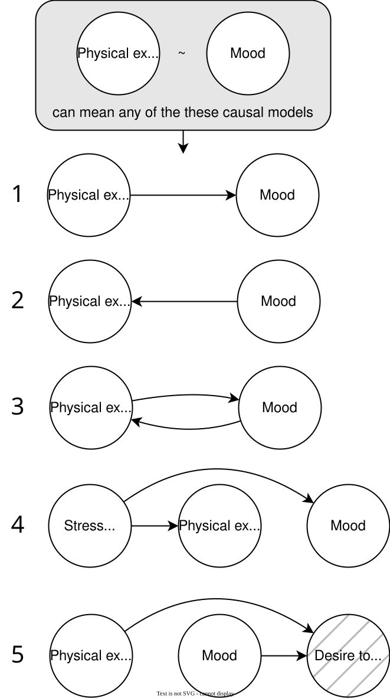
```
]

---
class: top, left, hide_logo
<div class="footer"><span>https://www.tylervigen.com/spurious-correlations</span></div>

### Kausalität

#### "Spurious Correlations" / "Scheinkorrelationen"

= zufällig entstandende Zusammenhänge, die nicht auf eine Kausalität zwischen zwei Variablen zurückzuführen sind

.pull-left[
```{r eval = TRUE, echo = F}
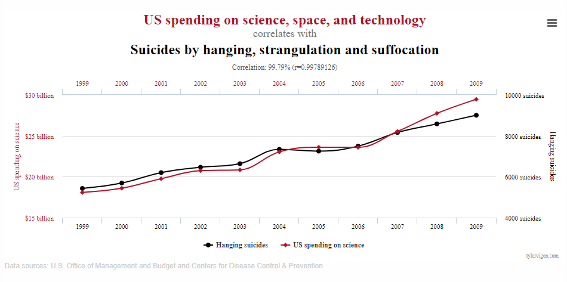
```
]

.pull-right[
```{r eval = TRUE, echo = F}
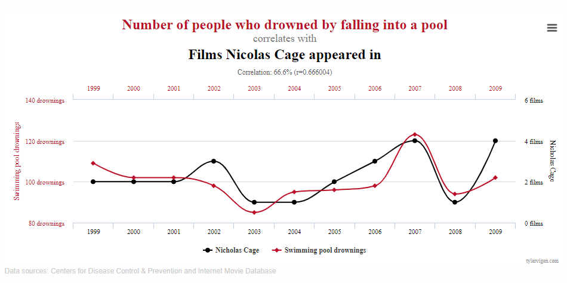
```
]

---
class: top, left, hide_logo
### Kausalität

#### Interventionistische Auffassung von Kausalität

.center[
*"...to think of a relation between events as causal is to think of it under the aspect of (possible) action. [...] that p is the cause of q [...] means that I could bring about q if I could do (so that) p.* 

von Wright (1971)

*The paradigmatic assertion in causal relationships is that manipulation of a cause will result in the manipulation of an effect. [...] Causation implies that by varying one factor I can make another factor vary.*

Cook & Campbell (1979)
]

Methodologische Implikation: **aktive Manipulation** der interessierenden Variablen


---
class: top, left, hide_logo
<div class="footer"><span>https://dorsch.hogrefe.com/stichwort/kausalitaet</span></div>

### Kausalität

#### X verursacht Y (INUS-Bedingungen)

.pull-left[
Ursachen sind sogenannte INUS‐Bedingungen:
* I = Insufficient, but
* N = Necessary parts of an
* U = Unnecessary, but
* S = Sufficient condition

Deutsch: Eine Ursache ist ein unzureichender aber notwendiger Teil einer unnötigen aber hinreichenden Bedingung (um eine Wirkung zu erzeugen)
]

.pull-right[
Beispiel: Waldbrand verursacht durch Streichholz
* Insufficient: Es braucht auch (z. B.) Sauerstoff
* Necessary: Eine Flammenquelle wird benötigt
* Unnecessary: Feuerzeug geht auch
* Sufficient: Sauerstoff, Streichholz, Trockenheit zusammen hinreichend
]

---
class: top, left, hide_logo

### Kausalität

#### X verursacht Y (INUS-Bedingungen)

Ursachen sind sogenannte INUS‐Bedingungen (Insufficient, but Necessary parts of an Unnecessary, but Sufficient condition):

**Konzeptuelle Implikationen**:
* **Ursachen sind nur als Teil einer Menge von ermöglichende Randbedingungen wirksam** $\rightarrow$	Ursachen können auch nur unter bestimmten Bedingungen wirksam sein
* Konkret bedeutet dies trotzdem: Hätte es die Ursache *nicht* gegeben (und alles andere wäre gleich geblieben), wäre es nicht zur Wirkung gekommen
* Theorien können sich auf unterschiedliche Teile der Bedingungsmenge beziehen 
* Eine Wirkung kann auch durch andere Ursachen entstehen

**Methodologische Implikationen**: Manipulation der interessierenden Variablen (= UVs), Konstanthaltung aller anderen Bedingungen/Faktoren $\rightarrow$ Experiment als Idealmodell für die Überprüfung von Kausalhypothesen


---
class: top, left, hide_logo

### Kausalität

#### Experiment – Kernelemente

.pull-left[
1) **Kausalhypothese**
  * Vermutung über den Einfluss einer Variable (UV) auf eine andere Variable (AV)
  * z. B. "Ego-Shooter verursachen erhöhte Gewaltbereitschaft"
  
2) **Manipulation einer UV**
  * zwei (oder mehr) Bedingungen herstellen, die sich nur bzgl. einer einzigen Variable (UV) unterscheiden
  * z. B. Ego-Shooter spielen vs. Flugsimulation spielen
]

.pull-right[
3) **Randomisierung**
  * Jede Person (Untersuchungseinheit) wird per Zufall einer der Bedingungen zugewiesen
  * z. B. per Münzwurf entscheiden, was eine Person spielen muss
  
4) **Beobachtung (Messung) einer AV**
  * Ausprägung der interessierenden AV wird gemessen
  * z. B. das Aggressivitätsniveau der Personen
]

---
class: top, left, hide_logo
name: stoervars
### Kausalität

#### Störvariablen und Konfundierung

**Störvariablen (SV)**
* Definition: alle Variablen (außer der UVs und deren kausale Konsequenzen), die potentiell Einfluss auf das Ergebnis haben können $\rightarrow$ Variablen die einen Zusammenhang mit der AV aufweisen und nicht zum Wirkmechanismus der UV gehören
* Störvariablen sind besonders problematisch, wenn sie mit UVs assoziiert (konfundiert), d. h. systematisch sind

**Konfundierung**
* gemeinsame Variation einer vermuteten Ursache (UV) mit (mindestens) einer anderen Störvariable
* Störvariable kann als Ursache für den beobachteten Sachverhalt nicht ausgeschlossen werden $\rightarrow$ UV kann nicht als Ursache interpretiert werden!

**Wichtigstes Ziel der kausalen Versuchsplanung** (nach Hager, 1987)
* gemeinsame systematische Variation von möglichen Störfaktoren mit hypothesenrelevanter UV verhindern
* bzw. statistische Assoziation zwischen den potentiellen Störfaktoren und der UV auf den Wert 0 bringen
* In dem Ausmaß, in dem dies für einen der möglichen Störfaktoren gelingt, nennen wir diesen kontrolliert

---
class: top, left, hide_logo
### Kausalität

#### Experiment als Versuch zur Kontrolle von Störvariablen

**Methode: Experiment**
* Vergleich von Bedingungskonstellationen, die sich nur im Hinblick auf das Vorhandensein der
  vermuteten Ursache (UV = unabhängige Variable) unterscheiden $\rightarrow$ aktive Manipulation der UV
  
* Konstanthaltung anderer Faktoren (Kontrolle von Störvariablen), u. a. durch Randomisierung

* Beobachtung, ob der zu erklärende Sachverhalt (AV = abhängige Variable) eintritt oder nicht

**Kausale Interpretation**
* Ergebnis: (k)ein Effekt in der AV (Unterschied zwischen zwei oder mehr Bedingungen)
* kausale Interpretation: UV ist (k)eine Ursache für den Effekt auf die AV


---
class: top, left, hide_logo

### Arten von Störvariablen 

#### Systematische Störvariablen

* **kovariieren mit UV** (d. h. in verschiedenen Versuchsbedingungen unterschiedlich stark ausgeprägt) $\rightarrow$ führen zu systematischen Unterschieden *zwischen* den Bedingungen

* können fälschlicherweise einen Effekt der UV auf die AV suggerieren
  * bieten Alternativerklärungen, warum man einen vermeintlichen Effekt von der UV auf die AV beobachtet
  * **Beispiel**: Trainierte haben eine bessere Leistung (AV), aber nicht wegen Training (UV), sondern wegen höherer Motivation (SV)

* können einen tatsächlich vorhandenen Effekt verschleiern
  * **Beispiel**: Bei überwiegend unmotivierten Versuchspersonen in der Trainingsbedingung wird positiver Effekt des Trainings (UV) durch negativen Effekt der Motivation (SV) verdeckt

**Konsequenz systematischer Störvariablen**: Falsche Schlussfolgerungen hinsichtlich des Effekts der UV auf die AV sind möglich, wenn Störvariable nicht berücksichtigt wird

---
class: top, left, hide_logo

### Arten von Störvariablen 

#### Systematische Störvariablen

In den Grafiken ist die Variable Z eine systematische Störvariable:

.center[
.pull-left[
```{r eval = TRUE, echo = F, out.width = "50%"}
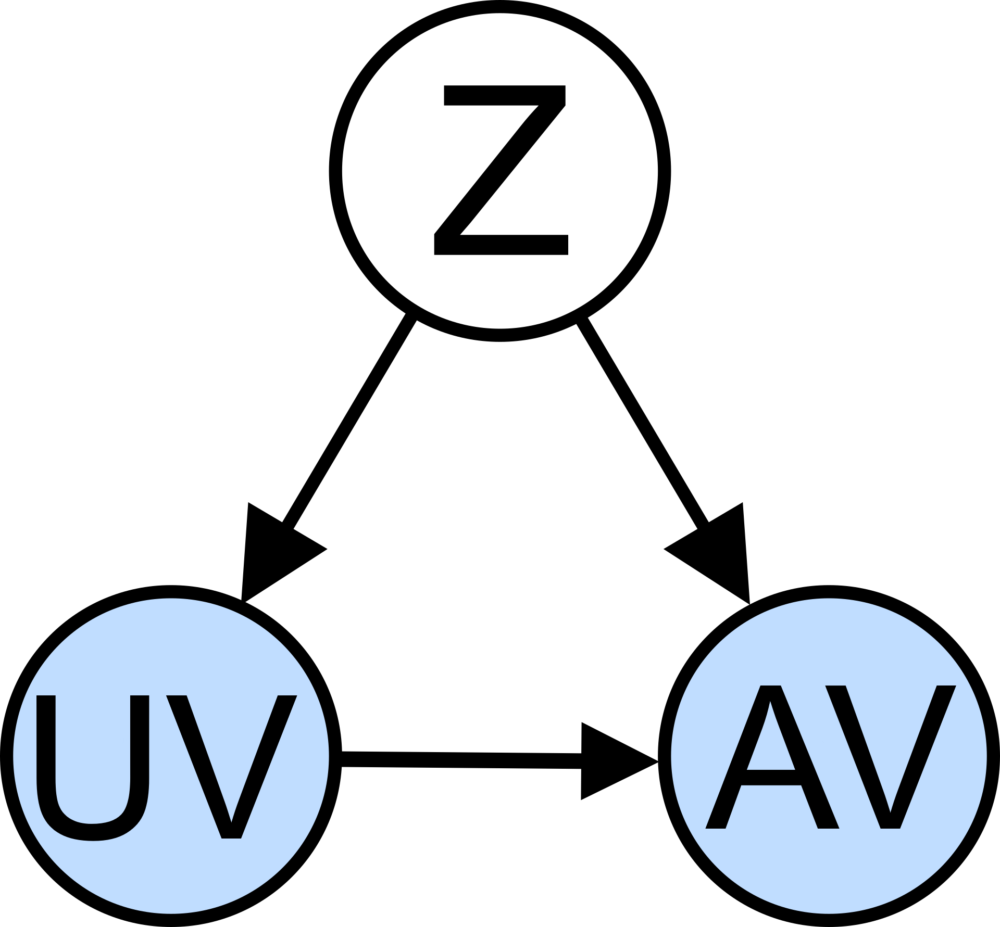
```

Die Störvariable könnte den vorhandenen kausalen Effekt zwischen UV und AV verschleiern

]
.pull-right[
```{r eval = TRUE, echo = F, out.width = "50%"}
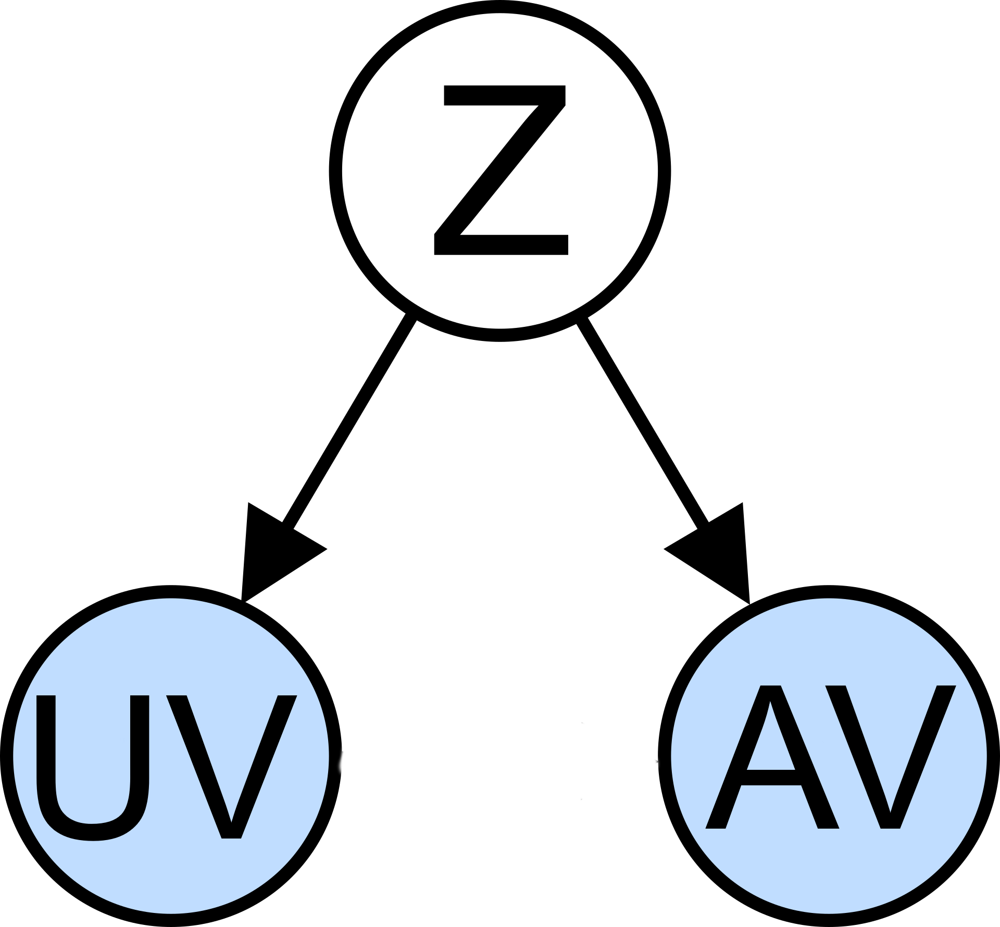
```

Die Störvariable könnte den nicht-vorhandenen kausalen Effekt suggerieren, da durch sie eine Korrelation zwischen UV und AV entsteht

]

Werden systematische Störvariablen nicht kontrolliert (z. B. durch fehlende Randomisierung), spricht man von Konfundierung, die Störvariable ist dann eine **konfundierende Variable**
]


---
class: top, left, hide_logo

### Arten von Störvariablen 

#### Systematische Störvariablen

Alternative Darstellung dafür, dass eine systematische Störvariable einen nicht-vorhandenen kausalen Effekt suggerieren kann:

.center[
```{r eval = TRUE, echo = F, out.width = "50%"}
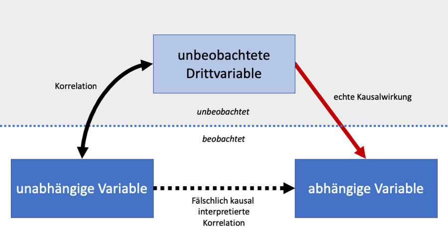
```
]

---
class: top, left

### Arten von Störvariablen 

#### Systematische Störvariablen

Beispiel: 
* Untersuchung von Mathenachhilfe oder keine Mathenachhilfe (UV) auf Matheleistung (AV)

* Systematische Störvariable "Interesse an Mathe" einer Person hängt damit zusammen, ob Personen sich für die Nachhilfe anmelden (d. h. in welcher Bedingung sie landen $\rightarrow$ Zusammenhang mit UV) als auch welche Leistung sie zeigen (d. h. Zusammenhang mit AV)

**Übung: Treffen die folgenden Aussagen im Kontext des obigen Beispiels zu?**
* Wenden wir keine Randomisierung an, dann ist "Interesse an Mathe" eine konfundierende Variable
* Wenden wir Randomisierung an, ist die systematische Störvariable kontrolliert und keine konfundierende Variable mehr
* Wenn wir die Störvariable nicht kontrollieren und einen Unterschied in der Matheleistung entdecken zwischen denjenigen, die in der Nachhilfe waren, und denjenigen, die es nicht waren, dann können wir nicht eindeutig sagen, ob die Mathenachhilfe einen kausalen Effekt auf die Matheleistung hat oder nicht

---
class: top, left, hide_logo
### Arten von Störvariablen 

#### Unsystematische Störvariablen

* **kovariieren nicht mit der UV** (d. h. in allen Versuchsbedingungen ungefähr gleich stark ausgeprägt) $\rightarrow$ führen zu *keinen* systematischen Unterschieden *zwischen* Bedingungen, aber erklären generelle Unterschiede auf der AV *innerhalb* von Bedingungen

* erklären unter anderem, warum nicht alle Personen den gleichen Wert auf der AV haben $\rightarrow$ gibt es in jeder Untersuchung; vergrößern die Varianz in der AV (Fehlervarianz; "Rauschen")

* können systematische Effekte der UV überdecken, aber können das Auftreten von Effekten (sichtbare Unterschiede/Zusammenhänge) nicht erklären

$\rightarrow$ Beispiel: In beiden Veruchsbedingungen gibt es interindividuelle Unterschiede in der Sorgfalt der Beantwortung des Fragebogens, mit dem die AV gemessen wird

**Konsequenz unsystematischer Störvariablen**:

* Wenn kein Effekt beobachtet wird, kann dies an der erhöhten Fehlervarianz liegen

* Aber: Wenn ein Effekt beobachtet wird, kann die unsystematische SV **nicht** dafür verantwortlich sein

---
class: top, left, hide_logo
### Arten von Störvariablen 

#### Unsystematische Störvariablen

In den Grafiken ist die Variable Z eine unsystematische Störvariable:

.center[
.pull-left[
```{r eval = TRUE, echo = F, out.width = "50%"}
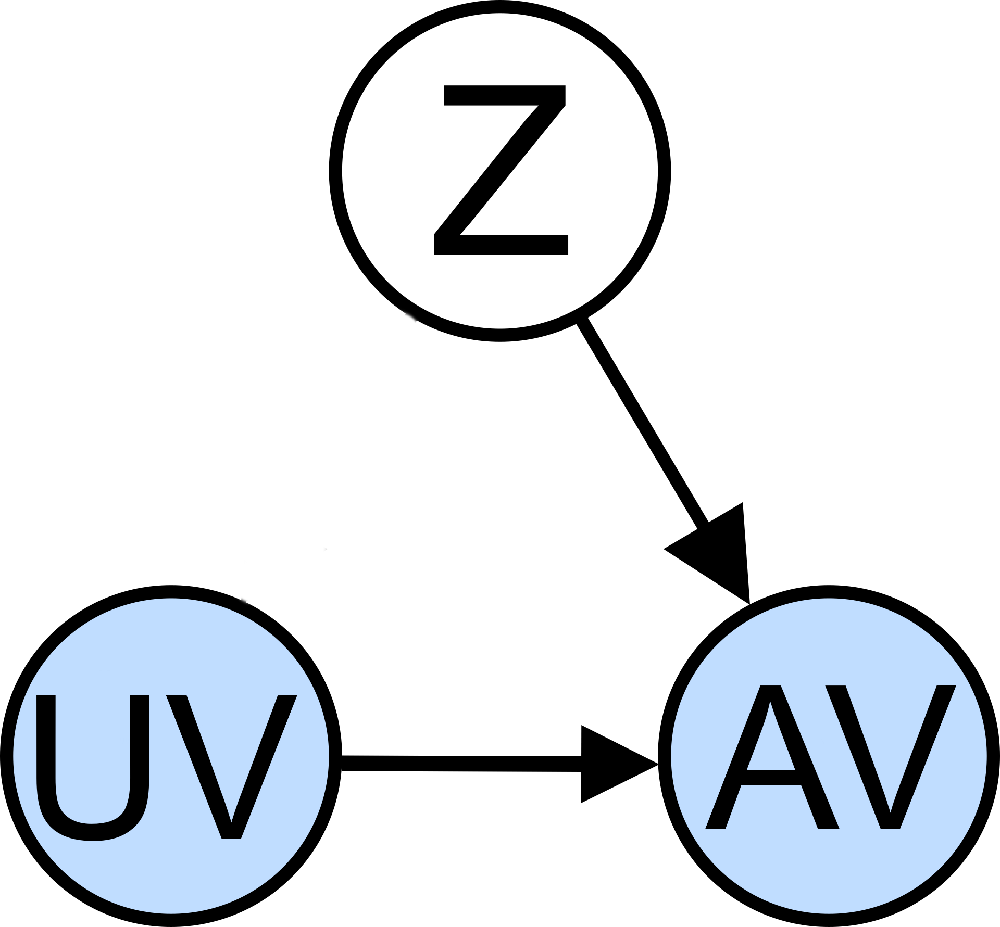
```

Die Störvariable könnte den vorhandenen kausalen Effekt zwischen UV und AV verschleiern

]
.pull-right[
```{r eval = TRUE, echo = F, out.width = "50%"}
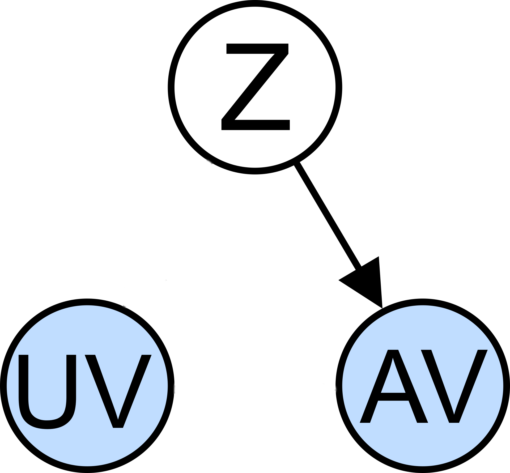
```

Die Störvariable könnte den nicht-vorhandenen kausalen Effekt **nicht** suggerieren, da durch sie keine Korrelation zwischen UV und AV entsteht
]
]


---
class: top, left, hide_logo

### Heutige Themen

#### [Ziele von statistischen Analysen und der Versuchsplanung](#ziele)

#### [Kausalität](#kausalitaet)

#### [Arten von Störvariablen](#stoervars)

#### [Kontrolle von Störvariablen](#kontrolle)

#### [Versuchspläne = Studiendesigns](#versuchsplaene)

#### Take-aways und Schlüssel-/Fachbegriffe
* [Take-aways](#take-away)
* [Schlüssel-/Fachbegriffe](#words)


---
class: top, left, hide_logo
name: kontrolle

### Kontrolle von Störvariablen

#### Interne und statistische Validität

**Ziele in der Versuchsplanung**:

1. **Kontrolle systematischer Störvariablen**
  
* gemeinsame systematische Variation von möglichen Störfaktoren mit der hypothesenrelevanten UV (= "Konfundierung") verhindern 
* anders ausgedrückt: die statistische Assoziation zwischen den potenziellen Störfaktoren und der UV auf den Wert Null bringen
  
  $\rightarrow$ erhöht sogenannte interne Validität

2. **Reduktion unsystematischer Störvariablen**
  
* Reduktion der Fehlervarianz erhöht den Anteil der Effektvarianz an der Gesamtvarianz
    
  $\rightarrow$ erhöht sogenannte statistische Validität
  
---
class: top, left, hide_logo
### Kontrolle von Störvariablen

#### Quellen von Störvariablen

* **Teilnehmer:innen**
  * Geschlecht, Intelligenz, Einkommen, Ängstlichkeit, Sucht, Haustier ...
  * alle Eigenschaften mit potenziellem (direktem oder indirektem) Einfluss auf die AV
* **Versuchsleiter:innen**
  * Geschlecht, Alter, Autorität, Status, Attraktivität, Strenge ...
  * Erwartungen bzgl. der Untersuchungsergebnisse ...
* **Situation**
  * Lärm, Beleuchtung, Tageszeit, Jahreszeit, Konjunktur, Publikum ...
  * Messinstrument, Reaktivität der Messung, demand characteristics (Aufforderungscharakter der Situation)
* **Reihenfolge/Messwiederholung**
  * Positionseffekte
  * Übungs‐, Erinnerungs‐, Ermüdungseffekte
  * Sensibilisierungseffekte

---
class: top, left, hide_logo
### Kontrolle von Störvariablen

#### Kontrolltechniken

```{r echo=F}

df = data.frame(Quelle = c("Teilnehmer:innen",
                           "",
                           "",
                           "Versuchsleiter:innen",
                           "",
                           "",
                           "",
                           "Situation",
                           "",
                           "",
                           "",
                           "Messwiederholung"),
                Technik = c("Randomisierung",
                            "Parallelisierung",
                            "Verblindung",
                            "Standardisierung",
                            "Versuchleiter-Training",
                            "Automatisierung",
                            "Verblindung",
                            "Konstanthaltung",
                            "Elimination",
                            "Kontrollfaktoren",
                            "Täuschung",
                            "Ausbalancieren"),
                Systematische = c("++", 
                                  "+",
                                  "+",
                                  "+",
                                  "+",
                                  "+",
                                  "+",
                                  "+",
                                  "+",
                                  "+",
                                  "+",
                                  "+"),
                Unsystematische = c("",
                                    "",
                                    "",
                                    "+",
                                    "+",
                                    "+",
                                    "",
                                    "+",
                                    "+",
                                    "",
                                    "",
                                    ""))
names(df) = c("Quelle", "Technik", "Systematische SV", "Unsystematische SV")

df %>%
  kbl() %>%
  kable_styling(font_size = 18) %>%
  kable_classic(full_width = T)
```

---
class: top, left, hide_logo
### Kontrolle von Störvariablen

#### Randomisierung

= zufällige Zuweisung der Untersuchungseinheiten (Versuchspersonen) zu Bedingungen
* Technik zur Kontrolle in der Person liegender, unveränderlicher Störvariablen
* Vorhandene personenbezogene Störvariablen werden nach Zufall (gleichmäßig) auf die Gruppen verteilt

Es gibt verschiedene Varianten der Randomisierung (vom einfachen "Münzwurf", über "Block-Randomisierung" für gleiche Gruppengrößen, bis zu "stratifizierter Randomisierung" für eine möglichst große Ähnlichkeit der Bedingungen hinsichtlich einer Drittvariable)

**Ergebnis der Randomisierung**:
* Personenbezogene Störvariablen sind nicht mit Bedingungszugehörigkeit konfundiert (bis auf Zufallsschwankungen)
* Definition Experiment: Wenn bzgl. einer UV randomisiert wird, dann ist Untersuchung bzgl. dieser UV ein Experiment
* Bedrohung der internen Validität durch Störeinflüsse wird verringert

---
class: top, left, hide_logo
### Kontrolle von Störvariablen

#### Randomisierung

**Randomisierung $\neq$ Zufallsstichprobe**

**Zufallsstichprobe**:
* zufällige Auswahl aus der Population
* Jeder hat die gleiche Chance, ausgewählt zu werden
* erhöht Ähnlichkeit von Stichprobe und Population
* führt zu sogenannter "externer Validität"

**Randomisierung**:
* zufällige Zuweisung bereits ausgewählter Probanden zu Bedingungen/Gruppen
* Jeder hat die gleiche Chance, in jede Bedingung zu gelangen
* erhöht Ähnlichkeit der verglichenen Bedingungen/Gruppen
* führt zu interner Validität

<!-- * Einfache Randomisierung (Münzwurf) -->
<!--   * Kann zufällig zu unterschiedlichen Gruppengrößen führen -->

<!-- * Block-Randomisierung (mit zufälliger Blockgröße) -->
<!--   * gleiche Gruppengrößen (aber letzte Elemente vorhersehbar) $\rightarrow$ daher: Randomisierung der Blockgrößen -->

<!-- * Urnenrandomisierung -->

<!-- * Stratifizierte Randomisierung -->
<!--   * Gleichmäßige Aufteilung eines Covariates -->

<!-- * Kovariat-Adaptive Randomisierung -->
<!--   * Nachsteuerung der Gruppengrößenbalance während der Studie -->

<!-- * Minimisierung -->

<!-- [**Link zu Erklärvideo**](https://www.youtube.com/watch?v=EAGZ4dx5I00) -->

---
class: top, left, hide_logo
### Kontrolle von Störvariablen

#### Parallelisierung bzw. Matching

* Vergleichbarkeit der Gruppen bzgl. einer bekannten Störvariable herstellen
* bei kleinen Stichproben zuverlässiger als Randomisierung – aber nur bzgl. einer SV!

**Umsetzung**:
* SV bei allen Teilnehmern des Experiments erfassen
* Rangreihe bzgl. der SV bilden
* Jeweils benachbarte Rangplätze werden per Zufall auf die Bedingungen aufgeteilt

**Voraussetzungen**:
* reliable und valide Messbarkeit der zu kontrollierenden SV
* Verfügbarkeit der gesamten Stichprobe zur Erfassung der SV vor der eigentlichen Untersuchung
* theoretische und/oder empirische Begründung der Bedeutsamkeit der SV


---
class: top, left, hide_logo
### Kontrolle von Störvariablen

#### Verblindung

* Verblindung: Information über Versuchsbedingung vorenthalten

* verhindert systematische Effekte dieser Information (z. B. über Erwartungen der Versuchsperson oder des Versuchsleiters)

**Drei Varianten**:

* einfache Verblindung: Versuchsperson hat keine Kenntnis über die Versuchsbedingung, der sie zugeordnet ist

* doppelte Verblindung: Versuchsperson und Versuchsleiter haben keine Kenntnis über Versuchsbedingung

* dreifache Verblindung: Versuchsperson, Versuchsleiter und Auswerter haben keine Kenntnis über Versuchsbedingung

---
class: top, left, hide_logo
### Kontrolle von Störvariablen

#### Standardisierung, Versuchsleiter-Training, Automatisierung

**Versuchsablauf standardisieren**:
* präzises und detailliertes Ablaufprotokoll festlegen
* systematische und unsystematische Störeinflüsse reduzieren, die durch Unterschiede im Ablauf
entstehen können (z .B. unterschiedliche Erläuterungen/Instruktionen des Versuchsleiters)

**Versuchsleiter trainieren**:
* Ablauf einüben (idealerweise anhand eines Ablaufprotokolls)
* systematische und unsystematische Störeinflüsse reduzieren, die durch fehlerhafte Durchführung des Versuchs entstehen können

**Versuchsablauf automatisieren**:
* Versuchsleiter z. B. durch Computer ersetzen


---
class: top, left, hide_logo
### Kontrolle von Störvariablen

#### Konstanthaltung und Elimination

* Ausprägung der Störvariable in allen Bedingungen gleich halten oder Einfluss der Störvariablen komplett verhindern

* verhindert systematische und unsystematische Störeinflüsse

Konstanthaltung:
  * z. B. Kontext: alle Versuchsbedingungen in gleicher Umgebung durchführen
  * z. B. Temperatur: identisch klimatisierte Laborräume
  * z. B. Instruktion: identische Wortwahl in allen Versuchsbedingungen

Elimination:
  * z. B. Lärm: Schallisolierung
  * z. B. Licht: Fenster abdunkeln
  * z. B. Anwesenheit anderer Personen: individuelle Datenerhebung
  * z. B. Versuchsleiter: Automatisierung

---
class: top, left, hide_logo
### Kontrolle von Störvariablen

#### Kontrollfaktoren

* Störvariable in das Untersuchungsdesign als Kontrollfaktor einbeziehen (d. h. miterheben und/oder zusätzlich systematisch varrieren)

* Effekte der UV und SV können analysiert werden
  * z. B. UV Frustration: zwei Stufen (frustriert, nicht frustriert)
  * z. B. SV Tageszeit als Kontrollfaktor: zwei Stufen (vor vs. nach dem Mittagessen)
  
* Untersuchung mit vier Gruppen:
  1. frustriert + vor dem Mittagessen
  2. nicht frustriert + vor dem Mittagessen
  3. frustriert + nach dem Mittagessen
  4. nicht frustriert + nach dem Mittagessen
  
* Unterschied 1 vs. 2 $\rightarrow$ Frustration
* Unterschied 1 vs. 3 $\rightarrow$ Tageszeit

---
class: top, left, hide_logo
### Kontrolle von Störvariablen

#### Täuschung

* Versuchspersonen wollen Versuchsleitern "einen Gefallen tun", indem sie der (wahren/vermuteten) Hypothese entsprechend reagieren $\rightarrow$ AV nicht valide, evtl. systematisch verfälscht

* Fehlinformation über einzelne Aspekte des Versuchs
* verhindert systematische Effekte einzelner Aspekte der Situation

* z. B. UV: Geschlecht des Versuchsleiters, Täuschung: UV verschweigen; Wir messen Kreativität“ $\rightarrow$ lenkt von UV ab
* z. B. AV: Leistungstest, Täuschung: "Pilotversuch, Daten werden nicht gespeichert" $\rightarrow$ reduziert Einfluss der Prüfungsängstlichkeit

* besonders hilfreich bei demand characteristics: Aspekte der Situation, die 
(a) die wahren Hypothesen der Untersuchung verraten oder 
(b) falsche Hypothesen nahelegen

* Problem: Frage der ethischen Vertretbarkeit von Täuschung

---
class: top, left, hide_logo
### Kontrolle von Störvariablen

#### Ausbalancieren

* Wenn alle Personen alle Bedingungen durchlaufen, spricht man von einem **"within-person"** Experiment im Gegensatz zu einem **"between-person"** Experiment, bei der jede Person nur eine Bedingung durchläuft

* In diesem Fall gibt es auch keine personenbezogenen Störvariablen, aber dafür muss man auf Messwiederholung als Quelle von Störvariablen achten, d.h. Positions- und Sequenzeffekte (Lernen, Ermüdung, Carry-over-Effekte)

* Ausbalancieren ist eine Maßnahme um Reihenfolgeeffekte zu kontrollieren: alle möglichen Reihenfolgen realisieren; auf Effekte der Reihenfolge prüfen

* Beispiel: Effekte von Lärm (UV) auf kognitive Leistungen (AV: Konzentrationstest)
  * Versuchsablauf A: (1) Test mit Lärm; (2) Test ohne Lärm
  * Ergebnis: Leistung (2) > Leistung (1) $\rightarrow$ Interpretation? Lerneffekt?
  
  $\rightarrow$ Ausbalancieren: zusätzlicher Versuchsablauf B: (1) Test ohne Lärm; (2) Test mit Lärm
  
Nachteil: Aufwand, denn bei k Versuchsbedingungen sind k! Reihenfolgen notwendig (2! = 2; 3! = 6; 4! = 24; ...; 10! = 3.628.800)

---
class: top, left, hide_logo

### Heutige Themen

#### [Ziele von statistischen Analysen und der Versuchsplanung](#ziele)

#### [Kausalität](#kausalitaet)

#### [Arten von Störvariablen](#stoervars)

#### [Kontrolle von Störvariablen](#kontrolle)

#### [Versuchspläne = Studiendesigns](#versuchsplaene)

#### Take-aways und Schlüssel-/Fachbegriffe
* [Take-aways](#take-away)
* [Schlüssel-/Fachbegriffe](#words)

---
class: top, left, hide_logo
name: versuchsplaene

### Versuchspläne = Studiendesigns 

#### Notation von Versuchsplänen

* O (Observation): Beobachtung, Messung einer oder mehrerer Maße; durchnummeriert bei mehrfachen Messungen (z. B. Messzeitpunkte, Gruppen)

* X (Treatment, Intervention): kontrollierte Manipulation der UV

* R (Randomisierung): zufällige Zuweisung der Untersuchungseinheiten zu Bedingungen (vor Untersuchung)

* Zeitverlauf von links nach rechts

* Verschiedene Gruppen sind zeilenweise untereinander notiert, z. B. oben EG und unten KG

---
class: top, left, hide_logo
### Versuchspläne = Studiendesigns

#### Nicht-experimentelle Versuchspläne

"nur" systematische Beobachtung einer/mehrerer Variablen
* keine Manipulation
* keine randomisierte Zuweisung zu Bedingungen

**Typische Versuchspläne**:

* One-shot-Design
* Korrelationsstudien
* einfache Gruppenvergleiche
* Prä-Post-Vergleich

$\rightarrow$ z. B. deskriptive Untersuchungen, Umfrageforschung (univariat); Korrelationsforschung (bi- oder multivariat)
* Interpretationsmöglichkeiten: Prüfung von Kausalhypothesen nicht (oder nur unter speziellen Annahmen) möglich!

Studien mit Messwiederholung nennt man **Längsschnittstudien** (within-person Designs), Studien ohne Messwiederholung **Querschnittstudien** (between-person Designs)

---
class: top, left, hide_logo

### Versuchspläne = Studiendesigns

#### Nicht-experimentelle Versuchspläne

##### One-shot-Design

.center[
```{r eval = TRUE, echo = F, out.width = "1000px"}
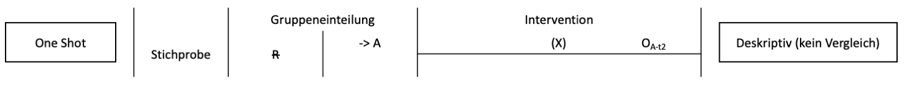
```
]

---
class: top, left, hide_logo
### Versuchspläne = Studiendesigns

#### Nicht-experimentelle Versuchspläne

##### One-shot-Design

* Beobachtung einer AV an einer Stichprobe (mit/ohne Intervention)
* "nur" systematische Beobachtung einer Variablen; d. h. rein deskriptive Erhebung oder Schätzung des Ist-Zustands
* nur eine Variable (keine Unterscheidung UV/AV, keine Manipulation)
* nur eine Gruppe (keine Kontrollgruppe, keine Randomisierung)
* z. B. Umfrageforschung, Studienreform (X) und Messung Studierendenzufriedenheit (O); Spendenkampagne (X) und Messung
Spendenaufkommen (O)

**Interpretationsmöglichkeiten**:
* beschreibende Aussagen über Häufigkeiten oder Merkmalsverteilungen zum Zeitpunkt der Messung
* Effekt des Treatments nicht quantifizierbar (kein Vergleichswert)
* Zusammenhang von X und O kann nicht untersucht werden

---
class: top, left, hide_logo
<div class="footer"><span>Imbens, G. W., & Xu, Y. (2025). Comparing Experimental and Nonexperimental Methods: What Lessons Have We Learned Four Decades after LaLonde (1986)? <i>Journal of Economic Perspectives, 39</i>(4), 173-201.</div>


### Versuchspläne = Studiendesigns

#### Nicht-experimentelle Versuchspläne

##### Korrelationsstudien

* Beobachtung von zwei Variablen in einer Stichprobe

* keine Kontrollgruppe, keine Randomisierung, keine Trennung von UV und AV nötig, simultane Erhebung der Variablen, keine Manipulation (z. B. Zusammenhang von Geschäftserfolg und Extraversion)

**Interpretationsmöglichkeiten**:
* Aussagen über Zusammenhang zwischen zwei Variablen möglich
* Aussagen über Kausalität nicht (oder nur unter speziellen Annahmen) möglich
  * z.B. kann theoretisch angenommene Kausalrichtung formuliert werden (z. B. je extrovertierter, desto erfolgreicher) und auf Erhebung zeitlich zurückliegender "UV" (AV folgt UV) geachtet werden; dann braucht es noch Kontrolltechniken und eine Argumentation der Annahmen
  * ohne konkrete, stichhaltige Argumentation für eine Kausalität, gilt als Grundannahme: keine Kausalitätsaussagen auf korrelativen Daten möglich!

---
class: top, left, hide_logo
### Versuchspläne = Studiendesigns

#### Nicht-experimentelle Versuchspläne

##### Einfacher Gruppenvergleich

.center[
```{r eval = TRUE, echo = F, out.width = "1000px"}
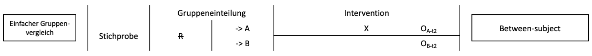
```
]

* Beobachtung einer AV in zwei (durch kategoriale UV definierten) Gruppen (Sonderfall Korrelationsstudie)
* keine Manipulation, keine Randomisierung, UV‐AV‐Sequenz
* z. B. UV Geschlecht, AV Aggression; Ergebnis: Geschlechtsunterschied

**Problem**: Was ist für den Unterschied verantwortlich?

**Interpretationsmöglichkeiten:**
* Aussagen über Zusammenhang Gruppe (UV) und AV
* Aussagen über Kausalität nicht (oder nur unter speziellen Annahmen) möglich

---
class: top, left, hide_logo
### Versuchspläne = Studiendesigns

#### Nicht-experimentelle Versuchspläne

##### Prä-Post-Vergleich ("vorexperimentelle Anordnung")

.center[
```{r eval = TRUE, echo = F, out.width = "1000px"}
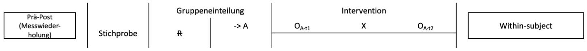
```
]

* Beobachtung einer AV in einer Stichprobe vor und nach *ein und derselben* Intervention
* keine Kontrollgruppe/-bedingung, keine zufällige Zuordnung
* z. B. Studierendenbefragung vor und nach einer Studienreform

**Probleme**: alle personengebundenen und zeitgebundenen Störvariablen

**Interpretationsmöglichkeiten**:
* Aussagen über Zusammenhang Intervention und AV
* Aussagen über Kausalität nicht (oder nur unter speziellen Annahmen) möglich

---
class: top, left, hide_logo

### Versuchspläne = Studiendesigns

#### Quasi-experimentelle Versuchspläne

**Charakteristika**:

* Trennung UV/AV
* systematische Beobachtung der AV
* gezielte Manipulation der UV
* **keine** randomisierte Zuweisung der Versuchspersonen zu den Bedingungen, stattdessen "natürlich vorgefundene Gruppen"

**Interpretationsmöglichkeiten**:
* Aussagen über Zusammenhang UV und AV
* Aussagen über Kausalität nur eingeschränkt möglich
* nur verwenden, wenn Experiment nicht durchführbar

---
class: top, left, hide_logo
### Versuchspläne = Studiendesigns

#### Quasi-experimentelle Versuchspläne

##### Problem von Quasi-Experimenten:

**Experiment**:

* Alle möglichen/denkbaren **systematischen personenbezogenen** Störvariablen sind durch Randomisierung kontrolliert

* UV ist Ursache, sofern keine anderen systematischen Störvariablen vorliegen

**Quasi‐Experiment**:

* Alle möglichen/denkbaren **systematischen personenbezogenen** Störvariablen können systematisch mit Bedingung (d. h. mit UV) konfundiert sein

* UV und SV als mögliche Ursache

---
class: top, left, hide_logo
### Versuchspläne = Studiendesigns

#### Quasi-experimentelle Versuchspläne

##### Nicht-äquivalenter Kontrollgruppenplan

.center[
```{r eval = TRUE, echo = F, out.width = "1000px"}
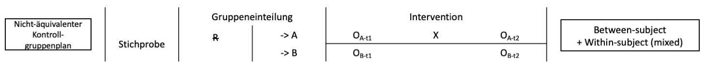
```
]

* Vorher‐Nachher‐Messung in zwei Bedingungen (mit Intervention)
* Trennung und Sequenz UV‐AV, Kontrollgruppe, Manipulation
* keine zufällige Zuordnung, d.h. Unterschiede im Ausgangsniveau plausibel $\rightarrow$ Vortest notwendig zur Korrektur der Vorher‐Unterschiede
* weit verbreiteter Versuchsplan, wenn Randomisierung nicht möglich

**Interpretationsmöglichkeiten**
* Aussagen über Zusammenhang von UV und AV
* Aussagen über Kausalität eingeschränkt möglich

---
class: top, left
### Versuchspläne = Studiendesigns

#### Quasi-experimentelle Versuchspläne

##### Beispiel

Evaluation eines zusätzlichen Therapiemoduls in einer Rehaklinik 

* **Hypothese**: Das neue Therapiemodul steigert den Therapieerfolg.

* Man kann nicht zur Therapie gezwungen werden 

* **Selbstselektion** $\rightarrow$ "Verweigerer" sind Kontrollgruppe

* **Alternativerklärung** für mehr Erfolg in Experimentalgruppe: Therapiemotivation 

* **Zentrale Möglichkeiten der Kontrolle von Störvariablen**:

  * Ausgangsunterschiede durch einen Vortest statistisch kontrollieren

  * Parallelisierung / Matching
  
---
class: top, left, hide_logo
### Versuchspläne = Studiendesigns

#### Experimentelle Versuchspläne

.pull-left[
**Charakteristika**:
* Trennung und Sequenz UV-AV
* systematische Beobachtung der AV
* gezielte Manipulation der UVs
* randomisierte Zuweisung zu den Bedingungen

**Interpretationsmöglichkeiten**:
* Aussagen über Zusammenhang von UV und AV
* Aussagen über Kausalität möglich, sofern alle nicht-personenbezogenen, systematischen Störvariablen kontrolliert wurden
]

.pull-right[
**Typische Versuchspläne**:
* randomisierter Kontrollgruppenplan mit / ohne Vortest
* ein oder zwei Treatments sowie eine Kontrollgruppe (KG)
  - z. B. eine oder zwei inhaltliche Varianten des neuen Treatments vs. KG
  - z. B. unterschiedlich starke Ausprägungen des Treatments vs. KG
* zwei Treatments, keine Kontrollgruppe
  - z. B. neues Treatment im Vergleich zu Standardtreatment, das gut gegen KG abgesichert ist
  - z. B. Vergleich unterschiedlicher Ausprägungen des Treatments
]


---
class: top, left, hide_logo
### Versuchspläne = Studiendesigns

#### Experimentelle Versuchspläne

##### Das randomisiert-kontrollierte Trial (randomized-controlled trial, RCT)

Standardparadigma der klinischen Wirksamkeitsforschung: Kontrollgruppenplan (meist mit Vortest)

.center[
```{r eval = TRUE, echo = F, out.width = "800px"}
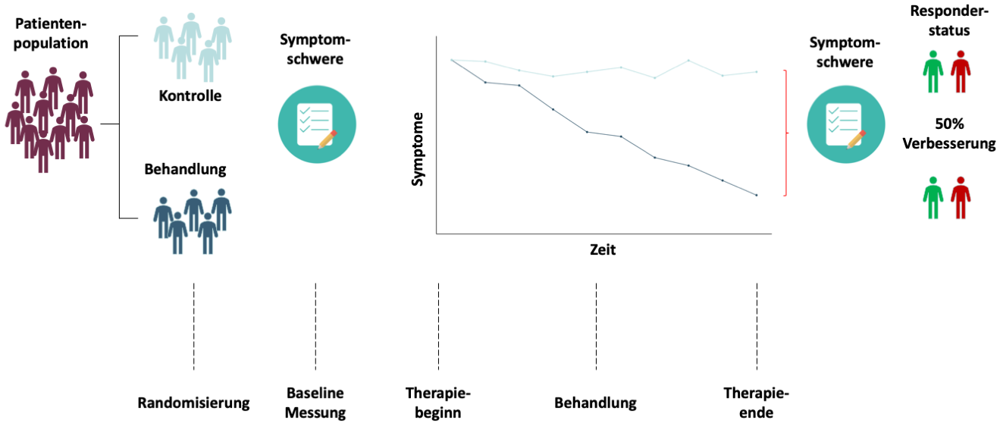
```
]

---
class: top, left, hide_logo
### Versuchspläne = Studiendesigns

#### Experimentelle Versuchspläne

##### Arten von Kontrollgruppen

* keine Behandlung

* Placebo-Behandlung

* etablierte Standard-Behandlung (Treatment as usual, TAU)

* Wartelistenplatz: Behandlung erfolgt nach der Studie

$\rightarrow$ je nach Fragestellung andere Typen von Kontrollgruppen sinnvoll

---
class: top, left, hide_logo
### Versuchspläne = Studiendesigns

#### Experimentelle Versuchspläne

##### Kontrollgruppenplan ohne und mit Vortest

.center[
```{r eval = TRUE, echo = F, out.width = "1000px"}
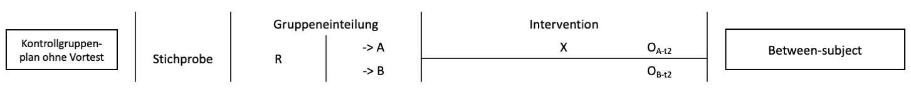
```
]

.center[
```{r eval = TRUE, echo = F, out.width = "1000px"}
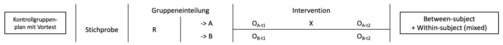
```
]

**Vorteil des Vortests**: Trotz Randomisierung bestehende zufällige Unterschiede zwischen den Gruppen können berücksichtigt werden, reduziert Fehlervarianz (erhöht statistische Validität)

**Problem des Vortests**: Sensitivierung, Übungseffekte oder andere Methodeneffekte durch Messwiederholung


---
class: top, left, hide_logo
### Versuchspläne = Studiendesigns

#### Experimentelle Versuchspläne

##### Labor- und Feldstudie

.pull-left[
**Laborexperiment**:
* Beobachtung einer AV bei randomisierter Zuweisung zu Bedingungen der UV in "künstlicher" Umgebung
* Umgebung/Bedingungen/Störvariablen besser kontrollierbar $\rightarrow$ höhere interne Validität
* Bedingungen können gut variiert, repliziert und manipuliert werden
* Beispiele: 
  * Sind Probanden eher bereit, noch einen zweiten Fragebogen auszufüllen, wenn man ihnen zuvor fröhliche Musik vorgespielt hat?
  * Lernprozesse am Computer mit Eye-Tracker untersuchen
]

.pull-right[
**Feldexperiment**:
* Beobachtung einer AV bei randomisierter Zuweisung zu Bedingungen der UV in der "natürlichen" Umgebung
* Umgebung/Bedingungen/Störvariablen kaum kontrollierbar $\rightarrow$ geringere interne Validität
* weniger systematische Variation möglich
* mehr Nähe zum Verhalten in Alltagssituationen $\rightarrow$ u. U. höhere ökologische Validität
* Beispiele: 
  * Sind Leute eher bereit, jemanden am Kopierer vorzulassen, wenn sie zuvor dort 2 € gefunden haben?
  * Spielverhalten von Kindern am Spielplatz mit und ohne Anwesenheit der Eltern
]

---
class: top, left, hide_logo
### Versuchspläne = Studiendesigns

.center[
```{r eval = TRUE, echo = F, out.width="75%"}
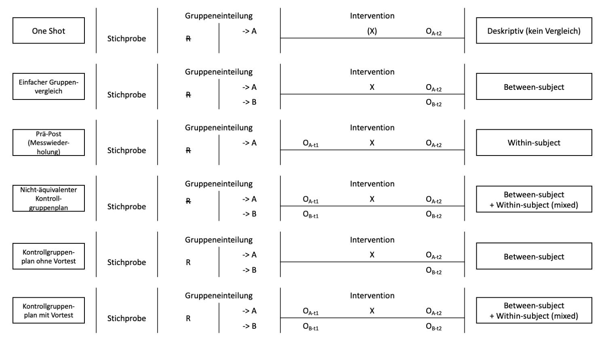
```

nicht abgebildet: Korrelationsstudien
]

---
class: top, left, hide_logo
<div class="footer"><span>https://link.springer.com/referenceworkentry/10.1007/978-3-658-16937-4_7-1</span></div>

### Versuchspläne = Studiendesigns

.center[
```{r eval = TRUE, echo = F, out.width="75%"}
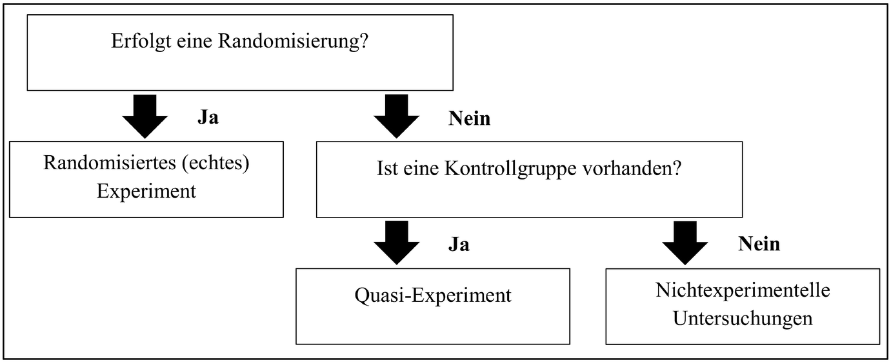
```

]
---
class: top, left
### Versuchspläne = Studiendesigns

#### Ausblick: Mehrfaktorielle Versuchspläne

Faktorielles Design: Alle möglichen Kombinationen der Faktoren (= Gruppenausprägungen) sind realisiert

Beispiel: pharmakologische Behandlung einer Depression
* UV A: Medikament (A1: Verum vs. A2: Placebo)
* UV B: Dosis (B1: niedrig vs. B2: hoch)

2x2-Design: vier Versuchsbedingungen als Kombination von A und B:
  * A1-B1: Verum, niedrig
  * A1-B2: Verum, hoch
  * A2-B1: Placebo, niedrig
  * A2-B2: Placebo, hoch

Vorteile:
* effizienter als eine Durchführung jeweils einzelner Experimente für jeden der Faktoren
* Untersuchung von Interaktionseffekten möglich

<br>
<!-- class: top, left -->
<!-- ### Versuchspläne = Studiendesigns -->

<!-- #### Mehrfaktorielle Versuchspläne -->

<!-- ##### Interpretation von Interaktionseffekten: -->

<!-- .pull-left[ -->
<!-- .center[ -->
<!-- ```{r eval = TRUE, echo = F, out.width = "400px"} -->

<!-- a = expand.grid(Medikament = c("Verum", "Placebo"), -->
<!--                 Dosis = c("niedrig", "hoch")) -->
<!-- a$Effekt[a$Medikament == "Verum" & a$Dosis == "niedrig"] = 20 -->
<!-- a$Effekt[a$Medikament == "Verum" & a$Dosis == "hoch"] = 20 -->
<!-- a$Effekt[a$Medikament == "Placebo" & a$Dosis == "niedrig"] = 15 -->
<!-- a$Effekt[a$Medikament == "Placebo" & a$Dosis == "hoch"] = 15 -->

<!-- ggplot(a, aes(x = Dosis, y = Effekt, colour = Medikament)) + -->
<!--   stat_summary(geom = "line", fun = "mean", aes(group = Medikament)) + -->
<!--   geom_point(aes(group =1)) + -->
<!--   coord_cartesian(ylim = c(0,40)) + -->
<!--   #ggtitle("Keine Interaktion") + -->
<!--   theme_classic() + -->
<!--   theme(text = element_text(size = 25), legend.position = "bottom") -->
<!-- ``` -->
<!-- ] -->
<!-- ] -->

<!-- .pull-right[ -->
<!-- **Keine Interaktion: ** -->

<!-- Für den Effekt der UV Medikament spielt Dosis keine Rolle -->
<!-- ] -->

<!-- --- -->
<!-- class: top, left -->
<!-- ### Versuchspläne = Studiendesigns -->

<!-- #### Mehrfaktorielle Versuchspläne -->

<!-- ##### Interpretation von Interaktionseffekten: -->

<!-- .pull-left[ -->
<!-- .center[ -->
<!-- ```{r eval = TRUE, echo = F, out.width = "400px"} -->

<!-- a = expand.grid(Medikament = c("Verum", "Placebo"), -->
<!--                 Dosis = c("niedrig", "hoch")) -->
<!-- a$Effekt[a$Medikament == "Verum" & a$Dosis == "niedrig"] = 20 -->
<!-- a$Effekt[a$Medikament == "Verum" & a$Dosis == "hoch"] = 35 -->
<!-- a$Effekt[a$Medikament == "Placebo" & a$Dosis == "niedrig"] = 15 -->
<!-- a$Effekt[a$Medikament == "Placebo" & a$Dosis == "hoch"] = 15 -->

<!-- ggplot(a, aes(x = Dosis, y = Effekt, colour = Medikament)) + -->
<!--   stat_summary(geom = "line", fun = "mean", aes(group = Medikament)) + -->
<!--   geom_point(aes(group =1)) + -->
<!--   coord_cartesian(ylim = c(0,40)) + -->
<!--   #ggtitle("Interaktion") + -->
<!--   theme_classic() + -->
<!--   theme(text = element_text(size = 25), legend.position = "bottom") -->
<!-- ``` -->
<!-- ] -->
<!-- ] -->

<!-- .pull-right[ -->
<!-- **Interaktion: ** -->

<!-- Auf der Stufe "Verum" der UV Medikament führt eine höhere Dosis zu einem stärkeren Effekt als auf der Stufe "Placebo" -->
<!-- ] -->

<!-- --- -->
<!-- class: top, left -->
<!-- ### Versuchspläne = Studiendesigns -->

<!-- #### Mehrfaktorielle Versuchspläne -->

<!-- ##### Vorteile -->

<!-- * Alle möglichen Kombinationen der Faktoren sind realisiert -->
<!-- * Effizienter als eine Durchführung jeweils einzelner Experimente für jeden der Faktoren -->
<!-- * Untersuchung von Interaktionseffekten möglich -->

<!-- **Interpretation Haupteffekt: ** -->
<!-- * Wirkung eines Faktors A unabhängig von den Stufen des anderen Faktors -->
<!-- * Beispiel: Frustration erzeugt bei allen Personengruppen Aggression -->

<!-- **Interpretation Interaktion: ** -->
<!-- * Wechselwirkung zwischen 2 Faktoren -->
<!-- * Wirkung eines Faktors A hängt von Ausprägung des Faktors B ab -->
<!-- * Beispiel: Frustration erzeugt nur bei Männern Aggression (nicht bei Frauen) -->


---
class: top, left, hide_logo

### Zusammenfassung: Validität im Kontext der Versuchsplanung

.pull-left[
* **interne Validität** 

  * eindeutige Schlussfolgerung bezüglich der Wirkbeziehung zwischen AV und UV
  
  * erreicht, wenn alle relevanten systematischen Störvariablen kontrolliert
  
  * (+) Experiment

* **externe Validität**

  * Erkenntnisse können auf Population generalisiert werden
]

.pull-right[
* **ökologische Validität** 

  * Erkenntnisse können auf Wirklichkeit generalisiert werden
  
  * Problem zu starker Standardisierung
  
  * (-) Laborexperiment
  
* **statistische Validität**

  * Reduktion der Fehlervarianz in der AV
  
  * erreicht, wenn alle relevanten unsystematischen Störvariablen ausgeschlossen
]
  
---
class: top, left, hide_logo
name: take-away

### Take-aways
.content-box-gray[
* Experiment gilt als Königsweg zur Kausalität

* systematische Konfundierungen nach Möglichkeit durch Studiendesign verhindern 

* Randomisierung ist ein effizienter Weg, systematische personenbezogene Konfundierungen aus dem Unterschied zwischen experimentellen Bedingungen herauszuhalten 

* Durch Verblindung lassen sich Konfundierungen, verursacht durch Versuchsteilnehmer und -leiter, verringern

* Problem Quasi-Experiment: keine Randomisierung, nur gezielte Manipulation der UV

* Nicht-experimentelle Versuchspläne ermöglichen Schlüsse über Zusammenhänge, Kausalitätsschlüsse sind aber nicht (oder nur unter speziellen Annahmen) möglich

* klassischer Experimentaufbau: Kontrollgruppenplan (mit / ohne Pretest) mit randomisierter Gruppenzuweisung
]

---
class: top, left, hide_logo
name: words

### Schlüssel-/Fachbegriffe der heutigen Vorlesung
.small[
.content-box-gray[

.pull-left[
.pull-left[

**Kausalität**

**Scheinkorrelationen**

**INUS-Bedingungen**

**Experiment**

**Kausalhypothese**

**unabhängige Variable**

**abhängige Variable**

**Randomisierung**

**Störvariablen**

**Konfundierung**
]

.pull-right[
**Kontrolle von Störvariablen**

**systematische Störvariablen**

**unsystematische Störvariablen**

**interne Validität** 

**statistische Validität**

**Zufallsstichprobe**

**externe Validität**

**ökologische Validität**
]
]

.pull-right[
.pull-left[
**Parallelisierung / Matching**

**Verblindung**

**Konstanthaltung**

**Elimination**

**Kontrollfaktoren**

**Ausbalancieren**

**One-shot-Design**

**Korrelationsstudien**

**einfacher Gruppenvergleich**
]

.pull-right[
**Prä-Post-Vergleich / vorexperimentelle Anordnung**

**Quasi-Experimente**

**nicht-äquivalenter Kontrollgruppenplan**

**randomisiert-kontrolliertes Trial (RCT)**

**Labor vs. Feldstudie**

**Längsschnittstudie (within-person Design)**

**Querschnittstudie (between-person Design)**
]
]
]
]

**[zurück zur heutigen Übersicht der Vorlesung $\rightarrow$](#content)** **[zum Quiz zur Wissensprüfung $\rightarrow$](https://forms.gle/9FkoxCEYFb123voT6)**


---
class: top, left
### Literatur für die heutige Sitzung

.center[
```{r, echo=FALSE,out.width="30%",fig.cap="Kapitel 4.3. in Eid, M., Gollwitzer, M., & Schmitt M. (2017). Statistik und Forschungsmethoden. Beltz",fig.show='hold',fig.align='center'}
knitr::include_graphics("bilder/eid.png")
``` 
]

<!-- library(renderthis)  -->
<!-- chromote::local_chrome_version(binary = "chrome-headless-shell") -->
<!-- to_pdf("EinfForsch_06_Experiment.Rmd", complex_slides = TRUE) -->