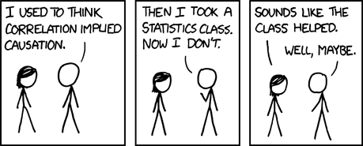
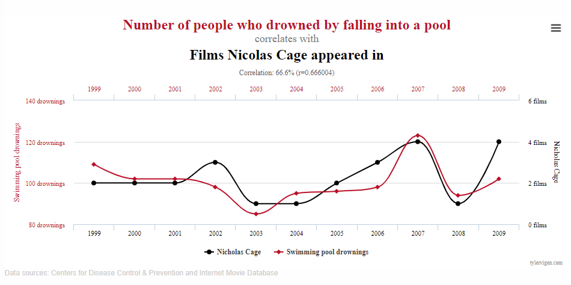
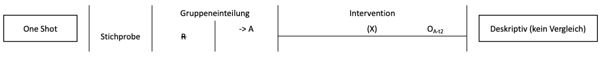
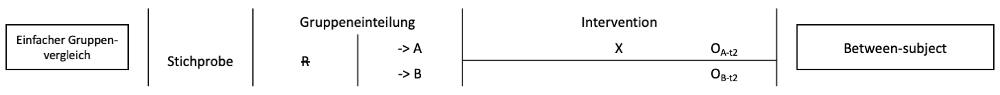
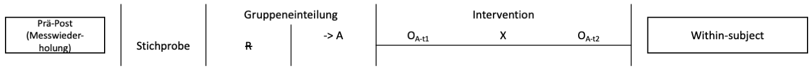
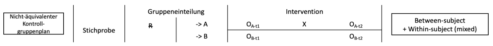
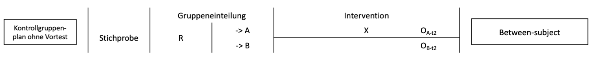
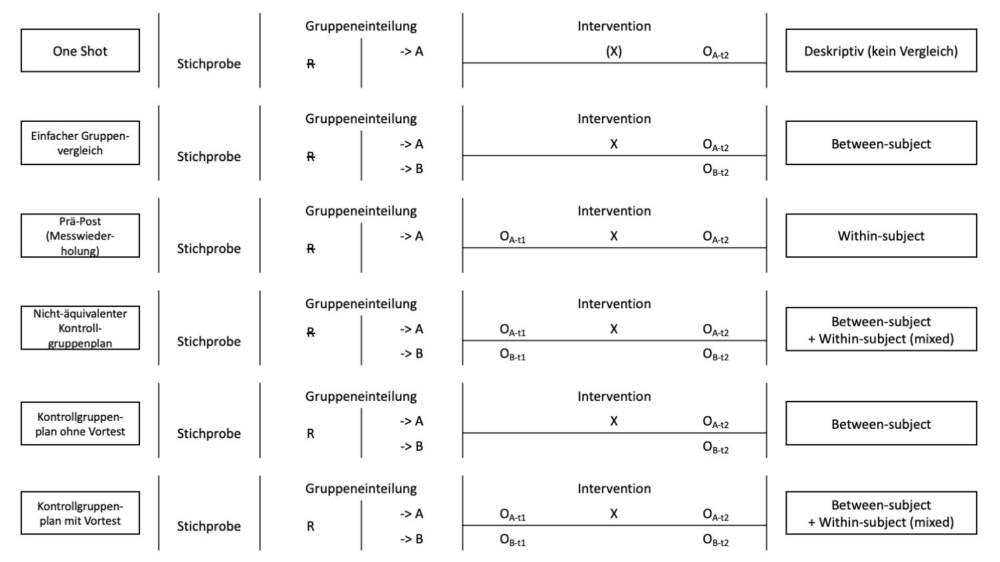

```{r setup, include=FALSE}
options(htmltools.dir.version = FALSE)

library(tidyverse)
library(kableExtra)
library(ggplot2)
library(plotly)
library(htmlwidgets)
library(MASS)
library(ggpubr)
library(xaringanthemer)
library(xaringanExtra)

style_duo_accent(
  primary_color = "#621C37",
  secondary_color = "#EE0071",
  background_image = "blank.png"
)

xaringanExtra::use_xaringan_extra(c("tile_view"))

use_scribble(
  pen_color = "#EE0071",
  pen_size = 4
  )

knitr::opts_chunk$set(
  fig.retina = TRUE,
  warning = FALSE,
  message = FALSE
)

# library(RefManageR)
# BibOptions(
# check.entries = FALSE, 
# bib.style = "authoryear", 
# cite.style = "authoryear", 
# style = "markdown",
# hyperlink = FALSE, 
# dashed = FALSE)
# myBib = ReadBib("/Users/stephangoerigk/Desktop/Universität/CFH/Lehre/Bachelor/Einführung in die Forschungsmethoden der Psychologie und Psychotherapie/EFPP_Folien/myBib.bib")
```

name: Title slide
class: middle, left
<br><br><br><br><br><br><br>
# Einführung in die Forschungsmethoden der Psychologie und Psychotherapie

### Einheit 6: Das Experiment: Alternativerklärungen und Kontrollbedingungen
##### 23.11.2023 | Dr. Caroline Zygar-Hoffmann

---
class: top, left
### Termine

```{r echo = F}
df = readxl::read_xlsx("Einführung in die Forschungsmethoden der Psychologie und Psychotherapie_Termine_neu2.xlsx", sheet = "Tabelle1")[1:14, 1:3]
df$Datum = format(as.Date(df$Datum), "%d.%m.%Y")
df %>%
  kbl() %>%
  kable_styling(font_size = 18) %>%
  kable_classic(full_width = T) %>% 
  row_spec(10, background = "yellow")
```

---
class: top, left
name: kausalitaet
<div class="footer"><span>https://m.xkcd.com/552/</span></div>

### ReCap: Kausalität

#### Korrelation =/= Kausalität

* Sachverhalt: Zusammenhang zwischen A & B

* Anders ausgedrückt: A wird häufig zusammen mit B beobachtet

.pull-left[
**Mögliche Kausalbeziehungen:**

1. A verursacht B

2. B verursacht A

3. Eine Drittvariable C (bzw. eine Menge von zusammenhängenden Variablen X1, ..., Xn) verursacht A & B

**Folge:** Korrelation impliziert nicht Kausalität
]

.pull-right[
```{r eval = TRUE, echo = F, out.width = "450px"}

```
]

---
class: top, left
<div class="footer"><span>https://pedermisager.org/blog/why_does_correlation_not_equal_causation/</span></div>

### ReCap: Kausalität

#### Kausale Modelle, die eine Korrelation erzeugen können:

.center[
```{r eval = TRUE, echo = F, out.width="25%"}
knitr::include_graphics("bilder/correlation_causation.svg")
```
]

---
class: top, left
<div class="footer"><span>https://www.tylervigen.com/spurious-correlations</span></div>

### ReCap: Kausalität

#### "Spurious Correlations" = "Scheinkorrelationen"

zufällige Korrelationen, die nicht auf eine Kausalität zwischen zwei Variablen zurückzuführen sind

.pull-left[
```{r eval = TRUE, echo = F}
knitr::include_graphics("bilder/spurious_correlation1.png")
```
]

.pull-right[
```{r eval = TRUE, echo = F}

```
]
---
class: top, left
### Kausalität

#### Interventionistische Auffassung von Kausalität

.center[
*"...to think of a relation between events as causal is to think of it under the aspect of (possible) action. [...] that p is the cause of q [...] means that I could bring about q if I could do (so that) p.* 

von Wright, 1971

*The paradigmatic assertion in causal relationships is that manipulation of a cause will result in the manipulation of an effect. [...] Causation implies that by varying one factor I can make another factor vary.*

Cook & Campbell, 1979
]

Methodologische Implikation: **aktive Manipulation** der interessierenden Variablen


---
class: top, left
<div class="footer"><span>https://dorsch.hogrefe.com/stichwort/kausalitaet</span></div>

### Kausalität

#### X verursacht Y (INUS-Bedingungen)

.pull-left[
Ursachen sind sog. INUS‐Bedingungen:
* I = Insufficient, but
* N = Necessary parts of an
* U = Unnecessary, but
* S = Sufficient condition
]

.pull-right[
Bsp.: Waldbrand verursacht durch Streichholz.
* Insufficient: Es braucht auch (z.B.) Sauerstoff
* Necessary: Eine Flammenquelle wird benötigt
* Unnecessary: Feuerzeug geht auch
* Sufficient: Sauerstoff, Streichholz, Trockenheit zusammen hinreichend
]

**Konzeptuelle Implikationen:**
* **Ursachen sind nur als Teil einer Menge von Randbedingungen** (ermöglichenden Bedingungen) **wirksam**
* Theorien können sich auf unterschiedliche Teile der Bedingungsmenge beziehen
* Konkret bedeutet dies trotzdem: Hätte es die Ursache *nicht* gegeben (und alles andere wäre gleich geblieben), wäre es nicht zur Wirkung gekommen

**Methodologische Implikationen:** Manipulation der interessierenden Variablen (= UVs), Konstanthaltung aller anderen Faktoren $\rightarrow$ Experiment als Idealmodell für die Überprüfung von Kausalhypothesen


---
class: top, left

### Kausalität

#### Experiment - Kernelemente

.pull-left[
1) **Kausalhypothese**
  * Vermutung über den Einfluss einer Variable (UV) auf eine andere Variable (AV)
  * z.B. „Ego*Shooter verursachen erhöhte Gewaltbereitschaft“
  
2) **Manipulation mindestens einer UV**
  * 2 (oder mehr) Bedingungen herstellen, die sich nur bzgl. einer einzigen Variable (UV) unterscheiden
  * z.B. Ego-Shooter spielen vs. Flugsimulation spielen
]

.pull-right[
3) **Randomisierung**
  * jede Person (Untersuchungseinheit) wird per Zufall einer der Bedingungen zugewiesen
  * z.B. per Münzwurf entscheiden, was eine Person spielen muss
  
4) **Beobachtung (Messung) einer AV**
  * Ausprägung der interessierenden AV wird gemessen
  * z.B. das Aggressivitätsniveau der Personen
]

---
class: top, left
### Kausalität

#### Störvariablen und Konfundierung

**Störvariablen (SV)**
* Definition: alle Variablen (außer der UVs), die potentiell Einfluss auf das Ergebnis haben können
* Störvariablen sind besonders problematisch, wenn sie mit UVs assoziiert (konfundiert) sind

**Konfundierung**
* gemeinsame Variation einer vermuteten Ursache (UV) mit (mindestens) einer anderen Variable (Störvariable)
* Störvariable kann als Ursache für den beobachteten Sachverhalt nicht ausgeschlossen werden $\rightarrow$ UV kann nicht als Ursache interpretiert werden!


---
class: top, left
### Kausalität

#### Störvariablen und Konfundierung

**Ziel der Versuchsplanung (nach Hager, 1987)**

* gemeinsame systematische Variation von möglichen Störfaktoren mit hypothesenrelevanter UV verhindern

* bzw. statistische Assoziation zwischen den potentiellen Störfaktoren & der UV auf den Wert 0 bringen

* in dem Ausmaß, in dem dies für einen der möglichen Störfaktoren gelingt, nennen wir diesen kontrolliert

---
class: top, left
### Kausalität

#### Experiment als Versuch zur Kontrolle von Störvariablen

**Methode: Experiment**
* Vergleich von Bedingungskonstellationen, die sich nur im Hinblick auf das Vorhandensein der
  vermuteten Ursache (UV = unabhängige Variable) unterscheiden $\rightarrow$ Aktive Manipulation der UV
* Konstanthaltung anderer Faktoren (Kontrolle von Störvariablen)
* Beobachtung, ob der zu erklärende Sachverhalt (AV = abhängige Variable) eintritt oder nicht

**Kausale Interpretation**
* Ergebnis: (k)ein Effekt in der AV (Unterschied zwischen 2 oder mehr Bedingungen)
* Kausale Interpretation: UV ist (k)eine Ursache für den Effekt auf die AV


---
class: top, left
name: stoervars

### Störvariablen und deren Kontrolle

#### Systematische Störvariablen

* kovariieren mit UV (d.h. in verschiedenen Versuchsbedingungen unterschiedlich stark ausgeprägt)

* können fälschlicherweise einen Effekt der UV auf die AV suggerieren

* Bsp: Trainierte: bessere Leistung (AV), aber nicht wegen Training (UV), sondern wegen höherer Motivation (SV)

* können einen tatsächlich vorhandenen Effekt verschleiern

$\rightarrow$ Beispiel: überwiegend unmotivierte Versuchspersonen in der Trainingsbedingung: positiver Effekt des Trainings (UV) wird durch negativen Effekt der Motivation (SV) verdeckt

**Konsequenz systematischer Störvariablen**

Falsche Schlussfolgerungen hinsichtlich des Effekts der UV auf die AV sind möglich, wenn Störvariable nicht berücksichtigt wird.

---
class: top, left
### Störvariablen und deren Kontrolle

#### Unsystematische Störvariablen

* kovariieren nicht mit der UV (d.h. in allen Versuchsbedingungen ungefähr gleich stark ausgeprägt)

* können systematische Effekte der UV durch hohe Fehlervarianz überdecken

* können das Auftreten von Effekten nicht erklären

* gibt es in jeder Untersuchung; vergrößern die Varianz in der AV/der Messung (Fehlervarianz; „Rauschen“; geringe Reliabilität der Messung)

$\rightarrow$ Beispiel: in beiden Experimental-Bedingungen gibt es interindividuelle Unterschiede in der Sorgfalt der Beantwortung des Fragebogens mit dem die AV gemessen wird

**Konsequenz unsystematischer Störvariablen:**

Wenn kein Effekt beobachtet wird, kann dies an der erhöhten Fehlervarianz liegen.

Wenn ein Effekt beobachtet wird, kann die unsystematische SV nicht dafür verantwortlich sein.

---
class: top, left
### Störvariablen und deren Kontrolle

#### Interne und Statistische Validität

**2 Ziele in der Versuchsplanung:**

**1. Kontrolle systematischer Störvariablen**
  
* die gemeinsame systematische Variation von möglichen Störfaktoren mit der hypothesenrelevanten UV zu verhindern 
* die statistische Assoziation zwischen den potentiellen Störfaktoren und der UV auf den Wert Null zu bringen
  
  $\rightarrow$ erhöht sogenannte "interne Validität"

**2. Reduktion unsystematischer/zufälliger Störvariablen**
  
* Reduktion der Fehlervarianz erhöht den Anteil der Effektvarianz an der Gesamtvarianz
    
  $\rightarrow$ erhöht sogenannte "statistische Validität"

---
class: top, left
### Störvariablen und deren Kontrolle

#### Quellen von Störvariablen

* **Teilnehmer:innen**:
  * Geschlecht, Intelligenz, Einkommen, Ängstlichkeit, Sucht, Haustier,...,
  * alle Eigenschaften mit potentiellem (direktem oder indirektem) Einfluss auf die AV
* **Versuchsleiter:innen**:
  * Geschlecht, Alter, Autorität, Status, Attraktivität, Strenge,...
  * Erwartungen bzgl. der Untersuchungsergebnisse...
* **Situation**:
  * Lärm, Beleuchtung, Tageszeit, Jahreszeit, Konjunktur, Publikum
  * Messinstrument, Reaktivität der Messung, demand characteristics (Aufforderungscharakter der Situation)
* **Reihenfolge/Messwiederholung**
  * Positionseffekte
  * Übungs‐, Erinnerungs‐, Ermüdungseffekte
  * Sensibilisierungseffekte

---
class: top, left
### Störvariablen und deren Kontrolle

#### Kontrolltechniken

```{r echo=F}

df = data.frame(Quelle = c("Teilnehmer:innen",
                           "",
                           "Versuchsleiter:innen",
                           "",
                           "",
                           "",
                           "Situation",
                           "",
                           "",
                           "",
                           "Messwiederholung"),
                Technik = c("Randomisierung",
                            "Parallelisierung",
                            "Standardisierung",
                            "Versuchleiter-Training",
                            "Automatisierung",
                            "Verblindung",
                            "Konstanthaltung",
                            "Elimination",
                            "Kontrollfaktoren",
                            "Täuschung",
                            "Ausbalancieren"),
                Systematische = c("++", 
                                  "+",
                                  "+",
                                  "+",
                                  "+",
                                  "+",
                                  "+",
                                  "+",
                                  "+",
                                  "+",
                                  "+"),
                Unsystematische = c("",
                                    "",
                                    "+",
                                    "+",
                                    "+",
                                    "",
                                    "+",
                                    "+",
                                    "",
                                    "",
                                    ""))
names(df) = c("Quelle", "Technik", "Systematische Fehler", "Unsystematische Fehler")

df %>%
  kbl() %>%
  kable_styling(font_size = 18) %>%
  kable_classic(full_width = T)
```

---
class: top, left
### Störvariablen und deren Kontrolle

#### Randomisierung

**Definition:**
* zufällige Zuweisung der Untersuchungseinheiten zu Bedingungen
* Technik zur Kontrolle in der Person liegender, unveränderlicher Störvariablen
* vorhandene Störvariablen werden nach Zufall (gleichmäßig) auf die Gruppen verteilt

**Ergebnis der Randomisierung:**
* Störvariablen sind nicht mit Bedingungszugehörigkeit konfundiert (bis auf Zufallsschwankungen)
* Definition Experiment: Wenn bzgl. einer UV randomisiert wird, dann ist Untersuchung bzgl. dieser UV ein Experiment
* Interne Validität kann durch externe Faktoren möglicherweise bedroht sein $\rightarrow$ Randomisierung führt zu gleicher Wahrscheinlichkeit externer Störeinflüsse in beiden Gruppen

* Es gibt verschiedene Varianten der Randomisierung (vom einfachen "Münzwurf", über "Block-Randomisierung" zu Erreichung gleicher Gruppengrößen bis zu "stratifizierter Randomisierung" zu Erreichung einer möglichst großen Ähnlichkeit der Bedingungen hinsichtlich einer Drittvariable)

---
class: top, left
### Störvariablen und deren Kontrolle

#### Randomisierung

##### Randomisierung $\neq$ Zufallsstichprobe

**Zufallsstichprobe: **
* zufällige Auswahl aus der Population
* Jeder hat die gleiche Chance, ausgewählt zu werden
* erhöht Ähnlichkeit von Stichprobe und Population
* führt zu sogenannter "externer Validität"

**Randomisierung: **
* zufällige Zuweisung bereits ausgewählter Probanden zu Bedingungen/Gruppen
* Jeder hat die gleiche Chance, in jede Bedingung zu gelangen
* erhöht Ähnlichkeit der verglichenen Bedingungen/Gruppen
* führt zu interner Validität

<!-- --- -->
<!-- class: top, left -->
<!-- ### Versuchspläne -->

<!-- #### Randomisierung -->

<!-- ##### Varianten der Randomisierung -->

<!-- <small> -->
<!-- * Einfache Randomisierung (Münzwurf) -->
<!--   * Kann zufällig zu unterschiedlichen Gruppengrößen führen -->

<!-- * Block-Randomisierung (mit zufälliger Blockgröße) -->
<!--   * gleiche Gruppengrößen (aber letzte Elemente vorhersehbar) $\rightarrow$ daher: Randomisierung der Blockgrößen -->

<!-- * Urnenrandomisierung -->

<!-- * Stratifizierte Randomisierung -->
<!--   * Gleichmäßige Aufteilung eines Covariates -->

<!-- * Kovariat-Adaptive Randomisierung -->
<!--   * Nachsteuerung der Gruppengrößenbalance während der Studie -->

<!-- * Minimisierung -->

<!-- </small> -->

<!-- [**Link zu Erklärvideo**](https://www.youtube.com/watch?v=EAGZ4dx5I00) -->

---
class: top, left
### Störvariablen und deren Kontrolle

#### Parallelisierung bzw. Matching

* Vergleichbarkeit der Gruppen bzgl. einer bekannten Störvariable herstellen
* Bei kleinen Stichproben zuverlässiger als Randomisierung – aber nur bzgl. einer SV!

**Umsetzung:**
* SV bei allen Teilnehmern des Experiments erfassen
* Rangreihe bzgl. der SV bilden
* jeweils benachbarte Rangplätze werden per Zufall auf die Bedingungen aufgeteilt

**Voraussetzungen:**
* reliable & valide Messbarkeit der zu kontrollierenden SV
* Verfügbarkeit der gesamten Stichprobe zur Erfassung der SV vor der eigentlichen Untersuchung
* theoretische und/oder empirische Begründung der Bedeutsamkeit der SV

---
class: top, left
### Störvariablen und deren Kontrolle

#### Standardisierung, Versuchsleiter-Training, Automatisierung

**Versuchsablauf standardisieren: **
* Präzises und detailliertes Ablaufprotokoll festlegen
* Systematische & unsystematische Störeinflüsse reduzieren, die durch Unterschiede im Ablauf
entstehen können (z.B. unterschiedliche Erläuterungen/Instruktionen des Versuchsleiters)

**Versuchsleiter trainieren: **
* Einüben des Ablaufs (idealerweise anhand eines Ablaufprotokolls)
* Systematische & unsystematische Störeinflüsse reduzieren, die durch fehlerhafte Durchführung des Versuchs entstehen können

**Versuchsablauf automatisieren: **
* Ersetzen des Versuchsleiters durch z.B. Computer

---
class: top, left
### Störvariablen und deren Kontrolle

#### Verblindung

* Verblindung: Information über Versuchsbedingung vorenthalten

* Verhindert systematische Effekte dieser Information (z.B. über Erwartungen der Versuchsperson oder des Versuchsleiters)

**3 Varianten:**

* Einfache Verblindung: Versuchsperson hat keine Kenntnis über die Versuchsbedingung, der sie zugeordnet ist

* Doppelte Verblindung: Versuchsperson & Versuchsleiter haben keine Kenntnis über Versuchsbedingung

* Dreifache Verblindung: Versuchsperson, Versuchsleiter & Auswerter haben keine Kenntnis über Versuchsbedingung

---
class: top, left
### Störvariablen und deren Kontrolle

#### Konstanthaltung

* Ausprägung der Störvariable in allen Bedingungen gleichhalten

* Verhindert systematische & unsystematische Störeinflüsse

  * z.B. Kontext: alle Versuchsbedingungen in gleicher Umgebung durchführen

  * z.B. Temperatur: identisch klimatisierte Laborräume

  * z.B. Instruktion: identische Wortwahl in allen Versuchsbedingungen

---
class: top, left
### Störvariablen und deren Kontrolle

#### Elimination

* Einfluss der Störvariablen komplett verhindern

* Verhindert systematische & unsystematische Störeinflüsse

  * z.B. Lärm: Schallisolierung
  
  * z.B. Licht: Fenster abdunkeln
  
  * z.B. Anwesenheit anderer Personen: individuelle Datenerhebung
  
  * z.B. Versuchsleiter: Automatisierung

---
class: top, left
### Störvariablen und deren Kontrolle

#### Kontrollfaktoren

* Einbeziehen der Störvariable in das Untersuchungsdesign als Kontrollfaktor
* Effekte der UV & der SV können analysiert werden
  * z.B. UV Frustration: 2 Stufen (frustriert, nicht frustriert)
  * z.B. SV Tageszeit als Kontrollfaktor: 2 Stufen (vor vs. nach Mittagessen)
  
* Untersuchung mit 4 Gruppen:
  1. frustriert & vor dem Mittagessen
  2. nicht frustriert & vor dem Mittagessen
  3. frustriert & nach dem Mittagessen
  4. nicht frustriert & nach dem Mittagessen
  
* Unterschied 1 vs. 2 $\rightarrow$ Frustration
* Unterschied 1 vs. 3 $\rightarrow$ Tageszeit

---
class: top, left
### Störvariablen und deren Kontrolle

#### Täuschung

* Fehlinformation über einzelne Aspekte des Versuchs
* Verhindert systematische Effekte einzelner Aspekte der Situation

* z.B. UV: Geschlecht des Versuchsleiters, Täuschung: UV verschweigen; „wir messen Kreativität“ $\rightarrow$ lenkt von UV ab
* z.B. AV: Leistungstest, Täuschung: „Pilotversuch, Daten werden nicht gespeichert“ $\rightarrow$ reduziert Einfluss der Prüfungsängstlichkeit

* besonders hilfreich bei demand characteristics: Aspekte der Situation, die 
(a) die wahren Hypothesen der Untersuchung verraten oder 
(b) falsche Hypothesen nahelegen
* Versuchspersonen wollen Versuchsleitern „einen Gefallen tun“, indem sie der (wahren/vermuteten) Hypothese entsprechend
reagieren $\rightarrow$ AV nicht valide, evtl. systematisch verfälscht

* Problem: Frage der ethischen Vertretbarkeit von Täuschung

---
class: top, left
### Störvariablen und deren Kontrolle

#### Ausbalancieren

* Reihenfolgeeffekte kontrollieren: alle möglichen Reihenfolgen realisieren; auf Effekte der Reihenfolge prüfen

* Vermeiden von Positions- & Sequenzeffekten bei Messwiederholung (Lernen, Ermüdung, Carry-Over-Effekte)

* Beispiel: Effekte von Lärm (UV) auf kognitive Leistungen (AV: Konzentrationstest)
  * Versuchsablauf A: (1) Test mit Lärm; (2) Test ohne Lärm
  * Ergebnis: Leistung (2) > Leistung (1) $\rightarrow$ Interpretation? Lerneffekt?
  
  $\rightarrow$ Ausbalancieren: zusätzlicher Versuchsablauf 
  * Versuchsablauf B: (1) Test ohne Lärm; (2) Test mit Lärm
  
Nachteil: 
* Aufwand

* Bei k Versuchsbedingungen sind k! Reihenfolgen notwendig (2! = 2; 3! = 6; 4! = 24; ...; 10! = 3.628.800)

---
class: top, left
name: versuchsplaene

### Versuchspläne

#### Notation von Versuchsplänen

* O (Observation): Beobachtung, Messung einer oder mehrerer Maße; durchnummeriert bei mehrfachen Messungen (z.B. Messzeitpunkte, Gruppen)

* X (Treatment, Intervention): kontrollierte Manipulation der UV

* R (Randomisierung): zufällige Zuweisung der Untersuchungseinheiten zu Bedingungen (vor Untersuchung)

* Zeitverlauf von links nach rechts

* verschiedene Gruppen sind zeilenweise untereinander notiert, z.B. oben EG & unten KG

---
class: top, left
### Versuchspläne

#### Nicht-Experimentelle Versuchspläne

„nur“ systematische Beobachtung einer/mehrerer Variablen
* keine Manipulation
* keine randomisierte Zuweisung zu Bedingungen

**Typische Versuchspläne:**

* One-shot-design
* Korrelationsstudien
* Einfache Gruppenvergleiche
* Prä-Post-Vergleich

$\rightarrow$ z.B. deskriptive Untersuchungen, Umfrageforschung (univariat); Korrelationsforschung (bi* oder multivariat)
* Interpretationsmöglichkeiten: Prüfung von Kausalhypothesen nicht (oder nur unter speziellen Annahmen) möglich!
---
class: top, left
### Versuchspläne

#### Nicht-Experimentelle Versuchspläne

##### One-shot Design

.center[
```{r eval = TRUE, echo = F, out.width = "1000px"}

```
]

---
class: top, left
### Versuchspläne

#### Nicht-Experimentelle Versuchspläne

##### One-shot Design

* Beobachtung einer AV an einer Stichprobe (mit/ohne Intervention)
* „nur“ systematische Beobachtung einer Variablen; d.h. rein deskriptive Erhebung oder Schätzung des Ist-Zustands
* nur 1 Variable (keine Unterscheidung UV/AV, keine Manipulation)
* nur 1 Gruppe (keine Kontrollgruppe, keine Randomisierung)
* z.B. Umfrageforschung, Studienreform (X) & Messung Studierendenzufriedenheit (O); Spendenkampagne (X) & Messung
Spendenaufkommen (O)

**Interpretationsmöglichkeiten:**
* beschreibende Aussagen über Häufigkeiten oder Merkmalsverteilungen zum Zeitpunkt der Messung
* Effekt des Treatments nicht quantifizierbar (kein Vergleichswert)
* Zusammenhang X & O kann nicht untersucht werden

---
class: top, left
### Versuchspläne

#### Nicht-Experimentelle Versuchspläne

##### Korrelationsstudien

<small>

* Beobachtung von 2 Variablen in einer Stichprobe
* keine Kontrollgruppe, keine Randomisierung, keine Trennung von UV‐AV, Simultane Erhebung der Variablen, keine Manipulation (z.B. Geschäftserfolg & Extraversion)

Bei theoretischer Trennung von UV‐AV:
* Simultane Erhebung der Variablen; keine Manipulation
* aber: theoretisch angenommene Kausalrichtung (z.B. je extrovertierter, desto erfolgreicher)

Bei „UV‐AV‐Sequenz“ (Ex‐post‐facto‐Studien):
* Simultane Erhebung der Variablen; keine Manipulation
* Kausalitätsheuristik: Erhebung zeitlich zurückliegender „UV“ (AV folgt UV)

**Interpretationsmöglichkeiten:**
* Aussagen über Zusammenhang möglich
* Aussagen über Kausalität nicht (oder nur unter speziellen Annahmen) möglich

</small>

---
class: top, left
### Versuchspläne

#### Nicht-Experimentelle Versuchspläne

##### Einfacher Gruppenvergleich

.center[
```{r eval = TRUE, echo = F, out.width = "1000px"}

```
]

---
class: top, left
### Versuchspläne

#### Nicht-Experimentelle Versuchspläne

##### Einfacher Gruppenvergleich

* Beobachtung einer AV in 2 (durch kategoriale UV definierten) Gruppen

* keine Manipulation, keine Randomisierung, UV‐AV‐Sequenz

* z.B. UV Geschlecht, AV Aggression; Ergebnis: Geschlechtsunterschied

**Problem:** 

Was ist für den Unterschied verantwortlich?

**Interpretationsmöglichkeiten:**
* Aussagen über Zusammenhang Gruppe (UV) & AV
* Aussagen über Kausalität nicht (oder nur unter speziellen Annahmen) möglich

---
class: top, left
### Versuchspläne

#### Nicht-Experimentelle Versuchspläne

##### Prä-Post-Vergleich („vorexperimentelle Anordnung“)

.center[
```{r eval = TRUE, echo = F, out.width = "1000px"}

```
]

---
class: top, left
### Versuchspläne

#### Nicht-Experimentelle Versuchspläne

##### Prä-Post-Vergleich („vorexperimentelle Anordnung“)

* Beobachtung einer AV in einer Stichprobe vor und nach einer Intervention
* keine Kontrollgruppe, keine zufällige Zuordnung
* z.B. Studierendenbefragung vor und nach einer Studienreform

**Probleme: **
* alle personengebundenen & zeitgebundenen Störvariablen

**Interpretationsmöglichkeiten:**
* Aussagen über Zusammenhang Intervention & AV
* Aussagen über Kausalität nicht (oder nur unter speziellen Annahmen) möglich

---
class: top, left
### Versuchspläne

#### Quasi-experimentelle Versuchspläne

**Charakteristika:**

* Trennung UV/AV
* systematische Beobachtung der AV
* gezielte Manipulation der UV
* keine randomisierte Zuweisung der Versuchspersonen zu den Bedingungen, stattdessen "natürlich vorgefundene Gruppen"

**Interpretationsmöglichkeiten:**
* Aussagen über Zusammenhang UV und AV
* Aussagen über Kausalität nur eingeschränkt möglich
* nur verwenden, wenn Experiment nicht durchführbar

---
class: top, left
### Versuchspläne

#### Quasi-experimentelle Versuchspläne

##### Problem von Quasi-Experimenten:

**Experiment: **

* alle möglichen/denkbaren **systematischen personenbezogenen** Störvariablen sind durch Randomisierung kontrolliert

* UV ist Ursache

**Quasi‐Experiment: **

* alle möglichen/denkbaren **systematischen personenbezogenen** Störvariablen können systematisch mit Bedingung (d.h. mit UV) konfundiert sein

* UV und SV als mögliche Ursache

---
class: top, left
### Versuchspläne

#### Quasi-experimentelle Versuchspläne

##### Nicht-äquivalenter Kontrollgruppenplan

.center[
```{r eval = TRUE, echo = F, out.width = "1000px"}

```
]

---
class: top, left
### Versuchspläne

#### Quasi-experimentelle Versuchspläne

##### Nicht-äquivalenter Kontrollgruppenplan

* Vorher‐Nachher‐Messung in 2 Bedingungen (mit Intervention)
* Trennung & Sequenz UV‐AV, Kontrollgruppe, Manipulation
* keine zufällige Zuordnung
  * Vortest notwendig zur Korrektur der Vorher‐Unterschiede
  * weit verbreiteter Versuchsplan, wenn Randomisierung nicht möglich

**Interpretationsmöglichkeiten**
* Aussagen über Zusammenhang UV & AV
* Aussagen über Kausalität eingeschränkt möglich
* Zentrales Problem bei Veränderungsmessung (Vorher‐Nachher‐Messung): Unterschiede im Ausgangsniveau

$\rightarrow$ Veränderungen im Bezug zum Ausgangsniveau beurteilen, z.B. Größe der Veränderung an Ausgangsniveau relativieren: prozentuale Veränderung statt Differenz

---
class: top, left
### Versuchspläne

#### Experimentelle Versuchspläne

.pull-left[
**Charakteristika:**
* Trennung & Sequenz UV-AV
* systematische Beobachtung der AV
* gezielte Manipulation der UVs
* randomisierte Zuweisung zu den Bedingungen

**Interpretationsmöglichkeiten:**
* Aussagen über Zusammenhang UV & AV
* Aussagen über Kausalität, sofern alle Störvariablen kontrolliert wurden
]

.pull-right[
**Typische Versuchspläne:**
* Labor vs. Feldexperiment
* Randomisierter Kontrollgruppenplan mit/ohne Vortest
* 1 oder 2 Treatments & eine Kontrollgruppe
  - z.B. 1 oder 2 inhaltliche Varianten des neuen Treatments vs. KG
  - z.B. unterschiedlich starke Ausprägungen des Treatments vs. KG
* 2 Treatments, keine Kontrollgruppe
  - z.B. neues Treatment im Vergleich zu Standardtreatment, das gut gegen KG abgesichert ist
  - z.B. Vergleich unterschiedlicher Ausprägungen des Treatments

]

---
class: top, left
### Versuchspläne

#### Experimentelle Versuchspläne

##### Labor- & Feldexperiment

* Bsp: Steigt die Hilfsbereitschaft unter positiver Stimmung?

**Laborexperiment:**
* Beobachtung einer AV bei randomisierter Zuweisung zu Bedingungen der UV in „künstlicher“ Umgebung
* Sind Probanden eher bereit, noch einen zweiten FB auszufüllen, wenn man ihnen zuvor fröhliche Musik
vorgespielt hat?
* Umgebung kontrollierbar $\rightarrow$ höhere interne Validität

**Feldexperiment:**
* Beobachtung einer AV bei randomisierter Zuweisung zu Bedingungen der UV in der „natürlichen“ Umgebung
* Sind Leute eher bereit, jemanden am Kopierer vorzulassen, wenn sie zuvor dort 2 Euro gefunden haben?
* Umgebung „natürlicher“ $\rightarrow$ u.U. höhere externe Validität

---
class: top, left
### Versuchspläne

#### Experimentelle Versuchspläne

##### Arten von Kontrollgruppen

* keine Behandlung

* Placebo-Behandlung

* etablierte Standard-Behandlung (Treatment as usual, TAU)

* Wartelistenplatz: Behandlung erfolgt nach der Studie

$\rightarrow$ je nach Fragestellung andere Typen von Kontrollgruppen sinnvoll

---
class: top, left
### Versuchspläne

#### Experimentelle Versuchspläne

##### Kontrollgruppenplan ohne Vortest

.center[
```{r eval = TRUE, echo = F, out.width = "1000px"}

```
]

---
class: top, left
### Versuchspläne

#### Experimentelle Versuchspläne

##### Kontrollgruppenplan ohne Vortest

* Beobachtung der AV nach Randomisierung & Manipulation der UV
* Trennung und Sequenz UV-AV
* gezielte Manipulation der UV
* randomisierte Zuweisung zu den Bedingungen
* z.B. Wirksamkeit des Marathon-Trainings nach zufälliger Zuweisung

**Interpretationsmöglichkeiten**
* Aussagen über Zusammenhang UV und AV
* Aussagen über Kausalität, sofern alle Störvariablen kontrolliert wurden

---
class: top, left
### Versuchspläne

#### Experimentelle Versuchspläne

##### Kontrollgruppenplan mit Vortest

.center[
```{r eval = TRUE, echo = F, out.width = "1000px"}
knitr::include_graphics("bilder/withpretest.png")
```
]

---
class: top, left
### Versuchspläne

#### Experimentelle Versuchspläne

##### Kontrollgruppenplan mit Vortest

* Beobachtung der AV vor und nach Manipulation der UV
* vorher bestehende Unterschiede zwischen den Gruppen prüfbar
* reduziert Fehlervarianz (erhöht statistische Validität)

**Problem: **
* Sensitivierung und Übungseffekte durch Vortest
* potentielle Gefährdung interne bzw. Konstruktvalidität, abhängig von Messmethode $\rightarrow$ Kontrolle des Vortest-Effekts wünschenswert

**Interpretationsmöglichkeiten:**
* Aussagen über Zusammenhang UV und AV
* Aussagen über Kausalität, sofern alle Störvariablen kontrolliert wurden

---
class: top, left
### Versuchspläne

#### Experimentelle Versuchspläne

##### Das randomisiert-kontrollierte Trial (RCT)

Standardparadigma der klinischen Wirksamkeitsforschung: Kontrollgruppenplan (meist mit Vortest)

.center[
```{r eval = TRUE, echo = F, out.width = "800px"}
knitr::include_graphics("bilder/RCT.png")
```
]


---
class: top, left
### Versuchspläne

.center[
```{r eval = TRUE, echo = F, out.width="75%"}

```

Nicht abgebildet: Korrelationsstudien
]
---
class: top, left
### Versuchspläne

#### Ausblick: Mehrfaktorielle Versuchspläne

Faktorielles Design: Alle möglichen Kombinationen der Faktoren (=Gruppenausprägungen) sind realisiert

Beispiel: Pharmakologische Behandlung einer Depression
* UV A: Medikament (A1: Verum vs. A2: Placebo)
* UV B: Dosis (B1: niedrig vs. B2: hoch)

2x2-Design: 4 Versuchsbedingungen als Kombination von A und B:
  * A1-B1: Verum, niedrig
  * A1-B2: Verum, hoch
  * A2-B1: Placebo, niedrig
  * A2-B2: Placebo, hoch

Vorteile:
* Effizienter als eine Durchführung jeweils einzelner Experimente für jeden der Faktoren
* Untersuchung von Interaktionseffekten möglich

<br>
<!-- class: top, left -->
<!-- ### Versuchspläne -->

<!-- #### Mehrfaktorielle Versuchspläne -->

<!-- ##### Interpretation von Interaktionseffekten: -->

<!-- .pull-left[ -->
<!-- .center[ -->
<!-- ```{r eval = TRUE, echo = F, out.width = "400px"} -->

<!-- a = expand.grid(Medikament = c("Verum", "Placebo"), -->
<!--                 Dosis = c("niedrig", "hoch")) -->
<!-- a$Effekt[a$Medikament == "Verum" & a$Dosis == "niedrig"] = 20 -->
<!-- a$Effekt[a$Medikament == "Verum" & a$Dosis == "hoch"] = 20 -->
<!-- a$Effekt[a$Medikament == "Placebo" & a$Dosis == "niedrig"] = 15 -->
<!-- a$Effekt[a$Medikament == "Placebo" & a$Dosis == "hoch"] = 15 -->

<!-- ggplot(a, aes(x = Dosis, y = Effekt, colour = Medikament)) + -->
<!--   stat_summary(geom = "line", fun = "mean", aes(group = Medikament)) + -->
<!--   geom_point(aes(group =1)) + -->
<!--   coord_cartesian(ylim = c(0,40)) + -->
<!--   #ggtitle("Keine Interaktion") + -->
<!--   theme_classic() + -->
<!--   theme(text = element_text(size = 25), legend.position = "bottom") -->
<!-- ``` -->
<!-- ] -->
<!-- ] -->

<!-- .pull-right[ -->
<!-- **Keine Interaktion: ** -->

<!-- Für den Effekt der UV Medikament spielt Dosis keine Rolle -->
<!-- ] -->

<!-- --- -->
<!-- class: top, left -->
<!-- ### Versuchspläne -->

<!-- #### Mehrfaktorielle Versuchspläne -->

<!-- ##### Interpretation von Interaktionseffekten: -->

<!-- .pull-left[ -->
<!-- .center[ -->
<!-- ```{r eval = TRUE, echo = F, out.width = "400px"} -->

<!-- a = expand.grid(Medikament = c("Verum", "Placebo"), -->
<!--                 Dosis = c("niedrig", "hoch")) -->
<!-- a$Effekt[a$Medikament == "Verum" & a$Dosis == "niedrig"] = 20 -->
<!-- a$Effekt[a$Medikament == "Verum" & a$Dosis == "hoch"] = 35 -->
<!-- a$Effekt[a$Medikament == "Placebo" & a$Dosis == "niedrig"] = 15 -->
<!-- a$Effekt[a$Medikament == "Placebo" & a$Dosis == "hoch"] = 15 -->

<!-- ggplot(a, aes(x = Dosis, y = Effekt, colour = Medikament)) + -->
<!--   stat_summary(geom = "line", fun = "mean", aes(group = Medikament)) + -->
<!--   geom_point(aes(group =1)) + -->
<!--   coord_cartesian(ylim = c(0,40)) + -->
<!--   #ggtitle("Interaktion") + -->
<!--   theme_classic() + -->
<!--   theme(text = element_text(size = 25), legend.position = "bottom") -->
<!-- ``` -->
<!-- ] -->
<!-- ] -->

<!-- .pull-right[ -->
<!-- **Interaktion: ** -->

<!-- Auf der Stufe "Verum" der UV Medikament führt eine höhere Dosis zu einem stärkeren Effekt als auf der Stufe "Placebo" -->
<!-- ] -->

<!-- --- -->
<!-- class: top, left -->
<!-- ### Versuchspläne -->

<!-- #### Mehrfaktorielle Versuchspläne -->

<!-- ##### Vorteile -->

<!-- * Alle möglichen Kombinationen der Faktoren sind realisiert -->
<!-- * Effizienter als eine Durchführung jeweils einzelner Experimente für jeden der Faktoren -->
<!-- * Untersuchung von Interaktionseffekten möglich -->

<!-- **Interpretation Haupteffekt: ** -->
<!-- * Wirkung eines Faktors A unabhängig von den Stufen des anderen Faktors -->
<!-- * Beispiel: Frustration erzeugt bei allen Personengruppen Aggression -->

<!-- **Interpretation Interaktion: ** -->
<!-- * Wechselwirkung zwischen 2 Faktoren -->
<!-- * Wirkung eines Faktors A hängt von Ausprägung des Faktors B ab -->
<!-- * Beispiel: Frustration erzeugt nur bei Männern Aggression (nicht bei Frauen) -->

---
class: top, left
name: take-away

### Take-Aways
.content-box-gray[
* Experiment gilt als Königsweg zur Kausalität

* Systematische und unsystematische Konfundierungen nach Möglichkeit durch Studiendesign verhindern 

* Randomisierung ist ein effizienter Weg, systematische Konfundierungen aus dem Unterschied zwischen experimentellen Bedingungen herauszuhalten 

* Durch Verblindung lassen sich Konfundierungen verursacht durch Versuchsteilnehmer und -leiter verringern

* Problem Quasi-Experiment: keine Randomisierung, nur gezielte Manipulation der UV

* Nich-experimentelle Versuchspläne ermöglichen Schlüsse über Zusammenhänge, Kausalitätsschlüsse nicht (oder nur unter speziellen Annahmen) möglich

* Klassischer Experimentaufbau: Kontrollgruppenplan (mit/ohne Pretest) mit randomisierter Gruppenzuweisung
]

**[zurück zur heutigen Übersicht der Vorlesung $\rightarrow$](#content)** 
<br>
**[zum Quiz zur Wissensprüfung $\rightarrow$](https://forms.gle/DevnXsaZFD49Wr6TA)**

<!-- library(renderthis)  -->
<!-- to_pdf("EinfForsch_06_Experiment_Recap.Rmd", complex_slides = TRUE) -->