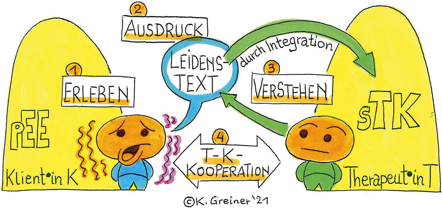
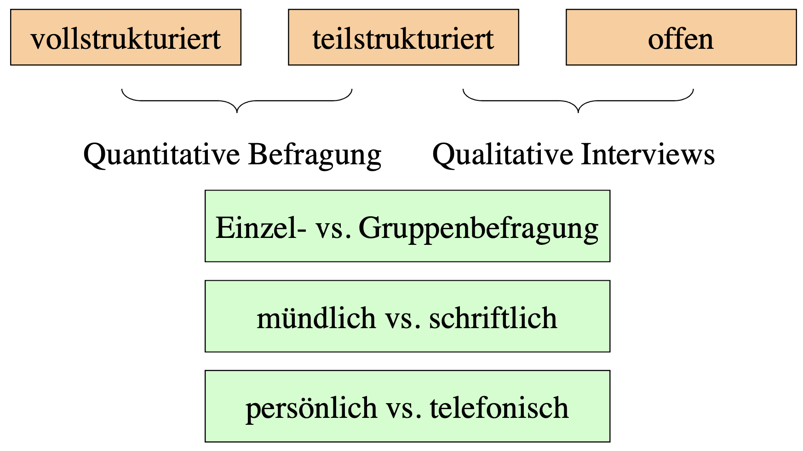
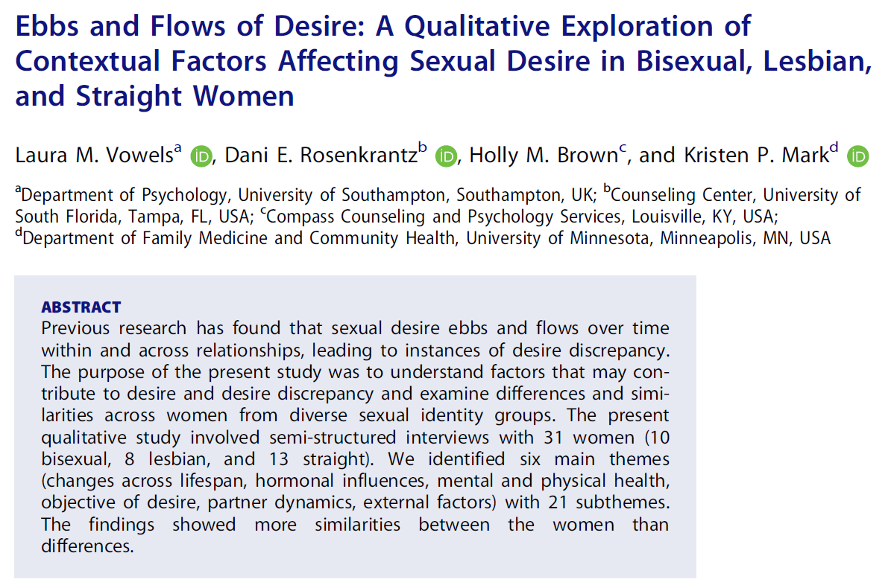
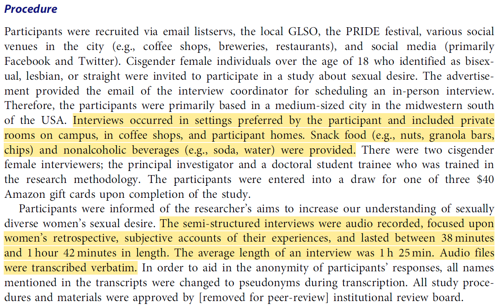
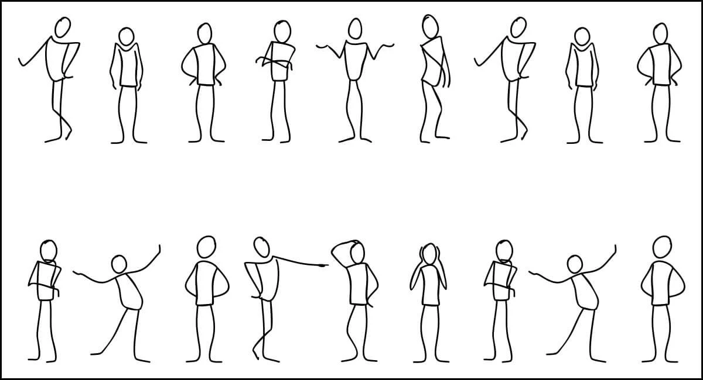
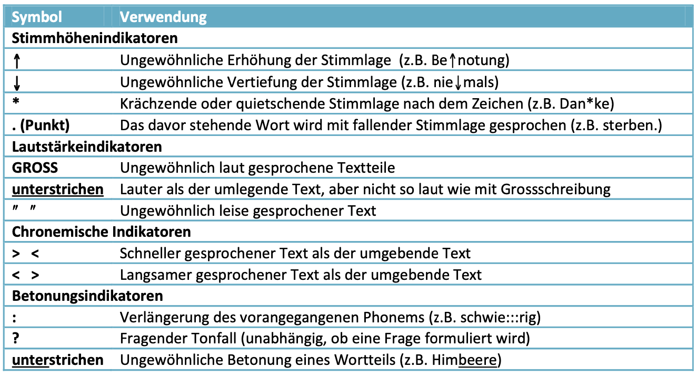
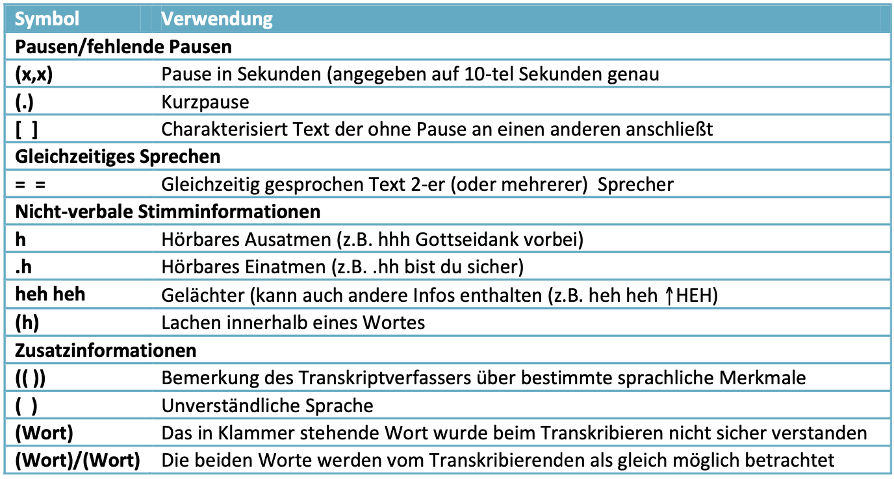
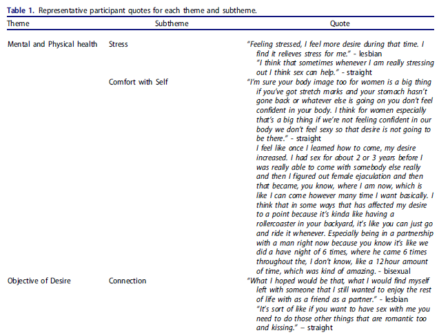

```{r setup, include=FALSE}
options(htmltools.dir.version = FALSE)

library(tidyverse)
library(kableExtra)
library(ggplot2)
library(plotly)
library(htmlwidgets)
library(MASS)
library(ggpubr)
library(xaringanthemer)
library(xaringanExtra)

style_duo_accent(
  primary_color = "#621C37",
  secondary_color = "#EE0071",
  link_color = "#7da5f5",
  background_image = "blank.png"
)

xaringanExtra::use_xaringan_extra(c("tile_view"))

use_scribble(
  pen_color = "#EE0071",
  pen_size = 4
  )

knitr::opts_chunk$set(
  fig.retina = TRUE,
  warning = FALSE,
  message = FALSE
)
```

name: Title slide
class: middle, left
<br><br><br><br><br><br><br>
# Einführung in die Forschungsmethoden der Psychologie und Psychotherapie

### Einheit 6: Qualitative Methoden: Verstehen des Einzelfalls
##### 06.06.2024 | Dr. Caroline Zygar-Hoffmann


---
class: top, left
### Hinweise zum Gastvortrag

Folien sind schon hochgeladen, aber Hinweise welche Folien prüfungsrelevant sind folgen nach der heutigen VL $\rightarrow$ Möglichkeit für Fragen dann in der nächsten Sitzung

---
class: top, left
### Hinweise zur Prüfung

* Meine Aussagen zu Prüfungsfragen gelten für diese Vorlesung -- für die Vorlesung von Patricia Garatva gelten die Sachen, die sie gesagt hat

* Es wird Wissen (z.B. Fachbegriffe) UND Verständnis (z.B. Beschreibung von Konzepten) abgefragt

* Fragen sind auch über Vorlesungseinheiten hinweg möglich

---
class: top, left

### Prüfungsfragen

* **Lückentexte**: "Objektivität kann bei der Verhaltensbeobachtung durch Kennzahlen zur \_\_______________\_\_ erfasst werden."

* **Offene Fragen**: "Nennen Sie die vier Ziele der wissenschaftlichen Psychologie."

* **MC-Fragen**: Frage die den Kontext beschreibt, 3 Aussagen dazu $\rightarrow$ jede Aussage als richtig oder falsch markieren.

"Was trifft auf Gütekriterien zu?"
1. Reliabilität ist ein Nebengütekriterium.
2. Wenn ein Messinstrument reliabel ist, kann man auch davon ausgehen, dass es valide ist.
3. Es gibt konkrete Maßnahmen, um die Güte von Indikatoren in einer Verhaltensbeobachtung zu verbessern.

---
class: top, left
name: content
### Heutige Themen

#### [Notwendigkeit Qualitativer Methoden](#notwendigkeit)

#### [Quantitative vs. Qualitative Methoden](#vs)

#### Qualitative Datenerhebung
* [Qualitative Interviews](#interviews)
* [Gruppenbefragungen](#gruppen)
* [Non-reaktive Verfahren](#nonreaktiv)
* [Historiographische und biographische Methoden](#bio)
* [Teilnehmende Feldforschung (Ethongraphie)](#ff)

#### [Qualitative Datenauswertung](#auswertung)

#### Take-Aways und Schlüssel-/Fachbegriffe
* [Take-Aways](#take-away)
* [Schlüssel-/Fachbegriffe](#words)

---
class: top, left
name: notwendigkeit
### Notwendigkeit Qualitativer Methoden

**Ziel quantitativer/naturwissenschaftlicher Methoden: **

* Identifikation möglichst objektiv geltender Gesetzmäßigkeiten

**Besonderheit Mensch als Untersuchungsobjekt:**

* Menschliches Verhalten und Empfinden ist sehr variabel (und es gibt viele Abweichungen von "im Mittel gefundenen Gesetzmäßigkeiten")

* gültige (valide) Forschung muss das in Betracht ziehen

* qualitative Forschung führt häufig zu gültigen Ergebnissen mit hohem Informationsgehalt für den Einzelfall

* qualitative Forschung: eher geisteswissenschaftliche Ausrichtung statt naturwissenschaftlicher Ausrichtung 


---
class: top, left
### Notwendigkeit Qualitativer Methoden

#### Subjektive Wahrheiten

**Beispiel:**

* Ein Patient leidet im Rahmen einer Psychose an Wahnvorstellungen

* Definition Wahnvorstellung = unangemessene und falsche Interpretation der Umwelt

* Wahninhalt: Er wird vom Geheimdienst beobachtet und in seiner Wohnung abgehört.

* Reaktion: 

  * sozialer Rückzug
  * umfassende Erinnerungsfehlinterpretationen
  * Misstrauen Umfeld gegenüber
  * ...
  
* Frage: Objektive "Wahrheit" der wahrgenommenen Bedrohung? 


---
class: top, left
### Notwendigkeit Qualitativer Methoden

#### Hermeneutik - Annäherung an die subjektive Wahrheit

* **Qualitative Methode der Textanalyse/Schriftinterpretation**: Texte auf verstehende Weise auslegen $\rightarrow$ Auslegekunst, Interpretationskunst

* **Anwendungsfälle**: Trauminterpretation, Lebensgeschichte, Gespräche

* **Prozess**:
  * beginnend mit Grundverständnis (häufig Texte, Bilder etc.), das als Hintergrund für Feinanalysen verwendet wird
  * an Teilen erzieltes Verständnis wird auf Grundverständnis rückbezogen
  * schrittweise Wiederholung des Verfahrens für ein verbessertes Gesamtverständnis

---
class: top, left
### Notwendigkeit Qualitativer Methoden

#### Hermeneutik - Annäherung an die subjektive Wahrheit

* "**Empathie-Hermeneutik**" (Jung, 2001, S. 63): methodisch nicht kontrollierbares Sich-Einfühlen einer Seele in eine andere Seele

.center["Höchste Vollkommenheit in der Auslegung ist nach Schleiermacher dann erreicht, wenn durch die Interpretation der Autor bzw. die Autorin besser verstanden wird, als er/sie von sich selbst Rechenschaft geben könne (Jung 2001, S. 64)." (Sichler, 2018)]

* Historiker und Philosoph **Wilhelm Dilthey** (1833–1911): 
  * Verstehen als Kunstwissenschaft
  * Trias: Erleben – Ausdruck – Verstehen

---
class: top, left
<div class="footer"><span>Greiner, K. (2021). Das hermeneutische Grundprinzip der Psychotherapie - Ein psychotherapiewissenschaftstheoretischer Comicstrip. à jour! Psychotherapie-Berufsentwicklung 7 (14), 35–37. https://doi.org/10.30820/2504-5199-2021-2-35</div>

### Notwendigkeit Qualitativer Methoden

#### Hermeneutik - Annäherung an die subjektive Wahrheit

.pull-left[
**1. Erleben:** Klient erlebt Subjektives (Ängste, Konflikte, Irritationen etc.) im Rahmen der persönlichen Erlebens- und Erfahrungswelt (pEE)

**2. Ausdruck:** Klient artikuliert das subjektive Erleben in der therapeutischen Situation, indem er verbalen und nonverbalen Leidenstext produziert

**3. Verstehen:** Therapeut macht sich den Leidenstext des Klienten professionell verständlich, indem er ihn in den Denk- und Handlungskontext der eigenen spezifischen Therapiekultur (sTK) integriert

**4. Therapeut-Klient-Kooperation:** Gemäss dieser besonderen Trias (1–2–3) gestalten sich konkrete professionelle Formen psychotherapeutischen Kommunizierens, Interagierens und Intervenierens
]

.pull-right[
```{r eval = TRUE, echo = F, out.width = "80%"}

```

Ausführliches Fallbeispiel für hermeneutisch-empathischen Reflexionsprozess, der für Diagnostik in der personenzentrierten Psychotherapie herangezogen wird (ab Seite 331): Keil, S. (2022). *Diagnostik in der Personzentrierten Psychotherapie*. In C. Höfner & M. Hochgerner (Hrsg.). Psychotherapeutische Diagnostik, S.323-336. Springer.
]

---
class: top, left
name: vs
### Quantitative vs. Qualitative Methoden

Quantitative vs. qualitative Methoden als extreme Kontraste dargestellt (ist nicht immer so schwarz-weiß):

.pull-left[
**Quantitative Methoden**

* nomothetisch 
* naturwissenschaftlich 
* Labor
* explanativ 
* ahistorisch
* partikulär
* erklären
* messen
* Stichprobe
* Verhalten
]

.pull-right[
**Qualitative Methoden**

* idiografisch 
* geisteswissenschaftlich 
* Feld
* explorativ
* historisch
* holistisch
* verstehen
* beschreiben
* Einzelfall
* Erleben
]

---
class: top, left
### Quantitative vs. Qualitative Methoden

**Nomothetisch vs. Idiographisch**

.pull-left[
**Quantitative Methoden**

Nomothetisch
* generalisierend

* Ziel: allgemeine Gesetze formulieren

* strebt universelle Gültigkeit an
]

.pull-right[
**Qualitative Methoden**

Idiographisch

* individualisierend

* Ziel: einzelne Sachverhalte beschreiben

* strebt umfassende Beschreibung an
]

Von Windelband (1894) eingeführte Unterscheidung zur Charakterisierung natur- und geisteswissenschaftlichen Vorgehens

---
class: top, left
### Quantitative vs. Qualitative Methoden

**Labor vs. Feld**

.pull-left[
**Quantitative Methoden**

Labor

* unter kontrollierten Bedingungen

* zugeschnitten auf die Forschungsfrage

Folgen:
  * hohe interne Validität
  * niedrige ökologische Validität

Z.B. Untersuchungen der Wirkung von Fließbandarbeit auf die Ermüdung im Labor
]

.pull-right[
**Qualitative Methoden**

Feld

* unter vorgefundenen Bedingungen

* unter dem Einfluss auch nicht auf die Forschungsfrage zugeschnittener Variablen

Folgen:
  * niedrige interne Validität
  * hohe ökologische Validität

Z.B. Untersuchung des Vergessens von Schulstoff in einer Felduntersuchung
]

Hinweis: 
**hohe interne Validität**: eindeutige Schlussfolgerung bezüglich der Wirkbeziehung zwischen Variablen möglich

**hohe ökologische Validität**: Übertragbarkeit der Ergebnisse auf Alltagsgeschehen möglich
---
class: top, left
### Quantitative vs. Qualitative Methoden

**Partikulär vs. Holistisch**

.pull-left[
**Quantitative Methoden**

Partikulär

* auf ein spezifisches Element eines Sachverhalts ausgerichtet

* Ausklammern von sozialen, historischen, etc. Kontextbedingungen

* geht davon aus, dass sich komplexe Zusammenhänge aus Teilbedingungen ergeben
]

.pull-right[
**Qualitative Methoden**

Holistisch

* auf das Ganze (eines einzelnen Sachverhalts) gerichtet

* Berücksichtigung von gesellschaftlichen und historischen Rahmenbedingungen

* geht davon aus, dass das Ganze mehr ist als die Summe seiner Teile
]

---
class: top, left
### Quantitative vs. Qualitative Methoden

**Explanativ vs. Explorativ**

.pull-left[
**Quantitative Methoden**

Explanativ

* Ziel ist die Ableitung von Erleben und Verhalten aus Gesetzmäßigkeiten

* strebt Erklärung von Sachverhalten an

* Hypothesenprüfend

]

.pull-right[
**Qualitative Methoden**

Explorativ

* Ziel ist die umfassende Erkundung eines Gegenstandsbereichs

* strebt Beschreibung von Sachverhalten an

* Hypothesengenerierend
]

Merke: Quantitative und qualitative Untersuchungen sind sowohl explanativ wie explorativ, lediglich die Schwerpunkte sind unterschiedlich

---
class: top, left
### Quantitative vs. Qualitative Methoden

**Erklären vs. Verstehen**

.pull-left[
**Quantitative Methoden**

Erklären

* Gesetzmäßigkeiten im Erleben und Verhalten

* es wird vorausgesetzt, dass solche Gesetzmäßigkeiten existieren

* Erleben und Verhalten werden von Ursachen bestimmt
]

.pull-right[
**Qualitative Methoden**

Verstehen

* Nachvollziehen von Erleben und Verhalten

* es wird vorausgesetzt, dass es möglich ist, die "inneren Gründe" der Akteure zu verstehen

* Erleben und Verhalten kann man nicht durch äußere, beobachtbare Ursachen erklären (oder es birgt wenig Mehrwert)
]

Merke: Weder quantitative noch qualitative Ansätze kommen ohne Erklären und Verstehen aus

---
class: top, left
### Quantitative vs. Qualitative Methoden

Die Wahl der Methode richtet sich

  1. nach dem Problem

  2. nach dem theoretischen Hintergrund

  3. nach den vorhandenen Ressourcen

  4. nach dem eigenen Ausbildungsstand
  
Merke:

* Im Allgemeinen kann ein und dasselbe Problem mit unterschiedlichen Methoden bearbeitet werden.

* Die Wahl der Methode legt aber zugleich fest, was nicht  bearbeitet werden kann.

* Auch "Mixed Methods"-Ansätze die quantitative und qualitative Methoden vereinen sind möglich und können sehr lohnend sein

---
class: top, left
<div class="footer"><span>Hulsmans, D. H., Otten, R., Poelen, E. A., van Vonderen, A., Daalmans, S., Hasselman, F., ... & Lichtwarck-Aschoff, A. (2024). A complex systems perspective on chronic aggression and self-injury: case study of a woman with mild intellectual disability and borderline personality disorder. <i>BMC psychiatry, 24</i>(1), 378</div>

### Quantitative vs. Qualitative Methoden

**Einzelfallstudie, die quantitative und qualitative Forschung verbindet:**

.pull-left[
```{r eval = TRUE, echo = F}
knitr::include_graphics("bilder/hulsmans1.png")
```
]

.pull-right[
```{r eval = TRUE, echo = F}
knitr::include_graphics("bilder/hulsmans2.png")
```
]

---
class: top, left
### Quantitative vs. Qualitative Methoden

**Gütekriterien in qualitativer Forschung**:

* Objektivität: interpersonaler Konsens, Transparenz im Vorgehen

* Reliabilität: Nicht im Sinne von Wiederholbarkeit der Messung, aber im Sinne von inhaltlicher Zuverlässigkeit der produzierten Texte, vermischt sich mit Validität

* Validität: In Hinblick auf Authentizität der Äußerungen, Angemessenheit der Darstellung in Beobachtungsprotokollen, Repräsentativität von Material und Interpretation für zu messende Variablen (~ Inhaltsvalidität)

---
class: top, left
### Quantitative vs. Qualitative Methoden

**Qualitative Datenerhebung:**
* Einzelinterviews, z.B.
  * Narratives Interview
  * Problemzentriertes Interview
  * Fokussiertes Interview
* Gruppenbefragungen (kann auch Interview beinhalten)
* Nonreaktive Verfahren
  * Archivstrategien
  * Physische Spuren
* Historiographische und biographische Methoden
* Teilnehmende Feldforschung

**Häufiges Vorgehen bei der Qualitativen Datenanalyse:**
* Transkription
* Codierung
* Inhaltsanalyse

---
class: top, left
name: interviews

### Qualitative Datenerhebung

#### Qualitative Interviews

**Grad der Strukturierung von Interviews:**

.center[
```{r eval = TRUE, echo = F, out.width = "600px"}

```
]

Im Folgenden werden wir spezieller auf mündliche Interviews eingehen, aber auch schriftliche Befragungen mit offenen Antworten sind in der qualitativen Forschung sehr üblich.

<!-- Beispiel: Expertenbefragung zum Thema "Was macht ein gutes Experience Sampling Item aus (siehe Einheit 9 zu digitaler Datenerhebung am Smartphone) -->

---
class: top, left
### Qualitative Datenerhebung

#### Qualitative Interviews

##### Narratives Interview

* offenste Form des Interviews

* Besteht hauptsächlich aus einer Stegreif– oder Spontanerzählung

* Interviewer:in initiiert Bericht durch Erzählaufforderung, die maximal offen sein sollte

* Nachfragen (z.B. zum Verständnis von Situationen) sind möglich, ansonsten hält Interviewer:in sich zurück

* Die Person hat monologisches Rederecht

* Problemstellungen oder die Forschungsfragen werden nicht im Erzählanstoß angesprochen

* Vorteil: Problemstellung wird nur dann thematisiert, wenn sie auch für die Person relevant ist

---
class: top, left
### Qualitative Datenerhebung

#### Qualitative Interviews

##### Problemzentriertes Interview

* Leitfaden*orientiertes* Interview mit Fragen und Nachfragen

* Diese dienen als Kontrolle und nicht zur Festlegung des Ablaufes

* Dialogisch ( $\rightarrow$ Ablauf ist ähnlich einem natürlichen Gespräch), am Thema/Problem orientiert

* essentielle Fragen und – wenn nötig – die vorformulierten Nachfragen sollen aber vorkommen

* Spontane Fragen sind möglich


---
class: top, left
<div class="footer"><span>Vowels, L. M., Rosenkrantz, D. E., Brown, H. M., & Mark, K. P. (2020). Ebbs and flows of desire: A qualitative exploration of contextual factors affecting sexual desire in bisexual, lesbian, and straight women. <i>Journal of Sex & Marital Therapy, 46</i>(8), 807-823.</span></div>

### Qualitative Datenerhebung

#### Qualitative Interviews

##### Problemzentriertes Interview

.pull-left[
```{r eval = TRUE, echo = F}

```
]

.pull-right[
```{r eval = TRUE, echo = F}

```
]

---
class: top, left
### Qualitative Datenerhebung

#### Qualitative Interviews

##### Fokussiertes Interview

* Leitfaden*orientiertes* Interview mit Fragen und Nachfragen

* Besonderheit: Es werden bestimmte Stimuli vorgegeben 
  * Fotos
  * Videos
  * Objekte
  * Situationen
  * ...

* Kann in unterschiedlichen Zusammenhängen eingesetzt werden (je nach Stimulus)

* situationsspezifische Gesprächsführung: welche Bedeutung misst die befragte Person einzelnen Teilen oder Elementen bei? Assoziationen erwünscht


---
class: top, left
<div class="footer"><span>Kuhn, P. (2003). Thematische Zeichnung und fokussiertes, episodisches Interview am Bild–Ein qualitatives Verfahren zur Annäherung an die Kindersicht auf Bewegung, Spiel und Sport in der Schule. In Forum Qualitative Sozialforschung/Forum: Qualitative Social Research (Vol. 4, No. 1). </span></div>

### Qualitative Datenerhebung

#### Qualitative Interviews

##### Fokussiertes Interview

.center[
```{r eval = TRUE, echo = F, out.width="50%"}
knitr::include_graphics("bilder/fokussiertes_interview.png")
```
]

---
class: top, left
### Qualitative Datenerhebung

#### Qualitative Interviews

##### Arbeitsschritte bei qualitativen Interviews

```{r echo = F}

df = data.frame(
  Phase = c("Inhaltliche Vorbereitung",
            "Organisatorische Vorbereitung",
            "Prolog",
            "Durchführung",
            "Epilog",
            "Protokoll",
            "Dokumentation"),
  Aufgaben = c("Festlegung des Befragungsthemas, theoretische Überlegungen zur Auswahl der Personen, Wahl der Befragungstechnik, Formulierung der Fragen",
               "Kontaktaufnahme, Zusammenstellung des Materials, Schulung der Interviewer",
               "Vorstellung, Herstellen einer angenehmen Gesprächsatmosphäre, Überprüfung der Aufzeichnungsgeräte (Tonband, Video,...), Datenschutz",
               "Überwachung und Steuerung des Gesprächsablaufs",
               "Abschluss der Aufzeichnung, Feedback beachten, Verabschiedung, ggf. Infomaterial hinterlassen",
               "Unmittelbar nach Interview Gedächtnisprotokoll anfertigen",
               "Transkription, Materialzusammenstellung")
)

df %>%
  kbl() %>%
  kable_styling(font_size = 18) %>%
  kable_classic(full_width = T)
```

---
class: top, left
### Qualitative Datenerhebung

#### Qualitative Interviews

##### Inhaltliche Vorbereitung: Fragetypen

* Essentielle Fragen: 
  * betreffen die wesentlichen Forschungsfragen 
  * sind deshalb unverzichtbar
  * müssen daher auch in jedem Interview vorkommen
* Zusatzfragen: 
  * betreffen ebenfalls die wesentlichen Forschungsfragen
  * verwenden aber eine andere Formulierung oder beleuchten sie von einem anderen Blickwinkel
* Wegwerffragen: 
  * Fragen zum Aufwärmen  
  * Fragen zur Ablenkung 
  * Fragen zur Erholung von einem sensiblen Thema
* Nachfragen: 
  * Fragen zur näheren Erläuterung oder Vertiefung einer Aussage
  * können vorgesehen oder nicht vorgesehen sein
 
---
class: top, left
<div class="footer"><span>Hoyer, J., Jacobi, F., & Leibig, E. (2003). Gesprächsführung in der Verhaltenstherapie. In Lehrbuch der Psychotherapie. Verhaltenstherapie (Vol. 2) (pp.85-102)</span></div>

### Qualitative Datenerhebung

#### Qualitative Interviews

##### Inhaltliche Vorbereitung: Fehler bei der Formulierung von Fragen

.pull-left[
* affektive statt neutrale Formulierung
* überkomplexe statt einfache Fragen
* Jargon statt allgemeinverständliche Wörter
* Suggestivfragen
  * "Sie werden doch wohl nicht behaupten..."
* Induzierung knapper Antworten
  * "Geht es Ihnen am Wochenende besser?"
* Unzulässige Voraussetzungen in der Frage
  * "Wie gehen Sie mit Untreue in Ihrer Parterschaft um?"
* zu starke Einengung auf die Problemstellung
]

.pull-right[
```{r eval = TRUE, echo = F}
knitr::include_graphics("bilder/jargon.png")
```
]

---
class: top, left
### Qualitative Datenerhebung

#### Qualitative Interviews

##### Prolog

* Vorstellen
  * z.B. Visitenkarte, etc.
  
* Small-Talk
  * kein heikles Thema
  
* Erklären des Untersuchungszwecks
  * Einverständniserklärung einholen
  
* Aufzeichnungen erklären, Hemmnisse abbauen
  * Aufzeichnung meist unverzichtbar

---
class: top, left
### Qualitative Datenerhebung

#### Qualitative Interviews

##### Durchführung - Gesprächstechniken

.pull-left[
* eigene Reaktionen beobachten, negative (non-)verbale Reaktionen vermeiden

* aufmerksam zuhören

* auf unausgesprochene Voraussetzungen achten (z.B. "Sie kennen das ja...")

* auf unklare/abweichende Verwendung von Begriffen achten

* keine Wertungen äußern
]

.pull-right[
* abgehandelte Theme mental notieren, fehlende im Auge behalten

* Person niemals unterbrechen

* wenn Gespräch in unerwünschte Richtung geht, behutsam zurücklenken

* starke emotionale Reaktionen der Person abgeschwächt spiegeln (z.B. Lachen $\rightarrow$ Lächeln, Weinen $\rightarrow$ ernste Miene)

* zugewandte Körpersprache
]

---
class: top, left
### Qualitative Datenerhebung

#### Qualitative Interviews

##### Durchführung - Gesprächstechniken

**Echo (Paraphrase):**

* Zusammenfassende Wiederholung des Gesagten

* Demonstriert, dass man zugehört hat

* Animiert zum Weitersprechen

Vorsicht:
* Keine neuen Begriffe einbringen
* Keine Interpretationen
* bloße (evtl. verkürzte) Wiederholung

---
class: top, left
### Qualitative Datenerhebung

#### Qualitative Interviews

##### Durchführung - Gesprächstechniken

**Schweigen:**

* unverzeichtbares Mittel der Interviewführung

* bewusstes, geduldiges Schweigen 
  $\rightarrow$ keine Eile 
  $\rightarrow$ es geht um ausführliche, detaillierte Schilderung

* gemeinsames Schweigen (welches nicht als unangenehm wahrgenommen wird) fördert Intimität und Öffnung der Person


.center[
```{r eval = TRUE, echo = F, out.width = "300px"}

```
]


<!-- **Körpersprache:** -->

<!-- <small> -->

<!-- .pull-left[ -->

<!-- * Bewegung nach vorne -->
<!--   * Deutung 1: Zustimmung und Interesse -->
<!--   * Deutung 2: Versuch in Intimsphäre einzudringen -->
<!-- * Bewegung nach hinten -->
<!--   * Deutung 1: Ablehnung, Langeweile -->
<!--   * Deutung 2: Raum geben -->
<!-- * Überschlagen der Beine und insbesondere der Arme -->
<!--   * Deutung: Verschlossenheit -->
<!-- * Ständiges Verändern der Körperhaltung -->
<!--   * Deutung: Ausdruck der Unruhe -->
<!-- * Schiefhalten des Kopfes -->
<!--   * Deutung: Ausdruck des Zweifelns -->
<!-- * Nicken/Kopfschütteln -->
<!--   * Zustimmung/Ablehung bzw. Erstaunen -->
<!-- ] -->
<!-- </small> -->

<!-- .pull-right[ -->
<!-- .center[ -->
<!-- ```{r eval = TRUE, echo = F, out.width = "3000px"} -->
<!--  -->
<!-- ``` -->
<!-- ] -->
<!-- ] -->

---
class: top, left
### Qualitative Datenerhebung

#### Qualitative Interviews

##### 10 Gebote für den/die Interviewer:in (Berg, 2000)

.pull-left[
1) Nicht mit der Tür ins Haus fallen

2) Zweck des Interviews im Auge behalten

3) Natürlich wie im Alltagsgespräch bleiben

4) Anteilnahme zeigen, ohne zu übertreiben

5) An eigenes Aussehen denken (keine zu große Distanz zum Milieu)
]

.pull-right[
6) Komfortablen Ort wählen

7) Nicht mit einsilbigen Antworten zufrieden geben

8) Höflich und interessiert sein

9) So oft wie möglich üben

10) Freundlich und dankbar sein
]

---
class: top, left
### Qualitative Datenerhebung

#### Qualitative Interviews

##### Durchführung - Epilog

* Abschalten des Aufzeichnungsgeräts markiert Ende des Interviews

* Nachfolgendes Gespräch aufmerksam verfolgen (Protokollieren)

* Bedrohliche oder belastende Inhalte $\rightarrow$ Telefonnummer hinterlassen (Nachbetreuung)

* Noch einmal auf Anonymität hinweisen

---
class: top, left
name: gruppen

### Qualitative Datenerhebung

#### Gruppenbefragungen

* Brainstorming (Osborn 1957)
  * Ideen und Lösungsvorschläge werden zu einem Thema gesammelt
  * keine Kritik an den einzelnen Vorschlägen
  * keine Bewertung
  
* Fokusgruppen (Lewin 1936, Lazarsfeld 1946, Merton 1955)
  * Moderationsgeleitete Diskussion in kleinen Gruppen (vorgegebenes Thema)
  
* Gruppeninterview (Abrams 1949)
  * Personen, meist natürlicher Gruppen (z.B. Familie) werden mit Leitfaden befragt
  
* Moderationsmethode (Klebert et al. 1984)
  * Moderierter Gruppenprozess unter Verwendung diverser Methoden (multimethodal: z.B. o.g. Brainstorming, Gruppendiskussionen, Visualisierungen)

---
class: top, left
name: nonreaktiv

### Qualitative Datenerhebung

#### Nonreaktive Verfahren

##### Definition

* Methoden, bei deren Durchführung kein Einfluss auf die untersuchten Personen, Ereignisse oder Prozesse ausgeübt wird.

* auch "Unobtrusive Measures" oder "Nonintruding Measures"

* Wie kann dies erreicht werden?
  * Vorgang der Datenerhebung wird nicht bemerkt
  * Es werden nur "Spuren" des Verhaltens beobachtet

* Beobachter:in/Forscher:in kann keine störenden Reaktionen auslösen (Interviewer-, Versuchsleitereffekte) 

---
class: top, left
### Qualitative Datenerhebung

#### Nonreaktive Verfahren

##### Archivstrategien

.pull-left[
Öffentliche Archive: 
* Archive, die für einen bestimmten Zweck angelegt und einem bestimmten Personenkreis zugänglich sind
  * Geburts- und Sterbebücher 
  * Adoptionsregister
  * Krankenhausaufnahmen, Unfallstatistiken
  * Wohnung-, Verkaufs- und Betriebsstatistiken
  * Entlehnungen (Bibliotheken etc.)
  * Fahrpläne, Tourismus- und Verkehrsstatistiken
  * Videoaufzeichnungen von Überwachungskameras
]

.pull-right[
Private Archive: 
* Archive, die meist für einen privaten Zweck einer Person oder einer kleinen Gruppe angelegt werden oder sich ansammeln 
  * Autobiographien
  * Briefwechsel
  * Tagebücher, Protokolle 
  * Fotos
]

---
class: top, left
### Qualitative Datenerhebung

#### Nonreaktive Verfahren

##### Archivstrategien

**Beispiele:**

* Untersuchung des Briefwechsels polnischer Einwanderer mit in der Heimat zurückgebliebenen (Thomas & Znaniecki 1927).

  $\rightarrow$ Der Kulturschock für die Einwanderer konnte mit diesem Mittel deutlich gemacht werden.

* Verwendung von Tagebüchern zur Untersuchung der Zeitverwendung bei den Arbeitslosen von Marienthal (Jahoda, Lazarsfeld und Zeisel, 1933) 

  $\rightarrow$ Auswirkungen der Arbeitslosigkeit auf den Alltag und die Stimmung

---
class: top, left
### Qualitative Datenerhebung

#### Nonreaktive Verfahren

##### Archivstrategien

**Beispiel: Abschiedsbriefe vor Suizid (Jacobs 1967)**

.pull-left[
* Untersuchung von 112 Abschiedsbriefen verfasst von Personen aus dem Großraum Los Angeles

* Kategorisierung:
  * Erlebnisse kurz vor Suizid
  * Soziale Gründe für Nicht-Durchführung Suizid
  * Wünsche/Regelungen für Hinterbliebene

* Zusätzlich: Interviews mit Hinterbliebenen

* Bestimmte Regelmäßigkeiten (z.B. die Bitte um Verzeihung) konnten gefunden werden.
]


.pull-right[.center[
```{r eval = TRUE, echo = F, out.width = "300px"}

```
]]

---
class: top, left
### Qualitative Datenerhebung

#### Nonreaktive Verfahren

##### Physische Spuren

.pull-left[
**Nutzungsspuren**: Bei dieser Methode werden Gegenstände, Materialien etc. auf den **Grad ihrer Nutzung oder auf Hinweise der Art der Nutzung** untersucht
  * Abgetretene Teppiche als Indikator für häufig begangene Wege
  * Abnutzung von Parkbänken als Indikator für angenehme Umweltbedingungen
  * Abgegriffene Seiten, Randbemerkungen etc. in Büchern
  * Untersuchung, auf welche Sender Radios oder Fernseher eingestellt sind
  * ...
]

.pull-right[
**Zuwachsspuren**: Bei dieser Methode werden Ansammlungen von Dingen (also deren **Auftreten**) über die Zeit ermittelt
  * Analyse von Müll und Abfall
  * Untersuchung von Graffiti
  * Tapetenschichten zur Untersuchung der Veränderung des ästhetischen Empfindens
  * Verwendung bestimmter Symbole (Aufkleber, Abzeichen, etc.)
  * ...
]

---
class: top, left
### Qualitative Datenerhebung

#### Nonreaktive Verfahren

##### Verhaltensbeobachtung

.pull-left[
**Induziertes Verhalten:**
* Personen nicht bewusst, dass ihr Verhalten direkt oder indirekt beobachtet wird
* werden dazu gebracht, bestimmte Eigenschaften, Einstellungen etc. zu zeigen
* Beispiel: Lost-Letter Technik (Milgram, 1965)
  * Auslegen von Briefen, die an bestimmte Personen oder Einrichtungen gerichtet sind, als wären sie verloren gegangen
  * Ermittelung, wie viele den (fingierten) Adressaten erreichen.
  * Indikator für das Ansehen der Person oder Institution 
]

.pull-right[
**Spontanverhalten:**
* Personen werden ohne ihr Wissen beobachtet
* Beispiele
  * Messung der Gehgeschwindigkeit in der Studie ‚Die Arbeitslosen von Marienthal‘
  * Feldbeobachtung von Kundenverhalten in einer Warteschlange
  * Beobachtung des Ausparkens in Abhängigkeit vom Parkplatzbedarf
]

---
class: top, left
name: bio

### Qualitative Datenerhebung

#### Historiographische und biographische Methoden

* Methoden zur Entschlüsselung historiographischer (geschichtlicher) und biographischer (lebensgeschichtlicher), vergangener Ereignisse auf Basis von Quellen

* Biographische Methoden sind Spezialfälle der Historiographie

* Untersuchung und Erklärung von Zusammenhängen und deren wirkungsgeschichtlicher Bedeutung (kein reines Aneinanderreihen von Fakten)

* Sowohl idiografische Biographie-Forschung, als auch Vergleich von Biographien zur Erklärung personenbezogener und gesellschaftlicher Phänomene

Quellen:
1. Primärquellen
  * schriftliche oder mündliche Schilderungen von Augenzeugen
  * direkt mit Ereignis oder seinem Ergebnis verknüpft
2. Sekundärquellen
  * keine unmittelbaren Augenzeugen
  * Hörensagen oder auf Basis wissenschaftlicher Bechäftigung

---
class: top, left

### Qualitative Datenerhebung

#### Historiographische und biographische Methoden

**Übung: Nehmen Sie die Lebensgeschichte eines älteren Verwandten auf**
 
* Lassen Sie ihn/sie über die Kindheit und Jugend erzählen

* Konzentrieren Sie sich dabei auf die erlebten und faktischen Lebensumstände (z.B. wie wurde geheiratet, was gab es als
Hochzeitsschmaus, woher kam das Hochzeitskleid usw.)

* Lassen Sie beurteilen, was ihm/ihr gut und was weniger gut in Erinnerung ist

* Stellen Sie sicher, dass möglichst genaue Zeitangaben gemacht werden

* Versuchen Sie dann Bezüge zur historischen Situation herzustellen

* Überprüfen Sie Validität und Reliabilität anhand privater/historischer Dokumente

---
class: top, left
name: ff

### Qualitative Datenerhebung

#### Teilnehmende Feldforschung (Ethnographie)

* Teilnehmende Beobachtung realer sozialer Situationen.

* Historisch geht dieser Ansatz auf die Kulturanthropologie
und Ethnologie zurück

* Gehört zu den aufwendigsten Forschungsstrategien.

* Ergebnis: möglichst umfassendes Verständnis der Funktionsweise eines sozialen Systems 
  * **Makroethnographie:** Soziales System im Ganzen 
  * **Mikroethnographie:** Soziales System in Teilaspekten

---
class: top, left
### Qualitative Datenerhebung

#### Teilnehmende Feldforschung (Ethnographie)

**Beispiele:**

* Untersuchung von Straßengangs, Obdachlosen und Ghettobewohnern seit den 20er Jahren
(z.B. Street Corner Society, Whyte, 1943)

* Gruppen von Drogenabhängigen (Agar, 1973)

* Vernachlässigte Jugendliche (Dodge et al. 1982)

* Untersuchung von Eliten (Hertz & Imber, 1993)

* Gefängnis als soziale Welt (Jones, 1995)

* Schulcliquen (Peshkin, 1986)

* Psychiatrische Klinik (Rosenhan, 1973)

---
class: top, left
### Qualitative Datenerhebung

#### Teilnehmende Feldforschung (Ethnographie)

**Beispiele: Die Arbeitslosen von Marienthal (Jahoda, Lazarsfeld & Zeisel, 1933)**

<small>
.pull-left[
* Studie zeigte die sozio-psychologischen Wirkungen von Arbeitslosigkeit auf

* Langzeitarbeitslosigkeit führt nicht – wie vielfach angenommen – zu Revolte, sondern zu Einsamkeit und passiver Resignation 

* Musterbeispiel der Theoriebildung in Kombination von quantitativen, qualitativen, vorgefundenen und erhobenen Daten

* 15 Forscher:innen:
  * Kontakt zu politischen und gesellschaftlichen Gruppen
  * Kleidersammlungen, ärztliche Sprechstunden, Erziehungsberatungen, Turn- und Zeichenkurse
]

</small>

.pull-right[.center[
```{r eval = TRUE, echo = F, out.width = "300px"}

```
]]


---
class: top, left
### Qualitative Datenerhebung

#### Teilnehmende Feldforschung (Ethnographie)

**Rolle der Forscher:in:**

* Möglichkeiten gehen von überwiegender Beobachtung bis zu voller Teilnahme

* richtet sich u.a. nach der Art der Gruppe (z.B. Cliquen)

* Teilnahme im öffentlichen Raum leichter als in geschlossenen Systemen (z.B. Arbeitsteams)

---
class: top, left
### Qualitative Datenerhebung

#### Teilnehmende Feldforschung (Ethnographie)

**Unsichtbar werden:**

* Gewohnheit: 
  * ständige Anwesenheit wird mit der Zeit zur Normalität

* Anpassung: 
  * wenn man sein Erscheinungsbild an die Umstände anpasst
  
* Aufbau persönlicher Beziehungen
  * Sympathie für den Forscher $\rightarrow$ über seinen Status hinweg sehen
  
* Täuschung:
  * wahres Forschungsinteresse verschweigen

---
class: top, left
### Qualitative Datenerhebung

#### Teilnehmende Feldforschung (Ethnographie)

**Gatekeeper und Schlüsselinformanten:**

* oft ist Einstieg ohne Hilfe von Personen innerhalb des Systems nicht möglich

* Eine der ersten Aufgaben: Identifikation von Schlüsselpersonen (Nutzen als "Informanten")

* I.d.R. nicht die (formellen) Anführer der Gruppe geeignet

---
class: top, left
### Qualitative Datenerhebung

#### Teilnehmende Feldforschung (Ethnographie)

<small>

Gefahren des verdeckten Arbeitens

* Bei Angabe falscher Identität:
  * Beispiel Rosenhan (1973): Forscher simulierten Schizophrenie, um verdeckt in die Psychiatrie zu gelangen, aber sie kamen nicht mehr so leicht hinaus (5-52 Tage + Entlassungsdiagnose)

* Mit gefangen mit gehangen:
  * Beispiel Lee (1995): Beim Angriff rivalisierender Banden wird nicht gefragt, ob man Forscher ist oder zur Bande gehört

* Mehr Informationen bekommen, als einem lieb ist:
  * Beispiel Berg et al. (1983): Die Forscher bekommen Infos über geplante Überfälle, Einbrüche etc.

* Vertraulichkeit nicht wahren können:
  * Beispiel Brajuha & Hollwell (1986): Polizei verlangte Herausgabe des Materials (ging bis vor den obersten Gerichtshof)

</small>

---
class: top, left
### Qualitative Datenerhebung

#### Teilnehmende Feldforschung (Ethnographie)

**Übung: Sie wollen den Alltag von Geflüchteten aus der Ukraine, die in Flüchtlingsunterkünften leben, besser verstehen.**

* Aufgabe: Überlegen Sie sich ein kleines teilnehmendes Forschungsprogramm

* Was wären relevante qualitative Forschungsziele (Verstehen, genau Beschreiben)

* Wer sind mögliche Gatekeeper und wie können diese für das Projekt gewonnen werden?

* Auf welche Art kann am Alltag teilgenommen und gleichzeitig möglichst viel Informationen generiert werden?

* Wie können Sie "unsichtbar werden"?

* Was für Angebote können Sie als Psycholog:innen machen?

* Gibt es Risiken, denen Sie sich bewusst sein sollten?

---
class: top, left
name: auswertung

### Qualitative Datenauswertung

#### Transkription

* Vor der weiteren Analyse müssen Ton- und Videoaufzeichnungen sowie Feldnotizen in lesbaren Text umgewandelt werden.

* Dabei gehen immer bestimmte Aspekte des Originals verloren

* Je nach Art der Forschung, den jeweiligen Forschungsfragen und Typ der Analyse ist Verlust mehr/weniger wichtig 

**Prinzipien der Transkription:**
1. Sparsamkeit
2. Einfachheit
3. Konsistenz

---
class: top, left
### Qualitative Datenauswertung

#### Transkription

**Beispiel: Transkription nach Jefferson (2004)**

.center[
```{r eval = TRUE, echo = F, out.width = "800px"}

```
]

---
class: top, left
### Qualitative Datenauswertung

#### Transkription

**Beispiel: Transkription nach Jefferson (2004)**

.center[
```{r eval = TRUE, echo = F, out.width = "800px"}

```
]


---
class: top, left
### Qualitative Datenauswertung

#### Codierung

* Beim Kodieren wird das gesamte Material (oder nur die als besonders wichtig erachteten Materialstellen) zunächst in sinnvolle Einheiten segmentiert.

* Dabei können sehr kleine Textsegmente bzw. Analyseeinheiten gebildet werden (z. B. einzelne Wörter oder Wortgruppen) oder auch größere Einheiten (z. B. ganze Sätze oder Absätze).

* Auf die Codierung folgt häufig eine Kategorisierung der Codes.

.center[
```{r eval = TRUE, echo = F, fig.cap="Döring & Bortz (2016), S.604", out.width = "85%"}
knitr::include_graphics("bilder/Qual_Kodierung.png")
```
]

---
class: top, left
<div class="footer"><span>Vowels, L. M., Rosenkrantz, D. E., Brown, H. M., & Mark, K. P. (2020). Ebbs and flows of desire: A qualitative exploration of contextual factors affecting sexual desire in bisexual, lesbian, and straight women. <i>Journal of Sex & Marital Therapy, 46</i>(8), 807-823.</span></div>

### Qualitative Datenauswertung

#### Inhaltsanalyse 

Beispiel aus der Studie "Ebbs and Flows of Desire: A Qualitative Exploration of Contextual Factors Affecting Sexual Desire in Bisexual, Lesbian, and Straight Women": 

.center[
```{r eval = TRUE, echo = F, out.width = "45%"}

```
]

---
class: top, left
### Qualitative Datenauswertung

#### Inhaltsanalyse 

.pull-left[

* Inhaltsanalyse baut auf der Kategorisierung auf: Interpretation der Bedeutung der Kategorien im Kontext der Forschungsfragen

* Es existieren verschiedene Formen der Inhaltsanalyse, mit unterschiedlichen Zielen (z.B. Zusammenfassung oder Erweiterung von Textmaterial), oft auch in Kombination mit quantitativen Elementen ("quantitative Inhaltsanalyse")
]

.pull-right[
```{r eval = TRUE, echo = F, fig.cap="Beispiel einer Inhaltsanalyse aus Döring & Bortz (2016), S.542"}
knitr::include_graphics("bilder/Qual_Inhaltsanalyse.png")
```
]


---
class: top, left
name: take-away

### Take-Aways
.content-box-gray[
* Menschliches Verhalten und Empfinden ist **individuell und nicht immer objektiv erfassbar** $\rightarrow$ Methodenset zum Verstehen subjektiven Verhaltens und Erlebens von Einzelfällen wird benötigt

* Die **Wahl der Methode** richtet sich nach dem Problem, dem theoretischen Hintergrund, den vorhandenen Ressourcen und dem eigenen Ausbildungsstand.

* **Interviews** können vollstrukturiert, halbstruktuiert und offen gestaltet werden, wobei vollstrukturierte Interviews klassisch für quantitative Forschung sind und offene Interviews klassisch für qualitative forschung 

* **Non-reaktive Verfahren** sind Methoden bei deren Durchführung kein Einfluss auf die untersuchten Personen, Ereignisse oder Prozesse ausgeübt wird.

* Bei der **teilnehmenden Feldforschung** nehmen Forscher:innen am untersuchten Geschehen teil.

* Standardisierte **Transkription** ermöglicht die spätere Analyse von Beobachtungs- und Interviewsituationen. Zu den Prinzipien der Transkription gehören Sparsamkeit, Einfachheit und Konsistenz
]


---
class: top, left
name: words

### Schlüssel-/Fachbegriffe der heutigen Vorlesung
.small[
.content-box-gray[

.pull-left[
.pull-left[

**(Empathie-)Hermeneutik**

**nomothetisch**

**idiographisch**

**explanativ**

**explorativ**

**partikulär**

**holistisch**

**interne Validität**

**ökologische Validität**
]

.pull-right[
**narratives Interview**

**problemzentriertes Interview** 

**fokussiertes Interview**

**Nonreaktive Verfahren**

**Archivstrategien**

**Historiographische und biographische Methoden**

**Teilnehmende Feldforschung (Ethnographie)**
]
]

.pull-right[
.pull-left[
**Transkription**

**Codierung**

**Inhaltsanalyse**

**Echo / Paraphrase**

**Brainstorming**

**Fokusgruppen**

**Gruppeninterview**

**Moderationsmethode**
]

.pull-right[

**öffentliche Archive**

**private Archive**

**Physische Spuren**

**Nutzungsspuren**

**Zuwachsspuren**

**Induziertes Verhalten**

**Spontanverhalten**

**Makroethnographie**

**Mikroethnographie**

]
]
]
]

**[zurück zur heutigen Übersicht der Vorlesung $\rightarrow$](#content)** 
<br>
**[zum Quiz zur Wissensprüfung $\rightarrow$](https://forms.gle/6x3SW4vjVEJi5pRDA)**

---
class: top, left
### Literatur für die heutige Sitzung

.pull-left[
```{r, echo=FALSE,out.width="50%",fig.cap="Kapitel 5 in Bortz, J. & Döring, N. (2006). Forschungsmethoden und Evaluation für Human- und Sozialwissenschaftler. Pearson.",fig.show='hold',fig.align='center'}
knitr::include_graphics("bilder/bortz2006.png")
``` 
]

.pull-right[
```{r, echo=FALSE,out.width="50%",fig.cap="Kapitel 2.3., 11.3. und 12.1. in Döring, N. & Bortz, J. (2016). Forschungsmethoden und Evaluation in den Sozial- und Humanwissenschaften. Pearson.",fig.show='hold',fig.align='center'}
knitr::include_graphics("bilder/doering.png")
``` 
]

**Materialien:** Vielen Dank an Prof. Dr. Stephan Goerigk für Bereitstellung der Grundlage für die Materialien

<!-- library(renderthis)  -->
<!-- to_pdf("EinfForsch_06_Qualitativ.Rmd", complex_slides = TRUE) -->
