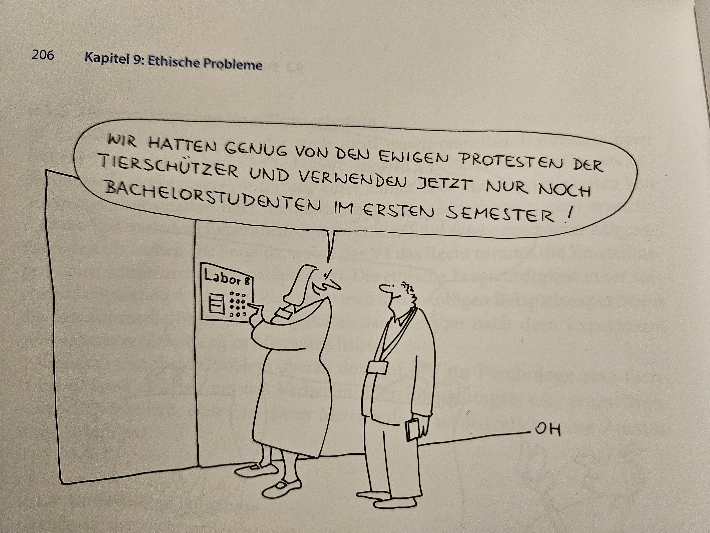

```{r setup, include=FALSE}
options(htmltools.dir.version = FALSE)

library(tidyverse)
library(kableExtra)
library(ggplot2)
library(plotly)
library(htmlwidgets)
library(MASS)
library(ggpubr)
library(xaringanthemer)
library(xaringanExtra)

style_duo_accent(
  primary_color = "#621C37",
  link_color = "#7da5f5",
  secondary_color = "#EE0071",
  background_image = "blank.png"
)

xaringanExtra::use_xaringan_extra(c("tile_view"))

use_scribble(
  pen_color = "#EE0071",
  pen_size = 4
  )

knitr::opts_chunk$set(
  fig.retina = TRUE,
  warning = FALSE,
  message = FALSE
)
```

name: Title slide
class: middle, left, hide_logo
<br><br><br><br><br><br><br>
# Einführung in die Forschungsmethoden der Psychologie und Psychotherapie

### Einheit 7: Forschungsethik und Open Science
##### 13.01.2026 | Prof. Dr. Caroline Zygar-Hoffmann

---
class: top, left, hide_logo
name: content

```{r xaringan-logo, echo=FALSE}
xaringanExtra::use_logo(
image_url = "bilder/referenz.png",
exclude_class = c("title-slide", "hide_logo"),
height = "80px",
position = xaringanExtra::css_position(top = "5em", right = "1em"))
```

### Heutige Themen

#### [Forschungsethik](#Ethik)

#### [Informed Consent](#IC)

#### [Berufsethische Richtlinien des BDP und der DGPs](#bdp)

#### [Open Science](#OS)

#### Take-aways und Schlüssel-/Fachbegriffe
* [Take-aways](#take-away)
* [Schlüssel-/Fachbegriffe](#words)

---
class: top, left, hide_logo
name: Ethik
<div class="footer"><span>https://www.akek.de/geschichte-der-forschungsethik/ <br> https://www.uniklinikum-jena.de/ethikkommission/Geschichte+der+Ethik_Kommission.html <br> https://www.buchenwald.de/geschichte/historischer-ort/konzentrationslager/hygiene-institut <br> 
Döring (2021) 621f.</span></div>

### Forschungsethik

* Es kann einen Konflikt des Forschungsinteresses mit Normen und Werten geben (z. B. Stammzellenforschung, Gentechnik, Forschung zu Rüstungszwecken, Datenschutz)

.pull-left[
* **Forschungsethik** beschreibt die geteilten Werte und Normen eines Fachs, die das Handeln von Forschenden leiten. Sie umfasst außerdem alle Maßnahmen zur Prüfung und Sicherstellung der Einhaltung dieser Normen. 

* Forschungsethik beschäftigt sich mit Fragen nach 
  - Verantwortung
  - Zumutbarkeit
  - Auswirkung auf Einzelne
  - gesellschaftliche Auswirkung
]

.pull-right[
* psychologische Beispiele mit forschungsethischen Problemen:
  - Konditionierungsversuche am "kleinen Albert" (Säugling) in den 20er Jahren (https://www.youtube.com/watch?v=-wtL5Io3sS8)
  - Forschungsverbrechen während des Nationalsozialismus: z.B. Kälteexperimente, "Heilungsversuche" von Homosexualität, Zwangssterilisationen, Impf-Experimente (https://www.youtube.com/watch?v=nnsUvaB_Ek4&t=550s)
  - Milgram-Experiment in den 60er/70er Jahren (https://www.youtube.com/watch?v=Kzd6Ew3TraA&t=56s)
]


---
class: top, left
<div class="footer"><span>https://x.com/SponceyM/status/1980660198441447568</span></div>

### Forschungsethik

.center[
```{r, echo=FALSE, fig.align='center', out.width = "30%"}
knitr::include_graphics("bilder/CogPGT.png")
``` 
]

---
class: top, left, hide_logo

### Forschungsethik

* Meilenstein: **Belmont Report (1976)** als Reaktion auf unethische klinische Forschung: https://www.hhs.gov/ohrp/regulations-and-policy/belmont-report/index.html

* Drei Prinzipien:
  - **Achtung der Menschenwürde**: Studienteilnehmer als autonome, selbstbestimmte Individuen, die Information zur Zustimmung oder Ablehnung der Teilnahme benötigen
  
  - **Benefizienz/Fürsorge**: anderen nicht schaden, Risiken minimieren und Nutzen maximieren $\rightarrow$ Pflicht zu Nutzen-Risiko-Analyse (auf individueller und gesellschaftlicher Ebene)
  
  - **Gerechtigkeit**: gerechte Auswahl der Studienteilnehmer, faire Entschädigung, Forschungsergebnisse müssen für alle zugänglich sein

---
class: top, left, hide_logo
name: IC

### Informed Consent

#### Definition

* Das Einholen eines informierten Einverständnisses ("informed consent", IC) für die Teilnahme an einer wissenschaftlichen Studie gehört zu den Standards guter wissenschaftlicher Praxis

* Die Entscheidung, an einer Studie teilzunehmen, soll **freiwillig** und **unter Abwägung aller Risiken** alleinig von den potenziellen Teilnehmer:innen getroffen werden können

IC aus besteht aus zwei Teilen:

* **Teilnahmeinformation**, d. h. einem Informationsschreiben, um was es in der Studie geht

* **Einverständniserklärung**, mit der explizit die Einwilligung in die Teilnahme zur Studie gegeben wird

---
class: top, left, hide_logo
### Informed Consent

#### Zu vermittelnde Informationen (BDP & DGPs, 2016)

1. Zweck der Forschung

2. erwartete Dauer der Untersuchung und Vorgehen

3. Recht darauf, die Teilnahme abzulehnen oder zu beenden, auch wenn die Untersuchung schon begonnen hat

4. absehbare Konsequenzen der Nichtteilnahme oder der vorzeitigen Beendigung der Teilnahme

5. absehbare Faktoren, von denen man vernünftigerweise erwarten kann, dass sie die Teilnahmebereitschaft beeinflussen (z. B. potenzielle Risiken, Zufallsbefunde)  

6. voraussichtlicher Erkenntnisgewinn durch die Forschungsarbeit

7. Gewährleistung von Vertraulichkeit und Anonymität sowie ggf. deren Grenzen

8. Bonus für die Teilnahme 

9. an wen Proband:innen sich mit Fragen zum Forschungsvorhaben und zu ihren Rechten als Forschungsteilnehmerinnen und Forschungsteilnehmer wenden können

---
class: top, left, hide_logo
### Informed Consent

#### Informed Consent bei Online-Studien

* Gewährleistung einer angemessenen Aufklärung bei Online-Studien besonders anspruchsvoll

* Direktes Beantworten aufkommender Fragen sowie das Wiederauffinden der Studie und der Kontaktinformationen ist erschwert

* Besonders aufwändig bei technisch komplexen Studien (z. B. verständliche Darstellung der Datenspeicherung, Verschlüsselung etc.)

* IC wird i. d. R. nur auf einer einzelnen Webseite eingeholt, wodurch Umsetzung des IC als andauerndem Prozess mit der Möglichkeit, Fragen zu stellen, nicht gewährleistet ist
  * IC-Dokumente werden häufig nicht vollständig gelesen
  * IC-Dokumente werden nur unzureichend verstanden

$\rightarrow$ Zweifel, ob tatsächlich ein informiertes Einverständnis eingeholt wird

$\rightarrow$ besonderes Augenmerk bei digitaler Datenerhebung notwendig

---
class: top, left, hide_logo
### Informed Consent

#### Ethikkommissionen

Ethikkommissionen begutachten ICs kritisch auf Vollständigkeit und Verständlichkeit 

**Eine Ethikkommission prüft darüber hinaus, ob**:

* Vorkehrungen zur Minimierung des Probanden-Risikos getroffen wurden

* ein angemessenes Verhältnis zwischen Nutzen und Risiken des Vorhabens besteht

* die Durchführung des Vorhabens den einschlägigen gesetzlichen Bestimmungen (v. a. den Datenschutz-Bestimmungen) Rechnung trägt

**Anfänge**:
* 1986: Etablierung einer zentralen Ethikkommission durch die DGPs
* 1972: Die Deutsche Forschungsgemeinschaft (DFG) macht die Zuwendung von Forschungsmitteln von der Beurteilung des Forschungsvorhabens durch eine Ethikkommission abhängig
* 1973: Die ersten lokalen Ethikkommissionen werden an den Universitäten Ulm und Göttingen eingerichtet
* erst ab 2003: flächendeckende Einrichtung lokaler Ethikkommissionen

---
class: top, left, hide_logo
### Informed Consent

#### Ethikkommissionen

Konsequenzen bei Missachtung der Vorgaben einer Ethikkommission:

* **institutionell**: Untersuchungsverfahren wegen wissenschaftlichen Fehlverhaltens, Disziplinarmßanhmen, Rufschädigung, Ausschluss aus Fachgesellschaften, Verlust der Forschungserlaubnis

* **rechtlich**: juristische Strafen wegen Körper-/Freiheitsverletzung (z.B. Schmerzensgeld) oder Verstöße gegen DSGVO (z.B. Geldbußen)

* **wissenschaftlich**: keine Veröffentlichung der Studie möglich (positives Votum ist häufig Voraussetzung), Rückzug einer Veröffentlichung bei Bekanntwerden, Ausschluss von Konferenzen

* **finanziell**: Rückgabe von Forschungsgeldern, Sperrung für zukünftige Anträge

---
class: top, left, hide_logo
name: bdp

### Berufsethische Richtlinien des BDP und der DGPs

*"Diese Richtlinien stellen die fachlichen und ethischen Leitlinien der Berufsausübung für Psychologinnen und Psychologen in Deutschland dar und sind zugleich die Berufsordnung des Berufsverbandes der Psychologinnen und Psychologen."*

**Link:** https://www.dgps.de/die-dgps/aufgaben-und-ziele/berufsethische-richtlinien/

.center[
```{r eval = TRUE, echo = F, out.width = "650px"}

```
]

$\rightarrow$ Wir betrachten genauer Abschnitt 7: Psychologie in Forschung und Lehre

Dort geht es auch um **Wissenschaftsethik**: die Regeln guter wissenschaftlicher Praxis im Wissenschaftssystem.

---
class: top, left, hide_logo
name: richtlinien
<div class="footer"><span>https://www.dgps.de/die-dgps/aufgaben-und-ziele/berufsethische-richtlinien/</span></div>

### Berufsethische Richtlinien des BDP und der DGPs

#### Kapitel 7.1. Wissenschaftsfreiheit und gesellschaftliche Verantwortung

* Grundrecht der Wissenschaftsfreiheit (Art. 5, Abs. 3 GG) geht einher mit **Verantwortung** für Form und Inhalt der wissenschaftlichen Tätigkeit

* Grenze dort, wo Grundrechte verletzt werden $\rightarrow$ ethische Verantwortung gegenüber Mitmenschen und der natürlichen Umwelt

* Forschung und Lehre von Fremdbestimmung und wissenschaftsfremder Parteilichkeit freihalten

* Anerkennung der wissenschaftlichen Leistungen anderer

* Bereitschaft, eigene Irrtümer durch überzeugende Argumente, welcher Herkunft auch immer, zu korrigieren

---
class: top, left, hide_logo
<div class="footer"><span>https://www.dgps.de/die-dgps/aufgaben-und-ziele/berufsethische-richtlinien/</span></div>

### Berufsethische Richtlinien des BDP und der DGPs

####  Kapitel 7.2. Grundsätze guter wissenschaftlicher Praxis

.center[
*"Grundlegend für die Berufsausübung in Forschung und Lehre ist die unbedingte Redlichkeit in der Suche nach und bei der Weitergabe von wissenschaftlichen Erkenntnissen."*
]

* Verfolgung allgemein gültiger Regeln methodischen Vorgehens und der Überprüfbarkeit von Ergebnissen

* wissenschaftliches Vorgehen darstellen, begründen und zu Kritik zugänglich zu machen $\rightarrow$ z. B. durch **Peer Review** (Begutachtung durch andere Wissenschaftler:innen)

* Bereits im Forschungsprozess alle verfügbaren Informationen und Gegenargumente angemessen berücksichtigen $\rightarrow$ **Offenheit für Kritik**

* Dokumentation und Veröffentlichung der Forschungsergebnisse, unabhängig von Ergebnis (d. h. auch wenn sie der eigenen Theorie widersprechen) $\rightarrow$ **Open Science**

* Beiträge anderer adäquat würdigen

---
class: top, left, hide_logo
<div class="footer"><span>https://www.dgps.de/die-dgps/aufgaben-und-ziele/berufsethische-richtlinien/</span></div>

### Berufsethische Richtlinien des BDP und der DGPs

#### Kapitel 7.3. Grundsätze für Forschung und Publikation

**(1) Forschung mit Menschen**:

* Psychologische Forschung ist auf die Teilnahme von Menschen als Versuchspersonen angewiesen

* Psychologinnen und Psychologen sind sich der Besonderheit der Rollenbeziehung zwischen Versuchsleiterin bzw. Versuchsleiter und Versuchsteilnehmerin bzw. Versuchsteilnehmer und der daraus resultierenden Verantwortung bewusst 

* Sie stellen sicher, dass durch die Forschung **Würde und Integrität der teilnehmenden Personen** nicht beeinträchtigt werden

* Sie treffen alle geeigneten Maßnahmen, um **Sicherheit und Wohl der an der Forschung teilnehmenden Personen** zu gewährleisten, und versuchen, Risiken auszuschließen

---
class: top, left, hide_logo
<div class="footer"><span>https://www.dgps.de/die-dgps/aufgaben-und-ziele/berufsethische-richtlinien/ <br> Bildquelle: Seite 206 in Huber, O. (2019). Das psychologische Experiment. </span></div>
</span></div>

### Berufsethische Richtlinien des BDP und der DGPs

#### Kapitel 7.3. Grundsätze für Forschung und Publikation

**(2) Förmliche Bewilligungen**: falls ethische Unbedenklichkeit unklar, Ethikantrag an eine Ethikkommission und Durchführung des Projekts erst nach und gemäß Bewilligung

**(3)**, **(4)**, **(5)**, **(6)**: **Richtlinien zum informierten Einverständnis (z. B. bei Aufnahmen, Abhängigkeitsverhältnissen, Täuschung)**

.center[
```{r eval = TRUE, echo = F, out.width = "40%"}

```
]

---
class: top, left, hide_logo
<div class="footer"><span>https://www.dgps.de/die-dgps/aufgaben-und-ziele/berufsethische-richtlinien/</span></div>

### Berufsethische Richtlinien des BDP und der DGPs

#### Kapitel 7.3. Grundsätze für Forschung und Publikation

**(7) Anreize zur Teilnahme an Forschungsvorhaben**: müssen angemessen sein. Falls Therapie die Gegenleistung ist, müssen Art der Dienstleistung, Risiken, Verpflichtungen und Grenzen erläutert werden

**(8) Täuschung in der Forschung**: nur Täuschen, wenn wirklich notwendig, darf keine ernsthafte physische und/oder psychische Belastungen erzeugen, so früh wie möglich aufklären

**(9) Aufklärung der Forschungsteilnehmerinnen und Forschungsteilnehmer**: über Ziel, Ergebnisse und Schlussfolgerungen aus ihrer Forschungsarbeit

**(10) Verantwortungsvoller Umgang mit Tieren in der Forschung** 

---
class: top, left

### Berufsethische Richtlinien des BDP und der DGPs

#### Kapitel 7.3. Grundsätze für Forschung und Publikation

Einige grundlegende Erkenntnisse und Prozesse der Psychologie (z. B. Konditionierung, Bindungsverhalten) basieren auf tierexperimentellen Versuchen. Beispiel: Pawlows Hunde hatten Implantate, um den Speichel aufzufangen und das Volumen messen zu können. Ist das ethisch vertretbar? 

> Sollten Tierversuche Ihrer Meinung nach auch in Zukunft weiter durchgeführt werden? Warum (nicht)?

> Würden Sie eher einen Tierversuch mit Tauben oder mit Affen durchführen wollen? Warum?

.pull-left[
.center[
```{r eval = TRUE, echo = F}

```

]
]

.pull-right[
.center[
```{r eval = TRUE, echo = F, out.width = "40%"}

```
]
]


---
class: top, left, hide_logo
<div class="footer"><span>https://www.dgps.de/die-dgps/aufgaben-und-ziele/berufsethische-richtlinien/</span></div>

### Berufsethische Richtlinien des BDP und der DGPs

#### Kapitel 7.3. Grundsätze für Forschung und Publikation

**(11)**, **(12)**, **(13)** **Darstellung von Forschungsergebnissen, Plagiate und Kennzeichnung des Leistungsanteils an einer Forschungsarbeit in Publikationen** 
  * Psychologinnen und Psychologen erfinden und fälschen keine Daten und korrigieren Fehler 
  * Sie präsentieren keine Arbeiten oder Daten anderer als ihre eigenen
  * Sie beanspruchen die Verantwortlichkeit für eine Forschungsarbeit inklusive der Autorenschaft nur dann, wenn sie die Arbeit selbst durchgeführt haben oder maßgeblich daran beteiligt waren

**(14) Weitergabe von Forschungsdaten zum Zweck der Überprüfung**: Daten sollen zur Verfügung gestellt werden (= "Open Data"), aber Achtung: Datenschutzrichtlinien einhalten! $\rightarrow$ lernen Sie im zweiten Semester in der Vorlesung "Wissenschaftliches Arbeiten"

**(15) Gutachter:innen**: Vertraulichkeit respektieren

**(16) Online-Forschung**: Dies alles gilt auch für Online-Forschung, mit Besonderheiten

---

class: top, left, hide_logo
name: OS

### Open Science 

**Auswahl aktueller Probleme in der Psychologie (und in anderen Wissenschaftsdisziplinen)**: https://www.youtube.com/watch?v=42QuXLucH3Q 
* hoher Anteil falscher Ergebnisse in der veröffentlichten Wissenschaft $\rightarrow$ **Replikationskrise**
* geringe statistische Power
* falsche Anreize durch Zeitschriften/Insitutionen (z.B. signifikante Ergebnisse zu erhalten), die zu fragwürdigen Forschungspraktiken führen (z.B. Datenmanipulation)
 
**Open Science ist Teil guter wissenschaftlicher Praxis und eine Lösung für aktuelle Probleme**

.center[
```{r eval = TRUE, echo = F, out.width = "650px"}
knitr::include_graphics("bilder/openscience.png")
```
]

---
class: top, left, hide_logo
<div class="footer"><span>https://openeconomics.zbw.eu/knowledgebase/einfuehrung-open-science/</span></div>

### Open Science 

.pull-left[
```{r eval = TRUE, echo = F, out.width = "300px", fig.align='center'}
knitr::include_graphics("bilder/openscience_pillars.png")
```
]

.pull-right[
* **Open Access** von Veröffentlichungen für Zugang zur Wissenschaft $\rightarrow$ keine Bezahlung dafür, Forschungsergebnisse lesen zu dürfen 
* **Open Data** (offene Forschungsdaten, so weit unter Wahrung des Datenschutzes möglich) zur Prüfung der Reproduzierbarkeit, Finden von Fehlern, Nachnutzbarkeit
* **Open Methodology** (auch **Open Materials** genannt) und **Open Research Software** zur Nachnutzbarkeit sowie Prüfung der Reproduzierbarkeit (an denselben Daten) und Replizierbarkeit (an neuen Daten)
* **Open Peer Review** zur Prüfung des Qualitätssicherungsprozesses
* **Open Educational Ressources** um Verständnis von Wissenschaft zu ermöglichen
]

Außerdem wichtig: **Präregistrierung** $\rightarrow$ Planung der Studie (u. a. Hypothesen, Messinstrument, Analyse) vor der Datenerhebung öffentlich einsehbar festhalten (um falsch motivierte Anpassungen zu verhindern)

---
class: top, left, hide_logo
<div class="footer"><span>https://openeconomics.zbw.eu/knowledgebase/ziele-von-open-science/?cat=51</span></div>

### Open Science

**Ziele**

* öffentlich geförderte Forschung öffentlich zugänglich machen

* Überprüfbarkeit von Forschungsqualität verbessern und Vertrauen steigern

* wissenschaftlichen Fortschritt beschleunigen

* Ressourcenverschwendung vermeiden

* Ungleichheit verringern, auch beim Zugang zur Wissenschaft 

---
class: top, left, hide_logo

### Take-aways
.content-box-gray[

* Die drei ethischen Prinzipien im Belmont-Report sind die **Achtung der Menschenwürde**, **Benefizienz** und **Gerechtigkeit**

* Eine informierte (!) Einwilligung stellt sicher, dass die Entscheidung, an einer Studie teilzunehmen, **freiwillig** und **unter Abwägung aller Risiken** alleinig von den potenziellen Teilnehmer:innen getroffen werden kann

* Grundrecht der Wissenschaftsfreiheit geht einher mit **Verantwortung für Form und Inhalt der wissenschaftlichen Tätigkeit**

* Die berufsethischen Richtlinien des BDP und der DGPs legen **16 Grundsätze für Forschung und Publikation** fest

* **Open Science** ist Teil guter wissenschaftlicher Praxis, eine Lösung für aktuelle Probleme in der Psychologie und umfasst mehrere Teilbereiche, z. B. **Open Data**, **Open Materials** und **Präregistrierung**
]

---
class: top, left, hide_logo
name: words

### Schlüssel-/Fachbegriffe der heutigen Vorlesung
.content-box-gray[

.pull-left[
.pull-left[

**Forschungsethik**

**Belmont-Report**

**Menschenwürde**

**Benefizienz / Fürsorge**

**Gerechtigkeit**


]

.pull-right[
**Informed Consent**

**Teilnahmeinformation**

**Einverständniserklärung**

**Wissenschaftsethik**

**Peer Review**
]
]

.pull-right[
.pull-left[

**Ethikkommission**

**Täuschung**

**Plagiate**

**Replikationskrise**

**Open Science**
]

.pull-right[
**Open Access**

**Open Data**

**Open Methodology / Open Materials**

**Open Research Software**

**Open Peer Review**

**Open Educational Ressources**

**Präregistrierung**
]
]
]

**[zurück zur heutigen Übersicht der Vorlesung $\rightarrow$](#content)** 
<br>
**[zum Quiz zur Wissensprüfung $\rightarrow$](https://forms.gle/HYnPUYyGDqTPX1yy7)**

<!-- --- -->
<!-- class: top, left -->
<!-- name: literatur -->

<!-- ### Literaturaufgabe -->

<!-- * Nutzen Sie Google Scholar (https://scholar.google.de/) um mit **englischen Schlagwörtern** nach einer wissenschaftlichen, psychologischen Studie zu suchen, welche Täuschung (engl. "blinding") angewandt hat  -->
<!--   * Tipp: Geben Sie dafür die Stichwörter "blinding" und "psychology" zusammen mit einem Forschungsthema ein, welches Sie interessiert -->

<!-- Beantworten Sie dann folgende Fragen: -->
<!-- * Worüber wurden die Versuchsteilnehmer getäuscht? -->
<!-- * Wird ein Ethikantrag erwähnt? -->
<!-- * Welchen Nutzen für die Täuschung sehen Sie in dieser Studie?  -->

<!-- * Geben Sie Ihre Ergebnisse im [studynet im Ordner "Einheit 8"](https://studynet.hs-fresenius.de/goto_STUDYNETHSF_exc_38009.html) unter "Literatur-Aufgabe" ab. -->


---
class: top, left
### Literatur für die heutige Sitzung

.center[
```{r, echo=FALSE,out.width="30%",fig.cap="Kapitel 4 in Döring, N. & Bortz, J. (2016). Forschungsmethoden und Evaluation in den Sozial- und Humanwissenschaften. Pearson.",fig.show='hold',fig.align='center'}
knitr::include_graphics("bilder/doering.png")
``` 
]

---
class: top, left, hide_logo

### Einladung: Nächstes Kolloquium Wissenschaftskommunikation der DGPs-Interessengruppe PsyComm

.small[
"Die AG Praxis und AG Forschung der fachgruppenübergreifenden DGPs-Interessengruppe „Wissenschaftskommunikation in der Psychologie (PsyComm)“ laden herzlich zur nächsten Ausgabe der Lunch-Talk-Reihe "Kolloquium Wissenschaftskommunikation" ein.

Am Freitag, 16. Januar 2026, 12:00 - 12:45 Uhr, spricht Helena Hartman zum Thema "Science and Fiction - WissKomm mit fiktionalen Kurzgeschichten". 

Darum geht es: "Das Projekt Science & Fiction verbindet Wissenschaftskommunikation mit fiktionalen Kurzgeschichten. Die Geschichten greifen unterschiedliche Genres auf – darunter Science-Fiction, Romantik und Thriller – und stellen Bezüge zu aktuellen Forschungsergebnissen her. So entsteht eine besondere Form der Wissenschaftskommunikation, die Wissensvermittlung mit literarischer Erzählkunst kombiniert."

Die Online-Talkreihe findet jeden dritten Freitag im Monat statt. Ziel der Lunchtalks ist es, Einblicke in innovative WissKomm-Formate und aktuelle Forschungsthemen zu teilen und sich über konkrete Erfahrungen aus Praxis und Forschung der Wissenschaftskommunikation, insbesondere aus Perspektive der Psychologie auszutauschen. Die Online-Teilnahme ist über folgenden Link möglich:
https://uni-trier.zoom-x.de/j/69135941316?pwd=r6m1pD17Gl9QgaiIglzHXbPUvgkHFS.1

Die Einladung richtet sich an alle Wissenschaftler:innen, Praktiker:innen und Studierende der Psychologie und ihrer Nachbardisziplinen sowie alle anderen Interessierten an der Wissenschaftskommunikation in der Psychologie.

Schon mal vormerken: Am 20.02.2026 holen wir den Termin mit Rainer Bromme nach, der im Dezember leider krankheitsbedingt ausfallen musste. Thema wird sein "Scientific Literacy 2.0: Vertrauen in Wissenschaft als Bildungsziel".

Wir freuen uns auf Ihre Teilnahme und einen regen Austausch zu Kurzgeschichten und WissKomm!"
]

---
class: top, left, hide_logo

### Einladung: Rechtspsychologisches Kolloquium der MSB

"Die Medical School Berlin (MSB) möchte noch einmal herzlich zum rechtspsychologischen Kolloquium einladen. 

26.01.2026 | 18.00 – 19.30 Uhr (hybrid)
Lockerungsprognosen im Straf- und Maßregelvollzug: Eine besondere Form
der Risikoeinschätzung im Spannungsfeld zwischen Resozialisierung und Sicherung
Merten Neumann (Kriminologisches Forschungsinstitut Niedersachsen e. V.)

Der Termin erfolgt als Hybrid-Veranstaltungen (Medical School Berlin, Raum 1.03, Rüdesheimer Str. 50, 14197 Berlin und online über MS Teams).
Bitte melden Sie sich für die jeweiligen Veranstaltungen unter https://www.medicalschool-berlin.de/veranstaltungen-msb/msb-kolloquium/ an. Unter dieser Adresse finden Sie auch weitere Informationen.

Die Medical School Berlin bietet mit dem Masterstudiengang Psychologie mit Schwerpunkt Rechtspsychologie die Möglichkeit, sich auf verschiedene rechtspsychologische Tätigkeiten vorzubereiten. Zur Arbeitsgruppe gehören: Robert Lehmann, André Körner, Lennart May, Laura Quinten, Rebecca Reichel und Frederic Gnielka."

<!-- library(renderthis)  -->
<!-- chromote::local_chrome_version(binary = "chrome-headless-shell") -->
<!-- to_pdf("EinfForsch_07_Ethik.Rmd", complex_slides = TRUE) -->
