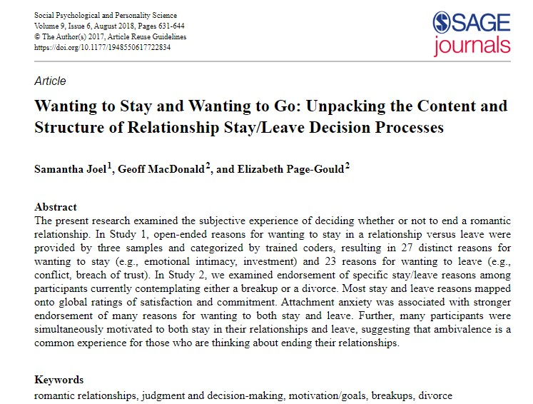
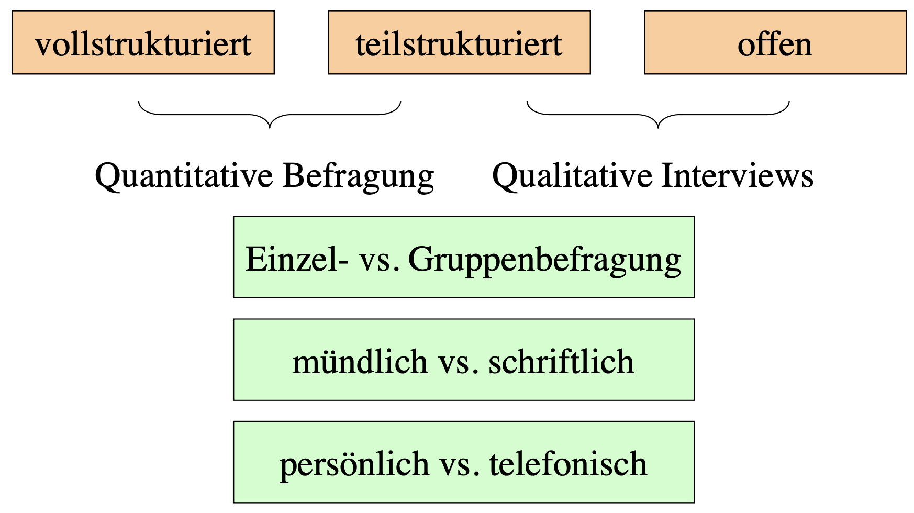
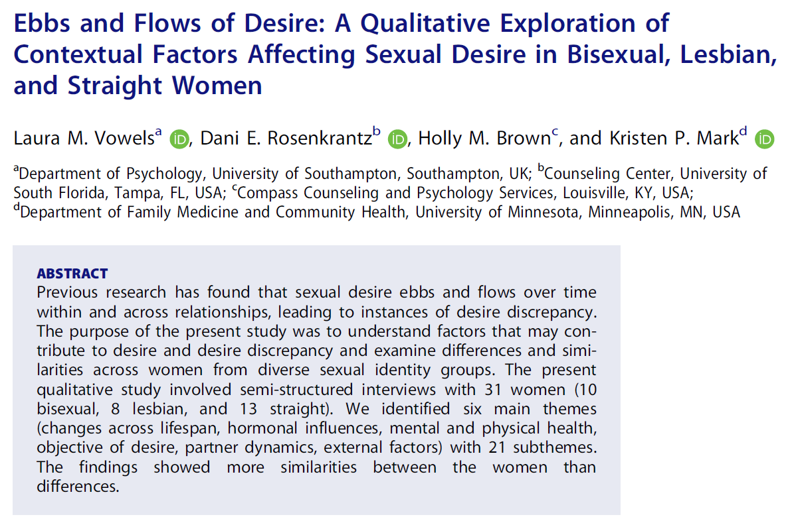
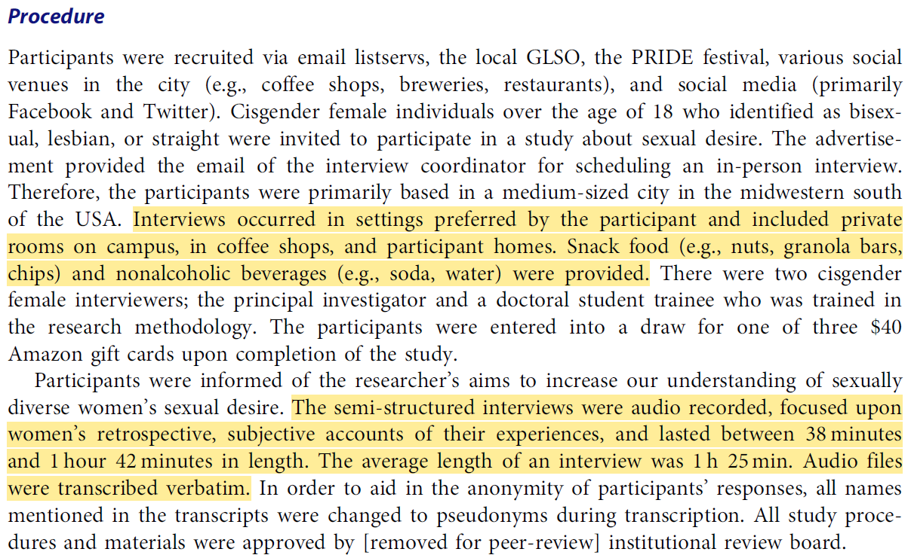
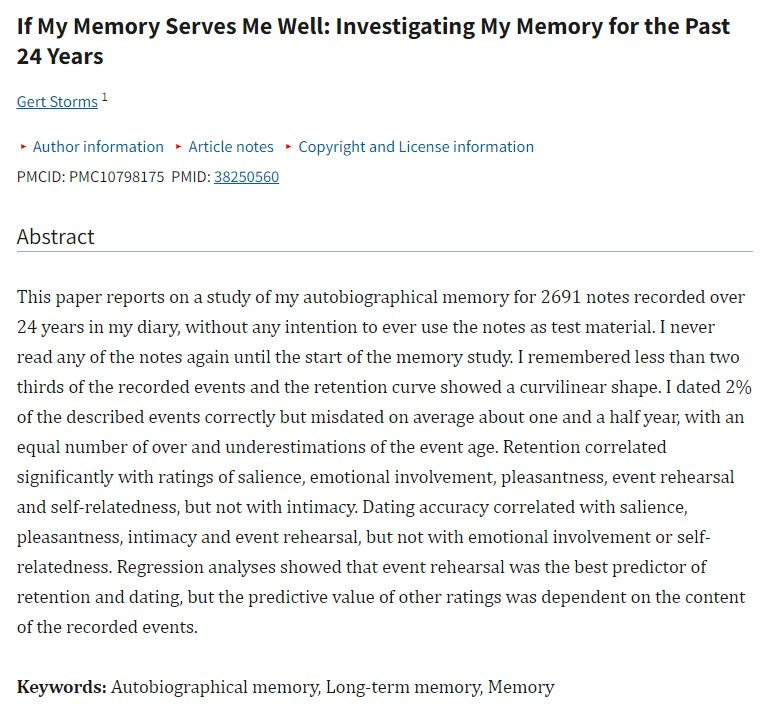
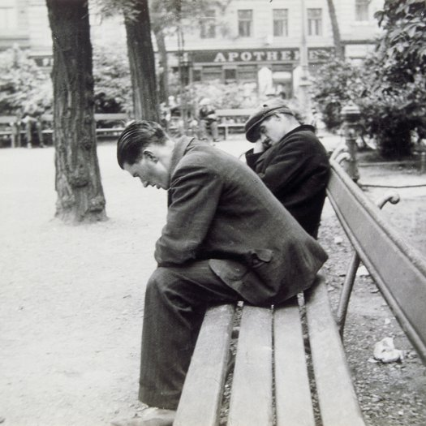
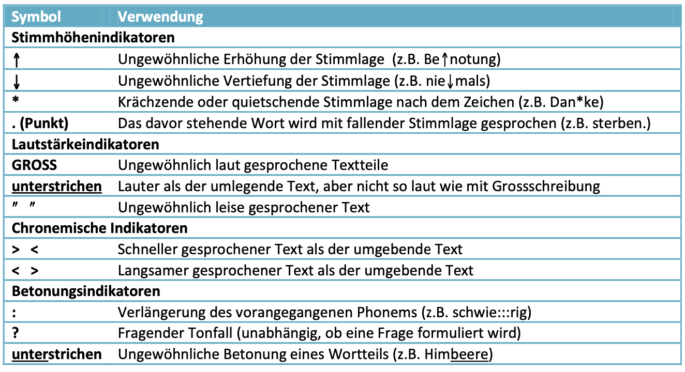
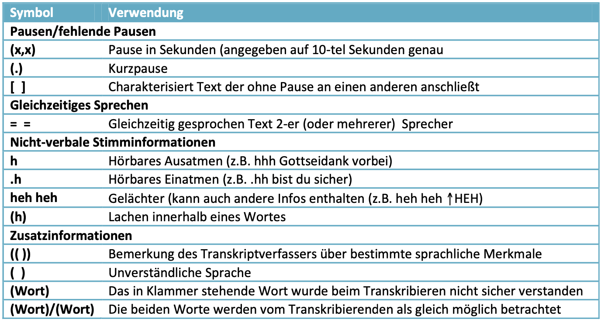
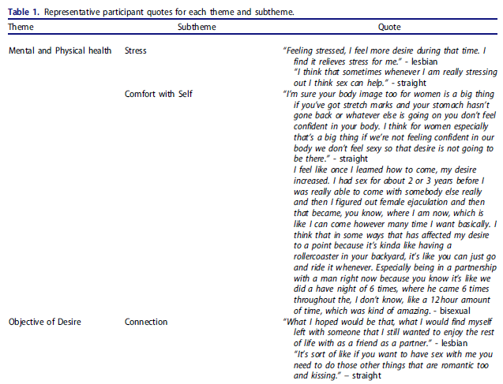

```{r setup, include=FALSE}
options(htmltools.dir.version = FALSE)

library(tidyverse)
library(kableExtra)
library(ggplot2)
library(plotly)
library(htmlwidgets)
library(MASS)
library(ggpubr)
library(xaringanthemer)
library(xaringanExtra)

style_duo_accent(
  primary_color = "#621C37",
  secondary_color = "#EE0071",
  link_color = "#7da5f5",
  background_image = "blank.png"
)

xaringanExtra::use_xaringan_extra(c("tile_view"))

use_scribble(
  pen_color = "#EE0071",
  pen_size = 4
  )

knitr::opts_chunk$set(
  fig.retina = TRUE,
  warning = FALSE,
  message = FALSE
)
```

name: Title slide
class: middle, left, hide_logo
<br><br><br><br><br><br><br>
# Einführung in die Forschungsmethoden der Psychologie und Psychotherapie

### Einheit 8: Qualitative Methoden: Verstehen des Einzelfalls
##### 10.07.2025 | Prof. Dr. Caroline Zygar-Hoffmann

---
class: top, left, hide_logo
name: content

```{r xaringan-logo, echo=FALSE}
xaringanExtra::use_logo(
image_url = "bilder/referenz.png",
exclude_class = c("title-slide", "hide_logo"),
height = "80px",
position = xaringanExtra::css_position(top = "5em", right = "1em"))
```

### Heutige Themen

#### [Quantitative vs. Qualitative Methoden](#vs)

#### [Qualitative Datenerhebung](#qual)
* [Qualitative Interviews](#interviews)
* [Gruppenbefragungen](#gruppen)
* [Non-reaktive Verfahren](#nonreaktiv)
* [Historiographische und biographische Methoden](#bio)
* [Teilnehmende Feldforschung (Ethongraphie)](#ff)

#### [Qualitative Datenauswertung](#auswertung)

#### Take-Aways und Schlüssel-/Fachbegriffe
* [Take-Aways](#take-away)
* [Schlüssel-/Fachbegriffe](#words)

---
class: top, left, hide_logo
name: vs
### Quantitative vs. Qualitative Methoden

**Ziel quantitativer/naturwissenschaftlicher Methoden: **

* Identifikation möglichst objektiv geltender Gesetzmäßigkeiten

**Besonderheit Mensch als Untersuchungsobjekt:**

* Menschliches Verhalten und Empfinden ist sehr variabel (und es gibt viele Abweichungen von "im Mittel gefundenen Gesetzmäßigkeiten")

* gültige (valide) Forschung muss das in Betracht ziehen

* qualitative Forschung führt häufig zu gültigen Ergebnissen mit hohem Informationsgehalt für den Einzelfall

* qualitative Forschung: eher geisteswissenschaftliche Ausrichtung statt naturwissenschaftlicher Ausrichtung 


---
class: top, left, hide_logo
name: vs
### Quantitative vs. Qualitative Methoden

Quantitative vs. qualitative Methoden als extreme Kontraste dargestellt (ist nicht immer so schwarz-weiß):

.pull-left[
**Quantitative Methoden**

* nomothetisch 
* naturwissenschaftlich 
* Labor
* interne Validität
* explanativ (erklärend)
* hypothesenprüfend
* partikulär
* ahistorisch
* Stichprobe
]

.pull-right[
**Qualitative Methoden**

* idiografisch 
* geisteswissenschaftlich 
* Feld
* ökologische Validität
* explorativ (beschreibend)
* hypothesengenerierend
* holistisch
* historisch
* Einzelfall
]

---
class: top, left, hide_logo
### Quantitative vs. Qualitative Methoden

**Nomothetisch vs. Idiographisch**

.pull-left[
**Quantitative Methoden**

Nomothetisch
* generalisierend

* Ziel: allgemeine Gesetze formulieren

* strebt möglichst universelle Gültigkeit an
]

.pull-right[
**Qualitative Methoden**

Idiographisch

* individualisierend

* Ziel: einzelne Sachverhalte beschreiben

* strebt umfassende Beschreibung des Einzelfalls an
]

Von Windelband (1894) eingeführte Unterscheidung zur Charakterisierung natur- und geisteswissenschaftlichen Vorgehens

---
class: top, left, hide_logo
### Quantitative vs. Qualitative Methoden

**Partikulär vs. Holistisch**

.pull-left[
**Quantitative Methoden**

Partikulär

* auf ein spezifisches Element eines Sachverhalts ausgerichtet

* Ausklammern von sozialen, historischen, etc. Kontextbedingungen

* geht davon aus, dass sich komplexe Zusammenhänge aus Teilbedingungen ergeben
]

.pull-right[
**Qualitative Methoden**

Holistisch

* auf das Ganze (eines einzelnen Sachverhalts) gerichtet

* Berücksichtigung von gesellschaftlichen und historischen Rahmenbedingungen

* geht davon aus, dass das Ganze mehr ist als die Summe seiner Teile
]


---
class: top, left, hide_logo
### Quantitative vs. Qualitative Methoden

Die Wahl der Methode richtet sich

  1. nach dem Problem bzw. der **Forschungsfrage**

  2. nach dem **theoretischen Hintergrund**

  3. nach den vorhandenen **Ressourcen**

  4. nach dem eigenen **Ausbildungsstand**
  
Merke:

* Im Allgemeinen kann ein und dasselbe Problem mit unterschiedlichen Methoden bearbeitet werden.

* Die Wahl der Methode legt aber zugleich fest, was nicht  bearbeitet werden kann.

* Auch "**Mixed Methods**"-Ansätze die quantitative und qualitative Methoden vereinen sind möglich und können sehr lohnend sein

---
class: top, left
<div class="footer"><span>Joel, S., MacDonald, G., & Page-Gould, E. (2018). Wanting to Stay and Wanting to Go: Unpacking the Content and Structure of Relationship Stay/Leave Decision Processes. Social Psychological and Personality Science, 9(6), 631-644. https://doi.org/10.1177/1948550617722834/ </span></div>

### Quantitative vs. Qualitative Methoden

**Beispiel 1 für Einzelfallstudie, die quantitative und qualitative Forschung verbindet:**

.center[
```{r eval = TRUE, echo = F, out.width = "50%"}

```
]

---
class: top, left
<div class="footer"><span>Hulsmans, D. H., Otten, R., Poelen, E. A., van Vonderen, A., Daalmans, S., Hasselman, F., ... & Lichtwarck-Aschoff, A. (2024). A complex systems perspective on chronic aggression and self-injury: case study of a woman with mild intellectual disability and borderline personality disorder. <i>BMC psychiatry, 24</i>(1), 378</div>

### Quantitative vs. Qualitative Methoden

**Beispiel 2 für Einzelfallstudie, die quantitative und qualitative Forschung verbindet:**

.pull-left[
```{r eval = TRUE, echo = F}
knitr::include_graphics("bilder/hulsmans1.png")
```
]

.pull-right[
```{r eval = TRUE, echo = F}
knitr::include_graphics("bilder/hulsmans2.png")
```
]

---
class: top, left, hide_logo
name: qual
### Qualitative Datenerhebung

**Gütekriterien in qualitativer Forschung**:

* **Objektivität:**
  - Transparenz im Vorgehen
  - interpersonaler Konsens

* **Reliabilität:** Nicht im Sinne von Wiederholbarkeit der Messung, aber im Sinne von inhaltlicher Zuverlässigkeit der produzierten Texte, vermischt sich mit Validität

* **Validität:** 
  - Authentizität der Äußerungen
  - Angemessenheit der Darstellung in Protokollen
  - Repräsentativität von Material und Interpretation für zu messende Variablen (~ Inhaltsvalidität)

---
class: top, left, hide_logo
### Qualitative Datenerhebung

**Methoden:**
* Einzelinterviews, z.B.
  * Narratives Interview
  * Problemzentriertes Interview
  * Fokussiertes Interview
* Gruppenbefragungen (kann auch Interview beinhalten)
* Nonreaktive Verfahren
  * Archivstrategien
  * Physische Spuren
* Historiographische und biographische Methoden
* Teilnehmende Feldforschung

**Häufiges Vorgehen bei der Qualitativen Datenanalyse:**
* Transkription
* Codierung
* Inhaltsanalyse

---
class: top, left, hide_logo
name: interviews

### Qualitative Datenerhebung

#### Qualitative Interviews

**Grad der Strukturierung von Interviews:**

.center[
```{r eval = TRUE, echo = F, out.width = "600px"}

```
]

Im Folgenden werden wir spezieller auf mündliche Interviews eingehen, aber auch schriftliche Befragungen mit offenen Antworten sind in der qualitativen Forschung sehr üblich.

<!-- Beispiel: Expertenbefragung zum Thema "Was macht ein gutes Experience Sampling Item aus (siehe Einheit 9 zu digitaler Datenerhebung am Smartphone) -->

---
class: top, left, hide_logo
### Qualitative Datenerhebung

#### Qualitative Interviews

##### Narratives Interview

* offenste Form des Interviews

* Besteht hauptsächlich aus einer Stegreif– oder Spontanerzählung

* Interviewer:in initiiert Bericht durch Erzählaufforderung, die maximal offen sein sollte

* Nachfragen (z.B. zum Verständnis von Situationen) sind möglich, ansonsten hält Interviewer:in sich zurück

* Die Person hat monologisches Rederecht

* Problemstellungen oder die Forschungsfragen werden nicht im Erzählanstoß angesprochen

* Vorteil: Problemstellung wird nur dann thematisiert, wenn sie auch für die Person relevant ist

---
class: top, left, hide_logo
### Qualitative Datenerhebung

#### Qualitative Interviews

##### Problemzentriertes Interview

* Leitfaden*orientiertes* Interview mit Fragen und Nachfragen

* Diese dienen als Kontrolle und nicht zur Festlegung des Ablaufes

* Dialogisch ( $\rightarrow$ Ablauf ist ähnlich einem natürlichen Gespräch), am Thema/Problem orientiert

* essentielle Fragen und – wenn nötig – die vorformulierten Nachfragen sollen aber vorkommen

* Spontane Fragen sind möglich


---
class: top, left
<div class="footer"><span>Vowels, L. M., Rosenkrantz, D. E., Brown, H. M., & Mark, K. P. (2020). Ebbs and flows of desire: A qualitative exploration of contextual factors affecting sexual desire in bisexual, lesbian, and straight women. <i>Journal of Sex & Marital Therapy, 46</i>(8), 807-823.</span></div>

### Qualitative Datenerhebung

#### Qualitative Interviews

##### Problemzentriertes Interview

.pull-left[
```{r eval = TRUE, echo = F}

```
]

.pull-right[
```{r eval = TRUE, echo = F}

```
]

---
class: top, left, hide_logo
### Qualitative Datenerhebung

#### Qualitative Interviews

##### Fokussiertes Interview

* Leitfaden*orientiertes* Interview mit Fragen und Nachfragen

* Besonderheit: Es werden bestimmte Stimuli vorgegeben 
  * Fotos
  * Videos
  * Objekte
  * Situationen
  * ...

* Kann in unterschiedlichen Zusammenhängen eingesetzt werden (je nach Stimulus)

* situationsspezifische Gesprächsführung: welche Bedeutung misst die befragte Person einzelnen Teilen oder Elementen bei? Assoziationen erwünscht


---
class: top, left
<div class="footer"><span>Kuhn, P. (2003). Thematische Zeichnung und fokussiertes, episodisches Interview am Bild–Ein qualitatives Verfahren zur Annäherung an die Kindersicht auf Bewegung, Spiel und Sport in der Schule. In Forum Qualitative Sozialforschung/Forum: Qualitative Social Research (Vol. 4, No. 1). </span></div>

### Qualitative Datenerhebung

#### Qualitative Interviews

##### Fokussiertes Interview

.center[
```{r eval = TRUE, echo = F, out.width="50%"}
knitr::include_graphics("bilder/fokussiertes_interview.png")
```
]

---
class: top, left, hide_logo
### Qualitative Datenerhebung

#### Qualitative Interviews

##### Arbeitsschritte bei qualitativen Interviews

```{r echo = F}

df = data.frame(
  Phase = c("Inhaltliche Vorbereitung",
            "Organisatorische Vorbereitung",
            "Prolog",
            "Durchführung",
            "Epilog",
            "Protokoll",
            "Dokumentation"),
  Aufgaben = c("Festlegung des Befragungsthemas, theoretische Überlegungen zur Auswahl der Personen, Wahl der Befragungstechnik, Formulierung der Fragen",
               "Kontaktaufnahme, Zusammenstellung des Materials, Schulung der Interviewer",
               "Vorstellung, Herstellen einer angenehmen Gesprächsatmosphäre, Überprüfung der Aufzeichnungsgeräte (Tonband, Video,...), Datenschutz",
               "Überwachung und Steuerung des Gesprächsablaufs",
               "Abschluss der Aufzeichnung, Feedback beachten, Verabschiedung, ggf. Infomaterial hinterlassen",
               "Unmittelbar nach Interview Gedächtnisprotokoll anfertigen",
               "Transkription, Materialzusammenstellung")
)

df %>%
  kbl() %>%
  kable_styling(font_size = 18) %>%
  kable_classic(full_width = T)
```

---
class: top, left, hide_logo
<div class="footer"><span>Hoyer, J., Jacobi, F., & Leibig, E. (2003). Gesprächsführung in der Verhaltenstherapie. In Lehrbuch der Psychotherapie. Verhaltenstherapie (Vol. 2) (pp.85-102)</span></div>

### Qualitative Datenerhebung

#### Qualitative Interviews

##### Inhaltliche Vorbereitung: Fehler bei der Formulierung von Fragen

.pull-left[
* affektive statt neutrale Formulierung
* überkomplexe statt einfache Fragen
* Jargon statt allgemeinverständliche Wörter
* Suggestivfragen
  * "Sie werden doch wohl nicht behaupten..."
* Induzierung knapper Antworten
  * "Geht es Ihnen am Wochenende besser?"
* Unzulässige Voraussetzungen in der Frage
  * "Wie gehen Sie mit Untreue in Ihrer Parterschaft um?"
* zu starke Einengung auf die Problemstellung
]

.pull-right[
```{r eval = TRUE, echo = F}
knitr::include_graphics("bilder/jargon.png")
```
]

---
class: top, left, hide_logo
### Qualitative Datenerhebung

#### Qualitative Interviews

##### Durchführung - Gesprächstechniken

.pull-left[
* eigene Reaktionen beobachten, negative (non-)verbale Reaktionen vermeiden

* aufmerksam zuhören

* auf unausgesprochene Voraussetzungen achten (z.B. "Sie kennen das ja...")

* auf unklare/abweichende Verwendung von Begriffen achten

* keine Wertungen äußern
]

.pull-right[
* abgehandelte Theme mental notieren, fehlende im Auge behalten

* Person niemals unterbrechen

* wenn Gespräch in unerwünschte Richtung geht, behutsam zurücklenken

* starke emotionale Reaktionen der Person abgeschwächt spiegeln (z.B. Lachen $\rightarrow$ Lächeln, Weinen $\rightarrow$ ernste Miene)

* zugewandte Körpersprache
]

**Echo (Paraphrase):** Zusammenfassende Wiederholung des Gesagten (keine Interpretation!)

---
class: top, left, hide_logo
### Qualitative Datenerhebung

#### Qualitative Interviews

##### Durchführung - 10 Gebote für den/die Interviewer:in (Berg, 2000)

.pull-left[
1) Nicht mit der Tür ins Haus fallen

2) Zweck des Interviews im Auge behalten

3) Natürlich wie im Alltagsgespräch bleiben

4) Anteilnahme zeigen, ohne zu übertreiben

5) An eigenes Aussehen denken (keine zu große Distanz zum Milieu)
]

.pull-right[
6) Komfortablen Ort wählen

7) Nicht mit einsilbigen Antworten zufrieden geben

8) Höflich und interessiert sein

9) So oft wie möglich üben

10) Freundlich und dankbar sein
]

---
class: top, left, hide_logo
name: gruppen

### Qualitative Datenerhebung

#### Gruppenbefragungen

* Brainstorming (Osborn, 1957)
  * Ideen und Lösungsvorschläge werden zu einem Thema gesammelt
  * keine Kritik an den einzelnen Vorschlägen
  * keine Bewertung
  
* Fokusgruppen (Lewin, 1936; Lazarsfeld, 1946; Merton, 1955)
  * Moderationsgeleitete Diskussion in kleinen Gruppen (vorgegebenes Thema)
  
* Gruppeninterview (Abrams, 1949)
  * Personen, meist natürlicher Gruppen (z.B. Familie) werden mit Leitfaden befragt
  
* Moderationsmethode (Klebert et al., 1984)
  * Moderierter Gruppenprozess unter Verwendung diverser Methoden (multimethodal: z.B. o.g. Brainstorming, Gruppendiskussionen, Visualisierungen)

---
class: top, left, hide_logo
name: nonreaktiv

### Qualitative Datenerhebung

#### Nonreaktive Verfahren

##### Definition

* Methoden, bei deren Durchführung kein Einfluss auf die untersuchten Personen, Ereignisse oder Prozesse ausgeübt wird.

* Wie kann dies erreicht werden?
  * Vorgang der Datenerhebung wird nicht bemerkt
  * Es werden nur "Spuren" des Verhaltens beobachtet

* Beobachter:in/Forscher:in kann keine störenden Reaktionen auslösen (Interviewer-, Versuchsleitereffekte) 

---
class: top, left, hide_logo
### Qualitative Datenerhebung

#### Nonreaktive Verfahren

##### Archivstrategien

.pull-left[
Öffentliche Archive: 
* Archive, die für einen bestimmten Zweck angelegt und einem bestimmten Personenkreis zugänglich sind
  * Geburts- und Sterbebücher 
  * Adoptionsregister
  * Krankenhausaufnahmen, Unfallstatistiken
  * Wohnung-, Verkaufs- und Betriebsstatistiken
  * Entlehnungen (Bibliotheken etc.)
  * Fahrpläne, Tourismus- und Verkehrsstatistiken
  * Videoaufzeichnungen von Überwachungskameras
]

.pull-right[
Private Archive: 
* Archive, die meist für einen privaten Zweck einer Person oder einer kleinen Gruppe angelegt werden oder sich ansammeln 
  * Autobiographien
  * Briefwechsel
  * Tagebücher, Protokolle 
  * Fotos
]

---
class: top, left
### Qualitative Datenerhebung

#### Nonreaktive Verfahren

##### Archivstrategien

**Beispiel: Abschiedsbriefe vor Suizid (Jacobs, 1967)**

.pull-left[
* Untersuchung von 112 Abschiedsbriefen verfasst von Personen aus dem Großraum Los Angeles

* Kategorisierung:
  * Erlebnisse kurz vor Suizid
  * Soziale Gründe für Nicht-Durchführung Suizid
  * Wünsche/Regelungen für Hinterbliebene

* Zusätzlich: Interviews mit Hinterbliebenen

* Bestimmte Regelmäßigkeiten (z.B. die Bitte um Verzeihung) konnten gefunden werden.
]


.pull-right[.center[
```{r eval = TRUE, echo = F, out.width = "260px"}

```
]]

---
class: top, left
<div class="footer"><span> Storms, G. (2024). If My Memory Serves Me Well:
Investigating My Memory for the Past 24 Years. Journal of Cognition, 7(1): 16, pp. 1–19. DOI: https://doi.org/10.5334/joc.334 </span></div>

### Qualitative Datenerhebung

#### Nonreaktive Verfahren

##### Archivstrategien

**Beispiel: Auswertung eigener Tagebücher bzgl. Genaugikeit von Erinnerungen (Storms, 2024) **

.center[
```{r eval = TRUE, echo = F, out.width = "35%"}

```
]

---
class: top, left

### Qualitative Datenerhebung

#### Nonreaktive Verfahren

##### Physische Spuren

.pull-left[
**Nutzungsspuren**: Bei dieser Methode werden Gegenstände, Materialien etc. auf den **Grad ihrer Nutzung oder auf Hinweise der Art der Nutzung** untersucht
  * Abgetretene Teppiche als Indikator für häufig begangene Wege
  * Abnutzung von Parkbänken als Indikator für angenehme Umweltbedingungen
  * Abgegriffene Seiten, Randbemerkungen etc. in Büchern
  * Untersuchung, auf welche Sender Radios oder Fernseher eingestellt sind
  * ...
]

.pull-right[
**Zuwachsspuren**: Bei dieser Methode werden Ansammlungen von Dingen (also deren **Auftreten**) über die Zeit ermittelt
  * Analyse von Müll und Abfall
  * Untersuchung von Graffiti
  * Tapetenschichten zur Untersuchung der Veränderung des ästhetischen Empfindens
  * Verwendung bestimmter Symbole (Aufkleber, Abzeichen, etc.)
  * ...
]


---
class: top, left, hide_logo
<div class="footer"><span>https://x.com/NotSoProf0und/status/1851066739406356995?t=RiCQk4h0l6GlAWb3wyV74A&s=19</span></div>

### Qualitative Datenerhebung

#### Nonreaktive Verfahren

##### Physische Spuren


.center[
**Beispiel:**

```{r eval = TRUE, echo = F, out.width = "25%", fig.cap = "Nutzungsspuren an der Ohio State University"}

```
]

---
class: top, left, hide_logo
### Qualitative Datenerhebung

#### Nonreaktive Verfahren

##### Verhaltensbeobachtung

.pull-left[
**Induziertes Verhalten:**
* Personen nicht bewusst, dass ihr Verhalten direkt oder indirekt beobachtet wird
* werden dazu gebracht, bestimmte Eigenschaften, Einstellungen etc. zu zeigen
* Beispiel: Lost-Letter Technik (Milgram, 1965)
  * Auslegen von Briefen, die an bestimmte Personen oder Einrichtungen gerichtet sind, als wären sie verloren gegangen
  * Ermittelung, wie viele den (fingierten) Adressaten erreichen.
  * Indikator für das Ansehen der Person oder Institution 
]

.pull-right[
**Spontanverhalten:**
* Personen werden ohne ihr Wissen beobachtet
* Beispiele
  * Messung der Gehgeschwindigkeit in der Studie ‚Die Arbeitslosen von Marienthal‘
  * Feldbeobachtung von Kundenverhalten in einer Warteschlange
  * Beobachtung des Ausparkens in Abhängigkeit vom Parkplatzbedarf
]

---
class: top, left, hide_logo
name: bio

### Qualitative Datenerhebung

#### Historiographische und biographische Methoden

* Methoden zur Entschlüsselung historiographischer (geschichtlicher) und biographischer (lebensgeschichtlicher), vergangener Ereignisse auf Basis von Quellen

* Biographische Methoden sind Spezialfälle der Historiographie

* Untersuchung und Erklärung von Zusammenhängen und deren wirkungsgeschichtlicher Bedeutung (kein reines Aneinanderreihen von Fakten)

* Sowohl idiografische Biographie-Forschung, als auch Vergleich von Biographien zur Erklärung personenbezogener und gesellschaftlicher Phänomene

Quellen:
1. Primärquellen
  * schriftliche oder mündliche Schilderungen von Augenzeugen
  * direkt mit Ereignis oder seinem Ergebnis verknüpft
2. Sekundärquellen
  * keine unmittelbaren Augenzeugen
  * Hörensagen oder auf Basis wissenschaftlicher Bechäftigung

---
class: top, left, hide_logo
name: ff

### Qualitative Datenerhebung

#### Teilnehmende Feldforschung (Ethnographie)

* Teilnehmende Beobachtung realer sozialer Situationen

* Historisch geht dieser Ansatz auf die Kulturanthropologie und Ethnologie zurück

* Gehört zu den aufwendigsten Forschungsstrategien

* Ergebnis: möglichst umfassendes Verständnis der Funktionsweise eines sozialen Systems 
  * **Makroethnographie:** Soziales System im Ganzen 
  * **Mikroethnographie:** Soziales System in Teilaspekten

---
class: top, left
### Qualitative Datenerhebung

#### Teilnehmende Feldforschung (Ethnographie)

**Beispiele:**

* Untersuchung von Straßengangs, Obdachlosen und Ghettobewohnern seit den 20er Jahren
(z.B. Street Corner Society, Whyte, 1943)

* Gruppen von Drogenabhängigen (Agar, 1973)

* Vernachlässigte Jugendliche (Dodge et al., 1982)

* Untersuchung von Eliten (Hertz & Imber, 1993)

* Gefängnis als soziale Welt (Jones, 1995)

* Schulcliquen (Peshkin, 1986)

* Psychiatrische Klinik (Rosenhan, 1973)

---
class: top, left
### Qualitative Datenerhebung

#### Teilnehmende Feldforschung (Ethnographie)

**Beispiele: Die Arbeitslosen von Marienthal (Jahoda, Lazarsfeld & Zeisel, 1933)**

<small>
.pull-left[
* Studie zeigte die sozio-psychologischen Wirkungen von Arbeitslosigkeit auf

* Langzeitarbeitslosigkeit führt nicht – wie vielfach angenommen – zu Revolte, sondern zu Einsamkeit und passiver Resignation 

* Musterbeispiel der Theoriebildung in Kombination von quantitativen, qualitativen, vorgefundenen und erhobenen Daten (u.a. auch Archivstrategien in Form von Tagebüchern)

* 15 Forscher:innen:
  * Kontakt zu politischen und gesellschaftlichen Gruppen
  * Kleidersammlungen, ärztliche Sprechstunden, Erziehungsberatungen, Turn- und Zeichenkurse
]

</small>

.pull-right[.center[
```{r eval = TRUE, echo = F, out.width = "300px"}

```
]]


---
class: top, left, hide_logo
### Qualitative Datenerhebung

#### Teilnehmende Feldforschung (Ethnographie)

**Rolle der Forscher:in:**

* Möglichkeiten gehen von überwiegender Beobachtung bis zu voller Teilnahme

* richtet sich u.a. nach der Art der Gruppe (z.B. Cliquen)

* Teilnahme im öffentlichen Raum leichter als in geschlossenen Systemen (z.B. Arbeitsteams)

---
class: top, left, hide_logo
### Qualitative Datenerhebung

#### Teilnehmende Feldforschung (Ethnographie)

**Unsichtbar werden:**

* Gewohnheit: 
  * ständige Anwesenheit wird mit der Zeit zur Normalität

* Anpassung: 
  * wenn man sein Erscheinungsbild an die Umstände anpasst
  
* Aufbau persönlicher Beziehungen
  * Sympathie für den Forscher $\rightarrow$ über seinen Status hinweg sehen
  
* Täuschung (vgl. verdeckte vs. offene Verhaltensbeobachtung):
  * wahres Forschungsinteresse verschweigen

---
class: top, left, hide_logo
### Qualitative Datenerhebung

#### Teilnehmende Feldforschung (Ethnographie)

**Gefahren des verdeckten Arbeitens:**

* Bei Angabe falscher Identität:
  * Beispiel Rosenhan (1973): Forscher simulierten Schizophrenie, um verdeckt in die Psychiatrie zu gelangen, aber sie kamen nicht mehr so leicht hinaus (5-52 Tage + Entlassungsdiagnose)

* Mit gefangen mit gehangen:
  * Beispiel Lee (1995): Beim Angriff rivalisierender Banden wird nicht gefragt, ob man Forscher ist oder zur Bande gehört

* Mehr Informationen bekommen, als einem lieb ist:
  * Beispiel Berg et al. (1983): Die Forscher bekommen Infos über geplante Überfälle, Einbrüche etc.

* Vertraulichkeit nicht wahren können:
  * Beispiel Brajuha & Hollwell (1986): Polizei verlangte Herausgabe des Materials (ging bis vor den obersten Gerichtshof)


---
class: top, left, hide_logo
name: auswertung

### Qualitative Datenauswertung

#### Transkription

* Vor der weiteren Analyse müssen Ton- und Videoaufzeichnungen sowie Feldnotizen in lesbaren Text umgewandelt werden.

* Dabei gehen immer bestimmte Aspekte des Originals verloren

* Je nach Art der Forschung, den jeweiligen Forschungsfragen und Typ der Analyse ist Verlust mehr/weniger wichtig 

**Prinzipien der Transkription:**
1. Sparsamkeit
2. Einfachheit
3. Konsistenz

---
class: top, left
### Qualitative Datenauswertung

#### Transkription

**Beispiel: Transkription nach Jefferson (2004)**

.center[
```{r eval = TRUE, echo = F, out.width = "800px"}

```
]

---
class: top, left
### Qualitative Datenauswertung

#### Transkription

**Beispiel: Transkription nach Jefferson (2004)**

.center[
```{r eval = TRUE, echo = F, out.width = "800px"}

```
]


---
class: top, left, hide_logo
### Qualitative Datenauswertung

#### Codierung

* Beim Kodieren wird das gesamte Material (oder nur die als besonders wichtig erachteten Materialstellen) zunächst in sinnvolle Einheiten segmentiert.

* Dabei können sehr kleine Textsegmente bzw. Analyseeinheiten gebildet werden (z. B. einzelne Wörter oder Wortgruppen) oder auch größere Einheiten (z. B. ganze Sätze oder Absätze).

* Auf die Codierung folgt häufig eine Kategorisierung der Codes.

.center[
```{r eval = TRUE, echo = F, fig.cap="Döring & Bortz (2016), S.604", out.width = "85%"}
knitr::include_graphics("bilder/Qual_Kodierung.png")
```
]

---
class: top, left
<div class="footer"><span>Vowels, L. M., Rosenkrantz, D. E., Brown, H. M., & Mark, K. P. (2020). Ebbs and flows of desire: A qualitative exploration of contextual factors affecting sexual desire in bisexual, lesbian, and straight women. <i>Journal of Sex & Marital Therapy, 46</i>(8), 807-823.</span></div>

### Qualitative Datenauswertung

#### Codierung 

Beispiel aus der Studie "Ebbs and Flows of Desire: A Qualitative Exploration of Contextual Factors Affecting Sexual Desire in Bisexual, Lesbian, and Straight Women": 

.center[
```{r eval = TRUE, echo = F, out.width = "45%"}

```
]

---
class: top, left, hide_logo
### Qualitative Datenauswertung

#### Inhaltsanalyse 

.pull-left[

* Inhaltsanalyse baut auf der Kategorisierung auf: Interpretation der Bedeutung der Kategorien im Kontext der Forschungsfragen

* Es existieren verschiedene Formen der Inhaltsanalyse, mit unterschiedlichen Zielen (z.B. Zusammenfassung oder Erweiterung von Textmaterial), oft auch in Kombination mit quantitativen Elementen ("quantitative Inhaltsanalyse")
]

.pull-right[
```{r eval = TRUE, echo = F, fig.cap="Beispiel einer Inhaltsanalyse aus Döring & Bortz (2016), S.542"}
knitr::include_graphics("bilder/Qual_Inhaltsanalyse.png")
```
]


---
class: top, left, hide_logo
name: take-away

### Take-Aways
.content-box-gray[
* Menschliches Verhalten und Empfinden ist **individuell und nicht immer objektiv erfassbar** $\rightarrow$ Methodenset zum Verstehen subjektiven Verhaltens und Erlebens von Einzelfällen wird benötigt

* Die **Wahl der Methode** richtet sich nach dem Problem, dem theoretischen Hintergrund, den vorhandenen Ressourcen und dem eigenen Ausbildungsstand

* **Interviews** können vollstrukturiert, halbstruktuiert und offen gestaltet werden, wobei vollstrukturierte Interviews klassisch für quantitative Forschung sind und offene Interviews klassisch für qualitative forschung 

* **Non-reaktive Verfahren** sind Methoden bei deren Durchführung kein Einfluss auf die untersuchten Personen, Ereignisse oder Prozesse ausgeübt wird

* Bei der **teilnehmenden Feldforschung** nehmen Forscher:innen am untersuchten Geschehen teil

* Standardisierte **Transkription** ermöglicht die spätere Analyse von Beobachtungs- und Interviewsituationen. Zu den Prinzipien der Transkription gehören Sparsamkeit, Einfachheit und Konsistenz
]

---
class: top, left, hide_logo
name: words

### Schlüssel-/Fachbegriffe der heutigen Vorlesung
.small[
.content-box-gray[

.pull-left[
.pull-left[

**nomothetisch**

**idiographisch**

**explanativ**

**explorativ**

**partikulär**

**holistisch**

**Transkription**

**Codierung**

**Inhaltsanalyse**
]

.pull-right[
**narratives Interview**

**problemzentriertes Interview** 

**fokussiertes Interview**

**Suggestivfrage**

**Echo / Paraphrase**

**Prolog**

**Brainstorming**

**Fokusgruppen**

]
]

.pull-right[
.pull-left[
**Gruppeninterview**

**Moderationsmethode**

**Nonreaktive Verfahren**

**Archivstrategien**

**öffentliche Archive**

**private Archive**

**Physische Spuren**

**Nutzungsspuren**

**Zuwachsspuren**


]

.pull-right[
**Induziertes Verhalten**

**Spontanverhalten**

**Historiographische und biographische Methoden**

**Teilnehmende Feldforschung (Ethnographie)**

**Makroethnographie**

**Mikroethnographie**

]
]
]
]

**[zurück zur heutigen Übersicht der Vorlesung $\rightarrow$](#content)** 
<br>
**[zum Quiz zur Wissensprüfung $\rightarrow$](https://forms.gle/szihDsyWzu3pkDH49)**

---
class: top, left
### Literatur für die heutige Sitzung

.pull-left[
```{r, echo=FALSE,out.width="50%",fig.cap="Kapitel 5 in Bortz, J. & Döring, N. (2006). Forschungsmethoden und Evaluation für Human- und Sozialwissenschaftler. Pearson.",fig.show='hold',fig.align='center'}
knitr::include_graphics("bilder/bortz2006.png")
``` 
]

.pull-right[
```{r, echo=FALSE,out.width="50%",fig.cap="Kapitel 2.3., 11.3. und 12.1. in Döring, N. & Bortz, J. (2016). Forschungsmethoden und Evaluation in den Sozial- und Humanwissenschaften. Pearson.",fig.show='hold',fig.align='center'}
knitr::include_graphics("bilder/doering.png")
``` 
]

**Materialien:** Vielen Dank an Prof. Dr. Stephan Goerigk für Bereitstellung der Grundlage für die Materialien

<!-- library(renderthis)  -->
<!-- to_pdf("EinfForsch_08_Qualitativ_Kurz.Rmd", complex_slides = TRUE) -->
