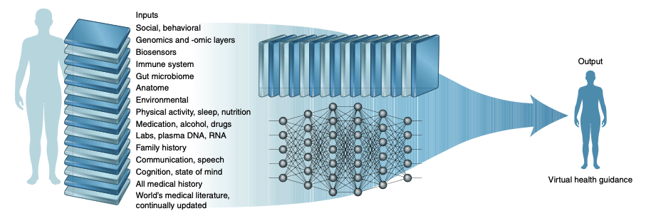
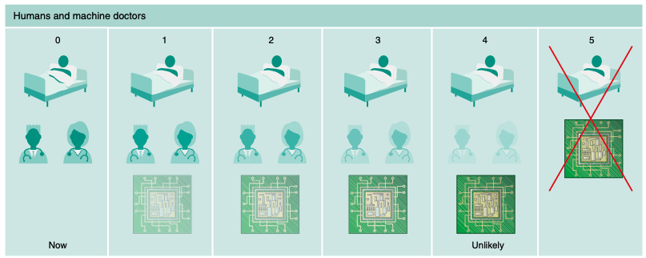

```{r setup, include=FALSE}
options(htmltools.dir.version = FALSE)

library(tidyverse)
library(kableExtra)
library(ggplot2)
library(plotly)
library(htmlwidgets)
library(MASS)
library(ggpubr)
library(xaringanthemer)
library(xaringanExtra)

style_duo_accent(
  primary_color = "#621C37",
    link_color = "#7da5f5",
  secondary_color = "#EE0071",
  background_image = "blank.png"
)

xaringanExtra::use_xaringan_extra(c("tile_view"))

use_scribble(
  pen_color = "#EE0071",
  pen_size = 4
  )

knitr::opts_chunk$set(
  fig.retina = TRUE,
  warning = FALSE,
  message = FALSE
)
```

name: Title slide
class: middle, left
<br><br><br><br><br><br><br>
# Einführung in die Forschungsmethoden der Psychologie und Psychotherapie

### Einheit 9: Digitale Datenerhebung, Big Data und Machine-Learning
##### 04.07.2024 | Dr. Caroline Zygar-Hoffmann


---
class: top, left
name: content
### Heutige Themen

#### [Digitale Datenerhebung](#intro)

#### [Ambulatory Assessment & Ecological Momentary Interventions](#AA)

#### [Big Data und Machine-Learning](#ML)

#### Take-Aways und Schlüssel-/Fachbegriffe
* [Take-Aways](#take-away)
* [Schlüssel-/Fachbegriffe](#words)

---
class: top, left
name: intro

### Digitale Datenerhebung

#### Digitalisierung traditioneller Datenerhebungsmethoden

* Fragebögen und Tests wurden früher im Paper Pencil Format vorgegeben

* Mittlerweile ist die digitale Form vorherrschend

**Methode: Surveytools**

  * Digitalisierung der Messinstrumente durch die Forscher:innen
  
  * Forschungsmethodische Aspekte (z.B. Randomisierungslogik) wird miteinbezogen (programmiert)
  
  * Ausfüllen durch Proband:innen am Computer/Smartphone
  
  * Nach Ende der Datenerhebung $\rightarrow$ direkter Export der Daten ins digitale Format
  
$\rightarrow$ Erstellen digitaler Umfragen wird im Modul Empirisch-wissenschaftliches Arbeiten gelernt (2. Semester)

---
class: top, left
### Digitale Datenerhebung

#### Digitalisierung traditioneller Datenerhebungsmethoden

**Surveytools - Beispiel Unipark:**

.center[
```{r eval = TRUE, echo = F, out.width = "750px"}
knitr::include_graphics("bilder/unipark1.png")
```
]

$\rightarrow$ recht benutzerfreundlich, aber kostenpflichtig

---
class: top, left
### Digitale Datenerhebung

#### Digitalisierung traditioneller Datenerhebungsmethoden

**Surveytools - Beispiel formR:**

.center[
```{r eval = TRUE, echo = F, out.width="75%"}
knitr::include_graphics("bilder/formr.png")
```
]

$\rightarrow$ Surveys werden über Exceltabelle konfiguiert, mächtig und dadurch sehr flexibel, versteht R Befehle, kostenfrei

---
class: top, left
### Digitale Datenerhebung

#### Möglichkeiten und Vorteile digitaler Datenerhebung

Möglichkeit Daten unabhängig von der physischen Distanz zwischen den Forschungseinrichtungen und den Teilnehmer:innen zu erheben 

**Beispiele für Vorteile sind:**

.pull-left[
.pull-left[
* Zeitökonomie

* Keine Übertragungsfehler von Papier in den Computer

* Direkter Export der Antworten ins Datensatzformat, d.h. Analyse kann direkt starten
]
.pull-right[
* Wegfall von kopräsenter Versuchsleitung und Versuchsleitereffekten

* Verringerung des Reaktivitätsproblems
]
]

.pull-right[
* größere Stichprobengrößen erreichbar und damit höhere Teststärke

* Diversifizierung der Stichproben indem internetbasiert rekrutiert wird

* Erreichbarkeit von Stichproben mit hochspezifischen Merkmalen
]


---
class: top, left
### Digitale Datenerhebung

#### Nachteile digitaler Datenerhebung

Digitale Datenerhebung bietet der psychologischen Forschung nicht nur Möglichkeiten und Vorzüge, sondern ist auch mit Risiken und potenziellen Nachteilen behaftet.

**Beispiele für Nachteile sind:**

* Verringerung der Repräsentativität der Stichproben hinsichtlich Technologieaffinität

* Erschwerte Kontrolle über die Bedingungen der Datenerhebung (z.B. die Einhaltung von Instruktionen, Einhalten der Datenqualität)

* Erschwerter Schutz der Teilnehmenden

* Erschwerte Überprüfung des Verständnisses wichtiger Informationen

* Erschwerte Prüfung der Identifizierbarkeit

* erschwerter Datenschutz und erschwerte informierte Einwilligung

---
class: top, left
name: AA

### Ambulatory Assessment & Ecological Momentary Interventions

#### Was ist Ambulatory Assessment?

* **Wiederholte Erfassung** der aktuellen Gedanken, Emotionen, Verhaltensweisen, physiologischen Zustände und des Kontexts von Menschen **in ihrer natürlichen Umgebung** und möglichst im Moment in dem sie auftreten ("Real-time Data Capturing" bzw. "Real-time Monitoring")

* Typischerweise (aber nicht notwendigerweise) über elektronische tragbare Geräte 

* Der Begriff "Ambulatory Assessment" (Ebner-Priemer & Trull, 2009) umfasst eine Reihe methodischer Ansätze
  - "Experience Sampling Method" (ESM, Larson & Csikszentmihalyi, 1983), auch "Ecological Momentary Assessment" (EMA, Shiffmann et al., 2008)
  - "Daily Diaries" (Gunthert & Wenze, 2012)
  - "Mobile Sensing"
  - "Ambient Sensing"
  
* Die verschiedenen Begriffe betonen unterschiedliche Aspekte der Forschung (z.B. was wird erfasst, wie und wie oft wird erfasst) und werden auch in verschiedenen Subdisziplinen häufiger oder weniger häufig genutzt

---
class: top, left
### Ambulatory Assessment & Ecological Momentary Interventions

#### ESM/EMA Sampling Pläne

ESM/EMA kann zwei unterschiedlichen Messregimen folgen:

**1) Time-contingent sampling** bzw. **Signal-contingent sampling** 

Teilnehmer antworten auf Fragen zu einem bestimmten Zeitpunkt, wenn sie durch ein Signal dazu aufgefordert werden ("Beeps")
  
* **Fixed scheme:** Teilnehmer werden zu festen Zeitpunkten aufgefordert, z. B. um 9:30 und 16:30 Uhr $\rightarrow$ für die Versuchspersonen vorhersehbar, höhere Antwortquote, aber höhere Reaktivität

* **Random scheme:** Aufforderungen werden zu zufälligen Zeitpunkten gesendet, aber i.d.R. in vorher festgelegten Intervallen $\rightarrow$ bessere Abdeckung des gesamten Alltags, ggf. geringere Reaktivität, aber auch geringere Antwortquote

---
class: top, left
### Ambulatory Assessment & Ecological Momentary Interventions

#### ESM/EMA Sampling Pläne

ESM/EMA kann zwei unterschiedlichen Messregimen folgen:

**2) Event-contingent sampling**

Teilnehmer antworten auf Fragen, wenn ein bestimmtes Ereignis eintritt, z.B. eine Panikattacke oder Alkoholkonsum
  
* Möglichkeit 1: Teilnehmer bitten, Fragebogen selbst zu starten sobald das Ereignis eintritt

* Möglichkeit 2: Kombination ESM/EMA mit Sensing:
  * z.B. Stellen der Frage, wenn bestimmtes Aktivitätslevel überstiegen wird
  * z.B. Stellen der Frage, wenn bestimmte GPS Location erreicht wird

---
class: top, left
### Ambulatory Assessment & Ecological Momentary Interventions

#### ESM/EMA: Beispiele

```{r eval = TRUE, echo = F, out.width = "30%"}


knitr::include_graphics("bilder/tellmi1.png")
```

---
class: top, left
<div class="footer"><span>Russell, J. A. (1980). A circumplex model of affect. Journal of personality and social psychology, 39(6), 1161.<br>Russell, J. A., Weiss, A., & Mendelsohn, G. A. (1989). Affect grid: a single-item scale of pleasure and arousal. Journal of personality and social psychology, 57(3), 493.</span></div>

### Ambulatory Assessment & Ecological Momentary Interventions

#### ESM/EMA: Beispiele

**Multi-dimensionale Stimmungsmessung**

.pull-left[
.center[
```{r eval = TRUE, echo = F, out.width = "350px"}

```
]
]
.pull-right[
<small>

**Zirkumplexmodell des Affekts** (Russell, 1980; Russell et al. 1989) 
* Alle Stimmungszustände sind lineare Kombination aus zwei unabhängigen, bipolaren Skalen: 
  * Valenz (von unangenehm bis angenehm) 
  * Erregung/Aktivierung (von niedriger bis hoher Erregung). 
  
* Kombination ordnet die affektiven Zustände auf einem von vier Quadranten an  $\rightarrow$ Messung über ein "Affect Grid" (Bild links)

* Nachteil: Konzepte von Valenz und Erregung können den Befragten schwer zu vermitteln sein
]
</small>


---
class: top, left
### Ambulatory Assessment & Ecological Momentary Interventions

#### Was sind Ecological Momentary Interventions (EMI)?

* EMI: **mobilbasierte Interventionen**, die den Menschen in ihrem **Alltag**, also in ihrer natürlichen Umgebung, und auf einen **konkreten Moment/Tag** bezogen angeboten werden (in "Echtzeit")

* Unterschied zu IMI (vgl. Vorlesung von Patricia Garatva) liegt vor allem im *momentary*-Teil, d.h. dass die Interventionen an bestimmten Momenten/Tagen vorgegeben werden

* Begriff auch eher in der Forschung üblich als in der psychotherapeutischen Praxis

* Personalisierung möglich hinsichtlich Timing und Art der Intervention:
  * **Timing:** z.B. wenn ESM/EMA deutliche Veränderungen in relevanten pathologischen Prozessen widerspiegelt
  * **Art:** Auf eine Art und Weise, die in Anbetracht dessen, was über die Person bekannt ist, maximal effektiv ist

---
class: top, left
### Ambulatory Assessment & Ecological Momentary Interventions

#### Beispiel für Einsatz von EMI in der Partnerschaftsforschung

```{r eval = TRUE, echo = F, out.width = "70%"}
knitr::include_graphics("bilder/emi_paper.png")
```

Ein Beispiel-EMI aus dem Paper: 

"**Nehmen Sie sich heute in einem ruhigen Moment etwas Zeit zusammen mit Ihrem Partner. Stellen Sie einen Wecker auf 5 Minuten und schauen Sie Ihrem Partner** ***für 5 Minuten in die Augen.*** **Alternativ können Sie auch Videochatten. Konzentrieren Sie sich dabei voll und ganz auf Ihren Partner.**"

---
class: top, left
name: ML

### Big Data und Machine-Learning

#### Computer und mentale Gesundheit

* Idee, Computer einzusetzen, um Diagnostik und Prognostik von  Erkrankungen zu verbessern, ist nicht neu  

.pull-left[
```{r eval = TRUE, echo = F, out.width = "750px"}
knitr::include_graphics("bilder/QvSElnX.png")
```
]

.pull-right[
Arthur Radbow (60er Jahre): Machine Psychiatry aus „Closer than we think“. 
* Idee: einen  Computer zu füttern mit allen Wesensäußerungen des Patienten. 
* Computer lernt aus den unterschiedlichsten Kombinationen von emotionalen Ausdrücken, Kognitionen und Verhalten, Entscheidungsregeln abzuleiten
* Die Kliniker:in kann diese verwenden, um Therapie danach auszurichten. 
]

* Dichte an Informationen,  die wir über Erkrankungen haben – nicht nur über psychische Erkrankungen, sondern generell über Erkrankungen – nimmt exponentiell zu
* **Kapazitätsproblem:** menschliche Kapazität mit diesem Wissen umzugehen ist begrenzt (Schere verfügbares vs. kognitiv verarbeitbares Wissen)

---
class: top, left
### Big Data und Machine-Learning

#### Big Data

.pull-left[
* **Definition**: große Datenmengen, die zu komplex sind, um sie mit traditionellen Methoden zu verarbeiten.

* umfasst sowohl strukturierte als auch unstrukturierte Daten, wie z.B. Text, Bilder, Audio- und Videodateien.

* Neue Technologien ermöglichen es, big data zu speichern und zu verarbeiten.

* **Ziel**: Muster, Trends und Verbindungen in den Daten zu erkennen und zu nutzen.

]

.pull-right[
.center[
```{r eval = TRUE, echo = F, out.width = "650px"}

```
]
]

---
class: top, left
### Big Data und Machine-Learning

#### Machine Learning

* Computerstrategie, die **automatisch** Methoden und Parameter bestimmt (d.h. lernt), um eine optimale Lösung für ein Problem zu finden

* Wird nicht von vornherein von einem Menschen programmiert, um eine fixe Lösung zu liefern. 

* Wird als Teilgebiet der künstlichen Intelligenz (KI) betrachtet

* Lernprozess simuliert vermeintlich eine Facette der menschlichen Intelligenz  

* Kann für vermeintlich intelligente Zwecke eingesetzt werden (z.B. Sprache, Schrift, Gesichtserkennung, selbstfahrende Autos oder medizinische Entscheidungshilfen).


---
class: top, left
### Big Data und Machine-Learning

#### Machine Learning - die Anfänge

.pull-left[

**Das Perzeptron:**

* Ziel: eine Maschine zu bauen, die ihre eigenen Formeln entwickelt, um Probleme durch Lernen zu lösen (Rosenblatt, 1958)

* Aufgabe: Bilder von Dreiecken von Quadraten unterscheiden mittels 400 Lichtsensoren

* Unterscheidung von Dreiecken von Quadraten nicht expliziert programmiert $\rightarrow$ Training über **Trial und Error** Prozess

]

.pull-right[
.center[
```{r eval = TRUE, echo = F, out.width = "300px"}
knitr::include_graphics("bilder/rose.jpg")
```
]
]

$\rightarrow$ In den Anfängen des maschinellen Lernens ging es also darum, dass eine Maschine mit Hilfe realer Daten lernt begrenzte Vorannahmen darüber zu treffen, wie diese Daten aussehen, und dass die Leistung der Maschine unter realen Bedingungen bewertet wird.

<!-- ### Big Data und Machine-Learning -->

<!-- #### Machine Learning - grobe Time Line -->

<!-- .pull-left[ -->

<!-- **Das Perzeptron:** -->

<!-- * Über viele Versuche hinweg änderte die Maschine die statistischen Gewichte, die mit jedem Lichtsensor verbunden waren, anhand einer internen Gleichung  -->

<!-- * Die Antworten einiger Sensoren wurden  sehr stark gewichtet, während andere (z. B. die in einem Viereckmuster) nicht gewichtet wurden -->

<!-- * In den Anfängen des maschinellen Lernens ging es also darum, aus realen Daten zu lernen, begrenzte Vorannahmen darüber zu treffen, wie diese Daten aussehen, und die Leistung der Maschine unter realen Bedingungen zu bewerten. -->
<!-- ] -->

<!-- .pull-right[ -->
<!-- .center[ -->
<!-- ```{r eval = TRUE, echo = F, out.width = "650px"} -->
<!-- knitr::include_graphics("bilder/perceptron-formule.png") -->
<!-- ``` -->
<!-- ] -->
<!-- ] -->

---
class: top, left
### Big Data und Machine-Learning

#### Machine Learning - die Anfänge

* Das Perzeptron trug dazu bei, die Betrachtungsweise von Computern zu ändern

* Vorher: Rechenmaschinen, die die von vornherein mit bereits bekannten Formeln und Regeln programmiert werden mussten

* Nachher: Computer, die unscharfe Regeln selbständig erlernen konnten (z. B. Erkennung von Mustern). 

* Dieser frühe Erfolg löste einen großen Hype aus, der größtenteils aus phantasievollen Verallgemeinerungen der zugrundeliegenden Logik auf andere Probleme bestand

* Die Seifenblase platzte jedoch, als sich die Hoffnungen aufgrund der Beschränkungen der frühen Algorithmen und der damals verfügbaren Rechenleistung nicht erfüllten. 

* Einige dieser Beschränkungen können nun aufgrund der gestiegenen Rechenleistung überwunden werden, so dass es Maschinen möglich ist aus manchmal sehr komplexen Daten zu lernen.

* Machine Learning Algorithmen sind heute in unser tägliches Leben integriert:  Internet-Suchen, Produktempfehlungen, Spracherkennungsdienste, selbstfahrende Autos,  Bildklassifikation, Sprachmodelle (z.B. DeepL), Generative Modelle (z.B. ChatGPT)

---
class: top, left
### Big Data und Machine-Learning

#### Machine Learning - Entwicklungen im Gesundheitswesen

* Hoffnung, auch klinische Entscheidungsfindung durch Informationsverabeitung zu verbessern

* **Präzisionsmedizin (taylored treatments)**: Richtige Behandlung für richtige Patient:in zur richtigen Zeit

.center[
```{r eval = TRUE, echo = F, out.width = "950px"}

```
]

---
class: top, left
### Big Data und Machine-Learning

#### Machine Learning - Entwicklungen im Gesundheitswesen

* Ansatz des maschinellen Lernens  im Gesundheitswesen funktioniert insbesondere gut  bei Aufgaben, bei denen es um **Mustererkennung in Bildern** geht

* ML ebenso gut oder besser abgeschnitten als Kliniker, etwa bei 
  * Erkennung von Hautkrebs (Esteva et al. 2017)
  * Lungenkrebs (Yu et al. 2016) 
  * Brustkrebs (z. B. Samsung, RS80A)
  * Augenerkrankungen (Long et al. 2017)

* Und in der Psychologie? **Besonders für das Ziel der Vorhersage sehr relevant!** (für das Ziel der Erklärung weniger) $\rightarrow$ vielversprechende Forschung

---
class: top, left
### Big Data und Machine-Learning

#### Machine Learning - Entwicklungen im Gesundheitswesen

**Psychologisches Beispiel: Vorhersage von Schizophrenie-Onset im Prodrom (Koutsouleris et al. 2021)**

.center[
```{r eval = TRUE, echo = F, out.width = "850px"}

```
]

---
class: top, left
### Big Data und Machine-Learning

#### Klassen von Machine Learning

<small>

Man unterscheidet im Machine Learning i.d.R. drei unterschiedliche Anwendungsbereiche:

* **Unsupervised Learning:**
  * Beinhaltet keine vorgegebenen Labels oder Zielvariablen.
  * Ziel ist es, unbekannte Strukturen oder Muster in den Daten zu entdecken.
  * Beispiele: Clustering, Dimensionality Reduction.
  
* **Supervised Learning:**
  * Beinhaltet vorgegebene Labels oder Zielvariablen.
  * Ziel ist es, ein Modell zu entwickeln, das in der Lage ist, neue Datenpunkte richtig vorherzusagen. $\rightarrow$ "**Prädiktive Modellierung**"
  * Beispiele: Regression, Klassifikation.
  
* **Reinforcement/Reward Learning:**
  * Beinhaltet ein Agent-System, das in einer Umgebung agiert und Entscheidungen trifft.
  * Ziel ist es, das Verhalten des Agenten so anzupassen, dass es möglichst hohe Belohnungen erhält.
  * Beispiele: Game-playing, Robotics.

$\rightarrow$ Es ist zu beachten, dass diese drei Arten von Machine Learning-Methoden nicht immer klar voneinander abgegrenzt sind und es auch überlappende Anwendungen gibt.

</small>

---
class: top, left
### Big Data und Machine-Learning

#### Klassen von Machine Learning

##### Unsupervised Learning und Supervised Learning

* Lassen sich noch auf klassische statistische Fragestellungen zurückführen

* Output dieser Algorithmen ist eine Kategorie, bzw. eine Zahl

.pull-left[
* **Unsupervised Learning:** Gruppierungsvorschläge für chaotische Datenstrukturen, ohne Vorkenntnis von Kategorien (Clustering) $\rightarrow$ wichtig für Entdeckung neuer Krankheitsmuster etc.

* **Supervised Learning:** versucht bereits bekannte Kategorien in Daten anhand anderer Informationen in den Daten wiederzuerkennen/vorherzusagen $\rightarrow$ wichtig für klinische Prognosen/Diagnosen
]
.pull-right[
.center[
```{r eval = TRUE, echo = F, out.width = "650px"}
knitr::include_graphics("bilder/supervised-vs-unsupervised-ml.png")
```
]
]

---
class: top, left
### Big Data und Machine-Learning

#### Klassen von Machine Learning

##### Logik der Prädiktiven Modellierung

.pull-left[
**Szenario:**

* Wir haben einen Trainingsdatensatz mit Brainscans 

* Wir wissen für Personen im Trainingsdatensatz, wer eine Diagnose hatte (rot) und wer nicht (blau)

* Prädiktion: Für neue Person (nicht im Datensatz) auf Basis der Brainscans vorhersagen, ob Diagnose vorhanden

]
.pull-right[
.center[
```{r eval = TRUE, echo = F, out.width = "150px"}

```
]
.center[
```{r eval = TRUE, echo = F, out.width = "350px"}
knitr::include_graphics("bilder/pred0.1.png")
```
]
]

---
class: top, left
### Big Data und Machine-Learning

#### Klassen von Machine Learning

##### Logik der Prädiktiven Modellierung

.pull-left[
**Schritt 1:**

* Im Trainingsdatensatz das Modell auf Basis der Aktivierungsmuster im Brainscan trainieren

* Das heißt, das Modell versucht anhand der vorhandenen Daten herauszufinden woran es Personen mit und ohne tatsächliche Diagnose unterscheiden kann

]
.pull-right[
.center[
```{r eval = TRUE, echo = F, out.width = "650px"}
knitr::include_graphics("bilder/pred2.png")
```
]
]

---
class: top, left
### Big Data und Machine-Learning

#### Klassen von Machine Learning

##### Logik der Prädiktiven Modellierung

.pull-left[
**Schritt 2:**

* Prüfen, ob durch das Modell die tatsächliche Diagnose von Personen **im Trainingsdatensatz** vorhersagen kann (d.h. ob in den Daten überhaupt Informationen vorhanden sind, anhand derer eine Vorhersage möglich ist) .

**Genauigkeitsmaße**

* gesamte Vorhersagegenauigkeit = **Accuracy**
* Vorliegen von tatsächlicher Diagnose korrekt erkennen = **Sensitivität**
* Abwesenheit von tatsächlicher Diagnose korrekt erkennen = **Spezifität**

]
.pull-right[
.center[
```{r eval = TRUE, echo = F, out.width = "350px"}
knitr::include_graphics("bilder/pred3.png")
```

```{r eval = TRUE, echo = F, out.width = "300px"}
knitr::include_graphics("bilder/acc.png")
```
]
]

---
class: top, left
### Big Data und Machine-Learning

#### Klassen von Machine Learning

##### Logik der Prädiktiven Modellierung

**Schritt 3:**

* **Prüfung der Generalisierbarkeit**: Um zu prüfen, ob das trainierte Modell gut funktioniert, müssen wir es validieren

* **Validierung**: Modell an Fällen erproben die nicht im Trainingsset dabei waren (d.h. an bis dahin unbekannten Personen) $\rightarrow$ entweder man erhebt also neue Daten, oder man teilt einen vorhandenen Datensatz in ein Trainings- und ein Testset 

* VORSICHT: strikte Trennung zwischen Trainings- und Testdaten (Data-Leakage) $\rightarrow$ sonst droht ein **Overfit** (Überanpassung an die Daten)
  * Unfairer Vorteil: Vorhersage von Fällen, die das Modell schon "kennt"
  * Modell würde sonst besser performen, als in der Realität

---
class: top, left
### Big Data und Machine-Learning

#### Klassen von Machine Learning

##### Logik der Prädiktiven Modellierung

**Wie trenne ich einen vorhandenen Datensatz in ein Trainings- und Testset?**

* Einfachstes Szenario: **Simple Split** $\rightarrow$ Datensatz wird z.B. 50/50 in Tranings- und Testdatensatz geteilt
  * Problem: Forscher könnte genau so trennen, dass Modell gut funktioniert (das wäre Schummeln)

.pull-left[
* Lösung: **(k-fold) Nested-Cross-Validation**
  * Datensatz wird in k Folds geteilt (hier k=5)
  * Runde 1: Training: 1-4 Folds, Test: 5. Fold
  * Runde 2: Training: 1,2,3,5 Folds, Test: 4. Fold
  * Runde 3: Training: 1,2,4,5 Folds, Test: 3. Fold
  * ...
  * Am Ende Genauigkeitsmaße ausrechnen

* Vorteil: Kein Overfit + ganzer Datensatz kann ohne Data-Leakage genutzt werden 
]
.pull-right[
.center[
```{r eval = TRUE, echo = F, out.width = "650px"}
knitr::include_graphics("bilder/predx.png")
```
]
.center[
```{r eval = TRUE, echo = F, out.width = "350px"}
knitr::include_graphics("bilder/nested.png")
```
]
]

---
class: top, left
### Big Data und Machine-Learning

#### Klassen von Machine Learning

##### Logik der Prädiktiven Modellierung

**Generalisierbarkeitspyramide:**

.pull-left[
* Je unterschiedlicher die Kontexte (z.B. zeitlich, geografisch, kulturell) von Traning und Test Folds, desto generalisierbarer ist das Modell

* Leave-Site-out $\rightarrow$ Folds = einzelne Studienzentren: Modell funktioniert nicht nur in Klinik A sondern auch in Klinik B
  
* External $\rightarrow$ Folds = einzelne Studien:  Modell funktioniert nicht nur in Studie A sondern auch in Studie B

* Prospective $\rightarrow$ Folds = Zeit: Modell kann Fälle vorhersagen, die in der Zukunft liegen
]
.pull-right[
.center[
```{r eval = TRUE, echo = F, out.width = "330px"}
knitr::include_graphics("bilder/pred5.png")
```
]
]

---
class: top, left
### Big Data und Machine-Learning
#### Klassen von Machine Learning

##### Reinforcement Learning

.pull-left[
* Beinhaltet das Erlernen von Funktionen und Entscheidungsregeln, um erhaltene Belohnungen zu maximieren (Fehler zu minimieren)

* Output dieser Algorithmen kann ein komplexes Verhalten sein

* Kann implizit auch Klassifikationen oder Gruppierungen beinhalten

* Beispiele sind Schach spielen lernen, autonomes Fahren, etc.
]
.pull-right[
.center[
```{r eval = TRUE, echo = F, out.width = "350px"}
knitr::include_graphics("bilder/reward.png")
```
]
.center[
```{r eval = TRUE, echo = F, out.width = "350px"}
knitr::include_graphics("bilder/tesla.jpg")
```
]
* Output: z.B. Lenkrad links/rechts drehen
* Objective Function: schnell ans Ziel ohne Unfall/Risiko
]


---
class: top, left
### Big Data und Machine-Learning

#### Mensch-Maschine Interaktion

Analogie: Stufen autonomen Fahrens

```{r echo = F}
df = data.frame(Stufe = 0:5,
                Name = c("No automation", "Driver assistance", "Partial automation", "Conditional automation", "High automation", "Full automation"),
                Interaktion = c("Fehlen von Assistenzsystemen.",
                                "Systeme, die dem Fahrer helfen, die Geschwindigkeit zu halten oder in der Spur zu bleiben, aber dem Fahrer die Kontrolle überlassen.",
                                "Die Kombination aus automatischer Geschwindigkeits und Lenkung - zum Beispiel Tempomat und Spurhaltung.",
                                "Automatisierte Systeme, die die Umgebung steuern und überwachen, aber auf einen menschlichen Fahrer als Unterstützung angewiesen sind.",
                                "Automatisierte Systeme, die alles erledigen - ohne menschliche Unterstützung - aber nur unter bestimmten Umständen.",
                                "Der echte elektronische Chauffeur: Er behält die volle Kontrolle über das Fahrzeug, braucht keine menschliche Unterstützung und fährt unter allen Bedingungen."))

df %>%
  kbl() %>%
  kable_styling(font_size = 18) %>%
  kable_classic(full_width = T)
```

---
class: top, left
### Big Data und Machine-Learning

#### Mensch-Maschine Interaktion

.center[
```{r eval = TRUE, echo = F, out.width = "750px"}

```
]

* Stufe 5, d. h. eine vollständige Automatisierung ohne die Möglichkeit der Unterstützung von Klinikpersonal ist nicht das Ziel. 
* Auch Stufe 4 mit menschlicher Unterstützung unter sehr begrenzten Bedingungen ist nicht das Ziel. 
* Angestrebt werden Synergieeffekte, d. h. die Kombination von Funktionen, die Maschinen am besten erledigen, mit solchen, die am besten für Kliniker:innen geeignet sind.
 
---
class: top, left
### Big Data und Machine-Learning

#### Klinische Akzeptanz von KI (Koutsouleris, 2021)

Anforderungen:

* Medizinische KI muss mindestens so genau sein wie menschliche Heuristik

* KI muss mindestens so generalisiert sein wie klinische Entscheidungsfindungen

* KI muss so trainiert werden, dass sie zu einer effektiven Nutzung bestehender Ressourcen führt

* Die Anwendungsindikation von medizinischer KI muss klar definiert ist

* Der Bias von KI muss offen gelegt werden können

* KI muss transparent bezüglich der eigenen Unsicherheit sein, um übermäßiger Technikgläubigkeit vorzubeugen

* KI muss handlungsrelevante Informationen produzieren

* KI muss klinisch kontrolliert werden können (was eine entsprechende Ausbildung im Studium erfordert)


---
class: top, left
name: take-away

### Take-Aways
.content-box-gray[

* **Ambulatory Assessment (AA)** ist die wiederholte Erfassung von psychologischer (Kontext-)Variablen in natürlicher Umgebung.

* Der Zeitpunkt einer ESM/EMA Erhebung kann gemäß dem **Signal-contingent sampling** oder **Event-contingent sampling** vorgegeben werden.

* **Ecological Momentary Interventions (EMI)** sind alltagsnahe, auf den Moment/Tag bezogene Interventionen

* **Machine Learning:** Computerfunktionalität, die nicht explizit programmiert wurde, sondern selbstständig "lernt".

* **Unsupervised ML** $\rightarrow$ Mustererkennung, **Supervised ML** $\rightarrow$ Prädiktion, **Reinforcement Learning** $\rightarrow$ Operation

* Vorhersagegenauigkeit (**Accuracy**, **Sensitivität** und **Spezifität**) eines Prädiktionsmodells muss mittels **Validierung** auf neuen Daten geprüft werden.

* **Overfit:** Überanpassung an die Daten $\rightarrow$ führt zu veringerter Generalisierbarkeit.
]

---
class: top, left
name: words

### Schlüssel-/Fachbegriffe der heutigen Vorlesung
.content-box-gray[

.small[
.pull-left[
.pull-left[

**Ambulatory Assessment**

**Experience Sampling Methode (ESM)**

**Ecological Momentary Assessment (EMA)**

**Mobile bzw. Ambient Sensing**

**Time-/Signal-contingent sampling**

**Event-contingent sampling**
]

.pull-right[
**Fixed scheme**

**Random scheme**

**Ecological Momentary Interventions (EMI)**

**Kapazitätsproblem**

**Big Data**

**Machine Learning (ML)** 

**Perzeptron**

**Präzisionsmedizin (taylored treatments)**

]
]

.pull-right[
.pull-left[
**Unsupervised ML**

**Supervised ML / Prädiktive Modellierung**

**Reinforcement/Reward Learning**

**Trainings- und Testdatensatz**

**Accuracy**

**Sensitivität**

**Spezifität**
]

.pull-right[
**Generalisierbarkeit**

**Overfit**

**Kreuzvalidierung (CV)**

**Simple Split**

**(k-fold) Nested-Cross-Validation**

**Generalisierbarkeitspyramide**

**Leave-Site-Out CV**

**External validation**

**Prospective CV**
]
]
]
]

**[zurück zur heutigen Übersicht der Vorlesung $\rightarrow$](#content)** 
<br>
**[zum Quiz zur Wissensprüfung $\rightarrow$](https://forms.gle/xPmrkc6JtCNdT3of8)**

---
class: top, left

### Übernächste Woche: Zusammenfassung + Fragestunde

**Damit die Zeit in dieser Stunde gut genutzt werden kann, würde ich Sie bitten Ihre Fragen zur Vorlesung in folgenden Dokument zu sammeln:** https://docs.google.com/document/d/1tWKYDSsRBc7MxoYnH4Cm6tyCBMkouVYJc0NMcGWDKFY/edit

Je nach Fragen-Aufkommen werde ich dann Fragen priorisieren und versuchen daraus eine interaktive Lern-Möglichkeit für alle zu schaffen.

Ich habe ChatGPT um ein Bild für die Fragestunde gebeten. Hier das Ergebnis:

.center[
```{r eval = TRUE, echo = F, out.width = "350px"}
knitr::include_graphics("bilder/qa.png")
```
]


```{r eval=FALSE, include=FALSE}
# https://rviews.rstudio.com/2021/11/18/deploying-xaringan-slides-a-ten-step-github-pages-workflow/
```

<!-- library(renderthis)  -->
<!-- to_pdf("EinfForsch_09_Digital.Rmd", complex_slides = TRUE) -->

