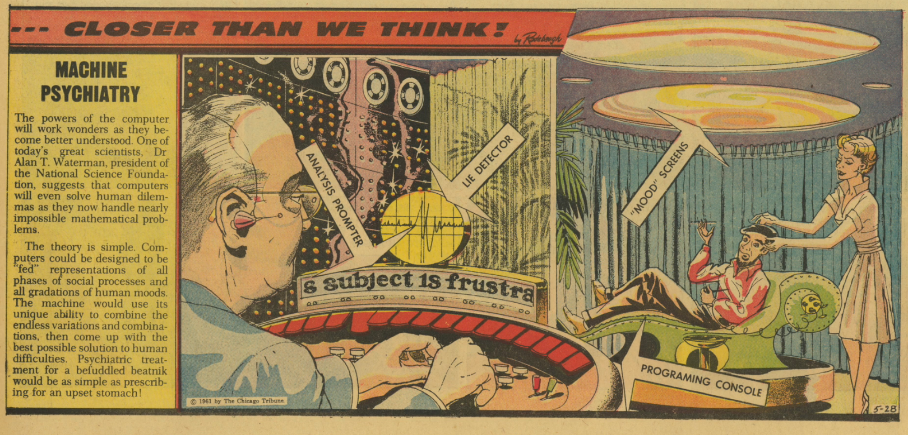
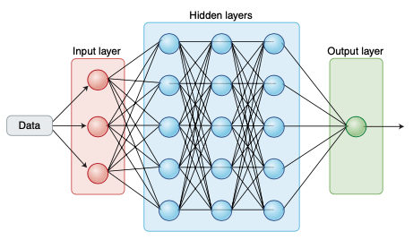

```{r setup, include=FALSE}
options(htmltools.dir.version = FALSE)

library(tidyverse)
library(kableExtra)
library(ggplot2)
library(plotly)
library(htmlwidgets)
library(MASS)
library(ggpubr)
library(xaringanthemer)
library(xaringanExtra)

style_duo_accent(
  primary_color = "#621C37",
  secondary_color = "#EE0071",
  background_image = "blank.png"
)

xaringanExtra::use_xaringan_extra(c("tile_view"))

use_scribble(
  pen_color = "#EE0071",
  pen_size = 4
  )

knitr::opts_chunk$set(
  fig.retina = TRUE,
  warning = FALSE,
  message = FALSE
)

# library(RefManageR)
# BibOptions(
# check.entries = FALSE, 
# bib.style = "authoryear", 
# cite.style = "authoryear", 
# style = "markdown",
# hyperlink = FALSE, 
# dashed = FALSE)
# myBib = ReadBib("/Users/stephangoerigk/Desktop/Universität/CFH/Lehre/Bachelor/Einführung in die Forschungsmethoden der Psychologie und Psychotherapie/EFPP_Folien/myBib.bib")
```

name: Title slide
class: middle, left
<br><br><br><br><br><br><br>
# Einführung in die Forschungsmethoden der Psychologie und Psychotherapie

### Einheit 9: Digitale Datenerhebung, Big Data und Machine-Learning
##### 12.01.2024 | Dr. Caroline Zygar-Hoffmann


---
class: top, left
name: content
### Heutige Themen

#### [Digitale Datenerhebung](#intro)

#### [Ambulatory Assessment](#AA)

#### [Big Data und Machine-Learning](#ML)

#### [Take-Aways](#take-away)

---
class: top, left
name: intro

### Digitale Datenerhebung

#### Globale Entwicklung der Digitalisierung

* Global zunehmende Digitalisierung

* 2014/15 besaßen über 60% der Bevölkerung in den USA ein Smartphone (Pew Research Center, 2014, 2015)

* Steigender Anteil von Menschen mit Internetzugang:

.center[
```{r eval = TRUE, echo = F, out.width = "650px"}

```
]

---
class: top, left
### Digitale Datenerhebung

#### Digitalisierung traditioneller Datenerhebungsmethoden

* Fragebögen und Tests können nicht nur in Paper Pencil Format, sondern auch in digitaler Form präsentiert werden

**Methode: Surveytools**

  * Digitalisierung der Messinstrumente durch die Forscher:innen
  
  * Forschungsmethodische Aspekte (z.B. Randomisierungslogik) wird miteinbezogen (programmiert)
  
  * Ausfüllen durch Proband:innen am Computer/Smartphone
  
  * Nach Ende der Datenerhebung $\rightarrow$ direkter Export der Daten ins digitale Format
  
**Vorteil:**

* Keine Übertragungsfehler
* Analyse kann direkt starten

---
class: top, left
### Digitale Datenerhebung

#### Digitalisierung traditioneller Datenerhebungsmethoden

**Surveytools - Beispiel Unipark:**

.center[
```{r eval = TRUE, echo = F, out.width = "750px"}

```
]

$\rightarrow$ recht benutzerfreundlich, aber kostenpflichtig

---
class: top, left
### Digitale Datenerhebung

#### Digitalisierung traditioneller Datenerhebungsmethoden

**Surveytools - Beispiel formR:**

.center[
```{r eval = TRUE, echo = F, out.width="75%"}
knitr::include_graphics("bilder/formr.png")
```
]

$\rightarrow$ Surveys werden über Exceltabelle konfiguiert, mächtig und dadurch sehr flexibel, versteht R Befehle, kostenfrei

---
class: top, left
### Digitale Datenerhebung

#### Digitalisierung traditioneller Datenerhebungsmethoden

**Ausfüllen durch Proband:innen am Computer/Smartphone:**

.pull-left[
.center[
```{r eval = TRUE, echo = F, out.width = "380px"}
knitr::include_graphics("bilder/unipark3.png")
```
]
]
.pull-right[
.center[
```{r eval = TRUE, echo = F, out.width = "450px"}
knitr::include_graphics("bilder/unipark2.png")
```
]
]

$\rightarrow$ Erstellen digitaler Umfragen wird im Modul Empirisch-wissenschaftliches Arbeiten gelernt (2. Semester)

---
class: top, left
### Digitale Datenerhebung

#### Möglichkeiten und Vorteile digitaler Datenerhebung

Möglichkeit Daten unabhängig von der physischen Distanz zwischen den Forschungseinrichtungen und den Teilnehmer:innen zu erheben 

Dabei lassen sich zwei Klassen von Vorteilen unterscheiden:

* Quantitativ: Steigerung Effizienz bzw. besser Verhältnis von Aufwand zu Kosten und erleichterte Datenerhebung 
* Qualitativ: Neuartige Forschungsmöglichkeiten und -themen
  
**Beispiele für derartige Vorteile sind:**

* Stichprobengröße und Teststärke
* Zeitökonomie
* Wegfall von kopräsenter Versuchsleitung und Versuchsleitereffekten
* Diversifizierung der Stichproben  
* Transparenz und Überprüfbarkeit
* Verringerung des Reaktivitätsproblems
* Erreichbarkeit von Stichproben mit hochspezifischen Merkmalen

---
class: top, left
### Digitale Datenerhebung

#### Nachteile digitaler Datenerhebung

Digitale Datenerhebung bietet der psychologischen Forschung nicht nur Möglichkeiten und Vorzüge, sondern ist auch mit Risiken und potenziellen Nachteilen behaftet.

Dabei lassen sich zwei Klassen von Nachteilen unterscheiden:

* Güte der Untersuchung 
* Aspekte der Forschungsethik
  
**Beispiele für derartige Nachteile sind:**

* Verringerung der Repräsentativität der Stichproben und der Generalisierbarkeit der Befunde
* Erschwerte Kontrolle über die Bedingungen der Datenerhebung (die Einhaltung von Instruktionen)
* Erschwerte Prüfung der Identifizierbarkeit
* Erschwerter Schutz der Teilnehmenden
* Erschwerte Überprüfung des Verständnisses wichtiger Informationen
* Datenschutz

---
class: top, left
name: AA

### Ambulatory Assessment (AA)

#### Was ist Ambulatory Assessment?

* **Wiederholte Erfassung** der aktuellen Gedanken, Emotionen, Verhaltensweisen, physiologischen Zustände und des Kontexts von Menschen **in ihrer natürlichen Umgebung** und möglichst im Moment in dem Sie auftreten ("Real-time Data Capturing" bzw. "Real-time Monitoring")

* Typischerweise (aber nicht notwendigerweise) über elektronische tragbare Geräte 

* Der Begriff "Ambulatory Assessment" (Ebner-Priemer & Trull, 2009) umfasst eine Reihe methodischer Ansätze
  - "Experience Sampling Method" (ESM, Larson & Csikszentmihalyi, 1983), auch "Ecological Momentary Assessment" (EMA, Shiffmann et al., 2008), "Ambulatory Self-reporting" (Conner & Feldman Barrett, 2012), "Continuous Unified Electronic Diary Method" (Ellis-Davies, Sakkalou, Fowler, Hilbrink, & Gattis, 2012)
  - "Daily Diaries" (Gunthert & Wenze, 2012)
  - "Mobile Sensing"
  - "Ambient Sensing"
  
* Die verschiedenen Begriffe betonen unterschiedliche Aspekte der Forschung (z.B. was wird erfasst, wie oft wird erfasst) und werden auch in verschiedenen Subdisziplinen häufiger oder weniger häufig genutzt


---
class: top, left
### Ambulatory Assessment (AA)

#### Aktives vs. Passives Ambulatory Assessment

In der AA-Forschung unterscheiden wir zwei Formen der Datenerhebung:

1) **Aktives AA**, bei dem Selbstauskunftsdaten erhoben werden

  * verlangt von den Teilnehmern, dass sie bewusst Informationen bereitstellen
  
  * Beispiel: Stimmung bewerten, nachdem Frage auf dem Smartphone erscheint


2) **Passives AA**, bei dem Beobachtungsdaten erhoben werden

  * Informationen werden durch Wearables oder Logdateien ohne aktive Beteiligung der Teilnehmer gesammelt.
  
  * Beispiel: Herzfrequenz, Aktivität, Smartphone-Nutzung oder Engagement in sozialen Medien

---
class: top, left
### Ambulatory Assessment (AA)

#### Aktives vs. Passives Ambulatory Assessment

Eine Studie zum Schlafverhalten kann z.B. ein Schlaftagebuch mit Selbstauskunft und einen Beschleunigungssensor umfassen:

1) **Aktives AA**: Datenerhebung, indem den Teilnehmern Fragen gestellt werden, z.B. mit Hilfe einer EMA-App:

.center[
```{r eval = TRUE, echo = F, out.width = "550px"}

```
]

2) **Passives AA**: Daten werden automatisch gesammelt, zum Beispiel durch ein Wearable:

.center[
```{r eval = TRUE, echo = F, out.width = "550px"}

```
]


---
class: top, left
### Ambulatory Assessment (AA)

#### Aktives AA: ESM/EMA Sampling

ESM/EMA kann zwei unterschiedlichen Messregimen folgen:

1) **Time-contingent sampling** bzw. **Signal-contingent sampling** 

Teilnehmer antworten auf Fragen zu einem bestimmten Zeitpunkt, wenn sie durch ein Signal dazu aufgefordert werden ("Beeps")
  
* Fixed scheme: Teilnehmer werden zu festen Zeitpunkten aufgefordert, z. B. um 9:30 und 16:30 Uhr
* Random scheme: Aufforderungen werden zu zufälligen Zeitpunkten gesendet, aber i.d.R. in vorher festgelegten Intervallen
  * Vorteil 1:  Teilnehmer erhalten nicht mehrere Aufforderungen innerhalb eines begrenzten Zeitrahmens
  * Vorteil 2:  Teilnehmer werden nicht durch Aufforderungen zu unpassenden Zeiten belästigt (z.B. 20:00 - 07:30)

---
class: top, left
### Ambulatory Assessment (AA)

#### Aktives AA: ESM/EMA Sampling

ESM/EMA kann zwei unterschiedlichen Messregimen folgen:

2) **Event-contingent sampling**

Teilnehmer antworten auf Fragen, wenn ein bestimmtes Ereignis eintritt, z.B. eine Panikattacke oder Alkoholkonsum
  
* Möglichkeit 1: Teilnehmer bitten, Fragen auszufüllen, sobald das Ereignis eintritt
* Möglichkeit 2: Kombination Aktives + Passives EMA
  * z.B. Stellen der Frage, wenn bestimmtes Aktivitätslevel überstiegen wird
  * z.B. Stellen der Frage, wenn bestimmte GPS Location erreicht wird

---
class: top, left
### Ambulatory Assessment (AA)

#### Aktives AA: Beispiele

```{r eval = TRUE, echo = F, out.width = "30%"}
knitr::include_graphics("bilder/tellmi3.png")


knitr::include_graphics("bilder/tellmi2.png")


knitr::include_graphics("bilder/tellmi1.png")
```

---
class: top, left
<div class="footer"><span>Russell, J. A. (1980). A circumplex model of affect. Journal of personality and social psychology, 39(6), 1161.<br>Russell, J. A., Weiss, A., & Mendelsohn, G. A. (1989). Affect grid: a single-item scale of pleasure and arousal. Journal of personality and social psychology, 57(3), 493.</span></div>

### Ambulatory Assessment (AA)

#### Aktives AA: Beispiele

**Multi-dimensionale Stimmungsmessung**

.pull-left[
.center[
```{r eval = TRUE, echo = F, out.width = "400px"}
knitr::include_graphics("bilder/affect_grid.png")
```
]
]
.pull-right[
<small>

**Zirkumplexmodell des Affekts** (Russell, 1980; Russell et al. 1989) 
* Alle Stimmungszustände sind lineare Kombination aus zwei unabhängigen, bipolaren Skalen: 
  * Valenz (von unangenehm bis angenehm) 
  * Erregung/Aktivierung (von niedriger bis hoher Erregung). 
  
* Kombination ordnet die affektiven Zustände auf einem von vier Quadranten an $\rightarrow$ Messung über ein "Affect Grid" (Bild links)

* Nachteil: Konzepte von Valenz und Erregung können den Befragten schwer zu vermitteln sein
]
</small>


---
class: top, left
### Ambulatory Assessment (AA)

#### Aktives AA: Warum ESM/EMA?

**Zur Minimierung von Gedächtnisfehlern**

* Klinische Forschung: Selbstauskunftsfragebögen, um das Vorhandensein und den Schweregrad von Symptomen in der jüngsten Vergangenheit zu bewerten (z.B. letzte 14 Tage)

* Retrospektive Selbstberichte sind zwar nützlich, aber nicht ohne Nachteile

  * greifen auf die Erinnerung der Befragten zurück
  * Diese kann verzerrt sein  (Moore, Depp, Wetherell, & Lenze, 2016). 

ESM/EMA Lösung: Messung des aktuellen Zustands statt Reflexion über vergangene Erfahrungen 

---
class: top, left
### Ambulatory Assessment (AA)

#### Aktives AA: Warum ESM/EMA?

**Maximierung der ökologischen Validität**

* Erhebung von Daten in realen Umgebungen, in denen die Teilnehmer ihren täglichen Aktivitäten nachgehen

* Keine Datenerhebung in kontrollierten Laboren oder Forschungseinrichtungen

  * Folge 1: bessere Verallgemeinerbarkeit auf die gelebte Erfahrung der Probanden in der realen Welt

  * Folge 2: praktische Anwendungen, die aus EMA Daten abgeleitet werden, haben größere Relevanz für reale Situationen 

---
class: top, left
### Ambulatory Assessment (AA)

#### Aktives AA: Warum ESM/EMA?

**Idiographische Forschung vorantreiben**

* Ergebnisse auf Gruppenebene lassen sich nicht unbedingt auf einzelne Mitglieder der Gruppe verallgemeinern

* Aktives AA ermöglicht Erhebung großer Mengen quantitativer Daten auf individueller Ebene (Unterschied z.B. zum qualitativen Interview)

* ermöglicht ein besseres Verständnis von Faktoren, die Variabilität innerhalb und zwischen Individuen erklären


---
class: top, left
### Ambulatory Assessment (AA)

#### Aktives AA: Warum ESM/EMA?

**Idiographische Forschung vorantreiben**

Veranschaulichung, wie sich Prozesse auf Gruppenebene und auf individueller Ebene dramatisch unterscheiden können $\rightarrow$ "**Simpson's Paradox**": 

.center[
```{r eval = TRUE, echo = F, out.width = "700px"}
knitr::include_graphics("bilder/idiographic-1.png")
```
]

* Beziehung zwischen x und y ist in der Gruppe negativ (durch absteigende Regressionslinie dargestellt)
* aber positiv für Individuen (durch Ellipsen markiert).


---
class: top, left
### Ambulatory Assessment (AA)

#### Aktives AA: Warum ESM/EMA?

**Das dynamische Zusammenspiel zwischen Symptomen verstehen**

* In der Netzwerktheorie der Psychopathologie (Borsboom, 2017) werden psychische Störungen als Netzwerke von Symptomen konzeptualisiert

* Wiederkehrende Kausalschleifen halten das Netzwerk in einem "gestörten" Zustand  (z.B. Schlafprobleme -> Müdigkeit -> Grübeln -> Schlafprobleme)

* Ziel Identifizierung patientenspezifischer Symptomnetzwerke
  * Zentrale Symptome können mit personalisierten Interventionen angegangen werden
  * Selbsterhaltende Schleifen durchbrechen

* Identifizierung dieser Netzwerke erfordert wiederholte Bewertungen von Symptomen im realen Leben (aktives AA)

---
class: top, left
### Ambulatory Assessment (AA)

#### Aktives AA: Warum ESM/EMA?

**Das dynamische Zusammenspiel zwischen Symptomen verstehen**

Phasen der Entwicklung psychischer Störungen nach der Netzwerktheorie (Boorsbom, 2017):

.pull-left[

.center[
```{r eval = TRUE, echo = F, out.width = "450px"}

```
]
]

.pull-right[
* **Phase 1:** Asymptomatische Phase - das Netzwerk ist inaktiv 
* **Phase 2:** Externes Ereignis (E1) aktiviert einige der Symptome 
* **Phase 3:** Symptome aktivieren ihrerseits verbundene Symptome 
* **Phase 4:** Ist das Netzwerk stark vernetzt, führt die Beseitigung des externen Ereignisses nicht zu einer Erholung: Das Netzwerk ist selbsterhaltend und verharrt in seinem aktiven Zustand
]

---
class: top, left
### Ambulatory Assessment (AA)

#### Aktives AA: Warum ESM/EMA?

**Das dynamische Zusammenspiel zwischen Symptomen verstehen**

Resilientes vs. anfälliges Netzwerk (Boorsbom, 2017):

.center[
```{r eval = TRUE, echo = F, out.width = "650px"}
knitr::include_graphics("bilder/borrsbom2.png")
```
]

* Ein schwach vernetztes Netzwerk (oberes Feld) ist widerstandsfähig. 
* Symptome können durch externe Ereignisse aktiviert werden, aber die Symptom-Symptom-Interaktionen sind nicht stark genug, um zu einer sich selbst erhaltenden Symptomaktivität zu führen. 
* Ein stark vernetztes Netzwerk (unteres Feld) hingegen kann seine eigene Aktivität aufrechterhalten auch wenn das externe Ereignis vorüber ist, und ist dadurch anfällig sich zu einem Störungszustand entwickeln.

---
class: top, left
### Ambulatory Assessment (AA)

#### Aktives AA: Warum ESM/EMA?

**Ermöglichung von Ecological Momentary Interventions (EMI)**

* EMI: Interventionen, die den Menschen in ihrem Alltag, in Echtzeit und in ihrer natürlichen Umgebung angeboten werden

.center[
```{r eval = TRUE, echo = F, out.width = "70%"}
knitr::include_graphics("bilder/emi_paper.png")
```
]

* Personalisierung möglich hinsichtlich Timing und Art der Intervention:
  * Timing: Wenn aktives AA deutliche Veränderungen in relevanten pathologischen Prozessen widerspiegelt
  * Art: Auf eine Art und Weise, die in Anbetracht dessen, was über die Person bekannt ist, maximal effektiv ist


---
class: top, left

### Ambulatory Assessment (AA)

#### Passives AA: Sensing

.pull-left[
.center[
```{r eval = TRUE, echo = F, out.width = "350px"}
knitr::include_graphics("bilder/ambient.png")
```
]
**Ambient sensing:**

* Sensortechnik bei Teilnehmer:innen zuhause
* Internet der Dinge
* Bewegungssensorik, Kameras, etc.

]
.pull-right[
.center[
```{r eval = TRUE, echo = F, out.width = "450px"}
knitr::include_graphics("bilder/sp.jpg")
```
]
**Mobile sensing:**

* Nutzen der Smartphone Sensortechnik
* Bewegungsdaten, Smartphone-Nutzungsdaten (Ladezyklen, Bildschirm-Check, etc.)
* Online-Aktivität
]

---
class: top, left

### Ambulatory Assessment (AA)

#### Passives AA: Mobile Sensing mit Geotracking


.pull-left[
* Ausnutzung des Global Positioning System (GPS)

* Genaue Position über Breitengrad und Längengrad

* z.B. latitude: 52.37022; longitude: 4.89517

.center[
```{r eval = TRUE, echo = F, out.width = "450px"}
knitr::include_graphics("bilder/Latitude_and_Longitude_of_the_Earth.png")
```
]
]
.pull-right[

Beispiel:

* 4-wöchiges GPS Bewegungsmuster (von 2 Personen)

* links depressiv, rechts nicht depressiv

.center[
```{r eval = TRUE, echo = F, out.width = "450px"}

```
]
]

---
class: top, left
name: ML

### Big Data und Machine-Learning

#### Computer und mentale Gesundheit

* Idee, Computer einzusetzen, um Diagnostik und Prognostik von  Erkrankungen zu verbessern, ist nicht neu  

* 60er Jahre:

.center[
```{r eval = TRUE, echo = F, out.width = "750px"}

```
]

---
class: top, left
### Big Data und Machine-Learning

#### Computer und mentale Gesundheit

* Arthur Radbow (60er Jahre): Machine Psychiatry aus „Closer than we think“. 
  * Idee: einen  Computer zu füttern mit allen Wesensäußerungen des Patienten. 
  * Computer lernt aus den unterschiedlichsten Kombinationen von emotionalen Ausdrücken, Kognitionen und Verhalten, Entscheidungsregeln abzuleiten
  * Die Kliniker:in kann diese verwenden, um Therapie danach auszurichten. 

.pull-left[
* Dichte an Informationen,  die wir über Erkrankungen haben – nicht nur über psychische Erkrankungen, sondern generell über Erkrankungen – nimmt exponentiell zu

* Problem: menschliche Kapazität mit diesem Wissen umzugehen ist begrenzt (Schere verfügbares vs. kognitiv verarbeitbares Wissen)
]

.pull-right[
```{r eval = TRUE, echo = F, out.width = "650px"}

```
]

---
class: top, left
### Big Data und Machine-Learning

#### Big data - Definition

.pull-left[
* große Datenmengen, die zu komplex sind, um sie mit traditionellen Methoden zu verarbeiten.

* umfasst sowohl strukturierte als auch unstrukturierte Daten, wie z.B. Text, Bilder, Audio- und Videodateien.

* Ziel: Muster, Trends und Verbindungen in den Daten zu erkennen und zu nutzen.

* Neue Technologien ermöglichen es, große Datenmengen zu speichern und zu verarbeiten.

* kann in vielen Bereichen wie Finanzen, Gesundheitswesen, Marketing und E-Commerce eingesetzt werden.

]

.pull-right[
.center[
```{r eval = TRUE, echo = F, out.width = "650px"}
knitr::include_graphics("bilder/bigd.jpg")
```
]
]

---
class: top, left
### Big Data und Machine-Learning

#### Machine Learning

* Computerstrategie, die *automatisch* Methoden und Parameter bestimmt (d.h. lernt), um eine optimale Lösung für ein Problem zu finden

* Wird nicht von vornherein von einem Menschen programmiert, um eine fixe Lösung zu liefern. 

* Wird als Teilgebiet der künstlichen Intelligenz (KI) betrachtet

* Lernprozess simuliert vermeintlich eine Facette der menschlichen Intelligenz  

* Kann für vermeintlich intelligente Zwecke eingesetzt werden (z.B. Sprache, Schrift, Gesichtserkennung, selbstfahrende Autos oder medizinische Entscheidungshilfen).

<!-- ### Big Data und Machine-Learning -->

<!-- #### Machine Learning - grobe Time Line -->

<!-- <small> -->

<!-- * 1940s-1950s: Entstehung der der Idee von neuronalen Netzen als möglichem Ansatz für künstliche Intelligenz (KI)  -->

<!-- * 1950s-1960s: Entwicklung von einfachen neuronalen Netzen und erste Anwendungen in Bereichen wie Handwriting Recognition und Bilderkennung. -->

<!-- * 1970s-1980s: Rückschlag in der Entwicklung von neuronalen Netzen aufgrund von Problemen mit dem Training und der Generalisierung. -->

<!-- * 1980s-1990s: Wiederaufleben des Interesses an neuronalen Netzen durch den Einsatz von "error backpropagation" und anderen verbesserten Trainingsalgorithmen. -->

<!-- * 1990s: Einführung von Support Vector Machines (SVMs) und anderen "shallow" Machine Learning-Methoden. -->

<!-- * 2000s: Einführung von "Big Data" und "Data Mining" als Schlagworte, sowie die Verfügbarkeit von großen Datenmengen und leistungsfähigen Computern. -->

<!-- * 2010s: Explosion des Interesses an "Deep Learning" und der Verfügbarkeit von großen, gut strukturierten Datensätzen und leistungsfähigen Grafikprozessoren (GPUs) für das Training tiefer Netze. -->

<!-- * 2020s: Deep Learning und Machine Learning werden in vielen Bereichen angewendet, wie zum Beispiel Computer Vision, Natur Sprachverarbeitung, Robotics und Medizin. -->

<!-- </small> -->

---
class: top, left
### Big Data und Machine-Learning

#### Machine Learning - die Anfänge

.pull-left[

**Das Perzeptron:**

* Ziel: eine Maschine zu bauen, die ihre eigenen Formeln entwickelt, um Probleme durch Lernen zu lösen (Rosenblatt, 1958)

* Aufgabe: Bilder von Dreiecken von Quadraten unterscheiden mittels 400 Lichtsensoren

* Unterscheidung von Dreiecken von Quadraten nicht expliziert programmiert $\rightarrow$ Training über **Trial und Error** Prozess

]

.pull-right[
.center[
```{r eval = TRUE, echo = F, out.width = "300px"}
knitr::include_graphics("bilder/rose.jpg")
```
]
]

$\rightarrow$ In den Anfängen des maschinellen Lernens ging es also darum, dass eine Maschine mit Hilfe realer Daten lernt begrenzte Vorannahmen darüber zu treffen, wie diese Daten aussehen, und dass die Leistung der Maschine unter realen Bedingungen bewertet wird.

<!-- ### Big Data und Machine-Learning -->

<!-- #### Machine Learning - grobe Time Line -->

<!-- .pull-left[ -->

<!-- **Das Perzeptron:** -->

<!-- * Über viele Versuche hinweg änderte die Maschine die statistischen Gewichte, die mit jedem Lichtsensor verbunden waren, anhand einer internen Gleichung  -->

<!-- * Die Antworten einiger Sensoren wurden  sehr stark gewichtet, während andere (z. B. die in einem Viereckmuster) nicht gewichtet wurden -->

<!-- * In den Anfängen des maschinellen Lernens ging es also darum, aus realen Daten zu lernen, begrenzte Vorannahmen darüber zu treffen, wie diese Daten aussehen, und die Leistung der Maschine unter realen Bedingungen zu bewerten. -->
<!-- ] -->

<!-- .pull-right[ -->
<!-- .center[ -->
<!-- ```{r eval = TRUE, echo = F, out.width = "650px"} -->
<!--  -->
<!-- ``` -->
<!-- ] -->
<!-- ] -->

---
class: top, left
### Big Data und Machine-Learning

#### Machine Learning - die Anfänge

* Das Perzeptron trug dazu bei, die Betrachtungsweise von Computern zu ändern

* Vorher: Rechenmaschinen, die die von vornherein mit bereits bekannten Formeln und Regeln programmiert werden mussten

* Nachher: Computer, die unscharfe Regeln selbständig erlernen konnten (z. B. Erkennung von Mustern). 

* Dieser frühe Erfolg löste einen großen Hype aus, der größtenteils aus phantasievollen Verallgemeinerungen der zugrundeliegenden Logik auf andere Probleme bestand

* Die Seifenblase platzte jedoch, als sich die Hoffnungen aufgrund der Beschränkungen der frühen Algorithmen und der damals verfügbaren Rechenleistung nicht erfüllten. 

* Einige dieser Beschränkungen, in denen traditionelle Modelle und Algorithmen nicht optimal funktioniert haben, können nun aufgrund der gestiegenen Rechenleistung, die es Maschinen ermöglicht, aus manchmal sehr komplexen Daten zu lernen, überwunden werden.

---
class: top, left
### Big Data und Machine-Learning

#### Machine Learning - Entwicklungen

Machine Learning Algorithmen sind heute in unser tägliches Leben integriert 

* Internet-Suchen 
  
* Produktempfehlungen
  
* Spracherkennungsdienste
  
* selbstfahrende Autos 
  
* Bildklassifikation
  
* Sprachmodelle (z.B. DeepL)
  
* Generative Modelle (z.B. ChatGPT)


---
class: top, left
### Big Data und Machine-Learning

#### Machine Learning - Entwicklungen im Gesundheitswesen

* Hoffnung, klinische Entscheidungsfindung durch Informationsverabeitung zu verbessern

* Präzisionsmedizin (taylored treatments): Richtige Behandlung für richtige Patient:in zur richtigen Zeit

.center[
```{r eval = TRUE, echo = F, out.width = "950px"}
knitr::include_graphics("bilder/klin.png")
```
]

---
class: top, left
### Big Data und Machine-Learning

#### Machine Learning - Entwicklungen im Gesundheitswesen

* Ansatz des maschinellen Lernens  im Gesundheitswesen funktioniert insbesondere gut  bei Aufgaben, bei denen es um Mustererkennung in Bildern geht

* ML ebenso gut oder besser abgeschnitten als Kliniker, etwa bei 
  * Erkennung von Hautkrebs (Esteva et al. 2017)
  * Lungenkrebs (Yu et al. 2016) 
  * Brustkrebs (z. B. Samsung, RS80A)
  * Augenerkrankungen (Long et al. 2017)
  

*  Fortschritte treiben das rasche Wachstum kommerzieller Lösungen für maschinelles Lernen im Gesundheitswesen voran


---
class: top, left
### Big Data und Machine-Learning

#### Machine Learning - Entwicklungen im Gesundheitswesen

**Psychologisches Beispiel: Vorhersage von Schizophrenie-Onset im Prodrom (Koutsouleris et al. 2021)**

.center[
```{r eval = TRUE, echo = F, out.width = "850px"}
knitr::include_graphics("bilder/pronia.png")
```
]

---
class: top, left
### Big Data und Machine-Learning

#### Klassen von Machine Learning

<small>

Man unterscheidet im Machine Learning i.d.R. drei unterschiedliche Anwendungsbereiche:

* **Unsupervised Learning:**
  * Beinhaltet keine vorgegebenen Labels oder Zielvariablen.
  * Ziel ist es, unbekannte Strukturen oder Muster in den Daten zu entdecken.
  * Beispiele: Clustering, Dimensionality Reduction.
  
* **Supervised Learning:**
  * Beinhaltet vorgegebene Labels oder Zielvariablen.
  * Ziel ist es, ein Modell zu entwickeln, das in der Lage ist, neue Datenpunkte richtig vorherzusagen. $\rightarrow$ "Prädiktive Modellierung"
  * Beispiele: Regression, Klassifikation.
  
* **Reinforcement/Reward Learning:**
  * Beinhaltet ein Agent-System, das in einer Umgebung agiert und Entscheidungen trifft.
  * Ziel ist es, das Verhalten des Agenten so anzupassen, dass es möglichst hohe Belohnungen erhält.
  * Beispiele: Game-playing, Robotics.

$\rightarrow$ Es ist zu beachten, dass diese drei Arten von Machine Learning-Methoden nicht immer klar voneinander abgegrenzt sind und es auch überlappende Anwendungen gibt.

</small>

---
class: top, left
### Big Data und Machine-Learning

#### Klassen von Machine Learning

##### Unsupervised Learning und Supervised Learning

* Lassen sich noch auf klassische statistische Fragestellungen zurückführen

* Output dieser Algorithmen ist eine Kategorie, bzw. eine Zahl

.pull-left[
* **Unsupervised Learning:** Gruppierungsvorschläge für chaotische Datenstrukturen, ohne Vorkenntnis von Kategorien (Clustering) $\rightarrow$ wichtig für Entdeckung neuer Krankheitsmuster etc.

* **Supervised Learning:** versucht bereits bekannte Kategorien in Daten anhand anderer Informationen in den Daten wiederzuerkennen/vorherzusagen $\rightarrow$ wichtig für klinische Prognosen/Diagnosen
]
.pull-right[
.center[
```{r eval = TRUE, echo = F, out.width = "650px"}
knitr::include_graphics("bilder/supervised-vs-unsupervised-ml.png")
```
]
]

---
class: top, left
### Big Data und Machine-Learning

#### Klassen von Machine Learning

##### Logik der Prädiktiven Modellierung

.pull-left[
**Szenario:**

* Wir haben einen Trainingsdatensatz mit Brainscans 

* Wir wissen für Personen im Trainingsdatensatz, wer eine Diagnose hatte (rot) und wer nicht (blau)

* Prädiktion: Für neue Person (nicht im Datensatz) auf Basis der Brainscans vorhersagen, ob Diagnose vorhanden

]
.pull-right[
.center[
```{r eval = TRUE, echo = F, out.width = "150px"}
knitr::include_graphics("bilder/pred1.png")
```
]
.center[
```{r eval = TRUE, echo = F, out.width = "350px"}
knitr::include_graphics("bilder/pred0.1.png")
```
]
]

---
class: top, left
### Big Data und Machine-Learning

#### Klassen von Machine Learning

##### Logik der Prädiktiven Modellierung

.pull-left[
**Schritt 1:**

* Im Trainingsdatensatz das Modell auf Basis der Aktivierungsmuster im Brainscan trainieren

* Das heißt, das Modell versucht anhand der vorhandenen Daten herauszufinden woran es Personen mit und ohne tatsächliche Diagnose unterscheiden kann

]
.pull-right[
.center[
```{r eval = TRUE, echo = F, out.width = "650px"}
knitr::include_graphics("bilder/pred2.png")
```
]
]

---
class: top, left
### Big Data und Machine-Learning

#### Klassen von Machine Learning

##### Logik der Prädiktiven Modellierung

.pull-left[
**Schritt 2:**

* Prüfen, ob durch das Modell die tatsächliche Diagnose von Personen **im Trainingsdatensatz** vorhersagen kann (d.h. ob in den Daten überhaupt Informationen vorhanden sind, anhand derer eine Vorhersage möglich ist) .

**Genauigkeitsmaße**

* Vorhersagegenauigkeit = **Accuracy**
* Vorliegen von tatsächlicher Diagnose korrekt erkennen = **Sensitivität**
* Abwesenheit von tatsächlicher Diagnose korrekt erkennen = **Spezifität**

]
.pull-right[
.center[
```{r eval = TRUE, echo = F, out.width = "350px"}
knitr::include_graphics("bilder/pred3.png")
```

```{r eval = TRUE, echo = F, out.width = "300px"}

```
]
]

---
class: top, left
### Big Data und Machine-Learning

#### Klassen von Machine Learning

##### Logik der Prädiktiven Modellierung

**Schritt 3:** Generalisierbarkeit und Kreuzvalidierung

* Um zu prüfen, ob das trainierte Modell gut funktioniert, müssen wir es validieren

* **Validierung**: Modell an Fällen erproben die nicht im Trainingsset dabei waren (d.h. an bis dahin unbekannten Personen)

* VORSICHT: strikte Trennung zwischen Trainings- und Testdaten (Data-Leakage) $\rightarrow$ sonst droht ein **Overfit**
  * Unfairer Vorteil: Vorhersage von Fällen, die das Modell schon "kennt"
  * Modell würde sonst besser performen, als in der Realität

* Einfachstes Szenario: **Simple Split** $\rightarrow$ Datensatz wird z.B. 50/50 in Tranings- und Testdatensatz geteilt
  * Problem: Forscher könnte genau so trennen, dass Modell gut funktioniert (das wäre Schummeln)
  
* Lösung: (k-fold) **Nested-Cross-Validation** (häufigstes Modell für kleinere Datensätze)

---
class: top, left
### Big Data und Machine-Learning

#### Klassen von Machine Learning

##### Logik der Prädiktiven Modellierung

**Schritt 3:** Generalisierbarkeit und Kreuzvalidierung

.pull-left[
<small>
** (k-fold) Nested-Cross-Validation:**

* Datensatz wird in k Folds geteilt (hier k=5)

* Runde 1: Training: 1-4 Folds, Test: 5. Fold
* Runde 2: Training: 1,2,3,5 Folds, Test: 4. Fold
* Runde 3: Training: 1,2,4,5 Folds, Test: 3. Fold
* ...

* Am Ende Gesamtgenauigkeit ausrechnen

* Vorteil: Kein Overfit + ganzer Datensatz kann ohne Data-Leakage genutzt werden 

</small>
]
.pull-right[
.center[
```{r eval = TRUE, echo = F, out.width = "650px"}

```
]
.center[
```{r eval = TRUE, echo = F, out.width = "550px"}
knitr::include_graphics("bilder/nested.png")
```
]
]

---
class: top, left
### Big Data und Machine-Learning

#### Klassen von Machine Learning

##### Logik der Prädiktiven Modellierung

**Generalisierbarkeitspyramide:**

.pull-left[
* Je unterschiedlicher die Kontexte (z.B. zeitlich, geografisch, kulturell) von Traning und Test Folds, desto generalisierbarer ist das Modell

* Leave-Site-out $\rightarrow$ Folds = einzelne Studienzentren: Modell funktioniert nicht nur in Klinik A sondern auch in Klinik B
  
* External $\rightarrow$ Folds = einzelne Studien:  Modell funktioniert nicht nur in Studie A sondern auch in Studie B

* Prospective $\rightarrow$ Folds = Zeit: Modell kann Fälle vorhersagen, die in der Zukunft liegen
]
.pull-right[
.center[
```{r eval = TRUE, echo = F, out.width = "330px"}
knitr::include_graphics("bilder/pred5.png")
```
]
]

---
class: top, left
### Big Data und Machine-Learning
#### Klassen von Machine Learning

##### Reinforcement Learning

.pull-left[
* Beinhaltet das Erlernen von Funktionen und Entscheidungsregeln, um erhaltene Belohnungen zu maximieren (Fehler zu minimieren)

* Output dieser Algorithmen kann ein komplexes Verhalten sein

* Kann implizit auch Klassifikationen oder Gruppierungen beinhalten

* Beispiele sind Schach spielen lernen, autonomes Fahren, etc.
]
.pull-right[
.center[
```{r eval = TRUE, echo = F, out.width = "350px"}
knitr::include_graphics("bilder/reward.png")
```
]
.center[
```{r eval = TRUE, echo = F, out.width = "350px"}
knitr::include_graphics("bilder/tesla.jpg")
```
]
* Output: z.B. Lenkrad links/rechts drehen
* Objective Function: schnell ans Ziel ohne Unfall/Risiko
]

---
class: top, left
### Big Data und Machine-Learning

#### Klassen von Machine Learning

**Gradient Descent**

* Lernen = Fehlerveringerung (Trial + Error)
* Standardmethode zur Modelloptimierung: Gradient Descent
* Schrittweise (inkrementelle) Modellanpassung veringert den Fehler
* VORICHT: Lokale Minima müssen vermieden werden

.pull-left[
.center[
```{r eval = TRUE, echo = F, out.width = "280px"}
knitr::include_graphics("bilder/gradient1.png")
```
]
]
.pull-right[
.center[
```{r eval = TRUE, echo = F, out.width = "280px"}
knitr::include_graphics("bilder/gradient2.png")
```
]
]


<!-- ### Big Data und Machine-Learning -->

<!-- #### Machine Learning - Arten -->

<!-- Shallow Learning vs. Deep Learning -->

<!-- * Shallow Learning: -->
<!--   * Einfachere Modelle, die schneller trainiert und implementiert werden können. -->
<!--   * In der Regel benötigen sie weniger Daten, um zu trainieren. -->
<!--   * Geeignet für Probleme mit einfachen Strukturen und klaren Mustern. -->
<!--   * Beispiele: Regression, Support Vector Machines (SVMs) -->

<!-- * Deep Learning: -->
<!--   * Komplexere Modelle, die länger trainiert und implementiert werden müssen. -->
<!--   * In der Regel benötigen sie mehr Daten, um zu trainieren. -->
<!--   * Geeignet für Probleme mit komplexen Strukturen und unsicheren Mustern. -->
<!--   * Beispiele: Convolutional Neural Networks (CNNs), Recurrent Neural Networks (RNNs), Autoencoder. -->

<!-- ### Big Data und Machine-Learning -->

<!-- #### Machine Learning - Arten -->
<!-- .pull-left[ -->
<!-- ##### Shallow Learning: -->

<!-- Beispielalgorithmen: -->

<!-- * k-Nearest Neighbors (k-NN) -->
<!-- * Naive Bayes -->
<!-- * Linear/Logistic Regression -->
<!-- * Decision Trees und Random Forest -->
<!-- * Gradient Boosting -->
<!-- * Support Vector Machines (SVMs) -->
<!-- * Principal Component Analysis (PCA) -->
<!-- ] -->
<!-- .pull-right[ -->
<!-- .center[ -->
<!-- Support Vector Machine: -->
<!-- ```{r eval = TRUE, echo = F, out.width = "350px"} -->
<!-- knitr::include_graphics("bilder/svm.png") -->
<!-- ``` -->
<!-- ] -->
<!-- ] -->

<!-- ### Big Data und Machine-Learning -->

<!-- #### Machine Learning - Arten -->
<!-- .pull-left[ -->
<!-- ##### Shallow Learning: -->

<!-- Beispielalgorithmen: -->

<!-- * k-Nearest Neighbors (k-NN) -->
<!-- * Naive Bayes -->
<!-- * Linear/Logistic Regression -->
<!-- * Decision Trees und Random Forest -->
<!-- * Gradient Boosting -->
<!-- * Support Vector Machines (SVMs) -->
<!-- * Principal Component Analysis (PCA) -->
<!-- ] -->
<!-- .pull-right[ -->
<!-- .center[ -->
<!-- Decision Tree: -->

<!-- ```{r eval = TRUE, echo = F, out.width = "350px"} -->
<!-- knitr::include_graphics("bilder/Unknown.png") -->
<!-- ``` -->
<!-- ] -->
<!-- ] -->


<!-- * Tiefe des Machine Learning-Algorithmus steht nicht unbedingt mit seiner Leistungsfähigkeit in Verbindung  -->
<!-- * z.B. Random Forest und Gradient Boosting, können auch tiefere Netze verwenden  und somit als "shallow" oder "deep" angesehen werden -->

<!-- ### Big Data und Machine-Learning -->

<!-- #### Machine Learning - Arten -->

<!-- ##### Deep Learning -->

<!-- .pull-left[ -->
<!-- <small> -->

<!-- * Basiert auf künstlichen neuronalen Netzen, die aus Schichten von Neuronen (sogenannten "Knoten") bestehen. -->

<!-- * Jede Schicht wird trainiert, um bestimmte Merkmale oder Eigenschaften aus den Daten zu extrahieren. -->

<!-- * Die erste Schicht erkennt einfache Merkmale, die nächste Schicht erkennt komplexere Merkmale auf der Grundlage der ersten Schicht, und so weiter. -->

<!-- * Durch das Training der Netze mit großen Mengen an Daten, können die Neuronen selbstständig Muster und Zusammenhänge erkennen. -->

<!-- * Die tiefste Schicht des Netzes (die sogenannte "output layer") trifft schließlich die Entscheidung oder gibt eine Vorhersage ab. -->

<!-- </small> -->
<!-- ] -->

<!-- .pull-right[ -->
<!-- .center[ -->
<!-- ```{r eval = TRUE, echo = F, out.width = "650px"} -->
<!--  -->
<!-- ``` -->
<!-- ] -->
<!-- ] -->


---
class: top, left
### Big Data und Machine-Learning

#### Generative Modelle
.pull-left[

**Generative Adversarial Networks (GAN):**

* Können nach einem Vorbild Content erzeugen

* Klassifikationsalgorithmus tritt gegen generativen Algorithmus an
  
* Iterative Annäherung an Zielzustand durch Induktion von Zufälligkeit

* Es können ohne großen Aufwand neue Inhalte kreiert werden

]
.pull-right[
.center[
```{r eval = TRUE, echo = F, out.width = "600px"}
knitr::include_graphics("bilder/gan.jpeg")
```
]
]

<!-- ### Big Data und Machine-Learning -->

<!-- #### Generative Modelle - Bildtransfer -->

<!-- .center[ -->
<!-- ```{r eval = TRUE, echo = F, out.width = "800px"} -->
<!-- knitr::include_graphics("bilder/gan1.jpeg") -->
<!-- ``` -->
<!-- ] -->

---
class: top, left
### Big Data und Machine-Learning

#### Generative Modelle - Bildtransfer

.center[
```{r eval = TRUE, echo = F, out.width = "900px"}
knitr::include_graphics("bilder/gan2.jpg")
```
]

---
class: top, left
### Big Data und Machine-Learning

#### Generative Modelle - Reperatur kompromittierter MRT Scans

.center[
```{r eval = TRUE, echo = F, out.width = "900px"}
knitr::include_graphics("bilder/gan3.jpg")
```
]


---
class: top, left
### Big Data und Machine-Learning

#### Mensch-Maschine Interaktion

Analogie: Stufen autonomen Fahrens

```{r echo = F}
df = data.frame(Stufe = 0:5,
                Name = c("No automation", "Driver assistance", "Partial automation", "Conditional automation", "High automation", "Full automation"),
                Interaktion = c("Fehlen von Assistenzsystemen.",
                                "Systeme, die dem Fahrer helfen, die Geschwindigkeit zu halten oder in der Spur zu bleiben, aber dem Fahrer die Kontrolle überlassen.",
                                "Die Kombination aus automatischer Geschwindigkeits und Lenkung - zum Beispiel Tempomat und Spurhaltung.",
                                "Automatisierte Systeme, die die Umgebung steuern und überwachen, aber auf einen menschlichen Fahrer als Unterstützung angewiesen sind.",
                                "Automatisierte Systeme, die alles erledigen - ohne menschliche Unterstützung - aber nur unter bestimmten Umständen.",
                                "Der echte elektronische Chauffeur: Er behält die volle Kontrolle über das Fahrzeug, braucht keine menschliche Unterstützung und fährt unter allen Bedingungen."))

df %>%
  kbl() %>%
  kable_styling(font_size = 18) %>%
  kable_classic(full_width = T)
```

---
class: top, left
### Big Data und Machine-Learning

#### Mensch-Maschine Interaktion

.center[
```{r eval = TRUE, echo = F, out.width = "750px"}
knitr::include_graphics("bilder/stages.png")
```
]

* Stufe 5, d. h. eine vollständige Automatisierung ohne die Möglichkeit der Unterstützung von Klinikpersonal ist nicht das Ziel. 
* Auch Stufe 4 mit menschlicher Unterstützung unter sehr begrenzten Bedingungen ist nicht das Ziel. 
* Angestrebt werden Synergieeffekte, d. h. die Kombination von Funktionen, die Maschinen am besten erledigen, mit solchen, die am besten für Kliniker:innen geeignet sind.
 
---
class: top, left
### Big Data und Machine-Learning

#### Klinische Akzeptanz von KI (Koutsouleris, 2021)

Anforderungen:

* Medizinische KI muss mindestens so genau sein wie menschliche Heuristik
* KI muss mindestens so generalisiert sein wie klinische Entscheidungsfindungen
* KI muss so trainiert werden, dass sie zu einer effektiven Nutzung bestehender Ressourcen führt
* Die Anwendungsindikation von medizinischer KI muss klar definiert ist
* Der Bias von KI muss offen gelegt werden können
* KI muss transparent bezüglich der eigenen Unsicherheit sein, um übermäßiger Technikgläubigkeit vorzubeugen
* KI muss handlungsrelevante Informationen produzieren
* KI muss klinisch kontrolliert werden können (was eine entsprechende Ausbildung im Studium erfordert)


---
class: top, left
name: take-away

### Take-Aways
.content-box-gray[

* **Digitales Ausfüllen herkömmlicher Messinstrumente** ermöglicht Erhöhung der Effizienz und niedrigere Fehleranfälligkeit.

* **Nachteile digitaler Ergebungen** umfassen einen erschwerten Schutz der Teilnehmer:innen und z.T. komplexe Datenschutzthematik.

* **Ambulatory Assessment (AA)** ist die wiederholte Erfassung von psychologischer (Kontext-)Variablen in natürlicher Umgebung.

* Wir unterscheiden **aktives und passives AA**, beide können auch kombiniert werden.

* Der Zeitpunkt einer ESM/EMA Erhebung kann gemäß dem **Signal-contingent sampling** oder **Event-contingent sampling** vorgegeben werden.

* AA ermöglicht **direkte**, **ökologisch-validere** Messungen zur Erhöhung des **idiographischen** Verständnisses.
]

---
class: top, left
### Take-Aways
.content-box-gray[

* **Kapazitätsproblem:** menschliche Kapazität, effizient mit  Wissenszuwachs umzugehen ist begrenzt.

* **Machine Learning:** Computerfunktionalität, die nicht explizit programmiert wurde, sondern selbstständig "lernt".

* **Unsupervised ML** $\rightarrow$ Mustererkennung, **Supervised ML** $\rightarrow$ Prädiktion, **Reinforcement Learning** $\rightarrow$ Operation

* Vorhersagegenauigkeit eines Prädiktionsmodells muss mittels **Validierung** geprüft werden.

* **Overfit:** Überanpassung an die Daten $\rightarrow$ führt zu veringerter Generalisierbarkeit.

* **Generative Modelle** können genutzt werden, um Inhalte zu erzeugen.
]

**[zurück zur heutigen Übersicht der Vorlesung $\rightarrow$](#content)** 
<br>
**[zum Quiz zur Wissensprüfung $\rightarrow$](https://forms.gle/p1khGEoKS2Q2nkpV6)**

<!-- library(renderthis)  -->
<!-- to_pdf("EinfForsch_09_Digital.Rmd", complex_slides = TRUE) -->


