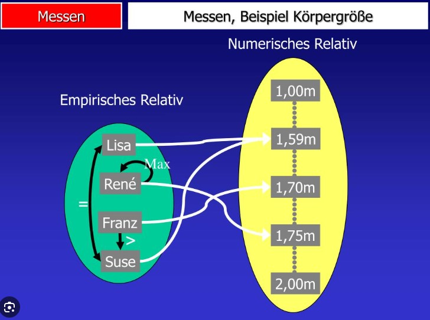

```{r setup, include=FALSE}
options(htmltools.dir.version = FALSE)

library(tidyverse)
library(kableExtra)
library(ggplot2)
library(plotly)
library(htmlwidgets)
library(MASS)
library(ggpubr)
library(xaringanthemer)
library(xaringanExtra)

style_duo_accent(
  primary_color = "#621C37",
    link_color = "#7da5f5",
  secondary_color = "#EE0071",
  background_image = "blank.png"
)

xaringanExtra::use_xaringan_extra(c("tile_view"))

use_scribble(
  pen_color = "#EE0071",
  pen_size = 4
  )

knitr::opts_chunk$set(
  fig.retina = TRUE,
  warning = FALSE,
  message = FALSE
)

```

name: Title slide
class: middle, left, hide_logo
<br><br><br><br><br><br><br>
# Einführung in die Forschungsmethoden der Psychologie und Psychotherapie

### Einheit 9: Freie Spitze und Fragen
##### 03.02.2026 | Prof. Dr. Caroline Zygar-Hoffmann

---
class: top, left, hide_logo
name: content

```{r xaringan-logo, echo=FALSE}
xaringanExtra::use_logo(
image_url = "bilder/referenz.png",
exclude_class = c("title-slide", "hide_logo"),
height = "80px",
position = xaringanExtra::css_position(top = "5em", right = "1em"))
```

### Heutige Themen

#### [Lehrevaluation](#eval)

#### [Hinweise zur Prüfung](#exam)

#### [Zusammenfassung: Forschungsstrategien](#forschungsstrategien)

#### [Zusammenfassung zu jeder Einheit](#summary)

#### [Weitere Fragen](#fragen)

---
class: top, left, hide_logo
name: eval

### Lehrevaluation

**Bitte nehmen Sie an der Lehrevaluation teil: https://hsf.click/Eval-CFH**

.center[

```{r eval = TRUE, echo = F, out.width="80%"}

```
]


---
class: top, left, hide_logo
name: exam

### Hinweise zur Prüfung

* Meine Aussagen zu Prüfungsfragen gelten für diese Vorlesung -- für die Vorlesung von Patricia Garatva gelten die Sachen, die sie gesagt hat

* Es wird Wissen (z.B. Fachbegriffe) UND Verständnis (z.B. Beschreibung von Konzepten) abgefragt

* Fragen sind auch über Vorlesungseinheiten hinweg möglich

---
class: top, left, hide_logo

### Prüfungsfragen

* **Lückentexte**: "Objektivität kann bei der Verhaltensbeobachtung durch Kennzahlen zur \_\_______________\_\_ erfasst werden."

* **Offene Fragen**: "Nennen Sie die vier Ziele der wissenschaftlichen Psychologie. Nennen Sie dann für eines der vier Ziele eine konkrete psychologische Fragestellung."

* **MC-Fragen**: Frage die den Kontext beschreibt, 3 Aussagen dazu $\rightarrow$ jede Aussage als richtig oder falsch markieren.

"Was trifft auf Gütekriterien zu?"

[] Reliabilität ist ein Nebengütekriterium.

[] Wenn ein Messinstrument reliabel ist, kann man auch davon ausgehen, dass es valide ist.

[] Es gibt konkrete Maßnahmen, um die Güte von Indikatoren in einer Verhaltensbeobachtung zu verbessern.

oder

[] Keine der Antworten ist richtig.


---
class: top, left, hide_logo
name: summary

### Zusammenfassung

.pull-left[
**Themen**

* Einheit 1: Psychologie als Wissenschaft
* Einheit 2: Messen in der Psychologie
* Einheit 3: Verhaltensbeobachtung
* Einheit 4: Befragungen & Tests
* Einheit 5: Gastvortrag (~ Biopsychologische Methoden)
* Einheit 6: Kausalität, Experiment und Studiendesigns
* Einheit 7: Forschungsethik und Open Science
* Einheit 8: Qualitative Methoden: Verstehen des Einzelfalls (bis Folie 20)
]

.pull-right[
**Vermittelte Inhalte:**

* Herausforderungen und Möglichkeiten der Datenerhebung in der Psychologie, Gütekriterien
* Datenauswertung, Präsentation und Publikation wissenschaftlicher Forschungsergebnisse 
* Besonderheiten der Forschung im klinisch-psychologischen Kontext
*	Gute wissenschaftliche Praxis, ethische Prinzipien
]

---
class: top, left, hide_logo
name: forschungsstrategien

### Zusammenfassung: Forschungsstrategien

#### Grundlegende Entscheidungen

* Längsschnittlicher vs. Querschnittlicher Ansatz

* Qualitative vs. quantitative Herangehensweise

* Experimenteller vs. Quasi-experimenteller Ansatz vs. Assoziativer/korrelativer Ansatz

---
class: top, left, hide_logo
### Zusammenfassung: Forschungsstrategien

#### Längsschnittlicher vs. querschnittlicher Ansatz

.pull-left[
**Längsschnittstudien**

* aka longitudinal; Messwiederholung

* Personen werden **mehrfach/zu unterschiedlichen Zeitpunkten** gemessen
* Empfehlenswert bei Variablen mit Schwankungen (z.B. Stimmung), da **Veränderungen** abgebildet werden können

* **"Pre-Post" Vergleich** nach Intervention (z.B. Therapie) / Ereignis (z.B. Pandemie) möglich 

* Bei Leistungstests: Vorsicht **Trainingseffekte!**

* Häufiges Problem: **Dropout** (d.h. systematischer Wegfall von Versuchspersonen über die Zeit hinweg)
]


.pull-right[
**Querschnittstudien:**

* aka cross-sectional

* Personen werden einmalig **zum gleichen Zeitpunkt** untersucht

* Oft geringere **interne Validität** (z.B. Kohorteneffekte konfundieren u.U. Alterseffekte)

* gut um große Stichproben zu realisieren (z.B. Umfragen)
]


---
class: top, left, hide_logo
### Zusammenfassung: Forschungsstrategien

#### Qualitative vs. quantitative Herangehensweise

.pull-left[
**Quantitativ:**

* **Vorrangiges Ziel:** soziale Phänomene messbar machen und statistisch auswerten
* **Voraussetzungen:** Vorliegen von Hypothesen und Theorien, die statistisch/mathematisch überprüft werden können
* **Methode:** eher standardisiert
* **Typische Fragestellungen: **
  * A mehr als B?
  * Wenn viel X, dann viel/wenig Y?
* **Typische Verfahren der Datenerhebung: **
  * standardisierter Fragebogen 
  * Experiment
]
.pull-right[
**Qualitativ:**

* **Vorrangiges Ziel:**  soziale Phänomene rekonstruieren; Hypothesen und Theorien generieren
* **Voraussetzungen:** offener, explorativer Zugriff auf das soziale Phänomen
* **Methode:** weniger Standardisierung
* **Typische Fragestellungen: **
  * Welche Einstellungen liegen bei ... vor? 
  * Gibt es Gemeinsamkeiten zwischen..  
  * Was heißt es, ... zu sein?
* **Typische Verfahren der Datenerhebung: **
  * Interview
  * Gruppenbefragungen
  * Verhaltensbeobachtung
]

---
class: top, left, hide_logo
### Zusammenfassung: Forschungsstrategien

#### Experimenteller vs. Quasiexperimenteller vs. Assoziativer Ansatz

.pull-left[
**Experimenteller Ansatz:**

* „Königsweg“, um kausale Zusammenhänge zu prüfen

* Vergleich von Bedingungen (z.B. Experimentalgruppe vs. Kontrollgruppe)

* Kontrollierter Aufbau: 

  * Kovariation von AV und UV systematisch herbeiführen

  * Sicherstellung zeitliche Vorgeordnetheit der UV 

* Randomisierung: Störeinflüsse durch zufälliges Zuteilen zu Gruppen ausschließen
]

.pull-right[
**Quasi-Experimenteller Ansatz:** 

* Auch hier Manipulation der UV und Beobachtung der Folgen für AV, aber keine Randomisierung (sondern z.B. Zuteilung per Präferenz, natürliche Gruppen)

* Reduzierte interne Validität (daher besonders wichtig: maximale Erfassung von möglichen Störvariablen und explizites Berücksichtigen von Alternativerklärungen)

**Assoziativer Ansatz**

* Weg zu Prüfung gemeinsamen variierens von Variablen (Korrelationen, Zusammenhänge)

* Möglicher Umgang mit Störvariablen: Matching, statistische Kontrolle bei großen Stichproben


]

---
class: top, left, hide_logo
### Zusammenfassung: Forschungsstrategien

#### Experimenteller vs. Assoziativer Ansatz

Beispiel: Koffein und Intelligenz

.pull-left[
**Experimenteller Ansatz:**

1. Intelligenzmessung (AV = Leistung)

2. Zufällige Gruppenzuweisung

3. Intervention (UV = Gruppe)

  * Experimentalgruppe: Kaffee 
  * Kontrollgruppe: Placebo koffeinfreier Kaffee 

4. Intelligenzmessung

]
.pull-right[
**Assoziativer Ansatz**

* Erfragen des täglichen Koffeeinkonsums (UV)

* Intelligenztest durchführen (AV = Leistung)

* Prüfen gemeinsamen variierens (Korrelation)

* Störeinflüsse: Hoffnung auf Wegmittelung durch Gruppengröße

* Gefahr von Scheinzusammenhängen ("spurious correlations")

]
---
class: top, left

### Zusammenfassung

* Im Folgenden werden Sie pro Einheit ein paar Fragen sehen

* Diese Fragen sollen Ihnen einen zusammenfassenden Überblick geben, zu welchen großen Themen Sie nach dem Lernen dieser Einheit etwas wissen sollten

* **Wenn in den Einheiten Folien sind, die nicht unter diese Fragen passen, heißt das nicht, dass diese Folien nicht prüfungsrelevant sind; die Folien sind trotzdem prüfungsrelevant!**

* Diese Fragen sind zudem auch nicht prototypisch für Prüfungsfragen, weil sie sehr offen und breit gestellt sind; Prüfungsfragen sind i.d.R. konkreter und spezifischer formuliert ("Nennen Sie 3...", "Beschreiben Sie ein Beispiel...", "Erklären Sie warum..." )

* **Idee dieser Zusammenfassung: Sie können anhand dieser Fragen prüfen, ob Sie mit Ihrem Wissensstand die wichtigen Themen abdecken**

* **Außerdem, falls es keine studentische Frage zu der Einheit gab: Kurze(!), nicht vollständige(!), ggf. nicht richtige(!) Antworten von ChatGPT $\rightarrow$ keine Musterlösung oder ähnliches, kein Anspruch darauf, dass wir das im Rahmen der Fragestunde vollständig durchsprechen $\rightarrow$ zum Lernen die tatsächlichen Folien der jeweiligen Einheit nutzen**

---
class: top, left, hide_logo

### Zusammenfassung

#### Einheit 1: Psychologie als Wissenschaft

.pull-left[
$\rightarrow$ Was kennzeichnet Wissenschaft (im Arbeiten, Wissensproduktion, Erkenntnisgewinn, Haltung)?

$\rightarrow$ Was sind wichtige Begriffe einer empirischen Wissenschaft?

$\rightarrow$ Mit welchen Themen und Zielen beschäftigt sich die Psychologie?
]

.pull-right[
```{r eval = TRUE, echo = F, out.width = "90%"}
knitr::include_graphics("bilder/Einheit1.png")
```
]

---
class: top, left
<div class="footer"><span>Zur Prüfungsvorbereitung/zum Lernen bitte die Vorlesungsfolien der Einheiten nutzen! Die Antworten von ChatGPT auf dieser Folie dienen nur zu Übungszwecken im Rahmen der Fragestunde und können ggf. falsch sein.</span></div>

### Zusammenfassung

#### Einheit 1: Psychologie als Wissenschaft

ChatGPT: Kannst du kurze Antworten (1-2 Sätze) auf die Fragen geben?

**Was kennzeichnet Wissenschaft (im Arbeiten, Wissensproduktion, Erkenntnisgewinn, Haltung)?**
Systematisches, methodisches Vorgehen zur Gewinnung überprüfbarer und nachvollziehbarer Erkenntnisse; kritisch-reflektierende, offene Haltung gegenüber Ergebnissen.

**Was sind wichtige Begriffe einer empirischen Wissenschaft?**
Hypothese, Theorie, Operationalisierung, Messung, Experiment, Validität, Reliabilität.

**Mit welchen Themen und Zielen beschäftigt sich die Psychologie?**
Untersuchung, Beschreibung, Erklärung und Vorhersage menschlichen Erlebens und Verhaltens; Anwendung des Wissens zur Förderung von Gesundheit, Wohlbefinden und Leistungsfähigkeit.

$\rightarrow$ **Frage**: Was fehlt/ist ggf. nicht (ganz) richtig? Was haben wir darüber hinaus alles kennengelernt? Was davon haben wir ggf. nicht kennengelernt?


---
class: top, left, hide_logo

### Zusammenfassung

#### Einheit 2: Messen in der Psychologie

.pull-left[
$\rightarrow$ Was sind Qualitätskriterien für psychologische Erhebungsmethoden und wie werden sie gewährleistet/überprüft?

$\rightarrow$ Was sind zentrale Elemente der klassischen Testtheorie?

$\rightarrow$ Was ist Reaktivität (im Rahmen von Forschung) und wie kann man damit umgehen?
]

.pull-right[
```{r eval = TRUE, echo = F, out.width = "90%"}
knitr::include_graphics("bilder/Einheit2.png")
```
]

---
class: top, left

### Zusammenfassung --- Übung

#### Einheit 2: Messen in der Psychologie

studentische Fragen: 

**1) Können wir nochmal Validität wiederholen? 2) Was sind die Validitätsaskpekte Kausale Validität und Inhaltsvalidität und inwiefern unterscheiden sie sich zu Validierungsmethoden?**

--

* Validität: Gibt an, ob ein Messinstrument tatsächlich das misst, was er zu messen vorgibt

* Kausale Validität: Gibt an, ob eine Veränderung des Merkmals zu einer Veränderung der Messwerte führt.

* Inhaltsvalidität: Gibt an, ob die Inhalte eines Messinstruments alle relevanten Aspekte des zu messenden Merkmals abdecken

**Validierungsmethoden**: Indirekte Möglichkeiten auf Validität zu schließen

* Konstruktvalidität: Gibt an, ob sich die Ergebnisse eines Messinstruments in Korrelationen erwartungsgemäß zu den Ergebnissen anderer Messinstrumente verhalten.

* Kriteriumsvalidität: Gibt an, ob die Ergebnisse eines Messinstruments sich erwartungsgemäß zu manifesten Variablen (= externe Kriterien) verhält.

---
class: top, left
<div class="footer"><span>https://dorsch.hogrefe.com/stichwort/skalierung-testtheoretisches-guetekriterium <br> https://www.slideserve.com/karim/programm </div>

### Zusammenfassung --- Übung

#### Einheit 2: Messen in der Psychologie

studentische Frage: **Was bedeuten die Aspekte der Skalierung? Könnten wir nochmal das Thema Skalierung durchgehen?** 

--

.pull-left[
* Skalierung gibt an, ob die aus Verrechnungsvorschriften resultierenden Testwerte (= Zusammenfassung mehrerer Messwerte, z.B. Itemantworten) die empirischen Verhaltensrelationen adäquat abbilden

Das ist der Fall, wenn es

a) ein empirisch nachgewiesenes testtheoretisches Modell gibt, das beschreibt wie der Zusammenhang zwischen einer latenten Variable und Messwerten ist

b) dieses testtheoretische Modell benutzt wird um einen Testwert für eine Person zu berechnen
]

.pull-right[
```{r eval = TRUE, echo = F, out.width = "90%"}

```
]

---
class: top, left

### Zusammenfassung --- Übung

#### Einheit 2: Messen in der Psychologie

studentische Frage: **Wie genau müssen wir Nebengütekriterien wissen?**

--

* 3-4 nennen können: Normierung, Vergleichbarkeit, Ökonomie, Zumutbarkeit, Fairness, Nicht-Verfälschbarkeit, Nutzen

* Jedes erklären / wiedererkennen / zuordnen können, z.B.:

* "Wenn bei einer psychologischen Messung eine Testperson sich nicht absichtlich so verhalten kann, dass er/sie einen ungerechtfertigten Vorteil erlangt, spricht das positiv für das Nebengütekriterium \_\_______________\_\_ "

---
class: top, left, hide_logo

### Zusammenfassung

#### Einheit 3: Verhaltensbeobachtung

.pull-left[
$\rightarrow$ Wie können Beobachtungspläne aussehen und worauf muss man dabei achten?

$\rightarrow$ Was sind Beispiele für Beobachtungsfehler und -verzerrungen in einer Verhaltensbeobachtung und was sind Gegenmaßnahmen?
]

.pull-right[
```{r eval = TRUE, echo = F, out.width = "90%"}
knitr::include_graphics("bilder/Einheit4.png")
```
]

---
class: top, left

### Zusammenfassung --- Übung

#### Einheit 3: Verhaltensbeobachtung

studentische Frage: **Könnten wir eventuell nochmal kurz das Thema Indikatoren aufgreifen, also was wir genau dazu wissen müssen, verwirrt mich leider immer wieder?**

--

* Indikatoren = Beobachtungseinheiten der Verhaltensbeobachtung, d.h. was konkret (manifest) beobachtet werden soll, z.B. um einen Rückschluss auf eine latente Variable zu machen

* Abgrenzung von Beobachtungsobjekt, relevanter Variable, Dauer, Anfang/Ende/Inhalt

* Objektivität der Indikatoren kann u.a. durch verhaltensnahe, genaue, von anderen Indikatoren trennbare Beschreibung erreicht werden; für Interpretationsobjektivität braucht es klare Regeln zur Zuordnung zwischen beobachteten Indikatoren und Beurteilung der latenten Variable (z.B. über verhaltensverankerte Ratingskala)

* Validität der Indikatoren kann u.a. durch Anpassung an Situation und Abdeckung aller relevanter Facetten einer Variable erreicht werden

* Reliabilität der Indikatoren kann u.a. durch zuverlässige Identifikationsmöglichkeit (z.B. durch richtige Positionierung der Beobachter/Kamera im Raum) und begrenzte Gesamtmenge erreicht werden 

---
class: top, left, hide_logo

### Zusammenfassung

#### Einheit 4: Befragungen & Tests

.pull-left[
$\rightarrow$ Welche Methoden des Selbstberichts gibt es?

$\rightarrow$ Worauf ist bei der Konstruktion von Befragungen/Fragebögen zu achten?

$\rightarrow$ Was ist ein psychologischer Test und was für psychologische Testverfahren gibt es?
]

.pull-right[
```{r eval = TRUE, echo = F, out.width = "90%"}
knitr::include_graphics("bilder/Einheit5.png")
```
]

---
class: top, left

### Zusammenfassung --- Übung

#### Einheit 4: Befragungen & Tests

studentische Frage: **Ich verstehe leider noch nicht genau, was damit gemeint ist: "Intervallskalenniveau ist nicht genuin aus dem Format der Skala, sondern nur inhaltlich (psychologisch/empirisch) zu begründen" **

--

* Dass Skalenwerte gleich große Abstände haben (Intervallskalenniveau), lässt sich nicht aus dem Zahlenformat oder der Beschriftung ableiten, sondern nur aus der Annahme, dass gleiche Zahlenunterschiede auch gleiche psychologische/empirische Unterschiede repräsentieren

* Ob Abstände tatsächlich äquidistant sind, muss inhaltlich begründet oder empirisch geprüft werden (siehe Beispiele in der Vorlesung zu Abständen zwischen "selten" und "manchmal") -> die Skala „erzwingt“ das Intervallniveau nicht

* Zahlen ≠ Bedeutung: Numerische Operationen (z.B. Mittelwerte, Differenzen) sind nur dann sinnvoll, wenn die Bedeutungsrelationen zwischen den Ausprägungen dies rechtfertigen; das Intervallskalenniveau ist daher eine theoretische Zuschreibung, keine formale Eigenschaft der Skala

---
class: top, left, hide_logo

### Zusammenfassung

#### Einheit 5: Gastvortrag

.pull-left[
$\rightarrow$ Welche Elemente gibt es im Bayes Theorem?

$\rightarrow$ Was ist der Prediction Error beim Predictive Coding mit Bayesianischer Inferenz?

$\rightarrow$ Was sind jeweils Magnetresonanzspektroskopie, Elektroenzephalographie und Positronen-Emissions-Tomographie (wofür werden diese Methoden jeweils verwendet und was sind Vor- und Nachteile)?
]

.pull-right[
```{r eval = TRUE, echo = F, out.width = "90%"}

```
]

---
class: top, left
<div class="footer"><span>Zur Prüfungsvorbereitung/zum Lernen bitte die Vorlesungsfolien der Einheiten nutzen! Die Antworten von ChatGPT auf dieser Folie dienen nur zu Übungszwecken im Rahmen der Fragestunde und können ggf. falsch sein.</span></div>

### Zusammenfassung --- Übung

#### Einheit 5: Gastvortrag

ChatGPT: Kannst du kurze Antworten (1-2 Sätze) auf die Fragen geben?

**Welche Elemente gibt es im Bayes Theorem?**
Prior (Vorwissen), Likelihood (die „eintreffende Information“ aus den Daten) und Posterior (aktualisierte Wahrscheinlichkeit der Hypothese nach den Daten).

**Was ist der Prediction Error beim Predictive Coding mit Bayesianischer Inferenz?**
Der Prediction Error ist die Differenz zwischen der aktuellen Vorhersage (Prior) und der durch neue Daten aktualisierten Schätzung (Posterior); er zeigt also, wie stark sich Erwartungen und Beobachtungen unterscheiden.

**Was sind jeweils Magnetresonanzspektroskopie und Elektroenzephalographie (wofür werden diese Methoden jeweils verwendet und was sind Vor- und Nachteile)?**
MRS misst chemische Zusammensetzung und Stoffwechsel im Gehirn (gut für metabolische Prozesse, aber geringe räumliche und zeitliche Auflösung); EEG misst elektrische Aktivität an der Kopfoberfläche (exzellente zeitliche, aber schlechte räumliche Auflösung, kostengünstig und nicht-invasiv); PET misst Stoffwechsel- oder Neurotransmitterprozesse mittels radioaktiver Tracer und bietet hohe molekulare Spezifität, ist aber teuer, invasiv und mit Strahlenbelastung verbunden.

$\rightarrow$ **Frage**: Was fehlt/ist ggf. nicht (ganz) richtig? Was haben wir darüber hinaus alles kennengelernt? Was davon haben wir ggf. nicht kennengelernt?

---
class: top, left, hide_logo

### Zusammenfassung

#### Einheit 6: Kausalität, Experiment und Studiendesigns

.pull-left[
$\rightarrow$ Was versteht man unter Kausalität und inwiefern unterscheidet sich das von Korrelation/Zusammenhängen?

$\rightarrow$ Was kennzeichnet ein Experiment?

$\rightarrow$ Was sind Störvariablen, was sind Ursachen und Konsequenzen von jeweils systematischen und unsystematischen Störvariablen und welche Möglichkeiten hat man damit umzugehen?

$\rightarrow$ Was für nicht-experimentelle, quasi-experimentelle und experimentelles Versuchspläne haben Sie kennengelernt und wodurch sind sie gekennzeichnet?
]

.pull-right[
```{r eval = TRUE, echo = F, out.width = "90%"}
knitr::include_graphics("bilder/Einheit6.png")
```
]

---
class: top, left
<div class="footer"><span>Zur Prüfungsvorbereitung/zum Lernen bitte die Vorlesungsfolien der Einheiten nutzen! Die Antworten von ChatGPT auf dieser Folie dienen nur zu Übungszwecken im Rahmen der Fragestunde und können ggf. falsch sein.</span></div>

### Zusammenfassung --- Übung

#### Einheit 6: Kausalität, Experiment und Studiendesigns

ChatGPT: Kannst du kurze Antworten (1-2 Sätze) auf die Fragen geben?

**Was versteht man unter Kausalität und inwiefern unterscheidet sich das von Korrelation/Zusammenhängen?** Kausalität bedeutet, dass eine Variable eine andere direkt beeinflusst, während eine Korrelation nur eine statistische Beziehung zwischen zwei Variablen beschreibt, ohne eine Ursache-Wirkungs-Beziehung nachzuweisen.

**Was kennzeichnet ein Experiment?**
Ein Experiment ist eine systematische Untersuchung, bei der unabhängige Variablen gezielt manipuliert und deren Effekte auf abhängige Variablen unter kontrollierten Bedingungen gemessen werden.

**Was sind Störvariablen, was sind Ursachen und Konsequenzen von jeweils systematischen und unsystematischen Störvariablen und welche Möglichkeiten hat man damit umzugehen?**
Störvariablen sind Einflussfaktoren, die das Ergebnis eines Experiments verfälschen können. Systematische Störvariablen beeinflussen gezielt eine Bedingung und gefährden die interne Validität, während
unsystematische Störvariablen zufällig auftreten und die Messgenauigkeit verringern; sie können durch Randomisierung, Kontrollgruppen oder statistische Kontrolle reduziert werden.

---
class: top, left
<div class="footer"><span>Zur Prüfungsvorbereitung/zum Lernen bitte die Vorlesungsfolien der Einheiten nutzen! Die Antworten von ChatGPT auf dieser Folie dienen nur zu Übungszwecken im Rahmen der Fragestunde und können ggf. falsch sein.</span></div>

### Zusammenfassung --- Übung

#### Einheit 6: Kausalität, Experiment und Studiendesigns

ChatGPT: Kannst du kurze Antworten (1-2 Sätze) auf die Fragen geben?

**Was für nicht-experimentelle, quasi-experimentelle und experimentelles Versuchspläne haben Sie kennengelernt und wodurch sind sie gekennzeichnet?**
Nicht-experimentelle Designs (z. B. Korrelationsstudien) messen Zusammenhänge ohne Manipulation, quasiexperimentelle Designs enthalten eine Intervention, aber keine vollständige Kontrolle über Störvariablen, und experimentelle Designs (z. B. Randomisierte Kontrollstudien) manipulieren Variablen unter kontrollierten Bedingungen zur Prüfung von Kausalzusammenhängen.

---
class: top, left, hide_logo

### Zusammenfassung

#### Einheit 7: Forschungsethik und Open Science

.pull-left[
$\rightarrow$ Welche forschungsethischen Prinzipien haben Sie kennengelernt? 

$\rightarrow$ Wodurch zeichnet sich ein informiertes Einverständnis (informed consent) aus?

$\rightarrow$ Zu welchen Themen machen die berufsethischen Richtlinien von BDP und DGPs welche Aussagen?

$\rightarrow$ Welche Ziele und Bereiche von Open Science gibt es?
]

.pull-right[
```{r eval = TRUE, echo = F, out.width = "90%"}

```
]

---
class: top, left

### Zusammenfassung --- Übung

#### Einheit 7: Forschungsethik und Open Science

ChatGPT: Kannst du kurze Antworten (1-2 Sätze) auf alle 4 Fragen geben?

.small[
**Welche forschungsethischen Prinzipien haben Sie kennengelernt?**
Forschungsethische Prinzipien umfassen Integrität, Vertraulichkeit, Fairness und Respekt gegenüber Probanden sowie die Verpflichtung zur Vermeidung von Schaden.

**Wodurch zeichnet sich ein informiertes Einverständnis (informed consent) aus?**
Ein informiertes Einverständnis bedeutet, dass Probanden vor ihrer Teilnahme an einer Studie umfassend über die Ziele, Risiken und Nutzen informiert werden und freiwillig zustimmen, ohne Zwang oder Täuschung.

**Zu welchen Themen machen die berufsethischen Richtlinien von BDP und DGPs welche Aussagen?**
Die berufsethischen Richtlinien von BDP und DGPs behandeln Themen wie Vertraulichkeit, professionelles Verhalten, Supervision und die Beziehung zwischen Psychologen und ihren Klienten.

**Welche Ziele und Bereiche von Open Science gibt es?**
Open Science zielt darauf ab, Forschung transparenter, zugänglicher und kooperativer zu gestalten. Dies umfasst offenen Zugang zu Publikationen und Daten, reproduzierbare Forschung und gemeinsame Zusammenarbeit.
]

$\rightarrow$ **Frage**: Was fehlt/ist ggf. nicht (ganz) richtig? Was haben wir darüber hinaus alles kennengelernt? Was davon haben wir ggf. nicht kennengelernt?

---
class: top, left, hide_logo

### Zusammenfassung

#### Einheit 8: Qualitative Methoden: Verstehen des Einzelfalls

.pull-left[
$\rightarrow$ In welchen Aspekten und Zielen unterscheiden sich qualitative und quantitative Methoden?

$\rightarrow$ Welche qualitativen Datenerhebungsmethoden gibt es und wodurch sind sie charakterisiert?

$\rightarrow$ Worauf ist bei der Konzeption von Interviews und Interviewfragen zu achten?

$\rightarrow$ Wie werden qualitative Daten in etwa ausgewertet?
]

.pull-right[
```{r eval = TRUE, echo = F, out.width = "90%"}

```
]

---
class: top, left
<div class="footer"><span>Zur Prüfungsvorbereitung/zum Lernen bitte die Vorlesungsfolien der Einheiten nutzen! Die Antworten von ChatGPT auf dieser Folie dienen nur zu Übungszwecken im Rahmen der Fragestunde und können ggf. falsch sein.</span></div>

### Zusammenfassung --- Übung

#### Einheit 8: Qualitative Methoden: Verstehen des Einzelfalls

ChatGPT: Kannst du kurze Antworten (1-2 Sätze) auf die Fragen geben?

**In welchen Aspekten und Zielen unterscheiden sich qualitative und quantitative Methoden?**
Qualitative vs. quantitative Methoden unterscheiden sich in ihrem Erkenntnisziel (Verstehen vs. Messen), ihrer Datengrundlage (nicht-standardisierte vs. numerische Daten) und ihrer Auswertung (interpretativ vs. statistisch). Während qualitative Methoden tiefgehende Einblicke ermöglichen, streben quantitative Methoden Objektivität und Generalisierbarkeit an.

**Welche qualitativen Datenerhebungsmethoden gibt es und wodurch sind sie charakterisiert?**
Qualitative Datenerhebungsmethoden sind Interviews (offen, leitfadengestützt), Gruppendiskussionen, teilnehmende Beobachtungen und Dokumentenanalysen. Sie sind meist explorativ, flexibel und kontextbezogen.

$\rightarrow$ **Frage**: Was fehlt/ist ggf. nicht (ganz) richtig? Was haben wir darüber hinaus alles kennengelernt? Was davon haben wir ggf. nicht kennengelernt?

---
class: top, left
<div class="footer"><span>Zur Prüfungsvorbereitung/zum Lernen bitte die Vorlesungsfolien der Einheiten nutzen! Die Antworten von ChatGPT auf dieser Folie dienen nur zu Übungszwecken im Rahmen der Fragestunde und können ggf. falsch sein.</span></div>

### Zusammenfassung --- Übung

#### Einheit 8: Qualitative Methoden: Verstehen des Einzelfalls

ChatGPT: Kannst du kurze Antworten (1-2 Sätze) auf die Fragen geben?

**Worauf ist bei der Konzeption von Interviews und Interviewfragen zu achten?**
Bei der Konzeption von Interviews sollten offene, verständliche und neutrale Fragen formuliert werden. Der Leitfaden sollte flexibel sein, um spontane Vertiefungen zu ermöglichen, und soziale Erwünschtheitseffekte sollten minimiert werden.

**Wie werden qualitative Daten in etwa ausgewertet?**
Qualitative Daten werden durch Verfahren wie die thematische Analyse, Grounded Theory oder qualitative Inhaltsanalyse ausgewertet. Dabei werden Muster, Kategorien und Bedeutungen systematisch aus dem Material herausgearbeitet.


$\rightarrow$ **Frage**: Was fehlt/ist ggf. nicht (ganz) richtig? Was haben wir darüber hinaus alles kennengelernt? Was davon haben wir ggf. nicht kennengelernt?
---
class: top, left
name: fragen

### Weitere Fragen

.center[
```{r eval = TRUE, echo = F, out.width = "550px"}

```
]

<!-- library(renderthis)  -->
<!-- chromote::local_chrome_version(binary = "chrome-headless-shell") -->
<!-- to_pdf("EinfForsch_09_FreieSpitze.Rmd", complex_slides = TRUE) -->


```{r eval=FALSE, include=FALSE}
# https://rviews.rstudio.com/2021/11/18/deploying-xaringan-slides-a-ten-step-github-pages-workflow/
```
