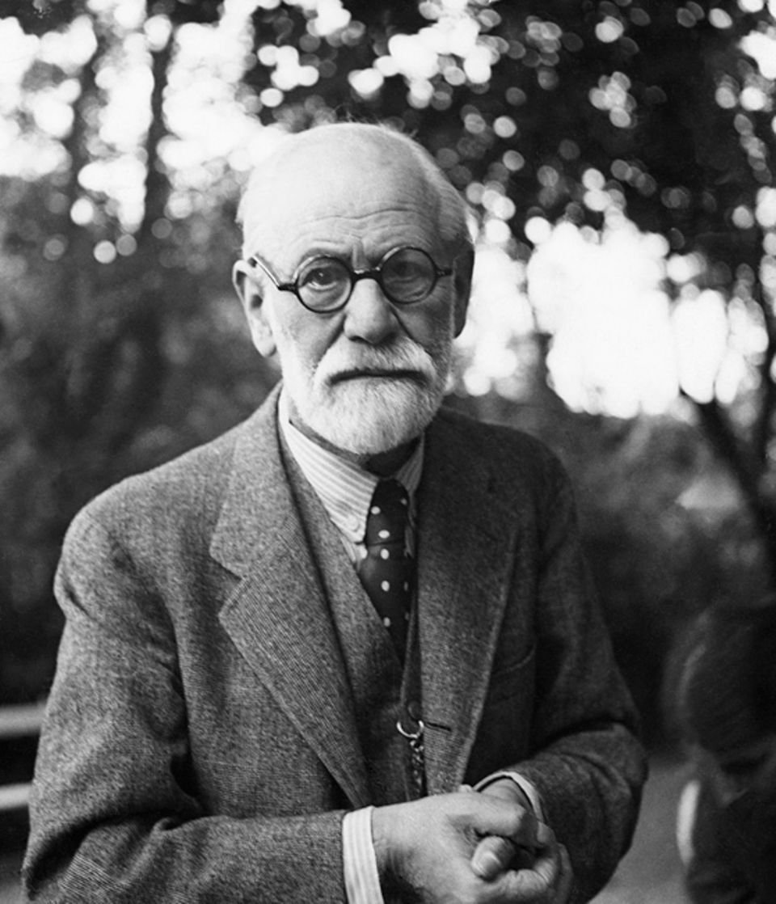
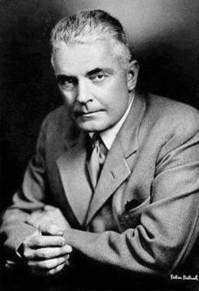
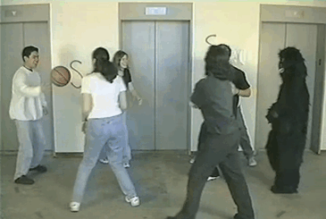

```{r setup, include=FALSE}
options(htmltools.dir.version = FALSE)

library(tidyverse)
library(kableExtra)
library(ggplot2)
library(plotly)
library(htmlwidgets)
library(MASS)
library(ggpubr)
library(xaringanthemer)
library(xaringanExtra)

style_duo_accent(
  primary_color = "#621C37",
  link_color = "#7da5f5",
  secondary_color = "#EE0071",
  background_image = "blank.png"
)

xaringanExtra::use_xaringan_extra(c("tile_view"))

use_scribble(
  pen_color = "#EE0071",
  pen_size = 4
  )

knitr::opts_chunk$set(
  fig.retina = TRUE,
  warning = FALSE,
  message = FALSE
)
```

name: Title slide
class: middle, left
<br><br><br><br><br><br><br>
# Einführung in die Forschungsmethoden der Psychologie und Psychotherapie

### Einheit 10: Psychologische Perspektiven und ihre Forschungsmethoden
##### 11.07.2024 | Dr. Caroline Zygar-Hoffmann

---
class: top, left

### Hiweise

* Aufruf an Lehrevaluation teilzunehmen: [hsf.click/Eval-CFH](https://hsf.click/Eval-CFH)

* Aufruf Fragen zur Vorlesung hier zu sammeln: https://docs.google.com/document/d/1tWKYDSsRBc7MxoYnH4Cm6tyCBMkouVYJc0NMcGWDKFY/edit

* Aufruf zur Teilnahme an Studie von KollegInnen, wenn man in einer Partnerschaft ist (es gibt bis zu 3.5VPS!): https://tellmi.psy.lmu.de/study_EMP/teilnehmen/

---
class: top, left
name: content
### Heutige Themen

#### [Einführung zu Paradigmen und Perspektiven in der Psychologie](#einfuehrung)

#### [Psychodynamische Perspektive](#psychodynamisch)

#### [Behavioristische Perspektive](#behavioristisch)

#### [Humanistische Perspektive](#humanistisch)

#### [Kognitive Perspektive](#kognitiv)

#### [Biologische Perspektive](#biologisch)

#### [Andere Perspektiven](#andere)

#### [Take-Aways](#take-away)


---
class: top, left
name: einführung

### Paradigmen und Perspektiven in der Psychologie

#### Gefahren und Möglichkeiten

* Beispiel Fußballspiel: Fans 2er unterschiedlicher Teams verfolgen dasselbe Spiel, aber haben unterschiedliche Perspektiven darauf

* Perspektive bestimmt über Sichtweise auf ein Problem

* Paradigma bestimmt Auswahl der Forschungsmethoden und Forschungsgegenstände

**VORSICHT:**

* Klar abgegrenzte Ansätze: Gefahr eines "Tunnelblicks"

.center[
*Wer als Werkzeug nur einen Hammer hat, sieht in jedem Problem einen Nagel.*

Mark Twain (Law of the instrument)
]

* Jede Perspektive erweitert holistisches Verständnis menschlicher Erfahrung 

* die meisten Psycholog:innen entlehnen heutzutage Konzepte verschiedener Perspektiven und verschmelzen diese (**integrativer Ansatz**)

---
class: top, left
### Paradigmen und Perspektiven in der Psychologie

#### Aktuelle Perspektiven psychologischer Forschung

1. Psychodynamische Perspektive

2. Behavioristische Perspektive 

3. Humanistische Perspektive

4. Kognitive Perspektive

5. Biologische Perspektive

6. Evolutionäre Perspektive

7. Kulturvergleichende Perspektive

---
class: top, left
name: psychodynamisch
<div class="footer"><span>Bak, P. M. (2019). Triebtheorien der Motivation. In P. M. Bak (Hrsg), Lernen, Motivation und Emotion. Springer.</span></div>

### Psychodynamische Perspektive

#### Haltung und Annahmen

.pull-left[

* Verhalten durch starke innere Kräfte und Reduktion von Spannungen motiviert

* ererbte **Instinkte** + biologische **Triebe** $\rightarrow$ psychische Deprivation, wenn unerfüllt (**Lustprinzip**: Streben nach Befriedigung)

* Ursache für Deprivation: innere Konflikte zwischen gegenläufigen Bedürfnissen oder Konflikte zwischen Bedürfnissen und sozialen Anforderungen

* Deprivation/Konflikte + physiologische Erregung/äußere Reize $\rightarrow$ **Energie für Verhalten** (Dampfkesselmodell)

* Trieb/Bedürfnis befriedigt $\rightarrow$ Ende des Verhaltens
]

.pull-right[
.center[
```{r eval = TRUE, echo = F, fig.cap="Siegmund Freud (1856-1939)", out.width = "100px"}

```
]
]

.pull-right[
.center[
```{r eval = TRUE, echo = F, out.width = "60%", fig.cap="aus Bak (2019)"}
knitr::include_graphics("bilder/dampfkesselmodell.png")
```
]
]

---
class: top, left
### Psychodynamische Perspektive

#### Freud: Eisbergmodell des Bewusstseins

.pull-left[
* Ableitung aus Strukturmodell der Psyche (Ich, Es, Über-Ich)

* Laut Freud 80–90% psychischer Prozesse unbewusst

* Im Unterbewusstsein liegen Ängste, verdrängten Konflikte, traumatischen Erlebnisse, Triebe und Instinkte

* Nur Bewusstes (über der Wasseroberfläche) beobachtbar
]
.pull-right[
.center[
```{r eval = TRUE, echo = F, out.width = "550px"}
knitr::include_graphics("bilder/eisberg.png")
```
]
]

---
class: top, left
### Psychodynamische Perspektive

#### Methoden

Problematik:

* Beobachtungsgegenstand ist **unbewusst** $\rightarrow$ Zugang zum Unbewussten herstellen

* **Herausforderung:** Umgehung der **Zensur** des psychischen Apparats

* **Ziel:** Aufdeckung unbewusst gebliebener / gewordener Prozesse

Beispiele für Methoden der psychodynamischen Perspektive:

* Widerstandsanalyse (schmerzvolle Ideen, Wünsche und Erfahrungen aufdecken und Raum geben)
* Freie Assoziation
* Hypnose
* Traumanalyse

---
class: top, left

### Psychodynamische Perspektive

#### Methoden

**Freie Assoziation** (Methode der freien Einfälle):

* Methode der psychoanalytischen Selbsterfahrung

* Analysand soll Einfällen zu Personen, Ereignissen, Träumen oder Symbolen völlig freien Lauf lassen

* Äußerungen **nicht zensieren**, auch wenn sie unpassend, unangenehm, sittenwidrig, unsinnig oder unwichtig erscheinen

* **Grundregel** der Freud'schen Behandlungstechnik

* Psychoanalytiker begegnet Assoziationen mit **frei schwebender Aufmerksamkeit** und soll Assoziationen zu ihrem Ursprung  zurückzuverfolgen und bedeutsame Muster erkennen

[Beispiel-Video](https://www.youtube.com/watch?v=uTYHuXzkUCE)

---
class: top, left
<div class="footer"><span>Kapitel 5.4.1 in Dörfler, T., Roos, J., & Gerrig, R. J. (2018). Psychologie (21. Auflage). Pearson.</span></div>

### Psychodynamische Perspektive

#### Methoden

**Hypnose:**

* **Ziel:** Erreichen einer hypnotischen **Trance**

* vorübergehend geänderte Aufmerksamkeit und tiefe Entspannung $\rightarrow$ **Reduktion der Zensur**

* Auto- oder Selbsthypnose vs. Fremd- oder Heterohypnose

* während Hypnose erhält Proband:in ggf. verbale Anweisungen (**Suggestionen**), die direkt auf das Unbewusste wirken sollen

* **Posthypnotische Suggestionen**: Suggestionen, die nach Auflösung der Hypnose (Exduktion) noch wirksam sind

* Vermeintlicher neurowiss. Beleg für reduzierte Zensur: bildgebende Verfahren $\rightarrow$ Aktivität bestimmter Gehirnareale selektiv reduziert

[Podcast-Empfehlung](https://www.miriamvanlijnden.de/podcast/folge19) zur Hypnose als Methode in der Therapie (hier: nicht aus psychodynamischen Blickwinkel). Es spricht [Dr. phil. Barbara Schmidt](https://www.uniklinikum-jena.de/mpsy/TWl0YXJiZWl0ZXI%3D.html).


---
class: top, left
### Psychodynamische Perspektive

#### Methoden

**Traumanalyse:**

* Traumgeschehen als wichtige Informationsquelle über unbewusste Erlebensweisen

* Freud: "Die Traumdeutung" - (Via regia lat.: der Königsweg) zur Kenntnis des Unbewussten

* Im Traum: Manifestation verdrängter **aktueller/infantiler Wünsche**

* Wünsche werden durch Trauminhalte in **entstellter Form** als erfüllt dargestellt

* **Entstellung:** direkte Erfüllung wäre für Träumer unangenehm und würde Schlaf stören

* Trauminhalt: **Kompromiss** zwischen den zu erfüllenden Wünschen und der Zensur


---
class: top, left
### Psychodynamische Perspektive

#### Wissenschaftliche Ansätze?

* Forschung im Sinne qualitativer Interviewmethoden und Hermeneutik
  - Theoriebildung durch Vergleich von Einzelfallstudien $\rightarrow$ [Freud Beispiel-Text: Der kleine Hans](https://www.projekt-gutenberg.org/freud/5jaehrig/5jaehrig.html)
  - Sprachliche Metaphorik für unbewusste Phänomene (Nomination von Freud für Literaturnobelpreis)

* Experimenteller Ansatz: z.B. Assoziationsstudien von C. G. Jung (Probanden werden Wörter zugerufen, auf die sie ein eigenes Wort assoziieren sollen - Reaktionszeit als Maß für seelisches Ungleichgewicht zu einem Thema)

* Experimenteller Vergleich von psychoanalytischen Therapievarianten möglich

**Grundproblematik: Viele Konzepte sind nicht falsifizierbar. Theorie macht wenige spezifische Vorhersagen. **

Trotzdem: Psychoanalyse als Grundlage für "analytische Psychotherapie" und "tiefenpsychologisch fundierte Psychotherapie" als Richtlinienverfahren (von der Krankenkasse bezahlt)

---
class: top, left
name: behavioristisch

### Behavioristische Perspektive

#### Haltung und Annahmen

.pull-left[

* Verhalten ohne Introspektion oder Einfühlung untersuchen

* Gegner der psychoanalytischen Richtung (v.a. USA)

* "objektive Methode": alles Verhalten in **Reiz $\rightarrow$ Reaktion** zerlegen $\rightarrow$  Verhalten entsteht durch Erlernen von Reiz-Reaktions-Mustern

* **Gehirn = Black Box** (antwortet auf Reiz automatisch mit Reaktion)

* Skinner: Geistige Prozesse auch eine Art von Verhalten, welche aber nicht so wichtig für das Verständnis von beobachtbarem Verhalten sind

[Link zum Erklärungsvideo](https://www.youtube.com/watch?v=V09FuazW8bc)

]
.pull-right[
.pull-left[
```{r eval = TRUE, echo = F, out.width = "160px", fig.cap="John Watson (1878-1958)"}

```
]
.pull-right[
```{r eval = TRUE, echo = F, out.width = "200px", fig.cap="B. F. Skinner (1904-1990)"}

```

]

<br>
.center[
Behaviorismus als Grundlage für "Verhaltenstherapie" als Richtlinienverfahren
]
]

---
class: top, left
### Behavioristische Perspektive

#### Methoden

**Experimentelle Verhaltensanalyse**

.pull-left[
* Untersuchung funktionaler Zusammenhänge zwischen dem Verhalten und der Umwelt (**Reiz-Reaktions-Muster**)

* **Ziel:** **Verhalten** zu beschreiben, zu erklären, vorherzusagen und zu kontrollieren/beeinflussen

* Streng wissenschaftliche **Laborexperimente**

* Ursprüngliche behavioristische Experiemente hauptsächlich an Tieren

* Selbstbeobachtung wird **abgelehnt**

* Datenbasierter **induktiver Ansatz**
]

.pull-right[
.center[
"*Eine natürliche Größe in der Verhaltenswissenschaft ist die Wahrscheinlichkeit, dass ein bestimmter Teil des Verhaltens zu einem bestimmten Zeitpunkt auftritt. Eine experimentelle Analyse versteht diese Wahrscheinlichkeit als Frequenz des Verhaltens oder als Verhaltenshäufigkeit. (...) Die Aufgabe der experimentellen Analyse besteht in der Entdeckung all jener Variablen, die auf die Wahrscheinlichkeit einer Reaktion einwirken (Skinner, 1966, S. 213–214)*"
]

* **Topografie** des Verhaltens = Reine Beschreibung des von außen beobachtbaren Verhaltens

* **Funktion** des Verhaltens = Zusammenhang zwischen Verhalten und Umweltereignis
]
---
class: top, left

### Behavioristische Perspektive

#### Methoden

**Experimentelle Verhaltensanalyse**

Funktionsanalyse (**ABC-Modell**): Modell zur Beschreibung von operanten Abläufen

* **A (antecedent): ** vorausgehende (antezedente) Funktionen des Verhaltens

* **B (behavior):  ** das Verhalten (behavior) und damit alles was ein Organismus tut (latent und manifest)

* **C (consequence):  ** alle (verstärkenden oder bestrafenden) Konsequenzen des Verhaltens

**Wichtig:** Kontrolle äußerer Störeinflüsse auf den ABC-Mechanismus

$\rightarrow$ Grundlage für SORK-Modell in der Verhaltenstherapie (https://www.youtube.com/watch?v=K5srxozSbic)

---
class: top, left
### Behavioristische Perspektive

#### Methoden

.pull-left[
Beispiel: **Skinner-Box**

* reizarmer Käfig für ein Testtier zum Erlernen neuartigen Verhaltens

* standardisiert und weitgehend automatisiert

* keine unnatürliche Einschränkung, keine Versuchsleitereffekte

* Interventionsmöglichkeiten: Belohnung und Bestrafung
]

.pull-right[
.center[
```{r eval = TRUE, echo = F, out.width = "400px"}

```
]
]

---
class: top, left
name: humanistisch

<div class="footer"><span> https://www.springermedizin.de/emedpedia/psychiatrie-psychosomatik-psychotherapie/humanistische-psychotherapieverfahren?epediaDoi=10.1007%2F978-3-642-45028-0_48 </span></div>

### Humanistische Perspektive

#### Haltung und Annahmen

.pull-left[

* "Den Anstoß für die humanistische Bewegung machten eine Reihe namhafter, zum großen Teil in der Zeit des Nationalsozialismus aus Deutschland emigrierter Psychologen (Charlotte Bühler, Bugental, Köstler, Goldstein, Maslow, Rogers), die 1962 die 'Gesellschaft für Humanistische Psychologie' gründeten."

* Haltung: Menschen werden nicht durch starke, instinktive Kräfte getrieben (psychodynamische Perspektive), noch durch die Umgebung "manipuliert" (behavioristische Tradition)
  * aktive Geschöpfe
  * von Grund auf gut
  * verfügen über Freiheit der Wahl
]

.pull-right[
.pull-left[
```{r eval = TRUE, echo = F, out.width = "200px", fig.cap = "Carl Rogers (1902-1987)"}

```
]
.pull-right[
```{r eval = TRUE, echo = F, out.width = "150px", fig.cap = "Abraham Maslow (1908-1970)"}
knitr::include_graphics("bilder/maslow.jpg")
```
]

Humanismus als Grundlage für "personenzentrierte Therapie" bzw. "Gesprächspsychotherapie", "Gestalttherapie", "existenzielle Psychotherapie", "Psychodrama", "Transaktionsanalyse" und körperorientierte Therapieansätze

]


---
class: top, left
<div class="footer"><span> https://www.springermedizin.de/emedpedia/psychiatrie-psychosomatik-psychotherapie/humanistische-psychotherapieverfahren?epediaDoi=10.1007%2F978-3-642-45028-0_48 </span></div>

### Humanistische Perspektive

#### Haltung und Annahmen

* Mensch als empfindendes soziales Wesen mit subjektiver Sicht auf die Realität und eigenen Wertevorstellungen

* Hauptaufgabe des Menschen: positive Entwicklung, **Self-actualization** (Selbstverwirklichung - Drang das eigene Potential umfassend zu verwirklichen) $\rightarrow$ optimistische, auf Verbesserung und Potenziale ausgerichtete Haltung und "Abwendung von der Defizitorientiertheit"

* Carl Rogers: Für Wachstum sind **eigene Echtheit**, **unbedingte Wertschätzung** und **Empathie** von anderen wichtige Faktoren

* **Ziel** humanistischer Psycholog:innen: 
  - Suche nach Verhaltensmustern in der Lebensgeschichte
  - tiefes **Verstehenwollen** des einzelnen **Individuums**

---
class: top, left

### Humanistische Perspektive

#### Beispiel: Maslow's Bedürfnispyramide

.center[
```{r eval = TRUE, echo = F, out.width = "31%", fig.cap="<small> aus Kapitel 12.1 in Myers, D.G. (2015). Psychologie. Springer. </small>"}
knitr::include_graphics("bilder/maslow-hierarchie.png")
```
]

[Link zum Erklärungsvideo von Maslow's Bedürfnispyramide](https://www.youtube.com/watch?v=O-4ithG_07Q)


---
class: top, left
<div class="footer"><span>Rojas, M., Méndez, A., & Watkins-Fassler, K. (2023). The hierarchy of needs empirical examination of Maslow’s theory and lessons for development. World Development, 165, 106185.</div>

### Humanistische Perspektive

#### Beispiel: Maslow's Bedürfnispyramide

**Kritik**:

* Zu starke Simplifizierung
* Willkürliche Anzahl von Bedürfnissen
* Keine strikte, universelle Rangfolge
* Keine empirische Evidenz


.pull-left[
```{r eval = TRUE, echo = F, out.width = "80%"}
knitr::include_graphics("bilder/rojas2023a.png")
```
]

.pull-right[
```{r eval = TRUE, echo = F}
knitr::include_graphics("bilder/rojas2023b.png")
```
]
---
class: top, left
### Humanistische Perspektive

#### Methoden

* **Holistische** (ganzheitliche) Herangehensweise und Betonung **qualitativer Forschungsmethoden**, insbesondere **hermeneutische Deutung**

* Wissen über Geist, Körper und Verhalten vor dem Hintergrund sozialer und kultureller Faktoren (Literatur, Geschichte, Künste)
  
**Kritik**: Unscharfe Konzepte und Konstrukte, Vernachlässigung von Umwelteinflüssen (nur als Barrieren für Wachstum), keine Universalität

---
class: top, left
name: kognitiv

### Kognitive Perspektive

#### Haltung und Annahmen

.pull-left[

* Entstand aus Limitationen des Behaviorismus und parallel zur Entwicklung des Computers und der damit einhergehenden Informationstheorie (**Kognitive Wende**)

* Fokus: menschliches Denken und wissensbasierte Prozesse
  * Aufmerksamkeit
  * Erinnern
  * Verstehen
  * Spracherwerb...

* Alles Erleben und Verhalten des Menschen basiert auf **Informationsverarbeitung**

]
.pull-right[
.pull-left[
```{r eval = TRUE, echo = F, out.width = "230px", fig.cap = "Albert Bandura    (1925-2021)"}
knitr::include_graphics("bilder/bandura.jpg")
```
]
.pull-right[
```{r eval = TRUE, echo = F, out.width = "200px", fig.cap = "Noam Chomsky (geb.1928)"}
knitr::include_graphics("bilder/chomsky.jpg")
```
]

Grundlage für kognitive (Verhaltens-)Therapie und rational-emotive Therapie (welche auch humanistische Anteile enthält)
]

---
class: top, left

### Kognitive Perspektive

#### Haltung und Annahmen

* Personen reagieren nicht nur auf objektive Realität sondern auch wegen **subjektiver Realität**

* Verhalten/Reaktionen nur zum Teil durch Reize bestimmt, sondern auch durch deren **Verarbeitung** und **Bewertung** $\rightarrow$ Zusammenspiel von Person und Situation!

* Prozess zwischen Wahrnehmen, Denken und Handeln steht im Mittelpunkt

* Wichtige interindividuelle Unterschiede in der Art und Weise, in der Menschen über eine äußere Situation nachdenken und sie  definieren

**Kritik**: Vernachlässigung von Emotionen und unbewussten Prozessen

---
class: top, left

### Kognitive Perspektive

#### Beispiel: Bandura's Modell der Selbstwirksamkeit

```{r eval = TRUE, echo = F, out.width = "50%", fig.cap = "<small> aus Kapitel 12.4. in Döring, N. & Bortz, J. (2016). Forschungsmethoden und Evaluation in den Sozial- und Humanwissenschaften. Pearson. </small>"}
knitr::include_graphics("bilder/Bandura_Selbstwirksamkeit.png")
```

---
class: top, left

### Kognitive Perspektive

#### Beispiel: Bandura's Beobachtungslernen

```{r eval = TRUE, echo = F, out.width = "65%", fig.cap = "<small> aus Kapitel 8.5. in Myers, D.G. (2015). Psychologie. Springer. </small>"}
knitr::include_graphics("bilder/Bandura_Modelllernen.png")
```

$\rightarrow$ Menschen lernen nicht nur anhand von Verhaltenskonsequenzen, sondern auch durch Beobachtung. 

[Link zum Erklärungsvideo]( https://youtu.be/XHIhkM1cAv4?si=bu2lS9WSAPPenbfP)

---
class: top, left

### Kognitive Perspektive

#### Beispiel: Piaget's Entwicklungsstadien

.pull-left[
```{r eval = TRUE, echo = F, fig.cap = "<small> aus Kapitel 9.2.1. in Döring, N. & Bortz, J. (2016). Forschungsmethoden und Evaluation in den Sozial- und Humanwissenschaften. Pearson. </small> "}
knitr::include_graphics("bilder/Piaget_Stadien.png")
```
]


.pull-right[
```{r eval = TRUE, echo = F, out.width = "60%", fig.cap = "<small> aus Kapitel 6.3.1. in Myers, D.G. (2015). Psychologie. Springer. </small> "}
knitr::include_graphics("bilder/Piaget.png")
```
]

---
class: top, left

### Kognitive Perspektive

#### Methoden

.pull-left[
* Versuch der Anwendung möglichst objektiver Experimente und Tests zur Erforschung kognitiver Fähigkeiten

* Labor- und Feldexperimente

z.B. **Gedächtnis**:

.center[
```{r eval = TRUE, echo = F, out.width = "300px"}
knitr::include_graphics("bilder/memory.gif")
```
]

]

.pull-right[
.center[
```{r eval = TRUE, echo = F, out.width = "350px"}
knitr::include_graphics("bilder/moca.jpg")
```
]
]

---
class: top, left

### Kognitive Perspektive

#### Methoden

z.B. **Aufmerksamkeit**:

.center[
```{r eval = TRUE, echo = F, out.width = "600px"}

```
]
---
class: top, left
name: biologisch

### Biologische Perspektive

#### Haltung und Annahmen

.pull-left[

* Menschliches Verhalten resultiert aus **biologischen Prozessen** (Gene, Hormone, Nervensystem, Gehirn)

* Psyche und Körper stehen in **Wechselwirkung**

* Erfahrungen und Verhalten sind Ergebnisse chemischer/elektrischer synaptischer Übertragungen

* **Zergliederung** komplexer Prozesse in kleinere, spezifische Einheiten

* Zentrale Rolle **genetischer** (Einflüsse der Gene selbst) und **epigenetischer** Grundlagen (Einflüsse der Umwelt auf Genexpressionen = Gene werden erst durch Umwelt in Merkmalen des Organismus sichtbar)

]

.pull-right[
.center[
```{r eval = TRUE, echo = F, out.width = "150px"}

```

António R. Damásio (geb. 1944) postuliert die Untrennbarkeit von Körper und Geist (und kritisiert damit den postulierten Dualismus von Descartes)
]
]

---
class: top, left

### Biologische Perspektive

#### Beispiel: Schmerzrückzugsreflex

```{r eval = TRUE, echo = F, out.width = "50%", fig.cap = "<small> aus Kapitel 3.3. in Döring, N. & Bortz, J. (2016). Forschungsmethoden und Evaluation in den Sozial- und Humanwissenschaften. Pearson. </small>"}
knitr::include_graphics("bilder/Schmerzrueckzugsreflex.png")
```

---
class: top, left

### Biologische Perspektive

#### Beispiel: Der Fall von Phineas Gage

.pull-left[
"*Am 13. September des Jahres 1848 erlitt Phineas P. Gage, ein Vorarbeiter beim Bau einer Eisenbahnstrecke, einen Unfall: Eine circa 1,10 Meterlange Eisenstange durchstieß aufgrund einer unerwarteten Explosion seinen Schädel.*

*Gages körperliche Beeinträchtigung war erstaunlich gering: Erbüßte die Sehfähigkeit auf dem linken Auge ein und seine linke  Gesichtshälfte war  teilweise gelähmt, aber Haltung, Bewegung und Sprache waren intakt.* 

***Doch psychisch war er ein anderer Mensch geworden, wie aus dem Bericht seines Arztes hervorging.***" (Döring & Bortz, 2016) 
]

.pull-right[
```{r eval = TRUE, echo = F, out.width = "65%", fig.cap = "<small> aus Kapitel 3.4. in Döring, N. & Bortz, J. (2016). Forschungsmethoden und Evaluation in den Sozial- und Humanwissenschaften. Pearson. </small>"}
knitr::include_graphics("bilder/Gage.png")
```
]

---
class: top, left

### Biologische Perspektive

#### Methoden

Messung biologischer Marker von Verhalten

.pull-left[
**Messungen von Indikatoren außerhalb des ZNS (periphere Messungen)**
  * Elektrodermale Aktivität (EDA) $\rightarrow$ Hautleitfähigkeit
  * Elektromyogramm (EMG) $\rightarrow$ Muskelaktivität
  * Elektrookulogramm und Eyetracker $\rightarrow$ Blickbewegung, Pupillometrie
  * Elektrokardiogramm (EKG) $\rightarrow$ Herzaktivität
  * Hormonspiegel im Blut
  * ...
]
.pull-right[
**Messungen von Indikatoren der Aktivität des ZNS (zentrale Messungen)**
  * Elektroenzephalogramm (EEG) $\rightarrow$ Stärke von Gehirnaktivität
  * Magnetenzephalogramm (MEG) $\rightarrow$ Stärke von Gehirnaktivität (etwas genauer als EEG)
  * Computertomografie (CT) $\rightarrow$ 3D-Modellierung des Gehirns
  * Positronenemissionstomografie (PET) $\rightarrow$ bildgebender Fokus auf Gehirnfunktionen
  * funktionelle Magnetresonanztomografie (fMRT) $\rightarrow$ Struktur und Funktionen des Gehirns
  * ...
]

---
class: top, left

### Biologische Perspektive

#### Methoden

.center[
```{r eval = TRUE, echo = F, out.width = "80%"}
knitr::include_graphics("bilder/biopsy.png")
```
]

---
class: top, left

### Biologische Perspektive

#### Methoden

Beispiel EEG:

* fängt die elektrischen Potenziale von Neuronen auf
* Messung per Elektroden auf der Schädeloberfläche
* Aktivität von Neuronenverbänden kann zeitlich simultan gemessen werden

.pull-left[
.center[
```{r eval = TRUE, echo = F, out.width = "230px"}
knitr::include_graphics("bilder/eeg.jpg")
```
]
]
.pull-right[
.center[
```{r eval = TRUE, echo = F, out.width = "350px"}
knitr::include_graphics("bilder/eeg.gif")
```
]
]


---
class: top, left
name: andere

### Andere Perspektiven

#### Evolutionäre Perspektive

* Basierend auf Darwin's Theorie zur **Evolution durch natürliche Selektion** ("survival of the fittest")

* Bezogen auf die Psychologie: kognitive und körperliche Fähigkeiten entwickelten sich, um **spezifischen Anforderungen** gerecht zu werden

* Konzentration auf zeitlich **extrem lange Prozesse der Evolution**

* Leitfrage: Was war zu Zeiten der Jäger und Sammler **adaptives Verhalten (und Erleben)**? (= Zeitspanne, die 99% der Evolutionsgeschichte des Menschen ausmacht) 

* **keine direkte experimentelle Forschung möglich** (Gang der Evolution kann nicht variiert werden) $\rightarrow$ Quellenarbeit und gründliche Argumentation für bestehende Befunde nötig

---
class: top, left
<div class="footer"><span>Schleifenbaum, L., Driebe, J. C., Gerlach, T. M., Penke, L., & Arslan, R. C. (2021). Women feel more attractive before ovulation: Evidence from a large-scale online diary study. Evolutionary Human Sciences, 3, e47.</div>

### Andere Perspektiven

#### Evolutionäre Perspektive

.center[
```{r eval = TRUE, echo = F, out.width = "40%"}
knitr::include_graphics("bilder/Schleifenbaum2021.png")
```
]

---
class: top, left
<div class="footer"><span>Markus, H. R., & Kitayama, S. (1991). Cultural variation in the self-concept. In The self: Interdisciplinary approaches (pp. 18-48). New York, NY: Springer New York.
Kapitel 3.3. in Döring, N. & Bortz, J. (2016). Forschungsmethoden und Evaluation in den Sozial- und Humanwissenschaften. Pearson.
</div>


### Andere Perspektiven

#### Kulturübergreifende Perspektive

* Interesse an interkulturellen Unterschieden der Ursachen und Konsequenzen von Verhalten

* Untersuchung (und Infragestellen) der Universalität von Theorien

* Beispiele: 
  * Independentes Verständnis des Selbst in individualistischen (größtenteils westlichen) Kulturen, interdependentes Verständnis des Selbst in kollektivistischen Kulturen (Markus & Kitayama, 1991)
  * Emotionaler Ausdruck:

.center[
```{r eval = TRUE, echo = F, out.width = "35%", fig.cap="<small> aus Döring & Bortz (2016)</small>"}
knitr::include_graphics("bilder/Kultur_Emotionen.png")
```
]

---
class: top, left
name: take-away

### Take-Aways

```{r echo = F}
df = data.frame(Perspektive = rep(NA,7),
                Untersuchungsschwerpunkt = rep(NA,7),
                Forschungsthemen = rep(NA,7))
df$Perspektive = c("Psychodynamisch",
                   "Behavioristisch",
                   "Humanistisch",
                   "Kognitiv",
                   "Biologisch",
                   "Evolutionär",
                   "Kulturvergleichend")
df$Untersuchungsschwerpunkt = c("Unbewusste Triebe, Konflikte",
                                "Spezifisch gezeigte (Verhaltens-)reaktionen",
                                "Menschliches Erleben und Potenziale",
                                "Kognitive, mentale Prozesse, Sprache",
                                "Prozesse im Nervensystem, Gehirn",
                                "Evolutionär entstandene psychische Anpassungsvorgänge",
                                "Interkulturelle Muster von Haltungen und Verhalten")
df$Forschungsthemen = c("Verhalten als sichtbarer Ausdruck unbewusster Prozesse",
                                "Verhalten und seine Verursachung durch Reize und Konsequenzen",
                                "Lebensmuster, Werte, Ziele",
                                "Geistige Prozesse durch Verhaltensindikatoren messbar machen",
                                "Biochemische Grundlagen von mentalen Prozessen und Verhalten",
                        "Psychische Mechanismen als evolutionär entstandene adaptive Funktionen",
                        "Universelle und kulturspezifische Aspekte menschlicher Erfahrung")
df %>%
  kbl() %>%
  kable_styling(font_size = 18) %>%
  kable_classic(full_width = T)
```

---
class: top, left
### Take-Aways
.content-box-gray[
* **Paradigma** und dahinterstehendes **Menschenbild** bestimmen Auswahl der Forschungsmethoden

* **Psychodynamische Perspektive** muss Zugang zu unbewussten Inhalten und Prozessen herstellen

* **Behaviorismus** untersucht Reinz-Reaktionsketten in streng kontrollierten Verhaltensbeobachtungen

* **Humanistische Psychologie** versucht mittels qualitativen Methoden und hermeneutischem Schließen den Mensch als "Ganzes" zu verstehen

* **Kognitionspsychologie** untersucht kognitive Prozesse in objektiven Tests im Labor oder Feld

* **Biologische Psychologie** nutzt Messverfahren zum Verständnis biochemischer Prozesse im Organismus, die mit Verhalten einhergehen 

* Psychologen **integrieren** heutzutage Konzepte (& Methoden) verschiedener Perspektiven in ihrer Forschung
]

---
class: top, left
name: words

### Schlüssel-/Fachbegriffe der heutigen Vorlesung
.content-box-gray[

.small[
.pull-left[
.pull-left[

**Zensur**

**Freie Assoziation / Methode der freien Einfälle**

**Hypnose**

**Traumanalyse**

**Widerstandsanalyse**

**analytische Psychotherapie**

**tiefenpsychologisch fundierte Psychotherapie**

]

.pull-right[
**Experimentelle Verhaltensanalyse**

**Topografie des Verhaltens**

**ABC-Modell**

**Self-actualization / Selbstverwirklichung**

**personenzentrierte Therapie / Gesprächspsychotherapie**

**Gestalttherapie**

**existenzielle Psychotherapie**
]
]

.pull-right[
.pull-left[
**Psychodrama** 

**Transaktionsanalyse**

**Kognitive (Verhaltens-)Therapie**

**Rational-emotive Therapie**

**Epigenetik**

**Elektrodermale Aktivität**

**Elektromyogramm (EMG)**

**Elektrookulogramm (EOG)**
]

.pull-right[
**Eyetracker**

**Elektrokardiogramm (EKG)**

**Elektroenzephalogramm (EEG)**

**Magnetenzephalogramm (MEG)**

**Computertomografie (CT)**

**PET**

**funktionelle Magnetresonanztomografie (fMRT)**
]
]
]
]

**[zurück zur heutigen Übersicht der Vorlesung $\rightarrow$](#content)** 
<br>
**[zum Quiz zur Wissensprüfung $\rightarrow$](https://forms.gle/9PUxhERUoQQui4uZ8)**

---
class: top, left
### Literatur für die heutige Sitzung

```{r, echo=FALSE,out.width="25%",fig.cap="Kapitel 1.2.3, 3.4.1, 6.1.2, 6.2-6.3, 12.2-12.3 und 14.2-14.5 in Dörfler, T., Roos, J., & Gerrig, R. J. (2018). Psychologie (21. Auflage). Pearson.",fig.show='hold',fig.align='center'}
knitr::include_graphics("bilder/gerrig.jpg")
``` 

**Materialien:** Vielen Dank an Prof. Dr. Stephan Goerigk für Bereitstellung der Grundlage für die Materialien

---
class: top, left

### Studierende als Testleitungen für die PISA-Studie und andere Erhebungen gesucht

Für den Herbst/Winter 2024 und darüber hinaus suchen wir wieder zuverlässige Studierende, die als Testleitung (m/w/d) in Schulen für uns Erhebungen durchführen. Konkret geht es zunächst um die Studie NEPS (Nationales Bildungspanel), einen groß angelegten Längsschnitt des Leibniz-Instituts für Bildungsverläufe (LifBi), sowie im kommenden Frühjahr um die PISA-Haupterhebung 2025. 

Wir möchten Sie sehr herzlich bitten, vor Beginn der vorlesungsfreien Zeit in Ihren Lehrveranstaltungen und/oder in Ihrem Fachbereich auf die Möglichkeit zur aktiven Teilnahme an der Durchführung unserer Studien aufmerksam zu machen. Auch wenn die ersten Testsitzungen erst im Oktober starten, wählen wir über den Sommer die Bewerberinnen und Bewerber aus, bieten erste Informationsveranstaltungen und Schulungen an und beginnen mit der Einsatzplanung und Terminvergabe. Daher sollten sich Interessierte schnellstmöglich, spätestens jedoch bis Ende Juli 2024 mit einer Kurzbewerbung bei uns melden.

Aufgrund der flexiblen Einsatztage ist die Tätigkeit für Studierende besonders gut geeignet. Die Materialien für die Einsätze erhalten die Testleitungen nach Hause und reisen von dort zu den Testsitzungen, die wir nach Möglichkeit wohnortnah vergeben. Weitere Informationen enthält die Stellenausschreibung: https://www.iea.nl/Testleiter_24

<!-- library(renderthis)  -->
<!-- to_pdf("EinfForsch_10_Perspektiven_Methoden.Rmd", complex_slides = TRUE) -->