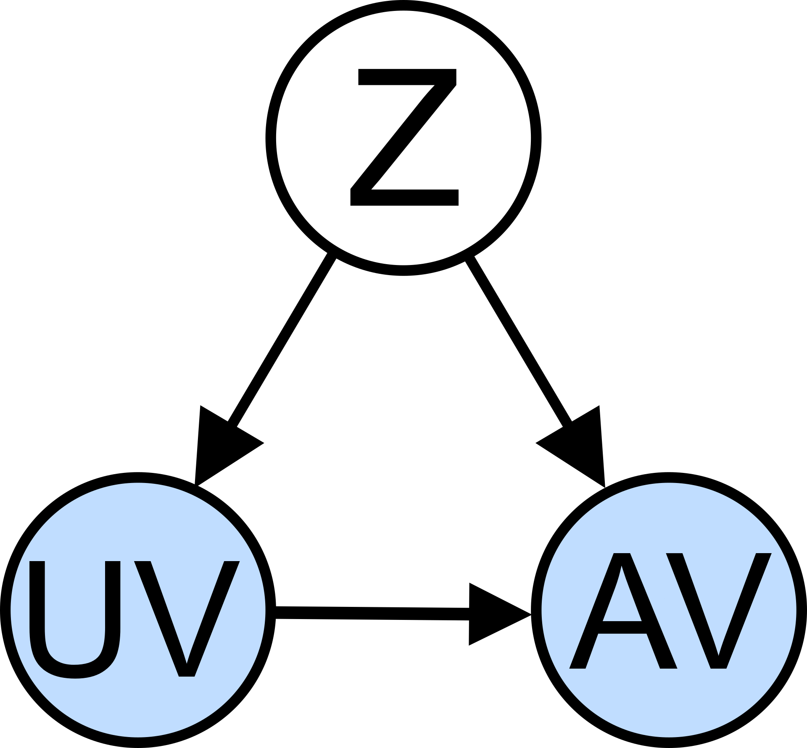
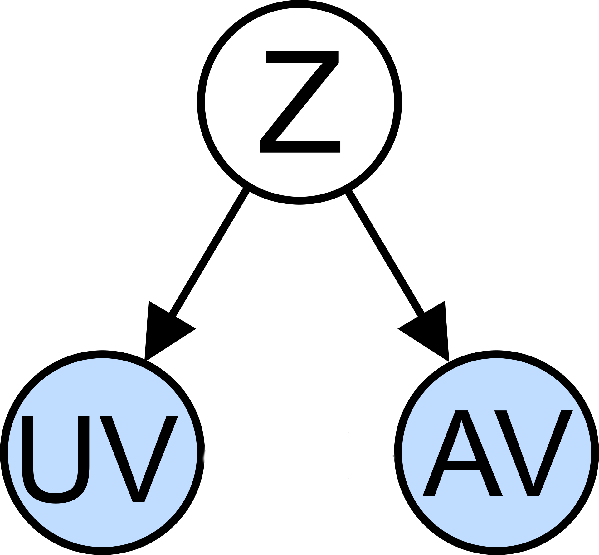
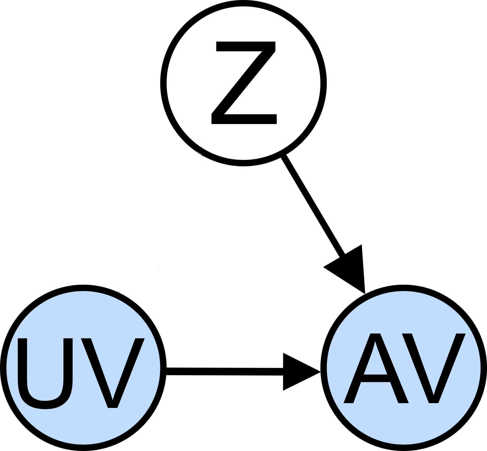
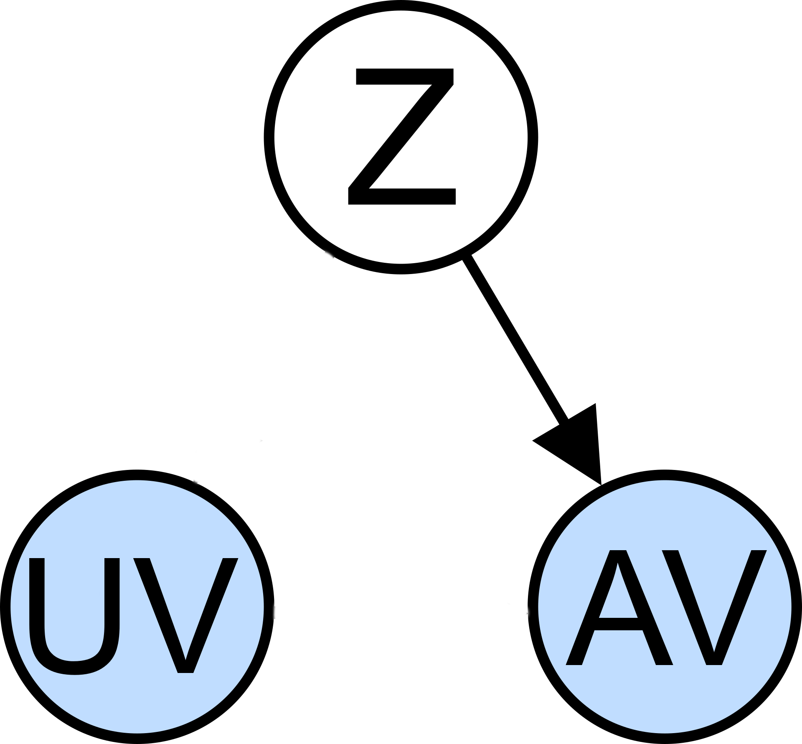
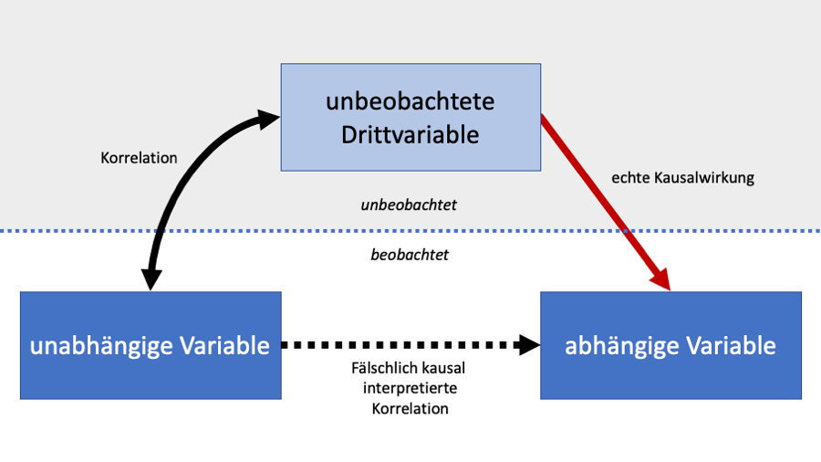
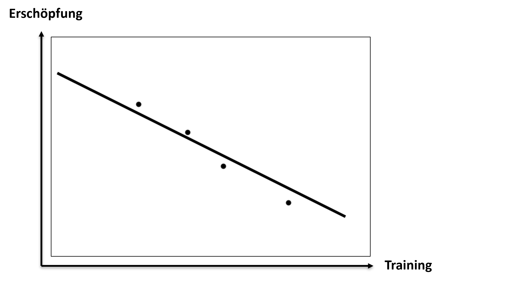
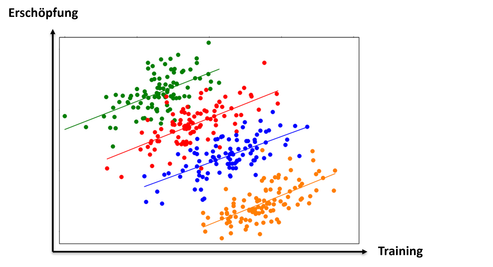
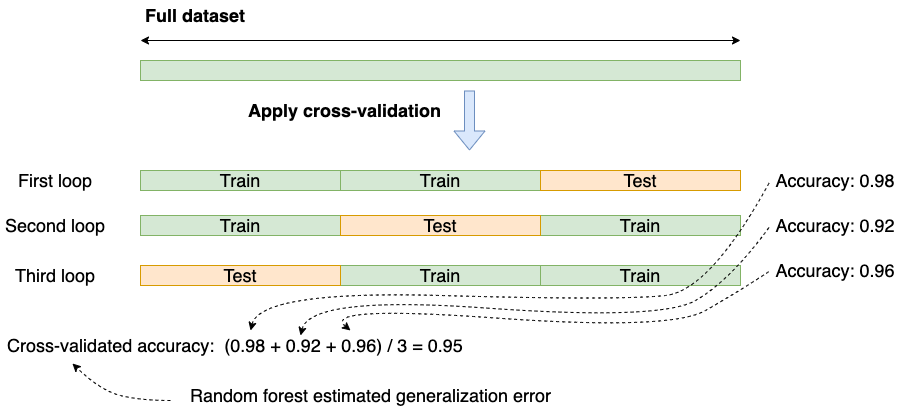

```{r setup, include=FALSE}
options(htmltools.dir.version = FALSE)

library(tidyverse)
library(kableExtra)
library(ggplot2)
library(plotly)
library(htmlwidgets)
library(MASS)
library(ggpubr)
library(xaringanthemer)
library(xaringanExtra)

style_duo_accent(
  primary_color = "#621C37",
  secondary_color = "#EE0071",
  background_image = "blank.png"
)

xaringanExtra::use_xaringan_extra(c("tile_view"))

use_scribble(
  pen_color = "#EE0071",
  pen_size = 4
  )

knitr::opts_chunk$set(
  fig.retina = TRUE,
  warning = FALSE,
  message = FALSE
)

# library(RefManageR)
# BibOptions(
# check.entries = FALSE, 
# bib.style = "authoryear", 
# cite.style = "authoryear", 
# style = "markdown",
# hyperlink = FALSE, 
# dashed = FALSE)
# myBib = ReadBib("/Users/stephangoerigk/Desktop/Universität/CFH/Lehre/Bachelor/Einführung in die Forschungsmethoden der Psychologie und Psychotherapie/EFPP_Folien/myBib.bib")
```

name: Title slide
class: middle, left
<br><br><br><br><br><br><br>
# Einführung in die Forschungsmethoden der Psychologie und Psychotherapie

### Einheit 11: Freie Spitze und Fragen
##### 02.02.2024 | Dr. Caroline Zygar-Hoffmann

---
class: top, left
name: content
### Heutige Themen

#### [Lehrevaluation](#eval)

#### [Prüfung](#exam)

#### [Zusammenfassung](#summary)

#### [Fragen](#fragen)

---
class: top, left
name: eval

### Lehrevaluation

.center[
**"Die Studierenden finden die jeweils individuell freigeschalteten Evaluationen im studynet"**

```{r eval = TRUE, echo = F, out.width="80%"}
knitr::include_graphics("bilder/eval.png")
```
]

---
class: top, left
name: exam

### Prüfung

* Meine Aussagen zu Prüfungsfragen gelten für diese Vorlesung -- für die Vorlesung von Prof. Sarubin gelten die Sachen, die sie gesagt hat

* Es wird Wissen (z.B. Fachbegriffe) UND Verständnis (z.B. Beschreibung von Konzepten) abgefragt

* Fragen sind auch über Vorlesungseinheiten hinweg möglich

---
class: top, left

### Prüfung

* **Lückentexte**: "Dem Prinzip des kritischen Rationalismus folgendend ist der Versuch eine Theorie zu \_\________________\_ wichtig für den Erkenntnisgewinn."

* **Offene Fragen**: "Nennen Sie die vier Ziele der wissenschaftlichen Psychologie."

* **MC-Fragen**: Frage die den Kontext beschreibt, 3 Aussagen dazu, 5 Antwortmöglichkeiten, 1 Antwortmöglichkeit ist auszuwählen

"Was trifft auf Perspektiven in der Psychologie zu?"
1. Sie grenzen sich unter anderem dadurch voneinander ab, dass sie den Fokus auf unterschiedliche Forschungsmethoden legen.
2. Die klassische Konditionierung ist ein Beispiel aus der behavioristischen Perspektive.
3. Es gibt nur die psychodynamische, die behavioristische, die humanistische, die kognitive, und die biologische Perspektive.

* a) keine der drei Aussagen ist richtig
* b) nur 1. ist richtig
* c) 1. und 2. sind richtig
* d) 1. und 3. sind richtig
* e) alle drei Aussagen sind richtig

---
class: top, left
name: summary

### Zusammenfassung

.pull-left[
**Themen**

* Einheit 1: Wie ist Psychologie als Wissenschaft möglich?
* Einheit 2: Wissenschafts- und Erkenntnistheorie
* Einheit 3: Paradigmengeschichte - Menschenbild bestimmt Methode
* Einheit 4: Messen in der Psychologie - manifest
* Einheit 5: Messen in der Psychologie - latent 
* Einheit 6: Das Experiment: Alternativerklärungen und Kontrollbedingungen
* Einheit 7: Qualitative Methoden: Verstehen des Einzelfalls
* Einheit 8: Bio-psychologische Methoden
* Einheit 9: Digitale Messmethoden, Big Data und Machine Learning
* Einheit 10: Forschungsethik
]

.pull-right[
**Vermittelte Inhalte:**

* Meilensteine empirisch-wissenschaftlichen Arbeitens
* Herausforderungen und Möglichkeiten der Datenerhebung in der Psychologie, Gütekriterien
* Datenauswertung, Präsentation und Publikation wissenschaftlicher Forschungsergebnisse 
* Besonderheiten der Forschung im klinisch-psychologischen Kontext
*	Gute wissenschaftliche Praxis, ethische Prinzipien
]

---
class: top, left

### Zusammenfassung

* Im Folgenden werden Sie pro Einheit ein paar Fragen sehen

* Diese Fragen sollen Ihnen einen zusammenfassenden Überblick geben, zu welchen großen Themen Sie nach dem Lernen dieser Einheit etwas wissen sollten

* **Wenn in den Einheiten Folien sind, die nicht unter diese Fragen passen, heißt das nicht, dass diese Folien nicht prüfungsrelevant sind; die Folien sind trotzdem prüfungsrelevant!**

* Diese Fragen sind zudem auch nicht prototypisch für Prüfungsfragen, weil sie sehr offen und breit gestellt sind; Prüfungsfragen sind i.d.R. konkreter und spezifischer formuliert ("Nennen Sie 3...", "Beschreiben Sie ein Beispiel...", "Erklären Sie warum..." )

* **Idee dieser Zusammenfassung: Sie können anhand dieser Fragen prüfen, ob Sie mit Ihrem Wissensstand die wichtigen Themen abdecken**

* **Außerdem: Kurze(!), nicht vollständige(!), ggf. nicht richtige(!) Antworten von ChatGPT $\rightarrow$ keine Musterlösung oder ähnliches, kein Anspruch darauf, dass wir das im Rahmen der Fragestunde vollständig durchsprechen $\rightarrow$ zum Lernen die tatsächlichen Folien der jeweiligen Einheit nutzen**

---
class: top, left

### Zusammenfassung

#### Einheit 1: Wie ist Psychologie als Wissenschaft möglich?

.pull-left[
$\rightarrow$ Was kennzeichnet Wissenschaft (im Arbeiten, Wissensproduktion, Erkenntnisgewinn, Haltung)?

$\rightarrow$ Mit welchen Themen und Zielen beschäftigt sich die Psychologie?

$\rightarrow$ Welches Problem begleitet psychologische Forschung häufig?

$\rightarrow$ Wie sehen die verschiedenen Anfänge der psychologischen Forschung aus?
]

.pull-right[
```{r eval = TRUE, echo = F, out.width = "90%"}
knitr::include_graphics("bilder/Einheit1.png")
```
]

---
class: top, left
<div class="footer"><span>Zur Prüfungsvorbereitung/zum Lernen bitte die Vorlesungsfolien der Einheiten nutzen! Die Antworten von ChatGPT auf dieser Folie dienen nur zu Übungszwecken im Rahmen der Fragestunde und können ggf. falsch sein.</span></div>

### Zusammenfassung --- Übung

#### Einheit 1: Wie ist Psychologie als Wissenschaft möglich?

ChatGPT: Kannst du kurze Antworten (1-2 Sätze) auf alle 4 Fragen geben?

.small[
**Was kennzeichnet Wissenschaft?**
Wissenschaft zeichnet sich durch systematisches Arbeiten, objektive Wissensproduktion und den Gewinn neuer Erkenntnisse auf der Grundlage nachprüfbarer Methoden und Theorien aus.

**Mit welchen Themen und Zielen beschäftigt sich die Psychologie?**
Die Psychologie befasst sich mit dem Verständnis und der Erklärung des menschlichen Verhaltens und der mentalen Prozesse, mit Zielen wie der Verbesserung der psychischen Gesundheit, der Förderung des Wohlbefindens und dem Verstehen zwischenmenschlicher Dynamiken.

**Welches Problem begleitet psychologische Forschung häufig?**
Ein häufiges Problem in der psychologischen Forschung ist die Subjektivität und die Herausforderung, mentale Zustände und Prozesse objektiv zu messen, bekannt als das Problem der Introspektion.

**Wie sehen die verschiedenen Anfänge der psychologischen Forschung aus?**
Die Anfänge der psychologischen Forschung sind geprägt durch die Etablierung der Psychologie als eigenständige Wissenschaft im 19. Jahrhundert, mit Pionieren wie Wilhelm Wundt, die experimentelle Methoden zur Erforschung des Bewusstseins einführten.
]

$\rightarrow$ **Frage**: Was fehlt/ist ggf. nicht (ganz) richtig? Was haben wir darüber hinaus alles kennengelernt? Was davon haben wir ggf. nicht kennengelernt?

---
class: top, left

### Zusammenfassung

#### Einheit 2: Wissenschafts- und Erkenntnistheorie

.pull-left[
$\rightarrow$ Welche erkenntnistheoretischen Grundpositionen gibt es und wodurch sind sie charakterisiert?

$\rightarrow$ Welche Schlüsselpersonen prägten auf welche Art die Wege um zu Erkenntnis zu kommen?

$\rightarrow$ Wie funktionieren die logischen Prinzipien der Induktion und Deduktion und welche Probleme haben sie?

$\rightarrow$ Was kennzeichnet den kritischen Rationalismus nach Popper und welche Probleme hat er?

$\rightarrow$ Woran erkennen Sie eine gute Theorie mit hohem Informationsgehalt?

$\rightarrow$ Wie sehen wissenschaftsgeschichtliche Ansätze aus?
]

.pull-right[
```{r eval = TRUE, echo = F, out.width = "90%"}
knitr::include_graphics("bilder/Einheit2.png")
```
]


---
class: top, left
<div class="footer"><span>Zur Prüfungsvorbereitung/zum Lernen bitte die Vorlesungsfolien der Einheiten nutzen! Die Antworten von ChatGPT auf dieser Folie dienen nur zu Übungszwecken im Rahmen der Fragestunde und können ggf. falsch sein.</span></div>

### Zusammenfassung --- Übung

#### Einheit 2: Wissenschafts- und Erkenntnistheorie

ChatGPT: Kannst du kurze Antworten (1-2 Sätze) auf alle 6 Fragen geben?

**Welche erkenntnistheoretischen Grundpositionen gibt es und wodurch sind sie charakterisiert?**
Zu den Hauptströmungen der Erkenntnistheorie gehören Empirismus (Wissen durch Erfahrung), Rationalismus (Wissen durch Vernunft) und Konstruktivismus (Wissen als Konstruktion der Wirklichkeit).

**Welche Schlüsselpersonen prägten auf welche Art die Wege um zu Erkenntnis zu kommen?**
Plato und Aristoteles prägten den frühen Rationalismus und Empirismus; Immanuel Kant entwickelte den transzendentalen Idealismus; und Karl Popper förderte den kritischen Rationalismus.

**Wie funktionieren die logischen Prinzipien der Induktion und Deduktion und welche Probleme haben sie?**
Induktion schließt von spezifischen Beobachtungen auf allgemeine Gesetze (Problem der Verallgemeinerung), während Deduktion von allgemeinen Prämissen auf spezifische Schlüsse führt (kann zu irrtümlichen Schlussfolgerungen führen, wenn die Prämissen falsch sind).

$\rightarrow$ **Frage**: Was fehlt/ist ggf. nicht (ganz) richtig? Was haben wir darüber hinaus alles kennengelernt? Was davon haben wir ggf. nicht kennengelernt?

---
class: top, left
<div class="footer"><span>Zur Prüfungsvorbereitung/zum Lernen bitte die Vorlesungsfolien der Einheiten nutzen! Die Antworten von ChatGPT auf dieser Folie dienen nur zu Übungszwecken im Rahmen der Fragestunde und können ggf. falsch sein.</span></div>

### Zusammenfassung --- Übung

#### Einheit 2: Wissenschafts- und Erkenntnistheorie

ChatGPT: Kannst du kurze Antworten (1-2 Sätze) auf alle 6 Fragen geben?

**Was kennzeichnet den kritischen Rationalismus nach Popper und welche Probleme hat er?**
Der kritische Rationalismus nach Popper betont die Falsifizierbarkeit von Theorien statt deren Verifizierung; ein Problem dabei ist, dass nicht alle wissenschaftlichen Theorien klar falsifizierbar sind.

**Woran erkennen Sie eine gute Theorie mit hohem Informationsgehalt?**
Eine gute Theorie mit hohem Informationsgehalt ist präzise, weitreichend, tiefgehend, widerspruchsfrei und in der Lage, neue Forschungsrichtungen zu inspirieren.

**Wie sehen wissenschaftsgeschichtliche Ansätze aus?**
Wissenschaftsgeschichtliche Ansätze beinhalten die Entwicklung von wissenschaftlichen Ideen und Methoden im historischen Kontext, oft geprägt durch Paradigmenwechsel und die Arbeit einflussreicher Wissenschaftler.

$\rightarrow$ **Frage**: Was fehlt/ist ggf. nicht (ganz) richtig? Was haben wir darüber hinaus alles kennengelernt? Was davon haben wir ggf. nicht kennengelernt?

---
class: top, left

### Zusammenfassung

#### Einheit 3: Paradigmengeschichte - Menschenbild bestimmt Methode

.pull-left[
$\rightarrow$ Welche Haltung und Annahmen kennzeichnen die verschiedenen Perspektiven auf die Psychologie?

$\rightarrow$ Welche Methoden sind in den verschiedenen Paradigmen vorherrschend?

$\rightarrow$ Was sind Beispiele für Untersuchungsschwerpunkte, Themen und Studien in den verschiedenen Perspektiven?
]

.pull-right[
```{r eval = TRUE, echo = F, out.width = "90%"}
knitr::include_graphics("bilder/Einheit3.png")
```
]

---
class: top, left
<div class="footer"><span>Zur Prüfungsvorbereitung/zum Lernen bitte die Vorlesungsfolien der Einheiten nutzen! Die Antworten von ChatGPT auf dieser Folie dienen nur zu Übungszwecken im Rahmen der Fragestunde und können ggf. falsch sein.</span></div>

### Zusammenfassung --- Übung

#### Einheit 3: Paradigmengeschichte - Menschenbild bestimmt Methode

ChatGPT: Kannst du kurze Antworten (1-2 Sätze) auf alle 3 Fragen geben?

.small[
**Welche Haltung und Annahmen kennzeichnen die verschiedenen Perspektiven auf die Psychologie?**
In der Psychologie variiert die Haltung je nach Perspektive: Behaviorismus fokussiert auf beobachtbares Verhalten und Umwelteinflüsse; Psychoanalyse betont das Unbewusste und frühe Erfahrungen; die kognitive Psychologie untersucht innere mentale Prozesse; und die humanistische Psychologie konzentriert sich auf Selbstverwirklichung und persönliches Wachstum.

**Welche Methoden sind in den verschiedenen Paradigmen vorherrschend?**
Behaviorismus verwendet experimentelle und Beobachtungsmethoden, Psychoanalyse setzt auf introspektive Techniken wie freie Assoziation, kognitive Psychologie nutzt Experimente zur Informationsverarbeitung und Gedächtnisstudien, und humanistische Psychologie bevorzugt qualitative Ansätze wie Interviews und Selbstberichte.

**Was sind Beispiele für Untersuchungsschwerpunkte, Themen und Studien in den verschiedenen Perspektiven?**
Behaviorismus konzentriert sich auf Konditionierung und Lernen; Psychoanalyse erforscht Träume, Kindheitserinnerungen und Verdrängung; kognitive Psychologie untersucht Wahrnehmung, Denken und Problemlösen; humanistische Psychologie beschäftigt sich mit persönlichem Wachstum, Selbstkonzept und Selbstverwirklichung.
]

$\rightarrow$ **Frage**: Was fehlt/ist ggf. nicht (ganz) richtig? Was haben wir darüber hinaus alles kennengelernt? Was davon haben wir ggf. nicht kennengelernt?

---
class: top, left

### Zusammenfassung

#### Einheit 4: Messen in der Psychologie - manifest

.pull-left[
$\rightarrow$ Was sind Qualitätskriterien für psychologische Erhebungsmethoden und wie werden sie gewährleistet/überprüft?

$\rightarrow$ Was ist Reaktivität und wie kann man damit umgehen?

$\rightarrow$ Wie können Beobachtungspläne aussehen und worauf muss man dabei achten?
]

.pull-right[
```{r eval = TRUE, echo = F, out.width = "90%"}
knitr::include_graphics("bilder/Einheit4.png")
```
]

---
class: top, left
<div class="footer"><span>Zur Prüfungsvorbereitung/zum Lernen bitte die Vorlesungsfolien der Einheiten nutzen! Die Antworten von ChatGPT auf dieser Folie dienen nur zu Übungszwecken im Rahmen der Fragestunde und können ggf. falsch sein.</span></div>

### Zusammenfassung --- Übung

#### Einheit 4: Messen in der Psychologie - manifest

ChatGPT: Kannst du kurze Antworten (1-2 Sätze) auf alle 3 Fragen geben?

.small[
**Was sind Qualitätskriterien für psychologische Erhebungsmethoden und wie werden sie gewährleistet/überprüft?**
Zu den Qualitätskriterien gehören Validität (Gültigkeit), Reliabilität (Zuverlässigkeit) und Objektivität. Diese werden durch sorgfältige Testkonstruktion, Standardisierung der Durchführung und statistische Methoden zur Überprüfung der Testgütekriterien gewährleistet.

**Was ist Reaktivität und wie kann man damit umgehen?**
Reaktivität bezeichnet die Veränderung des Verhaltens einer beobachteten Person durch das Bewusstsein, beobachtet zu werden. Um dies zu minimieren, können Forscher Techniken wie verdeckte Beobachtung, Gewöhnung an die Beobachtungssituation oder die Verwendung nicht-reaktiver Messmethoden einsetzen.

**Wie können Beobachtungspläne aussehen und worauf muss man dabei achten?**
Beobachtungspläne können strukturiert (mit festen Kriterien und Skalen) oder unstrukturiert (offene, flexible Beobachtung) sein. Wichtig ist die klare Definition der Beobachtungsziele, die Schulung der Beobachter und die Berücksichtigung von Faktoren wie Beobachterbias und Kontext der Beobachtung.
]

$\rightarrow$ **Frage**: Was fehlt/ist ggf. nicht (ganz) richtig? Was haben wir darüber hinaus alles kennengelernt? Was davon haben wir ggf. nicht kennengelernt?

---
class: top, left

### Zusammenfassung

#### Einheit 5: Messen in der Psychologie - latent

.pull-left[
$\rightarrow$ Welche Methoden des Selbstberichts gibt es?

$\rightarrow$ Worauf ist bei der Konstruktion von Befragungen/Fragebögen zu achten?

$\rightarrow$ Was für psychologische Testverfahren gibt es?

$\rightarrow$ Was charakterisiert die testtheoretischen Ansätze, die Sie kennengelernt haben?
]

.pull-right[
```{r eval = TRUE, echo = F, out.width = "90%"}
knitr::include_graphics("bilder/Einheit5.png")
```
]

---
class: top, left
<div class="footer"><span>Zur Prüfungsvorbereitung/zum Lernen bitte die Vorlesungsfolien der Einheiten nutzen! Die Antworten von ChatGPT auf dieser Folie dienen nur zu Übungszwecken im Rahmen der Fragestunde und können ggf. falsch sein.</span></div>

### Zusammenfassung --- Übung

#### Einheit 5: Messen in der Psychologie - latent

ChatGPT: Kannst du kurze Antworten (1-2 Sätze) auf alle 4 Fragen geben?

.small[
**Welche Methoden des Selbstberichts gibt es?**
Methoden des Selbstberichts umfassen Fragebögen, Tagebücher, Interviews und Online-Umfragen, bei denen die Teilnehmer ihre Gedanken, Gefühle und Verhaltensweisen direkt mitteilen.

**Worauf ist bei der Konstruktion von Befragungen/Fragebögen zu achten?**
Bei der Erstellung von Befragungen und Fragebögen ist auf klare, neutrale Fragestellungen, die Vermeidung von Suggestivfragen, die Relevanz der Fragen für das Untersuchungsziel und die Einfachheit der Sprache zu achten.

**Was für psychologische Testverfahren gibt es?**
Zu den psychologischen Testverfahren gehören standardisierte Tests wie Intelligenztests, Persönlichkeitstests, Leistungstests, neuropsychologische Tests und Verhaltensbeobachtungen.

**Was charakterisiert die testtheoretischen Ansätze, die Sie kennengelernt haben?**
Testtheoretische Ansätze sind durch Konzepte wie Validität (Gültigkeit), Reliabilität (Zuverlässigkeit), Objektivität und Standardisierung charakterisiert, die sicherstellen, dass Tests genaue und konsistente Ergebnisse liefern.
]

$\rightarrow$ **Frage**: Was fehlt/ist ggf. nicht (ganz) richtig? Was haben wir darüber hinaus alles kennengelernt? Was davon haben wir ggf. nicht kennengelernt?

---
class: top, left

### Zusammenfassung

#### Einheit 6: Das Experiment: Alternativerklärungen und Kontrollbedingungen

.pull-left[
$\rightarrow$ Was versteht man unter Kausalität und inwiefern unterscheidet sich das von Korrelation/Zusammenhängen?

$\rightarrow$ Was kennzeichnet ein Experiment?

$\rightarrow$ Was sind (systematische und unsystematische) Störvariablen, was sind Ursachen und Konsequenzen und welche Möglichkeiten hat man damit umzugehen?

$\rightarrow$ Was für nicht-experimentelle, quasi-experimentelle und experimentelles Versuchspläne haben Sie kennengelernt und wodurch sind sie gekennzeichnet?
]

.pull-right[
```{r eval = TRUE, echo = F, out.width = "90%"}
knitr::include_graphics("bilder/Einheit6.png")
```
]

---
class: top, left

### Zusammenfassung

#### Einheit 6: Das Experiment: Alternativerklärungen und Kontrollbedingungen

**Studentische Frage: Was ist der Unterschied zwischen einer unsystemtischen und systematischen Störvariable?**
--

* **Störvariablen generell**: alle Variablen (außer der UVs), die potentiell Einfluss auf das Ergebnis haben können $\rightarrow$ Zusammenhang mit der AV

.pull-left[
* **Systematische Störvariablen**: Zusätzlicher Zusammenhang mit der UV, d.h. führen zu systematischen Unterschieden *zwischen* Bedingungen $\rightarrow$ Wenn nicht kontrolliert/berücksichtigt, dann können sie die eigentliche Ursache dafür sein, dass **ein** Effekt von UV auf AV gefunden wird ( $\rightarrow$ bieten Alternativerklärungen für einen gefundenen Effekt der UV)
]

.pull-right[
```{r eval = TRUE, echo = F, out.width = "50%"}


```
]

In der Literatur wird manchmal nicht zwischen systematischen und unsystematischen Störvariablen unterschieden und dann ist mit "Störvariable" meistens eine systematische Störvariable gemeint.

---
class: top, left

### Zusammenfassung

#### Einheit 6: Das Experiment: Alternativerklärungen und Kontrollbedingungen

**Studentische Frage: Was ist der Unterschied zwischen einer unsystemtischen und systematischen Störvariable?**

* **Störvariablen generell**: alle Variablen (außer der UVs), die potentiell Einfluss auf das Ergebnis haben können $\rightarrow$ Zusammenhang mit der AV

.pull-left[
* **Unsystematische Störvariablen**: Kein Zusammenhang mit der UV, d.h. führen zu *keinen* systematischen Unterschieden *zwischen* Bedingungen, aber erklären generelle Unterschiede auf der AV *innerhalb* von Bedingungen ( $\rightarrow$ erhöhen Varianz in der AV) $\rightarrow$ Wenn nicht kontrolliert/berücksichtigt, können sie die Ursache dafür sein, dass **kein** Effekt von UV auf AV gefunden wird 
]

.pull-right[
```{r eval = TRUE, echo = F, out.width = "50%"}


```
]

In der Literatur wird manchmal nicht zwischen systematischen und unsystematischen Störvariablen unterschieden und dann ist mit "Störvariable" meistens eine systematische Störvariable gemeint.


---
class: top, left

### Zusammenfassung

#### Einheit 6: Das Experiment: Alternativerklärungen und Kontrollbedingungen

**Studentische Frage: Was ist eine konfundierende Variable?**

* Werden systematische Störvariablen nicht kontrolliert spricht man von Konfundierung, die Störvariable ist dann eine konfundierende Variable

* Der Begriff wird eigentlich nur im Kontext von systematischen Störvariablen verwendet (so auch in den Vorlesungsfolien), man könnte ihn theoretisch aber auch auf unsystematische Störvariablen erweitern (ist aber unüblich), denn unsystematische Störvariablen möchte man auch möglichst verringern/kontrollieren

---
class: top, left
<div class="footer"><span>https://ctreffe.github.io/statspace/konfundierung.html</span></div>

### Zusammenfassung

#### Einheit 6: Das Experiment: Alternativerklärungen und Kontrollbedingungen

**Studentische Frage: Was ist eine konfundierende Variable?**

.pull-left[
Beispiel: 
* Untersuchung von Mathenachhilfe oder keine Mathenachhilfe (UV) auf Matheleistung (AV)

* Systematische Störvariable "Interesse an Mathe" einer Person hängt damit zusammen, ob Personen sich für die Nachhilfe anmelden (d.h. in welcher Bedingung sie landen -> Zusammenhang mit UV) als auch welche Leistung sie zeigen (d.h. Zusammenhang mit AV)
]

.pull-right[
```{r eval = TRUE, echo = F}

```
]

* Wenden wir keine Randomisierung an, dann ist "Interesse an Mathe" eine konfundierende Variable
* Wenden wir Randomisierung an, ist die systematische Störvariable kontrolliert und keine konfundierende Variable mehr

---
class: top, left

### Zusammenfassung

#### Einheit 7: Qualitative Methoden: Verstehen des Einzelfalls

.pull-left[
$\rightarrow$ In welchen Aspekten und Zielen unterscheiden sich qualitative und quantitative Methoden?

$\rightarrow$ Welche qualitativen Datenerhebungsmethoden gibt es und wodurch sind sie charakterisiert?

$\rightarrow$ Worauf ist bei der Konzeption von Interviews und Interviewfragen zu achten?

$\rightarrow$ Wie werden qualitative Daten in etwa ausgewertet?
]

.pull-right[
```{r eval = TRUE, echo = F, out.width = "90%"}
knitr::include_graphics("bilder/Einheit7.png")
```
]

---
class: top, left
<div class="footer"><span>Zur Prüfungsvorbereitung/zum Lernen bitte die Vorlesungsfolien der Einheiten nutzen! Die Antworten von ChatGPT auf dieser Folie dienen nur zu Übungszwecken im Rahmen der Fragestunde und können ggf. falsch sein.</span></div>

### Zusammenfassung --- Übung

#### Einheit 7: Qualitative Methoden: Verstehen des Einzelfalls

ChatGPT: Kannst du kurze Antworten (1-2 Sätze) auf alle 4 Fragen geben?

**In welchen Aspekten und Zielen unterscheiden sich qualitative und quantitative Methoden?**
Quantitative Methoden fokussieren auf messbare Daten und statistische Analysen, um Hypothesen zu testen und allgemeine Muster zu finden, während qualitative Methoden auf detaillierte, narrative Daten und die Interpretation von Bedeutungen abzielen, um tiefere Einsichten in individuelle Erfahrungen zu gewinnen.

**Welche qualitativen Datenerhebungsmethoden gibt es und wodurch sind sie charakterisiert?**
Zu den qualitativen Datenerhebungsmethoden gehören Interviews (offen, semi-strukturiert), Fokusgruppen, Beobachtungen und Dokumentenanalysen, die durch ihre Flexibilität, Offenheit und Fokussierung auf subjektive Erfahrungen charakterisiert sind.

$\rightarrow$ **Frage**: Was fehlt/ist ggf. nicht (ganz) richtig? Was haben wir darüber hinaus alles kennengelernt? Was davon haben wir ggf. nicht kennengelernt?

---
class: top, left
<div class="footer"><span>Zur Prüfungsvorbereitung/zum Lernen bitte die Vorlesungsfolien der Einheiten nutzen! Die Antworten von ChatGPT auf dieser Folie dienen nur zu Übungszwecken im Rahmen der Fragestunde und können ggf. falsch sein.</span></div>

### Zusammenfassung --- Übung

#### Einheit 7: Qualitative Methoden: Verstehen des Einzelfalls

ChatGPT: Kannst du kurze Antworten (1-2 Sätze) auf alle 4 Fragen geben?

**Worauf ist bei der Konzeption von Interviews und Interviewfragen zu achten?**
Bei der Konzeption von Interviews und Interviewfragen ist auf Klarheit, Neutralität, Offenheit und Relevanz der Fragen zu achten, um ehrliche, detaillierte und unverzerrte Antworten zu ermöglichen.

**Wie werden qualitative Daten in etwa ausgewertet?**
Die Auswertung qualitativer Daten erfolgt durch Prozesse wie Kodierung, Themensuche und Narrativbildung, um Muster und Bedeutungen in den Daten zu identifizieren und zu interpretieren.

$\rightarrow$ **Frage**: Was fehlt/ist ggf. nicht (ganz) richtig? Was haben wir darüber hinaus alles kennengelernt? Was davon haben wir ggf. nicht kennengelernt?

---
class: top, left

### Zusammenfassung

#### Einheit 7: Qualitative Methoden: Verstehen des Einzelfalls

**Workshop Qualitative Inhaltsanalyse**

Wir möchten wieder herzlich einladen zum Workshop Qualitative Inhaltsanalyse vom 7. Bis 9. Juni 2024 in Velden am Wörthersee; Anmeldungen bitte bis 1.4.24., siehe: https://qualitative-content-analysis.org/de/workshops/velden/

Der Workshop Qualitative Inhaltsanalyse findet jährlich statt und bietet Methodeninteressierten die Gelegenheit, über Qualitative Inhaltsanalyse und verwandte textanalytische Vorgehensweisen zu diskutieren. Sowohl methodisch-technische Aspekte als auch verschiedene Arbeitsfelder Qualitativer Inhaltsanalyse werden diskutiert. Letzteres führt erfahrungsgemäß zu einem spannenden interdisziplinären Austausch. Auch die Kombination qualitativer und quantitativer Analyseschritte in der Qualitativen Inhaltsanalyse wird thematisiert. Methodenberatung durch die Veranstalter*innen findet u.a. in den großzügig anberaumten offenen Runden im Plenum statt. Wie schon in den letzten Jahren gibt es wieder die Möglichkeit, in einer Workshop-Einheit, sowie in einer offenen Schlussrunde allgemeine textanalytische Fragestellungen zu diskutieren.

Die bewährte praktische Arbeit an Material in Kleingruppen wird auch weiterhin angeboten und intensiviert. Diese Workshop-Arbeit ermöglicht die aktive Auseinandersetzung mit qualitativ orientierter Textanalyse. Außerdem gibt es eine Einführung in die speziell für die qualitative Inhaltsanalyse entwickelte Software QCAmap.

---
class: top, left

### Zusammenfassung

#### Einheit 8: Bio-psychologische Methoden

.pull-left[
$\rightarrow$ Wie können biopsychologische Methoden in Forschung und Praxis eingesetzt werden?

$\rightarrow$ Welche Indikatoren außerhalb des ZNS können mit welchen Methoden erhoben werden, und wie funktionieren diese Methoden in etwa?

$\rightarrow$ Welche Indikatoren des ZNS können mit welchen Methoden erhoben werden, und wie funktionieren diese Methoden in etwa?

$\rightarrow$ Welche Artefakte bei biopsychologischen Messungen sind zu beachten und wie kann man damit umgehen?
]

.pull-right[
```{r eval = TRUE, echo = F, out.width = "90%"}

```
]

---
class: top, left
<div class="footer"><span>Zur Prüfungsvorbereitung/zum Lernen bitte die Vorlesungsfolien der Einheiten nutzen! Die Antworten von ChatGPT auf dieser Folie dienen nur zu Übungszwecken im Rahmen der Fragestunde und können ggf. falsch sein.</span></div>

### Zusammenfassung --- Übung

#### Einheit 8: Bio-psychologische Methoden

ChatGPT: Kannst du kurze Antworten (1-2 Sätze) auf alle 4 Fragen geben?

**Wie können biopsychologische Methoden in Forschung und Praxis eingesetzt werden?**
Biopsychologische Methoden werden in Forschung und Praxis eingesetzt, um Gehirnfunktionen und physiologische Prozesse zu untersuchen, beispielsweise durch Gehirnbildgebung und biofeedbackgestützte Therapieansätze zur Behandlung psychologischer und neurologischer Störungen.

**Welche Indikatoren außerhalb des ZNS können mit welchen Methoden erhoben werden, und wie funktionieren diese Methoden in etwa?**
Indikatoren außerhalb des ZNS umfassen Herzfrequenz (erhoben durch Herzfrequenzmesser), Hautleitfähigkeit (Galvanic Skin Response), und Muskelaktivität (Elektromyographie, EMG), die jeweils elektrische Veränderungen auf der Haut oder Muskelaktivität messen.

$\rightarrow$ **Frage**: Was fehlt/ist ggf. nicht (ganz) richtig? Was haben wir darüber hinaus alles kennengelernt? Was davon haben wir ggf. nicht kennengelernt?

---
class: top, left
<div class="footer"><span>Zur Prüfungsvorbereitung/zum Lernen bitte die Vorlesungsfolien der Einheiten nutzen! Die Antworten von ChatGPT auf dieser Folie dienen nur zu Übungszwecken im Rahmen der Fragestunde und können ggf. falsch sein.</span></div>

### Zusammenfassung --- Übung

#### Einheit 8: Bio-psychologische Methoden

ChatGPT: Kannst du kurze Antworten (1-2 Sätze) auf alle 4 Fragen geben?

**Welche Indikatoren des ZNS können mit welchen Methoden erhoben werden, und wie funktionieren diese Methoden in etwa?**
ZNS-Indikatoren wie Gehirnaktivität und -funktion werden mittels Elektroenzephalographie (EEG), die elektrische Aktivität auf der Kopfoberfläche misst, und funktioneller Magnetresonanztomographie (fMRT), die Blutflussänderungen im Gehirn erfasst, gemessen.

**Welche Artefakte bei biopsychologischen Messungen sind zu beachten und wie kann man damit umgehen?**
Artefakte in biopsychologischen Messungen können elektrische Interferenzen, Bewegungsartefakte und physiologische Störungen sein. Sie können durch sorgfältige Versuchsplanung, Einsatz von Artefaktkorrekturmethoden und Standardisierung der Messbedingungen minimiert werden.

$\rightarrow$ **Frage**: Was fehlt/ist ggf. nicht (ganz) richtig? Was haben wir darüber hinaus alles kennengelernt? Was davon haben wir ggf. nicht kennengelernt?

---
class: top, left

### Zusammenfassung

#### Einheit 9: Digitale Messmethoden, Big Data und Machine Learning

.pull-left[
$\rightarrow$ Was sind Vor- und Nachteile digitaler Messmethoden?

$\rightarrow$ Welche Methoden im Kontext von Ambulatory Assessment haben Sie kennengelernt und was charakterisiert sie?

$\rightarrow$ Welche Gründe gibt es für den Einsatz von Ambulatory Asssessment Methoden?

$\rightarrow$ Welche Machine Learning Methoden haben Sie kennengelernt und was für Anwendungszwecke haben sie?

$\rightarrow$ Wie funktioniert prädiktive Modellierung und im Speziellen Kreuzvalidierung?

$\rightarrow$ Wie kann künstliche Intelligenz in klinischen Settings akzeptiert werden?
]

.pull-right[
```{r eval = TRUE, echo = F, out.width = "90%"}
knitr::include_graphics("bilder/Einheit9.png")
```
]

---
class: top, left

### Zusammenfassung

#### Einheit 9: Digitale Messmethoden, Big Data und Machine Learning

**Studentische Frage: Was ist ein Simpson's Paradox?**
--

* Gleichzeitiges Zutreffen folgender Punkte:
1) Beziehung zwischen x und y ist in der Gruppe negativ
  - "in der Gruppe" heißt: Vergleiche zwischen Individuen in der Stichprobe
  - "Interindividueller Zusammenhang"

2) Beziehung zwischen x und y ist positiv für Individuen
  - "für Individuen" heißt: Für verschiedene Zeitpunkte/Momente derselben Person in der Stichprobe
  - "Intraindividueller Zusammenhang"

* "Paradox" weil unterschiedliche Zusammenhangsrichtungen für ähnliche Fragestellung (aber dennoch andere Fragestellung durch andere Messebene, die man betrachtet)

---
class: top, left

### Zusammenfassung

#### Einheit 9: Digitale Messmethoden, Big Data und Machine Learning

**Studentische Frage: Was ist ein Simpson's Paradox?**
  
Beispiel: Beziehung zwischen x und y ist in der Gruppe negativ

.center[
```{r eval = TRUE, echo = F, out.width = "50%"}

```
]

* Je mehr eine Person im Mittel trainiert (im Vergleich zu anderen Personen), desto weniger erschöpft ist sie im Mittel (im Vergleich zu anderen Personen)

---
class: top, left

### Zusammenfassung

#### Einheit 9: Digitale Messmethoden, Big Data und Machine Learning

**Studentische Frage: Was ist ein Simpson's Paradox?**
  
Beispiel: Beziehung zwischen x und y ist positiv für Individuen ( $\rightarrow$ jede Farbe ist eine Person)

.center[
```{r eval = TRUE, echo = F, out.width = "50%"}

```
]

* Je mehr eine Person A trainiert hat, desto erschöpfter ist sie in dem Moment / im nächsten Moment
* Das kann man erst dann zuverlässig erkennen, wenn man dieselben Personen mehrmals befragt!

---
class: top, left
<div class="footer"><span>https://ploomber.io/blog/nested-cv/</span></div>

### Zusammenfassung

#### Einheit 9: Digitale Messmethoden, Big Data und Machine Learning

**Studentische Frage: Was ist Nested-Cross-Validation?**
--
.pull-left[
* Eine Methode im Rahmen der Prädiktiven Modellierung

* **Ziel**: Die Generalisierung des trainierten Modells durch Kreuzvalidierung prüfen (Schritt 3)

* Alternative zum "einfachen" simple split des Datensatz in 50% Trainingsdaten und 50% Testdaten (da die Wahl des "splits" beeinflusst/"gebiased" werden kann)
]

.pull-right[
```{r eval = TRUE, echo = F}

```
]

**Vorgehen**:
* Teilung des **gesamten Datensatzes** in eine bestimmte Anzahl ("folds")
* Jeder Teil des Datensatzes wird einmal zum Testdatensatz (und alle anderen zu Trainingsdatensätzen)
* Mittelung der erreichten Genaugikeit des Modells über alle Testdatensätze

---
class: top, left

### Zusammenfassung

#### Einheit 10: Forschungsethik

.pull-left[
$\rightarrow$ Welche forschungsethischen Prinzipien haben Sie kennengelernt? 

$\rightarrow$ Wodurch zeichnet sich ein informiertes Einverständnis (informed consent) aus?

$\rightarrow$ Zu welchen Themen machen die berufsethischen Richtlinien von BDP und DGPs welche Aussagen?

$\rightarrow$ Welche Ziele und Bereiche von Open Science gibt es?
]

.pull-right[
```{r eval = TRUE, echo = F, out.width = "90%"}
knitr::include_graphics("bilder/Einheit10.png")
```
]

---
class: top, left

### Zusammenfassung --- Übung

#### Einheit 10: Forschungsethik

ChatGPT: Kannst du kurze Antworten (1-2 Sätze) auf alle 4 Fragen geben?

.small[
**Welche forschungsethischen Prinzipien haben Sie kennengelernt?**
Forschungsethische Prinzipien umfassen Integrität, Vertraulichkeit, Fairness und Respekt gegenüber Probanden sowie die Verpflichtung zur Vermeidung von Schaden.

**Wodurch zeichnet sich ein informiertes Einverständnis (informed consent) aus?**
Ein informiertes Einverständnis bedeutet, dass Probanden vor ihrer Teilnahme an einer Studie umfassend über die Ziele, Risiken und Nutzen informiert werden und freiwillig zustimmen, ohne Zwang oder Täuschung.

**Zu welchen Themen machen die berufsethischen Richtlinien von BDP und DGPs welche Aussagen?**
Die berufsethischen Richtlinien von BDP und DGPs behandeln Themen wie Vertraulichkeit, professionelles Verhalten, Supervision und die Beziehung zwischen Psychologen und ihren Klienten.

**Welche Ziele und Bereiche von Open Science gibt es?**
Open Science zielt darauf ab, Forschung transparenter, zugänglicher und kooperativer zu gestalten. Dies umfasst offenen Zugang zu Publikationen und Daten, reproduzierbare Forschung und gemeinsame Zusammenarbeit.
]

$\rightarrow$ **Frage**: Was fehlt/ist ggf. nicht (ganz) richtig? Was haben wir darüber hinaus alles kennengelernt? Was davon haben wir ggf. nicht kennengelernt?

---
class: top, left
name: fragen

### Weitere Fragen

.center[
```{r eval = TRUE, echo = F, out.width = "550px"}
knitr::include_graphics("bilder/qa.png")
```
]

<!-- library(renderthis)  -->
<!-- to_pdf("EinfForsch_11_FreieSpitze.Rmd", complex_slides = TRUE) -->


```{r eval=FALSE, include=FALSE}
# https://rviews.rstudio.com/2021/11/18/deploying-xaringan-slides-a-ten-step-github-pages-workflow/
```
