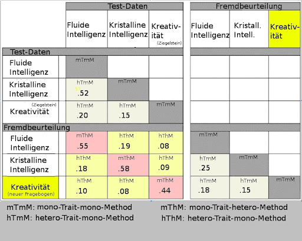

```{r setup, include=FALSE}
options(htmltools.dir.version = FALSE)

library(tidyverse)
library(kableExtra)
library(ggplot2)
library(plotly)
library(htmlwidgets)
library(MASS)
library(ggpubr)
library(xaringanthemer)
library(xaringanExtra)

style_duo_accent(
  primary_color = "#621C37",
    link_color = "#7da5f5",
  secondary_color = "#EE0071",
  background_image = "blank.png"
)

xaringanExtra::use_xaringan_extra(c("tile_view"))

use_scribble(
  pen_color = "#EE0071",
  pen_size = 4
  )

knitr::opts_chunk$set(
  fig.retina = TRUE,
  warning = FALSE,
  message = FALSE
)

```

name: Title slide
class: middle, left
<br><br><br><br><br><br><br>
# Einführung in die Forschungsmethoden der Psychologie und Psychotherapie

### Einheit 11: Freie Spitze und Fragen
##### 18.07.2024 | Dr. Caroline Zygar-Hoffmann

---
class: top, left
name: content
### Heutige Themen

#### [Lehrevaluation](#eval)

#### [Prüfung](#exam)

#### [Zusammenfassung](#summary)

#### [Fragen](#fragen)

---
class: top, left
name: eval

### Lehrevaluation

.center[
**"Die Studierenden finden die jeweils individuell freigeschalteten Evaluationen im studynet"**

```{r eval = TRUE, echo = F, out.width="80%"}

```
]

---
class: top, left
name: exam

### Prüfungsfragen

* **Lückentexte**: "Objektivität kann bei der Verhaltensbeobachtung durch Kennzahlen zur \_\_______________\_\_ erfasst werden."

* **Offene Fragen**: "Nennen Sie die vier Ziele der wissenschaftlichen Psychologie."

* **MC-Fragen**: Frage die den Kontext beschreibt, 3 Aussagen dazu $\rightarrow$ jede Aussage als richtig oder falsch markieren.

"Was trifft auf Gütekriterien zu?"
1. Reliabilität ist ein Nebengütekriterium.
2. Wenn ein Messinstrument reliabel ist, kann man auch davon ausgehen, dass es valide ist.
3. Es gibt konkrete Maßnahmen, um die Güte von Indikatoren in einer Verhaltensbeobachtung zu verbessern.
oder
4. Keine der Antworten ist richtig.

$\rightarrow$ **Achtung: Das unterscheidet sich vom Format von der MC-Fragen von Frau Garatva!**


---
class: top, left

### Prüfungsfragen

**Studentische Fragen:**

* Müssen wir auch Abbildungen/Modelle beschriften/zeichnen? 
$\rightarrow$ Ja, das kann sein.

* Inwiefern müssen wir die Studien aus den Folien kennen/wissen/erklären können? 
$\rightarrow$ Nur als mögliche Beispiele, nicht die Inhalte der Studien und andere Beispiele wären auch OK.

* Müssen wir alle "Grundsätze für Forschung und Publikation" wissen?
$\rightarrow$ siehe Einheit 1, Folie 11: Alle Folien sind prüfungsrelevant. 

---
class: top, left
name: summary

### Zusammenfassung

.pull-left[
**Themen**

* Einheit 1: Psychologie als Wissenschaft
* Einheit 2: Messen in der Psychologie
* Einheit 3: Manifeste Merkmale: Verhaltensbeobachtung
* Einheit 4: Latente Merkmale: Befragungen, Tests
* Einheit 5: Gastvortrag
* Einheit 6: Qualitative Methoden: Verstehen des Einzelfalls
* Einheit 7: Kausalität, Experiment und Studiendesigns
* Einheit 8: Forschungsethik und Open Science
* Einheit 9: Digitale Messmethoden, Big Data und Machine Learning
* Einheit 10: Psychologische Perspektiven und ihre Forschungsmethoden
]

.pull-right[
**Vermittelte Inhalte:**

* Herausforderungen und Möglichkeiten der Datenerhebung in der Psychologie, Gütekriterien
* Datenauswertung, Präsentation und Publikation wissenschaftlicher Forschungsergebnisse 
* Besonderheiten der Forschung im klinisch-psychologischen Kontext
*	Gute wissenschaftliche Praxis, ethische Prinzipien
]

---
class: top, left

### Zusammenfassung

* Im Folgenden werden Sie pro Einheit ein paar Fragen sehen

* Diese Fragen sollen Ihnen einen zusammenfassenden Überblick geben, zu welchen großen Themen Sie nach dem Lernen dieser Einheit etwas wissen sollten

* **Wenn in den Einheiten Folien sind, die nicht unter diese Fragen passen, heißt das nicht, dass diese Folien nicht prüfungsrelevant sind; die Folien sind trotzdem prüfungsrelevant!**

* Diese Fragen sind zudem auch nicht prototypisch für Prüfungsfragen, weil sie sehr offen und breit gestellt sind; Prüfungsfragen sind i.d.R. konkreter und spezifischer formuliert ("Nennen Sie 3...", "Beschreiben Sie ein Beispiel...", "Erklären Sie warum..." )

* **Idee dieser Zusammenfassung: Sie können anhand dieser Fragen prüfen, ob Sie mit Ihrem Wissensstand die wichtigen Themen abdecken**

* **Außerdem: Kurze(!), nicht vollständige(!), ggf. nicht richtige(!) Antworten von ChatGPT $\rightarrow$ keine Musterlösung oder ähnliches, kein Anspruch darauf, dass wir das im Rahmen der Fragestunde vollständig durchsprechen $\rightarrow$ zum Lernen die tatsächlichen Folien der jeweiligen Einheit nutzen**

---
class: top, left

### Zusammenfassung

#### Einheit 1: Psychologie als Wissenschaft

.pull-left[
$\rightarrow$ Was kennzeichnet Wissenschaft (im Arbeiten, Wissensproduktion, Erkenntnisgewinn, Haltung)?

$\rightarrow$ Was sind wichtige Begriffe einer empirischen Wissenschaft?

$\rightarrow$ Mit welchen Themen und Zielen beschäftigt sich die Psychologie?
]

.pull-right[
```{r eval = TRUE, echo = F, out.width = "90%"}
knitr::include_graphics("bilder/Einheit1.png")
```
]

---
class: top, left
<div class="footer"><span>Zur Prüfungsvorbereitung/zum Lernen bitte die Vorlesungsfolien der Einheiten nutzen! Die Antworten von ChatGPT auf dieser Folie dienen nur zu Übungszwecken im Rahmen der Fragestunde und können ggf. falsch sein.</span></div>

### Zusammenfassung --- Übung

#### Einheit 1: Psychologie als Wissenschaft

ChatGPT: Kannst du kurze Antworten (1-2 Sätze) auf alle 3 Fragen geben?

**Was kennzeichnet Wissenschaft?**
Wissenschaft zeichnet sich durch systematisches Arbeiten, objektive Wissensproduktion und den Gewinn neuer Erkenntnisse auf der Grundlage nachprüfbarer Methoden und Theorien aus.

**Was sind wichtige Begriffe einer empirischen Wissenschaft?**
Wichtige Begriffe einer empirischen Wissenschaft sind Hypothese, Experiment, Daten, Beobachtung, Analyse und Verifikation/Falsifikation.

**Mit welchen Themen und Zielen beschäftigt sich die Psychologie?**
Die Psychologie befasst sich mit dem Verständnis und der Erklärung des menschlichen Verhaltens und der mentalen Prozesse, mit Zielen wie der Verbesserung der psychischen Gesundheit, der Förderung des Wohlbefindens und dem Verstehen zwischenmenschlicher Dynamiken.

$\rightarrow$ **Frage**: Was fehlt/ist ggf. nicht (ganz) richtig? Was haben wir darüber hinaus alles kennengelernt? Was davon haben wir ggf. nicht kennengelernt?

---
class: top, left

### Zusammenfassung

#### Einheit 2: Messen in der Psychologie

$\rightarrow$ Was sind Qualitätskriterien für psychologische Erhebungsmethoden und wie werden sie gewährleistet/überprüft?

$\rightarrow$ Was sind zentrale Annahmen und Elemente der klassischen Testtheorie?

$\rightarrow$ Was ist Reaktivität und wie kann man damit umgehen?


---
class: top, left

### Zusammenfassung

#### Einheit 2: Messen in der Psychologie

**Studentische Frage: Was bedeuten die verschiedenen Begriffe zur Validität (Inhalts-, Konstrukt- (divergente & konvergente), Kriteriumsvalidität, faktorielle Validität)?**


--


**Inhaltsvalidität ist genauso wie kausale Validität, das was Validität ausmacht**: Messen wir wirklich, was wir messen wollen?

* Bei kausaler Validität geht es darum ob Variationen im Merkmal auch wirklich Variationen im Testwert erzeugen.

* Bei Inhaltsvalidität geht es darum ob das Merkmal durch den Test in allen Facetten erfasst wird.

$\rightarrow$ Nur dann können wir sagen: Ja, die Erhebungsmethode sagt uns wirklich etwas über das zugrundeliegende Merkmal aus (und nicht etwa etwas über ein anderes Merkmal)

---
class: top, left

### Zusammenfassung

#### Einheit 2: Messen in der Psychologie

**Studentische Frage: Was bedeuten die verschiedenen Begriffe zur Validität (Inhalts-, Konstrukt- (divergente & konvergente), Kriteriumsvalidität, faktorielle Validität)?**


--


**Konstrukt-, Kriteriumsvalidität und faktorielle Validität sind Validierungsmöglichkeiten auf Basis von Korrelationen:** d.h. Sie geben indirekte Hinweise auf die Validität

* **Konstruktvalidität:** Wie hoch korreliert mein Test mit anderen Tests die dasselbe messen sollen (konvergente Validität) oder was anderes (divergente Validität)
$\rightarrow$ **Idee:** Wenn der andere Test valide ist, und mein Test hoch oder niedrig mit diesem korreliert, sagt mir das was über die Validität meines Tests!

* **Kriteriumsvalidität:** Wie hoch korreliert mein Test mit externen, möglichst manifest gemessenen Kriterien (d.h. keine anderen Tests), die durch mein Merkmal beeinflusst werden sollten 
$\rightarrow$ **Idee:** Wenn mein Test mit dem Kriterium korreliert spricht das dafür, dass ich wirklich messe was ich zu messen meine!

* **Faktorielle Validität:** Ist die statistische Struktur meines Tests so wie ich es für mein Merkmal vermute?
$\rightarrow$ **Idee:** Wenn die statistische Struktur erwartungsgemäß ist, dann spricht das für die Validität meines Tests.

---
class: top, left
<div class="footer"><span>http://www.psychologiederschule.de/Multitrait-Multimethod-Analyse.php
</span></div>

### Zusammenfassung

#### Einheit 2: Messen in der Psychologie
 
**Studentische Frage: Was ist die Multitrait-Multimethod-Methode?**
--

Eine Methode, die hilft die Erwartungen im Rahmen der Konstruktvalidität zu strukturieren und mit empirischen Ergebnissen abzugleichen (z.B. sollte das gleiche Merkmal mit unterschiedlichen Methoden gemessen höher korrelieren, als zwei unterschiedliche Merkmale mit unterschiedlichen Methoden gemessen)

.center[
```{r eval = TRUE, echo = F, out.width = "40%"}

```
]

---
class: top, left

### Zusammenfassung

#### Einheit 3: Manifeste Merkmale: Verhaltensbeobachtung

.pull-left[
$\rightarrow$ Wie können Beobachtungspläne aussehen und worauf muss man dabei achten?

$\rightarrow$ Was sind Beispiele für Beobachtungsfehler und -verzerrungen in einer Verhaltensbeobachtung und was sind Gegenmaßnahmen?
]

.pull-right[
```{r eval = TRUE, echo = F, out.width = "90%"}
knitr::include_graphics("bilder/Einheit4.png")
```
]

---
class: top, left
<div class="footer"><span>Zur Prüfungsvorbereitung/zum Lernen bitte die Vorlesungsfolien der Einheiten nutzen! Die Antworten von ChatGPT auf dieser Folie dienen nur zu Übungszwecken im Rahmen der Fragestunde und können ggf. falsch sein.</span></div>

### Zusammenfassung --- Übung

#### Einheit 3: Manifeste Merkmale: Verhaltensbeobachtung

ChatGPT: Kannst du kurze Antworten (1-2 Sätze) auf beide Fragen geben?

**Wie können Beobachtungspläne aussehen und worauf muss man dabei achten?**
Beobachtungspläne können strukturiert (mit festen Kriterien und Skalen) oder unstrukturiert (offene, flexible Beobachtung) sein. Wichtig ist die klare Definition der Beobachtungsziele, die Schulung der Beobachter und die Berücksichtigung von Faktoren wie Beobachterbias und Kontext der Beobachtung.

**Was sind Beispiele für Beobachtungsfehler und -verzerrungen in einer Verhaltensbeobachtung und was sind Gegenmaßnahmen?**
Beispiele für Beobachtungsfehler und -verzerrungen in einer Verhaltensbeobachtung sind unter anderem Beobachterbias (Vorurteile des Beobachters) und das Hawthorne-Effekt (Veränderung des Verhaltens aufgrund der Beobachtung selbst). Gegenmaßnahmen umfassen Schulung der Beobachter für objektive und konsistente Beobachtungen, Nutzung von standardisierten Protokollen und gegebenenfalls verdeckte Beobachtungen.

$\rightarrow$ **Frage**: Was fehlt/ist ggf. nicht (ganz) richtig? Was haben wir darüber hinaus alles kennengelernt? Was davon haben wir ggf. nicht kennengelernt?

---
class: top, left

### Zusammenfassung

#### Einheit 4: Latente Merkmale: Befragungen, Tests

.pull-left[
$\rightarrow$ Welche Methoden des Selbstberichts gibt es?

$\rightarrow$ Worauf ist bei der Konstruktion von Befragungen/Fragebögen zu achten?

$\rightarrow$ Was für psychologische Testverfahren gibt es?
]

.pull-right[
```{r eval = TRUE, echo = F, out.width = "90%"}
knitr::include_graphics("bilder/Einheit5.png")
```
]

---
class: top, left

### Zusammenfassung

#### Einheit 4: Latente Merkmale: Befragungen, Tests

**Studentische Frage: Warum sind Interviews aufwändiger und kostenintensiver als Fragebögen?**
--

* Zeitaufwand für Vorbereitung (z.B. Erstellung von Interviewleitfäden, Schulung interviewer) und Durchführung (z.B. Interviewer muss während ganzer Datenerhebung dabei sein)

* Komplexität der Datenanalyse kann wegen größerer Menge an qualitativen Aspekten erhöht sein

---
class: top, left

### Zusammenfassung

#### Einheit 5: Gastvortrag

.pull-left[
$\rightarrow$ Welche Elemente gibt es im Bayes Theorem?

$\rightarrow$ Was ist der Prediction Error beim Predictive Coding mit Bayesianischer Inferenz?

$\rightarrow$ Was sind jeweils Magnetresonanzspektroskopie, Elektroenzephalographie und Funktionelle Magnetresonanztomographie (wofür werden diese Methoden jeweils verwendet und was sind Vor- und Nachteile)?
]

.pull-right[
```{r eval = TRUE, echo = F, out.width = "90%"}
knitr::include_graphics("bilder/Einheit5.png")
```
]


---
class: top, left

### Zusammenfassung

#### Einheit 5: Gastvortrag

**Studentische Frage: Was bedeuten die Folien zum Predictive Coding (Folie 15 und 22)?**

.center[
```{r eval = TRUE, echo = F, out.width = "45%"}
knitr::include_graphics("bilder/gast_f15.png")
```
]

--

* Elemente des Bayes-Theorem: Prior (Vorannahmen), Likelihood (Daten), Posterior (Ergebnis)
* Anwendung auf Verarbeitung von Reizen: 
  - Prior = Vorhersage was mich erwartet
  - Likelihood = sensorische Information, die ich über meine Sinne bekomme
  - Posterior = subjektive Wahrnehmung eines Reizes

---
class: top, left

### Zusammenfassung

#### Einheit 5: Gastvortrag

**Studentische Frage: Was bedeuten die Folien zum Predictive Coding (Folie 15 und 22)?**

.center[
```{r eval = TRUE, echo = F, out.width = "50%"}
knitr::include_graphics("bilder/gast_f22.png")
```
]

--

* Vorhersagefehler (Prediction Error), die bei der subjektiven Wahrnehmung passieren können: Übergewichtung der Vorhersagen oder Übergewichtung der sensorischen Information

* Derartige Vorhersagefehler bieten Erklärungsansätze für "falsche" Wahrnehmungen & Verbarbeitungen, z.B. bei Schizophrenie

---
class: top, left

### Zusammenfassung

#### Einheit 6: Qualitative Methoden: Verstehen des Einzelfalls

.pull-left[
$\rightarrow$ In welchen Aspekten und Zielen unterscheiden sich qualitative und quantitative Methoden?

$\rightarrow$ Welche qualitativen Datenerhebungsmethoden gibt es und wodurch sind sie charakterisiert?

$\rightarrow$ Worauf ist bei der Konzeption von Interviews und Interviewfragen zu achten?

$\rightarrow$ Wie werden qualitative Daten in etwa ausgewertet?
]

.pull-right[
```{r eval = TRUE, echo = F, out.width = "90%"}

```
]

---
class: top, left

### Zusammenfassung

#### Einheit 6: Qualitative Methoden: Verstehen des Einzelfalls

**Studentische Frage: Was ist mit Hermeneutik gemeint?**
--

* Qualitative Forschungsmethode für die Analyse von Textmaterial

* Zentrale Fragen: 
  - Wie können wir Bedeutung aus Texten extrahieren? 
  - Welche Rolle spielen Vorverständnis und Voreingenommenheit dabei?
  - Wie sollte historischer und kultureller Kontext berücksichtigt werden?
  - Wie können Interpretationen gerechtfertigt werden?

---
class: top, left

### Zusammenfassung

#### Einheit 7: Kausalität, Experiment und Studiendesigns

.pull-left[
$\rightarrow$ Was versteht man unter Kausalität und inwiefern unterscheidet sich das von Korrelation/Zusammenhängen?

$\rightarrow$ Was kennzeichnet ein Experiment?

$\rightarrow$ Was sind Störvariablen, was sind Ursachen und Konsequenzen von jeweils systematischen und unsystematischen Störvariablen und welche Möglichkeiten hat man damit umzugehen?

$\rightarrow$ Was für nicht-experimentelle, quasi-experimentelle und experimentelles Versuchspläne haben Sie kennengelernt und wodurch sind sie gekennzeichnet?
]

.pull-right[
```{r eval = TRUE, echo = F, out.width = "90%"}
knitr::include_graphics("bilder/Einheit6.png")
```
]

---
class: top, left

### Zusammenfassung

#### Einheit 7: Kausalität, Experiment und Studiendesigns
 
**Studentische Frage: Was sind systematische und unsystematische Störvariablen und Konfundierung?**

**Störvariablen**: alle Variablen, die nicht die UV sind, und mit der AV zusammenhängen, d.h. einen Einfluss auf das Ergebnis eines Experiments haben

.small[
.pull-left[
**Systematische Störvariablen**: korrelieren mit der UV, d.h. treten systematisch nur in bestimmten Ausprägungen der UV auf, z.B. nur in der Experimentalbedingung, aber nicht in der Kontrollbedingung

**Unsystematische Störvariablen**: korrelieren **nicht** mit der UV, d.h. treten in allen Ausprägungen der UV auf und vergrößern daher die Varianz in der AV, z.B. in beiden Bedingungen haben Personen die Studie zu unterschiedlichen Tageszeiten durchgeführt und das beeinflusst die Ergebnisse auf der AV in beiden Bedingungen, was es schwerer macht einen Effekt der UV zu entdecken (mehr Fehler 2.Art)
]
]

.pull-right[
```{r eval = TRUE, echo = F}
knitr::include_graphics("bilder/unsystSV.png")
```
]

---
class: top, left

### Zusammenfassung

#### Einheit 7: Kausalität, Experiment und Studiendesigns
 
**Studentische Frage: Was sind systematische und unsystematische Störvariablen und Konfundierung?**

**Konfundierung**: Tritt auf, wenn systematische Störvariablen nicht kontrolliert werden, man spricht davon, dass eine Variable mit der UV konfundiert ist, und man deswegen nicht sagen kann, ob die Störvariable oder die UV Ursache davon ist, wenn es Unterschiede in den Ausprägungen der UV auf der AV gibt

---
class: top, left

### Zusammenfassung

#### Einheit 7: Kausalität, Experiment und Studiendesigns
 
**Studentische Frage: Was bedeutet Folie 53?**

.center[
```{r eval = TRUE, echo = F, out.width = "60%"}
knitr::include_graphics("bilder/e7_f53.png")
```
]

--

$\rightarrow$ Übersicht wie ein RCT aussieht, und dass es einem Kontrollgruppenplan entspricht

---
class: top, left

### Zusammenfassung

#### Einheit 8: Forschungsethik und Open Science

.pull-left[
$\rightarrow$ Welche forschungsethischen Prinzipien haben Sie kennengelernt? 

$\rightarrow$ Wodurch zeichnet sich ein informiertes Einverständnis (informed consent) aus?

$\rightarrow$ Zu welchen Themen machen die berufsethischen Richtlinien von BDP und DGPs welche Aussagen?

$\rightarrow$ Welche Ziele und Bereiche von Open Science gibt es?
]

.pull-right[
```{r eval = TRUE, echo = F, out.width = "90%"}

```
]

---
class: top, left

### Zusammenfassung --- Übung

#### Einheit 8: Forschungsethik und Open Science

ChatGPT: Kannst du kurze Antworten (1-2 Sätze) auf alle 4 Fragen geben?

.small[
**Welche forschungsethischen Prinzipien haben Sie kennengelernt?**
Forschungsethische Prinzipien umfassen Integrität, Vertraulichkeit, Fairness und Respekt gegenüber Probanden sowie die Verpflichtung zur Vermeidung von Schaden.

**Wodurch zeichnet sich ein informiertes Einverständnis (informed consent) aus?**
Ein informiertes Einverständnis bedeutet, dass Probanden vor ihrer Teilnahme an einer Studie umfassend über die Ziele, Risiken und Nutzen informiert werden und freiwillig zustimmen, ohne Zwang oder Täuschung.

**Zu welchen Themen machen die berufsethischen Richtlinien von BDP und DGPs welche Aussagen?**
Die berufsethischen Richtlinien von BDP und DGPs behandeln Themen wie Vertraulichkeit, professionelles Verhalten, Supervision und die Beziehung zwischen Psychologen und ihren Klienten.

**Welche Ziele und Bereiche von Open Science gibt es?**
Open Science zielt darauf ab, Forschung transparenter, zugänglicher und kooperativer zu gestalten. Dies umfasst offenen Zugang zu Publikationen und Daten, reproduzierbare Forschung und gemeinsame Zusammenarbeit.
]

$\rightarrow$ **Frage**: Was fehlt/ist ggf. nicht (ganz) richtig? Was haben wir darüber hinaus alles kennengelernt? Was davon haben wir ggf. nicht kennengelernt?


---
class: top, left

### Zusammenfassung

#### Einheit 9: Digitale Messmethoden, Big Data und Machine Learning

.pull-left[
$\rightarrow$ Was sind Vor- und Nachteile digitaler Messmethoden?

$\rightarrow$ Welche Methoden im Kontext von Ambulatory Assessment haben Sie kennengelernt und was charakterisiert sie?

$\rightarrow$ Welche Machine Learning Methoden haben Sie kennengelernt und was für Anwendungszwecke haben sie?

$\rightarrow$ Wie funktioniert prädiktive Modellierung und im Speziellen Kreuzvalidierung?

$\rightarrow$ Wie kann künstliche Intelligenz in klinischen Settings akzeptiert werden?
]

.pull-right[
```{r eval = TRUE, echo = F, out.width = "90%"}

```
]

---
class: top, left

### Zusammenfassung

#### Einheit 9: Digitale Messmethoden, Big Data und Machine Learning
 
**Studentische Frage: Was sind event und time sampling (evtl. anhand eines Bsp.?) und konzeptuelle und methodische Implikationen davon?**

--

* Zwei verschiedene Arten ESM/EMA umzusetzen: 

1) Entweder man ist an bestimmten Ereignissen interessiert und befragt Personen konkret, wenn diese Ereignisse eingetreten sind, Befragung wird initiiert durch die Versuchspersonen oder durch passive Sensoren = event sampling

2) Oder man möchte den Alltag / bestimmte Zeitpunkte mit den Befragungen abdecken, und befragt Personen daher zu bestimmten oder zufälligen Zeiten = time sampling

* Welche Art besser geeignet ist hängt von der Forschungsfrage ab

---
class: top, left

### Zusammenfassung

#### Einheit 10: Psychologische Perspektiven und ihre Forschungsmethoden

.pull-left[
$\rightarrow$ Welche Haltung und Annahmen kennzeichnen die verschiedenen Perspektiven auf die Psychologie?

$\rightarrow$ Welche Methoden sind in den verschiedenen Paradigmen vorherrschend?

$\rightarrow$ Was sind Beispiele für Untersuchungsschwerpunkte, Themen und Studien in den verschiedenen Perspektiven?
]

.pull-right[
```{r eval = TRUE, echo = F, out.width = "90%"}
knitr::include_graphics("bilder/Einheit3.png")
```
]

---
class: top, left
<div class="footer"><span>Zur Prüfungsvorbereitung/zum Lernen bitte die Vorlesungsfolien der Einheiten nutzen! Die Antworten von ChatGPT auf dieser Folie dienen nur zu Übungszwecken im Rahmen der Fragestunde und können ggf. falsch sein.</span></div>

### Zusammenfassung --- Übung

#### Einheit 10: Psychologische Perspektiven und ihre Forschungsmethoden

ChatGPT: Kannst du kurze Antworten (1-2 Sätze) auf alle 3 Fragen geben?

.small[
**Welche Haltung und Annahmen kennzeichnen die verschiedenen Perspektiven auf die Psychologie?**
In der Psychologie variiert die Haltung je nach Perspektive: Behaviorismus fokussiert auf beobachtbares Verhalten und Umwelteinflüsse; Psychoanalyse betont das Unbewusste und frühe Erfahrungen; die kognitive Psychologie untersucht innere mentale Prozesse; und die humanistische Psychologie konzentriert sich auf Selbstverwirklichung und persönliches Wachstum.

**Welche Methoden sind in den verschiedenen Paradigmen vorherrschend?**
Behaviorismus verwendet experimentelle und Beobachtungsmethoden, Psychoanalyse setzt auf introspektive Techniken wie freie Assoziation, kognitive Psychologie nutzt Experimente zur Informationsverarbeitung und Gedächtnisstudien, und humanistische Psychologie bevorzugt qualitative Ansätze wie Interviews und Selbstberichte.

**Was sind Beispiele für Untersuchungsschwerpunkte, Themen und Studien in den verschiedenen Perspektiven?**
Behaviorismus konzentriert sich auf Konditionierung und Lernen; Psychoanalyse erforscht Träume, Kindheitserinnerungen und Verdrängung; kognitive Psychologie untersucht Wahrnehmung, Denken und Problemlösen; humanistische Psychologie beschäftigt sich mit persönlichem Wachstum, Selbstkonzept und Selbstverwirklichung.
]

$\rightarrow$ **Frage**: Was fehlt/ist ggf. nicht (ganz) richtig? Was haben wir darüber hinaus alles kennengelernt? Was davon haben wir ggf. nicht kennengelernt?

---
class: top, left
name: fragen

### Weitere Fragen

.center[
```{r eval = TRUE, echo = F, out.width = "550px"}

```
]

<!-- library(renderthis)  -->
<!-- to_pdf("EinfForsch_11_FreieSpitze.Rmd", complex_slides = TRUE) -->


```{r eval=FALSE, include=FALSE}
# https://rviews.rstudio.com/2021/11/18/deploying-xaringan-slides-a-ten-step-github-pages-workflow/
```
