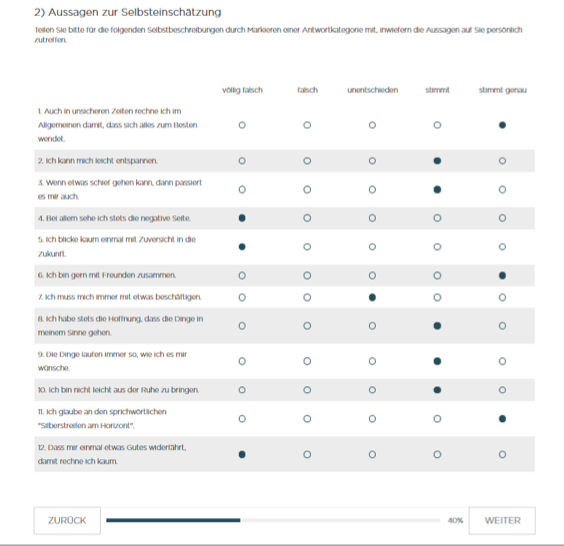
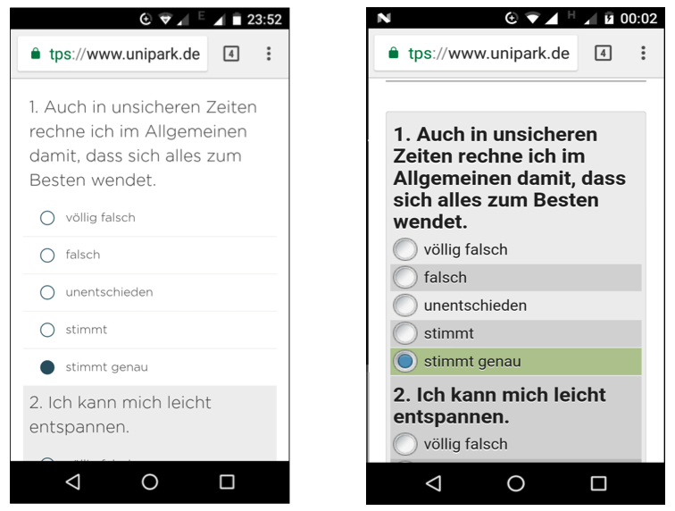
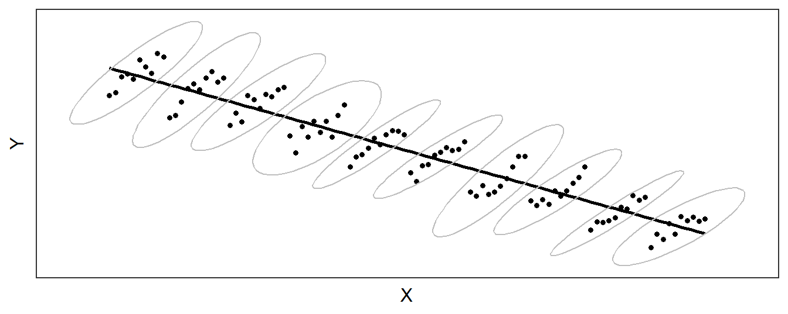
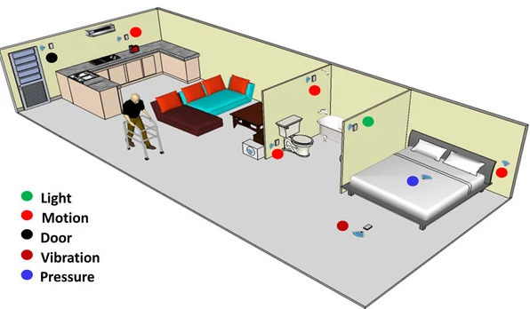
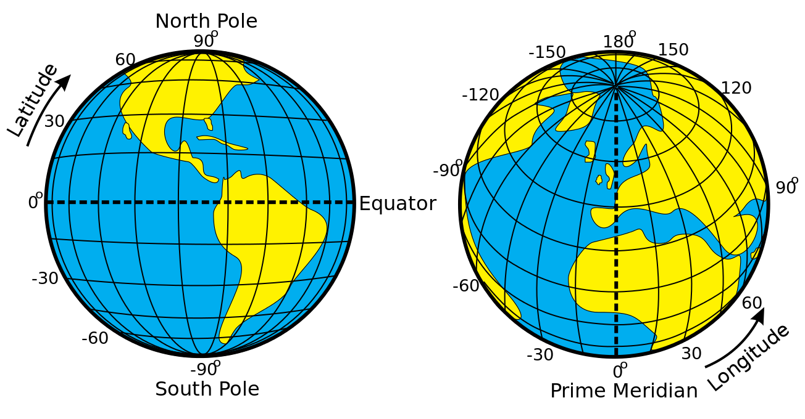
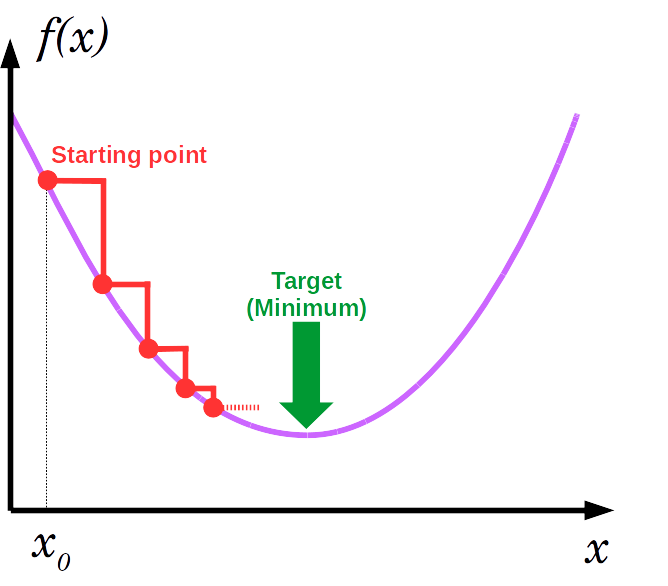
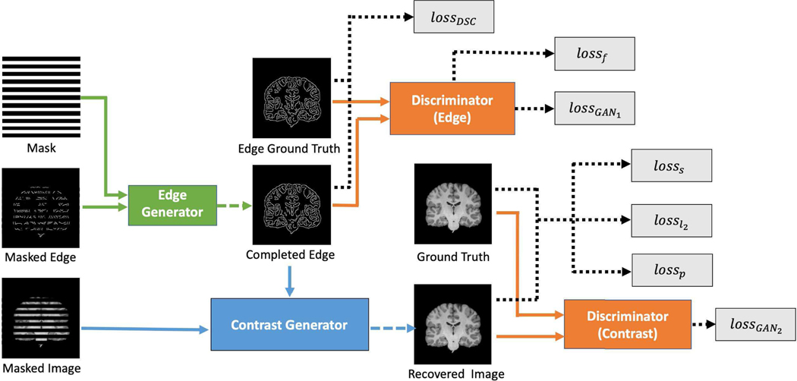

```{r setup, include=FALSE}
options(htmltools.dir.version = FALSE)

library(tidyverse)
library(kableExtra)
library(ggplot2)
library(plotly)
library(htmlwidgets)
library(MASS)
library(ggpubr)
library(xaringanthemer)
library(xaringanExtra)

style_duo_accent(
  primary_color = "#621C37",
  secondary_color = "#EE0071",
  background_image = "blank.png"
)

xaringanExtra::use_xaringan_extra(c("tile_view"))

use_scribble(
  pen_color = "#EE0071",
  pen_size = 4
  )

knitr::opts_chunk$set(
  fig.retina = TRUE,
  warning = FALSE,
  message = FALSE
)

# library(RefManageR)
# BibOptions(
# check.entries = FALSE, 
# bib.style = "authoryear", 
# cite.style = "authoryear", 
# style = "markdown",
# hyperlink = FALSE, 
# dashed = FALSE)
# myBib = ReadBib("/Users/stephangoerigk/Desktop/Universität/CFH/Lehre/Bachelor/Einführung in die Forschungsmethoden der Psychologie und Psychotherapie/EFPP_Folien/myBib.bib")
```

name: Title slide
class: middle, left
<br><br><br><br><br><br><br>
# Einführung in die Forschungsmethoden der Psychologie und Psychotherapie

### Einheit 9: Digitale Datenerhebung, Big Data und Machine-Learning
##### 12.01.2024 | Dr. Caroline Zygar-Hoffmann

---
class: top, left
name: intro

### Digitale Datenerhebung

#### Globale Entwicklung der Digitalisierung

* Global zunehmende Digitalisierung

* 2014/15 besaßen über 60% der Bevölkerung in den USA ein Smartphone (Pew Research Center, 2014, 2015)

* Steigender Anteil von Menschen mit Internetzugang:

.center[
```{r eval = TRUE, echo = F, out.width = "650px"}
knitr::include_graphics("bilder/growdigit.png")
```
]


---
class: top, left
### Digitale Datenerhebung

#### Digitalisierung traditioneller Datenerhebungsmethoden

**Ausfüllen durch Proband:innen am Computer/Smartphone:**

.pull-left[
.center[
```{r eval = TRUE, echo = F, out.width = "380px"}

```
]
]
.pull-right[
.center[
```{r eval = TRUE, echo = F, out.width = "450px"}

```
]
]

---
class: top, left
### Ambulatory Assessment (AA)

#### Aktives vs. Passives Ambulatory Assessment

In der AA-Forschung unterscheiden wir zwei Formen der Datenerhebung:

1) **Aktives AA**, bei dem Selbstauskunftsdaten erhoben werden

  * verlangt von den Teilnehmern, dass sie bewusst Informationen bereitstellen
  
  * Beispiel: Stimmung bewerten, nachdem Frage auf dem Smartphone erscheint


2) **Passives AA**, bei dem Beobachtungsdaten erhoben werden

  * Informationen werden durch Wearables oder Logdateien ohne aktive Beteiligung der Teilnehmer gesammelt.
  
  * Beispiel: Herzfrequenz, Aktivität, Smartphone-Nutzung oder Engagement in sozialen Medien

---
class: top, left
### Ambulatory Assessment (AA)

#### Aktives vs. Passives Ambulatory Assessment

Eine Studie zum Schlafverhalten kann z.B. ein Schlaftagebuch mit Selbstauskunft und einen Beschleunigungssensor umfassen:

1) **Aktives AA**: Datenerhebung, indem den Teilnehmern Fragen gestellt werden, z.B. mit Hilfe einer EMA-App:

.center[
```{r eval = TRUE, echo = F, out.width = "550px"}
knitr::include_graphics("bilder/activeema-1.png")
```
]

2) **Passives AA**: Daten werden automatisch gesammelt, zum Beispiel durch ein Wearable:

.center[
```{r eval = TRUE, echo = F, out.width = "550px"}
knitr::include_graphics("bilder/passiveema-1.png")
```
]

---
class: top, left
### Ambulatory Assessment (AA)

#### Aktives AA: Warum ESM/EMA?

**Zur Minimierung von Gedächtnisfehlern**

* Klinische Forschung: Selbstauskunftsfragebögen, um das Vorhandensein und den Schweregrad von Symptomen in der jüngsten Vergangenheit zu bewerten (z.B. letzte 14 Tage)

* Retrospektive Selbstberichte sind zwar nützlich, aber nicht ohne Nachteile

  * greifen auf die Erinnerung der Befragten zurück
  * Diese kann verzerrt sein  (Moore, Depp, Wetherell, & Lenze, 2016). 

ESM/EMA Lösung: Messung des aktuellen Zustands statt Reflexion über vergangene Erfahrungen 

---
class: top, left
### Ambulatory Assessment (AA)

#### Aktives AA: Warum ESM/EMA?

**Maximierung der ökologischen Validität**

* Erhebung von Daten in realen Umgebungen, in denen die Teilnehmer ihren täglichen Aktivitäten nachgehen

* Keine Datenerhebung in kontrollierten Laboren oder Forschungseinrichtungen

  * Folge 1: bessere Verallgemeinerbarkeit auf die gelebte Erfahrung der Probanden in der realen Welt

  * Folge 2: praktische Anwendungen, die aus EMA Daten abgeleitet werden, haben größere Relevanz für reale Situationen 

---
class: top, left
### Ambulatory Assessment (AA)

#### Aktives AA: Warum ESM/EMA?

**Idiographische Forschung vorantreiben**

* Ergebnisse auf Gruppenebene lassen sich nicht unbedingt auf einzelne Mitglieder der Gruppe verallgemeinern

* Aktives AA ermöglicht Erhebung großer Mengen quantitativer Daten auf individueller Ebene (Unterschied z.B. zum qualitativen Interview)

* ermöglicht ein besseres Verständnis von Faktoren, die Variabilität innerhalb und zwischen Individuen erklären


---
class: top, left
### Ambulatory Assessment (AA)

#### Aktives AA: Warum ESM/EMA?

**Idiographische Forschung vorantreiben**

Veranschaulichung, wie sich Prozesse auf Gruppenebene und auf individueller Ebene dramatisch unterscheiden können $\rightarrow$ "**Simpson's Paradox**": 

.center[
```{r eval = TRUE, echo = F, out.width = "700px"}

```
]

* Beziehung zwischen x und y ist in der Gruppe negativ (durch absteigende Linie dargestellt)
* aber positiv für Individuen (durch Ellipsen markiert).


---
class: top, left
### Ambulatory Assessment (AA)

#### Aktives AA: Warum ESM/EMA?

**Das dynamische Zusammenspiel zwischen Symptomen verstehen**

* In der Netzwerktheorie der Psychopathologie (Borsboom, 2017) werden psychische Störungen als Netzwerke von Symptomen konzeptualisiert

* Wiederkehrende Kausalschleifen halten das Netzwerk in einem "gestörten" Zustand  (z.B. Schlafprobleme -> Müdigkeit -> Grübeln -> Schlafprobleme)

* Ziel Identifizierung patientenspezifischer Symptomnetzwerke
  * Zentrale Symptome können mit personalisierten Interventionen angegangen werden
  * Selbsterhaltende Schleifen durchbrechen

* Identifizierung dieser Netzwerke erfordert wiederholte Bewertungen von Symptomen im realen Leben (aktives AA)

---
class: top, left
### Ambulatory Assessment (AA)

#### Aktives AA: Warum ESM/EMA?

**Das dynamische Zusammenspiel zwischen Symptomen verstehen**

Phasen der Entwicklung psychischer Störungen nach der Netzwerktheorie (Boorsbom, 2017):

.pull-left[

.center[
```{r eval = TRUE, echo = F, out.width = "450px"}
knitr::include_graphics("bilder/borrsbom1.png")
```
]
]

.pull-right[
* **Phase 1:** Asymptomatische Phase - das Netzwerk ist inaktiv 
* **Phase 2:** Externes Ereignis (E1) aktiviert einige der Symptome 
* **Phase 3:** Symptome aktivieren ihrerseits verbundene Symptome 
* **Phase 4:** Ist das Netzwerk stark vernetzt, führt die Beseitigung des externen Ereignisses nicht zu einer Erholung: Das Netzwerk ist selbsterhaltend und verharrt in seinem aktiven Zustand
]

---
class: top, left
### Ambulatory Assessment (AA)

#### Aktives AA: Warum ESM/EMA?

**Das dynamische Zusammenspiel zwischen Symptomen verstehen**

Resilientes vs. anfälliges Netzwerk (Boorsbom, 2017):

.center[
```{r eval = TRUE, echo = F, out.width = "650px"}
knitr::include_graphics("bilder/borrsbom2.png")
```
]

* Ein schwach vernetztes Netzwerk (oberes Feld) ist widerstandsfähig. 
* Symptome können durch externe Ereignisse aktiviert werden, aber die Symptom-Symptom-Interaktionen sind nicht stark genug, um zu einer sich selbst erhaltenden Symptomaktivität zu führen. 
* Ein stark vernetztes Netzwerk (unteres Feld) hingegen kann seine eigene Aktivität aufrechterhalten auch wenn das externe Ereignis vorüber ist, und ist dadurch anfällig sich zu einem Störungszustand entwickeln.

---
class: top, left
### Ambulatory Assessment (AA)

#### Aktives AA: Warum ESM/EMA?

**Ermöglichung von Ecological Momentary Interventions (EMI)**

* EMI: Interventionen, die den Menschen in ihrem Alltag, in Echtzeit und in ihrer natürlichen Umgebung angeboten werden

.center[
```{r eval = TRUE, echo = F, out.width = "70%"}
knitr::include_graphics("bilder/emi_paper.png")
```
]

* Personalisierung möglich hinsichtlich Timing und Art der Intervention:
  * Timing: Wenn aktives AA deutliche Veränderungen in relevanten pathologischen Prozessen widerspiegelt
  * Art: Auf eine Art und Weise, die in Anbetracht dessen, was über die Person bekannt ist, maximal effektiv ist


---
class: top, left

### Ambulatory Assessment (AA)

#### Passives AA: Sensing

.pull-left[
.center[
```{r eval = TRUE, echo = F, out.width = "350px"}

```
]
**Ambient sensing:**

* Sensortechnik bei Teilnehmer:innen zuhause
* Internet der Dinge
* Bewegungssensorik, Kameras, etc.

]
.pull-right[
.center[
```{r eval = TRUE, echo = F, out.width = "450px"}
knitr::include_graphics("bilder/sp.jpg")
```
]
**Mobile sensing:**

* Nutzen der Smartphone Sensortechnik
* Bewegungsdaten, Smartphone-Nutzungsdaten (Ladezyklen, Bildschirm-Check, etc.)
* Online-Aktivität
]

---
class: top, left

### Ambulatory Assessment (AA)

#### Passives AA: Mobile Sensing mit Geotracking


.pull-left[
* Ausnutzung des Global Positioning System (GPS)

* Genaue Position über Breitengrad und Längengrad

* z.B. latitude: 52.37022; longitude: 4.89517

.center[
```{r eval = TRUE, echo = F, out.width = "450px"}

```
]
]
.pull-right[

Beispiel:

* 4-wöchiges GPS Bewegungsmuster (von 2 Personen)

* links depressiv, rechts nicht depressiv

.center[
```{r eval = TRUE, echo = F, out.width = "450px"}
knitr::include_graphics("bilder/fourweekgps-1.png")
```
]
]

---
class: top, left

### Big Data und Machine-Learning

#### Machine Learning - grobe Time Line

<small>

* 1940s-1950s: Entstehung der der Idee von neuronalen Netzen als möglichem Ansatz für künstliche Intelligenz (KI)

* 1950s-1960s: Entwicklung von einfachen neuronalen Netzen und erste Anwendungen in Bereichen wie Handwriting Recognition und Bilderkennung.

* 1970s-1980s: Rückschlag in der Entwicklung von neuronalen Netzen aufgrund von Problemen mit dem Training und der Generalisierung.

* 1980s-1990s: Wiederaufleben des Interesses an neuronalen Netzen durch den Einsatz von "error backpropagation" und anderen verbesserten Trainingsalgorithmen.

* 1990s: Einführung von Support Vector Machines (SVMs) und anderen "shallow" Machine Learning-Methoden.

* 2000s: Einführung von "Big Data" und "Data Mining" als Schlagworte, sowie die Verfügbarkeit von großen Datenmengen und leistungsfähigen Computern.

* 2010s: Explosion des Interesses an "Deep Learning" und der Verfügbarkeit von großen, gut strukturierten Datensätzen und leistungsfähigen Grafikprozessoren (GPUs) für das Training tiefer Netze.

* 2020s: Deep Learning und Machine Learning werden in vielen Bereichen angewendet, wie zum Beispiel Computer Vision, Natur Sprachverarbeitung, Robotics und Medizin.

</small>

---
class: top, left

### Big Data und Machine-Learning

#### Machine Learning - grobe Time Line

.pull-left[

**Das Perzeptron:**

* Über viele Versuche hinweg änderte die Maschine die statistischen Gewichte, die mit jedem Lichtsensor verbunden waren, anhand einer internen Gleichung

* Die Antworten einiger Sensoren wurden  sehr stark gewichtet, während andere (z. B. die in einem Viereckmuster) nicht gewichtet wurden

* In den Anfängen des maschinellen Lernens ging es also darum, aus realen Daten zu lernen, begrenzte Vorannahmen darüber zu treffen, wie diese Daten aussehen, und die Leistung der Maschine unter realen Bedingungen zu bewerten.
]

.pull-right[
.center[
```{r eval = TRUE, echo = F, out.width = "650px"}
knitr::include_graphics("bilder/perceptron-formule.png")
```
]
]


### Big Data und Machine-Learning

#### Machine Learning - grobe Time Line

<small>

* 1940s-1950s: Entstehung der der Idee von neuronalen Netzen als möglichem Ansatz für künstliche Intelligenz (KI)

* 1950s-1960s: Entwicklung von einfachen neuronalen Netzen und erste Anwendungen in Bereichen wie Handwriting Recognition und Bilderkennung.

* 1970s-1980s: Rückschlag in der Entwicklung von neuronalen Netzen aufgrund von Problemen mit dem Training und der Generalisierung.

* 1980s-1990s: Wiederaufleben des Interesses an neuronalen Netzen durch den Einsatz von "error backpropagation" und anderen verbesserten Trainingsalgorithmen.

* 1990s: Einführung von Support Vector Machines (SVMs) und anderen "shallow" Machine Learning-Methoden.

* 2000s: Einführung von "Big Data" und "Data Mining" als Schlagworte, sowie die Verfügbarkeit von großen Datenmengen und leistungsfähigen Computern.

* 2010s: Explosion des Interesses an "Deep Learning" und der Verfügbarkeit von großen, gut strukturierten Datensätzen und leistungsfähigen Grafikprozessoren (GPUs) für das Training tiefer Netze.

* 2020s: Deep Learning und Machine Learning werden in vielen Bereichen angewendet, wie zum Beispiel Computer Vision, Natur Sprachverarbeitung, Robotics und Medizin.

</small>

---
class: top, left
### Big Data und Machine-Learning

#### Klassen von Machine Learning

**Gradient Descent**

* Lernen = Fehlerveringerung (Trial + Error)
* Standardmethode zur Modelloptimierung: Gradient Descent
* Schrittweise (inkrementelle) Modellanpassung veringert den Fehler
* VORICHT: Lokale Minima müssen vermieden werden

.pull-left[
.center[
```{r eval = TRUE, echo = F, out.width = "280px"}

```
]
]
.pull-right[
.center[
```{r eval = TRUE, echo = F, out.width = "280px"}
knitr::include_graphics("bilder/gradient2.png")
```
]
]

---
class: top, left
### Big Data und Machine-Learning

#### Machine Learning - Arten

Shallow Learning vs. Deep Learning

* Shallow Learning:
  * Einfachere Modelle, die schneller trainiert und implementiert werden können.
  * In der Regel benötigen sie weniger Daten, um zu trainieren.
  * Geeignet für Probleme mit einfachen Strukturen und klaren Mustern.
  * Beispiele: Regression, Support Vector Machines (SVMs)

* Deep Learning:
  * Komplexere Modelle, die länger trainiert und implementiert werden müssen.
  * In der Regel benötigen sie mehr Daten, um zu trainieren.
  * Geeignet für Probleme mit komplexen Strukturen und unsicheren Mustern.
  * Beispiele: Convolutional Neural Networks (CNNs), Recurrent Neural Networks (RNNs), Autoencoder.

### Big Data und Machine-Learning

#### Machine Learning - Arten
.pull-left[
##### Shallow Learning:

Beispielalgorithmen:

* k-Nearest Neighbors (k-NN)
* Naive Bayes
* Linear/Logistic Regression
* Decision Trees und Random Forest
* Gradient Boosting
* Support Vector Machines (SVMs)
* Principal Component Analysis (PCA)
]
.pull-right[
.center[
Support Vector Machine:
```{r eval = TRUE, echo = F, out.width = "350px"}
knitr::include_graphics("bilder/svm.png")
```
]
]

### Big Data und Machine-Learning

#### Machine Learning - Arten
.pull-left[
##### Shallow Learning:

Beispielalgorithmen:

* k-Nearest Neighbors (k-NN)
* Naive Bayes
* Linear/Logistic Regression
* Decision Trees und Random Forest
* Gradient Boosting
* Support Vector Machines (SVMs)
* Principal Component Analysis (PCA)
]
.pull-right[
.center[
Decision Tree:

```{r eval = TRUE, echo = F, out.width = "350px"}
knitr::include_graphics("bilder/Unknown.png")
```
]
]


* Tiefe des Machine Learning-Algorithmus steht nicht unbedingt mit seiner Leistungsfähigkeit in Verbindung
* z.B. Random Forest und Gradient Boosting, können auch tiefere Netze verwenden  und somit als "shallow" oder "deep" angesehen werden

### Big Data und Machine-Learning

#### Machine Learning - Arten

##### Deep Learning

.pull-left[
<small>

* Basiert auf künstlichen neuronalen Netzen, die aus Schichten von Neuronen (sogenannten "Knoten") bestehen.

* Jede Schicht wird trainiert, um bestimmte Merkmale oder Eigenschaften aus den Daten zu extrahieren.

* Die erste Schicht erkennt einfache Merkmale, die nächste Schicht erkennt komplexere Merkmale auf der Grundlage der ersten Schicht, und so weiter.

* Durch das Training der Netze mit großen Mengen an Daten, können die Neuronen selbstständig Muster und Zusammenhänge erkennen.

* Die tiefste Schicht des Netzes (die sogenannte "output layer") trifft schließlich die Entscheidung oder gibt eine Vorhersage ab.

</small>
]

.pull-right[
.center[
```{r eval = TRUE, echo = F, out.width = "650px"}
knitr::include_graphics("bilder/nnet.png")
```
]
]


---
class: top, left
### Big Data und Machine-Learning

#### Generative Modelle
.pull-left[

**Generative Adversarial Networks (GAN):**

* Können nach einem Vorbild Content erzeugen

* Klassifikationsalgorithmus tritt gegen generativen Algorithmus an
  
* Iterative Annäherung an Zielzustand durch Induktion von Zufälligkeit

* Es können ohne großen Aufwand neue Inhalte kreiert werden

]
.pull-right[
.center[
```{r eval = TRUE, echo = F, out.width = "600px"}
knitr::include_graphics("bilder/gan.jpeg")
```
]
]

### Big Data und Machine-Learning

#### Generative Modelle - Bildtransfer

.center[
```{r eval = TRUE, echo = F, out.width = "800px"}
knitr::include_graphics("bilder/gan1.jpeg")
```
]

---
class: top, left
### Big Data und Machine-Learning

#### Generative Modelle - Bildtransfer

.center[
```{r eval = TRUE, echo = F, out.width = "900px"}
knitr::include_graphics("bilder/gan2.jpg")
```
]

---
class: top, left
### Big Data und Machine-Learning

#### Generative Modelle - Reperatur kompromittierter MRT Scans

.center[
```{r eval = TRUE, echo = F, out.width = "900px"}

```
]


---
class: top, left
name: take-away

### Take-Aways
.content-box-gray[

* Wir unterscheiden **aktives und passives AA**, beide können auch kombiniert werden.

* AA ermöglicht **direkte**, **ökologisch-validere** Messungen zur Erhöhung des **idiographischen** Verständnisses.

* **Generative Modelle** können genutzt werden, um Inhalte zu erzeugen.
]

**[zurück zur heutigen Übersicht der Vorlesung $\rightarrow$](#content)** 
<br>
**[zum Quiz zur Wissensprüfung $\rightarrow$](https://forms.gle/p1khGEoKS2Q2nkpV6)**

<!-- library(renderthis)  -->
<!-- to_pdf("EinfForsch_09_Digital.Rmd", complex_slides = TRUE) -->


